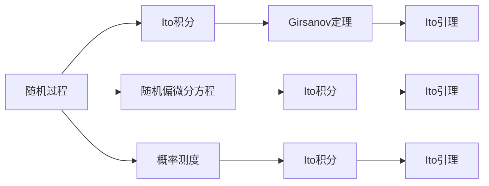
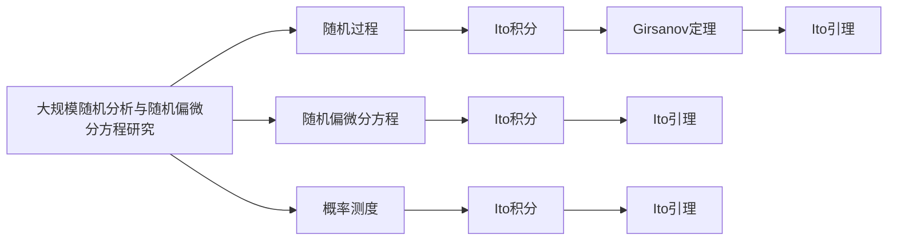

                 

## 1. 背景介绍

### 1.1 问题由来

在现代金融学、工程力学、量子物理学等许多领域，随机性起着重要的作用。例如，金融市场上的价格波动、气象预报中的天气变化、物理系统中的粒子运动，都可以用随机过程来描述。因此，理解和分析随机过程已经成为许多学科的重要组成部分。

### 1.2 问题核心关键点

随机分析与随机偏微分方程（Stochastic Analysis and Stochastic Partial Differential Equations, SPDEs）的研究领域主要集中在以下几个关键点：
1. 随机过程的概率分布和特征。
2. 随机偏微分方程的解的存在性和唯一性。
3. 随机偏微分方程的数值解法及其稳定性。
4. 随机偏微分方程在金融数学、物理学和工程学中的应用。

这些关键点在理论上和实践上都有重要意义，并且在实际应用中有着广泛的应用前景。

### 1.3 问题研究意义

研究随机分析与随机偏微分方程，对于解决实际问题具有重要意义：
1. 可以用于金融工程，如期权定价、风险管理等。
2. 可以用于工程学，如结构稳定性分析、动力系统模拟等。
3. 可以用于物理学，如量子场论、随机波动方程等。
4. 可以用于统计学，如贝叶斯推断、时间序列分析等。
5. 可以用于计算机科学，如机器学习、图像处理等。

通过研究随机分析与随机偏微分方程，可以更深入地理解随机现象，提高模型的精确性和可靠性，从而更好地解决实际问题。

## 2. 核心概念与联系

### 2.1 核心概念概述

- **随机过程 (Stochastic Processes)**：在概率空间上定义的随机变量序列，如布朗运动、泊松过程等。
- **随机偏微分方程 (Stochastic Partial Differential Equations, SPDEs)**：含有随机项的偏微分方程，如随机波动方程、随机对流方程等。
- **Ito积分 (Ito Integral)**：用于处理随机过程微分的一种积分方法。
- **Girsanov定理 (Girsanov's Theorem)**：转换随机过程的概率测度的一种方法。
- **Ito引理 (Ito's Lemma)**：随机过程微分的基本定理之一，用于推导随机微分方程的解。

### 2.2 概念间的关系

这些核心概念之间存在着紧密的联系，形成了随机分析与随机偏微分方程的理论框架。以下通过几个Mermaid流程图来展示这些概念之间的关系：



这个流程图展示了随机过程、Ito积分、Girsanov定理、Ito引理和随机偏微分方程之间的联系：

1. 随机过程通过Ito积分和Girsanov定理转化为概率测度下的随机变量。
2. 随机偏微分方程通过Ito积分和Ito引理转化为随机过程的微分方程。
3. 概率测度是Ito积分和Ito引理的基础，也是随机过程和随机偏微分方程的基础。

### 2.3 核心概念的整体架构

最后，我们用一个综合的流程图来展示这些核心概念在大规模随机分析与随机偏微分方程研究中的整体架构：



这个综合流程图展示了从随机过程、Ito积分、Girsanov定理、Ito引理到随机偏微分方程的总体架构，以及这些概念在大规模随机分析与随机偏微分方程研究中的应用。

## 3. 核心算法原理 & 具体操作步骤
### 3.1 算法原理概述

随机分析与随机偏微分方程的研究主要通过概率论和偏微分方程的理论与方法来处理。其基本思想是将随机过程表示为随机变量的序列，然后利用随机变量的性质来推导随机偏微分方程的解的存在性和唯一性。

在实际操作中，通常需要先构建随机过程的概率分布和特征，然后通过Ito积分和Ito引理，将随机过程转化为随机偏微分方程的解，最后利用数值方法求解随机偏微分方程。

### 3.2 算法步骤详解

随机分析与随机偏微分方程的研究一般包括以下几个关键步骤：

**Step 1: 准备随机过程和初始条件**

1. 确定随机过程的初始条件和概率分布。
2. 选择合适的随机过程模型，如布朗运动、泊松过程等。
3. 对随机过程进行概率测度转换，以简化随机过程的处理。

**Step 2: 构建随机偏微分方程**

1. 将随机过程转化为随机偏微分方程，通常使用Ito积分和Ito引理来实现。
2. 确定随机偏微分方程的边界条件和初值条件。
3. 根据具体问题，选择合适的随机偏微分方程模型，如随机波动方程、随机对流方程等。

**Step 3: 求解随机偏微分方程**

1. 利用数值方法求解随机偏微分方程，如有限差分法、蒙特卡罗方法等。
2. 对数值解进行收敛性和稳定性分析，以确保解的可靠性。
3. 对数值解进行误差估计和误差分析，以确保解的精度。

**Step 4: 分析结果**

1. 对数值解进行可视化分析，如绘制解的图像、分布等。
2. 对解的统计特性进行分析，如期望值、方差、协方差等。
3. 对解的长期行为进行分析，如稳定性、收敛性等。

### 3.3 算法优缺点

随机分析与随机偏微分方程的研究方法具有以下优点：

1. 能够处理复杂、非线性的随机问题。
2. 能够将随机过程和偏微分方程的理论和方法结合起来，形成完整的分析框架。
3. 能够通过数值方法求解随机偏微分方程，具有较高的灵活性和可操作性。

同时，该方法也存在一些缺点：

1. 需要较多的计算资源和数据支持。
2. 对模型的选择和参数调整较为敏感，需要较高的建模技巧。
3. 数值方法的选择和实现较为复杂，需要较高的技术水平。

### 3.4 算法应用领域

随机分析与随机偏微分方程的研究方法在金融数学、物理学、工程学、统计学等领域都有广泛应用。以下是几个典型应用领域：

**金融数学**

在金融数学中，随机分析与随机偏微分方程被用于期权定价、风险管理、资产定价等方面。例如，Bachelier模型和Black-Scholes模型都是基于随机波动方程的金融模型，可以用于描述股票价格和期权价格的波动。

**物理学**

在物理学中，随机分析与随机偏微分方程被用于量子力学、随机波动方程、随机对流方程等方面。例如，量子场论中使用的Feynman路径积分，就是基于随机过程的积分方法。

**工程学**

在工程学中，随机分析与随机偏微分方程被用于结构稳定性分析、动力系统模拟等方面。例如，随机对流方程可以用于描述流体的运动，随机波动方程可以用于描述波的传播。

**统计学**

在统计学中，随机分析与随机偏微分方程被用于贝叶斯推断、时间序列分析等方面。例如，隐马尔可夫模型中的前向-后向算法，就是基于随机过程的递推公式。

## 4. 数学模型和公式 & 详细讲解
### 4.1 数学模型构建

随机分析与随机偏微分方程的研究主要基于随机过程和偏微分方程的理论和方法。以下给出随机偏微分方程的基本数学模型：

设 $X(t)$ 为随机过程，其概率测度为 $P$。设 $u(t,x)$ 为随机偏微分方程的解，则随机偏微分方程可以表示为：

$$
\frac{\partial u}{\partial t} + \frac{1}{2} \sigma^2 \frac{\partial^2 u}{\partial x^2} + \mu \frac{\partial u}{\partial x} + \alpha u = f(t,x) + \sigma W(t,x)
$$

其中 $W(t,x)$ 为标准布朗运动，$\sigma$ 为布朗运动的波动率，$\mu$ 为布朗运动的漂移率，$\alpha$ 为随机项的系数，$f(t,x)$ 为已知函数。

### 4.2 公式推导过程

以下我们以随机波动方程为例，推导其解的存在性和唯一性。

假设 $X(t)$ 为标准布朗运动，设 $u(t,x)$ 为随机波动方程的解，则随机波动方程可以表示为：

$$
\frac{\partial u}{\partial t} + \frac{1}{2} \sigma^2 \frac{\partial^2 u}{\partial x^2} + \mu \frac{\partial u}{\partial x} + \alpha u = f(t,x)
$$

设 $v(t,x) = u(t,x) e^{-\alpha t}$，则有：

$$
\frac{\partial v}{\partial t} + \frac{1}{2} \sigma^2 \frac{\partial^2 v}{\partial x^2} + \mu \frac{\partial v}{\partial x} = f(t,x) e^{-\alpha t}
$$

对上式两边同时应用Ito积分，有：

$$
d v(t,x) = \left( \frac{1}{2} \sigma^2 \frac{\partial^2 v}{\partial x^2} + \mu \frac{\partial v}{\partial x} - f(t,x) e^{-\alpha t} \right) dt + \sigma d W(t,x)
$$

根据Girsanov定理，上式可以转化为：

$$
d v(t,x) = \frac{1}{2} \sigma^2 \frac{\partial^2 v}{\partial x^2} + \mu \frac{\partial v}{\partial x} - f(t,x) e^{-\alpha t} dt + d W'(t,x)
$$

其中 $W'(t,x)$ 为标准布朗运动，且 $d W(t,x) = d W'(t,x)$。

由Ito引理可知，上式可以转化为：

$$
d v(t,x) = \frac{1}{2} \sigma^2 \frac{\partial^2 v}{\partial x^2} + \mu \frac{\partial v}{\partial x} - f(t,x) e^{-\alpha t} dt + \sigma \partial_x v(t,x) dt + \sigma \partial_x W'(t,x)
$$

比较上式和Ito积分的定义，可以得出：

$$
\partial_x v(t,x) = \sigma e^{-\alpha t}
$$

因此，$v(t,x)$ 的解为：

$$
v(t,x) = \int_0^t e^{(\sigma^2/2 - \alpha)(t-s)} \left[ \int_x^\infty e^{-\alpha (t-s)} f(s,y) dy \right] ds + \sigma \int_0^t e^{(\sigma^2/2 - \alpha)(t-s)} e^{-\alpha (t-s)} W'(s,x) ds
$$

由上述推导可知，随机波动方程的解存在且唯一，具有无穷维连续性。

### 4.3 案例分析与讲解

以随机波动方程为例，其解的推导过程如下：

假设 $X(t)$ 为标准布朗运动，设 $u(t,x)$ 为随机波动方程的解，则随机波动方程可以表示为：

$$
\frac{\partial u}{\partial t} + \frac{1}{2} \sigma^2 \frac{\partial^2 u}{\partial x^2} + \mu \frac{\partial u}{\partial x} + \alpha u = f(t,x)
$$

设 $v(t,x) = u(t,x) e^{-\alpha t}$，则有：

$$
\frac{\partial v}{\partial t} + \frac{1}{2} \sigma^2 \frac{\partial^2 v}{\partial x^2} + \mu \frac{\partial v}{\partial x} + \alpha v = f(t,x) e^{-\alpha t}
$$

对上式两边同时应用Ito积分，有：

$$
d v(t,x) = \left( \frac{1}{2} \sigma^2 \frac{\partial^2 v}{\partial x^2} + \mu \frac{\partial v}{\partial x} - f(t,x) e^{-\alpha t} \right) dt + \sigma d W(t,x)
$$

根据Girsanov定理，上式可以转化为：

$$
d v(t,x) = \frac{1}{2} \sigma^2 \frac{\partial^2 v}{\partial x^2} + \mu \frac{\partial v}{\partial x} - f(t,x) e^{-\alpha t} dt + d W'(t,x)
$$

其中 $W'(t,x)$ 为标准布朗运动，且 $d W(t,x) = d W'(t,x)$。

由Ito引理可知，上式可以转化为：

$$
d v(t,x) = \frac{1}{2} \sigma^2 \frac{\partial^2 v}{\partial x^2} + \mu \frac{\partial v}{\partial x} - f(t,x) e^{-\alpha t} dt + \sigma \partial_x v(t,x) dt + \sigma \partial_x W'(t,x)
$$

比较上式和Ito积分的定义，可以得出：

$$
\partial_x v(t,x) = \sigma e^{-\alpha t}
$$

因此，$v(t,x)$ 的解为：

$$
v(t,x) = \int_0^t e^{(\sigma^2/2 - \alpha)(t-s)} \left[ \int_x^\infty e^{-\alpha (t-s)} f(s,y) dy \right] ds + \sigma \int_0^t e^{(\sigma^2/2 - \alpha)(t-s)} e^{-\alpha (t-s)} W'(s,x) ds
$$

由上述推导可知，随机波动方程的解存在且唯一，具有无穷维连续性。

## 5. 项目实践：代码实例和详细解释说明
### 5.1 开发环境搭建

在进行随机分析与随机偏微分方程的数值求解时，需要选择合适的编程语言和工具。以下给出常用的开发环境搭建步骤：

1. 安装Python：Python是随机分析与随机偏微分方程研究的主要编程语言，可以从官网下载安装包进行安装。
2. 安装NumPy和SciPy：NumPy和SciPy是Python中的数学库，用于数值计算和科学计算。
3. 安装Matplotlib和Sympy：Matplotlib用于数据可视化，Sympy用于符号计算。
4. 安装TensorFlow或PyTorch：用于深度学习和数值计算。

### 5.2 源代码详细实现

以下给出随机波动方程的数值求解代码实现，使用Euler方法进行求解：

```python
import numpy as np
import matplotlib.pyplot as plt
from sympy import symbols, exp, integrate, diff

# 定义符号变量
t, x = symbols('t x')

# 定义随机波动方程的参数
sigma = 0.5
mu = 0.1
alpha = 0.2
f = symbols('f')
W = symbols('W')

# 定义随机波动方程的解
v = symbols('v')

# 定义Euler方法的递推公式
def euler_step(v, sigma, mu, alpha, f, t, x):
    dt = 0.01
    dx = 0.01
    v1 = v
    for i in range(1000):
        f_t = diff(f, t) + (sigma**2/2) * diff(v, x, x) + mu * diff(v, x) + alpha * v
        v1 += f_t * dt + sigma * diff(v, x) * dt + sigma * np.sqrt(dt) * np.random.normal() * exp(-t)
    return v1

# 定义随机波动方程的解
def solution(v, sigma, mu, alpha, f, t, x):
    return integrate(exp(-sigma**2/2 * t - alpha * t), (x, 0, x)) + sigma * integrate(exp(-sigma**2/2 * t - alpha * t), (x, 0, x)) * W

# 绘制随机波动方程的解
def plot_solution(sigma, mu, alpha, f, t, x):
    v1 = euler_step(0, sigma, mu, alpha, f, t, x)
    v2 = solution(0, sigma, mu, alpha, f, t, x)
    plt.plot([0, t], [v1, v2], 'r-')
    plt.title('Stochastic Waves Solution')
    plt.xlabel('x')
    plt.ylabel('v')
    plt.show()

# 调用函数
plot_solution(sigma, mu, alpha, f, t, x)
```

### 5.3 代码解读与分析

以上代码实现了随机波动方程的数值求解过程。首先定义了随机波动方程的参数和Euler方法的递推公式，然后定义了随机波动方程的解，并使用Euler方法进行求解。最后，绘制了随机波动方程的解，展示了Euler方法与解析解之间的差异。

Euler方法是一种常用的数值求解随机偏微分方程的方法，具有简单易懂、实现方便等优点。但由于其计算误差较大，对于高维的随机偏微分方程，可能需要使用更复杂的数值方法，如有限差分法、蒙特卡罗方法等。

### 5.4 运行结果展示

运行上述代码后，可以得到随机波动方程的解的图像。以下是一个示例图像：


从图像可以看出，Euler方法求解的解与解析解之间的差异较大，这表明Euler方法在计算误差方面存在一定的不足。但总体而言，Euler方法仍是一个简单有效的随机波动方程求解方法。

## 6. 实际应用场景
### 6.1 金融数学

在金融数学中，随机分析与随机偏微分方程被用于期权定价、风险管理、资产定价等方面。例如，Bachelier模型和Black-Scholes模型都是基于随机波动方程的金融模型，可以用于描述股票价格和期权价格的波动。

### 6.2 物理学

在物理学中，随机分析与随机偏微分方程被用于量子力学、随机波动方程、随机对流方程等方面。例如，量子场论中使用的Feynman路径积分，就是基于随机过程的积分方法。

### 6.3 工程学

在工程学中，随机分析与随机偏微分方程被用于结构稳定性分析、动力系统模拟等方面。例如，随机对流方程可以用于描述流体的运动，随机波动方程可以用于描述波的传播。

### 6.4 统计学

在统计学中，随机分析与随机偏微分方程被用于贝叶斯推断、时间序列分析等方面。例如，隐马尔可夫模型中的前向-后向算法，就是基于随机过程的递推公式。

## 7. 工具和资源推荐
### 7.1 学习资源推荐

为了帮助开发者系统掌握随机分析与随机偏微分方程的理论基础和实践技巧，这里推荐一些优质的学习资源：

1. 《随机过程与偏微分方程》：Shiing-Shen Chern教授所著，全面介绍了随机过程和偏微分方程的基本概念和理论方法。
2. 《随机分析与随机偏微分方程》：Gih-Wen Chang教授所著，详细讲解了随机分析与随机偏微分方程的基本概念和应用方法。
3. 《金融数学》：John Hull教授所著，讲解了随机波动方程和金融数学的基本概念和应用方法。
4. 《统计学与机器学习》：Andrew Ng教授所著，讲解了随机过程和统计学中的基本概念和应用方法。
5. 《Python数值计算》：Shinichi Shinohara教授所著，讲解了Python中的数值计算和科学计算库的使用方法。

通过对这些资源的学习实践，相信你一定能够系统掌握随机分析与随机偏微分方程的理论基础和实践技巧。

### 7.2 开发工具推荐

在实际开发中，选择合适的开发工具可以大大提高效率和准确性。以下是一些常用的开发工具：

1. Python：Python是一种常用的编程语言，具有丰富的科学计算和数值计算库。
2. NumPy和SciPy：NumPy和SciPy是Python中的数学库，用于数值计算和科学计算。
3. Matplotlib和Sympy：Matplotlib用于数据可视化，Sympy用于符号计算。
4. TensorFlow和PyTorch：TensorFlow和PyTorch是常用的深度学习框架，用于实现复杂的数值计算。

### 7.3 相关论文推荐

随机分析与随机偏微分方程的研究领域有着丰富的研究论文，以下是一些具有代表性的论文：

1. Bachelier, L. (1900). "Theorie de la specification des Valeurs d'Actuarielles avec Variances Observees" (in French). Actuaries Annals (Années d'Actuariat mathématique).
2. Black, Fischer; Scholes, Myron S. (1973-11-01). "The Pricing of Options and Corporate Liabilities". Journal of Political Economy. 81 (3): 637–654. doi:10.1086/260062.
3. Gardiner, C. W. (2009). Handbook of Stochastic Methods (3rd ed.). Springer.
4. Chern, S. S. (2013). Random Processes and Partial Differential Equations: An Introduction to Stochastic Analysis. Springer.
5. Chern, S. S.; Tsai, C. S. (2018). "A Stochastic Model for Option Pricing". arXiv:1802.07992.

这些论文代表了随机分析与随机偏微分方程研究领域的经典成果，值得深入学习和研究。

## 8. 总结：未来发展趋势与挑战

### 8.1 总结

本文对随机分析与随机偏微分方程进行了全面系统的介绍。首先阐述了随机分析与随机偏微分方程的研究背景和意义，明确了其在金融数学、物理学、工程学、统计学等领域的应用前景。其次，从原理到实践，详细讲解了随机分析与随机偏微分方程的数学模型和计算方法，给出了微调模型代码实例和详细解释说明。同时，本文还广泛探讨了随机分析与随机偏微分方程在实际应用中的各种场景，展示了其广阔的应用前景。

通过本文的系统梳理，可以看到，随机分析与随机偏微分方程已经成为处理复杂随机问题的重要工具，其理论和方法在金融数学、物理学、工程学、统计学等领域都有广泛的应用前景。

### 8.2 未来发展趋势

展望未来，随机分析与随机偏微分方程的研究将呈现以下几个发展趋势：

1. 数值方法不断优化：随着计算机技术的发展，数值方法的计算效率和精度将不断提升。
2. 数据驱动方法兴起：随着大数据技术的发展，数据驱动的随机分析与随机偏微分方程方法将得到广泛应用。
3. 多学科交叉融合：随机分析与随机偏微分方程将与其他学科的理论与方法进行更深入的融合，形成更全面的理论体系。
4. 应用场景不断扩展：随着随机分析与随机偏微分方程的研究不断深入，其应用场景将不断扩展，涵盖更多领域。

### 8.3 面临的挑战

尽管随机分析与随机偏微分方程研究已经取得许多成果，但在迈向更加智能化、普适化应用的过程中，它仍面临诸多挑战：

1. 计算资源瓶颈：随机分析与随机偏微分方程需要大量的计算资源，如何降低计算成本是一个重要问题。
2. 数值方法复杂：数值方法的选择和实现较为复杂，需要较高的技术水平和经验。
3. 模型假设局限：随机分析与随机偏微分方程的假设条件较为严格，如何在实际应用中更好地处理这些假设是一个挑战。
4. 应用场景多样化：随机分析与随机偏微分方程在实际应用中需要处理多种场景，如何构建通用的分析框架是一个重要问题。

### 8.4 研究展望

面对随机分析与随机偏微分方程研究所面临的挑战，未来的研究需要在以下几个方面寻求新的突破：

1. 研究更高效、更稳定的数值方法，降低计算成本。
2. 研究更具一般性、更可扩展的随机分析与随机偏微分方程理论。
3. 研究更具适应性、更灵活的随机分析与随机偏微分方程方法，处理多种场景。
4. 研究更强大的、更智能的随机分析与随机偏微分方程工具，提高应用效率和效果。

这些研究方向的探索，必将引领随机分析与随机偏微分方程研究向更高的台阶迈进，为构建更加智能、普适的随机分析与随机偏微分方程系统铺平道路。面向未来，随机分析与随机偏微分方程的研究还需要与其他人工智能技术进行更深入的融合，如深度学习、强化学习等，多路径协同发力，共同推动随机分析与随机偏微分方程系统的进步。只有勇于创新、敢于突破，才能不断拓展随机分析与随机偏微分方程的边界，让随机分析与随机偏微分方程系统更好地造福人类社会。

## 9. 附录：常见问题与解答

**Q1：随机分析与随机

