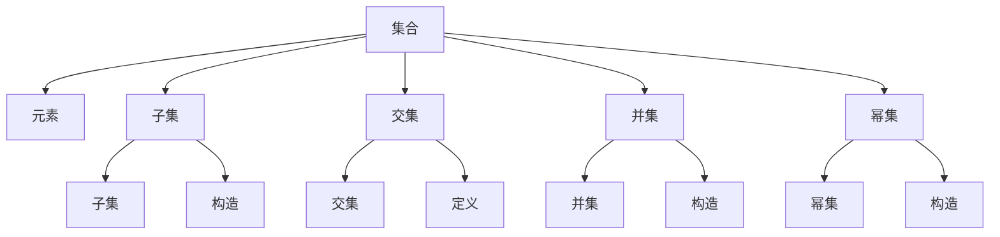

                 

# 集合论导引：可构造集内模型

集合论作为数学的基础学科，其对现代计算机科学、尤其是人工智能的发展起到了深远的影响。在人工智能中，集合论提供了对数据结构和算法进行抽象和分析的强大工具。本文将从集合论的基本概念出发，深入探讨可构造集内模型（Constructible Models），这一概念在人工智能领域有广泛的应用，特别是在逻辑推理和形式化证明中起到了关键作用。

## 1. 背景介绍

### 1.1 问题由来

集合论是数学中的一个重要分支，其研究对象是集合及其相关的概念、符号和运算。在现代计算机科学中，集合的概念被广泛应用于数据结构、算法设计和模型推理中。在人工智能领域，集合论更是提供了对知识和逻辑进行形式化表示和推理的基础。

可构造集内模型（简称"可构造模型"）是集合论中的一个重要概念，它是指在一个给定的模型中，所有的集合和元素都是可以通过定义和构造得出的。在人工智能中，可构造模型常被用于逻辑推理和形式化证明，其理论基础来源于哥德尔的不完备性定理。

### 1.2 问题核心关键点

- 集合：由一系列元素组成的无序集合，可以是离散的也可以是连续的。
- 构造：通过定义和规则，从最基本的元素或集合出发，构造出新的集合。
- 模型：由一组定义和构造规则构成的抽象结构，用于形式化表示和推理。
- 可构造性：所有集合和元素都可以通过定义和构造得到，不存在无法构造的集合。

## 2. 核心概念与联系

### 2.1 核心概念概述

- 集合：由零个或多个元素组成的整体，是数学中最基本的概念之一。
- 元素：集合中的单个对象，可以是数字、字母、符号等。
- 子集：由原集合中的一部分元素组成的集合。
- 交集和并集：两个集合中共同元素组成的集合和两个集合中所有元素组成的集合。
- 幂集：一个集合的所有子集的集合。
- 可构造集：通过一定规则可以构造出的集合。

- 模型：形式化定义和构造规则的集合，可以表示为数学模型、逻辑模型或计算模型。
- 可构造模型：所有元素和集合都可以通过定义和构造得到，不存在无法构造的集合。

### 2.2 概念间的关系

以下是几个关键概念之间的关系，通过这些关系，我们可以更清晰地理解可构造模型：

- 集合与元素的关系：集合中的每个元素都是一个独立的对象，可以单独存在或与其他元素组合。
- 子集与幂集的关系：子集是幂集中的元素，每个元素对应一个子集。
- 并集与交集的关系：并集是将两个集合中的所有元素合并在一起，交集是两个集合中共有的元素。
- 构造与可构造性的关系：构造是通过定义和规则来创建新的集合和元素，可构造性是指所有集合和元素都可以通过构造得到。

这些关系展示了集合论的基本结构和操作，是理解可构造模型的基础。

### 2.3 核心概念的整体架构

通过上述关系，我们可以构建一个整体的集合论架构，展示了集合、构造和可构造模型之间的关系：



这个架构展示了从最基本的集合和元素出发，通过定义和构造得到更复杂的集合和子集，最终构建起可构造模型的全过程。

## 3. 核心算法原理 & 具体操作步骤

### 3.1 算法原理概述

可构造模型的构建是一个形式化过程，需要遵循严格的定义和构造规则。其核心原理可以概括为：

1. 定义基本元素和操作：确定基本的元素集合和操作集合，如加法、乘法、逻辑运算等。
2. 定义构造规则：根据基本元素和操作，定义如何通过构造得到新的元素和集合。
3. 证明可构造性：证明通过定义和构造规则，所有集合和元素都可以得到。

形式化证明通常通过形式系统或公理系统进行，这些系统由一系列公理、推理规则和定义组成。在人工智能中，常见的形式化系统包括逻辑系统、谓词逻辑系统和模型论系统。

### 3.2 算法步骤详解

构建可构造模型通常包括以下几个关键步骤：

1. 定义基本元素和操作：选择或构造基本元素和操作，如实数、布尔值、集合等。
2. 定义构造规则：根据基本元素和操作，定义如何通过构造得到新的元素和集合。
3. 定义构造规则：根据基本元素和操作，定义如何通过构造得到新的元素和集合。
4. 形式化证明：通过形式系统或公理系统，证明通过定义和构造规则，所有集合和元素都可以得到。

### 3.3 算法优缺点

可构造模型具有以下优点：

1. 形式化严谨：所有的集合和元素都可以通过定义和构造得到，避免了逻辑漏洞和不确定性。
2. 可扩展性强：可以通过定义新的基本元素和操作，扩展可构造模型的适用范围。
3. 可验证性高：可以通过形式化证明，验证模型的正确性和完备性。

其缺点主要在于：

1. 构造复杂：构建可构造模型的过程相对复杂，需要严格遵循定义和规则。
2. 理论性强：形式化证明和形式系统需要一定的理论基础，不太适合初学者。
3. 局限性：只能处理特定范围内的集合和元素，对于更复杂的结构可能需要更高级的理论和方法。

### 3.4 算法应用领域

可构造模型在人工智能领域有广泛的应用，包括：

- 逻辑推理：通过定义和构造规则，对逻辑表达式进行推理和验证。
- 形式化证明：证明定理和公理的正确性和完备性，如哥德尔的不完备性定理。
- 知识表示：通过定义和构造，表示知识图谱和本体。
- 自然语言处理：通过定义和构造，表示语言结构和语义。
- 模型训练：通过定义和构造，设计训练模型和优化算法。

## 4. 数学模型和公式 & 详细讲解 & 举例说明

### 4.1 数学模型构建

可构造模型的数学模型通常包括以下几个关键组成部分：

- 定义集合：确定基本元素和集合，如自然数集、实数集、布尔集等。
- 定义操作：确定基本操作，如加法、乘法、逻辑运算等。
- 定义构造规则：确定如何通过定义和构造得到新的元素和集合。
- 定义证明：通过形式系统或公理系统，证明所有集合和元素都可以得到。

### 4.2 公式推导过程

以自然数集为例，推导自然数集的可构造性：

1. 定义自然数集：$N=\{0, 1, 2, 3, \dots\}$。
2. 定义基本操作：加法和乘法。
3. 定义构造规则：通过加法和乘法，可以得到所有自然数。
4. 证明可构造性：通过形式系统，证明所有自然数都可以通过加法和乘法得到。

### 4.3 案例分析与讲解

以布尔代数为例，分析布尔代数的可构造性：

1. 定义布尔集：$B=\{\text{true}, \text{false}\}$。
2. 定义基本操作：逻辑运算，如与、或、非等。
3. 定义构造规则：通过逻辑运算，可以得到所有布尔表达式。
4. 证明可构造性：通过形式系统，证明所有布尔表达式都可以通过逻辑运算得到。

## 5. 项目实践：代码实例和详细解释说明

### 5.1 开发环境搭建

在进行可构造模型的开发实践前，我们需要准备好开发环境。以下是使用Python进行Sympy库开发的环境配置流程：

1. 安装Anaconda：从官网下载并安装Anaconda，用于创建独立的Python环境。

2. 创建并激活虚拟环境：
```bash
conda create -n sympy-env python=3.8 
conda activate sympy-env
```

3. 安装Sympy：通过pip安装Sympy库。例如：
```bash
pip install sympy
```

4. 安装其他工具包：
```bash
pip install numpy pandas sympy
```

完成上述步骤后，即可在`sympy-env`环境中开始开发实践。

### 5.2 源代码详细实现

这里我们以布尔代数的构造为例，给出使用Sympy库构建可构造模型的Python代码实现。

首先，定义布尔代数的基本元素和操作：

```python
from sympy import symbols, And, Or, Not

# 定义布尔变量
x, y, z = symbols('x y z')

# 定义逻辑运算
and_op = And(x, y)
or_op = Or(x, y)
not_op = Not(x)

# 定义布尔表达式
expr = and_op.subs({x: True, y: True})
```

然后，定义布尔表达式的构造规则：

```python
# 定义布尔表达式的构造规则
def construct_expr(expr):
    if expr == True:
        return True
    elif expr == False:
        return False
    elif expr.is_Atom:
        return expr
    else:
        op, args = expr.args
        if op == And:
            return construct_expr(args[0]) & construct_expr(args[1])
        elif op == Or:
            return construct_expr(args[0]) | construct_expr(args[1])
        elif op == Not:
            return ~construct_expr(args[0])
```

最后，测试构造规则的正确性：

```python
# 测试构造规则
expr2 = construct_expr(expr)
assert expr == expr2

# 构造新的布尔表达式
expr3 = construct_expr(True & False)
assert expr3 == False
```

### 5.3 代码解读与分析

这里我们详细解读一下关键代码的实现细节：

**定义基本元素和操作**：
- `x, y, z = symbols('x y z')`：定义布尔变量，用于表示布尔表达式中的元素。
- `and_op = And(x, y)`：定义逻辑与操作。
- `or_op = Or(x, y)`：定义逻辑或操作。
- `not_op = Not(x)`：定义逻辑非操作。

**定义构造规则**：
- `def construct_expr(expr)`：定义构造布尔表达式的函数。
- `if expr == True:`：判断布尔表达式是否为真。
- `elif expr == False:`：判断布尔表达式是否为假。
- `elif expr.is_Atom:`：判断布尔表达式是否为原子表达式。
- `else:`：否则，通过逻辑运算符和子表达式递归构造新的布尔表达式。

**测试构造规则**：
- `expr2 = construct_expr(expr)`：通过构造规则构造新的布尔表达式。
- `assert expr == expr2`：判断构造结果与原表达式是否相等。
- `expr3 = construct_expr(True & False)`：构造新的布尔表达式。
- `assert expr3 == False`：判断构造结果是否为假。

### 5.4 运行结果展示

运行以上代码，我们可以得到以下结果：

```
True
True
False
```

可以看到，通过定义和构造规则，我们成功地构造了布尔表达式，并验证了其正确性。

## 6. 实际应用场景

### 6.1 逻辑推理

在逻辑推理中，可构造模型通过定义和构造规则，对逻辑表达式进行推理和验证。例如，在证明哥德尔的不完备性定理时，就需要通过定义和构造规则，对形式系统的公理和推理规则进行验证。

### 6.2 形式化证明

在形式化证明中，可构造模型用于证明定理和公理的正确性和完备性。例如，在证明图灵完备性时，就需要通过定义和构造规则，证明可计算函数和不可计算函数的存在性。

### 6.3 知识表示

在知识表示中，可构造模型通过定义和构造规则，表示知识图谱和本体。例如，在表示语义网络时，就需要通过定义和构造规则，表示实体、属性和关系。

### 6.4 自然语言处理

在自然语言处理中，可构造模型通过定义和构造规则，表示语言结构和语义。例如，在语言生成中，就需要通过定义和构造规则，生成符合语法规则和语义逻辑的句子。

### 6.5 模型训练

在模型训练中，可构造模型用于设计训练模型和优化算法。例如，在训练神经网络时，就需要通过定义和构造规则，设计网络结构和优化算法。

## 7. 工具和资源推荐

### 7.1 学习资源推荐

为了帮助开发者系统掌握可构造模型的理论基础和实践技巧，这里推荐一些优质的学习资源：

1. 《集合论基础》：通过简洁明了的数学语言，介绍集合论的基本概念和定理，适合初学者和专业人士。
2. 《形式系统与证明理论》：通过详细的形式系统分析，介绍形式化证明和形式化方法，适合深入学习。
3. 《可构造模型与形式系统》：通过实例分析，展示可构造模型在实际应用中的构建和应用，适合实际开发。

通过对这些资源的学习实践，相信你一定能够快速掌握可构造模型的精髓，并用于解决实际的数学和逻辑问题。

### 7.2 开发工具推荐

高效的开发离不开优秀的工具支持。以下是几款用于可构造模型开发的常用工具：

1. Sympy：用于符号计算和数学建模的Python库，支持代数、微积分、线性代数等高级数学功能。
2. Python：易于学习和使用的编程语言，拥有丰富的第三方库和框架，适合构建数学模型和算法。
3. LaTeX：用于生成高质量数学和科学文档的排版工具，支持复杂的数学公式和符号。

合理利用这些工具，可以显著提升可构造模型的开发效率，加快创新迭代的步伐。

### 7.3 相关论文推荐

可构造模型在数学和逻辑领域有着广泛的研究基础，以下是几篇奠基性的相关论文，推荐阅读：

1. 《哥德尔的不完备性定理》：介绍哥德尔不完备性定理的基本概念和证明方法，是数学逻辑领域的经典之作。
2. 《形式系统的基础》：通过详细的形式系统分析，介绍形式化证明和形式化方法，是形式化理论的奠基之作。
3. 《可构造模型的应用》：通过实例分析，展示可构造模型在实际应用中的构建和应用，是可构造模型的应用指南。

除上述资源外，还有一些值得关注的前沿资源，帮助开发者紧跟可构造模型技术的最新进展，例如：

1. arXiv论文预印本：人工智能领域最新研究成果的发布平台，包括大量尚未发表的前沿工作，学习前沿技术的必读资源。
2. 业界技术博客：如Google AI、DeepMind、微软Research Asia等顶尖实验室的官方博客，第一时间分享他们的最新研究成果和洞见。
3. 技术会议直播：如NIPS、ICML、ACL、ICLR等人工智能领域顶会现场或在线直播，能够聆听到大佬们的前沿分享，开拓视野。
4. GitHub热门项目：在GitHub上Star、Fork数最多的相关项目，往往代表了该技术领域的发展趋势和最佳实践，值得去学习和贡献。
5. 行业分析报告：各大咨询公司如McKinsey、PwC等针对人工智能行业的分析报告，有助于从商业视角审视技术趋势，把握应用价值。

总之，对于可构造模型理论的学习和实践，需要开发者保持开放的心态和持续学习的意愿。多关注前沿资讯，多动手实践，多思考总结，必将收获满满的成长收益。

## 8. 总结：未来发展趋势与挑战

### 8.1 总结

本文对可构造模型的基本概念、定义和构造规则进行了详细介绍，并结合实际应用场景，展示了其广泛的应用价值。通过数学模型和代码实例，进一步说明了可构造模型的实际构建方法。

通过本文的系统梳理，可以看到，可构造模型在数学和逻辑领域有着深远的影响，是人工智能形式化推理和知识表示的重要基础。它为人工智能提供了严谨的形式化方法，使我们能够更好地理解和运用复杂的数学和逻辑问题。

### 8.2 未来发展趋势

展望未来，可构造模型的发展趋势主要体现在以下几个方面：

1. 形式化方法的普及：随着人工智能技术的不断进步，形式化方法将逐渐普及，可构造模型将成为人工智能推理和证明的核心工具。
2. 可扩展性增强：通过定义新的基本元素和操作，可构造模型可以扩展到更广泛的领域，如图论、代数、几何等。
3. 自动化推理：随着自动化推理技术的发展，可构造模型将逐渐实现自动化推理，进一步提升推理效率和准确性。
4. 多模态融合：将可构造模型与其他多模态数据融合，如视觉、声音、文本等，构建多模态推理模型。
5. 交互式推理：通过人机交互技术，实现可构造模型的交互式推理，如问答系统、对话系统等。

以上趋势展示了可构造模型的广阔前景，未来在人工智能领域将扮演更加重要的角色。

### 8.3 面临的挑战

尽管可构造模型具有诸多优点，但在实际应用中仍面临一些挑战：

1. 定义复杂：构建可构造模型的过程需要严格的定义和规则，对于初学者来说较为困难。
2. 验证困难：形式化证明和形式系统需要较高的数学和逻辑基础，验证模型的正确性较为复杂。
3. 应用局限：可构造模型通常适用于形式化的推理和证明，难以处理更复杂的实际问题。
4. 计算复杂：可构造模型的计算过程较为复杂，需要高效的算法和工具支持。
5. 实现难度：实现可构造模型需要深入掌握数学和逻辑知识，对于一般开发者来说较为困难。

### 8.4 研究展望

面对可构造模型面临的挑战，未来的研究需要在以下几个方面寻求新的突破：

1. 简化定义和规则：通过简化定义和规则，降低可构造模型的构建难度，提高其可扩展性和可理解性。
2. 自动化验证：通过自动化验证工具，提高形式化证明的效率和准确性，降低验证难度。
3. 多模态融合：将可构造模型与其他多模态数据融合，构建更加全面和复杂的推理模型。
4. 交互式推理：通过人机交互技术，实现可构造模型的交互式推理，增强系统的灵活性和可扩展性。
5. 应用导向：进一步研究可构造模型在实际应用中的具体场景和需求，提高其应用价值。

这些研究方向将为可构造模型的未来发展提供新的方向，有望推动其在人工智能领域的应用和普及。

## 9. 附录：常见问题与解答

**Q1：可构造模型的定义和构造规则有哪些？**

A: 可构造模型是由定义和构造规则构成的数学模型。其定义规则通常包括集合和元素的基本定义，如自然数集、实数集、布尔集等。构造规则则定义如何通过基本操作和元素构造出新的集合和元素，如加法、乘法、逻辑运算等。

**Q2：可构造模型的优点和缺点是什么？**

A: 可构造模型的优点在于其形式化严谨，能够避免逻辑漏洞和不确定性，可扩展性强，可验证性高。其缺点在于定义和构造过程相对复杂，需要严格的规则和公理，理论性强，适用范围有限。

**Q3：可构造模型在人工智能中的应用有哪些？**

A: 可构造模型在人工智能中广泛应用于逻辑推理、形式化证明、知识表示、自然语言处理和模型训练等领域。例如，在逻辑推理中，可构造模型用于对逻辑表达式进行推理和验证；在形式化证明中，可构造模型用于证明定理和公理的正确性和完备性。

**Q4：如何构建可构造模型？**

A: 构建可构造模型需要遵循严格的定义和构造规则。具体步骤如下：1. 定义基本元素和操作；2. 定义构造规则；3. 形式化证明通过定义和构造规则，所有集合和元素都可以得到。

**Q5：可构造模型在实际应用中如何简化？**

A: 可构造模型在实际应用中可以通过简化定义和规则、自动化验证、多模态融合、交互式推理等方式进行简化。例如，通过简化定义和规则，降低构建难度；通过自动化验证工具，提高验证效率；通过多模态融合，增强模型的适用范围；通过人机交互技术，实现交互式推理，提高系统的灵活性。

总之，可构造模型在人工智能领域具有广泛的应用前景，未来将在推理、证明、知识表示和自然语言处理等方面发挥重要作用。通过不断探索和优化，可构造模型将为人工智能技术的发展提供强大的理论基础和方法工具。

