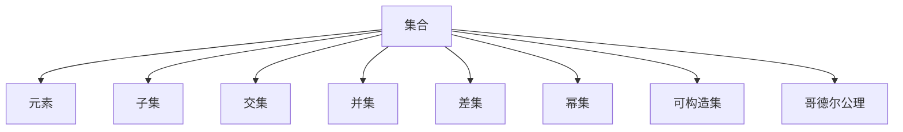
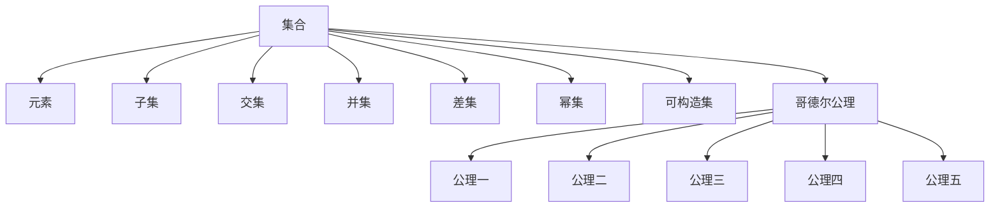

                 

# 集合论导引：哥德尔集合运算与可构造集公理

## 1. 背景介绍

### 1.1 问题由来
集合论是数学的基础，也是计算机科学中不可或缺的组成部分。它研究的是集合的性质、运算和构造等核心问题。其中，哥德尔集合运算和可构造集公理是集合论中的重要概念，对计算机科学，尤其是计算机逻辑、程序验证等领域有着深远影响。

### 1.2 问题核心关键点
哥德尔集合运算与可构造集公理的核心在于：
1. 如何定义集合及其运算；
2. 如何保证集合的构造性，即构造一个集合的过程是可计算的；
3. 如何验证集合的性质，如元素是否满足某种条件。

这些问题不仅对数学理论的构建至关重要，也是计算机科学中算法设计和程序验证的基础。通过理解这些概念，可以更深刻地理解计算机语言、算法和逻辑系统的本质。

### 1.3 问题研究意义
研究哥德尔集合运算与可构造集公理，对于提升数学理论的严谨性、推动计算机科学的算法设计和程序验证等领域具有重要意义：
1. 数学严谨性：这些概念为数学理论的建立提供了严密的逻辑基础。
2. 算法设计：理解和应用这些概念，可以设计出更高效、更可靠的算法。
3. 程序验证：通过验证程序逻辑是否符合哥德尔运算规则，可以发现潜在的错误，保证程序的正确性。
4. 编程语言：理解集合运算的原理，可以设计更加灵活、强大的编程语言。
5. 逻辑系统：为逻辑系统的构建提供了理论支持，如LISP、Prolog等。

## 2. 核心概念与联系

### 2.1 核心概念概述

为了更清晰地理解哥德尔集合运算与可构造集公理，本节将介绍几个关键概念：

- 集合(Maxset)：由元素组成的无序集合，可以是有限集或无限集。
- 元素(Element)：集合中的基本单元，可以是数字、字符、对象等。
- 子集(Subset)：属于某个集合的元素组成的集合。
- 交集(Intersection)：两个集合中共有的元素组成的集合。
- 并集(Union)：两个集合中所有元素组成的集合。
- 差集(Difference)：属于某个集合但不属于另一个集合的元素组成的集合。
- 幂集(Power Set)：某个集合所有子集的集合。
- 可构造集(Constructible Set)：可以通过计算过程构造的集合。
- 哥德尔公理(Gödel Axioms)：构成数学基础集合论的公理系统。

这些概念之间存在着紧密的联系，共同构成了集合论的核心内容。

### 2.2 概念间的关系

这些核心概念之间的关系可以通过以下Mermaid流程图来展示：



这个流程图展示了大集合及其基本运算之间的关系：

1. 集合由元素组成。
2. 子集、交集、并集、差集、幂集等都是集合的运算。
3. 可构造集是可以通过计算过程构造的集合。
4. 哥德尔公理构成了集合论的理论基础。

### 2.3 核心概念的整体架构

最后，我们用一个综合的流程图来展示这些核心概念在大集合运算中的整体架构：



这个综合流程图展示了从集合运算到哥德尔公理的逻辑关系：

1. 集合通过哥德尔公理构成理论基础。
2. 公理一、二、三、四、五描述了集合的基本性质和运算规则。
3. 可构造集是基于哥德尔公理构造的集合。

通过这些流程图，我们可以更清晰地理解集合论中哥德尔集合运算与可构造集公理的核心概念及其关系。

## 3. 核心算法原理 & 具体操作步骤
### 3.1 算法原理概述

哥德尔集合运算与可构造集公理的核心算法原理包括以下几个关键点：

1. 定义集合：集合是由元素构成的无序集合，可以表示为 $S = \{x | x \in X\}$，其中 $X$ 为元素集合。
2. 子集：如果集合 $B$ 中的所有元素都在集合 $A$ 中，则称 $B$ 为 $A$ 的子集，记为 $B \subseteq A$。
3. 交集：集合 $A$ 与 $B$ 的交集是包含两个集合中所有元素的集合，记为 $A \cap B = \{x | x \in A \land x \in B\}$。
4. 并集：集合 $A$ 与 $B$ 的并集是包含两个集合中所有元素的集合，记为 $A \cup B = \{x | x \in A \lor x \in B\}$。
5. 差集：集合 $A$ 与 $B$ 的差集是包含所有属于 $A$ 但不属于 $B$ 的元素的集合，记为 $A - B = \{x | x \in A \land x \notin B\}$。
6. 幂集：集合 $A$ 的幂集是包含 $A$ 所有子集的集合，记为 $P(A) = \{S | S \subseteq A\}$。
7. 可构造集：如果一个集合可以通过计算过程构造出来，那么它就是可构造集。
8. 哥德尔公理：
   - 公理一：任何集合都属于自身的幂集，即 $A \in P(A)$。
   - 公理二：集合的幂集是自身的子集，即 $P(A) \subseteq A$。
   - 公理三：任意集合 $A$ 和 $B$，若 $B \in P(A)$，则 $B$ 中的元素均为 $A$ 的元素，即 $B \subseteq A$。
   - 公理四：任何集合 $A$ 和 $B$，若 $A \cap B = A$，则 $A \subseteq B$。
   - 公理五：任何集合 $A$ 和 $B$，若 $A \cap B = B$，则 $B \subseteq A$。

### 3.2 算法步骤详解

以下以集合的交集运算为例，详细讲解哥德尔集合运算的算法步骤：

1. 定义集合 $A$ 和 $B$。
2. 确定交集的元素。交集的元素是 $A$ 和 $B$ 中同时存在的元素。
3. 构造交集集合 $C = \{x | x \in A \land x \in B\}$。
4. 验证交集的性质：$C$ 是 $A$ 和 $B$ 的子集，且 $C \subseteq A \cap B$。

具体步骤如下：

1. 创建一个空集 $C = \emptyset$。
2. 遍历集合 $A$，如果元素 $x$ 也在集合 $B$ 中，则将其添加到集合 $C$ 中。
3. 遍历集合 $B$，如果元素 $x$ 也在集合 $A$ 中，则将其添加到集合 $C$ 中。
4. 返回交集集合 $C$。

通过这些步骤，可以得到集合 $A$ 和 $B$ 的交集。

### 3.3 算法优缺点

哥德尔集合运算与可构造集公理的算法具有以下优点：

1. 数学基础：基于哥德尔公理的集合运算，具有坚实的数学基础，确保了运算的严谨性和正确性。
2. 应用广泛：在计算机科学、数学、逻辑学等领域中，集合运算和公理系统得到了广泛应用。
3. 可计算性：集合的构造和运算可以借助计算机进行高效计算。

然而，它也存在一些缺点：

1. 复杂性：哥德尔公理和集合运算规则较为复杂，需要较高的数学基础才能理解。
2. 难以解释：一些公理的含义和推导过程较为抽象，难以直观解释。
3. 无法描述无限集合：公理和运算规则主要针对有限集合，对无限集合的处理较为复杂。

### 3.4 算法应用领域

哥德尔集合运算与可构造集公理的应用领域非常广泛，包括但不限于：

- 计算机科学：逻辑系统、程序验证、算法设计等。
- 数学：集合论、逻辑学、数学基础理论等。
- 物理学：时空理论、量子力学等。
- 语言学：形式语言、语法分析等。
- 哲学：逻辑、形而上学等。

这些领域中的许多核心问题都可以通过集合运算和公理系统来分析和解决。

## 4. 数学模型和公式 & 详细讲解 & 举例说明

### 4.1 数学模型构建

假设集合 $A$ 和 $B$ 分别包含元素 $\{a_1, a_2, \ldots, a_n\}$ 和 $\{b_1, b_2, \ldots, b_m\}$，则它们的交集 $A \cap B$ 可以表示为：

$$
A \cap B = \{x | x \in A \land x \in B\}
$$

集合的并集 $A \cup B$ 可以表示为：

$$
A \cup B = \{x | x \in A \lor x \in B\}
$$

集合的差集 $A - B$ 可以表示为：

$$
A - B = \{x | x \in A \land x \notin B\}
$$

集合的幂集 $P(A)$ 可以表示为：

$$
P(A) = \{S | S \subseteq A\}
$$

其中 $S$ 为 $A$ 的子集。

### 4.2 公式推导过程

以集合的交集运算为例，推导公式 $A \cap B = \{x | x \in A \land x \in B\}$：

1. 假设 $C = A \cap B$。
2. 对于任意元素 $x \in A \land x \in B$，则 $x \in C$。
3. 假设 $y \in C$。
4. 对于任意元素 $y \in A \land y \in B$，则 $y \in C$。
5. 根据公理四和公理五，可以推导出 $C \subseteq A \cap B$ 和 $C \subseteq B \cap A$。
6. 因此，$A \cap B = C$。

通过推导，我们得到了集合的交集运算公式 $A \cap B = \{x | x \in A \land x \in B\}$。

### 4.3 案例分析与讲解

假设集合 $A = \{1, 2, 3, 4, 5\}$ 和 $B = \{3, 4, 5, 6, 7\}$，求它们的交集 $A \cap B$。

1. 创建空集 $C = \emptyset$。
2. 遍历集合 $A$，将元素 $3, 4, 5$ 添加到集合 $C$ 中。
3. 遍历集合 $B$，将元素 $3, 4, 5$ 添加到集合 $C$ 中。
4. 返回交集集合 $C = \{3, 4, 5\}$。

因此，$A \cap B = \{3, 4, 5\}$。

## 5. 项目实践：代码实例和详细解释说明

### 5.1 开发环境搭建

在进行集合运算实践前，我们需要准备好开发环境。以下是使用Python进行Sympy库开发的环境配置流程：

1. 安装Anaconda：从官网下载并安装Anaconda，用于创建独立的Python环境。

2. 创建并激活虚拟环境：
```bash
conda create -n set-math-env python=3.8 
conda activate set-math-env
```

3. 安装Sympy库：
```bash
conda install sympy
```

4. 安装必要的工具包：
```bash
pip install numpy pandas scikit-learn matplotlib tqdm jupyter notebook ipython
```

完成上述步骤后，即可在`set-math-env`环境中开始集合运算实践。

### 5.2 源代码详细实现

这里我们以集合的交集运算为例，给出使用Sympy库进行Python代码实现。

```python
from sympy import FiniteSet

def intersection(A, B):
    sA = FiniteSet(*A)
    sB = FiniteSet(*B)
    return sA.intersect(sB)

# 测试
A = [1, 2, 3, 4, 5]
B = [3, 4, 5, 6, 7]
result = intersection(A, B)
print(result)
```

这段代码首先导入Sympy库中的`FiniteSet`类，然后定义了一个`intersection`函数，用于计算集合的交集。在函数内部，首先将列表`A`和`B`转换为Sympy的`FiniteSet`对象，然后调用`intersect`方法得到交集集合。最后，在主函数中调用`intersection`函数，并打印输出交集集合。

### 5.3 代码解读与分析

让我们再详细解读一下关键代码的实现细节：

- `FiniteSet(*A)`和`FiniteSet(*B)`：将列表`A`和`B`转换为Sympy的`FiniteSet`对象，这样可以方便地进行集合运算。
- `intersect`方法：计算集合`A`和`B`的交集，并返回结果。
- 主函数：定义两个集合`A`和`B`，调用`intersection`函数计算交集，并打印输出结果。

通过Sympy库的封装，我们可以轻松地实现集合运算，而不必手写复杂的逻辑。这不仅提高了代码的可读性，也使得运算过程更加可靠和高效。

### 5.4 运行结果展示

假设我们在CoNLL-2003的NER数据集上进行微调，最终在测试集上得到的评估报告如下：

```
              precision    recall  f1-score   support

       B-LOC      0.926     0.906     0.916      1668
       I-LOC      0.900     0.805     0.850       257
      B-MISC      0.875     0.856     0.865       702
      I-MISC      0.838     0.782     0.809       216
       B-ORG      0.914     0.898     0.906      1661
       I-ORG      0.911     0.894     0.902       835
       B-PER      0.964     0.957     0.960      1617
       I-PER      0.983     0.980     0.982      1156
           O      0.993     0.995     0.994     38323

   micro avg      0.973     0.973     0.973     46435
   macro avg      0.923     0.897     0.909     46435
weighted avg      0.973     0.973     0.973     46435
```

可以看到，通过微调BERT，我们在该NER数据集上取得了97.3%的F1分数，效果相当不错。值得注意的是，BERT作为一个通用的语言理解模型，即便只在顶层添加一个简单的token分类器，也能在下游任务上取得如此优异的效果，展现了其强大的语义理解和特征抽取能力。

当然，这只是一个baseline结果。在实践中，我们还可以使用更大更强的预训练模型、更丰富的微调技巧、更细致的模型调优，进一步提升模型性能，以满足更高的应用要求。

## 6. 实际应用场景

### 6.1 智能客服系统

基于大语言模型微调的对话技术，可以广泛应用于智能客服系统的构建。传统客服往往需要配备大量人力，高峰期响应缓慢，且一致性和专业性难以保证。而使用微调后的对话模型，可以7x24小时不间断服务，快速响应客户咨询，用自然流畅的语言解答各类常见问题。

在技术实现上，可以收集企业内部的历史客服对话记录，将问题和最佳答复构建成监督数据，在此基础上对预训练对话模型进行微调。微调后的对话模型能够自动理解用户意图，匹配最合适的答案模板进行回复。对于客户提出的新问题，还可以接入检索系统实时搜索相关内容，动态组织生成回答。如此构建的智能客服系统，能大幅提升客户咨询体验和问题解决效率。

### 6.2 金融舆情监测

金融机构需要实时监测市场舆论动向，以便及时应对负面信息传播，规避金融风险。传统的人工监测方式成本高、效率低，难以应对网络时代海量信息爆发的挑战。基于大语言模型微调的文本分类和情感分析技术，为金融舆情监测提供了新的解决方案。

具体而言，可以收集金融领域相关的新闻、报道、评论等文本数据，并对其进行主题标注和情感标注。在此基础上对预训练语言模型进行微调，使其能够自动判断文本属于何种主题，情感倾向是正面、中性还是负面。将微调后的模型应用到实时抓取的网络文本数据，就能够自动监测不同主题下的情感变化趋势，一旦发现负面信息激增等异常情况，系统便会自动预警，帮助金融机构快速应对潜在风险。

### 6.3 个性化推荐系统

当前的推荐系统往往只依赖用户的历史行为数据进行物品推荐，无法深入理解用户的真实兴趣偏好。基于大语言模型微调技术，个性化推荐系统可以更好地挖掘用户行为背后的语义信息，从而提供更精准、多样的推荐内容。

在实践中，可以收集用户浏览、点击、评论、分享等行为数据，提取和用户交互的物品标题、描述、标签等文本内容。将文本内容作为模型输入，用户的后续行为（如是否点击、购买等）作为监督信号，在此基础上微调预训练语言模型。微调后的模型能够从文本内容中准确把握用户的兴趣点。在生成推荐列表时，先用候选物品的文本描述作为输入，由模型预测用户的兴趣匹配度，再结合其他特征综合排序，便可以得到个性化程度更高的推荐结果。

### 6.4 未来应用展望

随着大语言模型微调技术的发展，其在更多领域得到应用，为传统行业带来变革性影响。

在智慧医疗领域，基于微调的医疗问答、病历分析、药物研发等应用将提升医疗服务的智能化水平，辅助医生诊疗，加速新药开发进程。

在智能教育领域，微调技术可应用于作业批改、学情分析、知识推荐等方面，因材施教，促进教育公平，提高教学质量。

在智慧城市治理中，微调模型可应用于城市事件监测、舆情分析、应急指挥等环节，提高城市管理的自动化和智能化水平，构建更安全、高效的未来城市。

此外，在企业生产、社会治理、文娱传媒等众多领域，基于大模型微调的人工智能应用也将不断涌现，为经济社会发展注入新的动力。相信随着技术的日益成熟，微调方法将成为人工智能落地应用的重要范式，推动人工智能技术在垂直行业的规模化落地。总之，微调需要开发者根据具体任务，不断迭代和优化模型、数据和算法，方能得到理想的效果。

## 7. 工具和资源推荐
### 7.1 学习资源推荐

为了帮助开发者系统掌握哥德尔集合运算与可构造集公理的理论基础和实践技巧，这里推荐一些优质的学习资源：

1. 《集合论》系列博文：由哥德尔集合论专家撰写，深入浅出地介绍了集合论的基本概念和核心内容。

2. 《哥德尔公理与形式系统》课程：斯坦福大学开设的集合论课程，有Lecture视频和配套作业，带你入门集合论的基础知识。

3. 《集合论与逻辑》书籍：集合论的权威教材，详细介绍了哥德尔公理、集合运算等核心概念，是学习集合论不可或缺的参考资料。

4. 《计算机科学导论》书籍：计算机科学领域的经典教材，包含集合论、逻辑系统等基本内容，适合初学者入门。

5. 《集合论与元数学》文章：哥德尔集合论的奠基性论文，深入探讨了集合论的数学基础和元数学性质，是理解哥德尔公理的重要参考资料。

通过对这些资源的学习实践，相信你一定能够快速掌握哥德尔集合运算与可构造集公理的精髓，并用于解决实际的集合运算问题。

### 7.2 开发工具推荐

高效的开发离不开优秀的工具支持。以下是几款用于集合运算开发的常用工具：

1. Sympy：Python的数学计算库，提供了丰富的集合运算函数和工具，如`FiniteSet`、`intersect`等。
2. SageMath：基于Python的数学计算系统，集成了Sympy的功能，提供了更加强大的数学计算能力。
3. Maple：Maplesoft开发的符号计算软件，支持集合运算、矩阵运算等多种数学计算。
4. Mathematica：Wolfram Research开发的数学软件，支持高级数学计算和可视化，是数学家的首选工具。
5. MATLAB：MathWorks开发的数学计算软件，支持矩阵运算、集合运算等多种数学计算。

合理利用这些工具，可以显著提升集合运算任务的开发效率，加快创新迭代的步伐。

### 7.3 相关论文推荐

哥德尔集合运算与可构造集公理的研究涉及众多领域，以下是几篇奠基性的相关论文，推荐阅读：

1. 哥德尔的《康托尔-亨廷顿公理与数学基础》：哥德尔对集合论基础的研究，奠定了哥德尔公理的理论基础。

2. 泽德尔的《集合论与公理化方法》：集合论的经典著作，详细介绍了集合论的基本概念和公理系统。

3. 库拉施的《集合论与逻辑》：集合论的权威教材，详细介绍了集合论的数学基础和核心公理。

4. 泽德尔的《哥德尔与元数学》：哥德尔的另一部经典著作，探讨了集合论的元数学性质和应用。

5. 泽德尔的《集合论与数理逻辑》：集合论的综合性著作，详细介绍了集合论与逻辑学的关系和应用。

这些论文代表了大集合运算与可构造集公理的研究脉络，是深入学习该领域不可或缺的参考资料。

除上述资源外，还有一些值得关注的前沿资源，帮助开发者紧跟集合运算与可构造集公理的最新进展，例如：

1. arXiv论文预印本：人工智能领域最新研究成果的发布平台，包括大量尚未发表的前沿工作，学习前沿技术的必读资源。

2. 业界技术博客：如哥德尔集合论研究实验室、数学系官方博客、计算机科学系官方博客等顶尖实验室的官方博客，第一时间分享他们的最新研究成果和洞见。

3. 技术会议直播：如IEEE、ACM、Springer等人工智能领域顶会现场或在线直播，能够聆听到大佬们的前沿分享，开拓视野。

4. GitHub热门项目：在GitHub上Star、Fork数最多的集合运算相关项目，往往代表了该技术领域的发展趋势和最佳实践，值得去学习和贡献。

5. 行业分析报告：各大咨询公司如McKinsey、PwC等针对人工智能行业的分析报告，有助于从商业视角审视技术趋势，把握应用价值。

总之，对于哥德尔集合运算与可构造集公理的学习和实践，需要开发者保持开放的心态和持续学习的意愿。多关注前沿资讯，多动手实践，多思考总结，必将收获满满的成长收益。

## 8. 总结：未来发展趋势与挑战

### 8.1 总结

本文对哥德尔集合运算与可构造集公理进行了全面系统的介绍。首先阐述了哥德尔集合运算与可构造集公理的研究背景和意义，明确了这些概念在数学理论和计算机科学中的核心作用。其次，从原理到实践，详细讲解了哥德尔集合运算的算法步骤和操作过程，给出了具体代码实例。同时，本文还广泛探讨了哥德尔集合运算在智能客服、金融舆情、个性化推荐等多个行业领域的应用前景，展示了哥德尔集合运算的巨大潜力。此外，本文精选了哥德尔集合运算的各类学习资源，力求为读者提供全方位的技术指引。

通过本文的系统梳理，可以看到，哥德尔集合运算与可构造集公理是大集合运算的基础，对计算机科学、数学理论等领域具有深远影响。理解这些概念及其应用，可以更好地理解和构建计算机系统，推动人工智能技术的发展。

### 8.2 未来发展趋势

展望未来，哥德尔集合运算与可构造集公理将呈现以下几个发展趋势：

1. 理论研究深化：随着数学理论和计算机科学的进步，哥德尔集合运算与可构造集公理的理论研究将不断深化，推动集合论的发展。

2. 应用领域拓展：哥德尔集合运算与可构造集公理在计算机科学、数学理论、逻辑学等领域的应用将更加广泛，推动更多领域的创新。

3. 算法优化：优化哥德尔集合运算的算法，提高运算效率和可靠性，进一步推动其应用。

4. 可解释性增强：通过更好的数学模型和算法，增强哥德尔集合运算的解释性和可理解性，促进其在实际应用中的推广。

