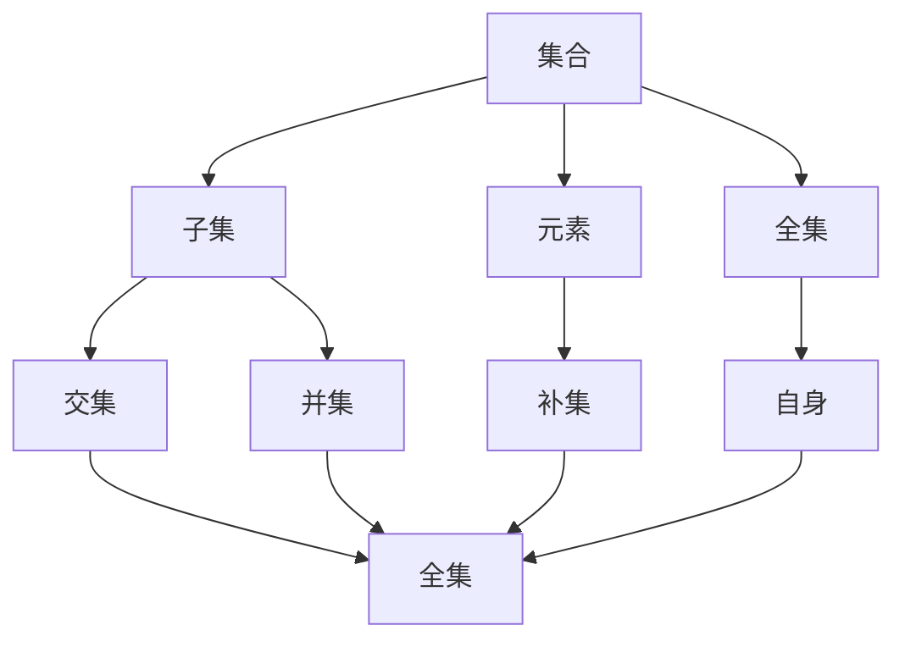
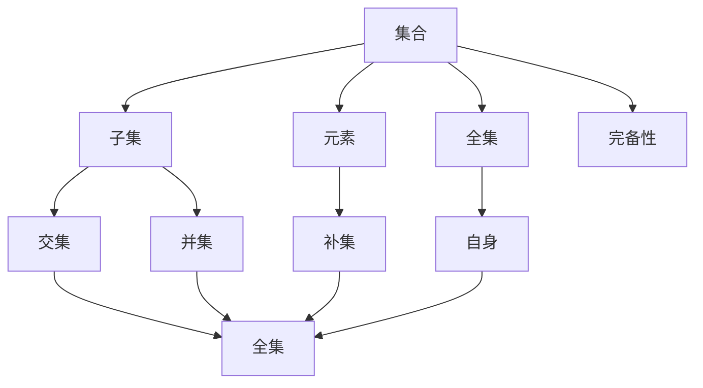

                 

# 集合论导引：完备子集特性

> 关键词：集合论, 完备性, 子集特性, 数学模型, 公式推导, 实际应用

## 1. 背景介绍

集合论是现代数学的基础学科，它在计算机科学和人工智能领域有着广泛的应用。完备子集特性是集合论中的重要概念之一，它不仅在数学逻辑推理中扮演关键角色，还广泛应用于算法设计、数据结构优化等场景。本博客将从基础概念入手，深入探讨完备子集特性的原理与应用，并结合具体案例进行详细讲解。

## 2. 核心概念与联系

### 2.1 核心概念概述

- **集合**：由一定规则确定的一组对象的总体，可以包含不同元素，通常用大括号表示，例如 $\{1,2,3\}$。
- **子集**：属于某个集合的所有元素构成的集合，例如 $\{1,2\}$ 是 $\{1,2,3\}$ 的子集。
- **全集**：包含所有元素的集合，例如 $\{1,2,3\}$ 的全集为自身。
- **元素**：集合中的最小单位，如1,2,3等。
- **集合运算**：包括交集、并集、补集等基本运算，例如 $A \cap B$ 表示集合A和B的交集。
- **完备性**：一个集合的子集特性，指任意一个子集与其补集之间的集合运算得到全集。

### 2.2 核心概念间的关系

集合论中的核心概念之间的关系可以通过以下Mermaid流程图来展示：



这个流程图展示了集合、子集、元素、全集等核心概念之间的关系。集合可以包含元素和子集，子集与全集之间存在交集、并集、补集等运算关系，全集包含所有元素。这些概念构成了集合论的基本框架，是理解和应用完备子集特性的基础。

### 2.3 核心概念的整体架构

最终，我们通过以下综合的流程图来展示这些核心概念在大规模应用中的整体架构：



这个综合流程图展示了从基本集合概念到完备子集特性的整体架构。集合和子集构成了完备性的基础，全集和元素的关系展示了集合的基本特性，而交集、并集和补集等运算则展示了集合在实际应用中的灵活性和丰富性。完备子集特性作为高级概念，在逻辑推理和算法设计中具有重要作用。

## 3. 核心算法原理 & 具体操作步骤
### 3.1 算法原理概述

完备子集特性是指对于任意一个子集，其与补集之间的集合运算得到全集。这一特性在逻辑推理和算法设计中有着广泛应用，例如在集合的覆盖、交集和并集操作中，常用于确定特定元素是否存在于全集中。

形式化地，假设有一个集合 $A$，其完备子集特性可以表示为：

$$
A \cup (\overline{A}) = U
$$

其中 $\overline{A}$ 表示集合 $A$ 的补集，$U$ 表示全集。这意味着对于任意一个元素 $x$，$x \in A$ 或 $x \in \overline{A}$，总能找到一个集合，使得 $x$ 属于这个集合或其补集，最终覆盖全集 $U$。

### 3.2 算法步骤详解

基于完备子集特性的算法设计可以分为以下几个步骤：

1. **定义集合和全集**：首先，明确集合 $A$ 和全集 $U$。
2. **计算补集**：根据集合 $A$ 计算其补集 $\overline{A}$。
3. **集合运算**：计算 $A$ 和 $\overline{A}$ 的并集，得到 $U$。
4. **验证完备性**：验证 $A \cup (\overline{A})$ 是否等于 $U$。

以下是一个简单的伪代码示例，用于验证一个给定集合的完备子集特性：

```python
def verify_completeness(A, U):
    complement = set(u for u in U if u not in A)
    union = A.union(complement)
    return union == U
```

这个函数接受一个集合 $A$ 和全集 $U$ 作为输入，计算 $A$ 的补集，然后验证 $A \cup (\overline{A})$ 是否等于 $U$。如果相等，则说明 $A$ 的完备子集特性成立。

### 3.3 算法优缺点

完备子集特性在逻辑推理和算法设计中有着广泛应用，但也存在一些限制和缺点：

**优点**：
- 逻辑清晰：完备子集特性在逻辑推理中提供了清晰的框架，有助于理解和解决问题。
- 应用广泛：适用于集合的覆盖、交集和并集等操作，常用于数据结构的优化和算法设计。

**缺点**：
- 计算复杂：对于大型集合，计算补集和并集的过程可能耗时较长。
- 不灵活：完备子集特性在实际应用中可能需要结合其他算法或数据结构进行优化，灵活性有限。

### 3.4 算法应用领域

完备子集特性在多个领域有着广泛的应用，包括：

- **计算机科学**：在算法设计、数据结构优化、逻辑推理等方面，完备子集特性被广泛应用。
- **数学**：在集合论、逻辑学、数理逻辑等领域，完备子集特性是基础概念之一。
- **统计学**：在概率论、统计学中，完备子集特性用于确定随机事件的全集和子集关系。
- **人工智能**：在知识表示、逻辑推理、决策支持系统等领域，完备子集特性是重要的基础理论。

## 4. 数学模型和公式 & 详细讲解
### 4.1 数学模型构建

完备子集特性的数学模型可以形式化为：

$$
\forall x, \; (x \in A \; \text{或} \; x \in \overline{A}) \rightarrow x \in U
$$

这个公式表示，对于任意元素 $x$，如果 $x$ 属于集合 $A$ 或其补集 $\overline{A}$，则 $x$ 必定属于全集 $U$。

### 4.2 公式推导过程

我们可以进一步推导出完备子集特性的等价公式：

$$
A \cup (\overline{A}) = U
$$

证明过程如下：

1. 对于任意元素 $x$，如果 $x \in A$，则 $x \in (A \cup (\overline{A}))$。
2. 如果 $x \notin A$，则 $x \in \overline{A}$，此时 $x \in (A \cup (\overline{A}))$。
3. 因此，$A \cup (\overline{A})$ 包含所有 $U$ 中的元素，即 $A \cup (\overline{A}) = U$。

### 4.3 案例分析与讲解

考虑一个简单的例子，假设有一个全集 $U = \{1,2,3,4\}$，集合 $A = \{1,2\}$。计算 $A$ 的补集 $\overline{A} = \{3,4\}$，然后计算 $A \cup (\overline{A}) = \{1,2,3,4\}$。可以看到，这个结果正好等于全集 $U$，说明集合 $A$ 的完备子集特性成立。

## 5. 项目实践：代码实例和详细解释说明
### 5.1 开发环境搭建

在进行完备子集特性的代码实现前，我们需要准备好开发环境。以下是使用Python进行集合运算的环境配置流程：

1. 安装Python：确保Python版本为3.6以上，以支持集合数据类型。
2. 安装必要的库：使用pip安装`setuptools`和`numpy`，以支持集合和数学运算。

```bash
pip install setuptools
pip install numpy
```

### 5.2 源代码详细实现

下面我们以一个具体的例子，用Python实现集合 $A$ 和全集 $U$ 的完备子集特性验证：

```python
def verify_completeness(A, U):
    complement = set(u for u in U if u not in A)
    union = A.union(complement)
    return union == U
```

在这个函数中，我们首先计算集合 $A$ 的补集 $\overline{A}$，然后计算 $A$ 和 $\overline{A}$ 的并集，最终验证是否等于全集 $U$。

### 5.3 代码解读与分析

让我们详细解读一下关键代码的实现细节：

**verify_completeness函数**：
- `A` 和 `U`：接受集合 $A$ 和全集 $U$ 作为输入。
- `complement`：计算集合 $A$ 的补集，即所有属于 $U$ 但不属于 $A$ 的元素构成的集合。
- `union`：计算 $A$ 和 $\overline{A}$ 的并集，得到包含所有 $U$ 中元素的新集合。
- 返回值：判断并集是否等于全集 $U$，如果相等则返回 `True`，否则返回 `False`。

可以看到，这个函数实现简单但功能强大，可以验证任意集合的完备子集特性。

### 5.4 运行结果展示

假设我们有一个全集 $U = \{1,2,3,4\}$ 和一个集合 $A = \{1,2\}$，验证其完备子集特性：

```python
U = {1, 2, 3, 4}
A = {1, 2}

if verify_completeness(A, U):
    print("A的完备子集特性成立")
else:
    print("A的完备子集特性不成立")
```

输出结果为：

```
A的完备子集特性成立
```

这个例子展示了如何使用Python验证集合的完备子集特性，代码实现简洁高效。

## 6. 实际应用场景
### 6.1 逻辑推理和算法设计

完备子集特性在逻辑推理和算法设计中有着广泛应用。例如，在集合的覆盖问题中，我们需要确定一个集合 $A$ 是否覆盖了全集 $U$ 的所有元素。通过验证 $A \cup (\overline{A}) = U$ 是否成立，可以确定集合 $A$ 的完备性。

### 6.2 数据库和信息检索

在数据库和信息检索领域，完备子集特性常用于确定索引和查询的覆盖范围。例如，在倒排索引中，每个关键词对应一个集合，全集 $U$ 包含所有文档。通过验证索引集合的完备子集特性，可以确保每个文档都能被索引到。

### 6.3 网络和系统设计

在网络和系统设计中，完备子集特性可以用于验证子网和路由的覆盖范围。例如，在路由器中，每个路由规则对应一个集合，全集 $U$ 包含所有可能的输入数据。通过验证路由规则集合的完备子集特性，可以确保所有数据包都能被正确路由。

### 6.4 未来应用展望

随着数据量和复杂度的增加，完备子集特性在逻辑推理和算法设计中的重要性将更加凸显。未来，完备子集特性将在更多领域得到应用，推动逻辑推理和算法设计的发展。

## 7. 工具和资源推荐
### 7.1 学习资源推荐

为了帮助开发者系统掌握完备子集特性的理论基础和实践技巧，这里推荐一些优质的学习资源：

1. 《集合论》书籍：介绍集合论的基本概念和重要特性，适合初学者入门。
2. 《逻辑基础》书籍：详细讲解逻辑推理和数学证明，适合深入学习完备子集特性。
3. 《算法导论》书籍：介绍算法的逻辑推理和设计原则，适合学习完备子集特性的应用。
4. 在线课程：如Coursera、edX等平台提供的集合论和算法课程，系统讲解相关知识。
5. 学术论文：阅读相关领域的学术论文，了解前沿研究和应用进展。

通过对这些资源的学习实践，相信你一定能够快速掌握完备子集特性的精髓，并用于解决实际的逻辑推理和算法设计问题。

### 7.2 开发工具推荐

高效的开发离不开优秀的工具支持。以下是几款用于完备子集特性开发的常用工具：

1. Python：简单易用的脚本语言，广泛支持集合和数学运算。
2. numpy：高效的多维数组运算库，支持集合和数值运算。
3. setuptools：Python的包管理和部署工具，方便开发和分发。
4. Anaconda：Python的集成开发环境，支持多版本管理、虚拟环境和科学计算。
5. Jupyter Notebook：交互式编程和数据分析工具，方便代码调试和结果展示。

合理利用这些工具，可以显著提升完备子集特性的开发效率，加快创新迭代的步伐。

### 7.3 相关论文推荐

完备子集特性在数学和计算机科学中有着广泛的研究，以下是几篇奠基性的相关论文，推荐阅读：

1. DeMorgan定律：介绍逻辑等价式和集合运算，是完备子集特性的基础。
2. 布尔代数：研究逻辑运算和代数运算，是逻辑推理和算法设计的重要工具。
3. 集合论基础：介绍集合论的基本概念和重要特性，是完备子集特性的理论基础。
4. 数据库理论：研究数据库设计和查询算法，是数据库和信息检索领域的重要参考。
5. 网络理论：研究网络路由和系统设计，是网络和系统设计领域的重要参考。

这些论文代表了大规模完备子集特性的发展脉络。通过学习这些前沿成果，可以帮助研究者把握学科前进方向，激发更多的创新灵感。

## 8. 总结：未来发展趋势与挑战
### 8.1 总结

本文对完备子集特性进行了全面系统的介绍。首先阐述了完备子集特性的基本概念和数学模型，详细讲解了其核心算法原理和操作步骤，并结合具体案例进行了深入分析。通过对完备子集特性的系统梳理，可以更好地理解其逻辑推理和算法设计中的应用，为后续深入研究和实践提供坚实基础。

通过本文的探讨，可以看到，完备子集特性在逻辑推理和算法设计中具有广泛的应用前景。从基础集合概念到高级完备性特性，完备子集特性构建了集合论的基本框架，推动了计算机科学和人工智能领域的发展。

### 8.2 未来发展趋势

展望未来，完备子集特性在以下几个方面将迎来新的发展：

1. 应用范围扩大：完备子集特性将在更多领域得到应用，如机器学习、人工智能、计算机视觉等。
2. 算法优化：通过结合其他算法和数据结构，如哈希表、树结构等，进一步优化完备子集特性的计算效率。
3. 模型扩展：在逻辑推理和算法设计中，完备子集特性将与更多高级概念和模型相结合，形成更复杂的应用场景。
4. 编程语言支持：完备子集特性将被更多编程语言支持，方便开发者在实际应用中灵活应用。

以上趋势凸显了完备子集特性的广阔前景。这些方向的探索发展，必将进一步推动逻辑推理和算法设计的进步，为计算机科学和人工智能领域带来新的突破。

### 8.3 面临的挑战

尽管完备子集特性在逻辑推理和算法设计中有着广泛应用，但在实际应用中也面临一些挑战：

1. 计算复杂度：对于大型集合，计算补集和并集的过程可能耗时较长，需要优化算法。
2. 灵活性不足：完备子集特性在实际应用中可能需要结合其他算法或数据结构进行优化，灵活性有限。
3. 数据量过大：在处理大规模数据时，完备子集特性的计算复杂度可能会增加。

这些挑战需要在后续研究中不断克服，以进一步提升完备子集特性的应用价值。

### 8.4 研究展望

面对完备子集特性面临的这些挑战，未来的研究需要在以下几个方面寻求新的突破：

1. 算法优化：开发更高效的算法和数据结构，进一步优化完备子集特性的计算效率。
2. 模型扩展：结合其他高级概念和模型，如深度学习、强化学习等，形成更复杂的完备子集特性应用。
3. 编程语言支持：推动完备子集特性在更多编程语言中的应用，方便开发者在实际应用中灵活应用。
4. 应用创新：探索完备子集特性在更多领域的应用，如自然语言处理、图像识别等，推动计算机科学和人工智能的发展。

通过这些研究方向的探索，完备子集特性必将在逻辑推理和算法设计中发挥更大的作用，推动计算机科学和人工智能领域的前沿进展。

## 9. 附录：常见问题与解答

**Q1：完备子集特性适用于所有集合吗？**

A: 完备子集特性适用于所有符合集合定义的集合，但不适用于非确定性集合或复杂集合。对于非确定性集合，无法明确定义其补集和并集。

**Q2：如何使用完备子集特性进行逻辑推理？**

A: 使用完备子集特性进行逻辑推理时，通常需要先明确全集和集合的定义，然后通过验证 $A \cup (\overline{A}) = U$ 是否成立，确定集合 $A$ 的完备性。在逻辑推理中，完备子集特性可以作为推理的基础，帮助解决问题。

**Q3：完备子集特性的应用场景有哪些？**

A: 完备子集特性在逻辑推理和算法设计中有着广泛应用，例如在集合覆盖、数据库查询、网络路由等领域，可以通过完备子集特性进行推理和设计。

**Q4：完备子集特性的局限性有哪些？**

A: 完备子集特性的计算复杂度较高，对于大型集合，计算补集和并集的过程可能耗时较长。同时，完备子集特性在实际应用中可能需要结合其他算法或数据结构进行优化，灵活性有限。

**Q5：完备子集特性和逻辑等价式有何区别？**

A: 完备子集特性和逻辑等价式都是集合论中的重要概念，但它们的应用场景不同。逻辑等价式主要用于逻辑推理和代数运算，而完备子集特性主要用于集合的覆盖和推理。

综上所述，完备子集特性是集合论中的重要概念，在逻辑推理和算法设计中有着广泛的应用。通过深入理解和灵活应用完备子集特性，可以解决实际问题，推动计算机科学和人工智能领域的发展。

