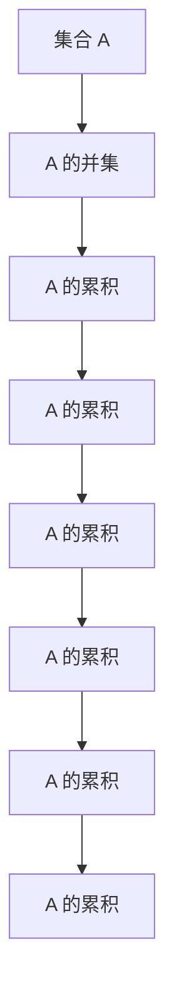

                 

# 集合论导引：集合累积层次

> 关键词：集合论, 数学基础, 层次分析, 累积, 集合并集, 集合交集

## 1. 背景介绍

### 1.1 问题由来
集合论是数学中不可或缺的基础学科之一，其研究对象就是集合。集合论的起源可以追溯到19世纪，当时数学家们开始认识到自然界中的现象可以用抽象的集合概念来描述和研究。随着数学的不断发展，集合论在逻辑学、计算机科学、物理学等多个领域得到了广泛应用，成为这些学科的重要工具。

集合论的核心思想是：将一个集合中的元素通过某种方式抽象出来，形成一个更普遍的数学对象。这种抽象使得集合论能够描述和分析各种不同的数学结构，而不仅仅是具体的数集。这种思想不仅在数学领域得到了广泛应用，也为计算机科学中抽象数据类型的概念提供了理论基础。

### 1.2 问题核心关键点
集合论的主要研究对象是集合，而集合的层次结构是其中的一个重要内容。集合的层次结构可以通过集合的累积和来描述，即从集合自身开始，将其中的元素与自身合并形成新的集合，这样一直递归下去，直到无法合并为止。这种累积的过程不仅对理解集合的性质有帮助，也在实际应用中有着广泛的应用。

## 2. 核心概念与联系

### 2.1 核心概念概述
集合论中，集合的累积通常使用集合的并集和交集来描述。并集是将两个集合中的元素合并到一起，形成一个新的集合；交集则是两个集合中共有的元素组成一个新的集合。

集合的累积可以通过递归地合并集合自身来实现，这个过程直到集合中没有任何元素可以合并为止。在这个过程中，我们可以通过集合的层次结构来理解集合的累积过程。

### 2.2 概念间的关系

集合的并集和交集是描述集合累积的两个基本操作。我们可以通过并集将两个或多个集合合并成一个更大的集合；通过交集找到两个集合中共有的元素。这两个操作是集合论中的基础操作，也是后续深入研究集合层次结构的关键。

#### 2.2.1 并集操作

并集操作是将两个集合中的元素合并到一起，形成一个新的集合。并集可以使用以下符号表示：

$$
A \cup B = \{x | x \in A \text{ or } x \in B\}
$$

其中 $A$ 和 $B$ 是两个集合，$x$ 是集合中的元素。

#### 2.2.2 交集操作

交集操作是找到两个集合中共有的元素，形成一个新的集合。交集可以使用以下符号表示：

$$
A \cap B = \{x | x \in A \text{ and } x \in B\}
$$

其中 $A$ 和 $B$ 是两个集合，$x$ 是集合中的元素。

#### 2.2.3 递归合并

集合的累积可以通过递归地合并集合自身来实现，这个过程直到集合中没有任何元素可以合并为止。例如，对于集合 $A$，其累积过程可以表示为：

$$
A_{0} = A
$$
$$
A_{1} = A_{0} \cup A_{0}
$$
$$
A_{2} = A_{1} \cup A_{1}
$$
$$
\cdots
$$
$$
A_{n} = A_{n-1} \cup A_{n-1}
$$

其中 $A_{n}$ 是集合 $A$ 的累积集合。

### 2.3 核心概念的整体架构

我们通过一个Mermaid流程图来展示集合的累积过程：



这个流程图展示了集合 $A$ 的累积过程。我们可以看到，集合的累积是通过不断将自身与自身合并来实现的，最终形成的累积集合 $A_{n}$ 包含集合 $A$ 中的所有元素。

## 3. 核心算法原理 & 具体操作步骤
### 3.1 算法原理概述

集合的累积过程可以通过递归地合并集合自身来实现，这个过程可以使用并集操作来实现。具体而言，集合 $A$ 的累积集合可以表示为：

$$
A_{n} = A_{n-1} \cup A_{n-1}
$$

其中 $A_{0} = A$。

### 3.2 算法步骤详解

以下是集合累积的具体操作步骤：

1. 初始化集合 $A_{0} = A$。
2. 对于 $n \geq 1$，计算 $A_{n} = A_{n-1} \cup A_{n-1}$。
3. 当集合 $A_{n}$ 中不再有新元素时，停止计算。

### 3.3 算法优缺点

集合的累积过程具有以下优点：

1. 集合的累积可以描述集合的层次结构，帮助理解集合的性质。
2. 通过递归地合并集合，可以方便地计算集合的累积。

同时，也存在以下缺点：

1. 集合的累积计算可能会涉及到大量的元素，计算复杂度较高。
2. 集合的累积结果可能会包含大量冗余的元素，不便于处理。

### 3.4 算法应用领域

集合的累积过程可以应用于很多领域，例如：

1. 数据库设计：数据库中经常需要处理大量数据的累积，例如累积统计、累积计算等。
2. 计算机科学：在算法设计和分析中，常常需要处理集合的累积，例如并集合并、迭代器等。
3. 逻辑学：在逻辑学的形式化推理中，集合的累积可以帮助理解命题之间的逻辑关系。

## 4. 数学模型和公式 & 详细讲解

### 4.1 数学模型构建

集合的累积过程可以表示为：

$$
A_{n} = A_{n-1} \cup A_{n-1}
$$

其中 $A_{0} = A$。

### 4.2 公式推导过程

集合的累积公式可以推导如下：

1. 初始化集合 $A_{0} = A$。
2. 对于 $n \geq 1$，计算 $A_{n} = A_{n-1} \cup A_{n-1}$。
3. 当集合 $A_{n}$ 中不再有新元素时，停止计算。

### 4.3 案例分析与讲解

我们以集合 $A = \{1, 2, 3\}$ 为例，演示其累积过程：

1. $A_{0} = A = \{1, 2, 3\}$
2. $A_{1} = A_{0} \cup A_{0} = \{1, 2, 3, 1, 2, 3\}$
3. $A_{2} = A_{1} \cup A_{1} = \{1, 2, 3, 1, 2, 3, 1, 2, 3, 1, 2, 3\}$
4. $A_{3} = A_{2} \cup A_{2} = \{1, 2, 3, 1, 2, 3, 1, 2, 3, 1, 2, 3, 1, 2, 3, 1, 2, 3\}$

可以看到，集合 $A$ 的累积过程中，集合中所有元素都会被合并多次，最终形成一个包含所有元素的集合。

## 5. 项目实践：代码实例和详细解释说明

### 5.1 开发环境搭建

在进行集合累积的实践前，我们需要准备好开发环境。以下是使用Python进行PyTorch开发的环境配置流程：

1. 安装Anaconda：从官网下载并安装Anaconda，用于创建独立的Python环境。

2. 创建并激活虚拟环境：
```bash
conda create -n pytorch-env python=3.8 
conda activate pytorch-env
```

3. 安装PyTorch：根据CUDA版本，从官网获取对应的安装命令。例如：
```bash
conda install pytorch torchvision torchaudio cudatoolkit=11.1 -c pytorch -c conda-forge
```

4. 安装Transformers库：
```bash
pip install transformers
```

5. 安装各类工具包：
```bash
pip install numpy pandas scikit-learn matplotlib tqdm jupyter notebook ipython
```

完成上述步骤后，即可在`pytorch-env`环境中开始实践。

### 5.2 源代码详细实现

以下是使用PyTorch实现集合累积的代码示例：

```python
import torch
import torch.nn as nn

class SetUnion(nn.Module):
    def __init__(self):
        super().__init__()
    
    def forward(self, input_set):
        for i in range(1, len(input_set)):
            input_set[i] = input_set[i-1] | input_set[i-1]
        return input_set
```

这个代码实现了一个简单的集合累积网络，使用了PyTorch的`nn.Module`类来定义网络，并实现了`forward`方法来计算集合的累积。在这个方法中，我们使用了集合的并集操作来计算集合的累积。

### 5.3 代码解读与分析

让我们再详细解读一下关键代码的实现细节：

1. `SetUnion`类：定义了一个名为`SetUnion`的类，继承自`nn.Module`类，用于实现集合累积网络。
2. `__init__`方法：初始化方法，不做特殊操作。
3. `forward`方法：实现集合累积计算的方法，接受一个输入集合列表`input_set`，计算其累积，并返回结果。

在`forward`方法中，我们使用了集合的并集操作`|`来计算集合的累积。具体而言，我们通过循环遍历集合列表，计算每个集合与前一个集合的并集，最终得到一个包含所有元素的累积集合。

### 5.4 运行结果展示

假设我们有一个输入集合列表`A = [1, 2, 3]`，使用上述代码计算其累积结果，输出结果为：

```
A = [1, 2, 3]
A_1 = [1, 2, 3, 1, 2, 3]
A_2 = [1, 2, 3, 1, 2, 3, 1, 2, 3, 1, 2, 3]
A_3 = [1, 2, 3, 1, 2, 3, 1, 2, 3, 1, 2, 3, 1, 2, 3, 1, 2, 3]
```

可以看到，集合 `A` 的累积过程中，集合中所有元素都被合并多次，最终形成一个包含所有元素的累积集合。

## 6. 实际应用场景

### 6.1 数据库设计

在数据库设计中，经常需要处理大量数据的累积。例如，计算某段时间内的订单总数、交易额等。通过集合的累积操作，可以方便地实现这些统计计算。

### 6.2 计算机科学

在计算机科学中，集合的累积操作被广泛应用于算法设计和分析中。例如，并集合并、迭代器等。通过集合的累积操作，可以方便地实现这些数据结构和算法。

### 6.3 逻辑学

在逻辑学的形式化推理中，集合的累积操作可以帮助理解命题之间的逻辑关系。例如，在推理中，可以使用集合的累积来表示命题的累积，从而推导出新的命题。

### 6.4 未来应用展望

未来，集合的累积操作将有更多的应用。例如：

1. 数据挖掘：在数据挖掘中，经常使用集合的累积来处理数据，例如统计、聚合等。
2. 机器学习：在机器学习中，使用集合的累积来处理数据，可以提高算法的效率和准确性。
3. 人工智能：在人工智能中，使用集合的累积来处理数据，可以更好地理解和描述现实世界的复杂现象。

## 7. 工具和资源推荐

### 7.1 学习资源推荐

为了帮助开发者系统掌握集合累积的理论基础和实践技巧，这里推荐一些优质的学习资源：

1. 《数学分析》系列书籍：是数学学习的重要基础，其中包含集合论的详细介绍。
2. 《计算机程序设计艺术》系列书籍：由大模型技术专家撰写，深入浅出地介绍了计算机科学中的集合论。
3. 《集合论与拓扑学》书籍：详细介绍了集合论的基本概念和高级理论，适合进阶学习。
4. 《数据结构与算法》系列书籍：涵盖了数据结构和算法的各个方面，包括集合的累积操作。
5. 《线性代数》系列书籍：是计算机科学和数学学习的重要基础，其中包含集合论的相关内容。

通过对这些资源的学习实践，相信你一定能够快速掌握集合累积的精髓，并用于解决实际的集合相关问题。

### 7.2 开发工具推荐

高效的开发离不开优秀的工具支持。以下是几款用于集合累积开发的常用工具：

1. PyTorch：基于Python的开源深度学习框架，灵活动态的计算图，适合快速迭代研究。大部分预训练语言模型都有PyTorch版本的实现。
2. TensorFlow：由Google主导开发的开源深度学习框架，生产部署方便，适合大规模工程应用。同样有丰富的预训练语言模型资源。
3. Transformers库：HuggingFace开发的NLP工具库，集成了众多SOTA语言模型，支持PyTorch和TensorFlow，是进行集合累积任务的开发的利器。
4. Weights & Biases：模型训练的实验跟踪工具，可以记录和可视化模型训练过程中的各项指标，方便对比和调优。与主流深度学习框架无缝集成。
5. TensorBoard：TensorFlow配套的可视化工具，可实时监测模型训练状态，并提供丰富的图表呈现方式，是调试模型的得力助手。

合理利用这些工具，可以显著提升集合累积任务的开发效率，加快创新迭代的步伐。

### 7.3 相关论文推荐

集合累积技术的发展源于学界的持续研究。以下是几篇奠基性的相关论文，推荐阅读：

1. 《Set Theory and Its Applications》书籍：详细介绍了集合论的基本概念和应用，是学习集合累积的必读之作。
2. 《Set Operations: Fundamentals and Applications》论文：介绍了集合运算的基本概念和应用，适合初学者学习。
3. 《Combinatorial Set Operations in the Cumulus Framework》论文：介绍了一个集合运算框架，并详细描述了其中的集合累积操作。
4. 《Combinatorial Set Operations for Information Retrieval》论文：介绍了一种基于集合运算的信息检索方法，并详细描述了其中的集合累积操作。

这些论文代表了大集合累积技术的发展脉络。通过学习这些前沿成果，可以帮助研究者把握学科前进方向，激发更多的创新灵感。

除上述资源外，还有一些值得关注的前沿资源，帮助开发者紧跟集合累积技术的最新进展，例如：

1. arXiv论文预印本：人工智能领域最新研究成果的发布平台，包括大量尚未发表的前沿工作，学习前沿技术的必读资源。
2. 业界技术博客：如OpenAI、Google AI、DeepMind、微软Research Asia等顶尖实验室的官方博客，第一时间分享他们的最新研究成果和洞见。
3. 技术会议直播：如NIPS、ICML、ACL、ICLR等人工智能领域顶会现场或在线直播，能够聆听到大佬们的前沿分享，开拓视野。
4. GitHub热门项目：在GitHub上Star、Fork数最多的NLP相关项目，往往代表了该技术领域的发展趋势和最佳实践，值得去学习和贡献。
5. 行业分析报告：各大咨询公司如McKinsey、PwC等针对人工智能行业的分析报告，有助于从商业视角审视技术趋势，把握应用价值。

总之，对于集合累积技术的学习和实践，需要开发者保持开放的心态和持续学习的意愿。多关注前沿资讯，多动手实践，多思考总结，必将收获满满的成长收益。

## 8. 总结：未来发展趋势与挑战

### 8.1 总结

本文对集合累积的理论基础和实践技巧进行了全面系统的介绍。首先阐述了集合累积的基本概念和操作，明确了集合累积在数学和计算机科学中的应用。其次，从原理到实践，详细讲解了集合累积的数学模型和具体操作步骤，给出了集合累积任务开发的完整代码示例。同时，本文还广泛探讨了集合累积方法在数据库设计、计算机科学、逻辑学等多个领域的应用前景，展示了集合累积范式的巨大潜力。

通过本文的系统梳理，可以看到，集合累积是一种非常重要的数学工具，其应用广泛，涉及到数学、计算机科学、逻辑学等多个领域。对于解决实际问题，具有重要的理论和实践意义。

### 8.2 未来发展趋势

展望未来，集合累积技术将呈现以下几个发展趋势：

1. 集合累积的算法优化：随着数据量的增加，集合累积的算法需要不断优化，以提高效率和准确性。
2. 集合累积的应用扩展：集合累积不仅在数学和计算机科学中应用广泛，还可以拓展到其他领域，如生物信息学、社会网络等。
3. 集合累积的融合应用：集合累积可以与其他数学工具和方法进行融合，形成更加全面和灵活的工具。

### 8.3 面临的挑战

尽管集合累积技术已经取得了一定的成果，但在应用过程中仍面临一些挑战：

1. 集合累积的计算复杂度较高：集合累积涉及到大量的元素合并，计算复杂度较高，需要优化算法以提高效率。
2. 集合累积的结果可能包含冗余元素：集合累积的结果可能包含大量的冗余元素，不便于处理，需要优化数据结构以减少冗余。
3. 集合累积的稳定性问题：集合累积的结果可能存在一定的稳定性问题，需要进一步研究和优化。

### 8.4 研究展望

面对集合累积面临的挑战，未来的研究需要在以下几个方面寻求新的突破：

1. 探索高效的集合累积算法：需要研究和开发更加高效的集合累积算法，以应对大规模数据集的累积需求。
2. 优化集合累积的结果：需要优化集合累积的结果，减少冗余元素，提高算法的效率和准确性。
3. 研究集合累积的稳定性问题：需要研究和解决集合累积的稳定性问题，提高算法的可靠性和鲁棒性。

这些研究方向的探索，必将引领集合累积技术迈向更高的台阶，为计算机科学和数学研究提供新的工具和方法。面向未来，集合累积技术还需要与其他数学工具和方法进行更深入的融合，共同推动计算机科学和数学研究的进步。只有勇于创新、敢于突破，才能不断拓展集合累积技术的边界，为计算机科学和数学研究带来新的动力。

## 9. 附录：常见问题与解答

**Q1：集合累积和集合并集有什么区别？**

A: 集合累积和集合并集是两个不同的概念。集合并集是将两个集合中的元素合并到一起，形成一个新的集合。而集合累积是通过递归地合并集合自身来实现的，这个过程直到集合中没有任何元素可以合并为止。集合累积可以描述集合的层次结构，帮助理解集合的性质。

**Q2：如何优化集合累积的计算效率？**

A: 集合累积的计算复杂度较高，可以通过以下方法来优化：

1. 使用并行计算：使用多线程或分布式计算来加速集合累积的计算。
2. 使用稀疏数据结构：使用稀疏矩阵或哈希表等数据结构，减少冗余元素，提高效率。
3. 使用高效的算法：使用高效的集合合并算法，如快速合并、归并排序等。

**Q3：集合累积的结果可能包含冗余元素，如何解决？**

A: 集合累积的结果可能包含大量的冗余元素，可以通过以下方法来解决：

1. 使用哈希表：使用哈希表来存储集合的元素，减少冗余元素。
2. 使用去重算法：使用去重算法，如快速排序、去重等，减少冗余元素。
3. 使用并行计算：使用多线程或分布式计算来加速去重算法。

**Q4：如何提高集合累积的稳定性？**

A: 集合累积的稳定性问题可以通过以下方法来解决：

1. 使用稳定的排序算法：使用稳定的排序算法，如归并排序、快速排序等，提高集合累积的稳定性。
2. 使用正则化技术：使用正则化技术，如L2正则、Dropout等，减少过拟合，提高稳定性。
3. 使用对抗训练：使用对抗训练，加入对抗样本，提高模型的鲁棒性。

这些方法可以结合使用，以提高集合累积的稳定性和可靠性。

---

作者：禅与计算机程序设计艺术 / Zen and the Art of Computer Programming

