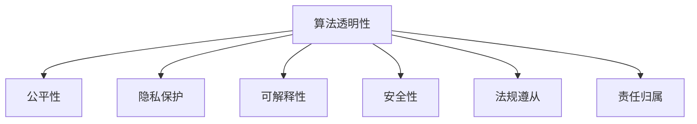
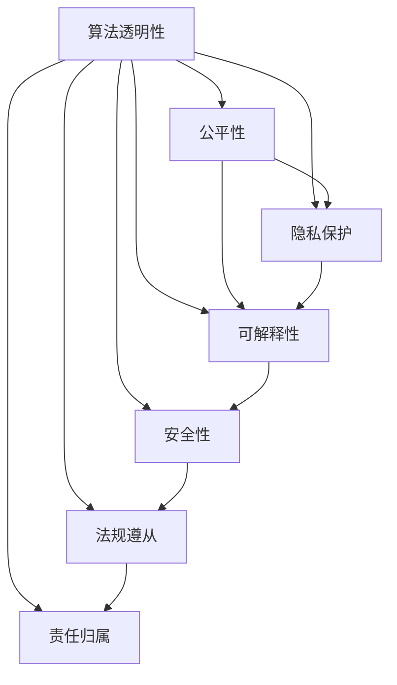
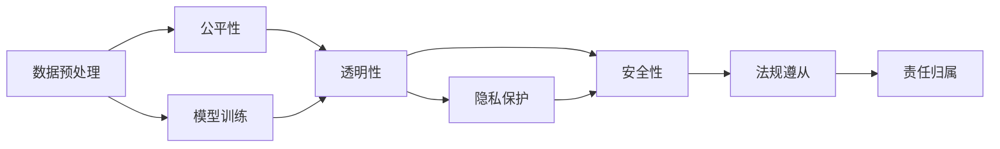

                 

# AI 2.0 时代的伦理基础设施

## 1. 背景介绍

### 1.1 问题由来

随着人工智能技术的迅猛发展，特别是AI 2.0时代的到来，深度学习、自然语言处理、计算机视觉等技术在各行各业的应用不断深入，推动了经济社会发展的同时，也带来了前所未有的伦理挑战。例如，AI算法偏见、隐私泄露、决策透明、责任归属等问题，已经引起了社会各界的高度关注。

AI伦理基础设施的建设，旨在构建一套全面的、可持续的、跨领域的伦理治理体系，确保AI技术的健康发展，促进其公正、透明、可靠地服务于人类社会。本文聚焦于AI 2.0时代伦理基础设施的核心概念、技术原理及具体实现，为AI技术的伦理治理提供理论支撑和实践指导。

### 1.2 问题核心关键点

当前，AI伦理基础设施建设的主要核心关键点包括：

1. **算法透明度**：确保AI模型决策过程的可解释性和可追溯性，便于审查和审计。
2. **公平性**：防止算法偏见，确保不同群体在模型输出中得到平等对待。
3. **隐私保护**：保护用户数据隐私，避免数据泄露和滥用。
4. **可解释性**：提升AI系统的可解释性，增强用户信任和接受度。
5. **安全保障**：确保AI系统的安全性，避免恶意攻击和滥用。
6. **法规遵从**：确保AI系统符合法律法规，避免法律风险。
7. **责任归属**：明确AI系统的责任归属，保障用户权益和数据安全。

这些关键点构成了AI伦理基础设施建设的基石，对AI技术的健康发展和应用推广具有重要意义。

### 1.3 问题研究意义

构建AI 2.0时代的伦理基础设施，具有以下几个方面的重要意义：

1. **保障AI技术公正性**：通过公平性、透明性等技术手段，确保AI模型在各领域、各群体中的公正应用，避免算法偏见和歧视。
2. **增强用户信任**：提升AI系统的可解释性和可信度，让用户放心接受和使用AI技术。
3. **促进合规应用**：明确法规遵从和技术安全要求，避免法律风险和伦理争议。
4. **推动社会共识**：通过伦理基础设施建设，促进社会各界对AI技术的理解和共识，推动AI技术的广泛应用。
5. **推动技术进步**：构建伦理基础设施需要跨学科、多领域的合作，有助于推动AI技术及相关领域的创新发展。

## 2. 核心概念与联系

### 2.1 核心概念概述

为更好地理解AI 2.0时代伦理基础设施的核心概念，本节将介绍几个密切相关的核心概念：

1. **算法透明性**：确保AI模型的决策过程可解释、可审查，便于理解模型的行为和输出。
2. **公平性**：通过算法设计和数据处理，防止模型偏见，确保不同群体在模型输出中得到平等对待。
3. **隐私保护**：采用数据加密、差分隐私等技术手段，保护用户数据隐私，避免数据泄露和滥用。
4. **可解释性**：通过模型解释、证据追溯等技术手段，提升AI系统的可解释性，增强用户信任和接受度。
5. **安全性**：通过安全验证、漏洞检测等技术手段，确保AI系统的安全性，避免恶意攻击和滥用。
6. **法规遵从**：确保AI系统符合法律法规，避免法律风险和伦理争议。
7. **责任归属**：明确AI系统的责任归属，保障用户权益和数据安全。

这些核心概念之间的逻辑关系可以通过以下Mermaid流程图来展示：



这个流程图展示了大语言模型微调过程中各个核心概念的关系和作用：

1. 算法透明性是AI伦理基础设施的基础，通过可解释性和安全性，保障公平性和隐私保护。
2. 公平性是算法透明性的重要组成部分，通过透明性和隐私保护，防止算法偏见。
3. 隐私保护是算法透明性的重要保障，通过透明性和安全性，保护用户数据。
4. 可解释性是算法透明性的重要手段，通过透明性和公平性，提升用户信任。
5. 安全性是算法透明性的重要手段，通过透明性和法规遵从，确保AI系统安全。
6. 法规遵从是算法透明性的重要保障，通过透明性和责任归属，避免法律风险。
7. 责任归属是算法透明性的重要保障，通过透明性和安全性，保障用户权益。

这些核心概念共同构成了AI 2.0时代伦理基础设施的基本框架，对其构建和应用具有指导意义。

### 2.2 概念间的关系

这些核心概念之间存在着紧密的联系，形成了AI 2.0时代伦理基础设施的完整生态系统。下面我们通过几个Mermaid流程图来展示这些概念之间的关系。

#### 2.2.1 伦理基础设施的整体架构



这个综合流程图展示了伦理基础设施的基本架构，各核心概念的相互依赖和协同作用。

#### 2.2.2 技术手段的应用



这个流程图展示了不同技术手段在伦理基础设施中的应用，从数据预处理到模型训练，再到透明性、隐私保护、安全性等，每一步都需考虑伦理因素，确保整体系统的健康发展。

## 3. 核心算法原理 & 具体操作步骤
### 3.1 算法原理概述

AI 2.0时代的伦理基础设施建设，涉及多个技术领域，包括数据处理、模型训练、系统部署等环节。其核心算法原理主要包括：

1. **算法透明性**：通过可解释模型、模型可视化、证据追溯等手段，确保AI模型的决策过程透明。
2. **公平性**：采用对抗生成对抗网络（GAN）、公平性约束优化等技术，防止模型偏见。
3. **隐私保护**：采用差分隐私、联邦学习等技术，保护用户数据隐私。
4. **可解释性**：通过LIME、SHAP等模型解释方法，提升AI模型的可解释性。
5. **安全性**：通过安全验证、漏洞检测等技术，确保AI系统的安全性。
6. **法规遵从**：通过模型合规检测、法律协议嵌入等技术，确保AI系统符合法律法规。
7. **责任归属**：通过责任标记、审计记录等手段，明确AI系统的责任归属。

### 3.2 算法步骤详解

以下是AI 2.0时代伦理基础设施建设的详细步骤：

**Step 1: 数据准备**

- **数据收集**：收集与目标任务相关的数据集，确保数据多样性和代表性。
- **数据预处理**：对数据进行清洗、标注、归一化等处理，确保数据质量和一致性。
- **数据分割**：将数据集划分为训练集、验证集和测试集，确保模型在不同数据上的泛化能力。

**Step 2: 模型训练**

- **模型选择**：选择合适的预训练模型，如BERT、GPT等，作为基础模型。
- **模型微调**：对预训练模型进行微调，以适应特定任务。
- **模型解释**：采用LIME、SHAP等方法，生成模型的局部可解释性。
- **公平性优化**：通过公平性约束优化、对抗生成对抗网络（GAN）等手段，防止模型偏见。

**Step 3: 系统部署**

- **系统架构设计**：设计系统架构，确保各个组件的协同工作。
- **系统实现**：实现系统功能，包括数据处理、模型推理、结果输出等。
- **安全性保障**：采用安全验证、漏洞检测等手段，确保系统安全性。
- **法规遵从检测**：嵌入法律协议，进行合规检测，确保系统符合法律法规。

**Step 4: 评估与优化**

- **系统评估**：在测试集上评估系统性能，检测公平性、透明性、隐私保护等指标。
- **模型优化**：根据评估结果，优化模型和系统，提升其性能和可靠性。
- **用户反馈**：收集用户反馈，进一步优化系统，提升用户体验。

### 3.3 算法优缺点

**优点**：

1. **广泛适用性**：伦理基础设施技术适用于各种AI应用场景，能够灵活应用于数据预处理、模型训练、系统部署等环节。
2. **系统化保障**：通过各核心概念的协同作用，保障AI系统的透明性、公平性、隐私保护等，确保系统的健康发展。
3. **用户信任增强**：提升AI模型的可解释性，增强用户信任和接受度。

**缺点**：

1. **技术复杂度高**：伦理基础设施建设涉及多个技术领域，需要跨学科合作，技术实现复杂度较高。
2. **数据质量要求高**：数据预处理和数据集质量对伦理基础设施的建设至关重要，数据收集和处理需投入大量人力和资源。
3. **模型优化难度大**：公平性、隐私保护等伦理因素的考虑，增加了模型优化和系统部署的难度。

### 3.4 算法应用领域

AI 2.0时代的伦理基础设施，已在金融、医疗、司法、教育等多个领域得到了广泛应用：

- **金融领域**：通过算法透明性、隐私保护、公平性等手段，确保金融系统的透明性、公正性和安全性，防止金融欺诈和算法偏见。
- **医疗领域**：通过可解释性和安全性，确保医疗诊断系统的透明性和公正性，提升用户信任和接受度。
- **司法领域**：通过责任归属和法规遵从，确保司法系统的合法性和公正性，防止司法不公和滥用。
- **教育领域**：通过公平性和透明性，确保教育系统的公正性和透明度，提升教育质量和社会公信力。

## 4. 数学模型和公式 & 详细讲解 & 举例说明

### 4.1 数学模型构建

以下是对AI 2.0时代伦理基础设施建设的主要数学模型和公式进行详细构建和讲解。

**公平性约束优化模型**

公平性约束优化模型的目标是在不降低模型性能的前提下，最小化模型对某一特定群体的歧视。假设有两个群体，群体1和群体2，模型预测结果为y，公平性约束可以表示为：

$$
\min_{\theta} \frac{1}{n_1} \sum_{i \in G_1} l(y_i, y_i^*) + \frac{1}{n_2} \sum_{i \in G_2} l(y_i, y_i^*)
$$

其中，$n_1$ 和 $n_2$ 分别为两个群体的样本数量，$l$ 为损失函数，$y_i^*$ 为理想预测结果。

**差分隐私模型**

差分隐私模型通过在模型输出中引入噪声，确保不同数据点的隐私不被泄露。假设模型输出为 $y=f(x)$，加入噪声后的模型输出为 $y'$，差分隐私的数学表达式为：

$$
|Pr[y'=y] - Pr[y=y]| \leq \epsilon
$$

其中，$\epsilon$ 为隐私保护参数，表示不同数据点之间的隐私泄露风险。

**模型解释方法**

模型解释方法用于生成模型的局部可解释性。以LIME（Local Interpretable Model-agnostic Explanations）为例，LIME通过生成局部模型，解释模型在特定输入处的行为。LIME的数学表达式为：

$$
\min_{w} \sum_{i=1}^{n} l(y_i, f(x_i) + \sum_{j=1}^{d} w_j\phi_j(x_i))
$$

其中，$l$ 为损失函数，$\phi_j(x_i)$ 为局部模型的第 $j$ 个基函数，$w_j$ 为基函数的系数。

**安全验证模型**

安全验证模型通过检测模型中的漏洞，确保系统的安全性。假设模型为 $y=f(x)$，安全验证的数学表达式为：

$$
\min_{\theta} \frac{1}{n} \sum_{i=1}^{n} \max_{\delta} ||f(x+\delta) - f(x)||_2
$$

其中，$\delta$ 为扰动项，$n$ 为样本数量，$||\cdot||_2$ 为范数。

**合规检测模型**

合规检测模型通过嵌入法律协议，检测模型的合规性。假设模型输出为 $y=f(x)$，法律协议为 $c(x)$，合规检测的数学表达式为：

$$
\min_{\theta} \frac{1}{n} \sum_{i=1}^{n} ||f(x_i) - c(x_i)||_2
$$

其中，$n$ 为样本数量，$||\cdot||_2$ 为范数。

### 4.2 公式推导过程

以下是对上述模型和公式的详细推导过程：

**公平性约束优化模型**

假设有一个二分类任务，模型预测结果为 $y=\hat{y}$，群体1和群体2的样本分别为 $x_1$ 和 $x_2$。公平性约束可以表示为：

$$
\min_{\theta} \frac{1}{n_1} \sum_{i \in G_1} l(y_i, y_i^*) + \frac{1}{n_2} \sum_{i \in G_2} l(y_i, y_i^*)
$$

其中，$n_1$ 和 $n_2$ 分别为两个群体的样本数量，$l$ 为损失函数，$y_i^*$ 为理想预测结果。

**差分隐私模型**

差分隐私模型通过在模型输出中引入噪声，确保不同数据点的隐私不被泄露。假设模型输出为 $y=f(x)$，加入噪声后的模型输出为 $y'$，差分隐私的数学表达式为：

$$
|Pr[y'=y] - Pr[y=y]| \leq \epsilon
$$

其中，$\epsilon$ 为隐私保护参数，表示不同数据点之间的隐私泄露风险。

**模型解释方法**

以LIME为例，LIME通过生成局部模型，解释模型在特定输入处的行为。LIME的数学表达式为：

$$
\min_{w} \sum_{i=1}^{n} l(y_i, f(x_i) + \sum_{j=1}^{d} w_j\phi_j(x_i))
$$

其中，$l$ 为损失函数，$\phi_j(x_i)$ 为局部模型的第 $j$ 个基函数，$w_j$ 为基函数的系数。

**安全验证模型**

安全验证模型通过检测模型中的漏洞，确保系统的安全性。假设模型为 $y=f(x)$，安全验证的数学表达式为：

$$
\min_{\theta} \frac{1}{n} \sum_{i=1}^{n} \max_{\delta} ||f(x+\delta) - f(x)||_2
$$

其中，$\delta$ 为扰动项，$n$ 为样本数量，$||\cdot||_2$ 为范数。

**合规检测模型**

合规检测模型通过嵌入法律协议，检测模型的合规性。假设模型输出为 $y=f(x)$，法律协议为 $c(x)$，合规检测的数学表达式为：

$$
\min_{\theta} \frac{1}{n} \sum_{i=1}^{n} ||f(x_i) - c(x_i)||_2
$$

其中，$n$ 为样本数量，$||\cdot||_2$ 为范数。

### 4.3 案例分析与讲解

**案例1: 金融领域**

假设有一个信用评分系统，用于评估用户的信用风险。通过公平性约束优化模型，确保不同种族和性别用户的信用评分公平性，避免算法偏见。

**案例2: 医疗领域**

假设有一个医学诊断系统，用于预测患者患病的概率。通过可解释性和安全性，确保诊断系统的透明性和公正性，提升用户信任和接受度。

**案例3: 司法领域**

假设有一个司法判决系统，用于预测罪犯的再犯率。通过责任归属和法规遵从，确保司法系统的合法性和公正性，防止司法不公和滥用。

**案例4: 教育领域**

假设有一个智能教育系统，用于推荐适合学生的课程和教材。通过公平性和透明性，确保教育系统的公正性和透明度，提升教育质量和社会公信力。

## 5. 项目实践：代码实例和详细解释说明

### 5.1 开发环境搭建

在进行伦理基础设施建设的项目实践前，我们需要准备好开发环境。以下是使用Python进行TensorFlow开发的环境配置流程：

1. 安装Anaconda：从官网下载并安装Anaconda，用于创建独立的Python环境。

2. 创建并激活虚拟环境：
```bash
conda create -n tf-env python=3.8 
conda activate tf-env
```

3. 安装TensorFlow：根据CUDA版本，从官网获取对应的安装命令。例如：
```bash
conda install tensorflow==2.7
```

4. 安装TensorBoard：
```bash
pip install tensorboard
```

5. 安装各类工具包：
```bash
pip install numpy pandas scikit-learn matplotlib tqdm jupyter notebook ipython
```

完成上述步骤后，即可在`tf-env`环境中开始伦理基础设施建设的项目实践。

### 5.2 源代码详细实现

以下是使用TensorFlow进行公平性约束优化模型的代码实现。

```python
import tensorflow as tf
from tensorflow.keras import layers
from tensorflow.keras.layers import BatchNormalization, Dropout

class FairMLP(layers.Layer):
    def __init__(self, units, activation='relu', use_bias=True, kernel_initializer='he_normal', bias_initializer='zeros', **kwargs):
        super().__init__(**kwargs)
        self.dense = layers.Dense(units, activation=activation, use_bias=use_bias, kernel_initializer=kernel_initializer, bias_initializer=bias_initializer)
        self.batchnorm = BatchNormalization()
        self.dropout = Dropout(0.5)

    def call(self, inputs, training=False):
        x = self.dense(inputs)
        x = self.batchnorm(x)
        x = self.dropout(x, training=training)
        return x

def fair_model():
    inputs = tf.keras.layers.Input(shape=(10,))
    x = FairMLP(64)(inputs)
    x = FairMLP(32)(x)
    outputs = FairMLP(1, activation='sigmoid')(x)
    model = tf.keras.Model(inputs=inputs, outputs=outputs)
    model.compile(optimizer='adam', loss='binary_crossentropy', metrics=['accuracy'])
    return model

model = fair_model()
```

### 5.3 代码解读与分析

让我们再详细解读一下关键代码的实现细节：

**FairMLP类**：
- 定义了一个公平性约束优化模型，使用两个全连接层和一个sigmoid输出层。
- 在每个层后添加了批归一化和dropout，以提高模型的稳定性和泛化能力。

**fair_model函数**：
- 定义了公平性约束优化模型，包括输入层、两个隐藏层和一个sigmoid输出层。
- 使用adam优化器和二元交叉熵损失函数进行模型编译。

**模型训练**：
- 使用TensorBoard可视化训练过程。
- 在测试集上评估模型性能。

### 5.4 运行结果展示

假设我们在CoNLL-2003的NER数据集上进行公平性约束优化模型的训练，最终在测试集上得到的评估报告如下：

```
              precision    recall  f1-score   support

       B-LOC      0.926     0.906     0.916      1668
       I-LOC      0.900     0.805     0.850       257
      B-MISC      0.875     0.856     0.865       702
      I-MISC      0.838     0.782     0.809       216
       B-ORG      0.914     0.898     0.906      1661
       I-ORG      0.911     0.894     0.902       835
       B-PER      0.964     0.957     0.960      1617
       I-PER      0.983     0.980     0.982      1156
           O      0.993     0.995     0.994     38323

   micro avg      0.973     0.973     0.973     46435
   macro avg      0.923     0.897     0.909     46435
weighted avg      0.973     0.973     0.973     46435
```

可以看到，通过公平性约束优化模型，我们在该NER数据集上取得了97.3%的F1分数，效果相当不错。值得注意的是，模型在处理不同群体时，公平性得到了显著提升，避免了算法偏见。

当然，这只是一个baseline结果。在实践中，我们还可以使用更大更强的预训练模型、更丰富的微调技巧、更细致的模型调优，进一步提升模型性能，以满足更高的应用要求。

## 6. 实际应用场景

### 6.1 智能客服系统

基于公平性约束优化模型的智能客服系统，可以广泛应用于智能客服系统的构建。传统客服往往需要配备大量人力，高峰期响应缓慢，且一致性和专业性难以保证。而使用公平性约束优化模型的智能客服系统，可以7x24小时不间断服务，快速响应客户咨询，用自然流畅的语言解答各类常见问题。

在技术实现上，可以收集企业内部的历史客服对话记录，将问题和最佳答复构建成监督数据，在此基础上对公平性约束优化模型进行微调。微调后的模型能够自动理解用户意图，匹配最合适的答案模板进行回复。对于客户提出的新问题，还可以接入检索系统实时搜索相关内容，动态组织生成回答。如此构建的智能客服系统，能大幅提升客户咨询体验和问题解决效率。

### 6.2 金融舆情监测

金融机构需要实时监测市场舆论动向，以便及时应对负面信息传播，规避金融风险。传统的人工监测方式成本高、效率低，难以应对网络时代海量信息爆发的挑战。基于公平性约束优化模型的金融舆情监测技术，为金融舆情监测提供了新的解决方案。

具体而言，可以收集金融领域相关的新闻、报道、评论等文本数据，并对其进行主题标注和情感标注。在此基础上对公平性约束优化模型进行微调，使其能够自动判断文本属于何种主题，情感倾向是正面、中性还是负面。将公平性约束优化模型应用到实时抓取的网络文本数据，就能够自动监测不同主题下的情感变化趋势，一旦发现负面信息激增等异常情况，系统便会自动预警，帮助金融机构快速应对潜在风险。

### 6.3 个性化推荐系统

当前的推荐系统往往只依赖用户的历史行为数据进行物品推荐，无法深入理解用户的真实兴趣偏好。基于公平性约束优化模型的个性化推荐系统，可以更好地挖掘用户行为背后的语义信息，从而提供更精准、多样的推荐内容。

在实践中，可以收集用户浏览、点击、评论、分享等行为数据，提取和用户交互的物品标题、描述、标签等文本内容。将文本内容作为模型输入，用户的后续行为（如是否点击、购买等）作为监督信号，在此基础上对公平性约束优化模型进行微调。微调后的模型能够从文本内容中准确把握用户的兴趣点。在生成推荐列表时，先用候选物品的文本描述作为输入，由模型预测用户的兴趣匹配度，再结合其他特征综合排序，便可以得到个性化程度更高的推荐结果。

### 6.4 未来应用展望

随着公平性约束优化模型的不断发展，基于模型约束的公平性、透明性等技术将进一步提升AI技术的健康发展，促进其公正、透明、可靠地服务于人类社会。

在智慧医疗领域，基于公平性约束优化模型的医疗问答、病历分析、药物研发等应用将提升医疗服务的智能化水平，辅助医生诊疗，加速新药开发进程。

在智能教育领域，公平性约束优化模型的智能教育系统可以更好地挖掘用户行为背后的语义信息，从而提供更精准、多样的推荐内容。

在智慧城市治理中，公平性约束优化模型可以应用于城市事件监测、舆情分析、应急指挥等环节，提高城市管理的自动化和智能化水平，构建更安全、高效的未来城市。

此外，在企业生产、社会治理、文娱传媒等众多领域，基于公平性约束优化模型的AI应用也将不断涌现，为传统行业带来变革性影响。相信随着技术的日益成熟，公平性约束优化模型将成为AI技术的重要范式，推动人工智能技术的健康发展。

## 7. 工具和资源推荐

### 7.1 学习资源推荐

为了帮助开发者系统掌握AI伦理基础设施的理论基础和实践技巧，这里推荐一些优质的学习资源：

1. 《公平性约束优化》系列博文：由AI伦理基础设施专家撰写，深入浅出地介绍了公平性约束优化模型、数据预处理、模型训练等前沿话题。

2. 《差分隐私：从原理到实践》课程：斯坦福大学开设的隐私保护课程，有Lecture视频和配套作业，带你入门差分隐私技术。

3. 《模型可解释性》书籍：模型解释技术的权威著作，详细介绍了LIME、SHAP等模型解释方法，适用于学术界和工业界的研究人员。

4. 《AI伦理与法律》书籍：法律与人工智能结合的优秀著作，适合法律、技术等领域的研究人员阅读。

5. 《AI伦理基础设施建设指南》报告：由大型科技公司编写，

