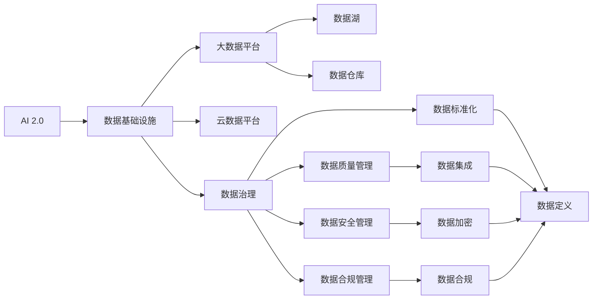

                 

# AI 2.0 时代的数据基础设施建设

> 关键词：AI 2.0, 数据基础设施, 大数据平台, 数据湖, 数据仓库, 云数据平台, 数据治理

## 1. 背景介绍

随着人工智能技术的快速发展和应用渗透，AI 2.0时代已经到来。AI 2.0强调人工智能与数据驱动决策的深度融合，其核心在于构建智能数据基础设施，实现数据的高效获取、存储、管理和利用。本文将从背景介绍开始，系统阐述AI 2.0时代数据基础设施的建设，探讨其核心概念、关键技术、应用场景与未来趋势。

## 2. 核心概念与联系

### 2.1 核心概念概述

要深入理解AI 2.0时代的数据基础设施，首先需要明确几个核心概念：

- **AI 2.0**：继AI 1.0和AI 1.5之后，AI 2.0强调利用人工智能技术赋能传统行业，提升决策智能。
- **数据基础设施**：包括数据获取、存储、处理、治理和应用的全生命周期管理平台，是AI 2.0的核心支撑。
- **大数据平台**：支持海量数据处理和分析的软硬件环境，是数据基础设施的重要组成部分。
- **数据湖**：一种分布式、非结构化的数据存储平台，支持多种数据源和数据格式。
- **数据仓库**：结构化的数据存储平台，支持数据查询和分析，用于业务决策。
- **云数据平台**：利用云计算资源构建的数据处理和分析平台，提供弹性的计算和存储资源。
- **数据治理**：通过规范化和标准化管理数据，确保数据质量、安全性和合规性。

这些概念之间有着密切的联系，构成了AI 2.0时代数据基础设施的完整框架。通过合理构建数据基础设施，AI 2.0可以更加高效地实现数据驱动的决策和智能化应用。

### 2.2 核心概念的联系

以下Mermaid流程图展示了这些核心概念之间的联系：



这个流程图展示了AI 2.0时代数据基础设施的总体架构，以及各个组件之间的联系。数据基础设施的核心目标是通过合理构建数据平台和治理机制，确保数据的高效获取、存储、处理和应用，从而支撑AI 2.0的智能决策和应用。

## 3. 核心算法原理 & 具体操作步骤

### 3.1 算法原理概述

AI 2.0时代的数据基础设施建设，主要依赖于数据处理和分析的算法原理，包括但不限于：

- **分布式计算**：利用多台计算节点并行处理数据，提高数据处理的效率。
- **大数据存储**：通过数据湖和数据仓库，实现海量数据的有效存储和管理。
- **数据挖掘与机器学习**：通过挖掘数据中的潜在知识，支持智能分析和预测。
- **数据可视化**：通过图表和仪表盘，直观展示数据处理和分析结果。

### 3.2 算法步骤详解

以下是构建AI 2.0时代数据基础设施的主要步骤：

**Step 1: 数据获取与清洗**

- 收集各类数据源，包括结构化数据、半结构化数据和非结构化数据。
- 对数据进行初步清洗，去除噪声和重复数据。

**Step 2: 数据存储与管理**

- 利用数据湖技术，将数据集中存储，支持大规模数据处理。
- 使用数据仓库技术，对结构化数据进行建模，支持高效的查询和分析。

**Step 3: 数据处理与计算**

- 利用分布式计算框架，对大规模数据进行高效处理。
- 使用机器学习算法，挖掘数据中的潜在知识，支持智能分析和预测。

**Step 4: 数据治理与保护**

- 通过数据治理机制，确保数据的质量、安全性和合规性。
- 使用数据加密和访问控制技术，保护数据免受未授权访问。

**Step 5: 数据应用与可视化**

- 将处理好的数据应用于各类AI 2.0应用场景，如智能决策、推荐系统等。
- 使用数据可视化工具，直观展示分析结果，支持业务决策。

### 3.3 算法优缺点

AI 2.0时代数据基础设施的构建，具有以下优点：

- **高效处理大规模数据**：利用分布式计算和大数据存储技术，可以高效处理海量数据。
- **支持智能分析和预测**：通过数据挖掘和机器学习算法，挖掘数据中的潜在知识，支持智能决策和预测。
- **数据治理与保护**：通过数据治理机制，确保数据的质量、安全性和合规性。

同时，也存在一些缺点：

- **复杂性高**：数据基础设施的构建涉及多种技术和工具，需要综合考虑数据源、存储、计算和治理等多个方面。
- **技术门槛高**：构建高效的数据基础设施，需要具备高水平的技术能力和经验。
- **成本高**：需要投入大量资金和技术资源，进行硬件和软件的采购和部署。

### 3.4 算法应用领域

AI 2.0时代的数据基础设施，主要应用于以下几个领域：

- **智能制造**：通过数据驱动的决策，优化生产流程和资源配置。
- **智慧医疗**：利用大数据和机器学习技术，支持医疗影像分析、疾病预测等应用。
- **金融科技**：通过智能分析和预测，提升金融风险管理、客户服务等功能。
- **智慧城市**：通过数据驱动的智能决策，提升城市管理和服务质量。
- **智能农业**：利用数据驱动的决策，优化农业生产和管理。

## 4. 数学模型和公式 & 详细讲解

### 4.1 数学模型构建

构建AI 2.0时代的数据基础设施，需要依赖于数学模型和算法原理。以下是几个关键的数学模型和公式：

**分布式计算模型**：

- **MapReduce模型**：分布式计算的基本模型，将计算任务分为Map和Reduce两个阶段。
- **Spark模型**：基于内存计算的分布式计算框架，支持高效的流处理和批处理。

**大数据存储模型**：

- **Hadoop生态系统**：包括HDFS、YARN等组件，支持海量数据存储和计算。
- **数据仓库模型**：基于关系数据库的设计，支持结构化数据的建模和查询。

**数据挖掘与机器学习模型**：

- **K-means聚类算法**：通过聚类分析，发现数据中的模式和趋势。
- **随机森林算法**：通过构建决策树，进行分类和回归分析。
- **深度学习模型**：如卷积神经网络(CNN)、循环神经网络(RNN)等，支持复杂的模式识别和预测。

### 4.2 公式推导过程

以下以K-means聚类算法为例，推导其数学模型和公式：

假设数据集为$X=\{x_1,x_2,\ldots,x_n\}$，其中$x_i=(x_{i1},x_{i2},\ldots,x_{id})$，$d$为数据维数。设$k$为聚类数目，$C=\{c_1,c_2,\ldots,c_k\}$为聚类中心。则K-means聚类的目标函数为：

$$
\min_{C}\sum_{i=1}^n\sum_{j=1}^k||x_i-c_j||^2
$$

其中$||\cdot||$为欧式距离。

K-means聚类的步骤如下：

1. 随机初始化$k$个聚类中心$c_j$。
2. 对于每个数据点$x_i$，计算其到每个聚类中心的距离，将其分配到距离最近的聚类中心$c_j$。
3. 重新计算每个聚类的中心$c_j$，即计算每个聚类中所有数据点的均值。
4. 重复步骤2和3，直到聚类中心不再发生变化或达到预设的迭代次数。

### 4.3 案例分析与讲解

以智能制造为例，利用数据基础设施进行智能决策的过程如下：

- **数据获取**：通过传感器和物联网设备，实时采集生产线的各项数据，包括温度、湿度、能耗等。
- **数据清洗与存储**：对采集到的数据进行清洗和预处理，利用数据湖技术进行集中存储。
- **数据处理与分析**：使用Spark等分布式计算框架，对历史数据和实时数据进行联合分析，发现生产线的异常和趋势。
- **智能决策**：利用机器学习算法，构建生产线的智能决策模型，优化生产计划和资源配置。
- **数据可视化**：使用数据可视化工具，展示生产线的实时状态和历史趋势，支持操作人员和决策者的日常管理。

## 5. 项目实践：代码实例和详细解释说明

### 5.1 开发环境搭建

构建AI 2.0时代数据基础设施，需要搭建完善的开发环境。以下是Python环境下搭建环境的步骤：

1. 安装Anaconda：从官网下载并安装Anaconda，用于创建独立的Python环境。
2. 创建并激活虚拟环境：
```bash
conda create -n bigdata-env python=3.8 
conda activate bigdata-env
```
3. 安装必要的工具包：
```bash
pip install pandas numpy matplotlib scikit-learn
```

### 5.2 源代码详细实现

以下是一个利用Spark进行大数据处理和分析的Python代码示例：

```python
from pyspark.sql import SparkSession
from pyspark.ml.clustering import KMeans

# 创建Spark会话
spark = SparkSession.builder.appName("BigDataClustering").getOrCreate()

# 读取数据集
df = spark.read.csv("data.csv", header=True, inferSchema=True)

# 定义聚类数目
k = 3

# 创建K-means模型
kmeans = KMeans(k=k)

# 对数据集进行聚类
model = kmeans.fit(df.select("feature1", "feature2"))

# 预测数据集
predicted = model.transform(df.select("feature1", "feature2"))

# 输出聚类结果
predicted.show(5)
```

### 5.3 代码解读与分析

以上代码展示了使用Spark进行大数据处理和聚类分析的过程：

1. **创建Spark会话**：创建Spark会话，用于执行Spark任务。
2. **读取数据集**：从本地文件读取CSV格式的数据集，并进行解析。
3. **定义聚类数目**：设定聚类数目为3，表示将数据分成3个聚类。
4. **创建K-means模型**：使用K-means算法创建聚类模型。
5. **对数据集进行聚类**：使用创建的模型对数据集进行聚类，生成聚类结果。
6. **输出聚类结果**：展示聚类结果的前5行数据。

## 6. 实际应用场景

### 6.1 智能制造

在智能制造领域，数据基础设施的应用可以显著提升生产线的智能化水平，优化生产流程和资源配置。通过数据驱动的决策，智能制造可以实现以下目标：

- **优化生产计划**：利用历史生产数据和实时监控数据，预测生产线的瓶颈和异常，优化生产计划和资源配置。
- **提高生产效率**：通过智能调度和设备维护，减少设备故障和停机时间，提高生产效率。
- **降低能耗和成本**：通过智能控制和优化，降低生产过程中的能耗和成本，提升企业的经济效益。

### 6.2 智慧医疗

在智慧医疗领域，数据基础设施的应用可以提升医疗服务的智能化水平，支持疾病预测和精准医疗。具体应用场景包括：

- **医学影像分析**：通过深度学习算法，对医学影像进行自动分析，辅助医生进行诊断和治疗。
- **疾病预测**：利用大数据和机器学习技术，预测患者的病情发展和治疗效果，提供个性化的治疗方案。
- **电子病历管理**：通过结构化存储和查询，管理患者的电子病历数据，提升医疗服务的质量和效率。

### 6.3 金融科技

在金融科技领域，数据基础设施的应用可以提升金融风险管理和客户服务的能力。具体应用场景包括：

- **信用评分**：利用大数据和机器学习技术，评估客户的信用风险，提供个性化的金融服务。
- **反欺诈检测**：通过数据挖掘和机器学习算法，识别异常交易行为，防止金融欺诈和风险。
- **客户服务**：利用自然语言处理技术，提供智能客服和金融咨询，提升客户体验和服务质量。

### 6.4 未来应用展望

未来，随着技术的不断进步和应用场景的扩展，AI 2.0时代的数据基础设施将进一步发展，具有以下趋势：

- **数据集成与融合**：通过数据湖和数据仓库，实现多种数据源的集成和融合，提升数据的多样性和完整性。
- **实时计算与流处理**：利用实时计算和流处理技术，支持实时数据处理和分析，提升决策的及时性和准确性。
- **自动机器学习**：通过自动化机器学习技术，提升模型的构建和优化效率，降低技术门槛。
- **边缘计算与物联网**：利用边缘计算和物联网技术，支持数据的高效采集和处理，提升数据处理的灵活性和可靠性。

## 7. 工具和资源推荐

### 7.1 学习资源推荐

要系统掌握AI 2.0时代数据基础设施的构建，需要学习相关理论和实践。以下是一些推荐的资源：

1. 《大数据技术与应用》系列书籍：介绍大数据平台和数据基础设施的基本概念和技术原理。
2. 《Python数据科学手册》：详细讲解Python在数据科学中的应用，包括数据处理和分析。
3. 《机器学习实战》：提供丰富的机器学习算法和实战案例，支持数据挖掘和预测分析。
4. 《K-means算法详解》：深入讲解K-means聚类算法的原理和应用，支持聚类分析。
5. 在线课程：如Coursera上的“数据科学与统计学”课程，提供系统的数据科学理论和方法。

### 7.2 开发工具推荐

要高效构建数据基础设施，需要选择合适的工具。以下是一些推荐的开发工具：

1. Apache Hadoop：开源的大数据处理框架，支持分布式计算和数据存储。
2. Apache Spark：基于内存计算的分布式计算框架，支持流处理和批处理。
3. TensorFlow：开源的深度学习框架，支持复杂的数据分析和预测。
4. Tableau：数据可视化工具，支持数据探索和交互式分析。
5. Jupyter Notebook：开源的交互式编程环境，支持Python等语言的开发和调试。

### 7.3 相关论文推荐

要深入理解AI 2.0时代数据基础设施的构建，需要阅读相关的学术论文。以下是一些推荐的论文：

1. 《Data Infrastructure for AI 2.0》：介绍AI 2.0时代数据基础设施的构建，支持智能决策和应用。
2. 《Big Data Analytics》：介绍大数据平台和数据基础设施的技术原理和应用场景。
3. 《Machine Learning Algorithms》：介绍机器学习算法的基本原理和实现方法，支持数据挖掘和预测分析。
4. 《Data治理与保护》：介绍数据治理和保护的基本概念和技术方法，支持数据安全和合规性管理。
5. 《Edge Computing》：介绍边缘计算和物联网技术的基本原理和应用场景，支持数据的高效采集和处理。

## 8. 总结：未来发展趋势与挑战

### 8.1 研究成果总结

本文系统介绍了AI 2.0时代数据基础设施的构建，涵盖数据获取、存储、处理、治理和应用的全生命周期管理。通过理论讲解和实践案例，展示了数据基础设施在智能制造、智慧医疗、金融科技等领域的广泛应用。

### 8.2 未来发展趋势

未来，AI 2.0时代数据基础设施的发展将呈现以下趋势：

- **数据集成与融合**：通过数据湖和数据仓库，实现多种数据源的集成和融合，提升数据的多样性和完整性。
- **实时计算与流处理**：利用实时计算和流处理技术，支持实时数据处理和分析，提升决策的及时性和准确性。
- **自动机器学习**：通过自动化机器学习技术，提升模型的构建和优化效率，降低技术门槛。
- **边缘计算与物联网**：利用边缘计算和物联网技术，支持数据的高效采集和处理，提升数据处理的灵活性和可靠性。

### 8.3 面临的挑战

尽管数据基础设施的发展前景广阔，但也面临一些挑战：

- **数据质量与治理**：如何确保数据的质量和治理，提升数据基础设施的稳定性和可靠性。
- **技术复杂性与成本**：如何降低技术复杂性，降低建设数据基础设施的成本，提升其在中小企业中的应用。
- **安全与隐私**：如何保护数据安全和隐私，防止数据泄露和滥用。
- **数据孤岛与兼容性**：如何打破数据孤岛，提升不同数据源和数据平台之间的兼容性。

### 8.4 研究展望

未来，需要在以下几个方面进行深入研究：

- **数据治理与标准化**：通过规范化和标准化管理数据，确保数据的质量、安全性和合规性。
- **数据集成与融合**：通过数据湖和数据仓库，实现多种数据源的集成和融合，提升数据的多样性和完整性。
- **自动化机器学习**：通过自动化机器学习技术，提升模型的构建和优化效率，降低技术门槛。
- **数据可视化与智能决策**：通过数据可视化工具，支持数据探索和智能决策，提升决策的及时性和准确性。

## 9. 附录：常见问题与解答

**Q1: 数据基础设施在AI 2.0中扮演什么角色？**

A: 数据基础设施在AI 2.0中扮演核心支撑的角色，负责数据的获取、存储、处理和治理，支持AI 2.0的智能决策和应用。

**Q2: 如何构建高效的数据基础设施？**

A: 构建高效的数据基础设施需要综合考虑数据源、存储、计算和治理等多个方面，选择合适的技术和工具，如Hadoop、Spark、TensorFlow等。同时需要关注数据的质量和治理，确保数据的安全性和合规性。

**Q3: 数据基础设施在智能制造中的应用场景是什么？**

A: 在智能制造中，数据基础设施的应用可以优化生产计划、提高生产效率、降低能耗和成本。具体应用场景包括生产线监控、设备维护、能源管理等。

**Q4: 数据基础设施在智慧医疗中的应用场景是什么？**

A: 在智慧医疗中，数据基础设施的应用可以提升医学影像分析、疾病预测、电子病历管理等能力。具体应用场景包括医院信息管理、远程医疗、患者监测等。

**Q5: 数据基础设施在金融科技中的应用场景是什么？**

A: 在金融科技中，数据基础设施的应用可以提升信用评分、反欺诈检测、客户服务等能力。具体应用场景包括银行风险管理、保险理赔、证券交易等。

总之，AI 2.0时代的数据基础设施是构建智能决策和应用的关键支撑，未来需要持续创新和优化，以应对数据处理和分析的复杂性和多样性，提升AI 2.0系统的性能和应用效果。

