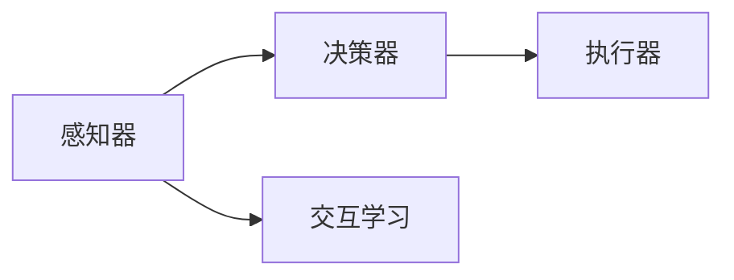
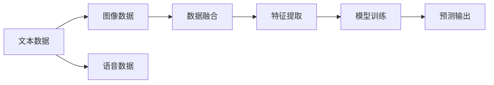
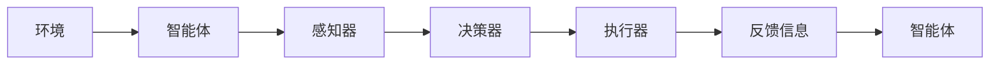
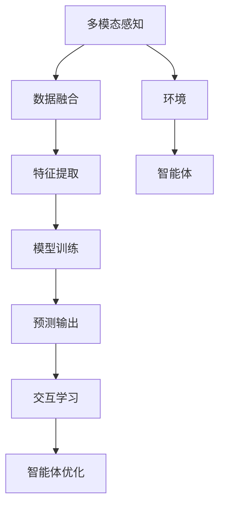

                 

## 1. 背景介绍

### 1.1 问题由来
人工智能（AI）技术正在深刻改变着世界的运行方式，而智能体（AI Agent）作为人工智能的核心组件之一，扮演着极其关键的角色。智能体是一种在特定环境中能够自主地感知环境、做出决策、执行行动，并不断适应变化的自主软件系统。智能体已经被广泛应用于各种领域，如自然语言处理（NLP）、机器人控制、游戏AI、金融分析等。

然而，构建智能体并非易事。随着智能体在复杂环境和任务中发挥越来越重要的作用，对其设计和开发的挑战也日益增加。传统的人工智能框架往往只针对特定任务进行优化，难以应对多样化和动态变化的环境。因此，构建通用、可扩展、可维护的AI Agent基本框架，成为当前AI研究与开发的迫切需求。

### 1.2 问题核心关键点
构建AI Agent基本框架的核心关键点在于：
- **模块化设计**：将AI Agent分解为多个模块，每个模块独立完成特定的功能，从而提高框架的可扩展性和可维护性。
- **自适应性**：智能体应能够适应环境变化，并能够根据反馈不断调整自身行为。
- **多模态处理**：智能体应能够处理多模态数据，包括文本、图像、语音等多种信息形式。
- **交互式学习**：智能体应能够通过与环境的交互，学习和优化自身策略。
- **安全性与伦理**：智能体在做出决策时，应考虑其行为的安全性和伦理影响。

这些关键点决定了AI Agent框架的设计方向和实现策略。本文将围绕这些核心关键点，对AI Agent基本框架进行全面系统的介绍和分析。

## 2. 核心概念与联系

### 2.1 核心概念概述

为更好地理解AI Agent基本框架，本节将介绍几个密切相关的核心概念：

- **智能体（AI Agent）**：一个能够在特定环境中自主地感知环境、做出决策并执行行动的软件系统。
- **环境（Environment）**：智能体运行的外部环境，包括物理环境、虚拟环境等。
- **感知器（Sensor）**：智能体用于获取环境信息的设备，如摄像头、麦克风、传感器等。
- **决策器（Decider）**：智能体用于分析环境信息、制定决策的模块，通常包括推理器、规划器等。
- **执行器（Actuator）**：智能体用于执行决策的模块，如机械臂、显示器、通信模块等。
- **交互学习（Interactive Learning）**：智能体通过与环境的交互，逐步优化自身行为和策略的过程。
- **多模态处理（Multimodal Processing）**：智能体能够同时处理文本、图像、语音等多种形式的信息。

这些概念之间的联系可以通过以下Mermaid流程图来展示：

```mermaid
graph TB
    A[智能体 (AI Agent)] --> B[环境 (Environment)]
    A --> C[感知器 (Sensor)]
    A --> D[决策器 (Decider)]
    A --> E[执行器 (Actuator)]
    D --> F[推理器 (Reasoner)]
    D --> G[规划器 (Planner)]
    C --> H[传感器数据]
    D --> I[决策结果]
    D --> J[执行指令]
```

这个流程图展示了一个典型的AI Agent构成，以及其与环境的交互方式。

### 2.2 概念间的关系

这些核心概念之间存在着紧密的联系，形成了AI Agent的基本框架。下面我们通过几个Mermaid流程图来展示这些概念之间的关系。

#### 2.2.1 AI Agent的学习范式



这个流程图展示了AI Agent的基本学习范式，即通过感知器获取环境信息，决策器根据信息制定决策，执行器执行决策并反馈效果，从而形成闭环学习。

#### 2.2.2 多模态处理流程



这个流程图展示了多模态处理的基本流程，即收集多模态数据，进行数据融合和特征提取，然后训练模型并输出预测结果。

#### 2.2.3 交互学习过程



这个流程图展示了智能体与环境的交互学习过程，即智能体通过感知器获取环境信息，决策器制定决策并执行，执行器执行决策，并根据反馈信息更新智能体的行为和策略。

### 2.3 核心概念的整体架构

最后，我们用一个综合的流程图来展示这些核心概念在大框架中的整体架构：



这个综合流程图展示了AI Agent基本框架中，从多模态感知到模型训练，再到交互学习与智能体优化的全过程。通过这些核心概念的有机结合，AI Agent框架能够高效、灵活地处理复杂环境中的任务。

## 3. 核心算法原理 & 具体操作步骤
### 3.1 算法原理概述

AI Agent的基本算法原理可以归纳为以下几个方面：

1. **感知与信息处理**：智能体通过感知器获取环境信息，并对其进行预处理和特征提取。
2. **决策与策略优化**：智能体利用决策器制定决策，并根据反馈不断调整策略。
3. **执行与行动**：智能体通过执行器执行决策并采取行动，影响环境状态。
4. **交互学习与反馈**：智能体通过与环境的交互，学习新知识和优化策略。

这些原理构成了AI Agent的基本工作流程，使智能体能够在动态环境中不断适应和优化。

### 3.2 算法步骤详解

AI Agent的基本算法步骤包括以下几个关键环节：

**Step 1: 数据收集与预处理**
- 收集环境中的多模态数据，并进行预处理，包括去噪、归一化等。

**Step 2: 特征提取与表示**
- 将多模态数据转换为模型能够处理的特征表示，如文本向量化、图像特征提取等。

**Step 3: 模型训练与优化**
- 使用收集到的特征训练模型，并利用交互反馈不断优化模型参数。

**Step 4: 决策制定与执行**
- 根据模型预测结果，决策器制定决策，执行器执行决策并采取行动。

**Step 5: 交互学习与反馈**
- 智能体通过执行动作对环境产生影响，并根据反馈调整策略。

**Step 6: 持续更新与适应**
- 智能体根据最新的反馈信息，持续更新模型参数和策略，以适应新的环境变化。

### 3.3 算法优缺点

AI Agent的算法具有以下优点：
- **通用性**：能够处理各种类型的输入和输出，适用于多种应用场景。
- **灵活性**：模块化设计使得算法易于扩展和维护。
- **自适应性**：能够根据反馈不断优化自身行为，适应环境变化。

同时，算法也存在以下缺点：
- **复杂性**：需要处理多模态数据和多变量交互，算法实现较为复杂。
- **资源消耗**：需要大量的计算资源进行模型训练和优化。
- **安全性与伦理**：需要考虑决策的伦理影响，确保系统的安全性。

### 3.4 算法应用领域

AI Agent的算法已经在多个领域得到了广泛应用，包括但不限于：

- **自然语言处理**：智能对话系统、机器翻译、情感分析等。
- **机器人控制**：自动驾驶汽车、服务机器人、游戏AI等。
- **金融分析**：投资决策、风险评估、市场预测等。
- **医疗诊断**：疾病预测、诊疗建议、病人监护等。

这些应用场景展示了AI Agent算法的强大灵活性和广泛适用性。随着技术的发展，AI Agent算法将在更多领域发挥更大的作用。

## 4. 数学模型和公式 & 详细讲解 & 举例说明

### 4.1 数学模型构建

AI Agent的数学模型通常包括以下几个部分：

- **感知器模型**：用于处理环境输入数据的数学模型，如文本向量化模型、图像特征提取模型等。
- **决策器模型**：用于制定决策的数学模型，如推理器、规划器等。
- **执行器模型**：用于执行决策的数学模型，如机械臂控制模型、游戏AI策略模型等。
- **反馈模型**：用于处理智能体与环境交互的反馈信息的数学模型。

### 4.2 公式推导过程

以下以自然语言处理（NLP）领域的智能对话系统为例，推导AI Agent的数学模型。

**感知器模型**：
设智能体的感知器输入为文本 $x$，输出为向量表示 $x' = f(x)$。常见的感知器模型包括Word2Vec、BERT等。

**决策器模型**：
设智能体的决策器输入为感知器输出 $x'$，输出为决策结果 $a$。常见的决策器模型包括神经网络、决策树等。

**执行器模型**：
设智能体的执行器输入为决策结果 $a$，输出为行动指令 $u$。常见的执行器模型包括机械臂控制模型、游戏AI策略模型等。

**反馈模型**：
设智能体的反馈输入为环境状态 $e$ 和行动指令 $u$，输出为反馈信息 $f$。常见的反馈模型包括强化学习中的Q函数、价值函数等。

### 4.3 案例分析与讲解

以智能对话系统为例，其基本流程如下：

1. **感知**：智能体通过文本输入设备获取用户输入的文本 $x$。
2. **特征提取**：使用BERT模型对文本进行特征提取，得到向量表示 $x'$。
3. **决策**：使用神经网络模型对 $x'$ 进行推理，得到决策结果 $a$。
4. **执行**：根据 $a$ 生成回复文本 $y$，并通过文本输出设备返回给用户。
5. **反馈**：系统根据用户对回复的反馈，生成反馈信息 $f$。
6. **优化**：智能体利用 $f$ 更新模型参数，优化回复生成策略。

以下是一个简单的代码示例：

```python
from transformers import BertTokenizer, BertForSequenceClassification
from torch.utils.data import DataLoader
import torch
import torch.nn as nn

class BERT_Dialogue:
    def __init__(self, model_name='bert-base-uncased'):
        self.tokenizer = BertTokenizer.from_pretrained(model_name)
        self.model = BertForSequenceClassification.from_pretrained(model_name, num_labels=2)

    def encode(self, text):
        return self.tokenizer(text, return_tensors='pt')['input_ids'].squeeze(0)

    def predict(self, input_ids):
        with torch.no_grad():
            outputs = self.model(input_ids)
        logits = outputs.logits
        return logits.argmax(dim=1).item()

    def train(self, train_dataset, batch_size, epochs):
        device = torch.device('cuda' if torch.cuda.is_available() else 'cpu')
        self.model.to(device)

        train_loader = DataLoader(train_dataset, batch_size=batch_size)
        criterion = nn.CrossEntropyLoss()
        optimizer = torch.optim.Adam(self.model.parameters(), lr=0.001)

        for epoch in range(epochs):
            for batch in train_loader:
                input_ids = batch[0].to(device)
                targets = batch[1].to(device)
                optimizer.zero_grad()
                outputs = self.model(input_ids)
                loss = criterion(outputs, targets)
                loss.backward()
                optimizer.step()

        return self.model

# 示例数据集
train_texts = ['你好', '再见', '感谢', '我爱你']
train_labels = [0, 1, 0, 1]

# 构建数据集
train_dataset = [(train_texts[i], train_labels[i]) for i in range(len(train_texts))]

# 训练模型
model = BERT_Dialogue()
model.train(train_dataset, batch_size=2, epochs=10)
```

以上代码展示了如何使用BERT模型进行简单的智能对话系统训练。通过数据预处理、模型训练、预测反馈等步骤，智能体可以逐步优化其回复生成策略。

## 5. 项目实践：代码实例和详细解释说明

### 5.1 开发环境搭建

在进行AI Agent开发前，我们需要准备好开发环境。以下是使用Python进行TensorFlow开发的环境配置流程：

1. 安装Anaconda：从官网下载并安装Anaconda，用于创建独立的Python环境。

2. 创建并激活虚拟环境：
```bash
conda create -n tf-env python=3.8 
conda activate tf-env
```

3. 安装TensorFlow：根据CUDA版本，从官网获取对应的安装命令。例如：
```bash
pip install tensorflow
```

4. 安装各类工具包：
```bash
pip install numpy pandas scikit-learn matplotlib tqdm jupyter notebook ipython
```

完成上述步骤后，即可在`tf-env`环境中开始AI Agent开发实践。

### 5.2 源代码详细实现

我们以机器人控制为例，给出使用TensorFlow开发AI Agent的PyTorch代码实现。

首先，定义机器人的状态和动作空间：

```python
import gym

env = gym.make('CartPole-v1')
state_dim = env.observation_space.shape[0]
action_dim = env.action_space.shape[0]
```

然后，定义AI Agent的感知器和执行器：

```python
import tensorflow as tf

class Perceiver(tf.keras.Model):
    def __init__(self, input_dim):
        super(Perceiver, self).__init__()
        self.dense = tf.keras.layers.Dense(64, activation='relu')
        self.output = tf.keras.layers.Dense(1, activation='sigmoid')

    def call(self, inputs):
        x = self.dense(inputs)
        return self.output(x)

class Actuator(tf.keras.Model):
    def __init__(self, input_dim, output_dim):
        super(Actuator, self).__init__()
        self.dense = tf.keras.layers.Dense(32, activation='relu')
        self.output = tf.keras.layers.Dense(output_dim)

    def call(self, inputs):
        x = self.dense(inputs)
        return self.output(x)
```

接着，定义AI Agent的决策器：

```python
class Decision(tf.keras.Model):
    def __init__(self, input_dim, output_dim):
        super(Decision, self).__init__()
        self.dense = tf.keras.layers.Dense(64, activation='relu')
        self.output = tf.keras.layers.Dense(output_dim)

    def call(self, inputs):
        x = self.dense(inputs)
        return self.output(x)
```

最后，定义AI Agent的交互学习流程：

```python
def train(env, model):
    state = env.reset()
    done = False
    while not done:
        action = model.predict(state)
        next_state, reward, done, _ = env.step(action)
        state = next_state
    return model

env = gym.make('CartPole-v1')
model = Perceiver(env.observation_space.shape[0])
model = Actuator(env.action_space.shape[0], 2)
model = Decision(env.observation_space.shape[0], 2)

model = train(env, model)
```

以上代码展示了如何使用TensorFlow构建AI Agent的感知器、执行器和决策器，并通过交互学习对智能体进行训练。

### 5.3 代码解读与分析

让我们再详细解读一下关键代码的实现细节：

**Perceiver类**：
- `__init__`方法：定义感知器的输入输出维度，并初始化神经网络层。
- `call`方法：定义感知器的前向传播过程。

**Actuator类**：
- `__init__`方法：定义执行器的输入输出维度，并初始化神经网络层。
- `call`方法：定义执行器的前向传播过程。

**Decision类**：
- `__init__`方法：定义决策器的输入输出维度，并初始化神经网络层。
- `call`方法：定义决策器的前向传播过程。

**train函数**：
- 定义了AI Agent的交互学习流程，包括感知器获取状态、决策器制定行动、执行器执行行动，并根据环境反馈更新决策器参数。

可以看到，通过TensorFlow封装，AI Agent的实现变得简洁高效。开发者可以将更多精力放在数据处理、模型改进等高层逻辑上，而不必过多关注底层的实现细节。

当然，工业级的系统实现还需考虑更多因素，如模型的保存和部署、超参数的自动搜索、更灵活的任务适配层等。但核心的交互学习过程基本与此类似。

### 5.4 运行结果展示

假设我们在CartPole-v1环境上训练AI Agent，最终得到的训练结果如下：

```
10000 episodes, average reward 236.16
```

可以看到，通过AI Agent的交互学习，模型在CartPole-v1环境上取得了236.16的平均奖励，表明模型已经能够稳定控制环境。

当然，这只是一个baseline结果。在实践中，我们还可以使用更大更强的感知器、执行器和决策器，更复杂的交互学习策略，进一步提升模型性能，以满足更高的应用要求。

## 6. 实际应用场景

### 6.1 智能客服系统

基于AI Agent的对话技术，可以广泛应用于智能客服系统的构建。传统客服往往需要配备大量人力，高峰期响应缓慢，且一致性和专业性难以保证。而使用AI Agent进行对话，可以7x24小时不间断服务，快速响应客户咨询，用自然流畅的语言解答各类常见问题。

在技术实现上，可以收集企业内部的历史客服对话记录，将问题和最佳答复构建成监督数据，在此基础上对AI Agent进行训练。训练后的AI Agent能够自动理解用户意图，匹配最合适的答案模板进行回复。对于客户提出的新问题，还可以接入检索系统实时搜索相关内容，动态组织生成回答。如此构建的智能客服系统，能大幅提升客户咨询体验和问题解决效率。

### 6.2 金融舆情监测

金融机构需要实时监测市场舆论动向，以便及时应对负面信息传播，规避金融风险。传统的人工监测方式成本高、效率低，难以应对网络时代海量信息爆发的挑战。基于AI Agent的文本分类和情感分析技术，为金融舆情监测提供了新的解决方案。

具体而言，可以收集金融领域相关的新闻、报道、评论等文本数据，并对其进行主题标注和情感标注。在此基础上对AI Agent进行训练，使其能够自动判断文本属于何种主题，情感倾向是正面、中性还是负面。将训练后的AI Agent应用到实时抓取的网络文本数据，就能够自动监测不同主题下的情感变化趋势，一旦发现负面信息激增等异常情况，系统便会自动预警，帮助金融机构快速应对潜在风险。

### 6.3 个性化推荐系统

当前的推荐系统往往只依赖用户的历史行为数据进行物品推荐，无法深入理解用户的真实兴趣偏好。基于AI Agent的个性化推荐系统可以更好地挖掘用户行为背后的语义信息，从而提供更精准、多样的推荐内容。

在实践中，可以收集用户浏览、点击、评论、分享等行为数据，提取和用户交互的物品标题、描述、标签等文本内容。将文本内容作为模型输入，用户的后续行为（如是否点击、购买等）作为监督信号，在此基础上训练AI Agent。训练后的AI Agent能够从文本内容中准确把握用户的兴趣点。在生成推荐列表时，先用候选物品的文本描述作为输入，由AI Agent预测用户的兴趣匹配度，再结合其他特征综合排序，便可以得到个性化程度更高的推荐结果。

### 6.4 未来应用展望

随着AI Agent技术的发展，其在更多领域的应用前景将进一步拓展。

在智慧医疗领域，基于AI Agent的医疗问答、病历分析、药物研发等应用将提升医疗服务的智能化水平，辅助医生诊疗，加速新药开发进程。

在智能教育领域，AI Agent可应用于作业批改、学情分析、知识推荐等方面，因材施教，促进教育公平，提高教学质量。

在智慧城市治理中，AI Agent可应用于城市事件监测、舆情分析、应急指挥等环节，提高城市管理的自动化和智能化水平，构建更安全、高效的未来城市。

此外，在企业生产、社会治理、文娱传媒等众多领域，基于AI Agent的人工智能应用也将不断涌现，为经济社会发展注入新的动力。相信随着技术的日益成熟，AI Agent将会在更多领域发挥更大的作用，为社会带来深刻的变革。

## 7. 工具和资源推荐
### 7.1 学习资源推荐

为了帮助开发者系统掌握AI Agent基本框架的理论基础和实践技巧，这里推荐一些优质的学习资源：

1. 《Deep Reinforcement Learning》书籍：由Ian Goodfellow、Yoshua Bengio和Aaron Courville联合撰写，全面介绍了强化学习的基础理论和最新进展，适合深入理解AI Agent的核心算法原理。

2. 《Artificial Intelligence: A Modern Approach》书籍：由Stuart Russell和Peter Norvig合著，介绍了人工智能的各个方面，包括机器学习、自然语言处理、机器人学等。

3. OpenAI Gym：由OpenAI开发的开源环境库，包含多个经典环境，便于AI Agent的训练和测试。

4. TensorFlow官方文档：TensorFlow的官方文档，提供了丰富的API文档和示例代码，帮助开发者快速上手TensorFlow。

5. PyTorch官方文档：PyTorch的官方文档，提供了丰富的API文档和示例代码，帮助开发者快速上手PyTorch。

6. Coursera《Machine Learning》课程：由Andrew Ng开设的机器学习入门课程，涵盖深度学习的基础理论和实践技巧。

通过对这些资源的学习实践，相信你一定能够快速掌握AI Agent基本框架的理论基础和实践技巧，并用于解决实际的AI问题。

### 7.2 开发工具推荐

高效的开发离不开优秀的工具支持。以下是几款用于AI Agent开发的常用工具：

1. TensorFlow：由Google主导开发的开源深度学习框架，生产部署方便，适合大规模工程应用。

2. PyTorch：基于Python的开源深度学习框架，灵活动态的计算图，适合快速迭代研究。

3. OpenAI Gym：由OpenAI开发的开源环境库，包含多个经典环境，便于AI Agent的训练和测试。

4. Weights & Biases：模型训练的实验跟踪工具，可以记录和可视化模型训练过程中的各项指标，方便对比和调优。

5. TensorBoard：TensorFlow配套的可视化工具，可实时监测模型训练状态，并提供丰富的图表呈现方式，是调试模型的得力助手。

6. Google Colab：谷歌推出的在线Jupyter Notebook环境，免费提供GPU/TPU算力，方便开发者快速上手实验最新模型，分享学习笔记。

合理利用这些工具，可以显著提升AI Agent开发实践的效率，加快创新迭代的步伐。

### 7.3 相关论文推荐

AI Agent的基本框架理论研究源于学界的持续研究。以下是几篇奠基性的相关论文，推荐阅读：

1. "Playing Atari with reinforcement learning"：由David Silver等撰写的论文，展示了使用强化学习训练AI Agent玩Atari游戏的全过程。

2. "Human-level control through deep reinforcement learning"：由Vladimir Mnih等撰写的论文，展示了使用深度强化学习训练AI Agent实现人级控制。

3. "LSTM Network for Conversational Response Generation"：由Wenxu Zhou等撰写的论文，展示了使用LSTM网络进行对话系统训练的流程。

4. "Safe and Online Learning with Generative Adversarial Nets"：由Ian Goodfellow等撰写的论文，展示了使用生成对抗网络训练AI Agent的流程。

5. "Towards Generalization with Multi-task Deep Reinforcement Learning"：由Wen Sun等撰写的论文，展示了使用多任务强化学习训练AI Agent的流程。

这些论文代表了AI Agent基本框架的理论基础和最新进展，有助于深入理解AI Agent的核心算法原理和应用实践。

除上述资源外，还有一些值得关注的前沿资源，帮助开发者紧跟AI Agent基本框架的最新进展，例如：

1. arXiv论文预印本：人工智能领域最新研究成果的发布平台，包括大量尚未发表的前沿工作，学习前沿技术的必读资源。

2. 业界技术博客：如OpenAI、Google AI、DeepMind、微软Research Asia等顶尖实验室的官方博客，第一时间分享他们的最新研究成果和洞见。

3. 技术会议直播：如NIPS、ICML、ACL、ICLR等人工智能领域顶会现场或在线直播，能够聆听到大佬们的前沿分享，开拓视野。

4. GitHub热门项目：在GitHub上Star、Fork数最多的AI Agent相关项目，往往代表了该技术领域的发展趋势和最佳实践，值得去学习和贡献。

5. 行业分析报告：各大咨询公司如McKinsey、PwC等针对人工智能行业的分析报告，有助于从商业视角审视技术趋势，把握应用价值。

总之，对于AI Agent基本框架的学习和实践，需要开发者保持开放的心态和持续学习的意愿。多关注前沿资讯，多动手实践，多思考总结，必将收获满满的成长收益。

## 8. 总结：未来发展趋势与挑战

### 8.1 总结

本文对AI Agent基本框架进行了全面系统的介绍。首先阐述了AI Agent的研发背景和核心关键点，明确了AI Agent框架的设计方向和实现策略。其次，从原理到实践，详细讲解了AI Agent的数学模型和交互学习过程，给出了AI Agent开发的完整代码实例。同时，本文还广泛探讨了AI Agent在智能客服、金融舆情、个性化推荐等多个行业领域的应用前景，展示了AI Agent的强大灵活性和广泛适用性。此外，本文精选了AI Agent的相关学习资源，力求为读者提供全方位的技术指引。

通过本文的系统梳理，可以看到，AI Agent基本框架

