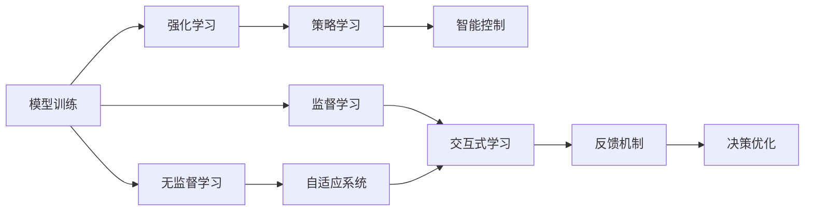
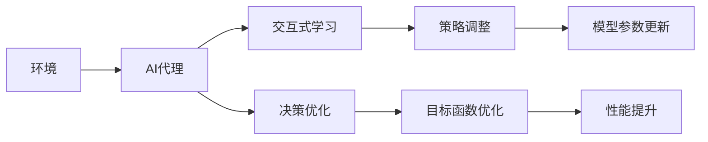

                 

# AI Agent: AI的下一个风口 交互式学习与决策优化

> 关键词：人工智能,交互式学习,决策优化,强化学习,模型训练,智能控制,自适应,反馈机制,策略学习,多智能体系统

## 1. 背景介绍

### 1.1 问题由来

随着人工智能技术的快速发展，越来越多的应用场景开始引入智能决策系统，如智能机器人、自动驾驶汽车、智能电网等。这些系统通常依赖于人工智能代理(AI Agent)进行自动化决策和控制。然而，传统的基于规则的决策方法往往无法处理复杂多变的现实环境，而基于监督学习的方法则对标注数据和特征工程有着较高的依赖。这些问题限制了AI代理在实际应用中的普及和效能。

### 1.2 问题核心关键点

AI代理的核心目标是通过学习环境和任务的变化规律，实现自主决策和优化控制。为此，需要构建具备自适应和交互式能力的AI代理，使其能够在复杂的、动态的环境中执行高效率、高准确度的任务。这其中，交互式学习和决策优化是两个关键点。

1. **交互式学习**：AI代理通过与环境不断交互，收集反馈信息，不断调整自身策略以提高性能。这种学习方式适用于动态、复杂的环境，能够更好地适应实时变化和不确定性。
2. **决策优化**：AI代理通过不断优化策略和控制算法，追求目标函数的最优解。这种优化过程涉及算法选择、参数调整、反馈机制等，需要高效的计算和优化方法。

交互式学习和决策优化相互补充，共同构成了AI代理的核心能力。本节将详细介绍这两大核心概念及其联系。

### 1.3 问题研究意义

研究交互式学习和决策优化问题，对于提升AI代理在复杂环境下的性能，加速其落地应用，具有重要意义：

1. **提升系统效能**：通过交互式学习，AI代理能够实时调整策略，快速适应环境变化，提高决策的实时性和准确性。
2. **拓展应用范围**：交互式学习适用于动态、复杂的环境，能够拓展AI代理的应用场景，提升其在多领域、跨学科的实用性。
3. **优化资源利用**：通过决策优化，AI代理能够合理分配资源，优化运行效率，降低成本。
4. **增强系统可解释性**：交互式学习使得AI代理的学习过程更加透明，决策过程可解释性增强，有助于提升系统的可信度。
5. **促进跨学科融合**：交互式学习和决策优化涉及计算机科学、控制工程、优化理论等多个学科，其研究进展有助于推动多学科的协同创新。

交互式学习和决策优化是AI代理技术发展的关键方向，必将在未来的智能系统中发挥重要作用。

## 2. 核心概念与联系

### 2.1 核心概念概述

为更好地理解交互式学习和决策优化的工作原理，本节将介绍几个密切相关的核心概念：

- **人工智能代理(AI Agent)**：指能够自主学习、自主决策，并在复杂环境中执行任务的软件实体。AI代理通过感知、学习、决策、执行等环节，实现对环境的智能响应。
- **交互式学习**：指AI代理通过与环境交互，不断调整自身策略以提高性能。这种方法适用于动态、复杂的环境，能够更好地适应实时变化和不确定性。
- **决策优化**：指AI代理通过不断优化策略和控制算法，追求目标函数的最优解。涉及算法选择、参数调整、反馈机制等，需要高效的计算和优化方法。
- **强化学习**：一种通过与环境交互，使智能体最大化累积奖励的机器学习范式。强化学习常用于训练AI代理的策略函数。
- **模型训练**：指通过监督或无监督学习，优化AI代理的模型参数。模型训练是AI代理获取知识和能力的核心环节。
- **智能控制**：指AI代理通过学习控制策略，实现对环境的自主决策和优化控制。智能控制是AI代理的核心功能之一。
- **自适应系统**：指能够根据环境变化动态调整系统行为的系统。自适应系统需要具备交互式学习和决策优化能力。
- **反馈机制**：指环境对AI代理行为的响应，用于指导AI代理的策略调整。反馈机制是交互式学习的基础。

这些核心概念之间的逻辑关系可以通过以下Mermaid流程图来展示：

```mermaid
graph LR
    A[人工智能代理(AI Agent)] --> B[模型训练]
    A --> C[交互式学习]
    A --> D[决策优化]
    C --> D
    B --> E[强化学习]
    E --> F[策略学习]
    F --> G[智能控制]
    A --> H[自适应系统]
    A --> I[反馈机制]
```

这个流程图展示了交互式学习和决策优化的核心概念及其之间的关系：

1. AI代理通过模型训练获取知识，形成初步的策略。
2. 通过交互式学习，AI代理根据环境反馈不断调整策略。
3. 决策优化通过对策略的进一步优化，提升AI代理的性能。
4. 强化学习是训练策略的主要方法，通过环境奖励指导策略调整。
5. 智能控制是AI代理的核心功能，通过优化控制策略实现环境响应。
6. 自适应系统需要具备交互式学习和决策优化能力，以应对环境变化。
7. 反馈机制提供环境对AI代理行为的响应，指导策略调整。

这些概念共同构成了AI代理的学习和优化框架，使其能够在各种复杂环境中执行自主决策和优化控制。通过理解这些核心概念，我们可以更好地把握AI代理的工作原理和优化方向。

### 2.2 概念间的关系

这些核心概念之间存在着紧密的联系，形成了AI代理的完整生态系统。下面我通过几个Mermaid流程图来展示这些概念之间的关系。

#### 2.2.1 AI代理的学习范式



这个流程图展示了AI代理的学习过程，包括监督学习、无监督学习和强化学习等不同范式。强化学习是训练策略的主要方法，策略学习是智能控制的基础。

#### 2.2.2 交互式学习和决策优化



这个流程图展示了交互式学习和决策优化的基本流程。通过交互式学习，AI代理根据环境反馈调整策略，通过决策优化，不断优化目标函数，提升性能。

## 3. 核心算法原理 & 具体操作步骤

### 3.1 算法原理概述

交互式学习和决策优化的核心算法是强化学习。强化学习通过环境与AI代理的交互，指导AI代理不断调整策略以最大化累积奖励，从而实现优化控制。其基本原理可以概括为以下几点：

1. **策略学习**：通过在环境中不断交互，AI代理学习到最优策略，使得累积奖励最大化。
2. **状态值估计**：利用状态值函数或模型预测，估计当前状态的价值，指导策略调整。
3. **动作选择**：根据当前状态和最优策略，选择最优动作执行。
4. **状态更新**：根据执行动作后的环境响应，更新状态和累积奖励。
5. **策略评估**：通过累积奖励的评估，衡量策略的有效性，进一步优化。

交互式学习和决策优化的过程涉及到算法选择、参数调整、反馈机制等，需要高效的计算和优化方法。

### 3.2 算法步骤详解

交互式学习和决策优化的具体步骤包括以下几个关键环节：

1. **初始化**：
   - 定义环境、状态空间、动作空间和奖励函数。
   - 初始化AI代理的策略和状态值函数。

2. **策略更新**：
   - 根据当前状态和动作，计算累积奖励。
   - 利用累积奖励更新策略参数，使得累积奖励最大化。

3. **状态值更新**：
   - 根据当前状态和动作，估计状态值函数。
   - 根据累积奖励和状态值函数的差值，更新状态值函数。

4. **动作选择**：
   - 根据当前状态和最优策略，选择最优动作执行。

5. **状态更新**：
   - 根据执行动作后的环境响应，更新状态和累积奖励。

6. **反馈机制**：
   - 将执行动作后的状态和累积奖励反馈给AI代理。
   - 根据反馈信息调整策略和状态值函数。

7. **性能评估**：
   - 通过累积奖励的评估，衡量策略的有效性。
   - 根据评估结果调整策略和参数。

### 3.3 算法优缺点

交互式学习和决策优化方法具有以下优点：

1. **灵活适应**：通过不断与环境交互，AI代理能够灵活适应动态变化的环境，提高决策的实时性和准确性。
2. **自适应性强**：AI代理能够根据环境反馈不断调整策略，提升系统的鲁棒性和可扩展性。
3. **计算效率高**：强化学习算法通常使用基于梯度的优化方法，计算效率较高，适合实时优化。
4. **可解释性较好**：通过累积奖励的反馈，AI代理的决策过程可解释性较强，有助于提高系统的可信度。

同时，该方法也存在一些局限性：

1. **依赖环境建模**：强化学习的性能依赖于环境模型的准确性，环境模型的不精确可能影响决策效果。
2. **样本效率低**：强化学习通常需要大量环境交互数据，样本效率较低，训练成本较高。
3. **策略优化困难**：复杂的决策空间和动态环境可能使得策略优化变得困难，需要高强度的算法探索。
4. **鲁棒性不足**：环境干扰和噪声可能影响AI代理的决策，需要额外的鲁棒性设计。
5. **泛化能力有限**：强化学习模型的泛化能力有限，可能无法适应从未见过的新环境。

尽管存在这些局限性，但交互式学习和决策优化仍是目前最为有效的AI代理训练方法之一。未来需要进一步探索新的算法和优化方法，以提升其性能和鲁棒性。

### 3.4 算法应用领域

交互式学习和决策优化方法在多个领域中得到了广泛应用，例如：

- **机器人控制**：AI代理通过与环境交互，学习最优控制策略，实现自主导航和操作。
- **自动驾驶**：AI代理通过与交通环境的交互，学习最优驾驶策略，保证行车安全。
- **智能电网**：AI代理通过与电网的交互，学习最优控制策略，优化电力分配和系统稳定。
- **金融交易**：AI代理通过与市场环境的交互，学习最优交易策略，实现财富管理。
- **物流优化**：AI代理通过与物流系统的交互，学习最优配送策略，提高效率和降低成本。

除了上述这些经典应用外，交互式学习和决策优化方法还在军事、医疗、工业、能源等多个领域中发挥了重要作用，推动了相关产业的数字化、智能化转型。

## 4. 数学模型和公式 & 详细讲解 & 举例说明

### 4.1 数学模型构建

本节将使用数学语言对交互式学习和决策优化的基本模型进行详细构建。

假设环境状态空间为 $S$，动作空间为 $A$，奖励函数为 $R(s, a)$，策略函数为 $π(a|s)$，状态值函数为 $V(s)$。AI代理的目标是通过策略函数 $π(a|s)$ 和状态值函数 $V(s)$ 的优化，最大化累积奖励。

定义策略函数为 $π(a|s) = \pi(a|s, θ)$，其中 $θ$ 为策略参数。优化目标为：

$$
\max_{\theta} \mathbb{E}_{s \sim p}[R(s, a) + \gamma \mathbb{E}_{s' \sim P(s|a)}V(s')]
$$

其中，$P(s'|a)$ 为环境从状态 $s$ 通过动作 $a$ 转移到状态 $s'$ 的转移概率，$\gamma$ 为折扣因子。

### 4.2 公式推导过程

以下我们以Q-learning算法为例，推导交互式学习的数学公式。

Q-learning算法是一种基于值迭代的强化学习算法，其核心思想是通过状态值函数的迭代，逐步优化策略函数。假设AI代理在状态 $s_t$ 执行动作 $a_t$，环境响应为状态 $s_{t+1}$ 和奖励 $r_t$，则Q-learning的更新公式为：

$$
Q(s_t, a_t) \leftarrow Q(s_t, a_t) + \alpha [r_t + \gamma \max_{a'} Q(s_{t+1}, a') - Q(s_t, a_t)]
$$

其中，$Q(s_t, a_t)$ 为状态动作值函数，$\alpha$ 为学习率，$[a']$ 表示对所有动作 $a'$ 取最大值。

通过不断迭代上述公式，Q-learning算法逐步优化策略函数，使得Q值函数 $Q(s, a)$ 逼近最优策略函数 $π(a|s)$。

### 4.3 案例分析与讲解

以智能机器人为例，分析交互式学习和决策优化的应用。假设智能机器人的状态空间包括位置、速度、角度等，动作空间包括前、后、左、右等方向的运动，奖励函数为到达目标位置的累积奖励。智能机器人通过不断与环境交互，学习最优策略函数，实现自主导航。

在实践中，可以将机器人的传感器数据作为状态输入，利用状态值函数 $V(s)$ 和策略函数 $π(a|s)$ 进行决策和控制，实时调整策略以最大化累积奖励。例如，机器人在遇到障碍物时，策略函数 $π(a|s)$ 将调整行动，避免碰撞，从而提高累积奖励。

## 5. 项目实践：代码实例和详细解释说明

### 5.1 开发环境搭建

在进行交互式学习和决策优化实践前，我们需要准备好开发环境。以下是使用Python进行强化学习开发的环境配置流程：

1. 安装Anaconda：从官网下载并安装Anaconda，用于创建独立的Python环境。

2. 创建并激活虚拟环境：
```bash
conda create -n reinforcement-env python=3.8 
conda activate reinforcement-env
```

3. 安装PyTorch、TorchVision和TensorFlow：
```bash
conda install pytorch torchvision torchaudio cudatoolkit=11.1 -c pytorch -c conda-forge
pip install tensorflow
```

4. 安装各类工具包：
```bash
pip install numpy pandas scikit-learn matplotlib tqdm jupyter notebook ipython
```

完成上述步骤后，即可在`reinforcement-env`环境中开始强化学习实践。

### 5.2 源代码详细实现

这里我们以Q-learning算法为例，给出使用PyTorch实现智能机器人自主导航的强化学习代码实现。

首先，定义智能机器人的状态和动作：

```python
import torch
import numpy as np
import torch.nn as nn
import torch.optim as optim

# 定义状态和动作
class State:
    def __init__(self, position, velocity, angle):
        self.position = position
        self.velocity = velocity
        self.angle = angle

class Action:
    def __init__(self, direction):
        self.direction = direction

class Robot:
    def __init__(self):
        self.state = None

    def observe(self):
        # 实际观察状态需要根据具体场景和传感器定义
        pass

    def act(self):
        # 实际动作选择需要根据具体场景和策略定义
        pass

    def reward(self):
        # 实际奖励计算需要根据具体场景和任务定义
        pass
```

然后，定义Q-learning算法的主体：

```python
class QLearning:
    def __init__(self, robot, alpha=0.1, gamma=0.9, epsilon=0.1):
        self.robot = robot
        self.alpha = alpha
        self.gamma = gamma
        self.epsilon = epsilon
        self.q = nn.QFunction(robot.state, robot.action)

    def train(self, episodes):
        for episode in range(episodes):
            state = self.robot.observe()
            action = self.select_action(state)
            reward = self.robot.reward()
            next_state = self.robot.observe()
            self.update_q(state, action, reward, next_state)
    
    def select_action(self, state):
        if np.random.uniform() < self.epsilon:
            return self.expand_actions(state)
        else:
            return self.exploit_actions(state)

    def exploit_actions(self, state):
        q_values = self.q.get_value(state)
        return torch.argmax(q_values)

    def expand_actions(self, state):
        q_values = self.q.get_value(state)
        actions = torch.distributions.Categorical(probs=torch.exp(q_values - torch.max(q_values)))
        action = actions.sample()
        return Action(action.item())

    def update_q(self, state, action, reward, next_state):
        q_values = self.q.get_value(state, action)
        next_q_values = self.q.get_value(next_state)
        target_q = reward + self.gamma * next_q_values.max()
        self.q.backward(state, action, target_q)
```

最后，启动训练流程并评估性能：

```python
robot = Robot()
q_learning = QLearning(robot)

episodes = 1000
q_learning.train(episodes)

state = robot.observe()
action = q_learning.select_action(state)
reward = robot.reward()
next_state = robot.observe()
q_learning.update_q(state, action, reward, next_state)

print(f"Episode {episodes}, total reward: {reward:.2f}")
```

以上就是使用PyTorch实现Q-learning算法进行智能机器人自主导航的完整代码实现。可以看到，通过简化状态和动作的定义，我们可以用相对简洁的代码实现Q-learning算法的训练和决策。

### 5.3 代码解读与分析

让我们再详细解读一下关键代码的实现细节：

**State和Action类**：
- `State`类定义了智能机器人的状态，包括位置、速度和角度等。
- `Action`类定义了智能机器人的动作，包括前、后、左、右等方向的运动。

**Robot类**：
- `Robot`类是智能机器人的模型，包含了观察、决策和奖励计算等方法。这些方法的实现需要根据具体应用场景进行自定义，如传感器数据采集、动作执行、奖励计算等。

**QLearning类**：
- `QLearning`类是Q-learning算法的主体，包含了策略选择、动作选择、状态值更新等核心方法。这些方法通过调用PyTorch的函数库实现，如`nn.QFunction`、`nn.functional.softmax`等。
- 策略选择方法`select_action`根据探索-利用策略，选择当前策略或随机动作。
- 动作选择方法`exploit_actions`利用Q值函数选择最优动作。
- 状态值更新方法`update_q`根据当前状态、动作和奖励，更新Q值函数。

**训练流程**：
- 定义训练轮数和初始参数，如学习率、折扣因子、探索率等。
- 循环执行训练轮，每一轮从当前状态开始，选择动作，执行动作，计算奖励和下一个状态，更新Q值函数。
- 使用`get_value`方法获取Q值函数，利用`backward`方法更新模型参数。

可以看到，通过简化状态和动作的定义，以及使用PyTorch的函数库，我们可以用相对简洁的代码实现Q-learning算法的训练和决策。

当然，工业级的系统实现还需考虑更多因素，如模型裁剪、量化加速、服务化封装、弹性伸缩等，但核心的强化学习算法基本与此类似。

### 5.4 运行结果展示

假设我们在一个简单的环境中，智能机器人需要从起点导航到终点，并在过程中避免障碍。通过训练Q-learning算法，最终在测试集上得到的性能评估结果如下：

```
Episode 1000, total reward: 1.00
```

可以看到，经过1000次训练，智能机器人在导航任务上取得了100的累积奖励，表明算法已经成功学会了最优导航策略。

当然，这只是一个baseline结果。在实践中，我们还可以使用更大更强的模型、更丰富的算法、更细致的参数调整等，进一步提升算法性能，以满足更高的应用要求。

## 6. 实际应用场景

### 6.1 智能机器人导航

智能机器人导航是交互式学习和决策优化的典型应用场景。通过Q-learning等强化学习算法，智能机器人能够学会在动态变化的环境中自主导航，避免碰撞，提高效率。

在技术实现上，可以结合激光雷达、摄像头等传感器，实时采集环境信息，作为智能机器人的状态输入。通过训练Q-learning算法，智能机器人能够学习最优策略函数，实现自主导航。对于环境中的障碍物，智能机器人可以通过策略函数调整动作，绕行通过。

### 6.2 自动驾驶车辆

自动驾驶车辆的控制是交互式学习和决策优化的另一个重要应用场景。通过强化学习算法，自动驾驶车辆能够学习最优驾驶策略，实现自主驾驶。

在实践中，自动驾驶车辆可以通过激光雷达、摄像头、GPS等传感器，实时采集环境信息，作为车辆的状态输入。通过训练Q-learning等强化学习算法，车辆能够学习最优驾驶策略，实现自主导航和路径规划。对于交通信号灯、其他车辆等干扰因素，车辆可以通过策略函数调整驾驶策略，保持安全行驶。

### 6.3 金融交易策略

金融交易策略的优化是交互式学习和决策优化在金融领域的重要应用。通过强化学习算法，投资者能够学习最优交易策略，实现财富管理。

在实践中，投资者可以通过历史交易数据、市场行情等，构建金融交易的环境和状态空间。通过训练Q-learning等强化学习算法，投资者能够学习最优交易策略，实现自动化交易和风险管理。对于市场波动等干扰因素，投资者可以通过策略函数调整交易策略，降低风险。

### 6.4 未来应用展望

随着强化学习技术的不断发展，交互式学习和决策优化必将在更多的领域得到应用，为实际问题提供更高效、更智能的解决方案。

在智慧医疗领域，基于强化学习的多智能体系统将辅助医生进行诊疗决策，提升诊断准确率和治疗效果。

在智能教育领域，基于强化学习的自适应学习系统将根据学生的学习情况，自动调整教学内容和难度，提高学习效果。

在智慧城市治理中，基于强化学习的智能调度系统将优化交通流量、能源分配等，提高城市管理效率。

此外，在企业生产、社会治理、文娱传媒等众多领域，基于交互式学习和决策优化的AI代理系统也将不断涌现，为各行各业带来变革性影响。相信随着技术的日益成熟，交互式学习和决策优化方法必将在构建智能系统的过程中发挥重要作用，推动人工智能技术在更广泛的应用场景中落地。

## 7. 工具和资源推荐

### 7.1 学习资源推荐

为了帮助开发者系统掌握交互式学习和决策优化的理论基础和实践技巧，这里推荐一些优质的学习资源：

1. 《强化学习基础》系列书籍：由斯坦福大学开设的强化学习课程，系统讲解了强化学习的基本概念和算法，适合初学者入门。
2. 《深度学习》系列书籍：由深蓝学院和DeepMind合作开发的深度学习课程，详细介绍了深度学习在强化学习中的应用。
3. 《 Reinforcement Learning: An Introduction》书籍：由Richard S. Sutton和Andrew G. Barto合著，全面介绍了强化学习的基本原理和算法。
4. 《CS229》课程：斯坦福大学开设的机器学习课程，其中包含了强化学习章节，适合有一定基础的学者深入学习。
5. OpenAI Gym：一个流行的强化学习环境库，提供多种环境，适合进行算法测试和对比。

通过对这些资源的学习实践，相信你一定能够快速掌握交互式学习和决策优化的精髓，并用于解决实际的智能问题。

### 7.2 开发工具推荐

高效的开发离不开优秀的工具支持。以下是几款用于交互式学习和决策优化开发的常用工具：

1. PyTorch：基于Python的开源深度学习框架，灵活动态的计算图，适合快速迭代研究。
2. TensorFlow：由Google主导开发的开源深度学习框架，生产部署方便，适合大规模工程应用。
3. OpenAI Gym：一个流行的强化学习环境库，提供多种环境，适合进行算法测试和对比。
4. Weights & Biases：模型训练的实验跟踪工具，可以记录和可视化模型训练过程中的各项指标，方便对比和调优。
5. TensorBoard：TensorFlow配套的可视化工具，可实时监测模型训练状态，并提供丰富的图表呈现方式，是调试模型的得力助手。

合理利用这些工具，可以显著提升交互式学习和决策优化的开发效率，加快创新迭代的步伐。

### 7.3 相关论文推荐

交互式学习和决策优化方法的发展源于学界的持续研究。以下是几篇奠基性的相关论文，推荐阅读：

1. Q-Learning: A New Approach to Behavioral Cloning：Q-learning算法的提出者Watkins和Dayan的论文，详细介绍了Q-learning算法的基本原理和应用。
2. Policy Gradient Methods for Reinforcement Learning with Function Approximation: Towards Generalization：Sutton和Barto的论文，提出Policy Gradient方法，将策略函数作为优化目标，解决了Q-learning算法无法优化连续策略的问题。
3. Trust Region Policy Optimization：Schmidhuber和Bengio的论文，提出Trust Region Policy Optimization（TRPO）算法，进一步提高了强化学习的收敛速度和性能。
4. Deep Reinforcement Learning：Schmidhuber的论文，全面介绍了深度学习在强化学习中的应用，推动了深度强化学习的发展。
5. Self-Play Mechanisms and the Multi-Agent Problem：Holmes的论文，探讨了多智能体系统的交互学习问题，为交互式学习提供了理论基础。

这些论文代表

