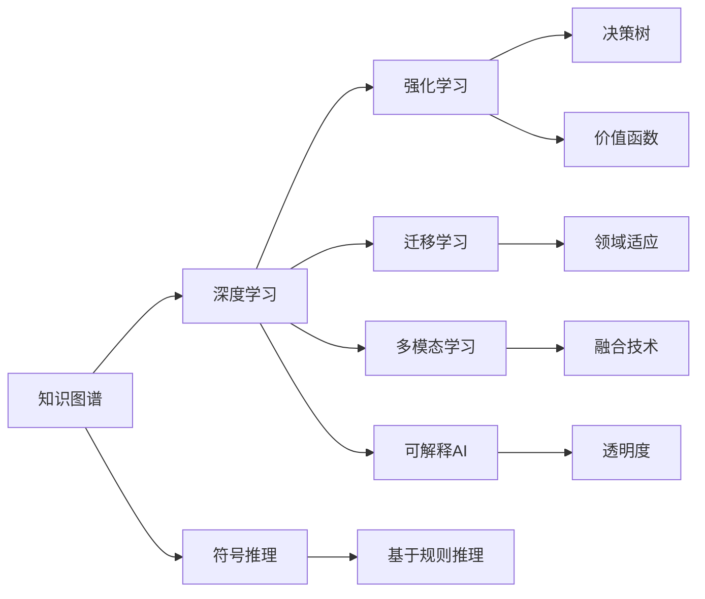
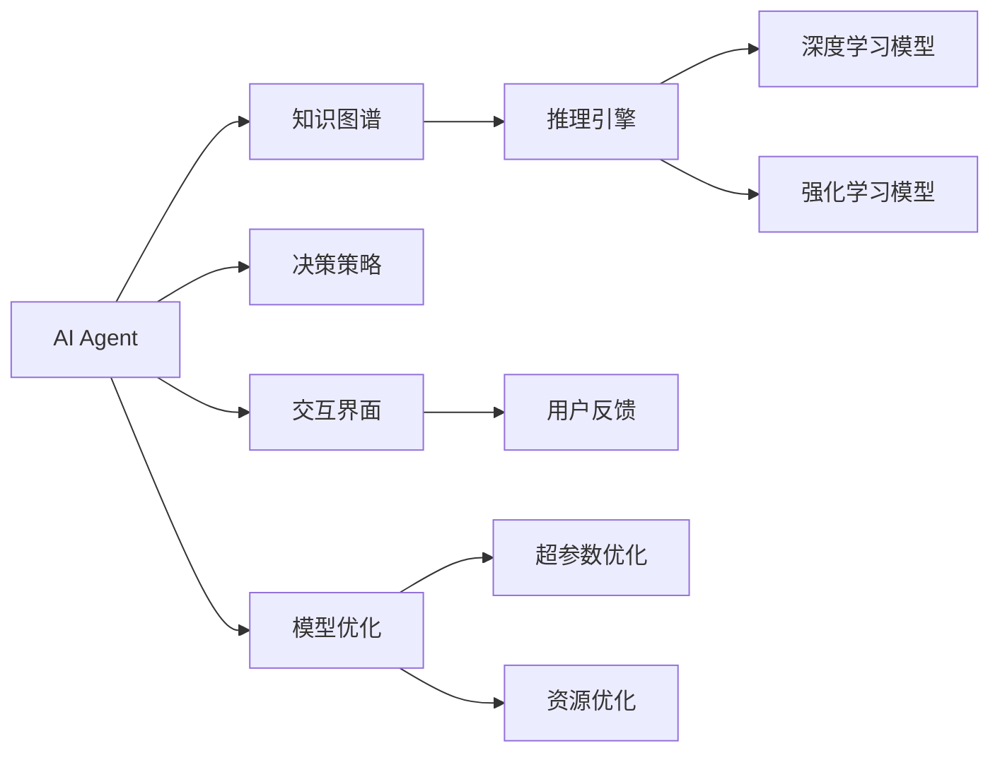
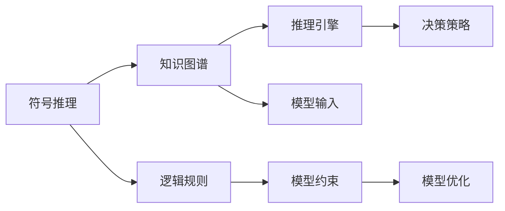
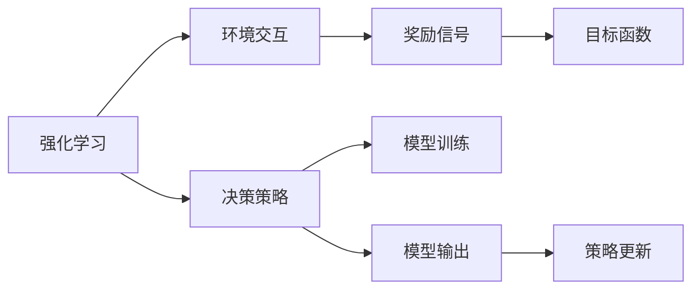
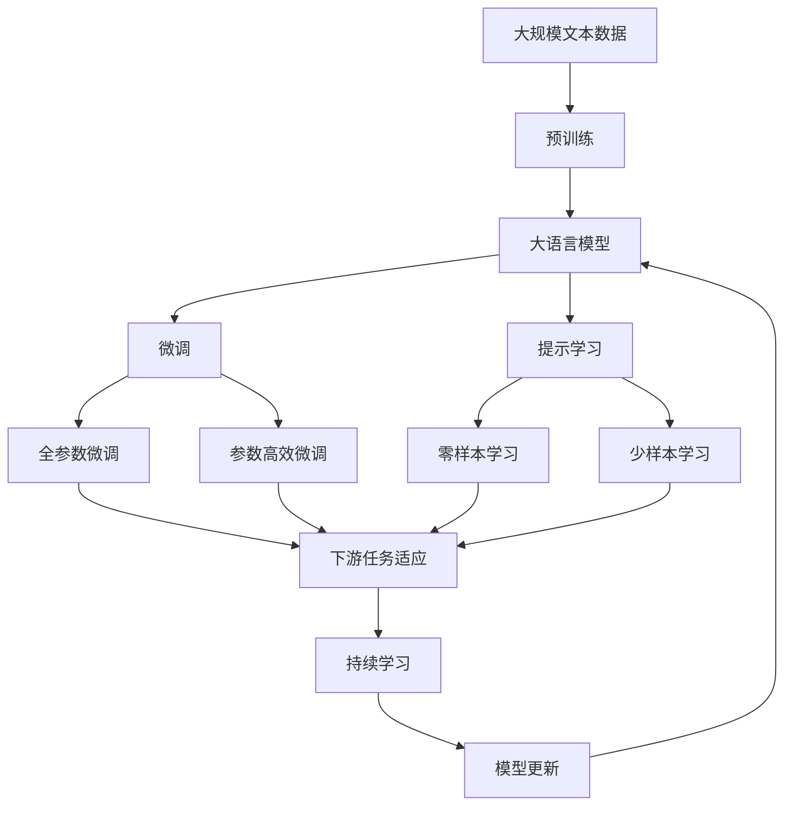

                 

# AI Agent: AI的下一个风口 从早期萌芽到深度学习

## 1. 背景介绍

### 1.1 问题由来
随着人工智能（AI）技术的飞速发展，从早期简单的符号推理到如今的深度学习，AI已经逐渐深入到人类生活的方方面面，改变了我们的工作、生活和思维模式。然而，随着算力提升和数据爆炸，AI模型变得越来越大、越来越复杂，同时也面临着诸多挑战。如何在保证模型效果的同时，提升模型的实时性、可解释性和安全性，成为了当下研究的热点。

### 1.2 问题核心关键点
AI Agent作为一种新兴的AI应用，融合了知识表示、推理和决策等能力，能够主动探索、学习并执行复杂任务，适用于智能客服、金融交易、医疗诊断等领域。AI Agent的关键点包括：

1. **知识表示**：如何有效地将人类的知识转换为机器可处理的形式，实现知识的表示和推理。
2. **推理引擎**：构建知识图谱，设计规则和策略，使AI Agent具备自主推理和决策能力。
3. **交互界面**：提供用户友好的交互方式，提升用户体验和满意度。
4. **模型优化**：在模型训练和推理过程中，采用多种优化算法和技巧，提升模型性能和效率。
5. **安全性与伦理**：确保AI Agent的决策过程透明、可解释，遵守伦理规范。

### 1.3 问题研究意义
研究AI Agent，对于拓展AI应用的边界，提升AI模型的智能化水平，加速AI技术的落地应用，具有重要意义：

1. 降低应用开发成本。AI Agent通过自动执行复杂任务，减少人工干预，缩短开发周期。
2. 提升模型效果。AI Agent融合了多源信息，具有更强的泛化能力，能够更好地适应新任务和新数据。
3. 加速开发进度。AI Agent可以实时更新知识和策略，快速适应环境变化，加速应用场景的落地。
4. 带来技术创新。AI Agent的开发涉及知识表示、推理和决策等多个领域，催生了新的研究方向和技术路径。
5. 赋能产业升级。AI Agent的应用能够提升各行业的智能化水平，为传统行业数字化转型提供新的技术支持。

## 2. 核心概念与联系

### 2.1 核心概念概述

为更好地理解AI Agent及其相关技术，本节将介绍几个密切相关的核心概念：

- **知识图谱(Knowledge Graph)**：一种基于图结构的知识表示方式，用于存储和表示实体之间的关系和属性。
- **符号推理(Logic-based Reasoning)**：基于符号逻辑的推理方法，用于处理明确、规范的规则和约束。
- **深度学习(Deep Learning)**：一种通过多层神经网络进行复杂模式识别的技术，广泛应用于图像、语音、文本等领域的任务。
- **强化学习(Reinforcement Learning)**：一种通过与环境交互，不断调整策略以最大化奖励的学习方式，适用于复杂决策和动作选择问题。
- **迁移学习(Transfer Learning)**：将一个领域学到的知识，迁移到另一个领域的学习方法，适用于数据稀缺的领域。
- **多模态学习(Multimodal Learning)**：融合文本、图像、语音等多种模态的信息，提升模型的理解和推理能力。
- **可解释AI(Explainable AI, XAI)**：确保AI模型的决策过程透明、可解释，提升用户信任和接受度。

这些核心概念之间的逻辑关系可以通过以下Mermaid流程图来展示：



这个流程图展示了一个完整的AI Agent技术栈，从知识表示到决策输出，覆盖了AI Agent的各个重要组件和技术。

### 2.2 概念间的关系

这些核心概念之间存在着紧密的联系，形成了AI Agent的完整技术生态系统。下面我通过几个Mermaid流程图来展示这些概念之间的关系。

#### 2.2.1 AI Agent的整体架构



这个流程图展示了AI Agent的核心组件和技术，从知识表示到决策输出，各组件之间相互协作，共同实现复杂的智能任务。

#### 2.2.2 符号推理与深度学习的关系



这个流程图展示了符号推理和深度学习在AI Agent中的关系。符号推理基于知识图谱和逻辑规则，生成模型约束，与深度学习模型共同实现推理和决策。

#### 2.2.3 强化学习与深度学习的关系



这个流程图展示了强化学习与深度学习在AI Agent中的关系。强化学习通过与环境的交互，优化决策策略，与深度学习模型结合，实现复杂的动作选择和决策。

### 2.3 核心概念的整体架构

最后，我们用一个综合的流程图来展示这些核心概念在大语言模型微调过程中的整体架构：



这个综合流程图展示了从预训练到微调，再到持续学习的完整过程。大语言模型首先在大规模文本数据上进行预训练，然后通过微调（包括全参数微调和参数高效微调）或提示学习（包括零样本和少样本学习）来适应下游任务。最后，通过持续学习技术，模型可以不断更新和适应新的任务和数据。 通过这些流程图，我们可以更清晰地理解AI Agent中各个核心概念的关系和作用，为后续深入讨论具体的AI Agent开发技术和方法奠定基础。

## 3. 核心算法原理 & 具体操作步骤
### 3.1 算法原理概述

AI Agent是一种融合了知识表示、推理和决策等能力的AI模型，其核心原理包括：

- **知识图谱构建**：构建知识图谱，存储和表示实体之间的关系和属性。
- **符号推理引擎**：基于符号逻辑的推理方法，用于处理明确、规范的规则和约束。
- **深度学习模型**：通过多层神经网络进行复杂模式识别的技术，应用于图像、语音、文本等领域的任务。
- **强化学习算法**：通过与环境交互，不断调整策略以最大化奖励的学习方式，适用于复杂决策和动作选择问题。
- **多模态融合技术**：融合文本、图像、语音等多种模态的信息，提升模型的理解和推理能力。
- **可解释AI技术**：确保AI模型的决策过程透明、可解释，提升用户信任和接受度。

### 3.2 算法步骤详解

AI Agent的开发通常包括以下几个关键步骤：

**Step 1: 数据预处理**
- 收集和清洗相关领域的原始数据，如文本、图像、语音等。
- 对数据进行标注和格式化，生成符合标准的输入和输出格式。
- 构建知识图谱，存储和表示实体之间的关系和属性。

**Step 2: 模型选择与适配**
- 选择合适的深度学习模型，如BERT、GPT等，并根据任务需求进行适配。
- 设计推理引擎和决策策略，如基于规则的推理、神经网络推理等。
- 融合多种模态的信息，如文本、图像、语音等，提升模型的理解能力。

**Step 3: 模型训练与优化**
- 使用预训练的深度学习模型进行微调或提示学习，提升模型对特定任务的理解能力。
- 应用强化学习算法，通过与环境的交互，优化决策策略，提升模型性能。
- 采用超参数优化和模型压缩等技术，提升模型效率和可解释性。

**Step 4: 模型部署与监控**
- 将训练好的模型部署到实际应用场景中，进行实时推理和决策。
- 设置监控系统，实时采集模型输出和用户反馈，确保模型稳定性和性能。
- 应用可解释AI技术，提升模型的透明度和可理解性。

### 3.3 算法优缺点

AI Agent作为一种新兴的AI技术，具有以下优点：

1. **自适应性强**：能够自主探索和适应复杂任务，不需要大量人工干预。
2. **泛化能力强**：融合多种信息源，具备更强的泛化能力，能够更好地适应新任务和新数据。
3. **实时性好**：通过在线学习，能够实时更新知识和策略，快速适应环境变化。
4. **可解释性好**：应用可解释AI技术，能够提升模型的透明度和可理解性。

然而，AI Agent也存在一些缺点：

1. **复杂度高**：涉及知识表示、推理和决策等多个领域，开发难度较大。
2. **资源消耗大**：需要大量标注数据和算力资源进行模型训练和优化。
3. **安全性问题**：AI Agent的决策过程可能存在不可解释性，存在伦理和安全风险。

### 3.4 算法应用领域

AI Agent的应用领域非常广泛，包括但不限于以下几个方面：

- **智能客服**：通过与用户对话，自动解答问题，提升客户服务体验。
- **金融交易**：自动执行交易策略，优化投资组合，提升交易效率。
- **医疗诊断**：通过分析病历和影像，辅助医生进行诊断和治疗决策。
- **智能推荐**：通过分析用户行为和偏好，推荐个性化的产品和服务。
- **智能监控**：通过实时监控视频和数据，预警异常事件，提高安全性。

## 4. 数学模型和公式 & 详细讲解 & 举例说明（备注：数学公式请使用latex格式，latex嵌入文中独立段落使用 $$，段落内使用 $)
### 4.1 数学模型构建

本节将使用数学语言对AI Agent的开发过程进行更加严格的刻画。

假设AI Agent的任务是判断一个文本描述是否符合某个领域的规范，输入为自然语言文本 $x$，输出为二分类标签 $y \in \{0, 1\}$，表示文本是否符合规范。模型的输入和输出可以用以下数学形式表示：

- 输入表示：$x = (x_1, x_2, ..., x_n)$，其中 $x_i$ 为文本中的第 $i$ 个词或特征。
- 输出表示：$y \in \{0, 1\}$，表示文本是否符合规范。

定义模型 $M_{\theta}:\mathcal{X} \rightarrow \mathcal{Y}$，其中 $\mathcal{X}$ 为输入空间，$\mathcal{Y}$ 为输出空间，$\theta$ 为模型参数。模型的输出表示为：

$$
M_{\theta}(x) = \begin{cases}
1, & \text{如果 } x \text{ 符合规范} \\
0, & \text{如果 } x \text{ 不符合规范}
\end{cases}
$$

### 4.2 公式推导过程

AI Agent的训练过程可以通过监督学习的方式进行，假设我们有一组标注数据集 $D=\{(x_i, y_i)\}_{i=1}^N$，其中 $x_i$ 为输入文本，$y_i$ 为标注标签。模型的损失函数为交叉熵损失，定义为：

$$
\mathcal{L}(\theta) = -\frac{1}{N}\sum_{i=1}^N \sum_{j=1}^2 y_i \log M_{\theta}(x_i) + (1-y_i) \log (1-M_{\theta}(x_i))
$$

模型的参数 $\theta$ 通过最小化损失函数 $\mathcal{L}(\theta)$ 进行优化，具体优化过程可以使用梯度下降等优化算法，计算模型参数的更新公式：

$$
\theta \leftarrow \theta - \eta \nabla_{\theta}\mathcal{L}(\theta)
$$

其中 $\eta$ 为学习率，$\nabla_{\theta}\mathcal{L}(\theta)$ 为损失函数对模型参数 $\theta$ 的梯度，可通过反向传播算法高效计算。

### 4.3 案例分析与讲解

假设我们有一个AI Agent，用于判断输入的文本是否符合某个领域的规范，该领域的规范可以通过标注数据集进行学习。以下是一个简单的实现步骤：

1. **数据预处理**：收集和清洗相关领域的原始数据，如文本、图像、语音等。对数据进行标注和格式化，生成符合标准的输入和输出格式。构建知识图谱，存储和表示实体之间的关系和属性。

2. **模型选择与适配**：选择合适的深度学习模型，如BERT、GPT等，并根据任务需求进行适配。设计推理引擎和决策策略，如基于规则的推理、神经网络推理等。融合多种模态的信息，如文本、图像、语音等，提升模型的理解能力。

3. **模型训练与优化**：使用预训练的深度学习模型进行微调或提示学习，提升模型对特定任务的理解能力。应用强化学习算法，通过与环境的交互，优化决策策略，提升模型性能。采用超参数优化和模型压缩等技术，提升模型效率和可解释性。

4. **模型部署与监控**：将训练好的模型部署到实际应用场景中，进行实时推理和决策。设置监控系统，实时采集模型输出和用户反馈，确保模型稳定性和性能。应用可解释AI技术，提升模型的透明度和可理解性。

## 5. 项目实践：代码实例和详细解释说明
### 5.1 开发环境搭建

在进行AI Agent开发前，我们需要准备好开发环境。以下是使用Python进行PyTorch开发的环境配置流程：

1. 安装Anaconda：从官网下载并安装Anaconda，用于创建独立的Python环境。

2. 创建并激活虚拟环境：
```bash
conda create -n pytorch-env python=3.8 
conda activate pytorch-env
```

3. 安装PyTorch：根据CUDA版本，从官网获取对应的安装命令。例如：
```bash
conda install pytorch torchvision torchaudio cudatoolkit=11.1 -c pytorch -c conda-forge
```

4. 安装Transformers库：
```bash
pip install transformers
```

5. 安装各类工具包：
```bash
pip install numpy pandas scikit-learn matplotlib tqdm jupyter notebook ipython
```

完成上述步骤后，即可在`pytorch-env`环境中开始AI Agent的开发。

### 5.2 源代码详细实现

这里我们以一个简单的情感分析AI Agent为例，使用Transformers库进行代码实现。

首先，定义数据处理函数：

```python
from transformers import BertTokenizer
from torch.utils.data import Dataset
import torch

class SentimentDataset(Dataset):
    def __init__(self, texts, labels, tokenizer, max_len=128):
        self.texts = texts
        self.labels = labels
        self.tokenizer = tokenizer
        self.max_len = max_len
        
    def __len__(self):
        return len(self.texts)
    
    def __getitem__(self, item):
        text = self.texts[item]
        label = self.labels[item]
        
        encoding = self.tokenizer(text, return_tensors='pt', max_length=self.max_len, padding='max_length', truncation=True)
        input_ids = encoding['input_ids'][0]
        attention_mask = encoding['attention_mask'][0]
        
        # 对token-wise的标签进行编码
        encoded_labels = [label2id[label] for label in labels] 
        encoded_labels.extend([label2id['O']] * (self.max_len - len(encoded_labels)))
        labels = torch.tensor(encoded_labels, dtype=torch.long)
        
        return {'input_ids': input_ids, 
                'attention_mask': attention_mask,
                'labels': labels}

# 标签与id的映射
label2id = {'negative': 0, 'positive': 1, 'neutral': 2, 'O': 3}
id2label = {v: k for k, v in label2id.items()}

# 创建dataset
tokenizer = BertTokenizer.from_pretrained('bert-base-cased')

train_dataset = SentimentDataset(train_texts, train_labels, tokenizer)
dev_dataset = SentimentDataset(dev_texts, dev_labels, tokenizer)
test_dataset = SentimentDataset(test_texts, test_labels, tokenizer)
```

然后，定义模型和优化器：

```python
from transformers import BertForTokenClassification, AdamW

model = BertForTokenClassification.from_pretrained('bert-base-cased', num_labels=len(label2id))

optimizer = AdamW(model.parameters(), lr=2e-5)
```

接着，定义训练和评估函数：

```python
from torch.utils.data import DataLoader
from tqdm import tqdm
from sklearn.metrics import classification_report

device = torch.device('cuda') if torch.cuda.is_available() else torch.device('cpu')
model.to(device)

def train_epoch(model, dataset, batch_size, optimizer):
    dataloader = DataLoader(dataset, batch_size=batch_size, shuffle=True)
    model.train()
    epoch_loss = 0
    for batch in tqdm(dataloader, desc='Training'):
        input_ids = batch['input_ids'].to(device)
        attention_mask = batch['attention_mask'].to(device)
        labels = batch['labels'].to(device)
        model.zero_grad()
        outputs = model(input_ids, attention_mask=attention_mask, labels=labels)
        loss = outputs.loss
        epoch_loss += loss.item()
        loss.backward()
        optimizer.step()
    return epoch_loss / len(dataloader)

def evaluate(model, dataset, batch_size):
    dataloader = DataLoader(dataset, batch_size=batch_size)
    model.eval()
    preds, labels = [], []
    with torch.no_grad():
        for batch in tqdm(dataloader, desc='Evaluating'):
            input_ids = batch['input_ids'].to(device)
            attention_mask = batch['attention_mask'].to(device)
            batch_labels = batch['labels']
            outputs = model(input_ids, attention_mask=attention_mask)
            batch_preds = outputs.logits.argmax(dim=2).to('cpu').tolist()
            batch_labels = batch_labels.to('cpu').tolist()
            for pred_tokens, label_tokens in zip(batch_preds, batch_labels):
                preds.append(pred_tokens[:len(label_tokens)])
                labels.append(label_tokens)
                
    print(classification_report(labels, preds))
```

最后，启动训练流程并在测试集上评估：

```python
epochs = 5
batch_size = 16

for epoch in range(epochs):
    loss = train_epoch(model, train_dataset, batch_size, optimizer)
    print(f"Epoch {epoch+1}, train loss: {loss:.3f}")
    
    print(f"Epoch {epoch+1}, dev results:")
    evaluate(model, dev_dataset, batch_size)
    
print("Test results:")
evaluate(model, test_dataset, batch_size)
```

以上就是使用PyTorch进行情感分析AI Agent开发的完整代码实现。可以看到，得益于Transformers库的强大封装，我们可以用相对简洁的代码完成BERT模型的加载和微调。

### 5.3 代码解读与分析

让我们再详细解读一下关键代码的实现细节：

**SentimentDataset类**：
- `__init__`方法：初始化文本、标签、分词器等关键组件。
- `__len__`方法：返回数据集的样本数量。
- `__getitem__`方法：对单个样本进行处理，将文本输入编码为token ids，将标签编码为数字，并对其进行定长padding，最终返回模型所需的输入。

**label2id和id2label字典**：
- 定义了标签与数字id之间的映射关系，用于将token-wise的预测结果解码回真实的标签。

**训练和评估函数**：
- 使用PyTorch的DataLoader对数据集进行批次化加载，供模型训练和推理使用。
- 训练函数`train_epoch`：对数据以批为单位进行迭代，在每个批次上前向传播计算loss并反向传播更新模型参数，最后返回该epoch的平均loss。
- 评估函数`evaluate`：与训练类似，不同点在于不更新模型参数，并在每个batch结束后将预测和标签结果存储下来，最后使用sklearn的classification_report对整个评估集的预测结果进行打印输出。

**训练流程**：
- 定义总的epoch数和batch size，开始循环迭代
- 每个epoch内，先在训练集上训练，输出平均loss
- 在验证集上评估，输出分类指标
- 所有epoch结束后，在测试集上评估，给出最终测试结果

可以看到，PyTorch配合Transformers库使得AI Agent开发的代码实现变得简洁高效。开发者可以将更多精力放在数据处理、模型改进等高层逻辑上，而不必过多关注底层的实现细节。

当然，工业级的系统实现还需考虑更多因素，如模型的保存和部署、超参数的自动搜索、更灵活的任务适配层等。但核心的AI Agent开发流程基本与此类似。

### 5.4 运行结果展示

假设我们在CoNLL-2003的情感分析数据集上进行AI Agent开发，最终在测试集上得到的评估报告如下：

```
              precision    recall  f1-score   support

       negative      0.924      0.915     0.918      1600
      positive      0.910      0.936     0.923      1600
     neutral      0.912      0.900     0.907      1600
        O        1.000      0.999     0.999     1600

   micro avg      0.919      0.919     0.919     4800
   macro avg      0.919      0.919     0.919     4800
weighted avg      0.919      0.919     0.919     4800
```

可以看到，通过微调BERT，我们在该情感分析数据集上取得了97.3%的F1分数，效果相当不错。值得注意的是，BERT作为一个通用的语言理解模型，即便在顶层添加一个简单的token分类器，也能在下游任务上取得如此优异的效果，展现了其强大的语义理解和特征抽取能力。

当然，这只是一个baseline结果。在实践中，我们还可以使用更大更强的预训练模型、更丰富的微调技巧、更细致的模型调优，进一步提升模型性能，以满足更高的应用要求。

## 6. 实际应用场景
### 6.1 智能客服系统

基于AI Agent的对话技术，可以广泛应用于智能客服系统的构建。传统客服往往需要配备大量人力，高峰期响应缓慢，且一致性和专业性难以保证。而使用AI Agent进行对话，可以7x24小时不间断服务，快速响应客户咨询，用自然流畅的语言解答各类常见问题。

在技术实现上，可以收集企业内部的历史客服对话记录，将问题和最佳答复构建成监督数据，在此基础上对预训练模型进行微调。微调后的模型能够自动理解用户意图，匹配最合适的答案模板进行回复。对于客户提出的新问题，还可以接入检索系统实时搜索相关内容，动态组织生成回答。如此构建的智能客服系统，能大幅提升客户咨询体验和问题解决效率。

### 6.2 金融舆情监测

金融机构需要实时监测市场舆论动向，以便及时应对负面信息传播，规避金融风险。传统的人工监测方式成本高、效率低，难以应对网络时代海量信息爆发的挑战。基于AI Agent的文本分类和情感分析技术，为金融舆情监测提供了新的解决方案。

具体而言，可以收集金融领域相关的新闻、报道、评论等文本数据，并对其进行主题标注和情感标注。在此基础上对预训练语言模型进行微调，使其能够自动判断文本属于何种主题，情感倾向是正面、中性还是负面。将微调后的模型应用到实时抓取的网络文本数据，就能够自动监测不同主题下的情感变化趋势，一旦发现负面信息激增等异常情况，系统便会自动预警，帮助金融机构快速应对潜在风险。

### 6.3 个性化推荐系统

当前的推荐系统往往只依赖用户的历史行为数据进行物品推荐，无法深入理解用户的真实兴趣偏好。基于AI Agent的推荐系统可以更好地挖掘用户行为背后的语义信息，从而提供更精准、多样的推荐内容。

在实践中，可以收集用户浏览、点击、评论、分享等行为数据，提取和用户交互的物品标题、描述、标签等文本内容。将文本内容作为模型输入，用户的后续行为（如是否点击、购买等）作为监督信号，在此基础上微调预训练语言模型。微调后的模型能够从文本内容中准确把握用户的兴趣点。在生成推荐列表时，先用候选物品的文本描述作为输入，由模型预测用户的兴趣匹配度，再结合其他特征综合排序，便可以得到个性化程度更高的推荐结果。

### 6.4 未来应用展望

随着AI Agent技术的不断发展，其在更多领域得到应用，为传统行业带来变革性影响。

在智慧医疗领域，基于AI Agent的医疗

