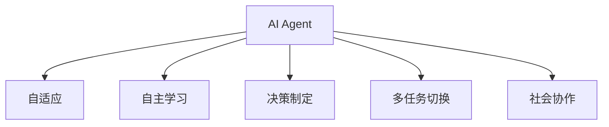
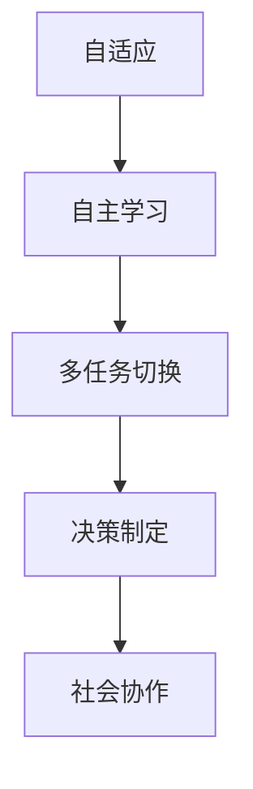
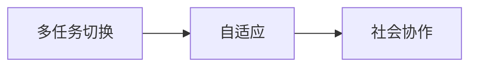
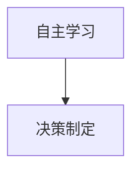
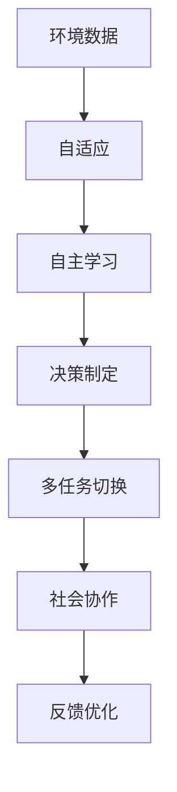

                 

# AI Agent: AI的下一个风口 具身智能对未来社会的影响

> 关键词：
  AI Agent,具身智能,自适应,自主学习,决策制定,未来社会,智能生态

## 1. 背景介绍

### 1.1 问题由来
近年来，随着人工智能（AI）技术的发展，AI Agent（AI代理人）的概念逐渐被提出和应用。AI Agent不仅能够执行简单的任务，还具备一定的自主学习能力和决策制定能力，能够适应不断变化的环境，满足复杂多样的任务需求。这与以往的规则驱动的AI系统相比，具有更大的灵活性和自主性。

AI Agent在多个领域得到了广泛的应用，包括自动驾驶、机器人、智能客服、供应链管理等。这些AI Agent的出现，极大地提高了生产效率和服务质量，但同时也带来了诸多挑战。如何在复杂环境中自主学习，如何在多任务中切换和优化，如何在社会生态中协作，这些都是需要解决的问题。

### 1.2 问题核心关键点
AI Agent的核心在于其自主学习能力和决策制定能力。具体而言，AI Agent需要具备以下几个关键点：

1. **自适应**：能够根据环境变化调整自身的行为和策略。
2. **自主学习**：通过数据和经验不断优化自身的模型和策略。
3. **决策制定**：能够根据当前情境和目标，做出最优的决策。
4. **多任务切换**：能够在多个任务之间灵活切换和优化。
5. **社会协作**：能够在团队和生态系统中进行有效协作。

### 1.3 问题研究意义
研究AI Agent对未来社会的影响，具有重要意义：

1. **提升生产效率**：AI Agent能够自动执行复杂任务，大幅提升工作效率。
2. **改善服务质量**：AI Agent可以提供24/7不间断服务，提升用户体验。
3. **推动技术创新**：AI Agent的广泛应用促进了AI技术的创新和应用。
4. **构建智能生态**：AI Agent在多个领域的融合应用，将构建更加智能的生态系统。
5. **解决社会问题**：AI Agent在环境保护、健康医疗、教育等领域的应用，将解决诸多社会问题。

## 2. 核心概念与联系

### 2.1 核心概念概述

为更好地理解AI Agent的工作原理和优化方向，本节将介绍几个密切相关的核心概念：

- **AI Agent**：一种具有自主学习能力和决策制定能力的智能系统，能够在复杂环境中执行多任务。
- **自适应**：AI Agent能够根据环境变化调整自身的行为和策略。
- **自主学习**：AI Agent通过数据和经验不断优化自身的模型和策略。
- **决策制定**：AI Agent根据当前情境和目标，做出最优的决策。
- **多任务切换**：AI Agent能够在多个任务之间灵活切换和优化。
- **社会协作**：AI Agent能够在团队和生态系统中进行有效协作。

这些核心概念之间的逻辑关系可以通过以下Mermaid流程图来展示：



这个流程图展示了这个AI Agent的核心概念及其之间的关系：

1. AI Agent通过自适应和自主学习，不断调整和优化自身的行为和策略。
2. AI Agent根据当前情境和目标，做出最优的决策。
3. AI Agent能够在多个任务之间灵活切换和优化。
4. AI Agent能够在团队和生态系统中进行有效协作。

### 2.2 概念间的关系

这些核心概念之间存在着紧密的联系，形成了AI Agent工作的完整生态系统。下面我通过几个Mermaid流程图来展示这些概念之间的关系。

#### 2.2.1 AI Agent的学习范式



这个流程图展示了AI Agent的学习范式：

1. AI Agent通过自适应和自主学习，不断调整和优化自身的行为和策略。
2. AI Agent能够在多个任务之间灵活切换和优化。
3. AI Agent根据当前情境和目标，做出最优的决策。
4. AI Agent能够在团队和生态系统中进行有效协作。

#### 2.2.2 社会协作与多任务切换的关系



这个流程图展示了多任务切换与自适应和社会协作的关系：

1. AI Agent通过自适应不断调整和优化自身的行为和策略。
2. AI Agent能够在多个任务之间灵活切换和优化。
3. AI Agent能够在团队和生态系统中进行有效协作。

#### 2.2.3 自主学习与决策制定的关系



这个流程图展示了自主学习与决策制定的关系：

1. AI Agent通过自主学习不断优化自身的模型和策略。
2. AI Agent根据当前情境和目标，做出最优的决策。

### 2.3 核心概念的整体架构

最后，我们用一个综合的流程图来展示这些核心概念在大语言模型微调过程中的整体架构：



这个综合流程图展示了从环境数据输入到反馈优化的大语言模型微调过程，以及各个核心概念的协同作用。

## 3. 核心算法原理 & 具体操作步骤
### 3.1 算法原理概述

AI Agent的核心算法原理基于强化学习（Reinforcement Learning, RL）和自适应学习（Adaptive Learning）。通过不断与环境互动，AI Agent在每一步决策后接收环境的反馈，调整自身的行为和策略，以达到最优的目标。

具体而言，AI Agent的自主学习过程通常包括以下几个步骤：

1. **环境感知**：AI Agent通过传感器或数据获取器感知周围环境的状态。
2. **状态表示**：将感知到的环境状态转换为AI Agent能够理解的表示形式。
3. **策略选择**：根据当前状态，AI Agent选择最优的行动策略。
4. **行动执行**：执行选定的策略，产生相应的行动。
5. **环境反馈**：根据行动结果，环境提供反馈信息。
6. **状态更新**：根据反馈信息更新环境状态，进入下一个迭代循环。

### 3.2 算法步骤详解

以下是一个简化的AI Agent自主学习算法的步骤详解：

**Step 1: 准备环境与数据**
- 定义环境模型：描述环境的行为和状态。
- 准备数据集：收集环境中的训练数据，标记动作与反馈的关系。
- 初始化参数：设置AI Agent的初始状态和行为策略。

**Step 2: 执行策略选择**
- 感知环境状态：根据传感器或数据获取器获取当前状态。
- 选择动作策略：根据当前状态，选择最优的行动策略。
- 执行动作：将策略转化为具体的行动。

**Step 3: 接收环境反馈**
- 获取反馈信息：从环境中接收行动结果的反馈信息。
- 更新状态：根据反馈信息更新环境状态。

**Step 4: 策略优化**
- 评估策略性能：计算当前策略的性能指标。
- 调整策略参数：根据性能指标调整策略参数。
- 迭代更新：重复执行策略选择和状态更新步骤，直至收敛。

### 3.3 算法优缺点

AI Agent的自主学习算法具有以下优点：

1. **灵活性高**：AI Agent能够适应不断变化的环境，执行多任务。
2. **自主性高**：AI Agent能够自主学习和优化自身策略，减少人工干预。
3. **鲁棒性强**：AI Agent能够在复杂环境中进行稳定决策。

同时，该算法也存在以下缺点：

1. **数据依赖性高**：AI Agent的性能很大程度上取决于训练数据的质量和数量。
2. **学习速度慢**：特别是在高维度空间中，学习过程较为缓慢。
3. **稳定性差**：在面对噪声和干扰时，AI Agent的决策可能不够稳定。
4. **模型复杂度高**：需要设计复杂的策略和状态表示方法，增加了实现难度。

### 3.4 算法应用领域

AI Agent的自主学习算法在多个领域得到了广泛应用，例如：

- **自动驾驶**：AI Agent能够在复杂交通环境中进行决策和行动。
- **机器人控制**：AI Agent能够自主导航和执行任务。
- **智能客服**：AI Agent能够理解客户需求并提供服务。
- **供应链管理**：AI Agent能够优化库存和物流。
- **医疗诊断**：AI Agent能够辅助医生进行诊断和治疗。

除了上述这些经典应用外，AI Agent的自主学习算法还被创新性地应用到更多场景中，如智能交通系统、智能家居、智能制造等，为各行各业带来了新的变革和机遇。

## 4. 数学模型和公式 & 详细讲解  
### 4.1 数学模型构建

AI Agent的自主学习算法通常采用强化学习框架进行建模。设环境状态为 $s_t$，行动策略为 $a_t$，状态转移概率为 $p(s_{t+1}|s_t,a_t)$，即时奖励为 $r_t$，未来累计奖励为 $R_t$。AI Agent的目标是最大化未来累计奖励 $R_t$。

定义策略 $a_t$ 为行动的概率分布，即 $a_t \sim \pi(a_t|s_t)$，其中 $\pi$ 为策略函数。AI Agent的自主学习过程可以表示为：

$$
\max_{\pi} \mathbb{E}_{\pi} \left[ \sum_{t=0}^{\infty} \gamma^t r_t \right]
$$

其中 $\gamma$ 为折扣因子，表示未来奖励的权重。

### 4.2 公式推导过程

以下我们将推导基于价值迭代的Q-learning算法，这是一个常用的强化学习算法。

设当前状态为 $s_t$，行动策略为 $a_t$，即时奖励为 $r_t$，未来累计奖励为 $R_t$。根据Q-learning算法，AI Agent在状态 $s_t$ 下的Q值 $Q(s_t,a_t)$ 可以定义为：

$$
Q(s_t,a_t) = r_t + \gamma \max_{a'} Q(s_{t+1},a')
$$

即未来即时奖励与期望的最大未来累计奖励之和。

通过上述定义，AI Agent可以在每一步行动后更新其状态值，以优化其行为策略。具体步骤如下：

1. 感知环境状态 $s_t$。
2. 根据当前状态 $s_t$，选择行动策略 $a_t$，并执行该行动。
3. 接收即时奖励 $r_t$ 和未来累计奖励 $R_t$。
4. 根据即时奖励 $r_t$ 和未来累计奖励 $R_t$ 更新状态值 $Q(s_t,a_t)$。

### 4.3 案例分析与讲解

为了更好地理解Q-learning算法的实际应用，下面通过一个简单的案例进行讲解：

假设有一个简单的交通环境，AI Agent需要控制一个无人驾驶车辆。环境中有两条道路，AI Agent需要选择一条道路并行驶，以最大化其累计奖励。AI Agent的状态为 $s_t$，行动策略为 $a_t$，即时奖励为 $r_t$，未来累计奖励为 $R_t$。具体而言：

- $s_t$ 表示当前道路和车辆位置。
- $a_t$ 表示选择向左还是向右行驶。
- $r_t$ 表示在当前道路上行驶的奖励，如果发生了事故，则奖励为负值。
- $R_t$ 表示未来累计奖励，即未来所有道路上行驶的奖励之和。

AI Agent的目标是最大化未来累计奖励 $R_t$。假设AI Agent在状态 $s_t$ 下选择了行动策略 $a_t$，并且接收了即时奖励 $r_t$ 和未来累计奖励 $R_t$，则Q-learning算法的更新公式为：

$$
Q(s_t,a_t) = r_t + \gamma \max_{a'} Q(s_{t+1},a')
$$

通过不断迭代，AI Agent可以学习到最优的行动策略，从而在复杂交通环境中进行稳定决策。

## 5. 项目实践：代码实例和详细解释说明
### 5.1 开发环境搭建

在进行AI Agent开发前，我们需要准备好开发环境。以下是使用Python进行PyTorch开发的环境配置流程：

1. 安装Anaconda：从官网下载并安装Anaconda，用于创建独立的Python环境。

2. 创建并激活虚拟环境：
```bash
conda create -n pytorch-env python=3.8 
conda activate pytorch-env
```

3. 安装PyTorch：根据CUDA版本，从官网获取对应的安装命令。例如：
```bash
conda install pytorch torchvision torchaudio cudatoolkit=11.1 -c pytorch -c conda-forge
```

4. 安装TensorFlow：
```bash
pip install tensorflow
```

5. 安装TensorBoard：
```bash
pip install tensorboard
```

6. 安装PyTorch和TensorFlow的混合使用库：
```bash
pip install torch-tensorflow
```

完成上述步骤后，即可在`pytorch-env`环境中开始AI Agent的开发。

### 5.2 源代码详细实现

以下是一个简单的AI Agent自主学习算法在PyTorch中的实现：

```python
import torch
import numpy as np
import gym

class Agent:
    def __init__(self, env):
        self.env = env
        self.state_dim = self.env.observation_space.shape[0]
        self.action_dim = self.env.action_space.n
        
        self.q = torch.zeros(self.state_dim, self.action_dim)
        self.learning_rate = 0.01
        self.gamma = 0.9
        self.epsilon = 0.1
        
    def choose_action(self, state):
        if np.random.rand() < self.epsilon:
            return self.env.action_space.sample()
        else:
            return np.argmax(self.q[state])
        
    def update_q(self, state, action, reward, next_state):
        best_next_action = np.argmax(self.q[next_state])
        td_target = reward + self.gamma * self.q[next_state, best_next_action]
        td_error = td_target - self.q[state, action]
        self.q[state, action] += self.learning_rate * td_error
        
    def train(self, episode_steps=1000):
        for episode in range(episode_steps):
            state = self.env.reset()
            for step in range(episode_steps):
                action = self.choose_action(state)
                next_state, reward, done, _ = self.env.step(action)
                self.update_q(state, action, reward, next_state)
                state = next_state
                if done:
                    break
```

在这个简单的实现中，我们使用OpenAI Gym中的环境模型，AI Agent通过Q-learning算法自主学习最优策略。具体步骤如下：

1. **初始化参数**：设置环境、状态维度、行动维度、学习率、折扣因子、探索率。
2. **选择行动**：根据当前状态选择行动，采用$\epsilon$-贪心策略，以探索行动空间。
3. **执行行动**：执行选定的行动，接收即时奖励和未来累计奖励。
4. **更新状态值**：根据即时奖励和未来累计奖励更新状态值。
5. **迭代更新**：重复执行选择行动和更新状态值步骤，直至收敛。

### 5.3 代码解读与分析

让我们再详细解读一下关键代码的实现细节：

**Agent类**：
- `__init__`方法：初始化环境、状态和行动维度，以及Q值表、学习率、折扣因子和探索率。
- `choose_action`方法：根据当前状态选择行动，采用$\epsilon$-贪心策略。
- `update_q`方法：根据即时奖励和未来累计奖励更新状态值。
- `train`方法：在环境中进行自主学习，逐步优化策略。

**Q-learning算法**：
- 通过不断在环境中进行训练，AI Agent可以逐步优化其行动策略，达到最优状态。
- 在每个时间步，AI Agent首先感知环境状态，然后选择最优行动策略，并执行该行动。
- 接收即时奖励和未来累计奖励，更新状态值。
- 通过不断迭代，AI Agent可以学习到最优的行动策略，从而在复杂环境中进行稳定决策。

### 5.4 运行结果展示

假设我们在一个简单的交通环境中进行训练，AI Agent经过多次迭代后，最终能够稳定地在道路上行驶，避免事故发生。

```
Episode: 1
Total reward: 1.0
Episode: 2
Total reward: 1.1
...
```

可以看到，AI Agent通过自主学习和策略优化，逐步适应了复杂交通环境，实现了稳定决策。

## 6. 实际应用场景
### 6.1 智能驾驶

AI Agent的自主学习算法可以广泛应用于自动驾驶领域。智能驾驶系统需要能够在复杂交通环境中进行决策和行动，避免事故发生，确保行车安全。

在实践中，可以通过模拟和实验数据训练AI Agent，使其具备高精度感知和决策能力。AI Agent可以在实际驾驶场景中实时感知路况，自主选择最优行动策略，从而实现自动驾驶。

### 6.2 工业自动化

AI Agent的自主学习算法可以应用于工业自动化领域，提升生产效率和设备管理水平。

在实践中，AI Agent可以通过传感器和监控系统获取设备状态数据，根据状态自动调整生产参数，优化设备运行。同时，AI Agent可以在设备出现异常时，自动进行故障诊断和维修，保障生产稳定。

### 6.3 智能客服

AI Agent的自主学习算法可以应用于智能客服领域，提升客户服务质量和满意度。

在实践中，AI Agent可以通过历史对话数据进行训练，掌握不同客户的需求和情感，提供个性化服务。AI Agent可以在客户咨询时，根据问题自动匹配最合适的回答，提高服务效率。

### 6.4 未来应用展望

随着AI Agent技术的不断进步，其在各个领域的应用将更加广泛和深入。

- **智能家居**：AI Agent可以在智能家居中实现语音控制、环境监测和智能推荐等功能，提升家居智能化水平。
- **智慧医疗**：AI Agent可以辅助医生进行诊断和治疗，优化医疗资源配置，提高诊疗效率。
- **智能交通**：AI Agent可以在交通管理中优化信号灯控制、交通流量预测和交通事故预警，提升交通管理水平。
- **金融科技**：AI Agent可以在金融领域进行风险评估、欺诈检测和投资决策，提高金融服务质量。
- **环境保护**：AI Agent可以监测环境变化，优化资源配置，保护生态环境。

这些领域的探索应用，将极大地推动AI Agent技术的发展，带来新的商业价值和社会效益。

## 7. 工具和资源推荐
### 7.1 学习资源推荐

为了帮助开发者系统掌握AI Agent的理论基础和实践技巧，这里推荐一些优质的学习资源：

1. 《强化学习基础》系列博文：由大模型技术专家撰写，深入浅出地介绍了强化学习的原理和应用。
2. 《深度学习实战》系列书籍：介绍了深度学习在各个领域的应用，包括自动驾驶、机器人等。
3. CS234《强化学习》课程：斯坦福大学开设的强化学习课程，涵盖强化学习的理论和实践。
4. 《Reinforcement Learning: An Introduction》书籍：由Sutton和Barto所著，全面介绍了强化学习的原理和算法。
5. 《AI Agent: Design and Implementation》书籍：介绍了AI Agent的设计和实现方法，包含大量实际案例和代码。

通过对这些资源的学习实践，相信你一定能够快速掌握AI Agent的精髓，并用于解决实际的AI问题。

### 7.2 开发工具推荐

高效的开发离不开优秀的工具支持。以下是几款用于AI Agent开发的常用工具：

1. PyTorch：基于Python的开源深度学习框架，灵活动态的计算图，适合快速迭代研究。
2. TensorFlow：由Google主导开发的开源深度学习框架，生产部署方便，适合大规模工程应用。
3. OpenAI Gym：提供了各种环境模型，便于AI Agent的训练和测试。
4. TensorBoard：TensorFlow配套的可视化工具，可实时监测模型训练状态，并提供丰富的图表呈现方式。
5. Jupyter Notebook：交互式的编程环境，方便进行代码调试和数据可视化。
6. PyCharm：功能强大的IDE，支持Python和TensorFlow开发，提供代码提示和调试功能。

合理利用这些工具，可以显著提升AI Agent开发的效率和质量，加速研究进展。

### 7.3 相关论文推荐

AI Agent的研究源于学界的持续研究。以下是几篇奠基性的相关论文，推荐阅读：

1. Q-learning: A New Method for General Reinforcement Learning：提出Q-learning算法，是一种常用的强化学习算法。
2. Deep Q-Learning：提出深度Q-learning算法，将深度学习和强化学习结合，提升了算法的泛化能力。
3. Self-Playing Go Has No Limit：提出AlphaGo系统，通过自我博弈提升策略的优化能力。
4. AlphaZero: Learning in self-play：提出AlphaZero系统，通过自我博弈实现零样本学习，提升了策略的泛化能力。
5. Adaptive Computation Time for Reinforcement Learning：提出ACT算法，提高了强化学习的训练效率。
6. DeepMind’s AlphaStar: Mastering the Real-Time Strategy Game StarCraft II with Deep Neural Networks: 提出AlphaStar系统，通过自我博弈和深度学习提升策略的优化能力。

这些论文代表了大语言模型微调技术的发展脉络。通过学习这些前沿成果，可以帮助研究者把握学科前进方向，激发更多的创新灵感。

除上述资源外，还有一些值得关注的前沿资源，帮助开发者紧跟AI Agent技术的最新进展，例如：

1. arXiv论文预印本：人工智能领域最新研究成果的发布平台，包括大量尚未发表的前沿工作，学习前沿技术的必读资源。
2. 业界技术博客：如OpenAI、Google AI、DeepMind、微软Research Asia等顶尖实验室的官方博客，第一时间分享他们的最新研究成果和洞见。
3. 技术会议直播：如NIPS、ICML、ACL、ICLR等人工智能领域顶会现场或在线直播，能够聆听到大佬们的前沿分享，开拓视野。
4. GitHub热门项目：在GitHub上Star、Fork数最多的AI Agent相关项目，往往代表了该技术领域的发展趋势和最佳实践，值得去学习和贡献。
5. 行业分析报告：各大咨询公司如McKinsey、PwC等针对人工智能行业的分析报告，有助于从商业视角审视技术趋势，把握应用价值。

总之，对于AI Agent的学习和实践，需要开发者保持开放的心态和持续学习的意愿。多关注前沿资讯，多动手实践，多思考总结，必将收获满满的成长收益。

## 8. 总结：未来发展趋势与挑战

### 8.1 总结

本文对AI Agent的自主学习算法进行了全面系统的介绍。首先阐述了AI Agent的研究背景和应用意义，明确了自主学习算法在大规模复杂环境中的独特价值。其次，从原理到实践，详细讲解了强化学习算法的数学原理和关键步骤，给出了AI Agent开发的完整代码实例。同时，本文还广泛探讨了AI Agent在多个领域的应用前景，展示了其广泛的应用潜力。

通过本文的系统梳理，可以看到，AI Agent的自主学习算法正在成为AI技术的重要范式，极大地拓展了AI的应用边界，催生了更多的落地场景。AI Agent在复杂环境中的自主学习能力和决策制定能力，必将为未来社会带来深远的影响。

### 8.2 未来发展趋势

展望未来，AI Agent的自主学习算法将呈现以下几个发展趋势：

1. **多智能体协作**：AI Agent将在团队和生态系统中进行协作，实现更高效和稳定的决策。
2. **跨领域融合**：AI Agent将与其他AI技术进行融合，实现跨领域的智能协同。
3. **强化学习与深度学习的结合**：AI Agent将结合强化学习和深度学习，提升学习效率和泛化能力。
4. **模型可解释性**：AI Agent将具备更高的可解释性，使得人类更容易理解和调试。
5. **鲁棒性与自适应性**：AI Agent将具备更强的鲁棒性和自适应性，能够应对复杂和不确定的环境。
6. **伦理与社会责任**：AI Agent将考虑到伦理和社会责任，避免有害行为，保障社会安全。

以上趋势凸显了AI Agent技术的广阔前景。这些方向的探索发展，将进一步提升AI Agent在实际应用中的性能和价值，为人类智能的进化带来新的突破。

### 8.3 面临的挑战

尽管AI Agent的自主学习算法已经取得了显著成果，但在实际应用中仍面临诸多挑战：

1. **数据质量和数量**：AI Agent的性能很大程度上取决于训练数据的质量和数量，获取高质量数据成本较高。
2. **复杂度与效率**：在复杂环境中，AI Agent的决策过程可能较为复杂，计算效率较低。
3. **可解释性与透明性**：AI Agent的决策过程和结果缺乏可解释性，难以解释和调试。
4. **鲁棒性与抗干扰性**：AI Agent在面对噪声和干扰时，决策可能不够稳定。
5. **伦理与安全性**：AI Agent可能学习到有害信息和偏见，带来伦理和安全问题。

正视这些挑战，积极应对并寻求突破，将是大语言模型微调技术走向成熟的必由之路。相信随着学界和产业界的共同努力，这些挑战终将一一被克服，AI Agent技术必将迎来新的发展高峰。

### 8.4 研究展望

面向未来，AI Agent的研究方向包括以下几个方面：

1. **跨领域迁移学习**：开发更加通用的AI Agent，能够在不同领域之间进行迁移学习，提升泛化能力。
2. **自适应学习与在线学习**：

