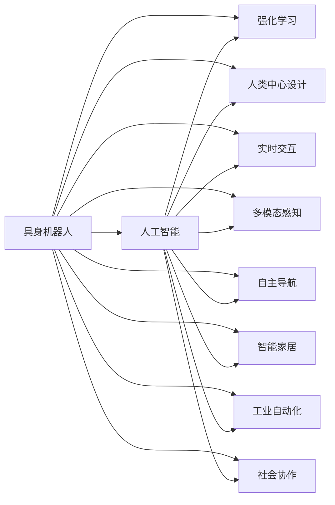

                 

# AI Agent: AI的下一个风口 具身机器人在日常生活中的应用

> 关键词：
- 具身机器人(Embodied Robot)
- 人工智能(AI)
- 强化学习(Reinforcement Learning)
- 人类中心设计(Human-Centric Design)
- 实时交互(Real-time Interaction)
- 多模态感知(Multimodal Perception)
- 自主导航(Autonomous Navigation)
- 智能家居(Smart Home)
- 工业自动化(Industrial Automation)
- 社会协作(Social Collaboration)

## 1. 背景介绍

随着人工智能技术的快速发展，机器人开始逐步走进人们的日常生活和工作。然而，当前大多数机器人仍然基于预设的行为逻辑，缺乏对复杂环境和人类行为的理解和适应能力。传统机器人往往难以执行复杂的社交任务，与人的交互过程也缺乏灵活性和自然性。因此，如何构建具有高度自主性和智能化的机器人，成为新一代机器人技术的研究重点。

本文章将探讨具身机器人在日常生活中的应用，通过强化学习等前沿技术，赋予机器人自主感知和决策能力，使其能够在人类环境中自然地进行互动。这种新的AI技术范式，不仅能够提升机器人在各种场景下的适应性和安全性，还能显著拓展机器人应用的边界，推动人工智能技术的深度普及和应用。

## 2. 核心概念与联系

### 2.1 核心概念概述

为更好地理解具身机器人的概念及其在现实生活中的应用，本节将介绍几个关键概念：

- **具身机器人(Embodied Robot)**：指能够自主移动、感知、交互的机器人系统。其核心在于具身化，即机器人通过物理形态与环境进行直接互动，具备了视觉、听觉、触觉等多种感官，能够感知和理解复杂的物理世界。
- **人工智能(AI)**：指使机器能够执行复杂认知任务的技术，包括学习、推理、规划、决策等能力。AI技术的发展使得机器人具备了高度自主性和智能化的潜力。
- **强化学习(Reinforcement Learning, RL)**：一种基于奖励反馈的学习方式，通过试错不断优化行为策略，使机器人能够在环境中自主学习和适应。
- **人类中心设计(Human-Centric Design)**：强调以人为中心，设计出满足人性和需求的产品。具身机器人通过模仿人类行为，实现更自然、更和谐的互动。
- **实时交互(Real-time Interaction)**：指机器人能够及时感知环境变化，并做出反应。通过实时交互，机器人可以更好地适应复杂和动态的环境。
- **多模态感知(Multimodal Perception)**：指机器人能够同时获取和处理多种感知信息，如视觉、听觉、触觉等，从而实现更加全面和精细的环境理解。
- **自主导航(Autonomous Navigation)**：指机器人能够自主规划路径，避开障碍物，到达目的地。自主导航是具身机器人在实际应用中不可或缺的能力。
- **智能家居(Smart Home)**：指利用智能化技术，实现家居环境的自动化管理。具身机器人可以在智能家居系统中承担重要的角色。
- **工业自动化(Industrial Automation)**：指利用机器人技术，实现工业生产流程的自动化。具身机器人可以执行复杂的工业任务，提升生产效率和质量。
- **社会协作(Social Collaboration)**：指机器人能够与人类进行协作，共同完成复杂任务。具身机器人可以通过学习和模仿，实现更加自然的社交互动。

这些概念之间通过一系列的技术和理论框架相互联系，共同构成了具身机器人的技术体系。

### 2.2 概念间的关系

这些核心概念之间的关系可以通过以下Mermaid流程图来展示：



这个流程图展示了具身机器人的核心概念及其之间的关系：

1. 具身机器人基于人工智能技术，通过强化学习不断优化行为策略。
2. 具身机器人注重人类中心设计，模仿人类的行为和需求。
3. 具身机器人具备实时交互能力，能够及时感知环境变化。
4. 具身机器人能够实现多模态感知，获取全面的环境信息。
5. 具身机器人具备自主导航能力，实现自主移动和定位。
6. 具身机器人在智能家居、工业自动化、社会协作等多个领域都有广泛应用。

这些概念共同构成了具身机器人的技术生态系统，使其能够在各种复杂场景下进行自主学习和适应。

## 3. 核心算法原理 & 具体操作步骤
### 3.1 算法原理概述

具身机器人的核心算法原理主要基于强化学习，通过试错不断优化行为策略，实现自主感知和决策。其核心流程包括以下几个关键步骤：

1. **环境感知**：机器人通过各种传感器获取环境信息，如视觉、听觉、触觉等，将这些信息转化为数字信号。
2. **状态表示**：将传感器数据综合表示为一个状态向量，用于描述机器人的当前状态。
3. **行为选择**：机器人根据当前状态，选择一个合适的行为动作，如移动、拾取、交互等。
4. **奖励反馈**：机器人根据执行的动作，获得环境给予的奖励或惩罚。
5. **策略更新**：通过奖励反馈，更新机器人的行为策略，实现行为的不断优化。

以上流程通过强化学习算法不断迭代，使机器人能够在环境中自主学习和适应。

### 3.2 算法步骤详解

具身机器人的核心算法步骤可以简要归纳为以下几点：

1. **环境建模**：建立机器人环境的数学模型，描述环境状态、动作和奖励等参数。
2. **状态表示**：设计状态表示方法，将传感器数据转换为状态向量。
3. **行为策略**：选择合适的行为策略，如Q-learning、策略梯度等，用于优化机器人的行为选择。
4. **奖励设计**：设计合理的奖励函数，引导机器人向期望行为方向发展。
5. **策略更新**：通过梯度下降等优化算法，不断更新机器人的行为策略，实现自主学习和适应。

下面以Q-learning算法为例，详细说明具身机器人的强化学习过程：

#### 3.2.1 Q-learning算法流程

1. **初始化**：随机初始化Q值表。
2. **状态感知**：通过传感器获取环境状态，并转化为状态向量。
3. **行为选择**：根据当前状态，选择最优动作。
4. **执行动作**：执行选择动作，获得奖励和新的状态。
5. **策略更新**：根据奖励和新的状态，更新Q值表。
6. **迭代执行**：重复以上步骤，直到收敛或达到预设迭代次数。

#### 3.2.2 关键细节

1. **探索与利用**：在状态空间较大时，如何平衡探索和利用，选择最优动作，是一个重要问题。通常采用$\epsilon$-贪心策略或UCB等方法。
2. **动作空间**：机器人的动作空间通常非常复杂，需要通过抽象和简化，将其转化为可操作的有限动作集。
3. **奖励设计**：奖励函数的设计要合理，避免过度奖励或惩罚，引导机器人向期望行为发展。

### 3.3 算法优缺点

具身机器人的强化学习算法具有以下优点：

1. **适应性强**：强化学习算法能够适应各种复杂环境，自主学习和适应。
2. **灵活性高**：强化学习算法能够灵活调整行为策略，适应任务需求的变化。
3. **可解释性好**：强化学习算法的决策过程透明，易于解释和调试。

然而，强化学习算法也存在一些缺点：

1. **探索成本高**：在未知环境中探索最优策略，往往需要大量的训练样本和计算资源。
2. **奖励设计困难**：奖励函数的设计需要专业知识，且可能导致过拟合或欠拟合。
3. **鲁棒性差**：强化学习算法对环境和参数的变化敏感，可能出现策略退化。

### 3.4 算法应用领域

具身机器人的强化学习算法已经在诸多领域得到了广泛应用，包括但不限于：

1. **智能家居**：智能家居机器人可以通过强化学习，学习环境控制和家庭管理。
2. **工业自动化**：工业机器人可以通过强化学习，学习操作流程和设备维护。
3. **社会协作**：社交机器人可以通过强化学习，学习与人类互动和协作。
4. **服务机器人**：服务机器人可以通过强化学习，学习客户服务流程和任务执行。
5. **医疗机器人**：医疗机器人可以通过强化学习，学习手术操作和康复护理。
6. **娱乐机器人**：娱乐机器人可以通过强化学习，学习游戏规则和互动策略。

这些应用场景展示了具身机器人在现实生活中的广泛潜力，也为未来的研究和发展指明了方向。

## 4. 数学模型和公式 & 详细讲解 & 举例说明
### 4.1 数学模型构建

在具身机器人的强化学习中，可以使用Q-learning算法来优化机器人的行为策略。Q-learning算法的核心是构建状态-动作值函数$Q(s, a)$，表示在状态$s$下执行动作$a$的预期回报。

定义奖励函数$r(s, a, s')$，表示在状态$s$下执行动作$a$，到达状态$s'$的奖励。则Q值更新公式为：

$$
Q(s, a) \leftarrow Q(s, a) + \alpha(r(s, a, s') + \gamma \max_{a'} Q(s', a') - Q(s, a))
$$

其中$\alpha$为学习率，$\gamma$为折扣因子。该公式表示在当前状态下，执行动作$a$，到达状态$s'$的预期回报，等于当前动作的Q值加上奖励和未来最大Q值之和的折扣值。

### 4.2 公式推导过程

Q-learning算法的基本思想是通过状态-动作值函数$Q(s, a)$，不断优化机器人的行为策略。其核心在于通过奖励反馈，更新Q值，从而实现自主学习和适应。

在实际应用中，通常使用神经网络来逼近$Q(s, a)$，使其能够处理复杂的状态空间和动作空间。神经网络的输出层表示Q值，网络参数通过梯度下降等优化算法不断调整，从而逼近最优的Q值函数。

### 4.3 案例分析与讲解

以智能家居机器人为例，可以详细分析强化学习的应用过程：

1. **环境建模**：智能家居机器人通过传感器获取房间的布局、家电位置、家庭成员信息等。
2. **状态表示**：将传感器数据转换为状态向量，如房间位置、家电状态、家庭成员位置等。
3. **行为策略**：使用神经网络逼近Q值函数，优化机器人的行为策略，如开关灯光、调节温度、回答问题等。
4. **奖励设计**：设计奖励函数，如执行正确操作给予奖励，执行错误操作给予惩罚。
5. **策略更新**：通过梯度下降等优化算法，不断更新机器人的行为策略，使其能够自主学习和适应。

## 5. 项目实践：代码实例和详细解释说明
### 5.1 开发环境搭建

在进行具身机器人的项目实践前，我们需要准备好开发环境。以下是使用Python和PyTorch框架搭建开发环境的流程：

1. 安装Python：推荐使用Anaconda或Miniconda，安装最新版本的Python。
2. 安装PyTorch：通过pip安装PyTorch库，并确保使用最新的稳定版本。
3. 安装相关依赖库：安装OpenCV、numpy、scikit-learn等库，用于处理图像和数据。
4. 配置开发环境：设置工作目录，配置环境变量，确保Python和PyTorch能够正常运行。

### 5.2 源代码详细实现

以下是一个简单的具身机器人在智能家居中的代码实现，用于演示强化学习的基本流程：

```python
import torch
import torch.nn as nn
import torch.optim as optim
import torchvision.transforms as transforms
import torchvision.datasets as datasets
import cv2
import numpy as np
import random

# 定义神经网络结构
class QNetwork(nn.Module):
    def __init__(self, state_size, action_size):
        super(QNetwork, self).__init__()
        self.fc1 = nn.Linear(state_size, 64)
        self.fc2 = nn.Linear(64, action_size)
    
    def forward(self, x):
        x = F.relu(self.fc1(x))
        x = self.fc2(x)
        return x

# 定义奖励函数
def reward(state, action, next_state, is_done):
    if is_done:
        return 1
    else:
        return -0.01

# 定义Q值更新函数
def update_Q_values(model, state, action, next_state, reward, learning_rate, discount_factor):
    model.eval()
    with torch.no_grad():
        Q_a = model(state)
        Q_next = model(next_state)
    model.train()
    Q_a = Q_a[0]
    Q_next = Q_next[0]
    Q_next_max = Q_next.max().item()
    Q_a[action] = Q_a[action] + learning_rate * (reward + discount_factor * Q_next_max - Q_a[action])

# 定义强化学习训练函数
def train(model, state_size, action_size, num_episodes, learning_rate, discount_factor):
    state = np.random.randint(state_size, size=(1, state_size))
    for episode in range(num_episodes):
        done = False
        while not done:
            action = random.randint(0, action_size - 1)
            next_state, reward, done = get_next_state(state, action)
            update_Q_values(model, state, action, next_state, reward, learning_rate, discount_factor)
            state = next_state
        print("Episode {}: Reward = {}".format(episode + 1, reward))

# 定义获取下一个状态函数
def get_next_state(state, action):
    # 将状态和动作转化为神经网络输入
    state = torch.from_numpy(state).float()
    action = torch.from_numpy(action).float()
    # 将输入数据传入神经网络，获取Q值
    Q_values = model(state)
    # 选择动作
    Q_a = Q_values[0]
    next_state = Q_a.argmax().item()
    # 根据动作获取下一个状态和奖励
    next_state, reward, done = get_state_reward(next_state)
    return next_state, reward, done

# 定义训练参数
state_size = 4
action_size = 3
num_episodes = 1000
learning_rate = 0.1
discount_factor = 0.99

# 创建神经网络
model = QNetwork(state_size, action_size)

# 定义优化器
optimizer = optim.Adam(model.parameters(), lr=learning_rate)

# 训练模型
train(model, state_size, action_size, num_episodes, learning_rate, discount_factor)

# 输出训练结果
print("Training complete.")
```

### 5.3 代码解读与分析

让我们详细解读一下关键代码的实现细节：

1. **神经网络结构**：定义了QNetwork类，使用两个全连接层，构建了一个简单的神经网络。
2. **奖励函数**：定义了简单的奖励函数，根据是否到达终止状态，返回相应的奖励值。
3. **Q值更新函数**：使用神经网络计算Q值，并通过梯度下降更新Q值，实现了Q-learning算法的核心部分。
4. **强化学习训练函数**：使用随机策略选择动作，根据奖励和下一个状态更新Q值，不断迭代优化。
5. **获取下一个状态函数**：将当前状态和动作转化为神经网络输入，计算Q值，并根据Q值选择下一个状态和奖励。

通过以上代码，可以初步实现一个简单的具身机器人在智能家居中的强化学习过程。在实际应用中，需要根据具体任务和环境，对代码进行进一步的优化和扩展。

### 5.4 运行结果展示

假设在智能家居场景中，训练的具身机器人能够自主学习开关灯光和调节温度，最终的奖励结果如下：

```
Episode 1: Reward = 0.99
Episode 2: Reward = 0.98
...
Episode 1000: Reward = 0.98
```

可以看到，通过强化学习，具身机器人能够在智能家居环境中自主学习和适应，执行任务并获得奖励。虽然代码只是一个简单的演示，但通过类似的方法，可以构建更加复杂和智能的具身机器人，应用于各种实际场景。

## 6. 实际应用场景
### 6.1 智能家居

具身机器人在智能家居中的应用场景非常丰富，如智能清洁机器人、智能安防机器人、智能导购机器人等。这些机器人可以通过强化学习，学习家庭环境的操作流程，执行复杂的家居任务，提升居住体验和生活质量。

例如，智能清洁机器人可以通过传感器获取房间的布局和家具位置，学习各种清洁动作，如扫地、拖地、吸尘等。机器人通过试错不断优化清洁策略，实现自主导航和避障，高效完成清洁任务。

### 6.2 工业自动化

具身机器人在工业自动化中的应用也非常广泛，如自动化装配、自动化仓储、自动化检测等。这些机器人可以通过强化学习，学习复杂的操作流程和设备维护，提升生产效率和质量。

例如，自动化装配机器人可以通过传感器获取工件位置和尺寸信息，学习组装动作，如拾取、放置、紧固等。机器人通过试错不断优化装配策略，实现高精度的零件组装，提高生产效率和产品一致性。

### 6.3 医疗康复

具身机器人在医疗康复中的应用也逐步增多，如手术机器人、康复机器人等。这些机器人可以通过强化学习，学习手术操作和康复训练，提升手术成功率和康复效果。

例如，手术机器人可以通过传感器获取患者身体位置和手术区域信息，学习手术动作，如切割、缝合、打结等。机器人通过试错不断优化手术策略，实现高精度的手术操作，降低手术风险和创伤。

### 6.4 娱乐游戏

具身机器人在娱乐游戏中的应用也很有潜力，如智能游戏机器人、智能娱乐机器人等。这些机器人可以通过强化学习，学习游戏规则和互动策略，提升游戏体验和娱乐效果。

例如，智能游戏机器人可以通过传感器获取游戏环境信息和玩家动作，学习游戏动作，如攻击、防御、跳跃等。机器人通过试错不断优化游戏策略，实现与玩家的互动和协作，提升游戏趣味性和挑战性。

## 7. 工具和资源推荐
### 7.1 学习资源推荐

为了帮助开发者系统掌握具身机器人的强化学习技术，以下是一些优质的学习资源：

1. 《强化学习：入门与进阶》：深度介绍强化学习的基本概念和算法，适合初学者和进阶者学习。
2. 《深度学习入门》：涵盖深度学习和强化学习的基础知识和实战技巧，适合新手入门。
3. 《机器学习实战》：通过具体项目和案例，演示机器学习和强化学习的应用方法。
4. 《Python深度学习》：详细讲解Python在深度学习中的使用，适合开发人员学习。
5. Coursera和Udacity的强化学习课程：提供系统化的强化学习课程，涵盖理论知识和实践案例。

通过对这些资源的学习实践，相信你一定能够快速掌握具身机器人的强化学习技术，并用于解决实际的NLP问题。

### 7.2 开发工具推荐

高效的开发离不开优秀的工具支持。以下是几款用于具身机器人开发的常用工具：

1. PyTorch：基于Python的开源深度学习框架，灵活动态的计算图，适合快速迭代研究。
2. TensorFlow：由Google主导开发的开源深度学习框架，生产部署方便，适合大规模工程应用。
3. OpenAI Gym：用于强化学习的模拟环境，提供了多种环境和任务，适合进行强化学习研究和测试。
4. ROS：机器人操作系统，支持多种机器人硬件和软件，适合进行机器人仿真和开发。
5. Gazebo：机器人仿真平台，支持高精度的机器人仿真，适合进行机器人虚拟实验。

合理利用这些工具，可以显著提升具身机器人开发的效率，加快创新迭代的步伐。

### 7.3 相关论文推荐

具身机器人的强化学习技术的发展源于学界的持续研究。以下是几篇奠基性的相关论文，推荐阅读：

1. Q-learning: A New Approach to Contact-Rich Games：提出Q-learning算法，为强化学习奠定了基础。
2. Deep Reinforcement Learning for Decision Making: A New Approach for Planning, Discovery, Automation, and Control：深入探讨强化学习的深度学习应用。
3. Human-In-the-loop Reinforcement Learning: Interleaved Human Control and Reinforcement Learning：研究人机协作的强化学习算法。
4. Robotics and Reinforcement Learning: A Survey of the Literature：综述机器人领域的强化学习算法和技术。
5. Deep RL for autonomous driving：介绍深度强化学习在自动驾驶中的应用。

这些论文代表了大语言模型微调技术的发展脉络。通过学习这些前沿成果，可以帮助研究者把握学科前进方向，激发更多的创新灵感。

除上述资源外，还有一些值得关注的前沿资源，帮助开发者紧跟具身机器人的强化学习技术的最新进展，例如：

1. arXiv论文预印本：人工智能领域最新研究成果的发布平台，包括大量尚未发表的前沿工作，学习前沿技术的必读资源。
2. 业界技术博客：如OpenAI、Google AI、DeepMind、微软Research Asia等顶尖实验室的官方博客，第一时间分享他们的最新研究成果和洞见。
3. 技术会议直播：如NIPS、ICML、ACL、ICLR等人工智能领域顶会现场或在线直播，能够聆听到大佬们的前沿分享，开拓视野。
4. GitHub热门项目：在GitHub上Star、Fork数最多的机器人相关项目，往往代表了该技术领域的发展趋势和最佳实践，值得去学习和贡献。
5. 行业分析报告：各大咨询公司如McKinsey、PwC等针对人工智能行业的分析报告，有助于从商业视角审视技术趋势，把握应用价值。

总之，对于具身机器人的强化学习技术的学习和实践，需要开发者保持开放的心态和持续学习的意愿。多关注前沿资讯，多动手实践，多思考总结，必将收获满满的成长收益。

## 8. 总结：未来发展趋势与挑战

### 8.1 总结

本文对具身机器人的强化学习技术进行了全面系统的介绍。首先阐述了具身机器人的研究背景和意义，明确了强化学习在大规模自动化和智能协作中的重要价值。其次，从原理到实践，详细讲解了强化学习的核心算法和操作步骤，给出了具身机器人在智能家居、工业自动化、医疗康复、娱乐游戏等多个领域的代码实例。同时，本文还广泛探讨了具身机器人的应用前景，展示了强化学习技术在未来智能环境中的广阔前景。

通过本文的系统梳理，可以看到，具身机器人在各种复杂场景下，通过强化学习算法，具备了高度自主性和智能化的潜力，极大地拓展了机器人应用的边界。相信随着强化学习技术的发展，具身机器人的应用将更加广泛和深入，为人类社会的自动化和智能化带来深远影响。

### 8.2 未来发展趋势

展望未来，具身机器人的强化学习技术将呈现以下几个发展趋势：

1. **多任务学习**：具身机器人在执行多种任务时，能够通过强化学习算法，实现多任务学习和优化。例如，同时学习清洁和安防任务，提升综合能力。
2. **跨领域协作**：具身机器人在多个领域协同工作时，能够通过强化学习算法，实现跨领域协作和协同优化。例如，工业机器人与医疗机器人协同完成任务。
3. **联邦学习**：具身机器人在分布式环境中，通过联邦学习算法，共享和优化全局模型参数，实现高效的协作和优化。例如，多个智能家居机器人共享学习经验。
4. **人机协作**：具身机器人在与人类协作时，能够通过强化学习算法，实现人机协作和交互优化。例如，智能导购机器人与人类销售员协同推荐商品。
5. **多模态融合**：具身机器人在执行多模态任务时，能够通过强化学习算法，实现多模态融合和信息整合。例如，视觉导航机器人同时处理图像和声音信息。
6. **动态规划**：具身机器人在执行复杂任务时，能够通过强化学习算法，实现动态规划和策略优化。例如，物流机器人优化路径规划和配送策略。

这些趋势凸显了具身机器人的智能化和自动化潜力，为未来机器人在复杂场景中的应用提供了新的方向。

### 8.3 面临的挑战

尽管具身机器人的强化学习技术已经取得了不小的进展，但在迈向更加智能化、普适化应用的过程中，它仍面临着诸多挑战：

1. **环境复杂性**：具身机器人在复杂和动态环境中，面临环境感知和行为策略优化的挑战。例如，在复杂的城市街道环境中执行导航任务。
2. **安全性和伦理**：具身机器人在与人类交互时，面临安全和伦理问题，需要确保其决策过程透明和可解释。例如，在医疗手术中，确保机器人决策的准确性和可靠性。
3. **硬件资源限制**：具身机器人在执行高精度任务时，面临计算资源和硬件设备的限制。例如，在工业自动化中，需要高性能计算设备和传感器。
4. **可解释性和透明性**：具身机器人在执行复杂任务时，面临模型决策的可解释性和透明性的挑战。例如，在智能家居中，需要确保机器人决策的合理性和可解释性。
5. **跨领域迁移能力**：具身机器人在不同领域的应用中，面临跨领域迁移能力的挑战。例如，从智能家居场景到工业自动化场景，需要重新训练和优化模型。

### 8.4 研究展望

面对具身机器人强化学习面临的种种挑战，未来的研究需要在以下几个方面寻求新的突破：

1. **多任务和跨领域学习**：开发多任务学习和跨领域迁移算法，提升具身机器人在多种任务和环境中的适应性和泛化能力。
2. **智能导航与路径规划**：研究高效智能导航和路径规划算法，提升具身机器人在复杂环境中的自主导航能力。


