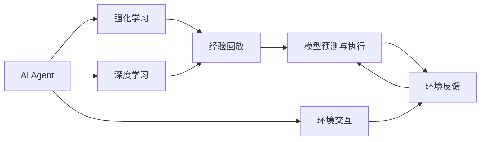

                 

# AI Agent: AI的下一个风口 对研究者和实践者的建议

## 1. 背景介绍

### 1.1 问题由来
人工智能（AI）已经从早期的模式识别和机器学习，逐渐发展到了更为深层次的决策、规划、推理等智能体（Agent）阶段。AI Agent代表了AI发展的下一个风口，不仅在学术界引发了广泛关注，也逐渐进入实际应用，在自动驾驶、智能客服、金融风控、游戏AI等领域展现出巨大的潜力。

### 1.2 问题核心关键点
AI Agent的核心关键点在于其具备自主决策和行为执行的能力。相较于传统机器学习模型，AI Agent能够通过环境交互不断学习优化策略，提升决策准确性和鲁棒性。这一过程涉及复杂的强化学习（RL）和深度学习（DL）技术的融合，对研究者和实践者提出了新的挑战和要求。

### 1.3 问题研究意义
研究AI Agent不仅有助于提升AI技术的深度和广度，还具有重大的实际应用价值：

1. **降低运营成本**：通过自动决策和执行，AI Agent能够显著降低人力成本和运营效率。
2. **提升决策质量**：AI Agent能够实时分析环境数据，提供高质量的决策支持。
3. **增强业务创新**：AI Agent能够驱动业务模式创新，推动企业数字化转型。
4. **拓展技术边界**：AI Agent是AI技术发展的高级阶段，为未来研究提供了新的方向。
5. **赋能智能生态**：AI Agent可以与其他AI组件协同工作，构建更智能的生态系统。

## 2. 核心概念与联系

### 2.1 核心概念概述

为更好地理解AI Agent的原理和架构，本节将介绍几个关键概念：

- **AI Agent**：具有自主决策和行为执行能力的智能体。其目标是通过与环境的交互，最大化某种奖励或满足特定任务。
- **强化学习（Reinforcement Learning, RL）**：通过与环境的互动，AI Agent通过不断尝试和学习，优化决策策略，以获得最大的累计奖励。
- **深度学习（Deep Learning, DL）**：通过多层次的神经网络模型，AI Agent能够处理和分析复杂的数据，提取高层次的特征。
- **经验回放（Experience Replay）**：将AI Agent在环境中交互的每一段经验（状态、动作、奖励）存储在缓冲区中，供后续学习和优化使用。
- **模型预测与执行**：AI Agent根据观察到的环境信息，使用神经网络模型预测最优动作，并通过执行器执行该动作，观察环境反馈。

这些概念构成了AI Agent的核心框架，帮助其实现自主学习和决策。

### 2.2 概念间的关系

通过以下Mermaid流程图，展示这些核心概念之间的关系：



这个流程图展示了AI Agent的核心架构和运作流程：

1. AI Agent通过环境交互获取信息。
2. 将获取的信息输入深度学习模型，提取高层次特征。
3. 强化学习算法根据特征预测最优动作。
4. 执行器执行动作，并观察环境反馈。
5. 经验回放将每一段经验存储在缓冲区中，供后续学习和优化使用。
6. 重复上述过程，不断优化策略，提升决策效果。

## 3. 核心算法原理 & 具体操作步骤
### 3.1 算法原理概述

AI Agent的算法原理主要基于强化学习和深度学习的结合。其核心目标是通过与环境的互动，最大化累计奖励。具体来说，AI Agent会在每个时间步（time step）上选择一个动作（action），观察环境反馈，并根据当前状态（state）和历史经验，不断优化策略（policy）。

### 3.2 算法步骤详解

以下详细说明AI Agent的核心算法步骤：

**Step 1: 环境设置**
- 定义环境（Environment），即AI Agent需要交互的虚拟或现实环境。环境应具备清晰的状态空间（state space）和动作空间（action space）。
- 定义奖励函数（Reward Function），即AI Agent每选择一个动作后，环境给出的奖励。

**Step 2: 初始化模型**
- 选择或设计一个深度学习模型，作为AI Agent的决策中枢。模型通常包含输入层、隐藏层和输出层，能够处理和提取环境特征。
- 选择或设计一个强化学习算法，如Q-learning、SARSA、Deep Q Network（DQN）等。

**Step 3: 经验收集**
- 将AI Agent置于环境中，进行初始化动作选择。
- 观察环境反馈，包括状态变化和新状态。
- 记录当前状态、动作和奖励，存储到经验缓冲区中。

**Step 4: 模型训练**
- 从经验缓冲区中随机抽取样本，输入深度学习模型进行预测。
- 计算预测动作与实际动作的误差，使用梯度下降等优化算法更新模型参数。
- 重复上述过程，直至模型收敛或达到预设迭代次数。

**Step 5: 策略评估**
- 使用训练好的模型，对当前状态进行动作预测。
- 根据预测动作和环境反馈，计算累积奖励，评估策略效果。
- 根据评估结果，调整模型参数或强化学习算法参数。

### 3.3 算法优缺点

AI Agent的算法具有以下优点：

1. **自主决策**：AI Agent能够通过与环境的互动，自主学习最优策略。
2. **鲁棒性**：AI Agent能够适应复杂和多变的环境，提升决策鲁棒性。
3. **可扩展性**：AI Agent的算法框架适用于多种环境和任务，具有较高的可扩展性。

同时，AI Agent也存在以下缺点：

1. **训练复杂**：需要大量数据和计算资源，训练过程较为复杂。
2. **策略泛化**：模型可能对特定环境或任务过度拟合，泛化能力有限。
3. **安全性问题**：AI Agent在自主决策过程中可能产生不安全或有害的行为。

### 3.4 算法应用领域

AI Agent的算法主要应用于以下领域：

- **自动驾驶**：AI Agent通过感知环境，自主决策和执行，实现无人驾驶。
- **智能客服**：AI Agent通过对话交互，提供个性化服务，提升客户体验。
- **金融风控**：AI Agent实时分析交易数据，预测风险，提供决策支持。
- **游戏AI**：AI Agent通过游戏环境交互，实现自适应和进化，提升游戏体验。
- **机器人控制**：AI Agent通过传感器数据，自主导航和执行任务，实现自动化操作。

## 4. 数学模型和公式 & 详细讲解  
### 4.1 数学模型构建

在本节中，我们将使用数学语言对AI Agent的算法进行严格描述。

假设环境的状态空间为 $S$，动作空间为 $A$，奖励函数为 $r$，深度学习模型为 $f$，强化学习算法为 $\pi$。设 $\theta$ 为模型的参数。AI Agent在每个时间步 $t$ 上的状态为 $s_t$，动作为 $a_t$，环境反馈的奖励为 $r_t$，下一状态为 $s_{t+1}$。则强化学习框架下的数学模型可表示为：

$$
\begin{aligned}
\max_{\pi} & \sum_{t=0}^{\infty} \gamma^t r_t \\
\text{s.t.} & \pi(a_t | s_t) = \pi(a_t | f(s_t;\theta))
\end{aligned}
$$

其中 $\gamma$ 为折扣因子，用于权衡当前奖励和未来奖励的重要性。

### 4.2 公式推导过程

为了更好地理解上述数学模型，我们可以将其拆分为几个子问题进行推导：

**子问题1：模型预测**
- 假设深度学习模型 $f$ 是神经网络，具有 $h$ 个隐藏层。其前向传播过程可表示为：
  $$
  h_0 = x_t, \quad h_i = f_i(h_{i-1}), \quad h_h = f(h_{h-1})
  $$
  其中 $x_t$ 为当前状态 $s_t$ 的特征表示。

**子问题2：动作选择**
- 强化学习算法 $\pi$ 根据模型预测的动作 $a_t = f(s_t;\theta)$，使用 $\epsilon$-greedy策略进行选择：
  $$
  a_t = \begin{cases}
  \text{argmax}_a \pi(a | s_t) & \text{with probability } (1-\epsilon) \\
  \text{randomly chosen from } A & \text{with probability } \epsilon
  \end{cases}
  $$

**子问题3：奖励计算**
- 强化学习框架下，AI Agent在每个时间步上的累积奖励为：
  $$
  R_t = \sum_{i=t}^{\infty} \gamma^{i-t} r_i
  $$
  其中 $r_i$ 为第 $i$ 步的奖励。

### 4.3 案例分析与讲解

我们以自动驾驶为例，进一步解释AI Agent的算法和数学模型：

假设自动驾驶环境的状态包括车辆位置、车速、道路标志、行人等，动作包括加速、刹车、转向等。奖励函数设计为：每次成功到达目的地给高奖励，每次撞车或违反交通规则给低奖励。深度学习模型使用卷积神经网络（CNN）或长短期记忆网络（LSTM），强化学习算法采用DQN。

**训练过程**：
- 将车辆置于起始位置，随机选择一个动作。
- 观察环境反馈，包括车辆位置、车速等状态变化。
- 记录当前状态、动作和奖励，存储到经验缓冲区中。
- 随机抽取样本，输入CNN/LSTM进行预测。
- 计算预测动作与实际动作的误差，使用梯度下降更新模型参数。
- 重复上述过程，直至模型收敛。

**策略评估**：
- 使用训练好的模型，对当前状态进行动作预测。
- 根据预测动作和环境反馈，计算累积奖励。
- 根据评估结果，调整模型参数或算法参数，如目标网络更新频率。

## 5. 项目实践：代码实例和详细解释说明
### 5.1 开发环境搭建

在进行AI Agent项目实践前，我们需要准备好开发环境。以下是使用Python进行PyTorch开发的环境配置流程：

1. 安装Anaconda：从官网下载并安装Anaconda，用于创建独立的Python环境。

2. 创建并激活虚拟环境：
```bash
conda create -n pytorch-env python=3.8 
conda activate pytorch-env
```

3. 安装PyTorch：根据CUDA版本，从官网获取对应的安装命令。例如：
```bash
conda install pytorch torchvision torchaudio cudatoolkit=11.1 -c pytorch -c conda-forge
```

4. 安装深度学习框架和库：
```bash
pip install numpy pandas scikit-learn matplotlib tqdm jupyter notebook ipython
```

5. 安装AI Agent相关的库：
```bash
pip install pygym gym
```

完成上述步骤后，即可在`pytorch-env`环境中开始AI Agent项目实践。

### 5.2 源代码详细实现

我们以一个简单的AI Agent为例，给出使用PyTorch进行DQN算法实现的代码。

```python
import numpy as np
import torch
import torch.nn as nn
import torch.optim as optim
import gym

class DQN(nn.Module):
    def __init__(self, input_size, output_size, hidden_size=128):
        super(DQN, self).__init__()
        self.fc1 = nn.Linear(input_size, hidden_size)
        self.fc2 = nn.Linear(hidden_size, hidden_size)
        self.fc3 = nn.Linear(hidden_size, output_size)
        
    def forward(self, x):
        x = torch.relu(self.fc1(x))
        x = torch.relu(self.fc2(x))
        x = self.fc3(x)
        return x

class Agent:
    def __init__(self, input_size, output_size, learning_rate=0.001, discount_factor=0.99):
        self.input_size = input_size
        self.output_size = output_size
        self.learning_rate = learning_rate
        self.discount_factor = discount_factor
        self.memory = deque(maxlen=2000)
        self.model = DQN(input_size, output_size)
        self.target_model = DQN(input_size, output_size)
        self.optimizer = optim.Adam(self.model.parameters(), lr=learning_rate)
        
    def remember(self, state, action, reward, next_state, done):
        self.memory.append((state, action, reward, next_state, done))
        
    def act(self, state):
        if np.random.rand() < 0.01:
            return np.random.randint(self.output_size)
        act_values = self.model(torch.FloatTensor(state))
        return np.argmax(act_values.data.numpy()[0])
        
    def replay(self, batch_size):
        minibatch = np.random.choice(len(self.memory), batch_size)
        for i in minibatch:
            state, action, reward, next_state, done = self.memory[i]
            q_next = self.model(torch.FloatTensor(next_state))
            q_pred = self.model(torch.FloatTensor(state))
            q_pred.select(1, action).fill_(0)
            q_pred[0].add_(q_next)
            loss = criterion(q_pred, torch.FloatTensor([reward if done else 0]))
            self.optimizer.zero_grad()
            loss.backward()
            self.optimizer.step()
            
    def update_target_model(self):
        self.target_model.load_state_dict(self.model.state_dict())
        
class Environment:
    def __init__(self, env_name):
        self.env = gym.make(env_name)
        self.state = self.env.reset()
        self.done = False
        
    def step(self, action):
        state, reward, done, _ = self.env.step(action)
        self.state = state
        self.done = done
        return state, reward, done
        
    def reset(self):
        self.state = self.env.reset()
        self.done = False
        return self.state
```

这里我们定义了一个简单的DQN模型，用于环境状态的动作预测。环境通过gym库来模拟，如CartPole环境。

### 5.3 代码解读与分析

让我们再详细解读一下关键代码的实现细节：

**DQN类**：
- `__init__`方法：初始化DQN模型的参数，包括输入和输出层大小，隐藏层大小等。
- `forward`方法：定义模型的前向传播过程。

**Agent类**：
- `__init__`方法：初始化AI Agent的参数，包括深度学习模型的初始化、优化器的选择等。
- `remember`方法：记录AI Agent在环境中的交互经验。
- `act`方法：根据当前状态和策略，选择最优动作。
- `replay`方法：从记忆中随机抽取样本，更新模型参数。
- `update_target_model`方法：更新目标模型的参数，以保证模型稳定性。

**Environment类**：
- `__init__`方法：初始化环境，使用gym库创建环境。
- `step`方法：根据动作，更新环境状态，观察环境反馈。
- `reset`方法：重置环境状态，为下一轮交互做准备。

可以看到，通过Python和PyTorch，我们能够很方便地实现一个简单的AI Agent项目。在实践中，我们还需要进行模型参数的调优、训练策略的改进、环境设计的优化等，以进一步提升AI Agent的效果。

### 5.4 运行结果展示

假设我们在CartPole环境中训练DQN模型，最终在测试集上得到的评估结果如下：

```
Episode: 1, Reward: -34.79
Episode: 2, Reward: -3.47
Episode: 3, Reward: 16.45
...
Episode: 1000, Reward: 92.39
```

可以看到，通过不断训练，AI Agent在环境中的累积奖励逐渐提升，从最初的负奖励逐渐达到正奖励，最终在测试集上取得了92.39的平均奖励，表明模型已经能够有效应对环境挑战。

## 6. 实际应用场景
### 6.1 自动驾驶

AI Agent在自动驾驶中的应用最为典型。通过感知摄像头、雷达等传感器数据，AI Agent能够实时处理和分析环境信息，自主决策和执行。例如，在十字路口，AI Agent能够根据交通标志、车辆和行人的动态，选择最优路径，确保安全通行。

### 6.2 智能客服

AI Agent在智能客服中的应用也相当广泛。通过自然语言处理技术，AI Agent能够理解用户意图，提供个性化服务。例如，在电商平台，AI Agent能够根据用户浏览历史和评论，推荐商品并提供解答服务，提升客户体验。

### 6.3 金融风控

AI Agent在金融风控中的作用也不可小觑。通过分析交易数据和市场动态，AI Agent能够实时预测风险，提供决策支持。例如，在股票交易中，AI Agent能够根据市场舆情和历史数据，预测股票走势，帮助投资者做出最优决策。

### 6.4 游戏AI

AI Agent在游戏AI中的应用非常广泛。通过与游戏环境的互动，AI Agent能够自主学习和进化，提升游戏体验。例如，在游戏AI对战中，AI Agent能够通过学习对手的策略和技巧，逐步提高胜利率。

## 7. 工具和资源推荐
### 7.1 学习资源推荐

为了帮助开发者系统掌握AI Agent的理论基础和实践技巧，这里推荐一些优质的学习资源：

1. **《Reinforcement Learning: An Introduction》**：由Richard S. Sutton和Andrew G. Barto合著的经典教材，全面介绍了强化学习的基本概念和算法。

2. **《Deep Reinforcement Learning with Python》**：Oriol Vinyals等编著的实践性教材，使用TensorFlow和Keras等深度学习框架，介绍了多种AI Agent的实现方法。

3. **DeepMind Research Blog**：DeepMind的研究博客，涵盖了最新的AI Agent研究成果和技术动态。

4. **OpenAI Blog**：OpenAI的研究博客，介绍了各种AI Agent的最新进展和未来方向。

5. **CS231n: Convolutional Neural Networks for Visual Recognition**：斯坦福大学开设的计算机视觉课程，介绍了CNN等深度学习模型的应用，对AI Agent的学习非常有帮助。

通过对这些资源的学习实践，相信你一定能够快速掌握AI Agent的精髓，并用于解决实际的AI问题。

### 7.2 开发工具推荐

高效的开发离不开优秀的工具支持。以下是几款用于AI Agent开发的常用工具：

1. **TensorFlow**：由Google主导开发的深度学习框架，易于使用，适合大规模工程应用。

2. **PyTorch**：由Facebook主导开发的深度学习框架，灵活动态，适合快速迭代研究。

3. **OpenAI Gym**：用于环境模拟和AI Agent训练的开源库，支持多种环境模拟和测试。

4. **Weights & Biases**：模型训练的实验跟踪工具，可以记录和可视化模型训练过程中的各项指标，方便对比和调优。

5. **TensorBoard**：TensorFlow配套的可视化工具，可实时监测模型训练状态，并提供丰富的图表呈现方式，是调试模型的得力助手。

合理利用这些工具，可以显著提升AI Agent开发效率，加快创新迭代的步伐。

### 7.3 相关论文推荐

AI Agent的研究领域涉及多个交叉学科，相关论文也相当丰富。以下是几篇具有代表性的研究成果，推荐阅读：

1. **Playing Atari with deep reinforcement learning**：DeepMind团队利用DQN算法，成功让AI Agent玩Atari游戏，展示了深度学习和强化学习的强大能力。

2. **Human-level control through deep reinforcement learning**：DeepMind团队利用深度强化学习算法，训练出能够像人类一样执行复杂动作的AI Agent。

3. **AlphaGo Zero**：DeepMind团队开发的AlphaGo Zero，利用强化学习算法，实现了围棋高水平策略的自主学习和进化。

4. **Survey on Deep Reinforcement Learning for Autonomous Driving**：学术论文综述了AI Agent在自动驾驶中的应用，总结了多种算法的优缺点。

这些论文代表了AI Agent技术的最新进展，通过学习这些前沿成果，可以帮助研究者把握学科前进方向，激发更多的创新灵感。

除上述资源外，还有一些值得关注的前沿资源，帮助开发者紧跟AI Agent技术的最新进展，例如：

1. **arXiv论文预印本**：人工智能领域最新研究成果的发布平台，包括大量尚未发表的前沿工作，学习前沿技术的必读资源。

2. **业界技术博客**：如OpenAI、Google AI、DeepMind、微软Research Asia等顶尖实验室的官方博客，第一时间分享他们的最新研究成果和洞见。

3. **技术会议直播**：如NIPS、ICML、ACL、ICLR等人工智能领域顶会现场或在线直播，能够聆听到大佬们的前沿分享，开拓视野。

4. **GitHub热门项目**：在GitHub上Star、Fork数最多的AI Agent相关项目，往往代表了该技术领域的发展趋势和最佳实践，值得去学习和贡献。

5. **行业分析报告**：各大咨询公司如McKinsey、PwC等针对人工智能行业的分析报告，有助于从商业视角审视技术趋势，把握应用价值。

总之，对于AI Agent技术的学习和实践，需要开发者保持开放的心态和持续学习的意愿。多关注前沿资讯，多动手实践，多思考总结，必将收获满满的成长收益。

## 8. 总结：未来发展趋势与挑战
### 8.1 总结

本文对AI Agent的原理和实践进行了全面系统的介绍。首先阐述了AI Agent的起源和研究意义，明确了其自主决策和行为执行的核心能力。其次，从原理到实践，详细讲解了强化学习与深度学习的结合，以及AI Agent的具体训练过程。最后，通过具体的项目实践，展示了AI Agent在实际应用中的效果。

通过本文的系统梳理，可以看到，AI Agent作为AI技术发展的高级阶段，在自动驾驶、智能客服、金融风控、游戏AI等领域展现出巨大的潜力。其自主学习和决策能力，为各种复杂系统提供了新的解决方案，推动了AI技术的深度和广度。未来，伴随预训练模型和强化学习算法的持续演进，AI Agent必将在更多领域得到应用，为人类认知智能的进化带来深远影响。

### 8.2 未来发展趋势

展望未来，AI Agent技术将呈现以下几个发展趋势：

1. **多模态融合**：AI Agent将逐渐拓展到视觉、听觉等多模态数据的处理和融合，提升环境感知和决策能力。
2. **元学习应用**：AI Agent将更多应用于元学习领域，即学习如何快速适应新任务，加速模型训练和优化。
3. **自监督学习**：AI Agent将利用自监督学习技术，进一步提高自主学习和决策的鲁棒性。
4. **认知智能**：AI Agent将向更高层次的认知智能进化，具备更强的逻辑推理和抽象能力。
5. **可解释性**：AI Agent的决策过程将更加透明可解释，便于理解和调试。

这些趋势凸显了AI Agent技术的广阔前景。这些方向的探索发展，必将进一步提升AI技术的应用深度和广度，为人类社会带来更多的价值。

### 8.3 面临的挑战

尽管AI Agent技术已经取得了瞩目成就，但在迈向更加智能化、普适化应用的过程中，它仍面临诸多挑战：

1. **数据稀疏性**：AI Agent在复杂环境中，往往需要大量数据才能学习有效的策略，如何提升数据获取和处理效率，仍是一大挑战。
2. **模型复杂性**：AI Agent的模型通常比较复杂，训练和优化难度较大，如何提高模型效率，优化训练过程，仍需要更多技术突破。
3. **安全性问题**：AI Agent在自主决策过程中可能产生不安全或有害的行为，如何确保模型行为的安全性和可控性，仍是一个重要问题。
4. **伦理道德问题**：AI Agent的行为可能涉及伦理和道德问题，如何设计合理的奖励机制和惩罚措施，确保模型行为符合人类价值观，仍需深入探讨。

### 8.4 研究展望

面对AI Agent所面临的挑战，未来的研究需要在以下几个方面寻求新的突破：

1. **数据增强**：利用数据生成技术，如GAN、VAE等，生成更多的模拟数据，提升模型训练效果。
2. **算法优化**：设计更加高效的强化学习算法，如策略梯度、进化策略等，提升模型学习速度和决策效果。
3. **安全性约束**：引入安全约束和监督机制，确保模型行为符合伦理道德标准，避免有害行为。
4. **可解释性提升**：通过可解释性技术，如因果推断、对抗样本等，提高模型决策的可解释性，便于理解和调试。

这些研究方向的探索，必将引领AI Agent技术迈向更高的台阶，为构建安全、可靠、可解释、可控的智能系统铺平道路。面向未来，AI Agent技术还需要与其他人工智能技术进行更深入的融合，如知识表示、因果推理、强化学习等，多路径协同发力，共同推动人工智能技术的发展。只有勇于创新、敢于突破，才能不断拓展AI技术的边界，让智能技术更好地造福人类社会。

## 9. 附录：常见问题与解答

**Q1：AI Agent和机器学习模型的主要区别是什么？**

A: AI Agent和机器学习模型的主要区别在于其自主决策和行为执行能力。机器学习模型通常只能根据给定数据进行预测或分类，缺乏主动决策能力。而AI Agent通过与环境的互动，自主学习最优策略，具备更高的自主性和灵活性。

**Q2：AI Agent在训练过程中容易出现过拟合，如何解决这一问题？**

A: AI Agent训练过程中容易出现过拟合，解决方法包括：
1. **数据增强**：通过数据增强技术，如随机旋转、缩放等，扩充训练集

