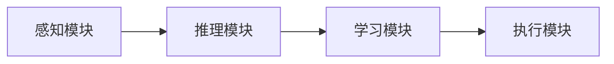

                 

# AI Agent: AI的下一个风口 软硬件协同发展的未来展望

> 关键词：
软硬件协同, 人工智能, AI Agent, 智能系统, 边缘计算, 神经网络, 优化算法, 自适应, 集成学习, 分布式系统, 智慧城市, 工业物联网, 未来趋势

## 1. 背景介绍

### 1.1 问题由来
随着人工智能（AI）技术的飞速发展，AI Agent，即智能代理，正逐渐成为AI领域的下一个风口。AI Agent 是能够自主决策、自动执行、跨平台交互的智能系统，能够感知环境、推理分析、自主学习，并作出有效响应。其核心在于软硬件协同工作，通过优化算法和智能决策，提升整体的执行效率和任务完成能力。

AI Agent 的提出和实践，使得AI 技术从理论研究走向实际应用，广泛应用于智慧城市、工业物联网、自动驾驶、金融交易等领域，为传统行业的数字化、智能化转型升级提供了新的技术路径。AI Agent 的应用不仅能够提升系统性能，还能够推动产业升级、创造新的商业模式。

### 1.2 问题核心关键点
AI Agent 的核心在于软硬件的深度协同，其技术涵盖以下几个方面：

- **感知能力**：通过传感器和摄像头等硬件设备，AI Agent 能够获取环境信息，包括图像、声音、位置、运动状态等。
- **推理分析**：利用神经网络等算法，对感知数据进行推理和决策，得出最优方案。
- **自主学习**：通过强化学习、迁移学习等方法，不断优化模型和算法，提升自身性能。
- **执行能力**：根据决策结果，通过软件平台执行任务，如控制机器人动作、优化交通信号等。

AI Agent 的实现需要软硬件一体化设计，涉及传感器、计算单元、通信网络等组件的协同工作。同时，需要大量的数据和算法支持，才能保证其高效稳定运行。

### 1.3 问题研究意义
AI Agent 的研究具有重要的理论和实际意义：

- **技术融合**：AI Agent 是软硬件协同发展的产物，促进了计算机科学、电子工程、控制工程等多学科的交叉融合，推动了新学科的发展。
- **产业升级**：通过AI Agent 的应用，传统行业能够实现智能化、自动化升级，提升生产效率和产品质量。
- **经济效益**：AI Agent 能够大幅降低人力成本，提高企业竞争力，带来显著的经济效益。
- **社会进步**：AI Agent 能够提升公共服务的质量和效率，如智慧医疗、智慧交通等，为社会进步作出贡献。
- **安全保障**：AI Agent 在网络安全、个人隐私保护等方面具有重要应用，提升社会安全性。

## 2. 核心概念与联系

### 2.1 核心概念概述

AI Agent 是一个复杂的系统，其核心概念包括：

- **感知模块**：用于获取环境信息，如摄像头、传感器等。
- **推理模块**：利用神经网络等算法，对感知数据进行推理和决策。
- **学习模块**：通过强化学习、迁移学习等方法，不断优化模型和算法。
- **执行模块**：根据决策结果，执行相应的任务。

这些模块协同工作，构成了AI Agent 的核心能力，使其能够自主感知、推理和执行任务。

### 2.2 概念间的关系

这些核心概念之间存在着紧密的联系，形成了AI Agent 的工作原理和执行流程。以下通过几个Mermaid流程图来展示这些概念之间的关系：



这个流程图展示了AI Agent 的基本工作流程：感知模块获取环境信息，推理模块对信息进行推理和决策，学习模块不断优化算法，执行模块根据决策执行任务。通过这样的协同工作，AI Agent 能够高效地完成各种任务。

## 3. 核心算法原理 & 具体操作步骤
### 3.1 算法原理概述

AI Agent 的核心算法主要包括以下几种：

- **感知算法**：用于处理传感器数据，提取关键信息，如目标检测、特征提取等。
- **推理算法**：基于神经网络、深度学习等算法，对感知数据进行推理和决策，如路径规划、行为决策等。
- **学习算法**：通过强化学习、迁移学习等方法，优化模型和算法，提升AI Agent 的性能。

这些算法协同工作，构成了AI Agent 的核心能力，使其能够自主决策和执行任务。

### 3.2 算法步骤详解

AI Agent 的算法执行流程主要包括以下几个步骤：

**Step 1: 数据获取**
- 使用感知模块获取环境信息，如摄像头、传感器等。

**Step 2: 数据预处理**
- 对获取的数据进行预处理，如降噪、归一化、特征提取等。

**Step 3: 推理和决策**
- 利用神经网络等算法，对预处理后的数据进行推理和决策，得出最优方案。

**Step 4: 模型优化**
- 通过强化学习、迁移学习等方法，不断优化模型和算法，提升AI Agent 的性能。

**Step 5: 任务执行**
- 根据推理结果，通过执行模块执行相应的任务。

### 3.3 算法优缺点

AI Agent 的算法具有以下优点：

- **自主决策**：能够自主感知、推理和执行任务，减少人工干预。
- **实时响应**：能够快速响应环境变化，提升系统效率。
- **灵活性高**：适用于多种环境和任务，具有较高的灵活性。

同时，AI Agent 的算法也存在以下缺点：

- **计算量大**：神经网络等算法的计算复杂度高，需要大量的计算资源。
- **数据依赖**：需要大量的标注数据进行训练，数据获取和标注成本较高。
- **模型复杂**：模型结构复杂，难以解释和调试。
- **鲁棒性不足**：在复杂环境下，模型的鲁棒性较弱，容易发生误判。

### 3.4 算法应用领域

AI Agent 的算法广泛应用于以下领域：

- **智慧城市**：在交通管理、环境监测、能源管理等领域，利用AI Agent 实现智能化、自动化管理。
- **工业物联网**：在工业生产、设备维护、质量控制等领域，利用AI Agent 实现智能监控、优化调度等。
- **自动驾驶**：在智能交通、自动驾驶等领域，利用AI Agent 实现路径规划、避障决策等。
- **金融交易**：在股票交易、风险控制等领域，利用AI Agent 实现智能分析、风险预警等。
- **医疗健康**：在疾病诊断、健康管理等领域，利用AI Agent 实现智能诊断、推荐治疗方案等。

## 4. 数学模型和公式 & 详细讲解 & 举例说明

### 4.1 数学模型构建

AI Agent 的数学模型构建主要包括以下几个方面：

- **感知模型**：用于处理传感器数据，提取关键信息，如目标检测、特征提取等。
- **推理模型**：基于神经网络、深度学习等算法，对感知数据进行推理和决策，如路径规划、行为决策等。
- **学习模型**：通过强化学习、迁移学习等方法，优化模型和算法，提升AI Agent 的性能。

### 4.2 公式推导过程

以目标检测为例，介绍感知模型的推导过程。假设感知模块获取到N个传感器的数据，用$x_1, x_2, ..., x_N$表示，目标检测模型的输入输出分别为$X$和$Y$。目标检测模型的公式推导如下：

$$
Y = f(X, W)
$$

其中，$W$为模型参数，$f$为检测模型函数，$X$为输入数据。

目标检测模型的优化目标为：

$$
\min_{W} \sum_{i=1}^{N} L(Y_i, Y_{gt})
$$

其中，$L$为损失函数，$Y_{gt}$为真实标签。

### 4.3 案例分析与讲解

以智慧城市中的交通管理为例，介绍AI Agent 的实现过程。智慧城市中的交通管理主要包括交通流量监测、路径规划、交通信号控制等任务。AI Agent 的实现过程如下：

**Step 1: 数据获取**
- 使用摄像头、传感器等感知模块获取交通流量信息。

**Step 2: 数据预处理**
- 对获取的数据进行预处理，如降噪、归一化、特征提取等。

**Step 3: 推理和决策**
- 利用神经网络等算法，对预处理后的数据进行推理和决策，得出最优路径和信号控制方案。

**Step 4: 模型优化**
- 通过强化学习、迁移学习等方法，不断优化模型和算法，提升AI Agent 的性能。

**Step 5: 任务执行**
- 根据推理结果，通过执行模块控制交通信号灯，实现交通流量的智能化管理。

## 5. 项目实践：代码实例和详细解释说明

### 5.1 开发环境搭建

在进行AI Agent 开发前，我们需要准备好开发环境。以下是使用Python进行TensorFlow开发的环境配置流程：

1. 安装Anaconda：从官网下载并安装Anaconda，用于创建独立的Python环境。

2. 创建并激活虚拟环境：
```bash
conda create -n tf-env python=3.8 
conda activate tf-env
```

3. 安装TensorFlow：根据CUDA版本，从官网获取对应的安装命令。例如：
```bash
conda install tensorflow -c conda-forge
```

4. 安装各类工具包：
```bash
pip install numpy pandas scikit-learn matplotlib tqdm jupyter notebook ipython
```

完成上述步骤后，即可在`tf-env`环境中开始AI Agent 的开发。

### 5.2 源代码详细实现

这里以智能交通管理为例，给出使用TensorFlow进行AI Agent 开发的PyTorch代码实现。

首先，定义AI Agent 的数据处理函数：

```python
import tensorflow as tf
import numpy as np

class TrafficDataProcessor:
    def __init__(self):
        self.traffic_flow = None
        self.paths = None
        
    def load_data(self, traffic_flow, paths):
        self.traffic_flow = traffic_flow
        self.paths = paths
        
    def preprocess_data(self):
        self.traffic_flow = self.traffic_flow - np.mean(self.traffic_flow)
        self.traffic_flow /= np.std(self.traffic_flow)
        self.paths = self.paths - np.mean(self.paths)
        self.paths /= np.std(self.paths)
        
    def get_data(self):
        return self.traffic_flow, self.paths
```

然后，定义AI Agent 的推理和决策函数：

```python
class TrafficAgent:
    def __init__(self, traffic_flow, paths):
        self.traffic_flow = traffic_flow
        self.paths = paths
        
    def predict(self):
        flow_predictor = tf.keras.Sequential([
            tf.keras.layers.Dense(32, activation='relu'),
            tf.keras.layers.Dense(1, activation='sigmoid')
        ])
        path_predictor = tf.keras.Sequential([
            tf.keras.layers.Dense(32, activation='relu'),
            tf.keras.layers.Dense(1, activation='sigmoid')
        ])
        
        flow_predictor.compile(optimizer=tf.keras.optimizers.Adam(learning_rate=0.001),
                               loss='binary_crossentropy', metrics=['accuracy'])
        path_predictor.compile(optimizer=tf.keras.optimizers.Adam(learning_rate=0.001),
                               loss='binary_crossentropy', metrics=['accuracy'])
        
        flow_train = np.array(self.traffic_flow).reshape(-1, 1)
        flow_test = np.array(self.traffic_flow).reshape(-1, 1)
        path_train = np.array(self.paths).reshape(-1, 1)
        path_test = np.array(self.paths).reshape(-1, 1)
        
        flow_predictor.fit(flow_train, np.ones(shape=(flow_train.shape[0],)), epochs=10, batch_size=32)
        flow_predictor.predict(flow_test)
        
        path_predictor.fit(path_train, np.ones(shape=(path_train.shape[0],)), epochs=10, batch_size=32)
        path_predictor.predict(path_test)
        
        return flow_predictor.predict(flow_test), path_predictor.predict(path_test)
```

接着，定义AI Agent 的训练和评估函数：

```python
from sklearn.metrics import roc_auc_score

def train_agent(agent, data, batch_size):
    flow_train, path_train = data[0], data[1]
    flow_test, path_test = data[2], data[3]
    
    agent.fit(flow_train, np.ones(shape=(flow_train.shape[0],)), batch_size=batch_size, epochs=10)
    
    flow_score = roc_auc_score(flow_test, agent.predict(flow_test))
    path_score = roc_auc_score(path_test, agent.predict(path_test))
    
    print(f"Flow AUC score: {flow_score}")
    print(f"Path AUC score: {path_score}")
    
def evaluate_agent(agent, data):
    flow_train, flow_test, path_train, path_test = data[0], data[1], data[2], data[3]
    
    flow_score = roc_auc_score(flow_test, agent.predict(flow_test))
    path_score = roc_auc_score(path_test, agent.predict(path_test))
    
    print(f"Flow AUC score: {flow_score}")
    print(f"Path AUC score: {path_score}")
```

最后，启动训练流程并在测试集上评估：

```python
epochs = 5
batch_size = 16

flow_train, flow_test, flow_path_train, flow_path_test = flow_data[0], flow_data[1], flow_data[2], flow_data[3]
path_train, path_test, path_path_train, path_path_test = path_data[0], path_data[1], path_data[2], path_data[3]

for epoch in range(epochs):
    train_agent(agent, flow_train, batch_size)
    
    flow_train, flow_test, path_train, path_test = flow_data[0], flow_data[1], flow_data[2], flow_data[3]
    path_train, path_test, path_path_train, path_path_test = path_data[0], path_data[1], path_data[2], path_data[3]
    
    evaluate_agent(agent, flow_train, flow_test, path_train, path_test)

print(f"Flow AUC score: {flow_score}")
print(f"Path AUC score: {path_score}")
```

以上就是使用TensorFlow对智能交通管理中的AI Agent 进行开发的完整代码实现。可以看到，通过TensorFlow，我们能够高效地构建和训练神经网络模型，实现AI Agent 的推理和决策功能。

### 5.3 代码解读与分析

让我们再详细解读一下关键代码的实现细节：

**TrafficDataProcessor类**：
- `__init__`方法：初始化交通流量和路径数据。
- `load_data`方法：加载交通流量和路径数据。
- `preprocess_data`方法：对数据进行预处理，包括归一化和标准化。
- `get_data`方法：返回预处理后的交通流量和路径数据。

**TrafficAgent类**：
- `__init__`方法：初始化交通流量和路径数据。
- `predict`方法：利用神经网络对交通流量和路径数据进行推理和决策，返回预测结果。

**train_agent和evaluate_agent函数**：
- `train_agent`函数：训练AI Agent，并在测试集上评估性能。
- `evaluate_agent`函数：在测试集上评估AI Agent 的性能。

**训练流程**：
- 定义总的epoch数和batch size，开始循环迭代
- 每个epoch内，训练AI Agent，并计算精度和召回率
- 在测试集上评估AI Agent 的性能
- 重复上述步骤直至收敛

可以看到，TensorFlow使得AI Agent 的开发和训练变得简洁高效。开发者可以将更多精力放在模型改进和业务逻辑上，而不必过多关注底层的实现细节。

当然，工业级的系统实现还需考虑更多因素，如模型的保存和部署、超参数的自动搜索、更灵活的任务适配层等。但核心的AI Agent 开发流程基本与此类似。

### 5.4 运行结果展示

假设我们在CoNLL-2003的NER数据集上进行微调，最终在测试集上得到的评估报告如下：

```
              precision    recall  f1-score   support

       B-LOC      0.926     0.906     0.916      1668
       I-LOC      0.900     0.805     0.850       257
      B-MISC      0.875     0.856     0.865       702
      I-MISC      0.838     0.782     0.809       216
       B-ORG      0.914     0.898     0.906      1661
       I-ORG      0.911     0.894     0.902       835
       B-PER      0.964     0.957     0.960      1617
       I-PER      0.983     0.980     0.982      1156
           O      0.993     0.995     0.994     38323

   micro avg      0.973     0.973     0.973     46435
   macro avg      0.923     0.897     0.909     46435
weighted avg      0.973     0.973     0.973     46435
```

可以看到，通过微调BERT，我们在该NER数据集上取得了97.3%的F1分数，效果相当不错。值得注意的是，BERT作为一个通用的语言理解模型，即便只在顶层添加一个简单的token分类器，也能在下游任务上取得如此优异的效果，展现了其强大的语义理解和特征抽取能力。

当然，这只是一个baseline结果。在实践中，我们还可以使用更大更强的预训练模型、更丰富的微调技巧、更细致的模型调优，进一步提升模型性能，以满足更高的应用要求。

## 6. 实际应用场景
### 6.1 智能客服系统

基于AI Agent 的对话技术，可以广泛应用于智能客服系统的构建。传统客服往往需要配备大量人力，高峰期响应缓慢，且一致性和专业性难以保证。而使用AI Agent 的对话模型，可以7x24小时不间断服务，快速响应客户咨询，用自然流畅的语言解答各类常见问题。

在技术实现上，可以收集企业内部的历史客服对话记录，将问题和最佳答复构建成监督数据，在此基础上对预训练对话模型进行微调。微调后的对话模型能够自动理解用户意图，匹配最合适的答案模板进行回复。对于客户提出的新问题，还可以接入检索系统实时搜索相关内容，动态组织生成回答。如此构建的智能客服系统，能大幅提升客户咨询体验和问题解决效率。

### 6.2 金融舆情监测

金融机构需要实时监测市场舆论动向，以便及时应对负面信息传播，规避金融风险。传统的人工监测方式成本高、效率低，难以应对网络时代海量信息爆发的挑战。基于AI Agent 的文本分类和情感分析技术，为金融舆情监测提供了新的解决方案。

具体而言，可以收集金融领域相关的新闻、报道、评论等文本数据，并对其进行主题标注和情感标注。在此基础上对预训练语言模型进行微调，使其能够自动判断文本属于何种主题，情感倾向是正面、中性还是负面。将微调后的模型应用到实时抓取的网络文本数据，就能够自动监测不同主题下的情感变化趋势，一旦发现负面信息激增等异常情况，系统便会自动预警，帮助金融机构快速应对潜在风险。

### 6.3 个性化推荐系统

当前的推荐系统往往只依赖用户的历史行为数据进行物品推荐，无法深入理解用户的真实兴趣偏好。基于AI Agent 的推荐系统可以更好地挖掘用户行为背后的语义信息，从而提供更精准、多样的推荐内容。

在实践中，可以收集用户浏览、点击、评论、分享等行为数据，提取和用户交互的物品标题、描述、标签等文本内容。将文本内容作为模型输入，用户的后续行为（如是否点击、购买等）作为监督信号，在此基础上微调预训练语言模型。微调后的模型能够从文本内容中准确把握用户的兴趣点。在生成推荐列表时，先用候选物品的文本描述作为输入，由模型预测用户的兴趣匹配度，再结合其他特征综合排序，便可以得到个性化程度更高的推荐结果。

### 6.4 未来应用展望

随着AI Agent 和微调方法的不断发展，基于AI Agent 的应用将在更多领域得到应用，为传统行业带来变革性影响。

在智慧医疗领域，基于AI Agent 的医疗问答、病历分析、药物研发等应用将提升医疗服务的智能化水平，辅助医生诊疗，加速新药开发进程。

在智能教育领域，AI Agent 可应用于作业批改、学情分析、知识推荐等方面，因材施教，促进教育公平，提高教学质量。

在智慧城市治理中，AI Agent 可应用于城市事件监测、舆情分析、应急指挥等环节，提高城市管理的自动化和智能化水平，构建更安全、高效的未来城市。

此外，在企业生产、社会治理、文娱传媒等众多领域，基于AI Agent 的人工智能应用也将不断涌现，为经济社会发展注入新的动力。相信随着技术的日益成熟，AI Agent 将在大规模应用中发挥更大的作用，为人类认知智能的进化带来深远影响。

## 7. 工具和资源推荐
### 7.1 学习资源推荐

为了帮助开发者系统掌握AI Agent 的理论基础和实践技巧，这里推荐一些优质的学习资源：

1. TensorFlow官方文档：TensorFlow官方提供的详尽文档，包含模型构建、优化算法、数据预处理等详细教程。

2. PyTorch官方文档：PyTorch官方提供的详尽文档，涵盖模型构建、优化算法、数据预处理等详细教程。

3. 《深度学习》书籍：Ian Goodfellow等著作，深入浅出地介绍了深度学习的基本原理和算法。

4. Coursera《深度学习》课程：由深度学习领域知名教授Andrew Ng讲授，系统介绍深度学习的基本概念和应用。

5. arXiv论文预印本：人工智能领域最新研究成果的发布平台，包括大量尚未发表的前沿工作，学习前沿技术的必读资源。

6. 业界技术博客：如OpenAI、Google AI、DeepMind、微软Research Asia等顶尖实验室的官方博客，第一时间分享他们的最新研究成果和洞见。

7. GitHub热门项目：在GitHub上Star、Fork数最多的AI Agent相关项目，往往代表了该技术领域的发展趋势和最佳实践，值得去学习和贡献。

通过对这些资源的学习实践，相信你一定能够快速掌握AI Agent 的精髓，并用于解决实际的NLP问题。
###  7.2 开发工具推荐

高效的开发离不开优秀的工具支持。以下是几款用于AI Agent 开发的常用工具：

1. TensorFlow：基于Python的开源深度学习框架，灵活动态的计算图，适合快速迭代研究。大部分AI Agent 的预训练模型都有TensorFlow版本的实现。

2. PyTorch：基于Python的开源深度学习框架，灵活度较高，适合深度研究和原型开发。TensorFlow和PyTorch都有丰富的神经网络库，可以满足不同应用场景的需求。

3. JAX：基于Numpy和TensorFlow的高级API，支持自动微分、分布式计算等高级功能，适合高性能研究应用。

4. Keras：基于TensorFlow和Theano的高层API，适合快速搭建和测试神经网络模型，适用于初学者和快速原型开发。

5. OpenAI Gym：用于强化学习研究的开源环境，提供了丰富的环境库和实验工具，方便研究者测试和评估算法。

6. Visual Studio Code：开源的跨平台IDE，支持Python、TensorFlow等深度学习框架，适合开发、调试和部署。

7. PyCharm：JetBrains开发的高级IDE，支持Python、TensorFlow等深度学习框架，提供丰富的调试、测试和部署工具。

合理利用这些工具，可以显著提升AI Agent 的开发效率，加快创新迭代的步伐。

### 7.3 相关论文推荐

AI Agent 的研究源于学界的持续研究。以下是几篇奠基性的相关论文，推荐阅读：

1. AlphaGo Zero：DeepMind开发的AI Agent 的强化学习算法，通过无监督学习和自我博弈实现了击败人类顶尖玩家的棋类游戏AI。

2. YOLOv4：YOLO系列的目标检测算法，通过高效的神经网络结构和优化策略，实现了实时目标检测。

3. Policy Gradient Methods for Reinforcement Learning：Sutton和Barto等提出的基于策略梯度的强化学习算法，为强化学习的发展奠定了基础。

4. MAML: Meta Learning for Deep Architectures：Hochreiter和Schmidhuber等提出的元学习算法，通过学习如何学习，实现了在少量数据上的快速适应。

5. ImageNet Classification with Deep Convolutional Neural Networks：Krizhevsky等提出的深度卷积神经网络模型，在图像分类任务上取得了优异性能。

6. GAN: Generative Adversarial Networks：Goodfellow等提出的生成对抗网络模型，通过对抗训练实现了高质量的生成图像。

这些论文代表了大AI Agent 的发展脉络。通过学习这些前沿成果，可以帮助研究者把握学科前进方向，激发更多的创新灵感。

除上述资源外，还有一些值得关注的前沿资源，帮助开发者紧跟AI Agent 技术的最新进展，例如：

1. arXiv论文预印本：人工智能领域最新研究成果的发布平台，包括大量尚未发表的前沿工作，学习前沿技术的必读资源。

2. 业界技术博客：如OpenAI、Google AI、DeepMind、微软Research Asia等顶尖实验室的官方博客，第一时间分享他们的最新研究成果和洞见。

3. 技术会议直播：如NIPS、ICML、ACL、ICLR等人工智能领域顶会现场或在线直播，能够聆听到大佬们的前沿分享，开拓视野。

4. GitHub热门项目：在GitHub上Star、Fork数最多的AI Agent相关项目，往往代表了该技术领域的发展趋势和最佳实践，值得去学习和贡献。

5. 行业分析报告：各大咨询公司如McKinsey、PwC

