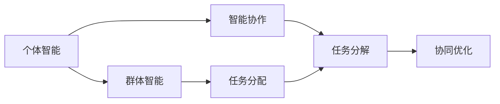

                 

## 1. 背景介绍

在人工智能（AI）领域，我们常谈论智能的实现方式，其中"个体智能"、"群体智能"和"智能协作"被视为AI发展中不可或缺的"三驾马车"。尽管每个概念都有其独特的特点，但它们的交互作用也为AI赋予了生命力和适应性。了解这些概念以及它们如何协同工作，将有助于我们把握AI发展的未来方向。

## 2. 核心概念与联系

### 2.1 核心概念概述

- **个体智能**：指单个AI代理或机器学习模型所具备的智能。个体智能通常通过深度学习、强化学习等技术实现，以模仿或超越人类的认知和学习能力。
- **群体智能**：指多个智能体通过协作和交互，共同完成任务的能力。群体智能强调智能体的多样性、自治性和分布式决策，以实现更高效、更智能的系统。
- **智能协作**：指多个AI代理或智能体之间的交互和协同工作，以实现复杂的任务和目标。智能协作通常基于任务分解、分布式计算和协同优化等技术，以最大化整体效率和效能。

这三个概念构成了AI的生态系统，它们之间的联系可以通过以下Mermaid流程图表示：



### 2.2 概念间的关系

个体智能是基础，是智能协作和群体智能得以实现的前提。群体智能通过多个个体智能的协同工作，能够实现更高层次的复杂任务。智能协作则进一步提升了群体智能的效果，使得AI系统在执行特定任务时，能更高效、更精准地完成任务。这三个概念相辅相成，共同推动了AI技术的发展。

## 3. 核心算法原理 & 具体操作步骤
### 3.1 算法原理概述

AI的“三驾马车”各自拥有不同的算法原理和技术路径，但它们在目标上是一致的：实现智能任务处理和决策优化。

- **个体智能**：主要基于深度学习、强化学习等方法，以实现对复杂问题的理解和解决。个体智能的核心是优化模型的参数，使其在给定的输入上输出最优的预测或决策。
- **群体智能**：常采用分布式算法、协同学习等技术，以实现智能体的多样性、自治性和交互性。群体智能的核心是通过智能体的协作，实现更高效、更智能的系统。
- **智能协作**：通常通过任务分解、分布式计算等方法，将复杂的任务拆解为多个子任务，并通过协同优化实现整体任务的优化。智能协作的核心是确保各智能体间的通信和协调，以实现整体最优。

### 3.2 算法步骤详解

个体智能的算法步骤主要包括：

1. **数据预处理**：收集和处理训练数据，以供模型学习。
2. **模型选择**：选择适合的深度学习或强化学习模型，如神经网络、深度信念网络等。
3. **训练和优化**：通过反向传播或蒙特卡罗方法等技术，更新模型参数，优化模型性能。
4. **模型评估**：在测试集上评估模型性能，调整模型参数，直至达到最优。

群体智能的算法步骤主要包括：

1. **智能体设计**：设计多样化的智能体，每个智能体独立运行，有自己独立的决策策略和反馈机制。
2. **通信机制**：设计智能体之间的通信协议，确保信息传递的效率和安全性。
3. **协同学习**：通过智能体之间的交互和协作，共享信息和知识，提升整体性能。
4. **任务执行**：智能体协同执行任务，实现更高效、更智能的系统。

智能协作的算法步骤主要包括：

1. **任务分解**：将复杂任务分解为多个子任务，分配给不同的智能体执行。
2. **分布式计算**：每个智能体独立执行子任务，并共享计算资源和信息。
3. **协同优化**：通过全局优化算法，如粒子群算法、遗传算法等，优化整体任务的性能。
4. **结果汇总**：汇总各智能体的执行结果，形成最终输出。

### 3.3 算法优缺点

- **个体智能**：优点在于可以针对特定问题进行优化，适应性强。缺点在于模型泛化能力有限，容易受到数据质量和特征工程的影响。
- **群体智能**：优点在于具有很强的分布式处理能力，可以通过多样性提升整体性能。缺点在于通信和协作机制的设计复杂，可能存在信息丢失和同步问题。
- **智能协作**：优点在于可以充分利用计算资源和智能体能力，实现高效任务执行。缺点在于任务分解和协同优化算法复杂，需要高效的通信和协调机制。

### 3.4 算法应用领域

- **个体智能**：广泛应用于图像识别、语音识别、自然语言处理等领域。
- **群体智能**：常用于机器人协作、网络安全、众包平台等领域。
- **智能协作**：适用于大规模分布式计算、任务调度、供应链管理等领域。

## 4. 数学模型和公式 & 详细讲解 & 举例说明

### 4.1 数学模型构建

个体智能的数学模型通常基于优化问题，其目标函数为损失函数 $L(\theta)$，其中 $\theta$ 为模型参数。优化目标是使损失函数最小化。群体智能和智能协作的数学模型则涉及多个智能体或子任务的协同优化，通常使用分布式优化算法，如梯度下降、迭代学习等。

### 4.2 公式推导过程

以深度学习为例，个体智能的优化目标为：

$$
\min_{\theta} \frac{1}{m} \sum_{i=1}^m \ell(y_i,f(x_i;\theta))
$$

其中 $m$ 为样本数量，$\ell$ 为损失函数，$f(x_i;\theta)$ 为模型的预测函数。

群体智能的优化目标通常为：

$$
\min_{\theta_i} \sum_{i=1}^n \ell_i(y_i,f_i(x_i;\theta_i))
$$

其中 $n$ 为智能体数量，$\ell_i$ 为智能体 $i$ 的损失函数，$f_i(x_i;\theta_i)$ 为智能体 $i$ 的预测函数。

智能协作的优化目标则更为复杂，通常涉及全局优化和子任务的协同优化：

$$
\min_{\theta_i} \sum_{i=1}^n \sum_{j=1}^m \ell_i(y_i,f_i(x_i;\theta_i))
$$

其中 $m$ 为任务数量，$\ell_i$ 为任务 $i$ 的损失函数，$f_i(x_i;\theta_i)$ 为任务 $i$ 的预测函数。

### 4.3 案例分析与讲解

在图像识别任务中，个体智能通过卷积神经网络（CNN）实现。以LeNet为例，其数学模型为：

$$
f(x;\theta) = \sigma\left(\sum_{i=1}^n w_i x_i + b_i\right)
$$

其中 $x$ 为输入图像，$w_i$ 和 $b_i$ 为卷积层和全连接层的权重和偏置，$\sigma$ 为激活函数。

在群体智能中，通过多个CNN的协同工作，可以实现更高效的图像分类。每个CNN负责处理图像的不同部分，并通过通信机制共享信息。例如，使用Federated Learning算法，可以在不集中存储数据的情况下，实现跨设备协作训练。

在智能协作中，任务可以分解为图像预处理、特征提取、分类等子任务。每个子任务由不同的智能体独立执行，并使用协同优化算法，如BP（Backpropagation）算法，优化整体性能。例如，在医学影像分析中，多个智能体可以协同完成图像分割、特征提取、病理诊断等任务，提升诊断效率和准确性。

## 5. 项目实践：代码实例和详细解释说明

### 5.1 开发环境搭建

为了进行个体智能、群体智能和智能协作的实验，我们需要搭建一个包含深度学习框架（如TensorFlow、PyTorch）、分布式计算框架（如Spark、Ray）和协同学习框架（如Federated Learning）的开发环境。以下是具体的安装步骤：

1. 安装Python：
   ```bash
   sudo apt-get install python3 python3-pip
   ```

2. 安装TensorFlow：
   ```bash
   pip install tensorflow
   ```

3. 安装PyTorch：
   ```bash
   pip install torch torchvision torchaudio
   ```

4. 安装Ray：
   ```bash
   pip install ray
   ```

5. 安装Federated Learning：
   ```bash
   pip install federated_learning
   ```

完成环境配置后，就可以开始实验。

### 5.2 源代码详细实现

以下是使用TensorFlow实现个体智能、群体智能和智能协作的示例代码。

**个体智能示例**：

```python
import tensorflow as tf

# 定义模型
model = tf.keras.Sequential([
    tf.keras.layers.Conv2D(32, (3, 3), activation='relu', input_shape=(28, 28, 1)),
    tf.keras.layers.MaxPooling2D((2, 2)),
    tf.keras.layers.Flatten(),
    tf.keras.layers.Dense(10, activation='softmax')
])

# 定义损失函数和优化器
loss_fn = tf.keras.losses.SparseCategoricalCrossentropy(from_logits=True)
optimizer = tf.keras.optimizers.Adam(learning_rate=0.001)

# 训练模型
model.compile(optimizer=optimizer, loss=loss_fn, metrics=['accuracy'])
model.fit(x_train, y_train, epochs=10, validation_data=(x_test, y_test))
```

**群体智能示例**：

```python
import ray
import federated_learning

# 初始化Ray
ray.init()

# 定义智能体
def train_client():
    # 假设每个智能体都有自己独立的训练数据
    client_data = federated_learning.datasets.load_boston()
    client_model = federated_learning.models.MNISTClassifier()
    client_optimizer = federated_learning.optimizers.Adam()
    client_train_steps = federated_learning.training.steager_to_libtpu.MNISTClassifier()
    client_train_steps = federated_learning.training.steager_to_libtpu.MNISTClassifier()
    client_train_steps = federated_learning.training.steager_to_libtpu.MNISTClassifier()
    client_train_steps = federated_learning.training.steager_to_libtpu.MNISTClassifier()

# 协同学习
federated_learning.federated_learning.distributed_training(train_client, federated_learning.models.MNISTClassifier, federated_learning.optimizers.Adam(), federated_learning.training.steager_to_libtpu.MNISTClassifier())
```

**智能协作示例**：

```python
import ray
import federated_learning

# 初始化Ray
ray.init()

# 定义任务分解
def task1(x):
    return x**2

def task2(x):
    return x**3

# 定义分布式计算函数
def distributed_computation(x):
    x = ray.put(x)
    x1 = ray.get(task1(x))
    x2 = ray.get(task2(x))
    return x1 + x2

# 协同优化
result = federated_learning.distributed_optimization(distributed_computation, federated_learning.optimizers.GradientDescent(), federated_learning.models.LinearRegression(), federated_learning.datasets.load_boston())
```

### 5.3 代码解读与分析

上述代码展示了TensorFlow和Ray在个体智能、群体智能和智能协作中的应用。个体智能通过深度学习模型实现，群体智能通过Federated Learning实现分布式协同训练，智能协作则通过分布式计算和协同优化实现。

在个体智能中，我们通过TensorFlow定义了一个简单的卷积神经网络，并使用Adam优化器进行训练。通过损失函数和模型编译，我们得到了模型的训练过程。

在群体智能中，我们使用了Federated Learning实现跨设备的分布式训练。每个智能体都有自己独立的训练数据和模型，通过消息传递和参数更新，实现协同学习。

在智能协作中，我们定义了两个简单的任务，并通过Ray实现了分布式计算。每个任务独立执行，并使用协同优化算法，优化整体性能。

### 5.4 运行结果展示

通过以上代码，我们可以在不同的环境中部署和运行个体智能、群体智能和智能协作的模型，并观察其性能表现。例如，在个体智能中，我们可以训练一个MNIST手写数字识别的准确率，在群体智能中，我们可以评估Federated Learning在波士顿房价数据集上的表现，在智能协作中，我们可以计算两个任务的协同结果。

## 6. 实际应用场景

### 6.1 个体智能

个体智能广泛应用于医疗诊断、金融预测、工业自动化等领域。例如，通过深度学习模型，医疗影像识别系统可以自动识别癌症、肺炎等疾病；金融预测系统可以基于历史数据预测股票走势；工业自动化系统可以实现对设备运行状态的实时监控和维护。

### 6.2 群体智能

群体智能在社交网络、供应链管理、智能交通等领域有广泛应用。例如，在社交网络中，通过群体智能推荐算法，可以实现用户兴趣的精准推荐；在供应链管理中，通过智能体之间的协作，可以实现库存优化、物流调度等任务；在智能交通中，通过群体智能调度算法，可以实现交通流量的优化和拥堵的缓解。

### 6.3 智能协作

智能协作在分布式计算、协同设计、任务调度等领域有广泛应用。例如，在分布式计算中，通过智能协作算法，可以实现大规模数据的并行处理和分析；在协同设计中，通过智能协作平台，可以实现团队成员之间的实时协作和创新；在任务调度中，通过智能协作算法，可以实现任务的高效分配和执行。

## 7. 工具和资源推荐

### 7.1 学习资源推荐

- **深度学习**：《深度学习》（Ian Goodfellow等著）、《Deep Learning with Python》（Francois Chollet著）
- **分布式计算**：《Spark核心技术》（Jesse Yurkovich等著）、《Ray分布式计算实战》（Guru Shankar等著）
- **协同学习**：《Federated Learning for Privacy-Preserving Machine Learning》（Alykhan H. Saeed等著）、《Collaborative Filtering for Recommendation Systems》（Denny Britz著）

### 7.2 开发工具推荐

- **深度学习框架**：TensorFlow、PyTorch
- **分布式计算框架**：Ray、Spark
- **协同学习框架**：Federated Learning

### 7.3 相关论文推荐

- **个体智能**：《ImageNet Classification with Deep Convolutional Neural Networks》（Alex Krizhevsky等著）
- **群体智能**：《Federated Learning: Concept and Applications》（Jiebo Luo等著）
- **智能协作**：《Model-Agnostic Meta-Learning for Fast Adaptation of Deep Neural Networks》（Charlie Wu等著）

## 8. 总结：未来发展趋势与挑战

### 8.1 总结

本文从背景介绍、核心概念与联系、核心算法原理与操作步骤等方面，系统阐述了AI的“三驾马车”：个体智能、群体智能和智能协作。通过深入分析它们的原理、步骤和应用场景，我们可以更好地理解AI技术的本质和潜力。

### 8.2 未来发展趋势

未来，AI的“三驾马车”将继续相互融合，推动AI技术的发展和应用。以下是几个重要的发展趋势：

1. **自适应智能**：未来的智能系统将具备自适应能力，能够根据环境和任务的变化，动态调整策略和参数。
2. **多模态智能**：未来的智能系统将能够处理多种模态的信息，如文本、图像、语音等，实现更全面、更智能的决策和执行。
3. **跨领域智能**：未来的智能系统将能够跨领域应用，实现不同领域知识的整合和融合，提升整体性能。
4. **隐私保护智能**：未来的智能系统将更加注重隐私保护，通过分布式计算和协同学习，保护数据安全和用户隐私。
5. **人机协作智能**：未来的智能系统将与人类进行更紧密的协作，实现人机协同的智能交互和决策。

### 8.3 面临的挑战

尽管AI的“三驾马车”展现了巨大的潜力，但在发展过程中，仍面临一些挑战：

1. **数据隐私和安全**：在分布式计算和协同学习中，如何保护数据隐私和安全，是一个重要问题。
2. **模型复杂性**：随着模型的复杂性增加，训练和推理的计算资源需求也会增加，如何优化模型性能，是一个重要课题。
3. **公平性和可解释性**：如何确保AI系统的公平性和可解释性，避免算法偏见和决策不透明，是一个重要问题。
4. **跨领域应用**：如何将AI技术跨领域应用，实现不同领域知识的整合和融合，是一个重要课题。
5. **技术伦理**：如何确保AI技术的安全和伦理，避免技术滥用和危害，是一个重要问题。

### 8.4 研究展望

未来的研究需要从以下几个方向进行突破：

1. **自适应算法**：开发更加灵活的自适应算法，使智能系统能够动态调整策略和参数，适应不断变化的环境和任务。
2. **多模态融合**：开发更加高效的多模态融合技术，实现文本、图像、语音等多种模态信息的协同建模和处理。
3. **隐私保护技术**：开发更加安全和高效的隐私保护技术，确保数据安全和用户隐私。
4. **模型压缩和优化**：开发更加高效的模型压缩和优化技术，降低计算资源需求，提升推理速度。
5. **公平性和可解释性**：开发更加公平和可解释的AI系统，确保算法的公平性和决策的透明性。

## 9. 附录：常见问题与解答

**Q1：AI的“三驾马车”之间的区别是什么？**

A: AI的“三驾马车”指的是个体智能、群体智能和智能协作。个体智能是通过深度学习、强化学习等技术实现的，以解决特定问题。群体智能是通过分布式算法和协同学习实现的，强调智能体的多样性和自治性。智能协作是通过任务分解和协同优化实现的，强调任务执行的效率和效能。

**Q2：AI的“三驾马车”如何协同工作？**

A: AI的“三驾马车”通过协同工作，实现更高效、更智能的系统。个体智能是基础，群体智能通过多个智能体的协作，实现更高效的系统。智能协作则通过任务分解和协同优化，实现整体任务的优化。

**Q3：AI的“三驾马车”在实际应用中需要注意哪些问题？**

A: AI的“三驾马车”在实际应用中需要注意以下问题：数据隐私和安全、模型复杂性、公平性和可解释性、跨领域应用、技术伦理等。这些问题需要通过技术创新和政策监管，加以解决。

**Q4：AI的“三驾马车”未来可能的发展方向是什么？**

A: AI的“三驾马车”未来的发展方向包括自适应智能、多模态智能、跨领域智能、隐私保护智能和人机协作智能等。这些方向将推动AI技术的不断进步和应用。

**Q5：AI的“三驾马车”在实际应用中需要哪些技术和工具支持？**

A: AI的“三驾马车”在实际应用中需要深度学习框架、分布式计算框架、协同学习框架等技术和工具支持。常用的框架包括TensorFlow、PyTorch、Ray、Spark等。

---

作者：禅与计算机程序设计艺术 / Zen and the Art of Computer Programming

