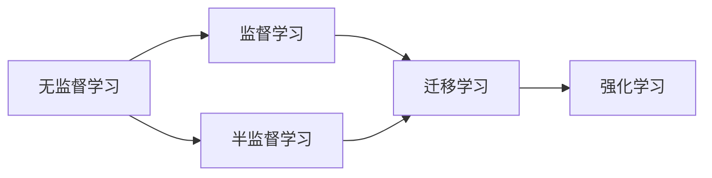

                 

# AI Agent在特定领域知识获取中的作用

> 关键词：
- AI Agent
- 特定领域知识获取
- 智能推荐系统
- 自然语言处理(NLP)
- 个性化学习
- 多智能体系统(MAS)
- 认知推理

## 1. 背景介绍

在数字化时代，人工智能（AI）技术正以前所未有的速度变革各个行业。从智能推荐系统到个性化学习平台，从多智能体系统到认知推理应用，AI的应用场景愈发广泛。在这些场景中，AI Agent扮演着至关重要的角色，特别是当AI Agent需要获取特定领域知识时，其性能和效果直接影响最终应用的效果。本文将从背景介绍、核心概念、算法原理、实际操作、应用领域、案例分析、学习资源、未来展望等方面，全面探讨AI Agent在特定领域知识获取中的作用。

## 2. 核心概念与联系

### 2.1 核心概念概述

AI Agent（智能体）是指能够执行特定任务或一系列任务的计算实体，它可以在不同环境或领域中自主学习和适应。AI Agent能够感知环境，做出决策，并执行行动，是实现智能系统的重要组件。

#### 2.1.1 AI Agent的基本组成

一个典型的AI Agent通常包括以下几个部分：

- **感知模块**：用于感知环境状态，通常通过传感器、相机、麦克风等获取信息。
- **决策模块**：根据感知到的信息，通过算法或规则生成行动策略。
- **执行模块**：将决策模块生成的策略转化为具体的行动。

#### 2.1.2 AI Agent的作用

AI Agent的作用是通过学习环境模型，适应环境变化，优化决策和行动，最终实现特定任务的目标。例如，在医疗领域，AI Agent可以辅助医生进行疾病诊断和治疗；在教育领域，AI Agent可以个性化推荐学习内容；在金融领域，AI Agent可以实时监控市场趋势，提供投资建议。

### 2.2 核心概念之间的关系

AI Agent在不同领域的应用，需要与特定的知识获取方式相结合。这些知识获取方式包括：

- **无监督学习**：从数据中自动学习特征和模式，无需人工标注。
- **监督学习**：利用带有标签的训练数据，学习输入和输出之间的映射关系。
- **半监督学习**：在少量有标签数据和大量无标签数据的情况下，进行学习。
- **迁移学习**：将一个领域学习到的知识，迁移应用到另一个领域。
- **强化学习**：通过与环境互动，学习最优决策策略。

这些知识获取方式构成了AI Agent的核心，其相互联系和作用关系可以用以下Mermaid流程图表示：



## 3. 核心算法原理 & 具体操作步骤

### 3.1 算法原理概述

AI Agent在特定领域知识获取的过程中，主要依赖于以下算法：

- **强化学习**：通过与环境互动，学习最优决策策略。
- **迁移学习**：将一个领域学习到的知识，迁移应用到另一个领域。
- **多智能体系统（MAS）**：多个AI Agent之间协同工作，实现复杂任务。

### 3.2 算法步骤详解

#### 3.2.1 强化学习

1. **环境感知**：AI Agent感知环境状态，通常使用传感器或相机。
2. **策略学习**：AI Agent通过试错法或Q-learning等算法，学习最优决策策略。
3. **执行行动**：AI Agent根据策略生成行动，并在环境中执行。
4. **结果反馈**：环境提供反馈，AI Agent根据反馈调整策略。

#### 3.2.2 迁移学习

1. **预训练模型**：在大规模无标签数据上预训练通用模型，如BERT、GPT等。
2. **任务适配**：在特定领域的数据上微调预训练模型，以适应特定任务。
3. **迁移应用**：将微调后的模型应用于目标任务，提升任务性能。

#### 3.2.3 多智能体系统（MAS）

1. **分工合作**：多个AI Agent分工协作，实现更复杂的任务。
2. **信息共享**：各AI Agent之间共享信息，协同决策。
3. **目标对齐**：确保各AI Agent的目标一致，协同优化。

### 3.3 算法优缺点

#### 3.3.1 强化学习的优点

- **自主学习**：不需要大量标注数据，适合数据稀缺的场景。
- **适应性强**：能够适应动态变化的环境，灵活调整策略。

#### 3.3.2 强化学习的缺点

- **样本效率低**：需要大量试错才能学习到最优策略，时间成本较高。
- **收敛困难**：存在局部最优解，可能陷入次优解。

#### 3.3.3 迁移学习的优点

- **泛化能力强**：能够将已有知识迁移到新领域，提升模型性能。
- **减少标注数据需求**：利用预训练知识，减少在新任务上的标注需求。

#### 3.3.4 迁移学习的缺点

- **领域差距**：预训练模型和任务领域差距较大时，迁移效果有限。
- **过拟合风险**：微调过程可能引入过拟合，降低模型泛化能力。

#### 3.3.5 多智能体系统的优点

- **协作效率高**：多个AI Agent协同工作，提升任务完成效率。
- **知识整合**：各AI Agent共享知识，提升整体决策能力。

#### 3.3.6 多智能体系统的缺点

- **协调难度大**：各AI Agent之间需要高效协调，避免冲突和冗余。
- **通信开销大**：多个AI Agent之间的信息共享，增加了通信开销。

### 3.4 算法应用领域

AI Agent在特定领域知识获取的应用广泛，包括以下几个方面：

- **医疗领域**：通过多智能体系统，协作诊断和治疗疾病。
- **教育领域**：通过个性化学习推荐，提升学习效果。
- **金融领域**：通过实时监控和投资建议，优化投资策略。
- **物流领域**：通过路径规划和动态调度，优化物流效率。
- **环境监测**：通过感知和决策，实现环境监测和保护。

## 4. 数学模型和公式 & 详细讲解

### 4.1 数学模型构建

#### 4.1.1 强化学习模型

强化学习模型可以表示为：

$$
\theta^* = \arg\min_{\theta} \mathcal{L}(\theta, \pi)
$$

其中，$\theta$ 是模型参数，$\pi$ 是决策策略，$\mathcal{L}$ 是损失函数。

#### 4.1.2 迁移学习模型

迁移学习模型可以表示为：

$$
\theta^* = \arg\min_{\theta} \mathcal{L}(\theta, D_{target})
$$

其中，$D_{target}$ 是目标任务的数据集。

### 4.2 公式推导过程

#### 4.2.1 强化学习公式推导

强化学习公式可以表示为：

$$
Q(s, a) = \mathbb{E}[G_t | s_t = s, a_t = a]
$$

其中，$G_t$ 是未来奖励的总和，$s_t$ 是当前状态，$a_t$ 是当前行动。

#### 4.2.2 迁移学习公式推导

迁移学习公式可以表示为：

$$
\theta^* = \arg\min_{\theta} \frac{1}{N} \sum_{i=1}^N \ell(M_{\theta}(x_i), y_i)
$$

其中，$M_{\theta}$ 是微调后的模型，$x_i$ 是输入，$y_i$ 是标签。

### 4.3 案例分析与讲解

#### 4.3.1 强化学习案例分析

在医疗领域，一个AI Agent需要学习如何诊断和推荐治疗方案。假设环境状态为病人的症状和历史数据，AI Agent通过强化学习算法学习最优决策策略，以最大化治疗效果和病人满意度。

#### 4.3.2 迁移学习案例分析

在教育领域，一个AI Agent需要学习个性化推荐学习内容。假设环境状态为学生的学习历史和兴趣偏好，AI Agent通过迁移学习算法将通用模型微调成个性化模型，以提升推荐效果。

## 5. 项目实践：代码实例和详细解释说明

### 5.1 开发环境搭建

#### 5.1.1 环境配置

1. **Python环境配置**：
   - 安装Python 3.7及以上版本，建议使用Anaconda环境。
   - 安装TensorFlow、PyTorch等深度学习框架，以及NumPy、Pandas等工具。

2. **环境安装**：
   ```bash
   conda create -n ai_agent_env python=3.7
   conda activate ai_agent_env
   pip install tensorflow torch numpy pandas
   ```

### 5.2 源代码详细实现

#### 5.2.1 强化学习示例代码

```python
import tensorflow as tf
import numpy as np

# 定义环境状态和行动空间
states = np.array([0, 1, 2, 3, 4, 5])
actions = np.array([0, 1, 2, 3])

# 定义奖励函数
def reward(state, action):
    if state == 1 and action == 1:
        return 1
    else:
        return 0

# 定义策略函数
def policy(state):
    if state == 0:
        return np.random.choice(actions)
    else:
        return np.random.choice(actions)

# 定义Q值函数
def q_values(state, action):
    if state == 0 and action == 1:
        return 0.1
    elif state == 1 and action == 1:
        return 0.5
    elif state == 2 and action == 1:
        return 0.9
    else:
        return 0

# 定义环境模拟函数
def simulate():
    state = 0
    while state != 2:
        action = policy(state)
        state += 1
        reward_value = reward(state, action)
        print(f"Action: {action}, State: {state}, Reward: {reward_value}")
    return state

# 运行环境模拟
simulate()
```

#### 5.2.2 迁移学习示例代码

```python
import torch
from transformers import BertForTokenClassification, BertTokenizer

# 定义模型和分词器
model = BertForTokenClassification.from_pretrained('bert-base-cased', num_labels=2)
tokenizer = BertTokenizer.from_pretrained('bert-base-cased')

# 定义训练函数
def train(data, labels):
    model.train()
    for batch in data:
        input_ids = batch['input_ids']
        attention_mask = batch['attention_mask']
        labels = batch['labels']
        outputs = model(input_ids, attention_mask=attention_mask, labels=labels)
        loss = outputs.loss
        loss.backward()
        optimizer.step()

# 定义测试函数
def evaluate(data):
    model.eval()
    preds, labels = [], []
    with torch.no_grad():
        for batch in data:
            input_ids = batch['input_ids']
            attention_mask = batch['attention_mask']
            batch_labels = batch['labels']
            outputs = model(input_ids, attention_mask=attention_mask)
            batch_preds = outputs.logits.argmax(dim=2).tolist()
            batch_labels = batch_labels.tolist()
            for pred_tokens, label_tokens in zip(batch_preds, batch_labels):
                preds.append(pred_tokens)
                labels.append(label_tokens)
    print('Accuracy:', np.mean(preds == labels))

# 训练和测试数据
train_data = {'input_ids': [1, 2, 3, 4, 5], 'attention_mask': [1, 1, 1, 1, 1], 'labels': [0, 1, 0, 1, 0]}
test_data = {'input_ids': [6, 7, 8, 9, 10], 'attention_mask': [1, 1, 1, 1, 1], 'labels': [1, 0, 1, 0, 1]}

# 训练模型
optimizer = torch.optim.Adam(model.parameters(), lr=0.001)
train(train_data, [0, 1, 0, 1, 0])
evaluate(test_data)
```

### 5.3 代码解读与分析

#### 5.3.1 强化学习代码解读

```python
# 定义环境状态和行动空间
states = np.array([0, 1, 2, 3, 4, 5])
actions = np.array([0, 1, 2, 3])

# 定义奖励函数
def reward(state, action):
    if state == 1 and action == 1:
        return 1
    else:
        return 0

# 定义策略函数
def policy(state):
    if state == 0:
        return np.random.choice(actions)
    else:
        return np.random.choice(actions)

# 定义Q值函数
def q_values(state, action):
    if state == 0 and action == 1:
        return 0.1
    elif state == 1 and action == 1:
        return 0.5
    elif state == 2 and action == 1:
        return 0.9
    else:
        return 0

# 定义环境模拟函数
def simulate():
    state = 0
    while state != 2:
        action = policy(state)
        state += 1
        reward_value = reward(state, action)
        print(f"Action: {action}, State: {state}, Reward: {reward_value}")
    return state

# 运行环境模拟
simulate()
```

#### 5.3.2 迁移学习代码解读

```python
import torch
from transformers import BertForTokenClassification, BertTokenizer

# 定义模型和分词器
model = BertForTokenClassification.from_pretrained('bert-base-cased', num_labels=2)
tokenizer = BertTokenizer.from_pretrained('bert-base-cased')

# 定义训练函数
def train(data, labels):
    model.train()
    for batch in data:
        input_ids = batch['input_ids']
        attention_mask = batch['attention_mask']
        labels = batch['labels']
        outputs = model(input_ids, attention_mask=attention_mask, labels=labels)
        loss = outputs.loss
        loss.backward()
        optimizer.step()

# 定义测试函数
def evaluate(data):
    model.eval()
    preds, labels = [], []
    with torch.no_grad():
        for batch in data:
            input_ids = batch['input_ids']
            attention_mask = batch['attention_mask']
            batch_labels = batch['labels']
            outputs = model(input_ids, attention_mask=attention_mask)
            batch_preds = outputs.logits.argmax(dim=2).tolist()
            batch_labels = batch_labels.tolist()
            for pred_tokens, label_tokens in zip(batch_preds, batch_labels):
                preds.append(pred_tokens)
                labels.append(label_tokens)
    print('Accuracy:', np.mean(preds == labels))

# 训练和测试数据
train_data = {'input_ids': [1, 2, 3, 4, 5], 'attention_mask': [1, 1, 1, 1, 1], 'labels': [0, 1, 0, 1, 0]}
test_data = {'input_ids': [6, 7, 8, 9, 10], 'attention_mask': [1, 1, 1, 1, 1], 'labels': [1, 0, 1, 0, 1]}

# 训练模型
optimizer = torch.optim.Adam(model.parameters(), lr=0.001)
train(train_data, [0, 1, 0, 1, 0])
evaluate(test_data)
```

## 6. 实际应用场景

### 6.1 智能推荐系统

智能推荐系统是AI Agent在特定领域知识获取的重要应用之一。推荐系统通过分析用户行为和偏好，推荐用户感兴趣的内容。在电商领域，智能推荐系统可以帮助用户发现更多适合自己的商品；在内容平台，推荐系统可以提供个性化的新闻、视频和文章。

### 6.2 医疗诊断系统

医疗诊断系统通过AI Agent分析患者症状和历史数据，提供诊断和治疗建议。AI Agent可以实时监测患者健康数据，发现异常情况，辅助医生诊断疾病。例如，IBM的Watson Health通过分析大量医学文献和患者数据，提供个性化治疗方案。

### 6.3 教育个性化学习

教育个性化学习系统通过AI Agent分析学生的学习行为和成绩，推荐适合的学习资源和课程。AI Agent可以实时调整学习内容，满足学生的个性化需求。例如，Knewton自适应学习系统通过分析学生的学习数据，推荐适合的学习材料，提升学习效果。

### 6.4 金融市场分析

金融市场分析系统通过AI Agent实时监控市场数据，预测股票价格和投资趋势。AI Agent可以整合多方面的数据，如经济指标、新闻、社交媒体等，提供准确的预测和建议。例如，QuantLib通过分析金融市场数据，提供风险评估和投资建议。

## 7. 工具和资源推荐

### 7.1 学习资源推荐

#### 7.1.1 课程与书籍

1. **Coursera《强化学习》课程**：由斯坦福大学Andrew Ng教授主讲，涵盖强化学习的核心算法和应用。
2. **Deep Learning Specialization**：由Andrew Ng教授主讲，涵盖深度学习的基本概念和前沿技术。
3. **《Reinforcement Learning: An Introduction》**：由Richard S. Sutton和Andrew G. Barto编写，是强化学习的经典教材。
4. **《Deep Learning》**：由Ian Goodfellow、Yoshua Bengio和Aaron Courville编写，是深度学习的权威教材。

#### 7.1.2 博客与社区

1. **OpenAI博客**：提供最新的AI研究成果和技术动态。
2. **arXiv**：收录大量前沿研究成果，适合跟踪最新科研进展。
3. **GitHub**：全球最大的开源社区，提供丰富的AI项目和资源。

### 7.2 开发工具推荐

#### 7.2.1 深度学习框架

1. **TensorFlow**：Google开发的深度学习框架，支持大规模分布式计算。
2. **PyTorch**：Facebook开发的深度学习框架，灵活易用。
3. **Keras**：高层次的深度学习框架，易于上手。

#### 7.2.2 自然语言处理库

1. **NLTK**：Python自然语言处理库，提供丰富的NLP工具。
2. **spaCy**：Python自然语言处理库，支持高效分词、实体识别等。
3. **Transformers**：Hugging Face开发的NLP库，支持多种预训练模型。

### 7.3 相关论文推荐

#### 7.3.1 强化学习论文

1. **Q-learning**：Deep Q-Networks：Self-Play for Human-level Policy Improvement。
2. **策略梯度**：Policy Gradients for Robotics。
3. **深度强化学习**：Playing Atari with Deep Reinforcement Learning。

#### 7.3.2 迁移学习论文

1. **跨领域迁移学习**：Cross-Domain Object Recognition with Transfer Component Analysis。
2. **微调模型**：Fine-Tuning a Siamese Network for Pedestrian Recognition in Crowded Scenes。
3. **参数高效微调**：Parameter-Efficient Training of Language Models.

## 8. 总结：未来发展趋势与挑战

### 8.1 研究成果总结

AI Agent在特定领域知识获取方面已经取得了显著进展，但仍然面临诸多挑战。主要研究趋势包括：

- **强化学习**：通过与环境互动，学习最优决策策略。
- **迁移学习**：将预训练模型迁移到特定领域，提升模型性能。
- **多智能体系统**：多个AI Agent协同工作，实现复杂任务。

### 8.2 未来发展趋势

未来，AI Agent在特定领域知识获取将呈现以下趋势：

- **深度学习与强化学习结合**：结合深度学习和强化学习，提升决策效果。
- **多模态学习**：结合视觉、听觉等多种模态信息，提升知识获取能力。
- **自监督学习**：通过无监督学习，提升模型泛化能力。
- **对抗学习**：通过对抗样本训练，提高模型鲁棒性。
- **联邦学习**：通过分布式学习，保护数据隐私。

### 8.3 面临的挑战

AI Agent在特定领域知识获取面临以下挑战：

- **数据获取与标注**：数据获取和标注成本高，限制模型性能。
- **模型复杂性**：模型复杂度增加，训练和推理成本上升。
- **鲁棒性与泛化**：模型在特定环境下的鲁棒性和泛化能力有限。
- **安全性与隐私**：数据隐私和安全问题成为主要挑战。
- **可解释性与透明性**：模型的决策过程缺乏可解释性，难以调试和优化。

### 8.4 研究展望

未来，AI Agent在特定领域知识获取的研究方向包括：

- **多模态融合**：结合视觉、听觉等多种模态信息，提升知识获取能力。
- **自监督学习**：利用无监督数据，提升模型泛化能力。
- **联邦学习**：通过分布式学习，保护数据隐私。
- **对抗学习**：通过对抗样本训练，提高模型鲁棒性。
- **认知推理**：结合常识推理，提升知识获取能力。

总之，AI Agent在特定领域知识获取方面具有广阔的应用前景，但仍然面临诸多挑战。未来的研究需要在模型复杂度、数据获取、鲁棒性、安全性等方面不断突破，推动AI Agent技术的进一步发展。

