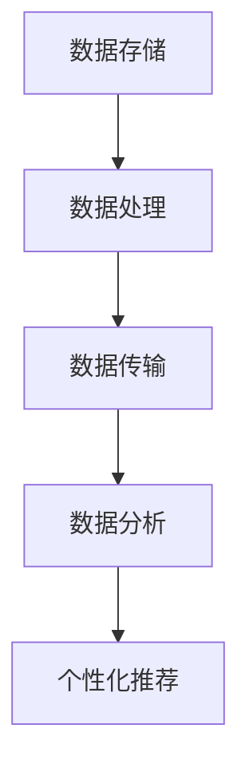
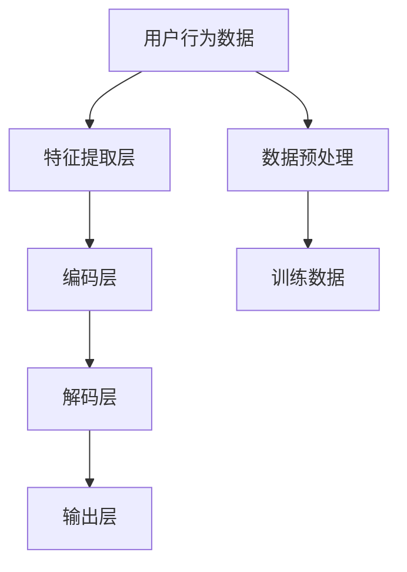

                 

## 1. 背景介绍

### 1.1 问题由来

在互联网时代，数据驱动的个性化推荐系统（Personalization推荐系统）已经成为了电商、新闻、社交网络等领域的标配。传统基于协同过滤和特征工程的方法，存在数据稀疏、算法复杂、维护成本高等问题，而推荐引擎的数据基建（Data Management Platform）则以大规模数据存储、计算和处理能力为核心，通过深入挖掘用户行为数据，为用户个性化推荐商品、新闻、视频等，提升用户体验和运营效率。

AI DMP（Artificial Intelligence Data Management Platform）作为DMP的升级版，融合了人工智能技术，能够更好地理解用户行为数据，提供更精准、高效、安全的个性化推荐服务。AI DMP从数据获取、数据清洗、数据分析、个性化推荐等环节，均采用了AI技术进行优化，极大地提升了推荐系统的性能和效果。

### 1.2 问题核心关键点

AI DMP的核心技术包括数据收集与清洗、深度特征提取、推荐模型训练和优化、用户行为理解等。其中，数据基建是AI DMP的基础，涉及到数据的存储、处理、传输和分析，是大规模推荐系统建设的关键。

AI DMP的数据基建需要支持大规模、实时、高并发的数据处理，同时要具备高效的存储、检索和计算能力，以满足个性化推荐的需求。在数据基建过程中，还需要处理数据隐私和安全问题，确保用户数据的使用合规和用户隐私保护。

### 1.3 问题研究意义

研究AI DMP的数据基建，对于推动个性化推荐系统的智能化、高效化和安全性有着重要的意义：

1. **提高推荐系统的性能和效果**：AI DMP通过深度学习和特征工程技术，对用户行为数据进行全面分析，可以生成更加精准和个性化的推荐结果。
2. **降低推荐系统的成本和复杂度**：AI DMP的数据基建技术，可以自动化地处理数据收集、清洗和分析工作，减轻人工维护的负担。
3. **增强推荐系统的安全性和隐私保护**：AI DMP在数据基建过程中，可以采用数据加密、匿名化等技术手段，保障用户数据的安全和隐私。
4. **提升推荐系统的扩展性和灵活性**：AI DMP的数据基建技术，可以灵活地支持多种推荐算法和模型，满足不同场景下的个性化推荐需求。

## 2. 核心概念与联系

### 2.1 核心概念概述

AI DMP的数据基建涉及到数据存储、数据处理、数据传输和数据分析等多个方面。以下是其中几个核心概念的介绍：

- **数据存储**：用于存储和管理推荐系统所需的海量数据，包括用户行为数据、商品数据、广告数据等。
- **数据处理**：对原始数据进行清洗、转换、聚合等操作，生成可供推荐模型使用的特征数据。
- **数据传输**：在数据存储和计算节点之间进行数据的高效传输，以满足实时推荐的需求。
- **数据分析**：通过深度学习、机器学习等技术，对用户行为数据进行分析，生成个性化的推荐结果。
- **个性化推荐**：根据用户的历史行为数据和实时反馈，为用户推荐个性化的商品、新闻、视频等内容。

### 2.2 核心概念的联系

这些核心概念通过数据流的方式紧密联系在一起，形成一个完整的数据处理和分析流程。数据存储和数据处理是数据基建的基础，数据传输是数据流动的保障，数据分析是数据基建的最终目标，个性化推荐是数据基建的实际应用。

通过以下Mermaid流程图，我们可以更清晰地理解AI DMP数据基建的核心概念及其联系：



## 3. 核心算法原理 & 具体操作步骤

### 3.1 算法原理概述

AI DMP的数据基建技术，主要采用了数据分片、数据缓存、分布式计算、深度学习等技术手段，对大规模数据进行存储、处理和分析。这些技术的核心原理如下：

- **数据分片**：将大规模数据分割成多个小块，分别存储在不同的节点上，以提高数据处理的效率和可靠性。
- **数据缓存**：在数据处理过程中，使用缓存技术对高频访问的数据进行加速，减少I/O操作，提升系统性能。
- **分布式计算**：通过分布式计算框架（如Spark、Flink等），对大规模数据进行并行处理，提高计算效率和处理能力。
- **深度学习**：通过深度学习模型，对用户行为数据进行全面分析，提取高维度的特征，生成个性化的推荐结果。

### 3.2 算法步骤详解

AI DMP的数据基建过程主要包括以下几个步骤：

**Step 1: 数据收集与清洗**

1. 数据收集：通过API接口、爬虫、数据导入等方式，从网站、APP、用户行为日志等渠道收集数据。
2. 数据清洗：对收集到的数据进行去重、去噪、标准化等操作，去除冗余和错误数据。

**Step 2: 数据存储与分片**

1. 数据存储：使用分布式文件系统（如Hadoop、HDFS等），将清洗后的数据存储到多个节点上。
2. 数据分片：将数据按一定规则进行分片，确保数据均衡分布在各个节点上。

**Step 3: 数据处理与特征提取**

1. 数据处理：对存储的数据进行聚合、计算、转换等操作，生成可供推荐模型使用的特征数据。
2. 特征提取：使用深度学习模型，对用户行为数据进行特征提取，生成高维度的特征向量。

**Step 4: 数据传输与计算**

1. 数据传输：通过消息队列、缓存等方式，将处理好的数据传输到计算节点。
2. 分布式计算：使用分布式计算框架，对大规模数据进行并行计算，生成推荐结果。

**Step 5: 数据分析与推荐**

1. 数据分析：使用深度学习模型，对用户行为数据进行分析，生成个性化推荐结果。
2. 推荐服务：将推荐结果推送给用户，并提供后续行为跟踪和反馈收集功能。

### 3.3 算法优缺点

AI DMP的数据基建技术具有以下优点：

- **高效性**：通过分布式计算和数据缓存等技术手段，大大提高了数据处理的效率和实时性。
- **可靠性**：数据分片和冗余存储等技术手段，提高了系统的容错性和可靠性。
- **扩展性**：通过分布式计算和数据缓存等技术，系统能够灵活地扩展计算和存储能力。

然而，AI DMP的数据基建技术也存在一些缺点：

- **成本高**：大规模分布式计算和存储需要大量的硬件投入，维护成本较高。
- **复杂性高**：数据基建过程涉及多环节、多技术手段，需要高度专业的技术团队进行开发和维护。
- **数据隐私和安全问题**：需要采取数据加密、匿名化等措施，确保用户数据的安全和隐私保护。

### 3.4 算法应用领域

AI DMP的数据基建技术已经在电商、新闻、社交网络等多个领域得到了广泛应用，具体的场景如下：

- **电商推荐**：通过分析用户浏览、购买行为数据，生成个性化的商品推荐结果，提升用户购买转化率。
- **新闻推荐**：根据用户阅读、点击行为数据，为用户推荐感兴趣的新闻，提高用户阅读黏性。
- **社交推荐**：根据用户互动行为数据，推荐新朋友、新内容，提升用户互动频率。
- **视频推荐**：根据用户观看、点赞、评论行为数据，推荐相关视频内容，提高用户观看时长。

## 4. 数学模型和公式 & 详细讲解  
### 4.1 数学模型构建

AI DMP的数据基建涉及到的数学模型主要包括深度学习模型和分布式计算模型。以深度学习模型为例，其基本结构如图1所示：



其中，用户行为数据经过特征提取层，生成高维度的特征向量，然后通过编码层进行降维处理，生成低维度的隐藏表示。最后通过解码层生成推荐结果，输出层对推荐结果进行预测。

### 4.2 公式推导过程

以深度神经网络为例，其训练过程的公式推导如下：

设训练数据为 $(x_i, y_i)$，其中 $x_i$ 为输入，$y_i$ 为标签。深度神经网络由多个隐层组成，其前向传播过程为：

$$
h_1 = \sigma(W_1 x + b_1)
$$
$$
h_2 = \sigma(W_2 h_1 + b_2)
$$
$$
\cdots
$$
$$
h_L = \sigma(W_L h_{L-1} + b_L)
$$

其中 $\sigma$ 为激活函数，$W$ 和 $b$ 分别为权重矩阵和偏置向量。

深度神经网络的后向传播过程为：

$$
\frac{\partial L}{\partial W_L} = \frac{\partial L}{\partial h_L} \cdot \frac{\partial h_L}{\partial W_L}
$$
$$
\frac{\partial L}{\partial b_L} = \frac{\partial L}{\partial h_L}
$$
$$
\cdots
$$
$$
\frac{\partial L}{\partial W_1} = \frac{\partial L}{\partial h_1} \cdot \frac{\partial h_1}{\partial W_1}
$$

其中 $L$ 为损失函数，通常采用交叉熵损失函数。

### 4.3 案例分析与讲解

以电商推荐系统为例，其数据基建过程中，主要涉及到的数学模型和公式如下：

设用户行为数据为 $(x_i, y_i)$，其中 $x_i$ 为商品ID、浏览时长、点击次数等，$y_i$ 为是否购买。假设使用深度神经网络模型进行推荐，其基本结构如图2所示：


特征提取层将用户行为数据转换为高维度的特征向量，编码层将特征向量进行降维处理，生成低维度的隐藏表示。最后通过解码层生成推荐结果，输出层对推荐结果进行预测。

深度神经网络的训练过程如下：

1. 数据预处理：对用户行为数据进行去重、去噪、标准化等操作，生成可供推荐模型使用的特征数据。
2. 特征提取：使用深度学习模型，对用户行为数据进行特征提取，生成高维度的特征向量。
3. 模型训练：通过深度学习框架（如TensorFlow、PyTorch等），对模型进行训练，生成推荐结果。

## 5. 项目实践：代码实例和详细解释说明
### 5.1 开发环境搭建

在进行数据基建实践前，我们需要准备好开发环境。以下是使用Python进行PyTorch开发的环境配置流程：

1. 安装Anaconda：从官网下载并安装Anaconda，用于创建独立的Python环境。

2. 创建并激活虚拟环境：
```bash
conda create -n pytorch-env python=3.8 
conda activate pytorch-env
```

3. 安装PyTorch：根据CUDA版本，从官网获取对应的安装命令。例如：
```bash
conda install pytorch torchvision torchaudio cudatoolkit=11.1 -c pytorch -c conda-forge
```

4. 安装TensorFlow：从官网下载并安装TensorFlow，或使用Anaconda直接安装。例如：
```bash
conda install tensorflow==2.6
```

5. 安装TensorBoard：用于可视化模型训练过程，例如：
```bash
pip install tensorboard
```

6. 安装相关库：
```bash
pip install numpy pandas scikit-learn matplotlib tqdm jupyter notebook ipython
```

完成上述步骤后，即可在`pytorch-env`环境中开始数据基建实践。

### 5.2 源代码详细实现

下面以电商推荐系统为例，给出使用PyTorch进行数据基建的PyTorch代码实现。

首先，定义推荐模型和训练数据：

```python
from torch import nn
import torch

# 定义推荐模型
class Recommender(nn.Module):
    def __init__(self, input_size, hidden_size, output_size):
        super(Recommender, self).__init__()
        self.fc1 = nn.Linear(input_size, hidden_size)
        self.fc2 = nn.Linear(hidden_size, output_size)
    
    def forward(self, x):
        x = self.fc1(x)
        x = nn.functional.relu(x)
        x = self.fc2(x)
        return x

# 定义训练数据
train_dataset = ...
train_loader = ...
```

然后，定义损失函数和优化器：

```python
# 定义损失函数
criterion = nn.BCELoss()

# 定义优化器
optimizer = torch.optim.Adam(model.parameters(), lr=0.001)
```

接着，定义训练函数：

```python
def train_epoch(model, data_loader, optimizer, criterion):
    model.train()
    total_loss = 0
    for batch in data_loader:
        x, y = batch
        optimizer.zero_grad()
        output = model(x)
        loss = criterion(output, y)
        loss.backward()
        optimizer.step()
        total_loss += loss.item()
    return total_loss / len(data_loader)
```

最后，启动训练流程：

```python
epochs = 10
for epoch in range(epochs):
    loss = train_epoch(model, train_loader, optimizer, criterion)
    print(f'Epoch {epoch+1}, loss: {loss:.4f}')
```

以上就是使用PyTorch进行电商推荐系统数据基建的完整代码实现。可以看到，得益于PyTorch的灵活性，我们可以快速实现推荐模型的训练过程。

### 5.3 代码解读与分析

让我们再详细解读一下关键代码的实现细节：

**Recommender类**：
- `__init__`方法：初始化模型参数，包括输入层、隐藏层、输出层的线性变换和激活函数。
- `forward`方法：定义模型前向传播的过程，包括线性变换和激活函数。

**训练函数train_epoch**：
- 对数据进行迭代，在每个批次上前向传播计算损失，并反向传播更新模型参数。
- 使用Adam优化器更新模型参数，计算并返回该epoch的平均损失。

可以看到，PyTorch提供了丰富的深度学习框架和工具，能够方便地进行模型构建、训练和优化。开发者可以根据具体需求，灵活地调整模型结构和训练参数，快速实现数据基建的过程。

## 6. 实际应用场景

### 6.1 电商推荐

电商推荐是AI DMP数据基建的重要应用场景之一。电商平台通过分析用户浏览、购买行为数据，为用户推荐个性化商品，提高用户购买转化率。

在技术实现上，可以收集用户的历史浏览记录、购买记录、评价反馈等数据，构建电商推荐模型。将用户行为数据输入模型，通过深度学习算法生成推荐结果，并实时推送给用户。用户还可以反馈其购买结果，模型进一步优化推荐策略。

### 6.2 新闻推荐

新闻推荐是AI DMP数据基建在新闻领域的重要应用。新闻网站通过分析用户阅读、点击行为数据，为用户推荐感兴趣的新闻，提高用户阅读黏性。

在技术实现上，可以收集用户的历史阅读记录、点击记录、评价反馈等数据，构建新闻推荐模型。将用户行为数据输入模型，通过深度学习算法生成推荐结果，并实时推送给用户。用户还可以反馈其阅读结果，模型进一步优化推荐策略。

### 6.3 社交推荐

社交推荐是AI DMP数据基建在社交网络领域的重要应用。社交平台通过分析用户互动行为数据，推荐新朋友、新内容，提升用户互动频率。

在技术实现上，可以收集用户的历史互动记录、好友关系、评价反馈等数据，构建社交推荐模型。将用户行为数据输入模型，通过深度学习算法生成推荐结果，并实时推送给用户。用户还可以反馈其互动结果，模型进一步优化推荐策略。

### 6.4 视频推荐

视频推荐是AI DMP数据基建在视频领域的重要应用。视频平台通过分析用户观看、点赞、评论行为数据，推荐相关视频内容，提高用户观看时长。

在技术实现上，可以收集用户的观看记录、点赞记录、评论记录等数据，构建视频推荐模型。将用户行为数据输入模型，通过深度学习算法生成推荐结果，并实时推送给用户。用户还可以反馈其观看结果，模型进一步优化推荐策略。

## 7. 工具和资源推荐

### 7.1 学习资源推荐

为了帮助开发者系统掌握AI DMP的数据基建理论基础和实践技巧，这里推荐一些优质的学习资源：

1. 《深度学习》课程：斯坦福大学开设的深度学习课程，涵盖深度学习的基本概念、算法和应用。
2. 《TensorFlow实战》书籍：介绍TensorFlow的入门到进阶知识，涵盖深度学习模型构建、训练和优化等。
3. 《TensorBoard实战》书籍：介绍TensorBoard的高级应用，涵盖模型训练过程的可视化、调试和优化等。
4. PyTorch官方文档：PyTorch的官方文档，提供了丰富的API接口和样例代码，方便开发者进行模型构建和训练。
5. Kaggle竞赛：参加Kaggle的推荐系统竞赛，实践推荐算法的优化和调优，提升实战能力。

通过对这些资源的学习实践，相信你一定能够快速掌握AI DMP的数据基建精髓，并用于解决实际的推荐问题。

### 7.2 开发工具推荐

高效的开发离不开优秀的工具支持。以下是几款用于AI DMP数据基建开发的常用工具：

1. PyTorch：基于Python的开源深度学习框架，灵活性强，支持GPU计算，适合大规模深度学习模型的构建。
2. TensorFlow：由Google主导开发的开源深度学习框架，生产部署方便，支持分布式计算，适合工业级应用。
3. TensorBoard：TensorFlow配套的可视化工具，实时监测模型训练过程，方便调试和优化。
4. Weights & Biases：模型训练的实验跟踪工具，记录和可视化模型训练过程中的各项指标，方便对比和调优。
5. HuggingFace Transformers：自然语言处理工具库，集成了多个预训练语言模型，方便进行微调和优化。

合理利用这些工具，可以显著提升AI DMP数据基建的开发效率，加快创新迭代的步伐。

### 7.3 相关论文推荐

AI DMP的数据基建技术发展源于学界的持续研究。以下是几篇奠基性的相关论文，推荐阅读：

1. 《Deep Collaborative Filtering for Recommendation》：介绍深度学习在推荐系统中的应用，提出协同过滤和深度学习结合的推荐算法。
2. 《Scalable and Privacy-Preserving Recommendation Systems》：介绍大规模推荐系统的构建方法，包括数据存储、分布式计算和隐私保护等技术。
3. 《Neural Recommendation Systems》：介绍基于神经网络的推荐模型，包括深度神经网络、卷积神经网络、注意力机制等。
4. 《Matrix Factorization Techniques for Recommender Systems》：介绍矩阵分解等传统推荐算法，与深度学习推荐模型进行对比和结合。
5. 《Personalization in Practice: Recommendation Systems for Online Services》：介绍推荐系统在实际应用中的优化和调优方法，涵盖特征工程、模型选择和效果评估等。

这些论文代表了大数据推荐系统的研究脉络，为开发者提供了丰富的理论和技术支持。

除上述资源外，还有一些值得关注的前沿资源，帮助开发者紧跟数据基建技术的最新进展，例如：

1. arXiv论文预印本：人工智能领域最新研究成果的发布平台，包括大量尚未发表的前沿工作，学习前沿技术的必读资源。
2. 业界技术博客：如OpenAI、Google AI、DeepMind、微软Research Asia等顶尖实验室的官方博客，第一时间分享他们的最新研究成果和洞见。
3. 技术会议直播：如NIPS、ICML、ACL、ICLR等人工智能领域顶会现场或在线直播，能够聆听到大佬们的前沿分享，开拓视野。
4. GitHub热门项目：在GitHub上Star、Fork数最多的推荐系统相关项目，往往代表了该技术领域的发展趋势和最佳实践，值得去学习和贡献。
5. 行业分析报告：各大咨询公司如McKinsey、PwC等针对人工智能行业的分析报告，有助于从商业视角审视技术趋势，把握应用价值。

总之，对于AI DMP数据基建的深入学习，需要开发者保持开放的心态和持续学习的意愿。多关注前沿资讯，多动手实践，多思考总结，必将收获满满的成长收益。

## 8. 总结：未来发展趋势与挑战

### 8.1 总结

本文对AI DMP的数据基建方法进行了全面系统的介绍。首先阐述了AI DMP数据基建的背景和重要性，明确了数据基建在个性化推荐系统中的核心地位。其次，从原理到实践，详细讲解了数据基建的关键技术和操作步骤，给出了数据基建任务开发的完整代码实例。同时，本文还广泛探讨了数据基建技术在电商、新闻、社交网络等多个领域的应用前景，展示了数据基建技术的巨大潜力。

通过本文的系统梳理，可以看到，AI DMP的数据基建技术已经广泛应用于推荐系统建设，显著提升了个性化推荐系统的性能和效果。未来，伴随深度学习、分布式计算和数据管理等技术的不断进步，AI DMP数据基建必将在更多领域得到应用，为智能化推荐系统的发展注入新的动力。

### 8.2 未来发展趋势

展望未来，AI DMP的数据基建技术将呈现以下几个发展趋势：

1. **技术融合**：数据基建技术与自然语言处理、计算机视觉、增强现实等技术将深度融合，提供更为全面、智能的推荐服务。
2. **实时计算**：通过流式计算、实时数据处理等技术手段，数据基建系统将实现对用户行为数据的实时分析和推荐。
3. **联邦学习**：通过联邦学习等技术手段，数据基建系统将实现跨机构数据共享，提升推荐系统的协同和协同效果。
4. **跨域推荐**：通过跨域推荐算法，数据基建系统将实现跨平台、跨系统的推荐服务，提升用户跨平台的用户体验。
5. **隐私保护**：通过差分隐私、同态加密等技术手段，数据基建系统将实现对用户隐私的保护，保障用户数据的安全。

以上趋势凸显了AI DMP数据基建技术的广阔前景。这些方向的探索发展，必将进一步提升推荐系统的性能和效果，推动智能化推荐系统迈向新的高度。

### 8.3 面临的挑战

尽管AI DMP的数据基建技术已经取得了显著成就，但在迈向更加智能化、高效化、安全化的推荐系统过程中，仍面临诸多挑战：

1. **数据隐私和安全问题**：数据基建技术涉及大量用户数据，需要采取数据加密、匿名化等措施，确保用户数据的安全和隐私保护。
2. **数据存储和计算问题**：大规模推荐系统需要存储和处理海量数据，需要高成本的硬件设备和高技术的维护团队。
3. **数据实时性和一致性问题**：实时推荐系统需要快速处理实时数据，保障数据的实时性和一致性。
4. **跨平台和跨系统问题**：跨平台和跨系统的推荐服务需要解决数据格式、接口等方面的问题，实现无缝衔接。
5. **模型复杂度和可解释性问题**：深度学习模型往往复杂度高，难以解释模型的内部工作机制和决策逻辑。

这些挑战需要通过不断的技术创新和实践优化，逐步解决和克服，才能更好地推动AI DMP数据基建技术的发展。

### 8.4 研究展望

面对AI DMP数据基建所面临的种种挑战，未来的研究需要在以下几个方面寻求新的突破：

1. **跨领域数据融合**：探索跨领域数据的深度融合，提升推荐系统的协同和协同效果，实现跨领域推荐。
2. **实时推荐技术**：研究实时数据处理和流式计算技术，提升推荐系统的实时性和一致性，实现实时推荐。
3. **联邦学习应用**：探索联邦学习技术在推荐系统中的应用，实现跨机构数据共享，提升推荐系统的协同效果。
4. **隐私保护技术**：研究差分隐私、同态加密等隐私保护技术，保障用户数据的安全和隐私保护。
5. **模型优化和解释**：研究深度学习模型优化和可解释技术，提升推荐系统的性能和可解释性。

这些研究方向的探索，必将引领AI DMP数据基建技术迈向更高的台阶，为智能化推荐系统的发展提供更多的技术支持和创新思路。

## 9. 附录：常见问题与解答

**Q1：AI DMP的数据基建与传统推荐系统有何不同？**

A: AI DMP的数据基建技术主要采用深度学习和大规模分布式计算等技术手段，对用户行为数据进行全面分析和处理，生成更加精准和个性化的推荐结果。与传统推荐系统相比，AI DMP的数据基建技术能够处理海量数据，并实现实时推荐，推荐结果更加精准和个性化。

**Q2：AI DMP的数据基建过程中，如何处理数据隐私和安全问题？**

A: AI DMP的数据基建过程中，可以采用差分隐私、同态加密等技术手段，保护用户数据的隐私和安全。差分隐私通过对数据进行扰动，确保单个用户的数据无法被单独识别；同态加密通过对数据进行加密处理，保障数据在计算过程中的安全性。

**Q3：AI DMP的数据基建过程中，如何处理数据实时性和一致性问题？**

A: AI DMP的数据基建过程中，可以采用流式计算和分布式计算等技术手段，处理海量数据并实现实时推荐。流式计算能够实时处理和分析数据，保障数据的实时性和一致性；分布式计算能够实现对海量数据的并行处理，提升系统的计算效率。

**Q4：AI DMP的数据基建过程中，如何处理跨平台和跨系统问题？**

A: AI DMP的数据基建过程中，可以采用数据格式转换和接口统一等技术手段，实现跨平台

