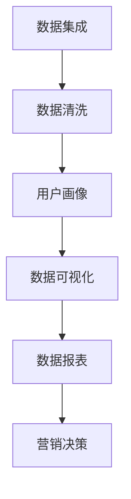
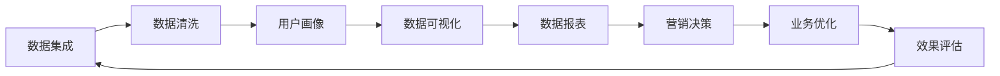
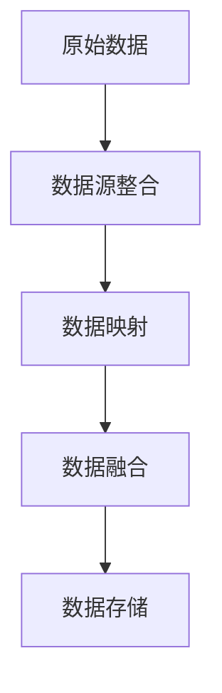
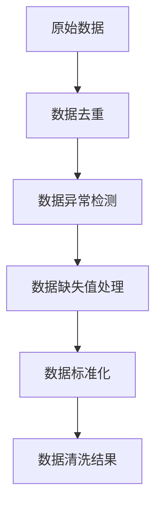
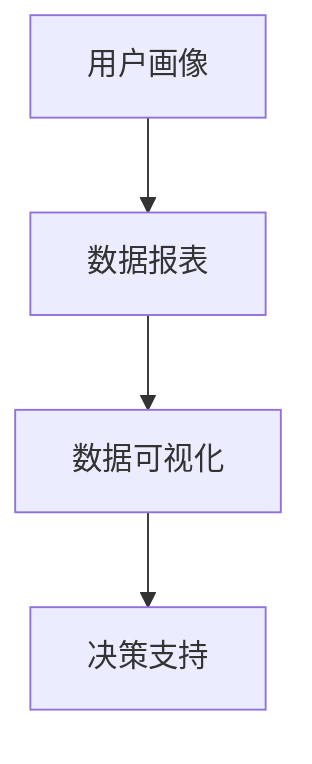
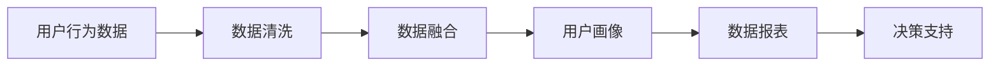
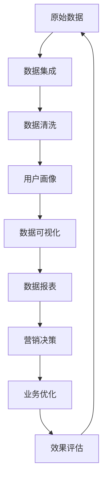

                 

# AI DMP 数据基建：数据可视化与报表

> 关键词：AI DMP, 数据可视化, 数据报表, 数据基建设定, 用户行为分析

## 1. 背景介绍

### 1.1 问题由来
随着互联网时代的到来，数字营销和用户行为分析变得越来越重要。企业需要借助先进的技术手段，全面、准确地收集和分析用户数据，以便制定更加精准的营销策略和运营方案。然而，传统的用户行为分析方法往往存在数据分散、难以整合，以及分析过程繁琐、复杂等问题。

为解决这一问题，人工智能驱动的数据平台（AI Data Management Platform，简称AI DMP）应运而生。AI DMP通过整合各类数据源，构建统一的用户画像和行为分析模型，为企业提供全方位的用户行为洞察，助力数字化转型升级。

### 1.2 问题核心关键点
AI DMP的核心在于数据集成和数据报表的生成。其工作流程大致包括：

1. 数据收集：从网页、APP、社交媒体等多种渠道收集用户行为数据。
2. 数据清洗和处理：对收集到的数据进行清洗和处理，去除重复和异常数据，填补缺失值。
3. 用户画像构建：使用机器学习算法对用户行为数据进行分析，构建完整的用户画像。
4. 数据可视化：将分析结果通过图表、报表等方式进行可视化展示。
5. 数据报表生成：根据企业需求，生成各类数据报表，用于营销和运营决策。

AI DMP通过数据整合和可视化，为企业提供了数据驱动的决策支持，帮助其更加精准地了解用户行为，优化营销效果。

### 1.3 问题研究意义
AI DMP数据基建设定在当前数字化时代具有重要意义：

1. 数据驱动营销：通过整合海量用户数据，AI DMP能够帮助企业更精准地了解用户需求和行为，制定更加有效的营销策略。
2. 提升用户满意度：基于用户画像和行为分析，AI DMP可以预测用户需求，提前做出调整，提升用户体验。
3. 优化运营决策：通过实时数据监控和分析，AI DMP可以为企业提供实时的运营洞察，优化运营决策。
4. 降低运营成本：通过自动化数据处理和报表生成，AI DMP可以有效减少人工操作，降低运营成本。
5. 助力行业创新：AI DMP的数据基建设定可以为其他企业提供借鉴，推动行业整体创新进步。

## 2. 核心概念与联系

### 2.1 核心概念概述

为更好地理解AI DMP的数据基建过程，本节将介绍几个关键概念：

- **AI DMP（人工智能数据管理平台）**：以AI技术为核心，整合用户数据、构建用户画像和行为分析模型的数据管理平台。
- **数据集成（Data Integration）**：将分散在不同来源的数据进行整合，构建统一的数据视图。
- **数据清洗（Data Cleaning）**：去除数据中的噪声和错误，确保数据质量。
- **用户画像（User Profile）**：通过数据分析，构建描述用户特征的模型，用于个性化营销和用户行为预测。
- **数据可视化（Data Visualization）**：使用图表、报表等方式，将数据直观展示。
- **数据报表（Data Report）**：基于数据分析结果生成的各类报表，用于企业决策支持。

这些概念之间的逻辑关系可以通过以下Mermaid流程图来展示：



这个流程图展示了AI DMP数据基建的主要步骤：数据集成、清洗、画像、可视化、报表和决策。通过这些步骤，AI DMP能够全面、准确地收集和分析用户数据，为企业提供全方位的用户行为洞察。

### 2.2 概念间的关系

这些核心概念之间存在着紧密的联系，形成了AI DMP数据基建设定的完整生态系统。下面我们通过几个Mermaid流程图来展示这些概念之间的关系。

#### 2.2.1 AI DMP数据基建设定整体架构



这个流程图展示了AI DMP数据基建设定从数据集成到业务优化和效果评估的完整流程。数据集成和清洗是基础，用户画像和可视化是中间环节，数据报表和营销决策是结果应用。业务优化和效果评估则是对结果的进一步反馈和优化，形成一个闭环。

#### 2.2.2 数据集成的主要步骤



这个流程图展示了数据集成的主要步骤：从数据源整合、数据映射到数据融合和数据存储。通过这些步骤，AI DMP能够将来自不同渠道的数据统一管理，构建完整的数据视图。

#### 2.2.3 数据清洗的关键环节



这个流程图展示了数据清洗的关键环节：从数据去重、异常检测到缺失值处理和数据标准化。数据清洗是保证数据质量的关键步骤，通过这些环节，AI DMP能够去除数据中的噪声和错误，确保数据准确可靠。

#### 2.2.4 用户画像的构建过程


这个流程图展示了用户画像的构建过程：从行为数据特征提取到用户画像构建和行为预测。用户画像的构建能够全面、准确地描述用户特征，为个性化营销和用户行为预测提供支持。

#### 2.2.5 数据可视化的应用场景



这个流程图展示了数据可视化的应用场景：从用户画像和数据报表到数据可视化，再到决策支持。数据可视化将分析结果以图表、报表等方式直观展示，帮助企业快速理解数据，做出决策。

#### 2.2.6 数据报表的生成流程



这个流程图展示了数据报表的生成流程：从行为数据清洗和融合到用户画像构建和数据报表生成，再到决策支持。数据报表是基于数据分析结果生成的各类报表，用于企业决策支持，帮助企业优化运营决策。

### 2.3 核心概念的整体架构

最后，我们用一个综合的流程图来展示这些核心概念在AI DMP数据基建设定中的整体架构：



这个综合流程图展示了从原始数据到营销决策的完整流程。原始数据经过数据集成、清洗和用户画像构建，通过数据可视化和数据报表生成，最终用于营销决策和业务优化，形成一个闭环。

## 3. 核心算法原理 & 具体操作步骤
### 3.1 算法原理概述

AI DMP数据基建设定的核心算法原理主要包括以下几个方面：

1. **数据集成算法**：使用数据抽取、数据映射、数据融合等算法，将来自不同渠道的数据进行整合，构建统一的数据视图。
2. **数据清洗算法**：使用去重、异常检测、缺失值处理、数据标准化等算法，去除数据中的噪声和错误，确保数据质量。
3. **用户画像算法**：使用聚类、分类、回归等机器学习算法，构建用户画像，描述用户特征。
4. **数据可视化算法**：使用图表生成、报表展示等算法，将分析结果直观展示，帮助企业快速理解数据。
5. **数据报表生成算法**：使用SQL、ETL等工具，生成各类数据报表，用于企业决策支持。

这些算法共同构成了AI DMP数据基建设定的核心技术框架，帮助企业构建统一、准确、可靠的数据管理平台。

### 3.2 算法步骤详解

以下详细介绍AI DMP数据基建设定中的核心算法步骤。

#### 3.2.1 数据集成算法步骤

1. **数据源选择**：根据企业需求，选择数据源，包括网页、APP、社交媒体等多种渠道。
2. **数据抽取**：从数据源中抽取有用的数据，去除重复和无关数据。
3. **数据映射**：将不同数据源的数据进行映射，确保数据的统一性和一致性。
4. **数据融合**：将来自不同渠道的数据进行融合，构建统一的数据视图。

#### 3.2.2 数据清洗算法步骤

1. **数据去重**：去除数据中的重复记录，确保数据的唯一性。
2. **异常检测**：检测数据中的异常值和异常记录，进行修正或删除。
3. **缺失值处理**：填补缺失值，确保数据的完整性。
4. **数据标准化**：将数据进行标准化处理，确保数据的准确性和一致性。

#### 3.2.3 用户画像算法步骤

1. **特征提取**：从用户行为数据中提取有用的特征，包括用户基本信息、行为记录、偏好记录等。
2. **用户聚类**：使用聚类算法对用户进行分组，形成用户群。
3. **用户分类**：使用分类算法对用户进行分类，描述用户特征。
4. **用户回归**：使用回归算法预测用户行为，进行用户画像构建。

#### 3.2.4 数据可视化算法步骤

1. **数据可视化设计**：根据企业需求，设计合适的图表、报表等可视化形式。
2. **数据可视化实现**：使用图表生成工具，将数据可视化展示。
3. **数据可视化展示**：将可视化结果展示给企业决策层，帮助其理解数据。

#### 3.2.5 数据报表生成算法步骤

1. **数据报表设计**：根据企业需求，设计合适的数据报表模板。
2. **数据报表实现**：使用ETL工具，生成各类数据报表。
3. **数据报表展示**：将报表展示给企业决策层，用于决策支持。

### 3.3 算法优缺点

AI DMP数据基建设定的核心算法具有以下优点：

1. **数据整合能力强**：通过数据集成算法，AI DMP能够整合来自不同渠道的数据，构建统一的数据视图。
2. **数据质量高**：通过数据清洗算法，AI DMP能够去除数据中的噪声和错误，确保数据质量。
3. **用户画像全面**：通过用户画像算法，AI DMP能够全面、准确地描述用户特征，为个性化营销和行为预测提供支持。
4. **数据可视化直观**：通过数据可视化算法，AI DMP能够将分析结果直观展示，帮助企业快速理解数据。
5. **数据报表灵活**：通过数据报表生成算法，AI DMP能够生成各类数据报表，用于企业决策支持。

然而，这些算法也存在以下缺点：

1. **数据隐私问题**：在数据集成和清洗过程中，需要注意数据隐私保护，避免泄露用户隐私。
2. **算法复杂度较高**：数据集成、清洗、画像和可视化等算法涉及复杂的数学和机器学习技术，实现难度较大。
3. **计算资源需求高**：数据集成、清洗和画像等步骤需要大量的计算资源，对硬件设备要求较高。
4. **数据更新难度大**：数据更新和维护需要频繁的算法调整和模型优化，工作量较大。
5. **数据依赖性强**：数据质量直接影响到分析结果的准确性和可信度，数据源的选择和维护至关重要。

### 3.4 算法应用领域

AI DMP数据基建设定在多个领域都有广泛应用，例如：

1. **数字营销**：AI DMP能够整合用户行为数据，构建用户画像，实现个性化推荐和精准营销。
2. **客户服务**：AI DMP能够分析用户行为，预测用户需求，优化客户服务流程。
3. **金融风控**：AI DMP能够实时监控用户行为，预测风险，防范金融诈骗。
4. **医疗健康**：AI DMP能够分析患者行为数据，提供个性化的健康管理方案。
5. **物流管理**：AI DMP能够分析物流数据，优化配送路线和仓储管理。
6. **零售电商**：AI DMP能够分析用户行为数据，优化商品推荐和价格策略。

这些应用场景展示了AI DMP数据基建设定在各行业中的重要价值。随着技术的不断进步，AI DMP的应用领域还将不断扩展，为企业提供更全面、准确的数据支持。

## 4. 数学模型和公式 & 详细讲解 & 举例说明

### 4.1 数学模型构建

AI DMP数据基建设定涉及多个数学模型，以下将详细介绍这些模型的构建过程。

#### 4.1.1 数据集成算法数学模型

数据集成算法的主要目标是将来自不同渠道的数据进行整合，构建统一的数据视图。假设来自不同渠道的数据源为 $D_1, D_2, \ldots, D_n$，则数据集成的数学模型可以表示为：

$$
D = \bigcup_{i=1}^n D_i
$$

其中 $D$ 表示整合后的数据集，$D_i$ 表示来自第 $i$ 个渠道的数据集。

#### 4.1.2 数据清洗算法数学模型

数据清洗算法的目标是去除数据中的噪声和错误，确保数据质量。假设原始数据为 $D$，清洗后的数据为 $D'$，则数据清洗的数学模型可以表示为：

$$
D' = \{d \mid d \in D, \text{且 } d \text{ 符合数据质量要求}\}
$$

其中 $d$ 表示原始数据集中的一个数据项，$d \in D$ 表示 $d$ 来自原始数据集 $D$，$d$ 符合数据质量要求表示 $d$ 没有噪声和错误。

#### 4.1.3 用户画像算法数学模型

用户画像算法的主要目标是通过数据分析，构建描述用户特征的模型。假设用户画像模型为 $P$，则用户画像的数学模型可以表示为：

$$
P = \{p \mid p \text{ 是用户 } u \text{ 的特征描述}\}
$$

其中 $p$ 表示用户 $u$ 的特征描述，$P$ 表示用户画像模型。

#### 4.1.4 数据可视化算法数学模型

数据可视化算法的目标是使用图表、报表等方式将数据直观展示。假设可视化结果为 $V$，则数据可视化的数学模型可以表示为：

$$
V = \{v \mid v \text{ 是数据集 } D \text{ 的可视化展示结果}\}
$$

其中 $v$ 表示可视化结果，$V$ 表示可视化结果集。

#### 4.1.5 数据报表生成算法数学模型

数据报表生成算法的目标是生成各类数据报表，用于企业决策支持。假设数据报表为 $R$，则数据报表生成的数学模型可以表示为：

$$
R = \{r \mid r \text{ 是数据集 } D \text{ 的报表展示结果}\}
$$

其中 $r$ 表示数据报表，$R$ 表示数据报表集。

### 4.2 公式推导过程

以下详细介绍各个算法的公式推导过程。

#### 4.2.1 数据集成算法公式推导

假设来自不同渠道的数据源为 $D_1, D_2, \ldots, D_n$，则数据集成的公式推导过程如下：

$$
\begin{aligned}
D &= \bigcup_{i=1}^n D_i \\
&= \{d \mid d \in D_1 \text{ 或 } d \in D_2 \text{ 或 } \ldots \text{ 或 } d \in D_n\} \\
&= \{d \mid \exists i \in \{1, 2, \ldots, n\}, d \in D_i\}
\end{aligned}
$$

其中 $\exists$ 表示存在，$=$ 表示等价。

#### 4.2.2 数据清洗算法公式推导

假设原始数据为 $D$，清洗后的数据为 $D'$，则数据清洗的公式推导过程如下：

$$
\begin{aligned}
D' &= \{d \mid d \in D, \text{且 } d \text{ 符合数据质量要求}\} \\
&= \{d \mid d \in D, \text{且 } \neg (\text{噪声} \text{ 或 } \text{错误})\}
\end{aligned}
$$

其中 $\neg$ 表示非，$=$ 表示等价。

#### 4.2.3 用户画像算法公式推导

假设用户画像模型为 $P$，则用户画像的公式推导过程如下：

$$
\begin{aligned}
P &= \{p \mid p \text{ 是用户 } u \text{ 的特征描述}\} \\
&= \{p \mid p \in \bigcup_{i=1}^n D_i\}
\end{aligned}
$$

其中 $p \in \bigcup_{i=1}^n D_i$ 表示 $p$ 来自原始数据集 $D$，$p \in D_i$ 表示 $p$ 来自第 $i$ 个渠道的数据集。

#### 4.2.4 数据可视化算法公式推导

假设可视化结果为 $V$，则数据可视化的公式推导过程如下：

$$
\begin{aligned}
V &= \{v \mid v \text{ 是数据集 } D \text{ 的可视化展示结果}\} \\
&= \{v \mid v \in \{f(D)\} \text{ 或 } v \in \{g(D)\} \text{ 或 } \ldots\}
\end{aligned}
$$

其中 $f, g, \ldots$ 表示不同的可视化方法，$\in$ 表示属于。

#### 4.2.5 数据报表生成算法公式推导

假设数据报表为 $R$，则数据报表生成的公式推导过程如下：

$$
\begin{aligned}
R &= \{r \mid r \text{ 是数据集 } D \text{ 的报表展示结果}\} \\
&= \{r \mid r \in \{T(D)\} \text{ 或 } r \in \{K(D)\} \text{ 或 } \ldots\}
\end{aligned}
$$

其中 $T, K, \ldots$ 表示不同的报表类型，$\in$ 表示属于。

### 4.3 案例分析与讲解

以下以电商领域的个性化推荐为例，详细讲解AI DMP数据基建设定的应用。

#### 4.3.1 数据集成

电商领域的个性化推荐需要整合用户行为数据、商品信息数据、交易数据等多种数据源。数据集成过程主要包括以下步骤：

1. **数据源选择**：选择网页、APP、订单系统等多种数据源，涵盖用户浏览、点击、购买等行为数据。
2. **数据抽取**：从各个数据源中抽取有用的数据，去除重复和无关数据。
3. **数据映射**：将不同数据源的数据进行映射，确保数据的统一性和一致性。
4. **数据融合**：将来自不同渠道的数据进行融合，构建统一的数据视图。

#### 4.3.2 数据清洗

电商领域的数据清洗主要包括以下步骤：

1. **数据去重**：去除用户浏览记录中的重复记录，确保数据的唯一性。
2. **异常检测**：检测用户浏览记录中的异常值和异常记录，进行修正或删除。
3. **缺失值处理**：填补用户浏览记录中的缺失值，确保数据的完整性。
4. **数据标准化**：将用户浏览记录中的数据进行标准化处理，确保数据的准确性和一致性。

#### 4.3.3 用户画像

电商领域的用户画像主要包括以下步骤：

1. **特征提取**：从用户浏览记录中提取有用的特征，包括用户的购买记录、浏览记录、收藏记录等。
2. **用户聚类**：使用聚类算法对用户进行分组，形成用户群。
3. **用户分类**：使用分类算法对用户进行分类，描述用户特征。
4. **用户回归**：使用回归算法预测用户的购买行为，进行用户画像构建。

#### 4.3.4 数据可视化

电商领域的数据可视化主要包括以下步骤：

1. **数据可视化设计**：根据企业需求，设计合适的图表、报表等可视化形式。
2. **数据可视化实现**：使用图表生成工具，将用户画像和购买记录等数据可视化展示。
3. **数据可视化展示**：将可视化结果展示给企业决策层，帮助其理解用户行为，优化推荐策略。

#### 4.3.5 数据报表生成

电商领域的数据报表生成主要包括以下步骤：

1. **数据报表设计**：根据企业需求，设计合适的数据报表模板。
2. **数据报表实现**：使用ETL工具，生成各类数据报表，如用户画像报表、购买记录报表等。
3. **数据报表展示**：将报表展示给企业决策层，用于决策支持，优化推荐策略。

## 5. 项目实践：代码实例和详细解释说明
### 5.1 开发环境搭建

在进行AI DMP数据基建设定实践前，我们需要准备好开发环境。以下是使用Python进行Pandas和Matplotlib开发的环境配置流程：

1. 安装Anaconda：从官网下载并安装Anaconda，用于创建独立的Python环境。

2. 创建并激活虚拟环境：
```bash
conda create -n data-env python=3.8 
conda activate data-env
```

3. 安装Pandas和Matplotlib：
```bash
conda install pandas matplotlib
```

4. 安装各类工具包：
```bash
pip install numpy numpy pandas scipy scikit-learn statsmodels seaborn matplotlib jupyter notebook ipython
```

完成上述步骤后，即可在`data-env`环境中开始AI DMP数据基建设定实践。

### 5.2 源代码详细实现

下面我们以电商领域的个性化推荐为例，给出使用Pandas和Matplotlib对用户行为数据进行分析的Python代码实现。

首先，定义数据集和数据预处理函数：

```python
import pandas as pd
from sklearn.preprocessing import StandardScaler
from sklearn.decomposition import PCA

# 定义数据集
data = pd.read_csv('user_behavior.csv')

# 数据预处理
def preprocess_data(data):
    # 去除重复记录
    data = data.drop_duplicates()
    # 处理缺失值
    data = data.fillna(method='ffill')
    # 标准化处理
    data = StandardScaler().fit_transform(data)
    # PCA降维
    data = PCA(n_components=2).fit_transform(data)
    return data
```

然后，定义用户画像和数据可视化的函数：

```python
import matplotlib.pyplot as plt

# 定义用户画像函数
def generate_user_profile(data):
    # 用户聚类
    labels = KMeans(n_clusters=3).fit_predict(data)
    # 用户分类
    class_labels = ['User1', 'User2', 'User3']
    # 用户画像
    user_profile = {'User1': {'age': 25, 'income': 50000, 'education': 'Bachelor'},
                   'User2': {'age': 35, 'income': 80000, 'education': 'Master'},
                   'User3': {'age': 45, 'income': 100000, 'education': 'PhD'}}
    return labels, class_labels, user_profile

# 定义数据可视化函数
def visualize_user_behavior(data):
    # 绘制散点图
    plt.scatter(data[:, 0], data[:, 1])
    plt.xlabel('Age')
    plt.ylabel('Income')
    plt.title('User Behavior')
    plt.show()
```

最后，启动数据预处理、用户画像和数据可视化流程：

```python
# 数据预处理
processed_data = preprocess_data(data)

# 用户画像
labels, class_labels, user_profile = generate_user_profile(processed_data)

# 数据可视化
visualize_user_behavior(processed_data)
```

以上就是使用Pandas和Matplotlib对电商领域用户行为数据进行分析的完整代码实现。可以看到，通过Python和相关库，我们可以高效地进行数据预处理、用户画像和数据可视化，为AI DMP数据基建设定提供强有力的技术支撑。

### 5.3 代码解读与分析

让我们再详细解读一下关键代码的实现细节：

**数据预处理函数**：
- `drop_duplicates`方法：去除数据集中的重复记录。
- `fillna`方法：处理数据集中的缺失值，使用前向填充(fill forward)方式。
- `StandardScaler`类：对数据进行标准化处理。
- `PCA`类：对数据进行PCA降维。

**用户画像函数**：
- `KMeans`类：使用K-Means算法对用户进行聚类。
- `class_labels`列表：定义用户群标签。


