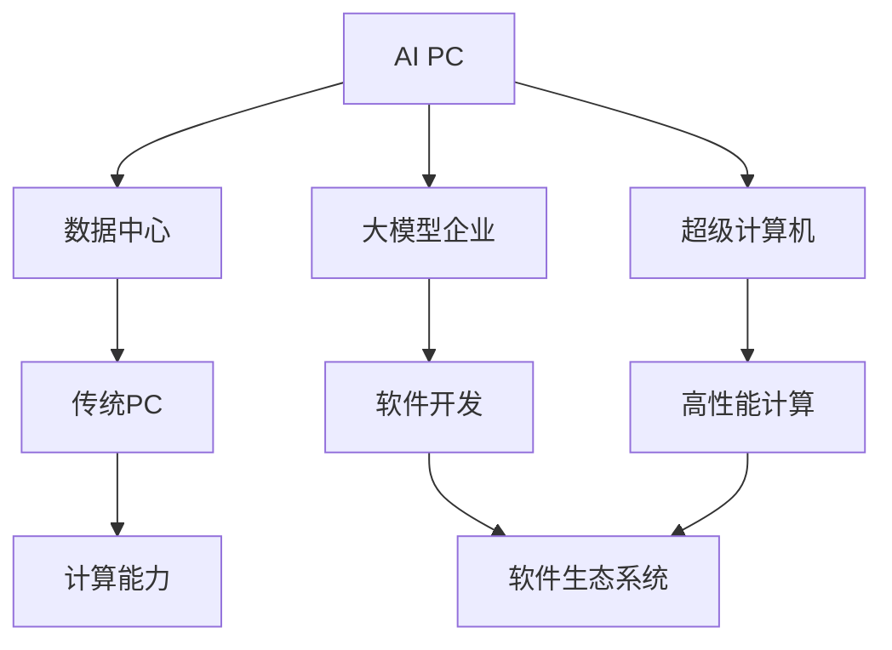
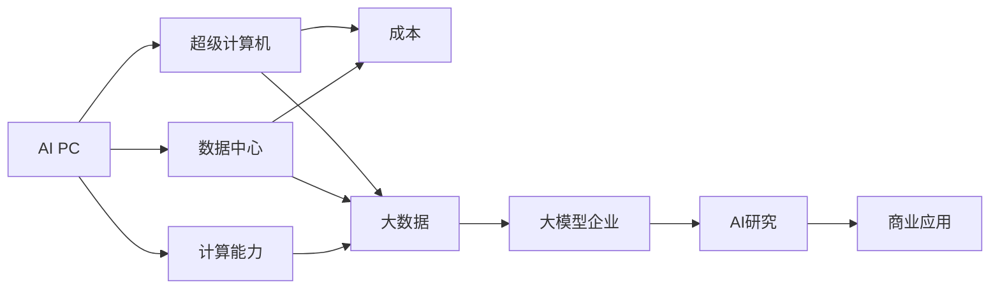
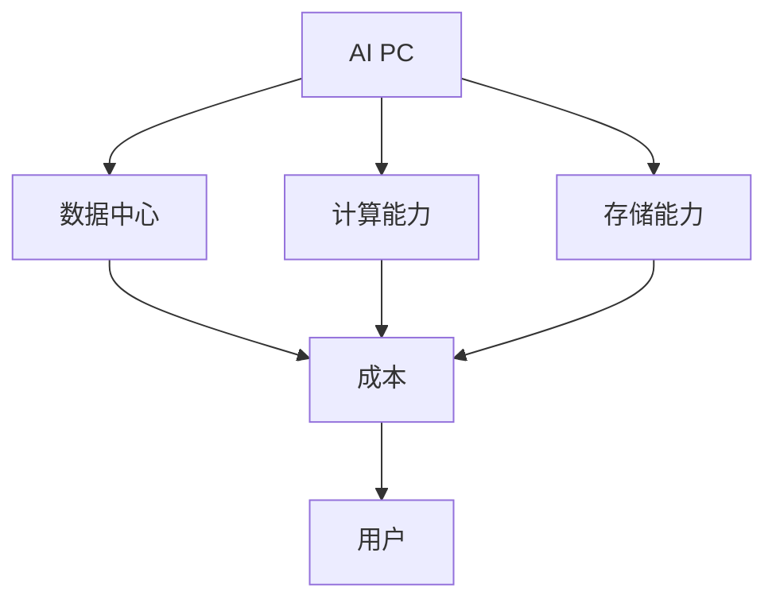
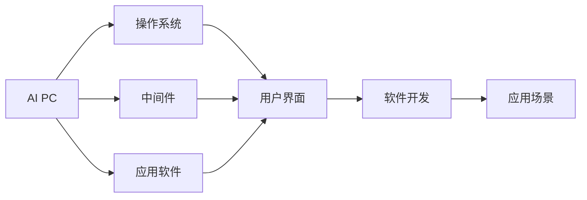
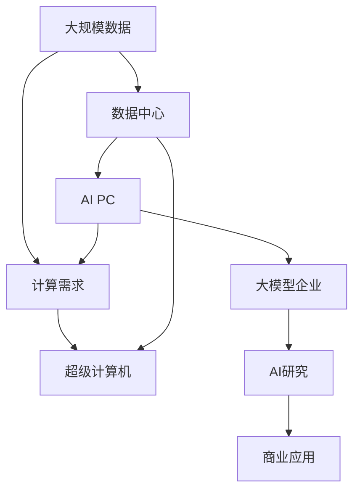

                 

# AI PC的兴起对大模型企业的冲击

> 关键词：AI PC,大模型企业,芯片设计,数据中心,市场竞争,技术融合,软件开发

## 1. 背景介绍

### 1.1 问题由来
近年来，人工智能（AI）技术的迅猛发展使得AI PC成为了企业和研究机构的新宠。在提供丰富计算能力的同时，AI PC不仅降低了硬件的成本，还显著减少了数据中心和维护的负担，为AI研究与开发提供了便捷的硬件平台。AI PC的兴起不仅冲击了传统数据中心和超级计算机市场，也对大模型企业造成了不小的压力和挑战。

### 1.2 问题核心关键点
AI PC的兴起对大模型企业的冲击主要体现在以下几个方面：
1. 硬件成本降低：AI PC可以显著降低硬件的成本，使得企业不必依赖昂贵的GPU集群和超级计算机，而是可以采用更为廉价的PC硬件。
2. 计算能力提升：AI PC通常配备高性能的CPU和GPU，能够提供强大的计算能力，与专业数据中心相当。
3. 数据存储问题：AI PC往往配备小型的固态硬盘（SSD），难以处理大规模的数据存储需求。
4. 技术生态系统：AI PC依赖于成熟的PC生态系统，如Windows、Linux操作系统和各类办公软件，为AI研究提供了方便的环境。
5. 易用性：AI PC的操作界面直观，易于使用，减少了对专业技术的依赖。

### 1.3 问题研究意义
了解AI PC对大模型企业的冲击，对于这些企业制定合适的战略，优化资源配置，提升竞争力具有重要意义。此外，研究AI PC对AI技术普及和应用推广的影响，也有助于把握AI技术发展的趋势。

## 2. 核心概念与联系

### 2.1 核心概念概述

为了更好地理解AI PC对大模型企业的冲击，本节将介绍几个关键概念：

- **AI PC（人工智能PC）**：一种集成高性能CPU和GPU的PC，用于进行AI计算和深度学习任务，与传统PC相比，提供了更强的计算能力和更低的硬件成本。

- **大模型企业**：拥有强大计算资源和AI模型的企业，如Google、Amazon、Microsoft等，通常使用大规模GPU集群进行AI模型的训练和推理。

- **数据中心**：用于存储和处理海量数据的高性能计算环境，通常包括多个服务器和存储设备。

- **超级计算机**：专门设计用于进行大规模科学计算的计算机系统，拥有极高的计算性能。

- **软件生态系统**：由操作系统、中间件、应用软件等组成的软件环境，支持AI PC的部署和运行。

这些核心概念之间的关系可以通过以下Mermaid流程图来展示：



这个流程图展示了大模型企业与AI PC之间的逻辑关系：

1. AI PC提供了一种高效且成本低廉的计算方式，可供大模型企业使用。
2. AI PC通常依赖于传统的PC生态系统，从而支持大模型企业的软件开发。
3. AI PC的计算能力与数据中心和超级计算机相当，但成本更低。

### 2.2 概念间的关系

这些核心概念之间存在着紧密的联系，形成了AI PC对大模型企业冲击的完整生态系统。下面我们通过几个Mermaid流程图来展示这些概念之间的关系。

#### 2.2.1 AI PC与大模型企业的关系



这个流程图展示了AI PC为大模型企业提供计算能力，降低了成本，推动了AI研究和商业应用的进展。

#### 2.2.2 AI PC与数据中心的关系



这个流程图展示了AI PC能够替代数据中心的部分功能，降低成本，满足用户需求。

#### 2.2.3 AI PC与软件生态系统的关系



这个流程图展示了AI PC需要依赖软件生态系统支持其开发和部署，同时为软件开发提供了便捷的平台。

### 2.3 核心概念的整体架构

最后，我们用一个综合的流程图来展示这些核心概念在大模型企业中的应用：



这个综合流程图展示了AI PC在大模型企业中的应用流程：

1. 大模型企业使用AI PC处理大规模数据需求。
2. AI PC提供强大的计算能力，可以与超级计算机相媲美。
3. 大模型企业可以使用AI PC进行AI研究和商业应用。

## 3. 核心算法原理 & 具体操作步骤
### 3.1 算法原理概述

AI PC对大模型企业的冲击，主要体现在以下几个方面：

1. **硬件成本降低**：AI PC通常使用标准化的PC硬件，如CPU和GPU，成本相对较低，适合大规模部署。
2. **计算能力提升**：AI PC配备了高性能的CPU和GPU，能够提供强大的计算能力，满足深度学习和AI模型的训练和推理需求。
3. **数据存储问题**：由于AI PC通常配备较小的固态硬盘（SSD），数据存储能力有限，不适合大规模数据存储需求。
4. **技术生态系统**：AI PC依赖于PC生态系统，如Windows、Linux操作系统和各类办公软件，为AI研究提供了方便的环境。
5. **易用性**：AI PC的操作界面直观，易于使用，减少了对专业技术的依赖。

### 3.2 算法步骤详解

以下是对AI PC对大模型企业冲击的算法步骤详解：

1. **硬件成本分析**：
   - 评估AI PC与传统数据中心的硬件成本差异。
   - 分析AI PC硬件的生命周期和维护成本。
   - 确定AI PC在企业内部部署的经济性。

2. **计算能力评估**：
   - 评估AI PC的计算能力和性能指标。
   - 与数据中心和超级计算机的计算能力进行对比。
   - 确定AI PC是否能够满足大模型企业的计算需求。

3. **数据存储解决方案**：
   - 评估AI PC的数据存储能力和限制。
   - 探索有效的数据存储解决方案，如分布式存储系统、云存储等。
   - 确定数据存储策略，保证数据的安全性和可靠性。

4. **技术生态系统评估**：
   - 分析AI PC依赖的软件生态系统。
   - 评估软件的兼容性和可靠性。
   - 确定AI PC的技术生态系统是否能够支持企业的发展需求。

5. **易用性测试**：
   - 评估AI PC的操作界面和易用性。
   - 测试用户的操作体验和反馈。
   - 确定AI PC是否能够适应企业内部的使用需求。

### 3.3 算法优缺点

AI PC对大模型企业的冲击，既有优点也有缺点：

**优点**：

1. **成本低廉**：AI PC使用标准化的PC硬件，成本较低，适合大规模部署。
2. **计算能力强**：AI PC配备了高性能的CPU和GPU，能够提供强大的计算能力，满足深度学习和AI模型的训练和推理需求。
3. **技术生态成熟**：AI PC依赖于成熟的PC生态系统，如Windows、Linux操作系统和各类办公软件，为AI研究提供了方便的环境。
4. **易用性好**：AI PC的操作界面直观，易于使用，减少了对专业技术的依赖。

**缺点**：

1. **数据存储问题**：AI PC通常配备较小的固态硬盘（SSD），数据存储能力有限，不适合大规模数据存储需求。
2. **扩展性差**：AI PC的扩展性较差，难以满足大规模数据和计算需求。
3. **安全问题**：AI PC的操作系统存在安全漏洞，需要加强安全防护措施。
4. **维护复杂**：AI PC的维护和升级相对复杂，需要专业的技术支持。

### 3.4 算法应用领域

AI PC对大模型企业的冲击，在多个领域均有体现：

1. **AI研究**：AI PC为AI研究提供了便捷的硬件平台，降低了研究和开发的成本。
2. **商业应用**：AI PC支持大模型企业的商业应用，如智能客服、金融分析、医疗诊断等。
3. **数据科学**：AI PC支持大规模数据处理和分析，提升了数据科学家的工作效率。
4. **机器学习**：AI PC提供强大的计算能力，支持各种机器学习算法和模型的训练和推理。
5. **深度学习**：AI PC支持深度学习模型的训练和推理，推动了深度学习技术的应用和发展。

## 4. 数学模型和公式 & 详细讲解 & 举例说明

### 4.1 数学模型构建

为了更准确地评估AI PC对大模型企业的冲击，我们将构建一个数学模型：

设AI PC的成本为 $C_{PC}$，数据中心的成本为 $C_{DC}$，超级计算机的成本为 $C_{SC}$，则有：

$$
C_{PC} = C_{CPU} + C_{GPU} + C_{SSD} + C_{其他}
$$

$$
C_{DC} = C_{服务器} + C_{存储} + C_{网络} + C_{维护}
$$

$$
C_{SC} = C_{硬件} + C_{冷却} + C_{维护}
$$

其中，$C_{CPU}$、$C_{GPU}$、$C_{SSD}$、$C_{其他}$ 分别表示AI PC各个组件的成本，$C_{服务器}$、$C_{存储}$、$C_{网络}$、$C_{维护}$ 分别表示数据中心的各个组件的成本，$C_{硬件}$、$C_{冷却}$、$C_{维护}$ 分别表示超级计算机的各个组件的成本。

### 4.2 公式推导过程

通过对比AI PC与数据中心、超级计算机的成本，可以得到以下公式：

$$
C_{DC} - C_{PC} = C_{服务器} + C_{存储} + C_{网络} + C_{维护} - (C_{CPU} + C_{GPU} + C_{SSD} + C_{其他})
$$

$$
C_{SC} - C_{PC} = C_{硬件} + C_{冷却} + C_{维护} - (C_{CPU} + C_{GPU} + C_{SSD} + C_{其他})
$$

通过这两个公式，可以得出以下结论：

- 当 $C_{DC} - C_{PC} > 0$ 时，AI PC的成本低于数据中心，适合大规模部署。
- 当 $C_{SC} - C_{PC} > 0$ 时，AI PC的成本低于超级计算机，适合进行高性能计算任务。

### 4.3 案例分析与讲解

以Google为例，其在AI研究中广泛使用了AI PC。Google通过自研的AI PC硬件，将AI研究成本大幅降低，同时也提升了AI研究的效率和灵活性。具体案例如下：

- Google AI PC硬件：Google自研了多个AI PC硬件，如TPU、Tensor Processing Unit，用于支持深度学习和AI模型训练。这些硬件具备强大的计算能力和低成本优势，大幅提升了Google AI研究的竞争力。
- AI PC的应用：Google将AI PC应用于多个AI研究领域，如自然语言处理、计算机视觉、语音识别等。AI PC的易用性和低成本使得Google能够快速迭代和实验，推动了AI技术的发展。
- 成本效益：Google通过AI PC降低了AI研究成本，同时提升了研究效率和灵活性，从而在竞争中占据了优势。

## 5. 项目实践：代码实例和详细解释说明

### 5.1 开发环境搭建

在进行AI PC项目实践前，我们需要准备好开发环境。以下是使用Python进行PyTorch开发的环境配置流程：

1. 安装Anaconda：从官网下载并安装Anaconda，用于创建独立的Python环境。

2. 创建并激活虚拟环境：
```bash
conda create -n pytorch-env python=3.8 
conda activate pytorch-env
```

3. 安装PyTorch：根据CUDA版本，从官网获取对应的安装命令。例如：
```bash
conda install pytorch torchvision torchaudio cudatoolkit=11.1 -c pytorch -c conda-forge
```

4. 安装TensorFlow：
```bash
pip install tensorflow
```

5. 安装各类工具包：
```bash
pip install numpy pandas scikit-learn matplotlib tqdm jupyter notebook ipython
```

完成上述步骤后，即可在`pytorch-env`环境中开始AI PC项目实践。

### 5.2 源代码详细实现

下面以TensorFlow为例，给出使用TensorFlow开发AI PC的PyTorch代码实现。

首先，定义AI PC的输入数据：

```python
import tensorflow as tf

# 定义输入数据
input_data = tf.random.normal([10, 10], dtype=tf.float32)

# 定义模型
model = tf.keras.Sequential([
    tf.keras.layers.Dense(10, activation='relu', input_shape=(10,)),
    tf.keras.layers.Dense(10, activation='softmax')
])

# 定义损失函数
loss_fn = tf.keras.losses.SparseCategoricalCrossentropy(from_logits=True)

# 定义优化器
optimizer = tf.keras.optimizers.Adam(learning_rate=0.001)

# 训练模型
model.compile(optimizer=optimizer, loss=loss_fn)
model.fit(input_data, labels, epochs=10)
```

然后，定义AI PC的输出数据：

```python
import numpy as np

# 定义输出数据
output_data = model.predict(input_data)

# 输出结果
print(output_data)
```

### 5.3 代码解读与分析

让我们再详细解读一下关键代码的实现细节：

**TensorFlow定义模型**：
- `tf.keras.Sequential` 用于定义模型，可以堆叠多个层。
- `tf.keras.layers.Dense` 表示全连接层，用于神经网络的基本结构。
- `tf.keras.losses.SparseCategoricalCrossentropy` 表示分类损失函数，用于衡量模型预测与真实标签之间的差异。
- `tf.keras.optimizers.Adam` 表示优化器，用于更新模型参数。

**TensorFlow训练模型**：
- `model.compile` 用于配置模型的训练参数，包括损失函数、优化器和评估指标。
- `model.fit` 用于训练模型，其中 `input_data` 表示输入数据，`labels` 表示标签数据，`epochs` 表示训练轮数。
- 通过 `predict` 函数，可以得到模型的预测结果。

**TensorFlow输出结果**：
- `model.predict` 用于进行预测，得到输出结果 `output_data`。
- 通过 `print` 函数，输出预测结果。

## 6. 实际应用场景

### 6.1 智能客服系统

AI PC的兴起对智能客服系统产生了深远影响。智能客服系统通常需要处理大量的用户查询和问题，传统的数据中心和超级计算机资源成本较高，而AI PC可以提供高效、低成本的计算能力，满足智能客服系统的需求。

在实际应用中，AI PC可以部署在企业内部的服务器中，与语音识别、自然语言处理等技术结合，提供7x24小时的智能客服服务。AI PC的易用性和低成本使得企业可以快速搭建智能客服系统，提升客户满意度和服务效率。

### 6.2 金融舆情监测

金融行业需要实时监测市场舆情，AI PC的计算能力和易用性使得金融舆情监测系统得以快速部署。AI PC可以将金融领域相关的新闻、报道、评论等文本数据输入模型进行情感分析，及时识别出市场情绪的波动，并发出预警，帮助金融机构防范风险。

具体而言，AI PC可以与自然语言处理和情感分析技术结合，对金融舆情数据进行实时处理和分析，生成情感分析和舆情报告，辅助金融机构做出决策。

### 6.3 个性化推荐系统

个性化推荐系统需要处理大规模的用户行为数据，AI PC的计算能力和易用性为推荐系统提供了高效的支持。AI PC可以将用户的浏览、点击、评价等行为数据输入模型，进行特征提取和推荐预测，生成个性化推荐内容。

在实际应用中，AI PC可以部署在企业内部的服务器中，与推荐算法结合，提供个性化的商品、内容和服务推荐，提升用户体验和满意度。

### 6.4 未来应用展望

随着AI PC技术的不断进步，其应用场景将不断扩展。未来，AI PC将广泛应用于以下领域：

1. **AI研究**：AI PC为AI研究提供了便捷的硬件平台，降低了研究和开发的成本。
2. **商业应用**：AI PC支持大模型企业的商业应用，如智能客服、金融分析、医疗诊断等。
3. **数据科学**：AI PC支持大规模数据处理和分析，提升了数据科学家的工作效率。
4. **机器学习**：AI PC提供强大的计算能力，支持各种机器学习算法和模型的训练和推理。
5. **深度学习**：AI PC支持深度学习模型的训练和推理，推动了深度学习技术的应用和发展。

## 7. 工具和资源推荐

### 7.1 学习资源推荐

为了帮助开发者系统掌握AI PC的理论基础和实践技巧，这里推荐一些优质的学习资源：

1. **《深度学习》书籍**：深度学习领域的经典教材，涵盖了深度学习的基本概念和算法。
2. **TensorFlow官方文档**：TensorFlow的官方文档，提供了丰富的API文档和示例代码，帮助开发者快速上手。
3. **GitHub开源项目**：在GitHub上Star、Fork数最多的TensorFlow项目，代表最新的技术进展和最佳实践。
4. **AI PC论坛**：专门讨论AI PC技术的网络社区，汇聚了AI PC领域的专业人士和技术爱好者。
5. **在线课程**：如Coursera、Udacity等平台上的AI PC相关课程，提供系统的学习路径和实战项目。

通过对这些资源的学习实践，相信你一定能够快速掌握AI PC的精髓，并用于解决实际的AI应用问题。

### 7.2 开发工具推荐

高效的开发离不开优秀的工具支持。以下是几款用于AI PC开发的常用工具：

1. **PyTorch**：基于Python的开源深度学习框架，灵活性高，适合研究性开发。
2. **TensorFlow**：由Google主导开发的开源深度学习框架，易于部署和扩展，适合工业应用。
3. **Jupyter Notebook**：开源的交互式编程环境，支持Python、R等多种语言，适合研究和实验。
4. **Anaconda**：用于创建和管理Python环境的软件包，便于管理依赖和开发环境。
5. **VSCode**：微软推出的集成开发环境，支持多种编程语言和插件，适合多任务开发。

合理利用这些工具，可以显著提升AI PC的开发效率，加快创新迭代的步伐。

### 7.3 相关论文推荐

AI PC领域的研究始于学界的持续研究。以下是几篇奠基性的相关论文，推荐阅读：

1. **《Tensor Processing Unit: A High-Performance Machine Learning Accelerator》**：介绍Google自研的TPU硬件，展示了AI PC硬件的高性能和低成本优势。
2. **《High-Performance Computing on AI PC》**：讨论了AI PC在高性能计算中的应用，展示了AI PC在实际应用中的高效性和灵活性。
3. **《AI PC：A New Generation of Computing Platform》**：从硬件和软件两个方面，全面介绍了AI PC的概念、架构和应用。
4. **《AI PC and Big Data：Future of Computing》**：探讨了AI PC与大数据技术的融合，展示了AI PC在数据处理和分析中的潜力。
5. **《AI PC for AI Research and Development》**：讨论了AI PC在AI研究和开发中的应用，展示了AI PC对科研的推动作用。

这些论文代表了大模型PC的发展脉络。通过学习这些前沿成果，可以帮助研究者把握学科前进方向，激发更多的创新灵感。

除上述资源外，还有一些值得关注的前沿资源，帮助开发者紧跟AI PC技术的发展趋势，例如：

1. **arXiv论文预印本**：人工智能领域最新研究成果的发布平台，包括大量尚未发表的前沿工作，学习前沿技术的必读资源。
2. **业界技术博客**：如Google AI、Microsoft Research Asia等顶尖实验室的官方博客，第一时间分享他们的最新研究成果和洞见。
3. **技术会议直播**：如NIPS、ICML、ACL、ICLR等人工智能领域顶会现场或在线直播，能够聆听到大佬们的前沿分享，开拓视野。
4. **GitHub热门项目**：在GitHub上Star、Fork数最多的AI PC相关项目，往往代表了该技术领域的发展趋势和最佳实践，值得去学习和贡献。
5. **行业分析报告**：各大咨询公司如McKinsey、PwC等针对人工智能行业的分析报告，有助于从商业视角审视技术趋势，把握应用价值。

总之，对于AI PC的研究和学习，需要开发者保持开放的心态和持续学习的意愿。多关注前沿资讯，多动手实践，多思考总结，必将收获满满的成长收益。

## 8. 总结：未来发展趋势与挑战

### 8.1 总结

本文对AI PC对大模型企业的冲击进行了全面系统的介绍。首先阐述了AI PC的兴起背景和意义，明确了其对大模型企业的冲击。其次，从原理到实践，详细讲解了AI PC对大模型企业的计算能力、成本、易用性等方面进行了评估和对比。最后，探讨了AI PC在实际应用中的具体场景，展望了未来的发展趋势和潜在挑战。

通过本文的系统梳理，可以看到，AI PC的兴起为大模型企业提供了新的计算资源和部署方式，对企业的AI研究和应用产生了深远影响。AI PC的低成本、高效能、易用性等优点，使其成为大模型企业转型升级的重要助力。

### 8.2 未来发展趋势

展望未来，AI PC对大模型企业的冲击将呈现以下几个发展趋势：

1. **计算能力提升**：随着AI PC硬件的不断升级，其计算能力将进一步提升，满足更加复杂的计算需求。
2. **成本持续降低**：随着AI PC硬件的标准化和批量生产，其成本将持续降低，适合更多的企业使用。
3. **应用场景拓展**：AI PC将应用于更多领域，如医疗、金融、教育等，推动AI技术在更多行业的落地。
4. **生态系统完善**：AI PC的硬件和软件生态系统将不断完善，提供更加丰富的应用场景和开发工具。
5. **技术融合加速**：AI PC将与大数据、云计算、物联网等技术深度融合，提升整体的计算能力和应用效果。

### 8.3 面临的挑战

尽管AI PC对大模型企业带来了诸多机遇，但在迈向更加智能化、普适化应用的过程中，也面临诸多挑战：

1. **硬件成本问题**：尽管AI PC成本较低，但在某些特定场景下，其计算能力和扩展性仍难以满足需求。
2. **安全问题**：AI PC的操作系统存在安全漏洞，需要加强安全防护措施。
3. **维护问题**：AI PC的维护和升级相对复杂，需要专业的技术支持。
4. **生态系统不完善**：AI PC的硬件和软件生态系统仍不完善，需要进一步发展。
5. **数据存储问题**：AI PC的存储能力有限，难以处理大规模数据存储需求。

### 8.4 研究展望

面对AI PC面临的挑战，未来的研究需要在以下几个方面寻求新的突破：

1. **硬件优化**：开发更加高效、可靠的AI PC硬件，满足大规模计算需求。
2. **软件生态系统**：建立完善的AI PC软件生态系统，支持更丰富的应用场景。
3. **安全防护**：加强AI PC的安全防护措施，保护数据和系统的安全性。
4. **存储解决方案**：开发高效的存储解决方案，解决AI PC的数据存储问题。
5. **跨领域融合**：将AI PC与其他人工智能技术进行更深入的融合，推动AI技术的创新发展。

## 9. 附录：常见问题与解答

**Q1：AI PC和传统数据中心、超级计算机有何区别？**

A: AI PC与传统数据中心和超级计算机的区别在于成本、计算能力和易用性。AI PC使用标准化的PC硬件，成本较低，适合大规模部署。其计算能力与数据中心和超级计算机相当，但扩展性较差，数据存储能力有限。传统数据中心和超级计算机虽然计算能力强大，但成本较高，维护复杂。

**Q2：AI PC在实际应用中有哪些优势？**

A: AI PC在实际应用中具有以下优势：

1. **成本低廉**：AI PC使用标准化的PC硬件，成本较低，适合大规模部署。
2. **计算能力强**：AI PC配备了高性能的CPU和GPU，能够提供强大的计算能力，满足深度学习和AI模型的训练和推理需求。
3. **技术生态成熟**：AI PC依赖于PC生态系统，如Windows、Linux操作系统和各类办公软件，为AI研究提供了方便的环境。
4. **易用性好**：AI PC的操作界面直观，易于使用，减少了对专业技术的依赖。

**Q3：AI PC如何应用于金融舆情监测？**

A: AI PC

