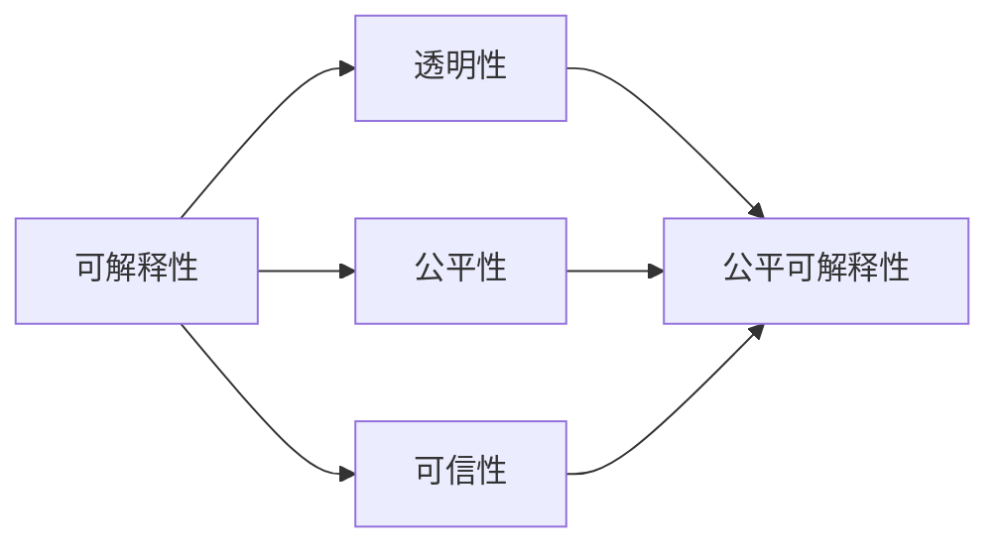
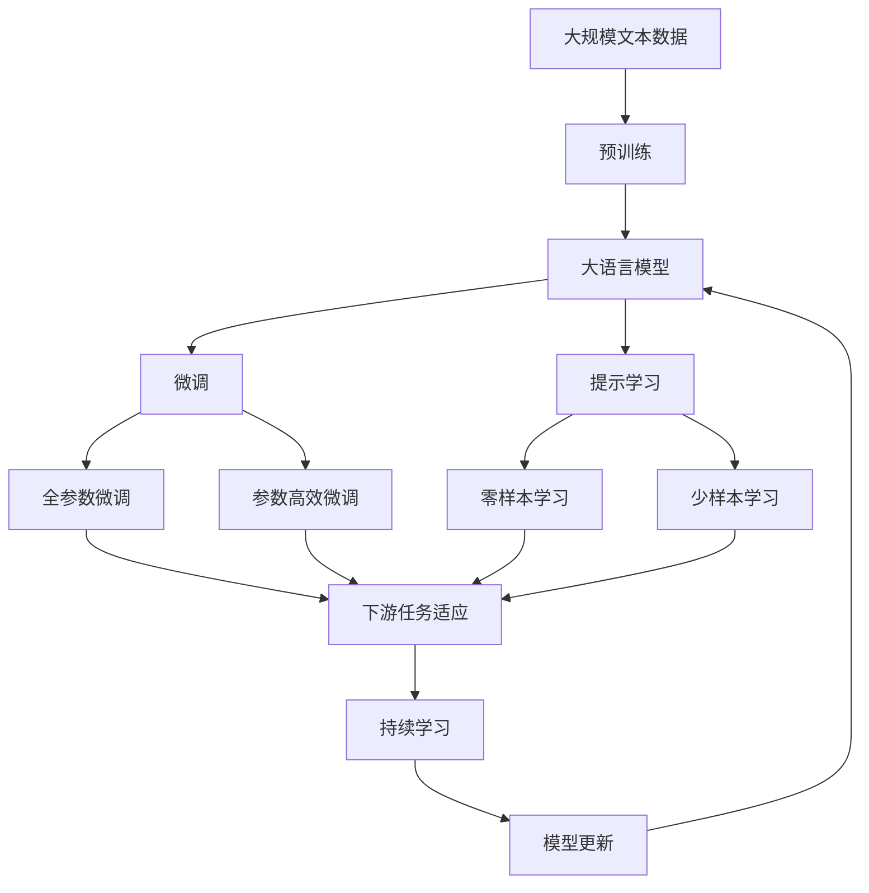

                 

# AI 可解释性：提升智能决策的透明度

> 关键词：可解释性, 智能决策, 透明度, 深度学习, 知识图谱, 公平性

## 1. 背景介绍

### 1.1 问题由来
随着人工智能技术的发展，深度学习等黑盒模型的应用日益广泛，已经在医疗、金融、司法等领域展现出显著的效果。然而，这类模型的决策过程通常是不可解释的，难以让人理解和信任。例如，患者可能无法理解AI辅助诊断的依据，金融交易者可能不了解AI推荐的依据，法官可能不清楚AI判决的逻辑。这些问题都严重阻碍了人工智能技术的落地应用。

为了解决这一困境，学术界和工业界逐渐认识到，提升AI的可解释性，使决策过程透明化，是人工智能技术走向成熟的重要前提。只有当AI能够向用户展示其决策过程和依据，才能获得广泛的应用和接受，推动技术在实际场景中的落地。

### 1.2 问题核心关键点
可解释性，即AI模型的决策过程能够以可理解的方式展示出来。通过可解释性，用户可以理解模型是如何得出决策的，从而提高其对AI系统的信任和接受度。

可解释性要求包括：
1. **决策依据可理解**：模型的输出应以语言、图形等方式，简洁明了地解释其决策依据。
2. **决策过程透明**：用户能够追踪模型的决策步骤，理解模型如何处理输入数据。
3. **公平性可信**：模型应保证决策的公平性，避免偏见和歧视。
4. **逻辑连贯**：模型应具有逻辑一致性，避免自相矛盾或逻辑漏洞。

可解释性不仅关乎技术层面，还涉及伦理、法律和社会层面，是构建安全、可靠、可信AI系统的基础。

### 1.3 问题研究意义
提升AI的可解释性，对于促进人工智能技术的广泛应用具有重要意义：

1. **增强信任**：透明决策过程使AI系统更具可信性，提高用户对AI的信任和依赖。
2. **提高效率**：明确决策依据，有助于发现和修正模型错误，提升AI系统的性能。
3. **促进合规**：清晰透明的决策过程有助于满足法律法规要求，降低法律风险。
4. **推动应用**：可解释性是用户接受和推广AI系统的关键，推动技术在更多场景中的落地。

## 2. 核心概念与联系

### 2.1 核心概念概述

为了更好地理解AI可解释性的原理，本节将介绍几个核心概念：

- **可解释性(Interpretability)**：AI模型的决策过程和依据以可理解的方式展示出来。
- **透明性(Transparency)**：AI模型的工作过程对用户公开，允许用户追踪决策过程。
- **公平性(Fairness)**：AI模型避免偏见和歧视，对不同用户和数据输入保持一致。
- **可信性(Trustworthiness)**：AI模型能够满足用户信任和依赖需求，避免错误的决策。
- **公平可解释性(Fairness-aware Interpretability)**：AI模型在保证公平性的同时，提高决策过程的可解释性。
- **可信赖解释(Trustworthy Explanation)**：AI模型的解释结果能够赢得用户信任，符合用户期待。

这些概念之间存在紧密联系，通过提高AI的可解释性，可以提升透明性和公平性，增强可信性。

### 2.2 概念间的关系

这些核心概念之间的逻辑关系可以通过以下Mermaid流程图来展示：



这个流程图展示了大语言模型微调过程中各个概念之间的逻辑关系：

1. 可解释性是透明性的基础，透明性要求模型的工作过程对用户公开，用户能够理解决策依据。
2. 公平性是可解释性的一个重要方面，要求模型避免偏见和歧视，保证决策过程的公正性。
3. 可信性是可解释性的终极目标，要求模型的决策结果满足用户预期，具有可信度。

这些概念共同构成了AI可解释性的完整生态系统，使得模型在满足用户需求的同时，也符合伦理和法律要求。

### 2.3 核心概念的整体架构

最后，我们用一个综合的流程图来展示这些核心概念在大语言模型微调过程中的整体架构：



这个综合流程图展示了大语言模型微调过程中各个核心概念之间的联系：

1. 大语言模型通过预训练获得基础能力。
2. 微调是对预训练模型进行任务特定的优化，可以分为全参数微调和参数高效微调。
3. 提示学习是一种不更新模型参数的方法，可以实现零样本和少样本学习。
4. 微调中的全参数微调和参数高效微调方法，在大规模文本数据上进行，以保证模型的公平性和透明性。
5. 持续学习技术，使模型能够不断学习新知识，保持性能。

通过这些流程图，我们可以更清晰地理解AI可解释性在大语言模型微调中的作用和影响。

## 3. 核心算法原理 & 具体操作步骤
### 3.1 算法原理概述

提高AI的可解释性，主要是通过增强模型的透明性和公平性来实现的。以下是提升可解释性的基本原理：

- **透明性增强**：使用可视化技术，如特征重要性排名、模型分解、局部解释等方法，展示模型决策过程。
- **公平性提升**：通过数据预处理、算法调整、结果后处理等手段，确保模型避免偏见和歧视。

具体的提升可解释性的方法包括：

1. **特征重要性排名**：计算模型对各个特征的贡献度，展示关键特征的影响。
2. **模型分解**：将模型分解为多个子模型，展示每个子模型的决策过程。
3. **局部解释**：针对具体实例，生成局部解释，展示模型如何处理输入数据。
4. **后处理**：通过调整模型输出，确保决策结果符合用户期待。

### 3.2 算法步骤详解

提升AI可解释性的具体步骤包括：

1. **收集和准备数据**：收集具有代表性的训练数据，并对数据进行标注和清洗。
2. **选择模型**：根据任务需求，选择适合的可解释性方法。
3. **特征重要性排名**：使用特征重要性排名算法，计算每个特征对模型输出的贡献度。
4. **模型分解**：将模型分解为多个子模型，展示各个子模型的决策过程。
5. **局部解释生成**：针对具体实例，生成局部解释，展示模型如何处理输入数据。
6. **后处理调整**：根据用户需求，调整模型输出，确保决策结果符合用户期待。

### 3.3 算法优缺点

提升AI可解释性的方法有以下优点：

1. **提高用户信任**：透明决策过程使AI系统更具可信性，提高用户对AI的信任和依赖。
2. **减少误判**：明确决策依据，有助于发现和修正模型错误，提升AI系统的性能。
3. **合规性提升**：清晰透明的决策过程有助于满足法律法规要求，降低法律风险。

同时，这些方法也存在一些局限性：

1. **计算复杂**：特征重要性排名、模型分解等方法，计算复杂度高，需要大量时间和资源。
2. **解释维度高**：生成的解释维度高，用户难以理解。
3. **结果可解释性差**：部分方法生成的解释结果不够直观，难以被用户接受。

### 3.4 算法应用领域

提升AI可解释性的方法，已经在多个领域得到应用，例如：

- **金融风险评估**：在金融风控模型中，通过特征重要性排名和局部解释，提升模型的透明性和可信性，帮助金融机构识别和规避风险。
- **医疗诊断**：在医学诊断模型中，通过局部解释和公平性检查，确保诊断结果的公正性和可信性，提升医疗服务的质量。
- **司法判决**：在司法判决模型中，通过模型分解和结果后处理，确保判决过程的公正性和透明性，提高司法公信力。
- **智能推荐**：在推荐系统中，通过特征重要性排名和后处理调整，确保推荐结果符合用户期待，提升推荐系统的满意度。
- **图像识别**：在图像识别模型中，通过可视化技术和公平性检查，确保模型决策的透明性和公正性，提升图像识别的准确性。

## 4. 数学模型和公式 & 详细讲解 & 举例说明

### 4.1 数学模型构建

为了更好地理解提升AI可解释性的数学原理，本节将使用数学语言对可解释性方法进行更加严格的刻画。

记AI模型为 $M_{\theta}:\mathcal{X} \rightarrow \mathcal{Y}$，其中 $\mathcal{X}$ 为输入空间，$\mathcal{Y}$ 为输出空间，$\theta$ 为模型参数。假设模型的训练数据集为 $D=\{(x_i,y_i)\}_{i=1}^N$，其中 $x_i \in \mathcal{X}, y_i \in \mathcal{Y}$。

定义模型的预测函数为 $M_{\theta}(x)$，对应的损失函数为 $\ell(M_{\theta}(x),y)$。假设模型的解释函数为 $I_{\theta}(x)$，展示模型如何处理输入数据。

提升AI可解释性的目标是最小化解释函数 $I_{\theta}(x)$ 的误差，即：

$$
\min_{\theta} \sum_{i=1}^N \| I_{\theta}(x_i) - y_i \|
$$

其中 $\| \cdot \|$ 为误差度量函数，如均方误差。

### 4.2 公式推导过程

以下我们以特征重要性排名方法为例，推导其数学公式。

假设模型 $M_{\theta}$ 的输入特征为 $x_i = (x_{i1}, x_{i2}, \ldots, x_{in})$，其中 $x_{ij} \in \mathcal{X}_j$ 表示第 $i$ 个样本的第 $j$ 个特征。

特征重要性排名方法计算每个特征对模型输出的贡献度 $w_j$，公式如下：

$$
w_j = \frac{\partial \ell(M_{\theta}(x),y)}{\partial \theta_j}
$$

其中 $\theta_j$ 表示模型参数中与特征 $x_{ij}$ 相关的部分。

通过计算每个特征的重要性权重 $w_j$，可以将特征按照其对模型输出的影响进行排序，从而生成特征重要性排名结果。

### 4.3 案例分析与讲解

以医疗诊断为例，展示如何使用特征重要性排名方法提升可解释性。

假设有一个医学诊断模型 $M_{\theta}(x)$，输入为患者的症状 $x_i$，输出为疾病诊断结果 $y_i$。模型的训练数据集 $D$ 包含多例患者的症状和疾病诊断结果。

使用特征重要性排名方法，计算每个症状对疾病诊断的影响，生成特征重要性排名结果。

具体步骤如下：
1. 将训练数据集 $D$ 划分为训练集和验证集。
2. 在训练集上训练模型 $M_{\theta}(x)$，计算每个症状对疾病诊断的贡献度 $w_j$。
3. 将每个症状按照其重要性权重 $w_j$ 进行排序，生成特征重要性排名结果。
4. 在验证集上测试模型 $M_{\theta}(x)$，展示其决策依据。

## 5. 项目实践：代码实例和详细解释说明
### 5.1 开发环境搭建

在进行可解释性实践前，我们需要准备好开发环境。以下是使用Python进行Scikit-learn开发的环境配置流程：

1. 安装Anaconda：从官网下载并安装Anaconda，用于创建独立的Python环境。

2. 创建并激活虚拟环境：
```bash
conda create -n scikit-learn-env python=3.8 
conda activate scikit-learn-env
```

3. 安装Scikit-learn：
```bash
conda install scikit-learn
```

4. 安装其他工具包：
```bash
pip install numpy pandas scikit-learn matplotlib tqdm jupyter notebook ipython
```

完成上述步骤后，即可在`scikit-learn-env`环境中开始可解释性实践。

### 5.2 源代码详细实现

下面我们以特征重要性排名方法为例，给出使用Scikit-learn库对医疗诊断模型进行特征重要性排名的PyTorch代码实现。

首先，定义模型和数据：

```python
from sklearn.ensemble import RandomForestClassifier
from sklearn.datasets import make_classification
from sklearn.model_selection import train_test_split
import numpy as np

# 生成模拟数据
X, y = make_classification(n_samples=1000, n_features=10, n_informative=5, n_redundant=0, random_state=42)

# 划分训练集和验证集
X_train, X_val, y_train, y_val = train_test_split(X, y, test_size=0.2, random_state=42)

# 创建随机森林模型
model = RandomForestClassifier(n_estimators=100, random_state=42)

# 训练模型
model.fit(X_train, y_train)
```

然后，使用Scikit-learn的特征重要性排名方法生成特征重要性排名结果：

```python
import matplotlib.pyplot as plt
import seaborn as sns

# 获取特征重要性排名
importances = model.feature_importances_

# 生成特征重要性排名图
plt.figure(figsize=(12, 6))
sns.barplot(x=importances, y=np.arange(len(importances)), orientation='h', alpha=0.6)
plt.title('Feature Importance Ranking')
plt.xlabel('Feature Importance')
plt.ylabel('Feature Index')
plt.show()
```

最后，展示模型在验证集上的测试结果：

```python
# 在验证集上测试模型
y_pred = model.predict(X_val)
accuracy = np.mean(y_pred == y_val)
print(f'Validation Accuracy: {accuracy:.3f}')
```

以上就是使用Scikit-learn对随机森林模型进行特征重要性排名的方法。可以看到，Scikit-learn提供了多种可解释性方法，包括特征重要性排名、模型分解等，使得开发者可以方便地进行可解释性实践。

### 5.3 代码解读与分析

让我们再详细解读一下关键代码的实现细节：

**RandomForestClassifier类**：
- `n_estimators`：指定森林中树的数量。
- `random_state`：指定随机数种子，保证结果的可复现性。

**make_classification函数**：
- 生成多类别分类数据集，包括指定数量的样本和特征，其中部分特征为噪声，部分特征为重要特征。
- `n_samples`：指定样本数量。
- `n_features`：指定特征数量。
- `n_informative`：指定重要特征数量。
- `n_redundant`：指定噪声特征数量。

**train_test_split函数**：
- 将数据集划分为训练集和验证集，用于模型训练和评估。
- `test_size`：指定验证集的比例。
- `random_state`：指定随机数种子，保证结果的可复现性。

**feature_importances_属性**：
- 获取模型中每个特征的重要性权重，用于生成特征重要性排名图。

**sns.barplot函数**：
- 使用Seaborn库生成特征重要性排名图，展示每个特征对模型输出的贡献度。
- `x`：指定横坐标数据，即特征重要性权重。
- `y`：指定纵坐标数据，即特征索引。
- `orientation`：指定图表方向，`'h'`表示横向。
- `alpha`：指定透明度，`0.6`表示半透明。

通过Scikit-learn的这些工具，可以方便地生成特征重要性排名图，展示模型对不同特征的依赖程度。这有助于理解模型决策过程，提升用户对模型的信任度。

## 6. 实际应用场景
### 6.1 金融风险评估

在金融风控模型中，使用特征重要性排名和局部解释方法，可以提升模型的透明性和可信性，帮助金融机构识别和规避风险。

具体而言，金融机构可以将用户的交易记录、信用评分等信息作为输入，通过可解释性方法展示模型如何处理这些数据，生成风险评估结果。例如，模型可能通过分析用户的交易行为，判断其是否存在欺诈行为，从而生成风险等级。通过可解释性方法，金融机构能够理解模型的决策依据，提高模型的可信度。

### 6.2 医疗诊断

在医学诊断模型中，使用局部解释方法，可以展示模型如何处理具体病例，生成诊断结果。

例如，医院可以使用可解释性方法，展示模型如何处理病人的症状和检验结果，生成疾病诊断。通过可解释性方法，医生可以理解模型的决策依据，提高诊断的准确性和可信度。同时，医院可以进一步优化模型，避免偏见和歧视，确保诊断的公平性。

### 6.3 司法判决

在司法判决模型中，使用模型分解方法，可以展示每个子模型的决策过程，生成判决结果。

例如，司法系统可以使用可解释性方法，展示模型如何处理案件的证据、证词等信息，生成判决结果。通过可解释性方法，法官可以理解模型的决策依据，提高判决的公正性和可信度。同时，司法系统可以进一步优化模型，避免偏见和歧视，确保判决的公平性。

### 6.4 智能推荐

在推荐系统中，使用特征重要性排名和后处理调整方法，可以确保推荐结果符合用户期待，提升推荐系统的满意度。

例如，电商平台可以使用可解释性方法，展示模型如何处理用户的历史行为数据，生成推荐结果。通过可解释性方法，用户可以理解模型的推荐依据，提高推荐结果的可信度。同时，电商平台可以进一步优化模型，避免推荐系统中的偏见和歧视，确保推荐结果的公平性。

### 6.5 图像识别

在图像识别模型中，使用可视化技术和公平性检查方法，可以确保模型决策的透明性和公正性，提升图像识别的准确性。

例如，自动驾驶系统可以使用可解释性方法，展示模型如何处理传感器的数据，生成决策结果。通过可解释性方法，用户可以理解模型的决策依据，提高决策的透明性和可信度。同时，自动驾驶系统可以进一步优化模型，避免偏见和歧视，确保决策的公平性。

## 7. 工具和资源推荐
### 7.1 学习资源推荐

为了帮助开发者系统掌握可解释性的理论基础和实践技巧，这里推荐一些优质的学习资源：

1. 《Interpretable Machine Learning with Scikit-learn》书籍：讲解如何使用Scikit-learn库进行可解释性方法的学习和实践。
2. 《Explainable Artificial Intelligence: Towards an ACM Manifesto》论文：IEEE发布的白皮书，提出可解释性AI的目标和方向。
3. 《Towards a Mathematical Theory of Interpretability》论文：阐述可解释性的数学理论基础。
4. 《The Art of Interpretation: A Practical Guide》书籍：提供实用的可解释性方法，包括特征重要性排名、模型分解等。
5. 《A Survey of Explanations for Deep Learning Models》论文：综述可解释性方法的研究进展和未来趋势。
6. 《Towards Explainable Artificial Intelligence》书籍：介绍可解释性AI的概念、方法和应用。
7. 《Deep Learning with Scikit-learn》书籍：讲解使用Scikit-learn库进行深度学习的实践。

通过对这些资源的学习实践，相信你一定能够快速掌握可解释性的精髓，并用于解决实际的NLP问题。

### 7.2 开发工具推荐

高效的开发离不开优秀的工具支持。以下是几款用于可解释性开发的常用工具：

1. Scikit-learn：Python的机器学习库，提供多种可解释性方法，包括特征重要性排名、模型分解等。
2. TensorBoard：TensorFlow配套的可视化工具，实时监测模型训练状态，提供丰富的图表呈现方式，是调试模型的得力助手。
3. Weights & Biases：模型训练的实验跟踪工具，记录和可视化模型训练过程中的各项指标，方便对比和调优。
4. ELI5：提供简单直观的解释方法，能够将复杂模型转换为易于理解的形式，方便用户理解模型决策过程。
5. SHAP：提供局部解释方法，能够生成具体实例的解释结果，展示模型如何处理输入数据。
6. LIME：提供局部解释方法，能够生成具体实例的解释结果，展示模型如何处理输入数据。
7. SAGE：提供模型分解方法，能够展示模型各个子模型的决策过程。

合理利用这些工具，可以显著提升可解释性任务的开发效率，加快创新迭代的步伐。

### 7.3 相关论文推荐

可解释性技术的研究源于学界的持续研究。以下是几篇奠基性的相关论文，推荐阅读：

1. LIME: A Unified Approach to Interpreting Model Predictions：提出LIME方法，使用局部线性近似，生成具体实例的解释结果。
2. SHAP Values: A Unified Approach to Interpreting Model Predictions：提出SHAP方法，使用Shapley值，生成局部解释结果。
3. A Unified Approach to Interpreting Model Predictions：综述可解释性方法的研究进展和未来趋势。
4. Deep Explanation Methods for Autonomous Vehicles：在自动驾驶系统中，使用可解释性方法，展示模型如何处理传感器的数据，生成决策结果。
5. Explaining Deep Learning with Unsupervised Feature Learning：提出EEX方法，使用无监督特征学习，生成模型特征重要性排名结果。
6. Towards Explainable Artificial Intelligence：介绍可解释性AI的概念、方法和应用。
7. Interpretable Machine Learning with Scikit-learn：讲解如何使用Scikit-learn库进行可解释性方法的学习和实践。

这些论文代表了大语言模型可解释性技术的发展脉络。通过学习这些前沿成果，可以帮助研究者把握学科前进方向，激发更多的创新灵感。

除上述资源外，还有一些值得关注的前沿资源，帮助开发者紧跟可解释性技术最新进展，例如：

1. arXiv论文预印本：人工智能领域最新研究成果的发布平台，包括大量尚未发表的前沿工作，学习前沿技术的必读资源。
2. 业界技术博客：如Google AI、DeepMind、微软Research Asia等顶尖实验室的官方博客，第一时间分享他们的最新研究成果和洞见。
3. 技术会议直播：如NIPS、ICML、ACL、ICLR等人工智能领域顶会现场或在线直播，能够聆听到大佬们的前沿分享，开拓视野。
4. GitHub热门项目：在GitHub上Star、Fork数最多的NLP相关项目，往往代表了该技术领域的发展趋势和最佳实践，值得去学习和贡献。
5. 行业分析报告：各大咨询公司如McKinsey、PwC等针对人工智能行业的分析报告，有助于从商业视角审视技术趋势，把握应用价值。

总之，对于可解释性技术的学习和实践，需要开发者保持开放的心态和持续学习的意愿。多关注前沿资讯，多动手实践，多思考总结，必将收获满满的成长收益。

## 8. 总结：未来发展趋势与挑战

### 8.1 总结

本文对提高AI可解释性的基本原理和实现方法进行了全面系统的介绍。首先阐述了可解释性的研究背景和意义，明确了可解释性在提升用户信任、减少误判、提高合规性等方面的重要作用。其次，从原理到实践，详细讲解了可解释性方法的数学模型和具体操作步骤，给出了可解释性方法的应用实例。同时，本文还探讨了可解释性方法在多个领域的应用前景，展示了其广阔的应用空间。此外，本文精选了可解释性技术的各类学习资源，力求为读者提供全方位的技术指引。

通过本文的系统梳理，可以看到，提升AI的可解释性，对于构建安全、可靠、可信AI系统具有重要意义。通过提高模型的透明性和公平性，可以使AI系统获得广泛的应用和接受，推动人工智能技术的产业化进程。

### 8.2 未来发展趋势

展望未来，AI可解释性技术将呈现以下几个发展趋势：

1. **模型透明性增强**：未来AI模型将更加透明，能够以更详细、更直观的方式展示决策过程。
2. **解释维度降低**：生成解释结果的维度将进一步降低，用户更易于理解和接受。
3. **解释结果可靠**：解释结果的可信度将进一步提升，避免误导用户。
4. **自动生成解释**：自动生成解释的方法将进一步完善，减少用户负担。
5. **多模态解释**：可解释性方法将拓展到视觉、语音等多模态数据，提升AI系统的综合能力。
6. **解释与预测结合**：将解释与预测结合，生成可解释的预测结果，提高模型的可信度。
7. **公平性导向**：解释方法将进一步优化，确保公平性，避免偏见和歧视。

以上趋势凸显了AI可解释性技术的发展方向，推动AI系统向更加透明、可信、公平的方向演进。

### 8.3 面临的挑战

尽管AI可解释性技术已经取得了显著进展，但在提升模型透明性和公平性方面仍面临诸多挑战：

1. **解释复杂性**：生成解释结果的复杂性高，难以满足所有用户的需求。
2. **解释维度高**：解释结果的维度高，难以直观展示。
3. **解释可信性差**：解释结果的可信性差，易被误导。
4. **解释生成难**：自动生成解释结果的技术还不够成熟，难以普及。
5. **解释理解难

