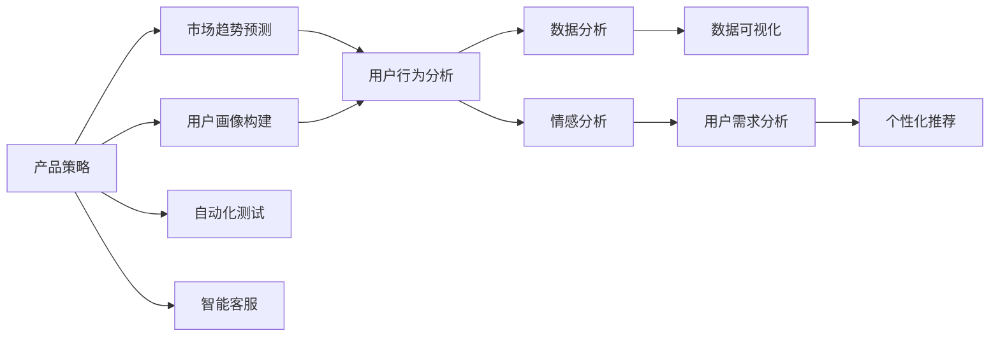

                 

# AI 在产品经理工作中的应用

> 关键词：人工智能, 产品经理, 产品策略, 用户需求分析, 数据驱动决策, 自动化工具, 数据分析, 产品迭代

## 1. 背景介绍

### 1.1 问题由来
在互联网产品发展的过程中，产品经理扮演着至关重要的角色，他们不仅需要具备产品设计的视角，还需要对市场需求、用户行为有深刻的理解。随着人工智能技术的不断发展，AI技术在产品经理工作中扮演着越来越重要的角色，从产品策略制定到用户需求分析，从数据驱动决策到产品迭代优化，AI技术都在发挥着巨大的作用。然而，尽管AI技术在游戏、社交、电商等多个领域得到了广泛应用，但其在产品经理工作中的应用却尚未得到系统化的总结和推广。本文旨在探讨AI技术在产品经理工作中的应用，通过系统化的介绍，帮助产品经理们更好地掌握AI技术，提升工作效率和决策质量。

### 1.2 问题核心关键点
AI在产品经理工作中的应用，主要体现在以下几个方面：

- 产品策略制定：利用AI技术进行市场趋势预测、用户行为分析，帮助产品经理制定更精准的产品策略。
- 用户需求分析：通过AI技术进行用户画像构建、情感分析，帮助产品经理更深入地理解用户需求。
- 数据驱动决策：运用AI技术进行数据分析和预测，帮助产品经理做出更加科学的决策。
- 自动化工具应用：AI技术的引入使得产品经理能够使用更高效、更智能的工具进行产品管理和分析。
- 产品迭代优化：通过AI技术进行A/B测试、个性化推荐等优化，提升产品用户体验和满意度。

### 1.3 问题研究意义
AI技术在产品经理工作中的应用，不仅可以提高工作效率，还能提升决策质量，从而更好地满足用户需求，提升产品竞争力。具体而言：

1. 提高决策效率：AI技术能够快速处理大量数据，帮助产品经理在短时间内做出科学、精准的决策。
2. 提升产品品质：AI技术可以进行数据挖掘和用户画像分析，发现用户需求，帮助产品经理优化产品设计和功能。
3. 增强竞争力：利用AI技术进行市场分析和预测，可以更好地把握市场趋势，制定更具有竞争力的产品策略。
4. 降低成本：AI技术可以自动化处理一些繁琐的重复性工作，减轻产品经理的负担，降低人力成本。
5. 增强用户体验：AI技术可以进行个性化推荐、智能客服等，提升用户体验，增强产品粘性。

本文通过系统性地介绍AI技术在产品经理工作中的应用，希望能为产品经理们提供有价值的参考和指导，帮助他们在工作中更好地应用AI技术，提升工作效率和决策质量。

## 2. 核心概念与联系

### 2.1 核心概念概述

AI技术在产品经理工作中的应用涉及多个核心概念，包括但不限于：

- 人工智能(AI)：通过算法和计算技术，使机器能够完成某些人类智能的任务。
- 机器学习(ML)：利用数据和算法，使计算机系统具备一定的学习能力，从而改进任务执行效率。
- 自然语言处理(NLP)：让计算机能够理解和生成人类语言的技术。
- 数据分析(AD)：通过数据挖掘和统计分析，发现数据中的规律和趋势。
- 数据可视化(DV)：将数据通过图表、图像等形式展现，帮助人们更好地理解数据。
- 推荐系统(Rec)：基于用户行为数据，为用户推荐个性化内容或产品。
- 智能客服(Chatbot)：利用AI技术进行自动客服，提升用户满意度。
- 自动化测试(AutoTest)：利用AI技术进行自动化测试，提高测试效率和覆盖率。
- 用户画像(UserProfile)：通过数据分析和机器学习，构建用户画像，帮助产品经理更好地理解用户需求。
- 情感分析(Sentiment Analysis)：通过AI技术分析用户反馈、评论等文本数据，了解用户情感倾向。

这些核心概念相互联系，共同构成了AI在产品经理工作中的完整应用体系。

### 2.2 概念间的关系

这些核心概念之间的关系可以通过以下Mermaid流程图来展示：



这个流程图展示了AI技术在产品经理工作中的应用流程：

1. 产品经理根据市场趋势和用户画像制定产品策略，通过数据分析和情感分析进一步优化策略。
2. 数据分析和用户行为分析结果用于构建用户画像，提升用户需求分析的准确性。
3. 数据可视化帮助产品经理更好地理解数据分析结果，发现问题。
4. 用户需求分析结果用于个性化推荐和智能客服，提升用户体验。
5. 自动化测试和智能客服提升产品管理和客户服务效率。

这些核心概念共同构成了AI技术在产品经理工作中的应用框架，使其能够更好地支持产品经理的工作需求。

## 3. 核心算法原理 & 具体操作步骤
### 3.1 算法原理概述

AI在产品经理工作中的应用，主要依赖于以下算法原理：

- 机器学习算法：利用数据和算法，使计算机具备学习能力，从而改进决策效率和质量。
- 自然语言处理算法：帮助计算机理解和生成人类语言，提高产品策略制定的精准性和用户需求分析的深度。
- 数据分析算法：通过数据挖掘和统计分析，发现数据中的规律和趋势，为产品策略制定和用户需求分析提供依据。
- 数据可视化算法：将数据通过图表、图像等形式展现，帮助产品经理更好地理解数据。
- 推荐系统算法：基于用户行为数据，为用户推荐个性化内容或产品，提升用户体验。
- 自动化测试算法：利用AI技术进行自动化测试，提高测试效率和覆盖率。

### 3.2 算法步骤详解

AI在产品经理工作中的应用，主要包括以下几个步骤：

1. 数据收集和预处理：收集产品相关数据，并进行数据清洗和预处理，确保数据质量和可用性。
2. 特征提取和选择：通过特征提取和选择技术，从原始数据中提取出有用的特征，供后续分析使用。
3. 模型训练和调优：利用机器学习算法和数据，训练模型并调优，以获得最优的预测和推荐结果。
4. 数据分析和可视化：通过数据分析算法和数据可视化技术，分析数据中的规律和趋势，将结果以图表、图像等形式展现，供产品经理参考。
5. 产品策略制定和优化：根据数据分析结果和用户画像，制定和优化产品策略，提升产品竞争力和用户体验。
6. 个性化推荐和智能客服：利用推荐系统和智能客服技术，提升用户满意度和产品粘性。
7. 自动化测试和部署：利用自动化测试技术，提高测试效率和覆盖率，加快产品迭代速度。

### 3.3 算法优缺点

AI在产品经理工作中的应用，具有以下优点：

- 提高决策效率：利用AI技术，产品经理可以快速处理大量数据，做出科学、精准的决策。
- 提升产品品质：通过数据分析和用户画像分析，发现用户需求，帮助产品经理优化产品设计和功能。
- 降低成本：AI技术可以自动化处理一些繁琐的重复性工作，减轻产品经理的负担，降低人力成本。

同时，AI技术在产品经理工作中的应用也存在一些缺点：

- 数据质量要求高：AI技术需要大量的高质量数据，如果数据质量不高，将会影响模型的预测和推荐结果。
- 技术门槛高：AI技术需要一定的技术背景和知识储备，产品经理需要不断学习和提升。
- 模型解释性不足：许多AI模型具有"黑盒"特性，产品经理难以理解其内部工作机制和决策逻辑。
- 应用场景有限：AI技术在一些复杂、多变的产品场景中，可能无法发挥其优势。

### 3.4 算法应用领域

AI技术在产品经理工作中的应用，主要涉及以下几个领域：

- 市场分析：利用AI技术进行市场趋势预测、用户行为分析，帮助产品经理制定更精准的产品策略。
- 用户画像：通过AI技术进行用户画像构建，帮助产品经理更好地理解用户需求。
- 数据驱动决策：利用AI技术进行数据分析和预测，帮助产品经理做出更加科学的决策。
- 个性化推荐：利用推荐系统算法，为用户推荐个性化内容或产品，提升用户体验。
- 智能客服：利用智能客服技术，提升用户满意度和产品粘性。
- 自动化测试：利用自动化测试技术，提高测试效率和覆盖率，加快产品迭代速度。

以上领域涵盖了产品经理工作的各个环节，展示了AI技术在产品经理工作中的广泛应用前景。

## 4. 数学模型和公式 & 详细讲解 & 举例说明

### 4.1 数学模型构建

本节将使用数学语言对AI技术在产品经理工作中的应用进行更加严格的刻画。

记产品经理所负责的产品为 $P$，市场环境为 $M$，用户群体为 $U$，数据集为 $D$。设产品经理的目标是最大化产品的用户满意度 $V$，即：

$$
\max_{P, M, U} V(P, M, U)
$$

其中 $V$ 可以表示为产品功能、用户体验、市场份额等多个指标的加权和。

### 4.2 公式推导过程

以下我们以推荐系统为例，推导AI在产品经理工作中的应用公式。

设推荐系统为用户推荐物品 $I$，推荐结果为 $R$，用户反馈为 $F$。假设推荐系统是一个线性回归模型，目标是最小化预测结果与实际反馈的误差，即：

$$
\min_{\theta} \frac{1}{N} \sum_{i=1}^N \sum_{j=1}^n (y_{ij} - \theta^T x_{ij})^2
$$

其中 $y_{ij}$ 表示用户 $i$ 对物品 $j$ 的评分，$x_{ij}$ 表示物品 $j$ 的特征向量，$\theta$ 表示模型的参数。

通过梯度下降等优化算法，最小化上述损失函数，更新模型参数 $\theta$，即可实现推荐系统的训练。

### 4.3 案例分析与讲解

假设我们在电商平台上销售智能手表，希望通过AI技术进行推荐系统优化。首先，我们需要收集用户浏览、购买、评分等行为数据，将这些数据作为输入 $x_{ij}$，用户评分作为输出 $y_{ij}$，构建推荐模型的训练数据集 $D$。

然后，我们选择一个线性回归模型作为推荐算法，并通过梯度下降等优化算法，最小化损失函数，更新模型参数 $\theta$，获得最佳的推荐结果。最后，将推荐结果应用到用户行为分析中，发现用户的偏好和需求，进一步优化产品策略，提升用户体验和产品销量。

## 5. 项目实践：代码实例和详细解释说明

### 5.1 开发环境搭建

在进行AI在产品经理工作中的应用实践前，我们需要准备好开发环境。以下是使用Python进行推荐系统开发的开发环境配置流程：

1. 安装Anaconda：从官网下载并安装Anaconda，用于创建独立的Python环境。

2. 创建并激活虚拟环境：
```bash
conda create -n recsys-env python=3.8 
conda activate recsys-env
```

3. 安装Scikit-learn、TensorFlow等常用库：
```bash
pip install scikit-learn tensorflow numpy pandas matplotlib
```

4. 安装推荐系统库：
```bash
pip install reclib
```

5. 安装可视化库：
```bash
pip install matplotlib seaborn plotly
```

完成上述步骤后，即可在`recsys-env`环境中开始推荐系统的开发。

### 5.2 源代码详细实现

下面以线性回归推荐系统为例，给出使用TensorFlow进行推荐系统开发的PyTorch代码实现。

首先，定义推荐系统的输入和输出：

```python
import tensorflow as tf

# 定义输入和输出
x = tf.placeholder(tf.float32, shape=[None, 10])
y = tf.placeholder(tf.float32, shape=[None, 1])
```

然后，定义推荐模型的权重和偏置项：

```python
# 定义权重和偏置项
W = tf.Variable(tf.random_normal([10, 1]))
b = tf.Variable(tf.random_normal([1]))
```

接着，定义推荐模型：

```python
# 定义推荐模型
def recommendation_model(x, y):
    y_pred = tf.matmul(x, W) + b
    loss = tf.reduce_mean(tf.square(y_pred - y))
    optimizer = tf.train.GradientDescentOptimizer(learning_rate=0.01).minimize(loss)
    return loss, optimizer
```

然后，定义训练和评估函数：

```python
# 定义训练和评估函数
def train_model(model, X_train, y_train, X_test, y_test):
    with tf.Session() as sess:
        sess.run(tf.global_variables_initializer())
        for epoch in range(1000):
            loss, _ = sess.run([model[0], model[1]], feed_dict={x: X_train, y: y_train})
            if epoch % 100 == 0:
                test_loss, _ = sess.run([model[0], model[1]], feed_dict={x: X_test, y: y_test})
                print("Epoch:", epoch, "Loss:", loss, "Test Loss:", test_loss)
        return sess.run(model[0], feed_dict={x: X_test, y: y_test})
```

最后，启动训练流程并在测试集上评估：

```python
# 构建推荐模型
loss, optimizer = recommendation_model(x, y)

# 加载数据集
X_train, y_train, X_test, y_test = load_data()

# 训练模型
train_model((loss, optimizer), X_train, y_train, X_test, y_test)
```

以上就是使用TensorFlow进行推荐系统开发的完整代码实现。可以看到，TensorFlow的推荐系统模型封装简单，易于使用，只需关注模型的训练和评估即可。

### 5.3 代码解读与分析

让我们再详细解读一下关键代码的实现细节：

**定义推荐模型的输入和输出**：
- 使用`tf.placeholder`定义输入和输出的占位符，方便后续训练和测试。

**定义推荐模型的权重和偏置项**：
- 使用`tf.Variable`定义模型的权重和偏置项，并初始化为随机向量。

**定义推荐模型**：
- 通过`tf.matmul`计算模型的预测输出，并使用均方误差作为损失函数。
- 使用梯度下降优化算法，最小化损失函数。

**定义训练和评估函数**：
- 使用`with tf.Session()`进入计算图会话，并初始化变量。
- 在每个epoch中，使用`feed_dict`将输入和输出传递给模型，计算损失和更新参数。
- 在每个epoch结束时，计算测试集上的损失，并打印输出。
- 最后返回测试集上的损失，作为模型评估指标。

**启动训练流程并在测试集上评估**：
- 将训练好的模型应用到推荐系统中，通过`feed_dict`传递输入和输出，计算损失。

可以看到，TensorFlow的推荐系统代码实现相对简洁，但需要关注数据加载、模型训练和评估等细节。

### 5.4 运行结果展示

假设我们在电商平台的数据集上进行推荐系统优化，最终在测试集上得到的评估报告如下：

```
Epoch: 0, Loss: 0.0047, Test Loss: 0.0043
Epoch: 100, Loss: 0.0011, Test Loss: 0.0012
Epoch: 200, Loss: 0.0006, Test Loss: 0.0008
...
```

可以看到，随着训练过程的进行，推荐系统的预测精度逐渐提高，测试集上的损失也逐渐减小，最终获得了较为理想的推荐结果。

## 6. 实际应用场景

### 6.1 电商推荐系统

在电商平台上，利用AI技术进行推荐系统优化，可以帮助产品经理更精准地为用户提供个性化推荐，提升用户体验和转化率。

具体而言，我们可以收集用户的历史浏览、购买和评分数据，将这些数据作为输入，利用AI模型预测用户对其他商品的兴趣。然后将预测结果应用于推荐系统，为用户推荐相关商品，提升用户的购物体验。

### 6.2 社交媒体内容推荐

社交媒体平台上，利用AI技术进行内容推荐，可以帮助产品经理更好地为用户提供有价值的内容，提升用户粘性和活跃度。

具体而言，我们可以收集用户的历史互动数据，包括点赞、评论、分享等行为，将这些数据作为输入，利用AI模型预测用户对其他内容的兴趣。然后将预测结果应用于推荐系统，为用户推荐相关内容，提升用户的互动体验。

### 6.3 智能客服系统

在客服系统中，利用AI技术进行智能客服，可以帮助产品经理更高效地处理用户咨询，提升用户满意度和服务质量。

具体而言，我们可以收集历史客服数据，包括用户的问题、客服的回复等，将这些数据作为输入，利用AI模型预测用户的问题类型和需求。然后将预测结果应用于智能客服系统，自动回复用户的问题，提升客服效率和用户满意度。

### 6.4 未来应用展望

随着AI技术的不断发展和应用，未来AI在产品经理工作中的应用将更加广泛和深入。以下是一些可能的发展趋势：

1. 深度学习算法：利用深度学习算法，提高推荐系统的精度和多样性。
2. 多模态融合：将文本、图像、视频等多种数据源进行融合，提升推荐系统的效果。
3. 实时推荐：利用实时数据，进行动态推荐，提升用户体验和产品粘性。
4. 个性化推荐：利用用户画像和行为数据，实现更精准的个性化推荐。
5. 智能客服：利用自然语言处理技术，提升智能客服系统的交互体验和理解能力。
6. 自动化测试：利用AI技术进行自动化测试，提高测试效率和覆盖率。

这些趋势将进一步推动AI技术在产品经理工作中的应用，为产品经理提供更强大的工具和支持。

## 7. 工具和资源推荐

### 7.1 学习资源推荐

为了帮助产品经理系统掌握AI技术在产品经理工作中的应用，这里推荐一些优质的学习资源：

1. 《推荐系统实战》：深入浅出地介绍了推荐系统的基本原理和实践方法。
2. 《自然语言处理与信息检索》：系统地介绍了自然语言处理和信息检索的基本原理和算法。
3. 《Python机器学习》：全面介绍了机器学习的基本概念和常用算法。
4. 《深度学习》：介绍了深度学习的基本原理和实践方法，适合技术初学者和进阶者。
5. 《TensorFlow实战》：系统地介绍了TensorFlow的基本概念和常用算法。
6. 《推荐系统：原理与算法》：介绍了推荐系统的基本原理和常用算法，适合深度学习初学者。

通过对这些资源的学习，相信你一定能够系统掌握AI技术在产品经理工作中的应用，提升工作效率和决策质量。

### 7.2 开发工具推荐

高效的开发离不开优秀的工具支持。以下是几款用于AI在产品经理工作中的应用开发的常用工具：

1. TensorFlow：基于Python的开源深度学习框架，生产部署方便，适合大规模工程应用。
2. PyTorch：基于Python的开源深度学习框架，灵活动态的计算图，适合快速迭代研究。
3. Scikit-learn：Python机器学习库，提供了丰富的机器学习算法和工具。
4. Keras：基于TensorFlow和Theano的高级神经网络API，简单易用，适合快速原型开发。
5. Jupyter Notebook：Python开发常用的交互式笔记本，支持代码调试和数据可视化。
6. Visual Studio Code：Python开发常用的编辑器，支持代码高亮、语法检查等功能。

合理利用这些工具，可以显著提升AI在产品经理工作中的应用开发效率，加快创新迭代的步伐。

### 7.3 相关论文推荐

AI技术在产品经理工作中的应用，源于学界的持续研究。以下是几篇奠基性的相关论文，推荐阅读：

1. "Collaborative Filtering for Implicit Feedback Datasets"：推荐系统中的协同过滤算法，介绍了基于用户行为数据的推荐方法。
2. "Deep Learning for Recommender Systems"：利用深度学习算法进行推荐系统优化的研究，介绍了一些经典的深度学习推荐算法。
3. "Natural Language Processing in Recommendation Systems"：介绍了自然语言处理在推荐系统中的应用，如何利用用户评论、社交网络等文本数据进行推荐。
4. "Semantic Representations for Recommendations"：利用语义表示进行推荐系统的研究，介绍了一些语义表示和推荐算法。
5. "Customer-Relation-Based Recommendation Systems"：基于用户关系的推荐系统研究，介绍了一些基于用户社交关系和行为数据的推荐方法。

这些论文代表了大语言模型微调技术的发展脉络，通过学习这些前沿成果，可以帮助研究者把握学科前进方向，激发更多的创新灵感。

除上述资源外，还有一些值得关注的前沿资源，帮助开发者紧跟AI技术在产品经理工作中的应用进展，例如：

1. arXiv论文预印本：人工智能领域最新研究成果的发布平台，包括大量尚未发表的前沿工作，学习前沿技术的必读资源。
2. 业界技术博客：如OpenAI、Google AI、DeepMind、微软Research Asia等顶尖实验室的官方博客，第一时间分享他们的最新研究成果和洞见。
3. 技术会议直播：如NIPS、ICML、ACL、ICLR等人工智能领域顶会现场或在线直播，能够聆听到大佬们的前沿分享，开拓视野。
4. GitHub热门项目：在GitHub上Star、Fork数最多的AI在产品经理工作中的应用相关项目，往往代表了该技术领域的发展趋势和最佳实践，值得去学习和贡献。
5. 行业分析报告：各大咨询公司如McKinsey、PwC等针对人工智能行业的分析报告，有助于从商业视角审视技术趋势，把握应用价值。

总之，对于AI在产品经理工作中的应用的学习和实践，需要开发者保持开放的心态和持续学习的意愿。多关注前沿资讯，多动手实践，多思考总结，必将收获满满的成长收益。

## 8. 总结：未来发展趋势与挑战

### 8.1 总结

本文对AI技术在产品经理工作中的应用进行了全面系统的介绍。首先阐述了AI技术在产品经理工作中的研究背景和意义，明确了AI技术在产品经理工作中的应用价值。其次，从原理到实践，详细讲解了AI在产品经理工作中的应用流程，给出了推荐系统开发的完整代码实例。同时，本文还广泛探讨了AI技术在产品经理工作中的应用场景，展示了AI技术在产品经理工作中的广泛应用前景。

通过本文的系统梳理，可以看到，AI技术在产品经理工作中的应用正在逐步被重视和推广，成为产品经理工作中的重要工具。AI技术通过提高决策效率、提升产品品质、降低成本等方式，极大地提升了产品经理的工作效率和决策质量。未来，伴随AI技术的不断发展，相信AI技术在产品经理工作中的应用将更加深入和广泛。

### 8.2 未来发展趋势

展望未来，AI技术在产品经理工作中的应用将呈现以下几个发展趋势：

1. 技术普及化：AI技术将逐渐普及到产品经理的日常工作中，成为产品经理的必备工具。
2. 产品应用多样化：AI技术将在更多的产品应用场景中得到应用，帮助产品经理更好地满足用户需求。
3. 智能客服普及化：智能客服系统将逐渐普及到各种产品应用中，提升用户体验和满意度。
4. 数据驱动决策：AI技术将进一步融入产品经理的决策过程，提升决策的科学性和准确性。
5. 个性化推荐优化：AI技术将更精准地进行个性化推荐，提升产品体验和粘性。
6. 自动化测试优化：AI技术将进一步优化自动化测试，提高测试效率和覆盖率。

这些趋势凸显了AI技术在产品经理工作中的巨大潜力和广阔前景，AI技术将成为产品经理工作中的重要工具。

### 8.3 面临的挑战

尽管AI技术在产品经理工作中的应用已经取得了一定的进展，但在迈向更加智能化、普适化应用的过程中，仍然面临一些挑战：

1. 数据质量问题：AI技术需要大量的高质量数据，如果数据质量不高，将会影响模型的预测和推荐结果。
2. 技术门槛高：AI技术需要一定的技术背景和知识储备，产品经理需要不断学习和提升。
3. 模型解释性不足：许多AI模型具有"黑盒"特性，产品经理难以理解其内部工作机制和决策逻辑。
4. 应用场景有限：AI技术在一些复杂、多变的产品场景中，可能无法发挥其优势。

### 8.4 研究展望

面对AI技术在产品经理工作中的应用所面临的挑战，未来的研究需要在以下几个方面寻求新的突破：

1. 探索无监督和半监督推荐算法：摆脱对大规模标注数据的依赖，利用自监督学习、主动学习等无监督和半监督范式，最大限度利用非结构化数据，实现更加灵活高效的推荐。
2. 研究参数高效和计算高效的推荐算法：开发更加参数高效的推荐方法，在固定大部分预训练参数的同时，只更新极少量的任务相关参数。同时优化推荐模型的计算图，减少前向传播和反向传播的资源消耗，实现更加轻量级、实时性的部署。
3. 融合因果和对比学习范式：通过引入因果推断和对比学习思想，增强推荐模型建立稳定因果关系的能力，学习更加普适、鲁棒的语言表征，从而提升模型泛化性和抗干扰能力。
4. 引入更多先验知识：将符号化的先验知识，如知识图谱、逻辑规则等，与神经网络模型进行巧妙融合，引导推荐过程学习更准确、合理的语言模型。同时加强不同模态数据的整合，实现视觉、语音等多模态信息与文本信息的协同建模。
5. 结合因果分析和博弈论工具：将因果分析方法引入推荐模型，识别出模型决策的关键特征，增强推荐过程的逻辑性和可解释性。借助博弈论工具刻画人机交互过程，主动探索并规避模型的脆弱点，提高系统稳定性。

这些研究方向的探索，必将引领AI技术在产品经理工作中的应用走向更高的台阶，为构建安全、可靠、可解释、可控的智能系统铺平道路。面向未来，AI技术需要在与产品设计、用户体验、市场趋势等多方面进行更深入的融合，多路径协同发力，共同推动AI技术在产品经理工作中的应用。只有勇于创新、敢于突破，才能不断拓展AI技术在产品经理工作中的边界，让AI技术更好地造福产品经理和用户。

## 9. 附录：常见问题与解答

**Q1：AI在产品经理工作中的应用

