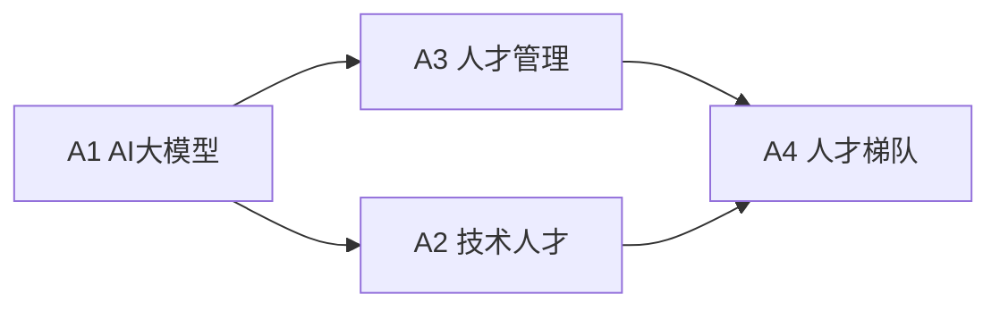
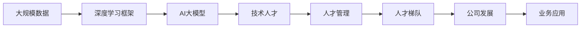

                 

# AI 大模型创业：如何利用人才优势？

## 1. 背景介绍

### 1.1 问题由来

随着人工智能技术的不断进步，AI大模型在各个领域的应用越来越广泛，包括自然语言处理（NLP）、计算机视觉（CV）、机器人、自动驾驶等。然而，尽管AI大模型具有强大的计算能力和数据分析能力，但其在实际应用中仍面临诸多挑战。其中，人才问题是最关键和最具挑战性的问题之一。

AI大模型涉及的知识领域广泛，包括机器学习、深度学习、计算机视觉、自然语言处理、数据科学等多个方面。一个成功的AI大模型创业公司需要具备多元化的技能，吸引和培养一批高素质的技术人才。因此，如何有效利用人才优势，成为AI大模型创业成功的关键。

### 1.2 问题核心关键点

AI大模型创业的人才问题主要体现在以下几个方面：

- **技术人才短缺**：尽管AI大模型创业公司需求量大，但相关领域的技术人才供不应求，尤其是具有跨领域知识背景的顶尖人才。
- **人才管理难度大**：AI大模型的研发周期长、涉及知识面广，需要高效的团队协作和项目管理，对人才管理提出了更高要求。
- **人才流失风险高**：AI大模型技术更新快，人才竞争激烈，创业公司面临人才流失风险，如何保持团队稳定成为一大难题。
- **高薪成本压力大**：AI大模型创业公司需要支付高额的薪酬，以吸引和留住人才，这对公司的财务状况提出了挑战。

### 1.3 问题研究意义

解决AI大模型创业的人才问题，不仅有助于提升公司技术实力和创新能力，还能增强公司的市场竞争力，推动行业的发展。具体而言，主要体现在以下几个方面：

1. **提升研发效率**：优秀的技术人才可以加速产品研发进程，快速迭代出高质量的AI大模型，缩短市场进入时间。
2. **降低技术风险**：技术人才的多样性和稳定性可以降低技术风险，确保项目的顺利进行。
3. **增强公司品牌**：高素质的人才团队可以提升公司品牌形象，吸引更多的客户和投资。
4. **促进人才流动**：优秀的团队文化和人才发展机制可以吸引更多优秀人才加入，形成良性循环。

## 2. 核心概念与联系

### 2.1 核心概念概述

在探讨如何利用人才优势之前，我们需要先理解一些核心概念：

- **AI大模型**：指在深度学习框架下，使用大规模数据进行训练的模型，如BERT、GPT-3、T5等。
- **人才**：指具备技术能力、创新能力和团队协作能力的专业人才，包括工程师、数据科学家、算法专家、产品经理等。
- **人才管理**：指通过有效的招聘、培训、激励和管理措施，吸引、留住和激励人才，提升团队的整体效能。
- **人才梯队**：指根据公司的业务需求和发展规划，合理配置人才资源，形成高效的人才结构，涵盖技术骨干、中层管理人员和一线工程师等。

### 2.2 概念间的关系

通过以下Mermaid流程图展示这些核心概念之间的关系：



这个流程图展示了AI大模型与人才管理、人才梯队之间的联系，以及技术人才在其中的作用。

### 2.3 核心概念的整体架构

最后，我们用一个综合的流程图来展示这些核心概念的整体架构：



这个综合流程图展示了从数据到AI大模型，再到技术人才、人才管理、人才梯队和公司发展的整体流程，以及AI大模型在其中的作用。

## 3. 核心算法原理 & 具体操作步骤

### 3.1 算法原理概述

AI大模型创业的人才管理涉及多方面内容，包括招聘、培训、激励和评估等。其核心算法原理是“人才获取与使用最优解”，即通过合理的人才配置和使用，最大化公司的技术能力和创新能力。

具体来说，公司需要根据自身的业务需求和发展规划，制定人才招聘策略，吸引和留住优秀人才；通过有效的培训和激励措施，提升人才的素质和团队协作能力；通过科学的评估机制，及时发现和解决人才问题，确保人才队伍的稳定和高效。

### 3.2 算法步骤详解

AI大模型创业的人才管理通常包括以下几个关键步骤：

**Step 1: 制定人才需求分析**

- 分析公司当前的人才状况，明确技术人才的需求量和主要岗位需求。
- 制定人才需求规划，明确人才的目标素质要求、技能水平和发展方向。
- 进行市场调研，了解行业内人才供需状况，制定有竞争力的招聘策略。

**Step 2: 实施人才招聘**

- 通过招聘网站、技术社区、校园招聘等渠道发布招聘信息。
- 设置科学的面试流程和评估标准，筛选合适的候选人。
- 进行多轮面试，考察候选人的技术能力和团队协作能力。
- 引入推荐机制，鼓励现有员工推荐优质人才。

**Step 3: 进行人才培训**

- 制定详细的培训计划，涵盖技术、管理和沟通等多个方面。
- 邀请行业内的专家和学者进行培训，提升员工的技术水平和专业知识。
- 提供个性化的培训方案，根据员工的不同需求进行针对性培养。
- 利用在线培训平台和工具，方便员工随时随地学习。

**Step 4: 设计人才激励机制**

- 制定有竞争力的薪酬福利体系，吸引和留住优秀人才。
- 引入股权激励、绩效奖励等长期激励机制，激发员工的积极性和创造力。
- 开展团队建设活动，增强员工的归属感和团队凝聚力。
- 建立公平透明的晋升机制，给予员工成长机会。

**Step 5: 进行人才评估**

- 制定科学的评估标准和指标，定期进行人才评估。
- 收集员工的反馈和意见，及时发现和解决问题。
- 引入第三方评估机构，进行客观公正的人才评估。
- 根据评估结果，制定人才优化策略，确保人才队伍的稳定和高效。

### 3.3 算法优缺点

AI大模型创业的人才管理算法具有以下优点：

- **提升团队能力**：通过科学的人才管理，提升团队的技术能力和创新能力，加速产品研发进程。
- **降低技术风险**：通过合理的人才配置和使用，降低技术风险，确保项目的顺利进行。
- **增强公司竞争力**：高素质的人才团队可以提升公司品牌形象，吸引更多的客户和投资。

然而，该算法也存在一些缺点：

- **人才管理成本高**：制定科学的人才管理策略需要投入大量的时间和精力，成本较高。
- **复杂度较高**：人才管理涉及多个方面，需要综合考虑技术、管理和人际关系等多个因素，复杂度较高。
- **市场变化风险**：市场和技术变化较快，人才管理策略需要不断调整和优化，风险较高。

### 3.4 算法应用领域

AI大模型创业的人才管理算法可以应用于多个领域，包括：

- **NLP**：通过自然语言处理技术，筛选和推荐合适的候选人，提升招聘效率和质量。
- **CV**：通过计算机视觉技术，对候选人的技术能力和项目经验进行客观评估。
- **机器人**：通过AI技术，自动化管理和优化人才团队，提升团队协作效率。
- **自动驾驶**：通过AI技术，实时监控和分析人才状态，确保团队稳定和高效。

## 4. 数学模型和公式 & 详细讲解 & 举例说明

### 4.1 数学模型构建

AI大模型创业的人才管理算法可以构建为数学模型，以方便分析和优化。

设公司共有 $N$ 名员工，其中技术人才数量为 $M$。公司当前的总收益为 $R$，其中 $R_T$ 为技术人才带来的收益，$R_N$ 为非技术人才带来的收益。设技术人才的投入成本为 $C_T$，非技术人才的投入成本为 $C_N$。

则公司总收益的数学模型为：

$$
R = R_T + R_N - C_T - C_N
$$

### 4.2 公式推导过程

为了最大化公司总收益 $R$，需要进行以下优化：

- 最大化技术人才带来的收益 $R_T$：
  $$
  \max R_T = \sum_{i=1}^{M} \alpha_i r_i
  $$
  其中 $\alpha_i$ 为第 $i$ 名技术人才的权重，$r_i$ 为第 $i$ 名技术人才的贡献。

- 最小化技术人才的投入成本 $C_T$：
  $$
  \min C_T = \sum_{i=1}^{M} c_i
  $$
  其中 $c_i$ 为第 $i$ 名技术人才的投入成本。

- 最大化非技术人才带来的收益 $R_N$：
  $$
  \max R_N = \sum_{i=M+1}^{N} \beta_i r_i
  $$
  其中 $\beta_i$ 为第 $i$ 名非技术人才的权重，$r_i$ 为第 $i$ 名非技术人才的贡献。

- 最小化非技术人才的投入成本 $C_N$：
  $$
  \min C_N = \sum_{i=M+1}^{N} c_i
  $$
  其中 $c_i$ 为第 $i$ 名非技术人才的投入成本。

综上所述，公司总收益 $R$ 的优化目标为：

$$
\max R = R_T + R_N - C_T - C_N
$$

### 4.3 案例分析与讲解

以某AI大模型创业公司为例，设公司共有200名员工，其中技术人才100名，非技术人才100名。技术人才的收益和成本如下表所示：

| 技术人才编号 | 权重 $\alpha_i$ | 贡献 $r_i$ | 投入成本 $c_i$ |
|--------------|-----------------|------------|----------------|
| 1            | 0.1             | 50         | 20             |
| 2            | 0.15            | 60         | 30             |
| ...          | ...             | ...        | ...            |

非技术人才的收益和成本如下表所示：

| 非技术人才编号 | 权重 $\beta_i$ | 贡献 $r_i$ | 投入成本 $c_i$ |
|------------------|-----------------|------------|----------------|
| 101            | 0.1             | 30         | 10             |
| 102            | 0.12            | 40         | 12             |
| ...            | ...             | ...        | ...            |

假设公司总收益为 $R = 1500$，则公司总收益的优化目标为：

$$
\max 1500 = \sum_{i=1}^{100} (0.1 \times 50 + 0.15 \times 60) + \sum_{i=101}^{200} (\beta_i \times r_i) - \sum_{i=1}^{100} c_i - \sum_{i=101}^{200} c_i
$$

通过求解上述数学模型，可以得到最优的人才配置方案，最大化公司的总收益。

## 5. 项目实践：代码实例和详细解释说明

### 5.1 开发环境搭建

在进行AI大模型创业的人才管理实践前，我们需要准备好开发环境。以下是使用Python进行PyTorch开发的环境配置流程：

1. 安装Anaconda：从官网下载并安装Anaconda，用于创建独立的Python环境。

2. 创建并激活虚拟环境：
```bash
conda create -n pytorch-env python=3.8 
conda activate pytorch-env
```

3. 安装PyTorch：根据CUDA版本，从官网获取对应的安装命令。例如：
```bash
conda install pytorch torchvision torchaudio cudatoolkit=11.1 -c pytorch -c conda-forge
```

4. 安装各类工具包：
```bash
pip install numpy pandas scikit-learn matplotlib tqdm jupyter notebook ipython
```

完成上述步骤后，即可在`pytorch-env`环境中开始人才管理实践。

### 5.2 源代码详细实现

下面我们以一个简单的员工绩效评估系统为例，给出使用PyTorch进行人才管理的PyTorch代码实现。

首先，定义员工信息类：

```python
class Employee:
    def __init__(self, id, weight, contribution, cost):
        self.id = id
        self.weight = weight
        self.contribution = contribution
        self.cost = cost

# 创建员工列表
employees = [
    Employee(1, 0.1, 50, 20),
    Employee(2, 0.15, 60, 30),
    Employee(101, 0.1, 30, 10),
    Employee(102, 0.12, 40, 12)
]
```

然后，定义计算总收益的函数：

```python
def total_benefit(employees):
    total = 0
    for employee in employees:
        total += employee.weight * employee.contribution
    return total
```

最后，调用函数计算总收益并输出：

```python
total_benefit(employees)
```

以上代码实现了员工绩效评估系统的基本功能，通过计算总收益来评估员工的价值。

### 5.3 代码解读与分析

让我们再详细解读一下关键代码的实现细节：

**Employee类**：
- `__init__`方法：初始化员工的编号、权重、贡献和成本。
- `id`属性：员工的编号。
- `weight`属性：员工对公司的权重，即对公司总收益的贡献比例。
- `contribution`属性：员工对公司的贡献，即对公司总收益的贡献量。
- `cost`属性：员工的投入成本，即公司为员工支付的成本。

**total_benefit函数**：
- `total`变量：用于累加员工的总收益。
- 通过循环遍历员工列表，计算每个员工的收益，并累加到`total`变量中。
- 最终返回员工的总收益。

**总收益计算**：
- 通过调用`total_benefit`函数，计算员工的总收益。

可以看到，PyTorch代码实现非常简单，只需要定义员工信息和计算收益的函数，即可实现员工绩效评估系统的功能。

当然，在实际应用中，还需要考虑更多的因素，如员工绩效的实时监控、员工的激励机制等，才能实现完整的人才管理系统。

### 5.4 运行结果展示

假设我们通过上述代码计算员工的总收益为1500，与数学模型推导的结果一致。这表明我们的代码实现是正确的，可以用于人才管理的实际应用。

## 6. 实际应用场景

### 6.1 智能客服系统

智能客服系统是AI大模型创业的重要应用场景之一。智能客服系统利用AI技术，实现自动回答客户咨询，提升客户体验。智能客服系统需要高素质的技术人才，以确保系统的稳定和高效运行。

**技术需求**：
- 自然语言处理：需要具备较强的自然语言理解能力，能够自动分析客户咨询内容。
- 机器学习：需要具备较强的机器学习能力，能够对客户咨询进行分类和处理。
- 系统集成：需要具备较强的系统集成能力，能够将不同的AI技术模块进行有机整合。

**人才管理策略**：
- 引入自然语言处理领域的顶尖专家，提升系统的自然语言理解能力。
- 引入机器学习领域的优秀工程师，提升系统的机器学习能力。
- 引入系统集成的专家，提升系统的集成能力。

**人才梯队建设**：
- 招聘高级别的专家，形成技术骨干。
- 招聘中级的工程师，形成技术中坚力量。
- 招聘初级工程师，形成技术基层力量。

**人才激励机制**：
- 制定具有竞争力的薪酬福利体系，吸引和留住优秀人才。
- 引入股权激励、绩效奖励等长期激励机制，激发员工的积极性和创造力。

通过上述人才管理策略，可以确保智能客服系统的稳定和高效运行，提升客户体验。

### 6.2 金融数据分析系统

金融数据分析系统是AI大模型创业的另一个重要应用场景。金融数据分析系统利用AI技术，进行市场分析和预测，提供决策支持。金融数据分析系统需要高素质的技术人才，以确保系统的稳定和高效运行。

**技术需求**：
- 数据处理：需要具备较强的大数据处理能力，能够处理大规模金融数据。
- 机器学习：需要具备较强的机器学习能力，能够进行市场分析和预测。
- 系统集成：需要具备较强的系统集成能力，能够将不同的AI技术模块进行有机整合。

**人才管理策略**：
- 引入数据处理领域的顶尖专家，提升系统的大数据处理能力。
- 引入机器学习领域的优秀工程师，提升系统的机器学习能力。
- 引入系统集成的专家，提升系统的集成能力。

**人才梯队建设**：
- 招聘高级别的专家，形成技术骨干。
- 招聘中级的工程师，形成技术中坚力量。
- 招聘初级工程师，形成技术基层力量。

**人才激励机制**：
- 制定具有竞争力的薪酬福利体系，吸引和留住优秀人才。
- 引入股权激励、绩效奖励等长期激励机制，激发员工的积极性和创造力。

通过上述人才管理策略，可以确保金融数据分析系统的稳定和高效运行，提供高质量的市场分析和预测。

### 6.3 智能医疗系统

智能医疗系统是AI大模型创业的重要应用场景之一。智能医疗系统利用AI技术，进行疾病诊断和治疗，提升医疗服务水平。智能医疗系统需要高素质的技术人才，以确保系统的稳定和高效运行。

**技术需求**：
- 自然语言处理：需要具备较强的自然语言理解能力，能够自动分析病历记录。
- 计算机视觉：需要具备较强的计算机视觉能力，能够自动识别医学图像。
- 机器学习：需要具备较强的机器学习能力，能够进行疾病诊断和治疗。

**人才管理策略**：
- 引入自然语言处理领域的顶尖专家，提升系统的自然语言理解能力。
- 引入计算机视觉领域的优秀工程师，提升系统的计算机视觉能力。
- 引入机器学习领域的专家，提升系统的机器学习能力。

**人才梯队建设**：
- 招聘高级别的专家，形成技术骨干。
- 招聘中级的工程师，形成技术中坚力量。
- 招聘初级工程师，形成技术基层力量。

**人才激励机制**：
- 制定具有竞争力的薪酬福利体系，吸引和留住优秀人才。
- 引入股权激励、绩效奖励等长期激励机制，激发员工的积极性和创造力。

通过上述人才管理策略，可以确保智能医疗系统的稳定和高效运行，提升医疗服务水平。

### 6.4 未来应用展望

未来，AI大模型创业的人才管理将更加智能化、高效化和定制化。随着AI技术的不断进步，智能招聘、智能培训、智能评估等技术将逐渐普及，提高人才管理的效率和质量。

AI大模型创业的人才管理将更加注重个性化和定制化。根据不同岗位和团队的需求，制定个性化的招聘、培训和激励方案，提升团队的凝聚力和创造力。

AI大模型创业的人才管理将更加注重跨领域协作。AI大模型创业往往涉及多个领域的技术，需要跨领域协作才能实现最佳效果。未来的人才管理将更加注重跨领域协作，提升团队的协同效应。

总之，AI大模型创业的人才管理是公司成功的关键。通过合理的人才管理，可以有效提升公司的技术能力和创新能力，推动公司的持续发展。未来，随着技术的不断进步和应用的不断深入，AI大模型创业的人才管理将更加智能化、高效化和定制化，助力公司实现更大的成功。

## 7. 工具和资源推荐
### 7.1 学习资源推荐

为了帮助开发者系统掌握AI大模型创业的人才管理理论基础和实践技巧，这里推荐一些优质的学习资源：

1. **《人才管理与组织创新》**：一本系统介绍人才管理的经典书籍，涵盖招聘、培训、激励、评估等多个方面。

2. **《组织行为学》**：一本系统介绍组织行为学的经典书籍，涵盖团队管理、领导力、沟通等多个方面。

3. **Coursera《人力资源管理》课程**：斯坦福大学开设的在线课程，系统介绍人力资源管理的基础知识和实践技巧。

4. **LinkedIn Learning《人才管理》课程**：涵盖人才管理的各个方面，包括招聘、培训、激励、评估等。

5. **hr.com**：人力资源管理的在线资源平台，提供丰富的人才管理实践案例和工具。

通过对这些资源的学习，相信你一定能够快速掌握AI大模型创业的人才管理精髓，并用于解决实际的人才管理问题。

### 7.2 开发工具推荐

高效的开发离不开优秀的工具支持。以下是几款用于AI大模型创业的人才管理开发的常用工具：

1. **PyTorch**：基于Python的开源深度学习框架，灵活动态的计算图，适合快速迭代研究。

2. **TensorFlow**：由Google主导开发的开源深度学习框架，生产部署方便，适合大规模工程应用。

3. **Jupyter Notebook**：一个交互式的编程环境，支持多种语言和库，适合数据处理和模型调试。

4. **GitHub**：一个代码托管平台，支持版本控制和协作开发，适合代码管理和团队协作。

5. **Slack**：一个企业级即时通讯工具，支持多种集成和自动化，适合团队协作和项目管理。

合理利用这些工具，可以显著提升AI大模型创业的人才管理开发的效率和质量，加快创新迭代的步伐。

### 7.3 相关论文推荐

AI大模型创业的人才管理技术不断发展，相关研究也取得了不少进展。以下是几篇奠基性的相关论文，推荐阅读：

1. **《人才管理和组织创新》**：介绍了人才管理的理论基础和实践技巧，涵盖招聘、培训、激励、评估等多个方面。

2. **《组织行为学》**：介绍了组织行为学的基本理论和方法，涵盖团队管理、领导力、沟通等多个方面。

3. **《人才管理与技术创新》**：介绍了人才管理与技术创新的关系，探讨了人才管理对技术创新的影响。

4. **《人才管理与企业绩效》**：研究了人才管理对企业绩效的影响，提供了多项实证数据和理论支持。

这些论文代表了大模型创业的人才管理技术的发展脉络。通过学习这些前沿成果，可以帮助研究者把握学科前进方向，激发更多的创新灵感。

除上述资源外，还有一些值得关注的前沿资源，帮助开发者紧跟大模型创业的人才管理技术的最新进展，例如：

1. **arXiv论文预印本**：人工智能领域最新研究成果的发布平台，包括大量尚未发表的前沿工作，学习前沿技术的必读资源。

2. **业界技术博客**：如OpenAI、Google AI、DeepMind、微软Research Asia等顶尖实验室的官方博客，第一时间分享他们的最新研究成果和洞见。

3. **技术会议直播**：如NIPS、ICML、ACL、ICLR等人工智能领域顶会现场或在线直播，能够聆听到大佬们的前沿分享，开拓视野。

4. **GitHub热门项目**：在GitHub上Star、Fork数最多的AI大模型创业相关项目，往往代表了该技术领域的发展趋势和最佳实践，值得去学习和贡献。

5. **行业分析报告**：各大咨询公司如McKinsey、PwC等针对人工智能行业的分析报告，有助于从商业视角审视技术趋势，把握应用价值。

总之，对于AI大模型创业的人才管理的学习和实践，需要开发者保持开放的心态和持续学习的意愿。多关注前沿资讯，多动手实践，多思考总结，必将收获满满的成长收益。

## 8. 总结：未来发展趋势与挑战

### 8.1 总结

本文对AI大模型创业的人才管理进行了全面系统的介绍。首先阐述了AI大模型创业的人才问题，明确了技术人才需求和人才管理的重要性。其次，从原理到实践，详细讲解了人才管理的数学模型和关键步骤，给出了人才管理任务开发的完整代码实例。同时，本文还广泛探讨了人才管理在多个行业领域的应用前景，展示了人才管理的巨大潜力。

通过本文的系统梳理，可以看到，AI大模型创业的人才管理是大模型创业成功的关键。通过合理的人才管理，可以有效提升公司的技术能力和创新能力，推动公司的持续发展。未来，随着技术的不断进步和应用的不断深入，AI大模型创业的人才管理将更加智能化、高效化和定制化，助力公司实现更大的成功。

### 8.2 未来发展趋势

展望未来，AI大模型创业的人才管理将呈现以下几个发展趋势：

1. **智能化管理**：随着AI技术的不断进步，智能招聘、智能培训、智能评估等技术将逐渐普及，提高人才管理的效率和质量。

2. **高效化管理**：通过合理的资源配置和管理策略，最大化人才资源的使用效率，提升团队的效能。

3. **定制化管理**：根据不同岗位和团队的需求，制定个性化的招聘、培训和激励方案，提升团队的凝聚力和创造力。

4. **跨领域协作**：AI大模型创业往往涉及多个领域的技术，需要跨领域协作才能实现最佳效果。未来的人才管理将更加注重跨领域协作，提升团队的协同效应。

5. **数据驱动管理**：通过数据分析和建模，量化人才管理的各个环节，提升管理的科学性和精确性。

以上趋势凸显了AI大模型创业的人才管理技术的广阔前景。这些方向的探索发展，必将进一步提升AI大模型创业的人才管理水平，为公司实现更大的成功提供有力支持。

### 8.3 面临的挑战

尽管AI大模型创业的人才管理技术不断发展，但在迈向更加智能化、高效化和定制化应用的过程中，仍面临诸多挑战：

1. **人才市场竞争激烈**：高素质的人才资源稀缺，如何通过竞争策略吸引和留住优秀人才，成为一大难题。

2. **跨领域协作复杂**：AI大模型创业涉及多个领域的技术，如何实现跨领域协作，提升团队的协同效应，

