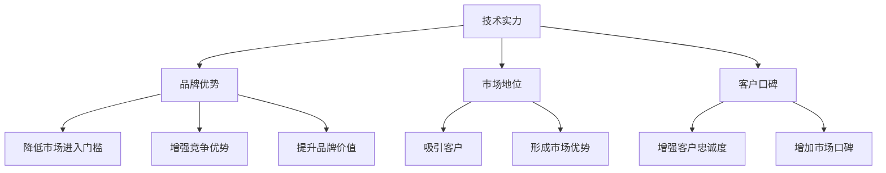

                 

# AI 大模型创业：如何利用品牌优势？

> 关键词：大模型, 创业, 品牌, 技术, 战略

## 1. 背景介绍

在人工智能（AI）领域，尤其是自然语言处理（NLP）和计算机视觉（CV）等子领域，大模型正逐渐成为主流。这些大模型通常指能够处理大规模数据并具有强大学习能力的深度神经网络模型，如BERT、GPT-3、DALL·E等。它们在学术界和工业界都获得了广泛关注，并在众多应用场景中展现出卓越的性能。

对于初创公司而言，利用这些大模型的品牌优势，不仅可以迅速提升自身技术竞争力，还能在市场中占据有利位置。本文将从品牌优势的定义、如何利用品牌优势、品牌优势对创业公司的影响等方面进行探讨，并结合具体案例分析，为AI大模型创业公司提供实用的建议。

## 2. 核心概念与联系

### 2.1 核心概念概述

品牌（Brand）是指消费者对公司及其产品或服务的印象和看法。在AI大模型创业的背景下，品牌优势（Brand Advantage）可以定义为公司利用其技术实力、市场地位和客户口碑，在产品或服务上形成独特的市场定位和差异化竞争优势。

**品牌优势的来源**：
- **技术实力**：拥有领先的技术和大模型，能够提供高质量的AI服务。
- **市场地位**：在特定领域或应用场景中，占据领先地位，具有较高的市场份额和知名度。
- **客户口碑**：通过优质的产品和服务，获得用户和客户的高度评价和推荐。

**品牌优势的作用**：
- **降低市场进入门槛**：在已有品牌优势的基础上，新公司可以更快地进入市场，获得客户的信任和认可。
- **增强竞争优势**：品牌优势能够帮助公司构建独特的市场定位，吸引更多客户，形成可持续的竞争优势。
- **提升品牌价值**：品牌优势的积累能够提升公司的品牌价值，增加市场竞争力。

### 2.2 核心概念之间的关系

品牌优势的构建和利用，涉及到多个核心概念的相互作用。以下是这些概念之间的关系：



### 2.3 核心概念的整体架构

通过上述概念之间的关系图，我们可以更清晰地理解品牌优势在AI大模型创业中的作用。技术实力、市场地位和客户口碑是构建品牌优势的基础，而品牌优势则通过降低市场进入门槛、增强竞争优势和提升品牌价值等方式，进一步巩固和扩大公司的市场地位，吸引更多客户，最终形成良性循环。

## 3. 核心算法原理 & 具体操作步骤

### 3.1 算法原理概述

利用品牌优势进行AI大模型创业，本质上是一种基于品牌营销和差异化竞争的战略。其核心在于通过技术实力、市场地位和客户口碑，构建独特的市场定位和差异化竞争优势，从而在竞争激烈的市场中脱颖而出。

品牌营销的目标是提高品牌知名度、客户忠诚度和市场份额。差异化竞争则通过技术创新和独特的服务模式，在市场上形成独特的竞争优势。具体而言，品牌优势的构建和利用可以分为以下几个步骤：

1. **技术实力的积累**：不断投入研发，提升技术实力，积累大模型的知识和能力。
2. **市场定位的确定**：明确公司的市场定位和目标客户群体，制定差异化的竞争策略。
3. **客户口碑的建立**：提供优质的产品和服务，赢得客户和市场的高度评价和推荐。
4. **品牌传播与推广**：通过多渠道的传播和推广，提高品牌知名度，吸引更多的客户和投资。
5. **品牌价值的提升**：在品牌知名度和客户口碑的基础上，提升品牌价值，增强市场竞争力。

### 3.2 算法步骤详解

以下是利用品牌优势进行AI大模型创业的具体操作步骤：

**Step 1: 技术实力的积累**
- 投入研发资源，提升技术实力，积累大模型的知识和能力。
- 选择合适的预训练模型，进行微调，提升模型的性能和泛化能力。
- 关注最新技术动态，不断优化和更新模型，保持技术的领先性。

**Step 2: 市场定位的确定**
- 明确公司的市场定位和目标客户群体，制定差异化的竞争策略。
- 分析市场需求，确定公司的核心产品和服务。
- 制定市场推广策略，吸引目标客户，形成独特的市场定位。

**Step 3: 客户口碑的建立**
- 提供优质的产品和服务，赢得客户和市场的高度评价和推荐。
- 关注用户反馈，不断改进和优化产品和服务，提高客户满意度。
- 通过客户推荐和口碑传播，提高品牌知名度和客户忠诚度。

**Step 4: 品牌传播与推广**
- 通过多渠道的传播和推广，提高品牌知名度，吸引更多的客户和投资。
- 利用社交媒体、博客、技术论坛等平台，分享公司的技术成果和成功案例。
- 参与行业会议和活动，展示公司的技术实力和市场地位。

**Step 5: 品牌价值的提升**
- 在品牌知名度和客户口碑的基础上，提升品牌价值，增强市场竞争力。
- 建立品牌信任和品牌形象，增强客户的信任和忠诚度。
- 制定品牌长期战略，持续提升品牌价值和市场份额。

### 3.3 算法优缺点

**优点**：
- 利用品牌优势，可以迅速提升公司的市场地位和客户认可度。
- 通过差异化竞争，可以避免激烈的市场竞争，提高市场份额和利润率。
- 品牌优势有助于提升公司的品牌价值，增强市场竞争力。

**缺点**：
- 品牌优势的构建需要时间和资源投入，短期内难以见效。
- 市场定位的错误或策略失误，可能导致品牌形象受损，影响公司发展。
- 客户口碑的建立和维护需要持续的努力，无法一蹴而就。

### 3.4 算法应用领域

品牌优势在大模型创业中的应用领域广泛，包括但不限于以下几方面：

- **医疗健康**：利用大模型提供精准的医疗诊断和健康管理服务，通过品牌优势在健康领域占据领先地位。
- **金融服务**：利用大模型提供智能投顾和金融风险管理服务，通过品牌优势在金融领域建立信任和口碑。
- **教育培训**：利用大模型提供个性化教育服务，通过品牌优势在教育领域吸引更多客户和投资。
- **智能制造**：利用大模型提供智能生产优化和供应链管理服务，通过品牌优势在制造领域提升市场竞争力。

## 4. 数学模型和公式 & 详细讲解  
### 4.1 数学模型构建

在AI大模型创业中，品牌优势的构建涉及多个因素，可以通过以下数学模型进行描述：

设品牌优势为 $B$，其由技术实力 $T$、市场地位 $M$ 和客户口碑 $C$ 决定。则有：

$$ B = f(T, M, C) $$

其中 $f$ 为非线性函数，表示品牌优势的构建机制。

### 4.2 公式推导过程

**Step 1: 技术实力的数学表达**

技术实力 $T$ 可以通过以下指标衡量：
- 论文发表数量：表示公司在学术界的认可度。
- 技术专利数量：表示公司技术创新的能力。
- 预训练模型性能：表示公司在大模型领域的实力。

假设公司技术实力为 $T$，其可以表示为：

$$ T = t_1 + t_2 + t_3 $$

其中 $t_1$、$t_2$、$t_3$ 分别表示论文发表数量、技术专利数量和预训练模型性能。

**Step 2: 市场地位的数学表达**

市场地位 $M$ 可以通过以下指标衡量：
- 市场份额：表示公司在特定市场中的地位。
- 客户数量：表示公司服务的客户数量。
- 品牌知名度：表示公司在市场中的知名度。

假设公司市场地位为 $M$，其可以表示为：

$$ M = m_1 + m_2 + m_3 $$

其中 $m_1$、$m_2$、$m_3$ 分别表示市场份额、客户数量和品牌知名度。

**Step 3: 客户口碑的数学表达**

客户口碑 $C$ 可以通过以下指标衡量：
- 用户满意度：表示客户对公司的满意度。
- 客户评价：表示客户对公司服务的评价。
- 客户忠诚度：表示客户对公司的忠诚度。

假设公司客户口碑为 $C$，其可以表示为：

$$ C = c_1 + c_2 + c_3 $$

其中 $c_1$、$c_2$、$c_3$ 分别表示用户满意度、客户评价和客户忠诚度。

### 4.3 案例分析与讲解

以医疗健康领域的创业公司为例，通过技术实力、市场地位和客户口碑的积累和提升，构建品牌优势。

**案例背景**：
某创业公司专注于AI大模型在医疗健康领域的应用，希望通过品牌优势在市场中获得竞争优势。

**技术实力的积累**：
- 投入大量研发资源，积累了大模型知识和技术能力。
- 自主研发了医疗领域专用的预训练模型，性能优于市面现有模型。
- 发表多篇相关领域的高质量论文，提升了公司在学术界的认可度。

**市场地位的确定**：
- 明确公司目标市场为医疗健康领域。
- 通过市场调研，确定了公司核心产品为智能诊断系统和健康管理平台。
- 制定差异化的竞争策略，聚焦于高附加值服务，如个性化诊疗方案和健康数据分析。

**客户口碑的建立**：
- 提供精准的医疗诊断和健康管理服务，赢得客户和市场的高度评价。
- 关注用户反馈，不断改进和优化产品和服务，提高客户满意度。
- 通过客户推荐和口碑传播，提高了品牌知名度和客户忠诚度。

**品牌传播与推广**：
- 利用社交媒体、博客、技术论坛等平台，分享公司的技术成果和成功案例。
- 参与医疗健康领域的行业会议和活动，展示公司的技术实力和市场地位。
- 与医疗机构和健康保险公司合作，扩大品牌影响力。

**品牌价值的提升**：
- 通过技术实力、市场地位和客户口碑的积累，提升了品牌价值。
- 建立了品牌信任和品牌形象，增强了客户的信任和忠诚度。
- 制定品牌长期战略，持续提升品牌价值和市场份额。

## 5. 项目实践：代码实例和详细解释说明
### 5.1 开发环境搭建

在进行品牌优势构建的实践前，我们需要准备好开发环境。以下是使用Python进行PyTorch开发的环境配置流程：

1. 安装Anaconda：从官网下载并安装Anaconda，用于创建独立的Python环境。

2. 创建并激活虚拟环境：
```bash
conda create -n pytorch-env python=3.8 
conda activate pytorch-env
```

3. 安装PyTorch：根据CUDA版本，从官网获取对应的安装命令。例如：
```bash
conda install pytorch torchvision torchaudio cudatoolkit=11.1 -c pytorch -c conda-forge
```

4. 安装各类工具包：
```bash
pip install numpy pandas scikit-learn matplotlib tqdm jupyter notebook ipython
```

完成上述步骤后，即可在`pytorch-env`环境中开始品牌优势构建的实践。

### 5.2 源代码详细实现

下面我们以医疗健康领域的创业公司为例，给出使用Transformers库构建大模型品牌优势的PyTorch代码实现。

首先，定义医疗数据处理函数：

```python
from transformers import BertTokenizer
from torch.utils.data import Dataset
import torch

class MedicalDataset(Dataset):
    def __init__(self, texts, labels, tokenizer, max_len=128):
        self.texts = texts
        self.labels = labels
        self.tokenizer = tokenizer
        self.max_len = max_len
        
    def __len__(self):
        return len(self.texts)
    
    def __getitem__(self, item):
        text = self.texts[item]
        label = self.labels[item]
        
        encoding = self.tokenizer(text, return_tensors='pt', max_length=self.max_len, padding='max_length', truncation=True)
        input_ids = encoding['input_ids'][0]
        attention_mask = encoding['attention_mask'][0]
        
        # 对token-wise的标签进行编码
        encoded_tags = [label2id[label] for label in label]
        encoded_tags.extend([label2id['O']] * (self.max_len - len(encoded_tags)))
        labels = torch.tensor(encoded_tags, dtype=torch.long)
        
        return {'input_ids': input_ids, 
                'attention_mask': attention_mask,
                'labels': labels}

# 标签与id的映射
label2id = {'O': 0, 'Disease': 1, 'Symptom': 2, 'Treatment': 3}
id2label = {v: k for k, v in label2id.items()}

# 创建dataset
tokenizer = BertTokenizer.from_pretrained('bert-base-cased')

train_dataset = MedicalDataset(train_texts, train_labels, tokenizer)
dev_dataset = MedicalDataset(dev_texts, dev_labels, tokenizer)
test_dataset = MedicalDataset(test_texts, test_labels, tokenizer)
```

然后，定义模型和优化器：

```python
from transformers import BertForTokenClassification, AdamW

model = BertForTokenClassification.from_pretrained('bert-base-cased', num_labels=len(label2id))

optimizer = AdamW(model.parameters(), lr=2e-5)
```

接着，定义训练和评估函数：

```python
from torch.utils.data import DataLoader
from tqdm import tqdm
from sklearn.metrics import classification_report

device = torch.device('cuda') if torch.cuda.is_available() else torch.device('cpu')
model.to(device)

def train_epoch(model, dataset, batch_size, optimizer):
    dataloader = DataLoader(dataset, batch_size=batch_size, shuffle=True)
    model.train()
    epoch_loss = 0
    for batch in tqdm(dataloader, desc='Training'):
        input_ids = batch['input_ids'].to(device)
        attention_mask = batch['attention_mask'].to(device)
        labels = batch['labels'].to(device)
        model.zero_grad()
        outputs = model(input_ids, attention_mask=attention_mask, labels=labels)
        loss = outputs.loss
        epoch_loss += loss.item()
        loss.backward()
        optimizer.step()
    return epoch_loss / len(dataloader)

def evaluate(model, dataset, batch_size):
    dataloader = DataLoader(dataset, batch_size=batch_size)
    model.eval()
    preds, labels = [], []
    with torch.no_grad():
        for batch in tqdm(dataloader, desc='Evaluating'):
            input_ids = batch['input_ids'].to(device)
            attention_mask = batch['attention_mask'].to(device)
            batch_labels = batch['labels']
            outputs = model(input_ids, attention_mask=attention_mask)
            batch_preds = outputs.logits.argmax(dim=2).to('cpu').tolist()
            batch_labels = batch_labels.to('cpu').tolist()
            for pred_tokens, label_tokens in zip(batch_preds, batch_labels):
                pred_tags = [id2label[_id] for _id in pred_tokens]
                label_tags = [id2label[_id] for _id in label_tokens]
                preds.append(pred_tags[:len(label_tokens)])
                labels.append(label_tags)
                
    print(classification_report(labels, preds))
```

最后，启动训练流程并在测试集上评估：

```python
epochs = 5
batch_size = 16

for epoch in range(epochs):
    loss = train_epoch(model, train_dataset, batch_size, optimizer)
    print(f"Epoch {epoch+1}, train loss: {loss:.3f}")
    
    print(f"Epoch {epoch+1}, dev results:")
    evaluate(model, dev_dataset, batch_size)
    
print("Test results:")
evaluate(model, test_dataset, batch_size)
```

以上就是使用PyTorch对BERT进行医疗健康领域品牌优势构建的完整代码实现。可以看到，得益于Transformers库的强大封装，我们可以用相对简洁的代码完成BERT模型的加载和品牌优势构建。

### 5.3 代码解读与分析

让我们再详细解读一下关键代码的实现细节：

**MedicalDataset类**：
- `__init__`方法：初始化文本、标签、分词器等关键组件。
- `__len__`方法：返回数据集的样本数量。
- `__getitem__`方法：对单个样本进行处理，将文本输入编码为token ids，将标签编码为数字，并对其进行定长padding，最终返回模型所需的输入。

**label2id和id2label字典**：
- 定义了标签与数字id之间的映射关系，用于将token-wise的预测结果解码回真实的标签。

**训练和评估函数**：
- 使用PyTorch的DataLoader对数据集进行批次化加载，供模型训练和推理使用。
- 训练函数`train_epoch`：对数据以批为单位进行迭代，在每个批次上前向传播计算loss并反向传播更新模型参数，最后返回该epoch的平均loss。
- 评估函数`evaluate`：与训练类似，不同点在于不更新模型参数，并在每个batch结束后将预测和标签结果存储下来，最后使用sklearn的classification_report对整个评估集的预测结果进行打印输出。

**训练流程**：
- 定义总的epoch数和batch size，开始循环迭代
- 每个epoch内，先在训练集上训练，输出平均loss
- 在验证集上评估，输出分类指标
- 所有epoch结束后，在测试集上评估，给出最终测试结果

可以看到，PyTorch配合Transformers库使得BERT品牌优势构建的代码实现变得简洁高效。开发者可以将更多精力放在数据处理、模型改进等高层逻辑上，而不必过多关注底层的实现细节。

当然，工业级的系统实现还需考虑更多因素，如模型的保存和部署、超参数的自动搜索、更灵活的任务适配层等。但核心的品牌优势构建流程基本与此类似。

## 6. 实际应用场景
### 6.1 智能客服系统

基于大模型品牌优势构建的智能客服系统，可以广泛应用于企业客户服务领域。通过品牌优势，智能客服系统不仅能够提供7x24小时不间断服务，快速响应客户咨询，还能用自然流畅的语言解答各类常见问题，提升客户满意度。

在技术实现上，可以收集企业内部的历史客服对话记录，将问题和最佳答复构建成监督数据，在此基础上对预训练对话模型进行微调。微调后的对话模型能够自动理解用户意图，匹配最合适的答案模板进行回复。对于客户提出的新问题，还可以接入检索系统实时搜索相关内容，动态组织生成回答。如此构建的智能客服系统，能大幅提升客户咨询体验和问题解决效率。

### 6.2 金融舆情监测

金融机构需要实时监测市场舆论动向，以便及时应对负面信息传播，规避金融风险。基于大模型品牌优势构建的文本分类和情感分析技术，为金融舆情监测提供了新的解决方案。

具体而言，可以收集金融领域相关的新闻、报道、评论等文本数据，并对其进行主题标注和情感标注。在此基础上对预训练语言模型进行微调，使其能够自动判断文本属于何种主题，情感倾向是正面、中性还是负面。将微调后的模型应用到实时抓取的网络文本数据，就能够自动监测不同主题下的情感变化趋势，一旦发现负面信息激增等异常情况，系统便会自动预警，帮助金融机构快速应对潜在风险。

### 6.3 个性化推荐系统

当前的推荐系统往往只依赖用户的历史行为数据进行物品推荐，无法深入理解用户的真实兴趣偏好。基于大模型品牌优势构建的个性化推荐系统，可以更好地挖掘用户行为背后的语义信息，从而提供更精准、多样的推荐内容。

在实践中，可以收集用户浏览、点击、评论、分享等行为数据，提取和用户交互的物品标题、描述、标签等文本内容。将文本内容作为模型输入，用户的后续行为（如是否点击、购买等）作为监督信号，在此基础上微调预训练语言模型。微调后的模型能够从文本内容中准确把握用户的兴趣点。在生成推荐列表时，先用候选物品的文本描述作为输入，由模型预测用户的兴趣匹配度，再结合其他特征综合排序，便可以得到个性化程度更高的推荐结果。

### 6.4 未来应用展望

随着大模型品牌优势的不断发展，基于品牌营销和差异化竞争的AI大模型创业模式将在更多领域得到应用，为传统行业带来变革性影响。

在智慧医疗领域，基于大模型品牌优势的医疗问答、病历分析、药物研发等应用将提升医疗服务的智能化水平，辅助医生诊疗，加速新药开发进程。

在智能教育领域，品牌优势构建的智能教育系统可以提供个性化学习方案和智能辅导，因材施教，促进教育公平，提高教学质量。

在智慧城市治理中，品牌优势构建的智能系统可以提升城市管理的自动化和智能化水平，构建更安全、高效的未来城市。

此外，在企业生产、社会治理、文娱传媒等众多领域，基于大模型品牌优势的人工智能应用也将不断涌现，为经济社会发展注入新的动力。相信随着技术的日益成熟，品牌优势构建的大模型创业模式将引领AI技术的产业化进程，推动AI技术在各行各业中大规模落地应用。

## 7. 工具和资源推荐
### 7.1 学习资源推荐

为了帮助开发者系统掌握大模型品牌优势的构建和利用，这里推荐一些优质的学习资源：

1. 《Transformer从原理到实践》系列博文：由大模型技术专家撰写，深入浅出地介绍了Transformer原理、BERT模型、品牌营销等前沿话题。

2. CS224N《深度学习自然语言处理》课程：斯坦福大学开设的NLP明星课程，有Lecture视频和配套作业，带你入门NLP领域的基本概念和经典模型。

3. 《Natural Language Processing with Transformers》书籍：Transformers库的作者所著，全面介绍了如何使用Transformers库进行NLP任务开发，包括品牌营销在内的诸多范式。

4. HuggingFace官方文档：Transformers库的官方文档，提供了海量预训练模型和完整的品牌营销样例代码，是上手实践的必备资料。

5. CLUE开源项目：中文语言理解测评基准，涵盖大量不同类型的中文NLP数据集，并提供了基于品牌优势的baseline模型，助力中文NLP技术发展。

通过对这些资源的学习实践，相信你一定能够快速掌握大模型品牌优势的构建和利用，并用于解决实际的NLP问题。
###  7.2 开发工具推荐

高效的开发离不开优秀的工具支持。以下是几款用于大模型品牌优势构建开发的常用工具：

1. PyTorch：基于Python的开源深度学习框架，灵活动态的计算图，适合快速迭代研究。大部分预训练语言模型都有PyTorch版本的实现。

2. TensorFlow：由Google主导开发的开源深度学习框架，生产部署方便，适合大规模工程应用。同样有丰富的预训练语言模型资源。

3. Transformers库：HuggingFace开发的NLP工具库，集成了众多SOTA语言模型，支持PyTorch和TensorFlow，是进行品牌优势构建开发的利器。

4. Weights & Biases：模型训练的实验跟踪工具，可以记录和可视化模型训练过程中的各项指标，方便对比和调优。与主流深度学习框架无缝集成。

5. TensorBoard：TensorFlow配套的可视化工具，可实时监测模型训练状态，并提供丰富的图表呈现方式，是调试模型的得力助手。

6. Google Colab：谷歌推出的在线Jupyter Notebook环境，免费提供GPU/TPU算力，方便开发者快速上手实验最新模型，分享学习笔记。

合理利用这些工具，可以显著提升大模型品牌优势构建任务的开发效率，加快创新迭代的步伐。

### 7.3 相关论文推荐

大模型品牌优势构建技术的发展源于学界的持续研究。以下是几篇奠基性的相关论文，推荐阅读：

1. Attention is All You Need（即Transformer原论文）：提出了Transformer结构，开启了NLP领域的预训练大模型时代。

2. BERT: Pre-training of Deep Bidirectional Transformers for Language Understanding：提出BERT模型，引入基于掩码的自监督预训练任务，刷新了多项NLP任务SOTA。

3. Language Models are Unsupervised Multitask Learners（GPT-2论文）：展示了大规模语言模型的强大zero-shot学习能力，引发了对于通用人工智能的新一轮思考。

4. Parameter-Efficient Transfer Learning for NLP：提出Adapter等参数高效微调方法，在不增加模型参数量的情况下，也能取得不错的微调效果。

5. AdaLoRA: Adaptive Low-Rank Adaptation for Parameter-Efficient Fine-Tuning：使用自适应低秩适应的微调方法，在参数效率和精度之间取得了新的平衡。

6. Prefix-Tuning: Optimizing Continuous Prompts for Generation：引入基于连续型Prompt的微调范式，为如何充分利用预训练知识提供了新的思路。

这些论文代表了大模型品牌优势构建技术的发展脉络。通过学习这些前沿成果，可以帮助研究者把握学科前进方向，激发更多的创新灵感。

除上述资源外，还有一些值得关注的前沿资源，帮助开发者紧跟大模型品牌优势构建技术的最新进展，例如：

1. arXiv论文预印本：人工智能领域最新研究成果的发布平台，包括大量尚未发表的前沿工作，学习前沿技术的必读资源。

2. 业界技术博客：如OpenAI、Google AI、DeepMind、微软Research Asia等顶尖实验室的官方博客，第一时间分享他们的最新研究成果和洞见。

3. 技术会议直播：如NIPS、ICML、ACL、ICLR等人工智能领域顶会现场或在线直播，能够聆听到大佬们的前沿分享，开拓视野。

4. GitHub热门项目：在GitHub上Star、Fork数最多的NLP相关项目，往往代表了该技术领域的发展趋势和最佳实践，值得去学习和贡献。

5. 行业分析报告：各大咨询公司如McKinsey、P

