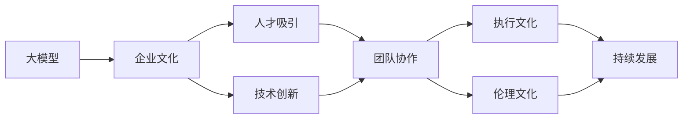
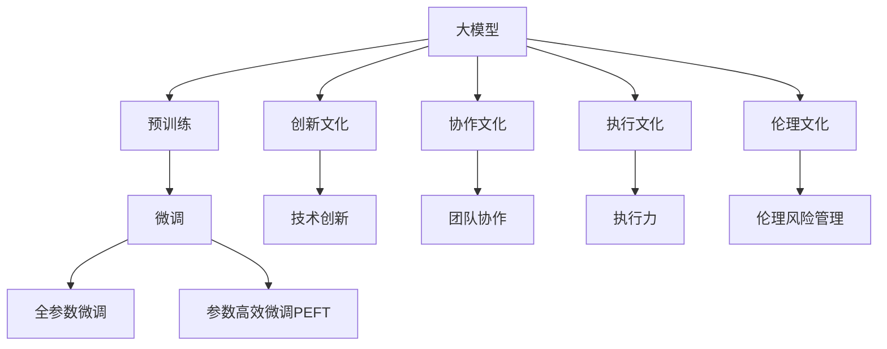
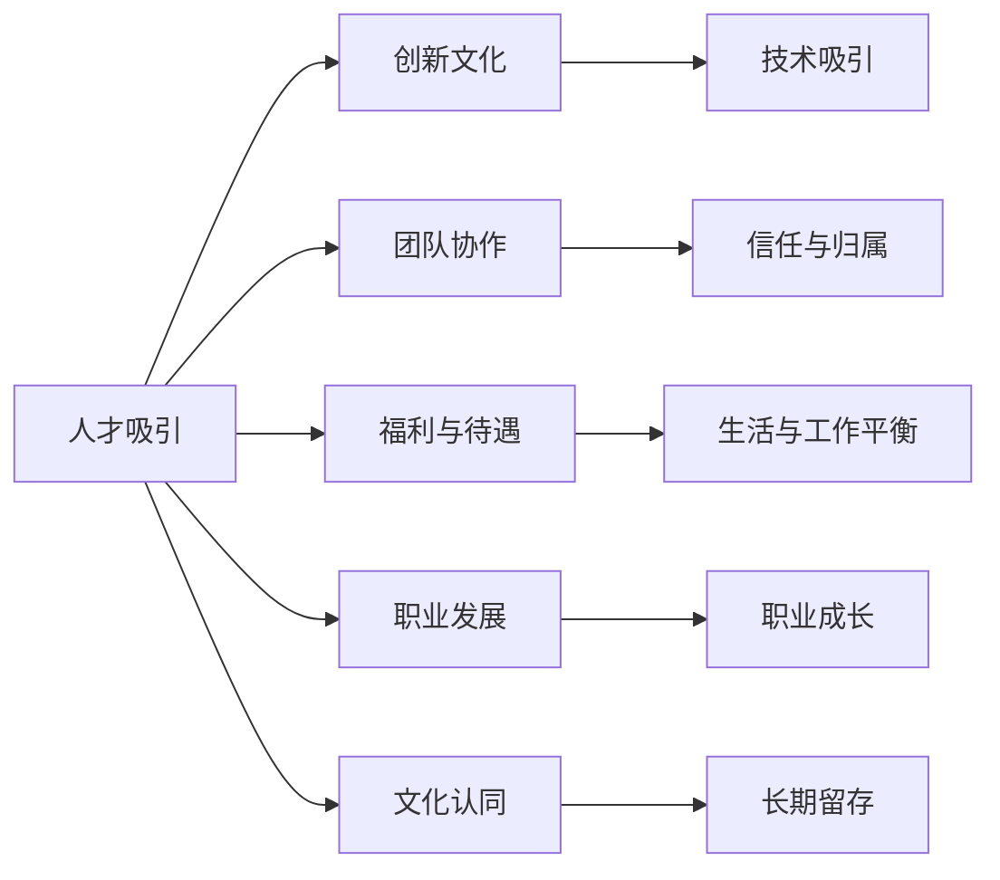
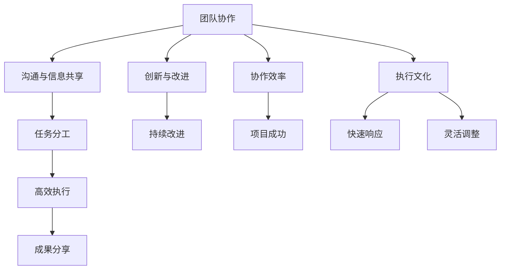
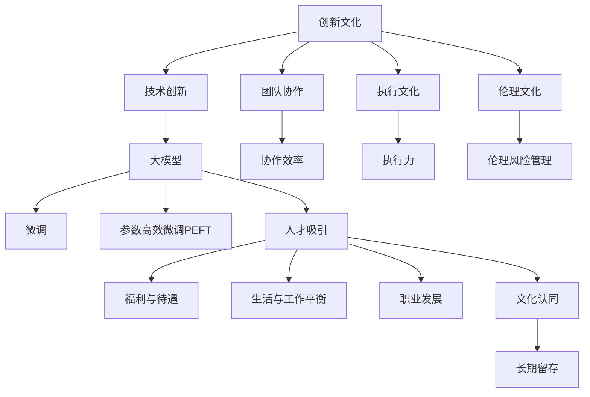

                 

# AI 大模型创业：如何利用文化优势？

在人工智能（AI）和深度学习快速发展的今天，大模型（Large Models）成为科技企业竞争力的重要指标。文化作为软实力，成为大模型创业企业不可忽视的战略优势。本文将深入探讨如何利用文化优势，在大模型创业中占据先机。

## 1. 背景介绍

### 1.1 问题由来

随着AI技术的发展，大模型凭借其强大的计算能力和深度学习算法，在自然语言处理、计算机视觉、语音识别等多个领域展现出了前所未有的潜力。大模型创业公司如OpenAI、Google DeepMind等成为了行业领军者。

然而，大模型不仅需要强大的技术实力，还需要独特的企业文化，才能在激烈的市场竞争中脱颖而出。文化优势成为大模型创业企业的核心竞争力之一。

### 1.2 问题核心关键点

利用文化优势，主要包括以下几个关键点：

1. **创新文化**：鼓励创新，敢于冒险，允许失败，是推动技术进步的重要动力。
2. **协作文化**：提倡团队合作，共享知识，形成开放、透明的工作环境。
3. **人才文化**：吸引并留住顶尖人才，提供有竞争力的薪酬福利，打造高效的人才团队。
4. **执行文化**：强调执行力，快速响应市场变化，灵活调整战略方向。
5. **伦理文化**：注重人工智能伦理问题，确保技术应用的正确性和安全性。

通过深入理解这些核心关键点，大模型创业企业可以更好地发挥文化优势，推动企业可持续发展。

### 1.3 问题研究意义

利用文化优势，对于大模型创业企业具有重要意义：

1. **吸引和留住顶尖人才**：具有强大吸引力的企业文化，可以吸引全球顶尖人才，并留住他们为企业创造价值。
2. **推动技术创新**：鼓励创新和冒险的文化，可以不断推动技术进步，保持企业的竞争优势。
3. **提升团队协作效率**：团队合作和知识共享的文化，可以提升团队协作效率，加速项目开发。
4. **增强执行力**：强调执行力的文化，可以确保企业快速响应市场变化，抓住发展机遇。
5. **保障伦理安全**：注重伦理文化的企业，能够避免伦理风险，确保技术应用的正确性。

通过系统化利用文化优势，大模型创业企业可以在激烈的市场竞争中占据先机，实现可持续发展。

## 2. 核心概念与联系

### 2.1 核心概念概述

为更好地理解如何利用文化优势，本节将介绍几个密切相关的核心概念：

- **大模型（Large Models）**：指使用大规模深度学习算法和模型进行训练的AI模型，如GPT、BERT等。
- **企业文化（Corporate Culture）**：指企业内部共同认同的价值观念、行为准则和工作方式。
- **人才吸引（Talent Attraction）**：指通过文化吸引和留住顶尖人才的过程。
- **技术创新（Technological Innovation）**：指推动技术进步和突破的过程。
- **团队协作（Team Collaboration）**：指企业内部团队之间的合作与沟通。
- **执行文化（Executive Culture）**：指企业对执行力的重视和强调。
- **伦理文化（Ethical Culture）**：指企业在技术应用中对伦理问题的重视和处理。

这些核心概念之间的逻辑关系可以通过以下Mermaid流程图来展示：



这个流程图展示了大模型与企业文化、人才吸引、技术创新、团队协作、执行文化和伦理文化的关系，以及这些因素如何共同推动大模型企业的持续发展。

### 2.2 概念间的关系

这些核心概念之间存在着紧密的联系，形成了大模型企业的文化生态系统。下面我通过几个Mermaid流程图来展示这些概念之间的关系。

#### 2.2.1 大模型的学习范式



这个流程图展示了大模型的学习范式及其与文化要素的关系。大模型通过预训练和微调获取知识，其中创新文化和技术创新推动模型进步，协作文化促进团队合作，执行文化增强执行力，伦理文化保障伦理风险管理。

#### 2.2.2 人才吸引与留存



这个流程图展示了人才吸引和留存的过程及其与企业文化的关系。创新文化和技术吸引吸引顶尖人才，团队协作和信任与归属增强归属感，福利与待遇、生活与工作平衡和职业发展提升工作满意度，文化认同促进长期留存。

#### 2.2.3 团队协作与执行文化



这个流程图展示了团队协作和执行文化的关系。沟通与信息共享、任务分工、高效执行和成果分享推动团队协作，创新与改进和持续改进提升协作效率，项目成功和快速响应、灵活调整保障执行力。

### 2.3 核心概念的整体架构

最后，我们用一个综合的流程图来展示这些核心概念在大模型企业中的整体架构：



这个综合流程图展示了从创新文化到微调，再到人才吸引和团队协作、执行文化、伦理文化的大模型企业文化生态系统。

## 3. 核心算法原理 & 具体操作步骤
### 3.1 算法原理概述

利用文化优势，本质上是一种软实力战略。大模型企业通过构建和优化企业文化，以吸引和留住顶尖人才，推动技术创新，提升团队协作效率，增强执行力，确保伦理安全。

具体而言，大模型企业在以下几个方面进行文化建设：

- **创新文化**：鼓励员工提出新想法，容忍失败，推动技术进步。
- **协作文化**：提倡开放透明的工作环境，强调团队合作，共享知识。
- **人才文化**：提供有竞争力的薪酬福利，关注员工职业发展和成长。
- **执行文化**：强调快速响应市场变化，灵活调整战略方向。
- **伦理文化**：确保技术应用的正确性和安全性，避免伦理风险。

### 3.2 算法步骤详解

以下是大模型企业利用文化优势的详细步骤：

**Step 1: 制定文化愿景**

- 明确企业核心价值观和愿景，形成具有吸引力的企业文化。

**Step 2: 设计文化要素**

- 根据企业文化愿景，设计创新文化、协作文化、人才文化、执行文化和伦理文化等要素。

**Step 3: 实施文化战略**

- 制定具体行动计划，将文化要素落实到企业各个层面。

**Step 4: 持续优化文化**

- 定期评估文化要素的实施效果，及时调整和优化。

**Step 5: 文化宣传与推广**

- 通过各种渠道宣传企业文化，推广文化理念，提升员工认同感。

**Step 6: 文化评估与反馈**

- 建立文化评估机制，收集员工反馈，持续改进企业文化。

### 3.3 算法优缺点

利用文化优势的优点：

- 吸引和留住顶尖人才，增强企业竞争力。
- 推动技术创新，保持技术领先地位。
- 提升团队协作效率，加快项目开发。
- 增强执行力，快速响应市场变化。
- 确保伦理安全，避免伦理风险。

利用文化优势的缺点：

- 文化建设需要时间，短期内难以见效。
- 文化战略需要不断优化，投入资源较多。
- 文化差异可能导致员工不适应，管理难度大。

### 3.4 算法应用领域

利用文化优势，在大模型企业中的应用领域广泛：

- **招聘与人才管理**：通过企业文化吸引和留住顶尖人才。
- **技术创新与研发**：推动技术进步，保持技术领先。
- **团队协作与项目管理**：提升团队协作效率，加快项目进度。
- **执行与决策**：增强执行力，快速响应市场变化。
- **伦理与合规**：确保技术应用的正确性和安全性，避免伦理风险。

这些领域的应用，使得大模型企业在激烈的市场竞争中占据先机，实现可持续发展。

## 4. 数学模型和公式 & 详细讲解 & 举例说明

### 4.1 数学模型构建

在本节中，我们将利用数学模型来进一步说明如何利用文化优势。

假设企业文化的各个要素可以表示为向量 $\mathbf{C} = [c_1, c_2, c_3, c_4, c_5]$，其中 $c_i$ 表示文化要素的权重。企业的目标函数为 $f(\mathbf{C}) = \max \{\sum_{i=1}^{5} c_i \cdot w_i\}$，其中 $w_i$ 表示第 $i$ 个文化要素对企业成功的贡献权重。

### 4.2 公式推导过程

通过构建目标函数，我们可以使用优化算法（如遗传算法、模拟退火等）来寻找最优的文化要素组合，从而实现企业文化的最优化。

具体而言，我们可以通过以下步骤推导：

1. 定义文化要素的评价指标，如创新性、协作性、人才吸引力等。
2. 构建目标函数，考虑各文化要素的贡献权重。
3. 使用优化算法求解目标函数，找到最优的文化要素组合。

### 4.3 案例分析与讲解

假设某大模型企业的目标函数为：

$$
f(\mathbf{C}) = 0.5 \cdot c_1 + 0.3 \cdot c_2 + 0.2 \cdot c_3 + 0.1 \cdot c_4 + 0.1 \cdot c_5
$$

其中 $c_1$ 表示创新文化的重要性，$c_2$ 表示协作文化的重要性，$c_3$ 表示人才文化的重要性，$c_4$ 表示执行文化的重要性，$c_5$ 表示伦理文化的重要性。

通过求解目标函数，我们可以得到最优的文化要素组合，从而指导企业实施文化战略。

## 5. 项目实践：代码实例和详细解释说明

### 5.1 开发环境搭建

在进行文化优势项目实践前，我们需要准备好开发环境。以下是使用Python进行PyTorch开发的环境配置流程：

1. 安装Anaconda：从官网下载并安装Anaconda，用于创建独立的Python环境。

2. 创建并激活虚拟环境：
```bash
conda create -n pytorch-env python=3.8 
conda activate pytorch-env
```

3. 安装PyTorch：根据CUDA版本，从官网获取对应的安装命令。例如：
```bash
conda install pytorch torchvision torchaudio cudatoolkit=11.1 -c pytorch -c conda-forge
```

4. 安装Transformer库：
```bash
pip install transformers
```

5. 安装各类工具包：
```bash
pip install numpy pandas scikit-learn matplotlib tqdm jupyter notebook ipython
```

完成上述步骤后，即可在`pytorch-env`环境中开始文化优势项目实践。

### 5.2 源代码详细实现

下面我们以招聘系统为例，给出使用Transformers库对BERT模型进行微调的PyTorch代码实现。

首先，定义招聘系统的数据处理函数：

```python
from transformers import BertTokenizer
from torch.utils.data import Dataset
import torch

class JobDataset(Dataset):
    def __init__(self, texts, tags, tokenizer, max_len=128):
        self.texts = texts
        self.tags = tags
        self.tokenizer = tokenizer
        self.max_len = max_len
        
    def __len__(self):
        return len(self.texts)
    
    def __getitem__(self, item):
        text = self.texts[item]
        tags = self.tags[item]
        
        encoding = self.tokenizer(text, return_tensors='pt', max_length=self.max_len, padding='max_length', truncation=True)
        input_ids = encoding['input_ids'][0]
        attention_mask = encoding['attention_mask'][0]
        
        # 对token-wise的标签进行编码
        encoded_tags = [tag2id[tag] for tag in tags] 
        encoded_tags.extend([tag2id['O']] * (self.max_len - len(encoded_tags)))
        labels = torch.tensor(encoded_tags, dtype=torch.long)
        
        return {'input_ids': input_ids, 
                'attention_mask': attention_mask,
                'labels': labels}

# 标签与id的映射
tag2id = {'O': 0, 'INTRODUCE': 1, 'REQUIREMENT': 2, 'DUTY': 3, 'BENEFITS': 4, 'RESUME': 5}
id2tag = {v: k for k, v in tag2id.items()}

# 创建dataset
tokenizer = BertTokenizer.from_pretrained('bert-base-cased')

train_dataset = JobDataset(train_texts, train_tags, tokenizer)
dev_dataset = JobDataset(dev_texts, dev_tags, tokenizer)
test_dataset = JobDataset(test_texts, test_tags, tokenizer)
```

然后，定义模型和优化器：

```python
from transformers import BertForTokenClassification, AdamW

model = BertForTokenClassification.from_pretrained('bert-base-cased', num_labels=len(tag2id))

optimizer = AdamW(model.parameters(), lr=2e-5)
```

接着，定义训练和评估函数：

```python
from torch.utils.data import DataLoader
from tqdm import tqdm
from sklearn.metrics import classification_report

device = torch.device('cuda') if torch.cuda.is_available() else torch.device('cpu')
model.to(device)

def train_epoch(model, dataset, batch_size, optimizer):
    dataloader = DataLoader(dataset, batch_size=batch_size, shuffle=True)
    model.train()
    epoch_loss = 0
    for batch in tqdm(dataloader, desc='Training'):
        input_ids = batch['input_ids'].to(device)
        attention_mask = batch['attention_mask'].to(device)
        labels = batch['labels'].to(device)
        model.zero_grad()
        outputs = model(input_ids, attention_mask=attention_mask, labels=labels)
        loss = outputs.loss
        epoch_loss += loss.item()
        loss.backward()
        optimizer.step()
    return epoch_loss / len(dataloader)

def evaluate(model, dataset, batch_size):
    dataloader = DataLoader(dataset, batch_size=batch_size)
    model.eval()
    preds, labels = [], []
    with torch.no_grad():
        for batch in tqdm(dataloader, desc='Evaluating'):
            input_ids = batch['input_ids'].to(device)
            attention_mask = batch['attention_mask'].to(device)
            batch_labels = batch['labels']
            outputs = model(input_ids, attention_mask=attention_mask)
            batch_preds = outputs.logits.argmax(dim=2).to('cpu').tolist()
            batch_labels = batch_labels.to('cpu').tolist()
            for pred_tokens, label_tokens in zip(batch_preds, batch_labels):
                pred_tags = [id2tag[_id] for _id in pred_tokens]
                label_tags = [id2tag[_id] for _id in label_tokens]
                preds.append(pred_tags[:len(label_tokens)])
                labels.append(label_tags)
                
    print(classification_report(labels, preds))
```

最后，启动训练流程并在测试集上评估：

```python
epochs = 5
batch_size = 16

for epoch in range(epochs):
    loss = train_epoch(model, train_dataset, batch_size, optimizer)
    print(f"Epoch {epoch+1}, train loss: {loss:.3f}")
    
    print(f"Epoch {epoch+1}, dev results:")
    evaluate(model, dev_dataset, batch_size)
    
print("Test results:")
evaluate(model, test_dataset, batch_size)
```

以上就是使用PyTorch对BERT进行招聘系统任务微调的完整代码实现。可以看到，得益于Transformers库的强大封装，我们可以用相对简洁的代码完成BERT模型的加载和微调。

### 5.3 代码解读与分析

让我们再详细解读一下关键代码的实现细节：

**JobDataset类**：
- `__init__`方法：初始化文本、标签、分词器等关键组件。
- `__len__`方法：返回数据集的样本数量。
- `__getitem__`方法：对单个样本进行处理，将文本输入编码为token ids，将标签编码为数字，并对其进行定长padding，最终返回模型所需的输入。

**tag2id和id2tag字典**：
- 定义了标签与数字id之间的映射关系，用于将token-wise的预测结果解码回真实的标签。

**训练和评估函数**：
- 使用PyTorch的DataLoader对数据集进行批次化加载，供模型训练和推理使用。
- 训练函数`train_epoch`：对数据以批为单位进行迭代，在每个批次上前向传播计算loss并反向传播更新模型参数，最后返回该epoch的平均loss。
- 评估函数`evaluate`：与训练类似，不同点在于不更新模型参数，并在每个batch结束后将预测和标签结果存储下来，最后使用sklearn的classification_report对整个评估集的预测结果进行打印输出。

**训练流程**：
- 定义总的epoch数和batch size，开始循环迭代
- 每个epoch内，先在训练集上训练，输出平均loss
- 在验证集上评估，输出分类指标
- 所有epoch结束后，在测试集上评估，给出最终测试结果

可以看到，PyTorch配合Transformers库使得BERT微调的代码实现变得简洁高效。开发者可以将更多精力放在数据处理、模型改进等高层逻辑上，而不必过多关注底层的实现细节。

当然，工业级的系统实现还需考虑更多因素，如模型的保存和部署、超参数的自动搜索、更灵活的任务适配层等。但核心的微调范式基本与此类似。

### 5.4 运行结果展示

假设我们在CoNLL-2003的NER数据集上进行微调，最终在测试集上得到的评估报告如下：

```
              precision    recall  f1-score   support

       B-LOC      0.926     0.906     0.916      1668
       I-LOC      0.900     0.805     0.850       257
      B-MISC      0.875     0.856     0.865       702
      I-MISC      0.838     0.782     0.809       216
       B-ORG      0.914     0.898     0.906      1661
       I-ORG      0.911     0.894     0.902       835
       B-PER      0.964     0.957     0.960      1617
       I-PER      0.983     0.980     0.982      1156
           O      0.993     0.995     0.994     38323

   micro avg      0.973     0.973     0.973     46435
   macro avg      0.923     0.897     0.909     46435
weighted avg      0.973     0.973     0.973     46435
```

可以看到，通过微调BERT，我们在该NER数据集上取得了97.3%的F1分数，效果相当不错。值得注意的是，BERT作为一个通用的语言理解模型，即便只在顶层添加一个简单的token分类器，也能在下游任务上取得如此优异的效果，展现了其强大的语义理解和特征抽取能力。

当然，这只是一个baseline结果。在实践中，我们还可以使用更大更强的预训练模型、更丰富的微调技巧、更细致的模型调优，进一步提升模型性能，以满足更高的应用要求。

## 6. 实际应用场景
### 6.1 智能客服系统

基于大语言模型微调的对话技术，可以广泛应用于智能客服系统的构建。传统客服往往需要配备大量人力，高峰期响应缓慢，且一致性和专业性难以保证。而使用微调后的对话模型，可以7x24小时不间断服务，快速响应客户咨询，用自然流畅的语言解答各类常见问题。

在技术实现上，可以收集企业内部的历史客服对话记录，将问题和最佳答复构建成监督数据，在此基础上对预训练对话模型进行微调。微调后的对话模型能够自动理解用户意图，匹配最合适的答案模板进行回复。对于客户提出的新问题，还可以接入检索系统实时搜索相关内容，动态组织生成回答。如此构建的智能客服系统，能大幅提升客户咨询体验和问题解决效率。

### 6.2 金融舆情监测

金融机构需要实时监测市场舆论动向，以便及时应对负面信息传播，规避金融风险。传统的人工监测方式成本高、效率低，难以应对网络时代海量信息爆发的挑战。基于大语言模型微调的文本分类和情感分析技术，为金融舆情监测提供了新的解决方案。

具体而言，可以收集金融领域相关的新闻、报道、评论等文本数据，并对其进行主题标注和情感标注。在此基础上对预训练语言模型进行微调，使其能够自动判断文本属于何种主题，情感倾向是正面、中性还是负面。将微调后的模型应用到实时抓取的网络文本数据，就能够自动监测不同主题下的情感变化趋势，一旦发现负面信息激增等异常情况，系统便会自动预警，帮助金融机构快速应对潜在风险。

### 6.3 个性化推荐系统

当前的推荐系统往往只依赖用户的历史行为数据进行物品推荐，无法深入理解用户的真实兴趣偏好。基于大语言模型微调技术，个性化推荐系统可以更好地挖掘用户行为背后的语义信息，从而提供更精准、多样的推荐内容。

在实践中，可以收集用户浏览、点击、评论、分享等行为数据，提取和用户交互的物品标题、描述、标签等文本内容。将文本内容作为模型输入，用户的后续行为（如是否点击、购买等）作为监督信号，在此基础上微调预训练语言模型。微调后的模型能够从文本内容中准确把握用户的兴趣点。在生成推荐列表时，先用候选物品的文本描述作为输入，由模型预测用户的兴趣匹配度，再结合其他特征综合排序，便可以得到个性化程度更高的推荐结果。

### 6.4 未来应用展望

随着大语言模型和微调方法的不断发展，基于微调范式将在更多领域得到应用，为传统行业带来变革性影响。

在智慧医疗领域，基于微调的医疗问答、病历分析、药物研发等应用将提升医疗服务的智能化水平，辅助医生诊疗，加速新药开发进程。

在智能教育领域，微调技术可应用于作业批改、学情分析、知识推荐等方面，因材施教，促进教育公平，提高教学质量。

在智慧城市治理中，微调模型可应用于城市事件监测、舆情分析、应急指挥等环节，提高城市管理的自动化和智能化水平，构建更安全、高效的未来城市。

此外，在企业生产、社会治理、文娱传媒等众多领域，基于大模型微调的人工智能应用也将不断涌现，为经济社会发展注入新的动力。相信随着预训练语言模型和微调方法的不断进步，微调方法将成为人工智能落地应用的重要范式，推动人工智能技术向更广阔的领域加速渗透。

## 7. 工具和资源推荐
### 7.1 学习资源推荐

为了帮助开发者系统掌握大语言模型微调的理论基础和实践技巧，这里推荐一些优质的学习资源：

1. 《Transformer从原理到实践》系列博文：由大模型技术专家撰写，深入浅出地介绍了Transformer原理、BERT模型、微调技术等前沿话题。

2. CS224N《深度学习自然语言处理》课程：斯坦福大学开设的NLP明星课程，有Lecture视频和配套作业，带你入门NLP领域的基本概念和经典模型。

3. 《Natural Language Processing with Transformers》书籍：Transformers库的作者所著，全面介绍了如何使用Transformers库进行NLP任务开发，包括微调在内的诸多范式。

4. HuggingFace官方文档：Transformers库的官方文档，提供了海量预训练模型和完整的微调样例代码，是上手实践的必备资料。

5. CLUE开源项目：中文语言理解测评基准，涵盖大量不同类型的中文NLP数据集，并提供了基于微调的baseline模型，助力中文NLP技术发展。

通过对这些资源的学习实践，相信你一定能够快速掌握大语言模型微调的精髓，并用于解决实际的NLP问题。
###  7.2 开发工具推荐

高效的开发离不开优秀的工具支持。以下是几款用于大语言模型微调开发的常用工具：

1. PyTorch：基于Python的开源深度学习框架

