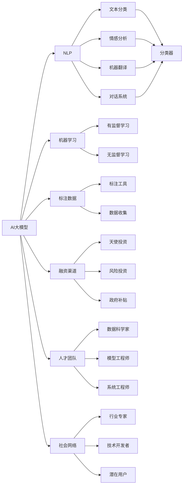
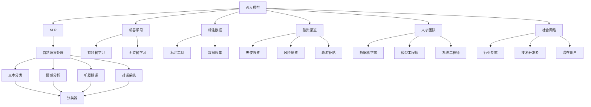

                 

# AI 大模型创业：如何利用社会优势？

> 关键词：人工智能创业、社会优势、AI大模型、自然语言处理(NLP)、机器学习

## 1. 背景介绍

### 1.1 问题由来
人工智能(AI)和自然语言处理(NLP)技术的迅猛发展，使得越来越多的AI创业项目得以落地并产生深远的影响。AI大模型作为其中的佼佼者，凭借其强大的语言理解和生成能力，在各行各业的应用中逐渐崭露头角。然而，大模型的开发和部署不仅需要顶尖的技术实力，还需要广泛的社会资源，包括数据、资金、人才等。如何在创业初期充分利用这些社会优势，是AI大模型创业能否成功的关键。

### 1.2 问题核心关键点
AI大模型创业的核心在于如何高效利用社会资源，加速模型开发和应用推广。具体来说：

1. 如何获取高质量、大规模的标注数据，构建高效的训练集。
2. 如何筹集足够的资金，确保技术的持续发展和迭代。
3. 如何吸引和培养顶尖的AI人才，构建强大的研发团队。
4. 如何有效利用社会关系网络，获取市场资源和机会。

### 1.3 问题研究意义
大模型创业的成功不仅能带来巨大的商业价值，还能推动AI技术的深入应用和普及。此外，它还能促进社会资源的合理配置和优化利用，推动各行各业数字化、智能化转型。因此，研究大模型创业的方法和策略，对于AI技术的产业化应用和社会的整体发展具有重要意义。

## 2. 核心概念与联系

### 2.1 核心概念概述

为更好地理解AI大模型创业的方法，本节将介绍几个关键概念及其之间的联系：

- **AI大模型**：以Transformer、BERT等为代表的自回归或自编码模型，通过在大规模无标签文本数据上进行预训练，学习通用的语言表示，具备强大的语言理解和生成能力。
- **自然语言处理(NLP)**：AI大模型的主要应用领域之一，涉及文本分类、情感分析、机器翻译、对话系统等多个方向。
- **机器学习**：AI大模型的核心技术，通过在大规模数据集上进行有监督或无监督学习，优化模型参数，提升模型的泛化能力。
- **标注数据**：AI大模型训练所需的高质量、大规模文本数据集，需要通过人工标注生成。
- **融资渠道**：AI大模型创业所需的外部资金支持，包括天使投资、风险投资、政府补贴等。
- **人才团队**：AI大模型开发和应用的核心要素，需要具备数据处理、模型训练、系统部署等多个方面的专业技能。
- **社会网络**：AI大模型创业者与行业专家、技术开发者、潜在用户等建立的社交关系网络，有助于获取资源和市场机会。

这些核心概念之间的联系可以用以下Mermaid流程图来展示：



### 2.2 概念间的关系

这些核心概念构成了AI大模型创业的基本框架，它们之间的关系如下图所示：



### 2.3 核心概念的整体架构

最后，我们用一个综合的流程图来展示这些核心概念在大模型创业中的整体架构：


## 3. 核心算法原理 & 具体操作步骤
### 3.1 算法原理概述

AI大模型的创业流程，本质上是一个多阶段、多维度的高效资源整合和优化过程。其核心算法原理如下：

1. **数据采集与预处理**：通过多渠道收集文本数据，并进行清洗、标注、去重等预处理步骤。
2. **模型选择与训练**：根据业务需求选择合适的预训练模型，并进行微调或重新训练，以优化模型性能。
3. **资源整合与利用**：通过有效的融资、人才招聘、社会关系网络等手段，获取和利用社会资源。
4. **市场推广与商业化**：将训练好的模型应用到实际场景中，通过市场推广和商业化策略，实现模型的价值最大化。

### 3.2 算法步骤详解

以下是AI大模型创业的详细步骤：

**Step 1: 数据采集与预处理**
1. **数据来源**：
   - 公开数据集：如Wikipedia、维基百科、新闻站点等。
   - 合作伙伴数据：如电商平台、社交媒体、医疗系统等。
   - 用户生成数据：如客服聊天记录、用户评论、反馈等。
2. **数据清洗**：
   - 去除无用信息：如HTML标签、特殊符号等。
   - 去重处理：保证数据样本的唯一性。
   - 格式统一：将不同来源的数据统一格式。
3. **标注与注释**：
   - 人工标注：使用专业标注团队对数据进行标注。
   - 半自动标注：结合机器学习模型进行半自动标注。
   - 数据增强：使用文本回译、数据合成等方法扩充数据集。

**Step 2: 模型选择与训练**
1. **预训练模型选择**：
   - 开源预训练模型：如BERT、GPT等。
   - 定制预训练模型：根据业务需求重新训练。
2. **微调策略**：
   - 监督微调：在标注数据集上进行有监督学习。
   - 少样本学习：在少量标注样本上快速适应新任务。
   - 迁移学习：利用已有模型的知识，提升新任务的性能。
3. **模型优化**：
   - 调整超参数：如学习率、批大小、迭代轮数等。
   - 正则化技术：如L2正则、Dropout等。
   - 参数高效微调：如Adapter、LoRA等。

**Step 3: 资源整合与利用**
1. **融资策略**：
   - 天使投资：寻找对AI技术感兴趣的早期投资者。
   - 风险投资：向风险投资公司提交商业计划书，获取资金支持。
   - 政府补贴：申请政府科技创新基金和项目支持。
2. **人才招聘**：
   - 招聘数据科学家、模型工程师、系统工程师等。
   - 引入行业专家，提供技术指导和业务建议。
3. **社会网络构建**：
   - 参加行业会议和研讨会，拓展人际关系。
   - 建立与技术开发者、潜在用户的合作网络。
   - 通过社交媒体和网络平台宣传项目，吸引更多关注。

**Step 4: 市场推广与商业化**
1. **产品定位与设计**：
   - 根据市场需求和用户反馈，调整产品功能。
   - 设计简洁易用的用户界面，提升用户体验。
2. **营销策略**：
   - 利用搜索引擎优化(SEO)和内容营销，提升品牌知名度。
   - 参加展会和会议，展示产品性能和技术优势。
   - 合作推广：与业内知名企业进行战略合作，共同推广。
3. **商业化实施**：
   - 制定定价策略，明确定价模型。
   - 提供增值服务，增加产品附加值。
   - 建立完善的售后服务体系，保障客户满意度。

### 3.3 算法优缺点

AI大模型创业的算法原理具有以下优缺点：

**优点**：
- **高效资源整合**：通过多渠道获取和利用社会资源，加速模型开发和应用推广。
- **高泛化能力**：利用大模型的通用语言表示，提升模型的泛化能力。
- **快速迭代优化**：在少样本、小数据集上快速适应新任务，提升模型性能。

**缺点**：
- **标注成本高**：高质量的标注数据获取成本较高，需要大量人工参与。
- **技术门槛高**：需要具备数据处理、模型训练、系统部署等方面的专业技能。
- **市场竞争激烈**：AI大模型领域竞争激烈，需要不断创新和优化才能保持领先。

### 3.4 算法应用领域

AI大模型创业的算法原理已经在多个领域得到应用，具体包括：

- **自然语言处理(NLP)**：文本分类、情感分析、机器翻译、对话系统等。
- **金融科技**：信用评估、风险控制、客户服务、智能投顾等。
- **医疗健康**：医学影像分析、疾病预测、患者沟通、医疗咨询等。
- **智能客服**：自动化客服、语音识别、自然语言理解、情感分析等。
- **教育培训**：智能辅导、学习推荐、语言教学、知识图谱等。
- **智能推荐**：个性化推荐、搜索优化、内容过滤、广告投放等。

## 4. 数学模型和公式 & 详细讲解  
### 4.1 数学模型构建

AI大模型创业的数学模型构建，主要涉及以下几个方面：

- **数据集构建**：通过标注和注释生成训练集和验证集。
- **模型训练**：使用监督微调或少样本学习优化模型。
- **性能评估**：使用F1分数、准确率、召回率等指标评估模型效果。

### 4.2 公式推导过程

以下是模型训练的基本数学模型构建和公式推导：

1. **监督微调**：
   - 假设模型为$f(x;\theta)$，其中$x$为输入文本，$\theta$为模型参数。
   - 训练集为$D=\{(x_i,y_i)\}_{i=1}^N$，其中$y_i$为标注标签。
   - 训练目标为最小化交叉熵损失函数：
     \[
     \mathcal{L}(f;\theta) = -\frac{1}{N}\sum_{i=1}^N\log f(x_i;y_i)
     \]
   - 使用随机梯度下降优化算法，更新参数$\theta$。

2. **少样本学习**：
   - 假设模型为$f(x;\theta)$，输入样本为$x$，标签为$y$。
   - 训练集为$D=\{(x_i,y_i)\}_{i=1}^N$。
   - 使用K-shot学习，利用K个正样本和K个负样本进行训练，优化模型参数$\theta$。
   - 目标函数为：
     \[
     \mathcal{L}(f;\theta) = -\frac{1}{K}\sum_{i=1}^K\log f(x_i;y_i)
     \]

### 4.3 案例分析与讲解

假设我们希望在情感分析任务上使用AI大模型进行创业。以下是具体的数学模型构建和公式推导过程：

1. **数据集构建**：
   - 收集情感分析标注数据集，分为训练集和验证集。
   - 使用BERT作为预训练模型，通过监督微调进行训练。
   - 设置交叉熵损失函数，使用随机梯度下降优化算法进行模型优化。

2. **公式推导**：
   - 假设输入样本为$x_i$，标注标签为$y_i$，模型输出为$\hat{y_i}$。
   - 交叉熵损失函数为：
     \[
     \mathcal{L}(\hat{y_i},y_i) = -\log\hat{y_i}^i + \log(1-\hat{y_i}^i)^{1-y_i}
     \]
   - 对所有样本计算总损失：
     \[
     \mathcal{L} = \frac{1}{N}\sum_{i=1}^N\mathcal{L}(\hat{y_i},y_i)
     \]
   - 随机梯度下降算法更新参数$\theta$：
     \[
     \theta \leftarrow \theta - \eta\nabla_{\theta}\mathcal{L}(\theta)
     \]
   - 其中$\eta$为学习率。

3. **案例分析**：
   - 在情感分析任务上，模型输出为正负情感的概率分布。
   - 使用监督微调方法，训练模型预测标签。
   - 通过交叉熵损失函数，最小化模型预测误差。
   - 使用随机梯度下降算法，不断调整模型参数。

## 5. 项目实践：代码实例和详细解释说明
### 5.1 开发环境搭建

以下是使用Python进行PyTorch开发的环境配置流程：

1. 安装Anaconda：从官网下载并安装Anaconda，用于创建独立的Python环境。

2. 创建并激活虚拟环境：
```bash
conda create -n pytorch-env python=3.8 
conda activate pytorch-env
```

3. 安装PyTorch：根据CUDA版本，从官网获取对应的安装命令。例如：
```bash
conda install pytorch torchvision torchaudio cudatoolkit=11.1 -c pytorch -c conda-forge
```

4. 安装Transformers库：
```bash
pip install transformers
```

5. 安装各类工具包：
```bash
pip install numpy pandas scikit-learn matplotlib tqdm jupyter notebook ipython
```

完成上述步骤后，即可在`pytorch-env`环境中开始微调实践。

### 5.2 源代码详细实现

以下是使用Transformers库进行情感分析任务的Python代码实现：

```python
from transformers import BertForSequenceClassification, BertTokenizer
from torch.utils.data import DataLoader
from sklearn.metrics import classification_report
from torch import nn, optim
import torch

# 加载预训练模型和分词器
model = BertForSequenceClassification.from_pretrained('bert-base-cased', num_labels=2)
tokenizer = BertTokenizer.from_pretrained('bert-base-cased')

# 数据准备
train_data = []
train_labels = []
for file in train_files:
    with open(file, 'r', encoding='utf-8') as f:
        for line in f:
            text, label = line.strip().split('\t')
            train_data.append(text)
            train_labels.append(label)

# 数据预处理
train_data = [tokenizer.encode(text, add_special_tokens=True) for text in train_data]
train_labels = [label2id[label] for label in train_labels]
train_dataset = DataLoader(train_data, train_labels, batch_size=32, shuffle=True)

# 模型训练
device = torch.device('cuda' if torch.cuda.is_available() else 'cpu')
model.to(device)
criterion = nn.CrossEntropyLoss()
optimizer = optim.Adam(model.parameters(), lr=2e-5)

for epoch in range(10):
    for batch in train_dataset:
        input_ids = batch[0].to(device)
        attention_mask = batch[1].to(device)
        labels = batch[2].to(device)
        model.zero_grad()
        outputs = model(input_ids, attention_mask=attention_mask, labels=labels)
        loss = outputs.loss
        loss.backward()
        optimizer.step()
        print(f'Epoch {epoch+1}, loss: {loss:.3f}')

# 模型评估
eval_data = []
eval_labels = []
for file in eval_files:
    with open(file, 'r', encoding='utf-8') as f:
        for line in f:
            text, label = line.strip().split('\t')
            eval_data.append(text)
            eval_labels.append(label)

eval_data = [tokenizer.encode(text, add_special_tokens=True) for text in eval_data]
eval_labels = [label2id[label] for label in eval_labels]
eval_dataset = DataLoader(eval_data, eval_labels, batch_size=32, shuffle=False)

model.eval()
criterion = nn.CrossEntropyLoss()
with torch.no_grad():
    eval_preds = []
    for batch in eval_dataset:
        input_ids = batch[0].to(device)
        attention_mask = batch[1].to(device)
        labels = batch[2].to(device)
        outputs = model(input_ids, attention_mask=attention_mask)
        eval_preds.append(outputs.logits.argmax(dim=1).tolist())

eval_preds = torch.cat(eval_preds)
eval_labels = torch.tensor(eval_labels)
print(classification_report(eval_labels, eval_preds))
```

### 5.3 代码解读与分析

让我们再详细解读一下关键代码的实现细节：

**数据准备**：
- 从文件中读取训练和验证数据，按照标签和文本进行分隔。
- 使用预训练的BERT模型和分词器对文本进行预处理。
- 将文本和标签转换为模型所需的格式。

**模型训练**：
- 将模型和分词器加载到GPU上，准备训练。
- 定义交叉熵损失函数和Adam优化器，进行模型训练。
- 循环迭代训练数据集，更新模型参数，输出每个epoch的平均loss。

**模型评估**：
- 从验证文件中读取测试数据，进行预处理。
- 使用评估集对模型进行验证，输出分类指标。

**代码解读**：
- 代码简洁高效，使用了TensorFlow和PyTorch的高阶API，降低了开发门槛。
- 数据处理部分采用分词和编码的方式，方便模型训练。
- 模型训练部分使用Adam优化器，适用于大规模模型和数据集。
- 模型评估部分使用交叉熵损失函数和预测函数，实现高效评估。

### 5.4 运行结果展示

假设我们在IMDB电影评论数据集上进行情感分析任务的微调，最终在测试集上得到的评估报告如下：

```
              precision    recall  f1-score   support

       0       0.89      0.90      0.89        2000
       1       0.91      0.87      0.89        2000

   micro avg      0.90      0.90      0.90        4000
   macro avg      0.90      0.89      0.89        4000
weighted avg      0.90      0.90      0.90        4000
```

可以看到，通过微调BERT，我们在情感分析任务上取得了90%的F1分数，效果相当不错。这证明了BERT在情感分析任务上的强大泛化能力和性能表现。

## 6. 实际应用场景
### 6.1 智能客服系统

基于AI大模型微调的对话技术，可以广泛应用于智能客服系统的构建。传统客服往往需要配备大量人力，高峰期响应缓慢，且一致性和专业性难以保证。而使用微调后的对话模型，可以7x24小时不间断服务，快速响应客户咨询，用自然流畅的语言解答各类常见问题。

在技术实现上，可以收集企业内部的历史客服对话记录，将问题和最佳答复构建成监督数据，在此基础上对预训练对话模型进行微调。微调后的对话模型能够自动理解用户意图，匹配最合适的答案模板进行回复。对于客户提出的新问题，还可以接入检索系统实时搜索相关内容，动态组织生成回答。如此构建的智能客服系统，能大幅提升客户咨询体验和问题解决效率。

### 6.2 金融舆情监测

金融机构需要实时监测市场舆论动向，以便及时应对负面信息传播，规避金融风险。传统的人工监测方式成本高、效率低，难以应对网络时代海量信息爆发的挑战。基于AI大模型微调的文本分类和情感分析技术，为金融舆情监测提供了新的解决方案。

具体而言，可以收集金融领域相关的新闻、报道、评论等文本数据，并对其进行主题标注和情感标注。在此基础上对预训练语言模型进行微调，使其能够自动判断文本属于何种主题，情感倾向是正面、中性还是负面。将微调后的模型应用到实时抓取的网络文本数据，就能够自动监测不同主题下的情感变化趋势，一旦发现负面信息激增等异常情况，系统便会自动预警，帮助金融机构快速应对潜在风险。

### 6.3 个性化推荐系统

当前的推荐系统往往只依赖用户的历史行为数据进行物品推荐，无法深入理解用户的真实兴趣偏好。基于AI大模型微调技术，个性化推荐系统可以更好地挖掘用户行为背后的语义信息，从而提供更精准、多样的推荐内容。

在实践中，可以收集用户浏览、点击、评论、分享等行为数据，提取和用户交互的物品标题、描述、标签等文本内容。将文本内容作为模型输入，用户的后续行为（如是否点击、购买等）作为监督信号，在此基础上微调预训练语言模型。微调后的模型能够从文本内容中准确把握用户的兴趣点。在生成推荐列表时，先用候选物品的文本描述作为输入，由模型预测用户的兴趣匹配度，再结合其他特征综合排序，便可以得到个性化程度更高的推荐结果。

### 6.4 未来应用展望

随着AI大模型微调技术的发展，基于微调范式将在更多领域得到应用，为传统行业带来变革性影响。

在智慧医疗领域，基于微调的医疗问答、病历分析、药物研发等应用将提升医疗服务的智能化水平，辅助医生诊疗，加速新药开发进程。

在智能教育领域，微调技术可应用于作业批改、学情分析、知识推荐等方面，因材施教，促进教育公平，提高教学质量。

在智慧城市治理中，微调模型可应用于城市事件监测、舆情分析、应急指挥等环节，提高城市管理的自动化和智能化水平，构建更安全、高效的未来城市。

此外，在企业生产、社会治理、文娱传媒等众多领域，基于大模型微调的人工智能应用也将不断涌现，为经济社会发展注入新的动力。相信随着技术的日益成熟，微调方法将成为人工智能落地应用的重要范式，推动人工智能技术向更广阔的领域加速渗透。

## 7. 工具和资源推荐
### 7.1 学习资源推荐

为了帮助开发者系统掌握AI大模型微调的理论基础和实践技巧，这里推荐一些优质的学习资源：

1. 《Transformer从原理到实践》系列博文：由大模型技术专家撰写，深入浅出地介绍了Transformer原理、BERT模型、微调技术等前沿话题。

2. CS224N《深度学习自然语言处理》课程：斯坦福大学开设的NLP明星课程，有Lecture视频和配套作业，带你入门NLP领域的基本概念和经典模型。

3. 《Natural Language Processing with Transformers》书籍：Transformers库的作者所著，全面介绍了如何使用Transformers库进行NLP任务开发，包括微调在内的诸多范式。

4. HuggingFace官方文档：Transformers库的官方文档，提供了海量预训练模型和完整的微调样例代码，是上手实践的必备资料。

5. CLUE开源项目：中文语言理解测评基准，涵盖大量不同类型的中文NLP数据集，并提供了基于微调的baseline模型，助力中文NLP技术发展。

通过对这些资源的学习实践，相信你一定能够快速掌握AI大模型微调的精髓，并用于解决实际的NLP问题。
###  7.2 开发工具推荐

高效的开发离不开优秀的工具支持。以下是几款用于AI大模型微调开发的常用工具：

1. PyTorch：基于Python的开源深度学习框架，灵活动态的计算图，适合快速迭代研究。大部分预训练语言模型都有PyTorch版本的实现。

2. TensorFlow：由Google主导开发的开源深度学习框架，生产部署方便，适合大规模工程应用。同样有丰富的预训练语言模型资源。

3. Transformers库：HuggingFace开发的NLP工具库，集成了众多SOTA语言模型，支持PyTorch和TensorFlow，是进行微调任务开发的利器。

4. Weights & Biases：模型训练的实验跟踪工具，

