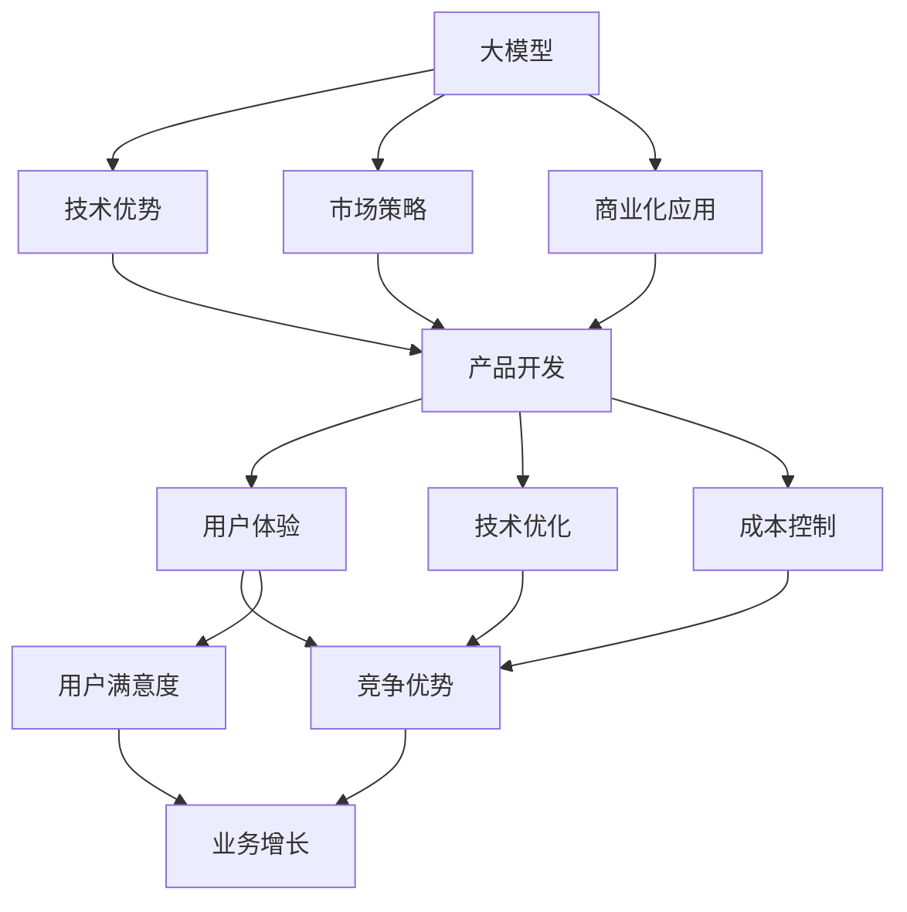

                 

# AI 大模型创业：如何利用科技优势？

> 关键词：大模型,创业,科技优势,市场策略,商业化应用

## 1. 背景介绍

### 1.1 问题由来
随着人工智能(AI)技术的飞速发展，大模型成为各领域关注的焦点。谷歌的BERT、OpenAI的GPT系列模型、微软的T5等，已经在自然语言处理(NLP)、计算机视觉(CV)、语音识别等领域展示了其强大的能力和应用潜力。大模型的广泛应用，催生了众多创业公司，试图借助大模型的技术优势，抢占市场先机。

本文将深入探讨如何利用AI大模型这一科技优势，进行创业。重点讨论大模型的关键技术原理和操作步骤，结合实际应用场景，提供全方位的策略指导。

## 2. 核心概念与联系

### 2.1 核心概念概述
大模型是一种使用大量数据和计算资源进行深度学习训练得到的庞大神经网络模型。其特点包括：参数量大、计算复杂度高、泛化能力强。

创业公司可以利用大模型的技术优势，开发出更高效、更智能、更贴近用户需求的产品。而如何有效地利用这一科技优势，则需要综合考虑技术、市场、战略等多方面因素。

### 2.2 核心概念间的关系

以下使用Mermaid流程图来展示大模型创业过程中，技术、市场、战略等概念间的关系：



这个流程图展示了从大模型到最终商业化应用的整个创业过程。大模型提供技术优势，市场策略指导产品开发和商业化应用，用户体验和技术优化保障产品竞争力，成本控制和竞争优势促进业务增长，而用户满意度则对业务增长产生直接影响。

## 3. 核心算法原理 & 具体操作步骤
### 3.1 算法原理概述

利用大模型进行创业的核心在于如何将其技术优势转化为实际应用。这包括选择合适的模型、设计合理的产品架构、优化用户体验等多个环节。

- 选择大模型：根据应用场景选择合适的预训练模型，如BERT、GPT、T5等。
- 设计产品架构：构建符合业务需求的产品架构，如搭建API接口、开发APP等。
- 优化用户体验：通过数据增强、参数优化等技术手段，提升用户体验，如减少加载时间、增加准确性等。
- 成本控制：通过算法优化、分布式计算等手段，降低运营成本。

### 3.2 算法步骤详解

以下详细讲解利用大模型进行创业的步骤：

**Step 1: 选择合适的预训练模型**
- 根据应用场景选择合适的预训练模型，如NLP领域的BERT、GPT-3，CV领域的ResNet、EfficientNet等。
- 注意模型的参数规模和计算需求，确保硬件设备能满足要求。

**Step 2: 构建产品架构**
- 根据业务需求设计产品架构，如图数据库、服务化API接口等。
- 考虑产品的可扩展性和维护性，采用微服务架构、容器化技术等。

**Step 3: 数据处理与增强**
- 收集并处理应用场景中的数据，如文本、图像、语音等。
- 通过数据增强技术，如文本回译、图像旋转、语音降噪等，增加训练数据多样性。

**Step 4: 模型微调与优化**
- 对预训练模型进行微调，适应具体应用场景。
- 优化模型参数和计算图，提升模型的推理速度和准确性。

**Step 5: 用户接口与体验**
- 设计简洁高效的用户接口，如Web界面、移动端APP等。
- 优化用户体验，如减少加载时间、增加交互性等。

**Step 6: 成本与效率控制**
- 采用分布式计算、GPU加速等手段，降低计算成本。
- 优化数据存储和传输，减少带宽占用。

### 3.3 算法优缺点

**优点**
- 数据驱动：大模型通过大规模数据训练，具备更强的泛化能力和学习效率。
- 技术领先：利用最新的AI技术，打造行业领先的解决方案。
- 快速迭代：灵活的架构设计，能快速适应市场需求变化。

**缺点**
- 高昂成本：大模型的训练和部署需要大量计算资源，初期投入较大。
- 数据隐私：大规模数据处理可能涉及用户隐私保护问题。
- 技术门槛：开发大模型相关应用需要较高技术水平，团队建设难度大。

### 3.4 算法应用领域

大模型的应用领域非常广泛，包括但不限于：

- 自然语言处理(NLP)：文本生成、情感分析、机器翻译等。
- 计算机视觉(CV)：图像分类、目标检测、人脸识别等。
- 语音识别与生成：语音识别、语音合成、说话人识别等。
- 推荐系统：用户行为分析、物品推荐等。
- 医疗健康：疾病诊断、治疗方案推荐等。

## 4. 数学模型和公式 & 详细讲解

### 4.1 数学模型构建

假设大模型为$f(x; \theta)$，其中$x$为输入数据，$\theta$为模型参数。创业公司可以利用这一模型，对新的输入数据$x'$进行预测或生成。

例如，在自然语言处理任务中，可以使用Transformer模型进行文本分类。具体模型为：

$$
y = f(x; \theta) = \sigma(\text{Encoder-Decoder}(x; \theta))
$$

其中$\sigma$为激活函数，$\text{Encoder-Decoder}$为Transformer编码器-解码器结构。

### 4.2 公式推导过程

以Transformer模型为例，其核心在于自注意力机制(self-attention)和多头注意力机制(multi-head attention)。自注意力机制通过计算输入序列中每个词与其他词之间的权重，捕捉词语之间的关系。多头注意力机制通过多个注意力头并行计算，提高模型的表达能力。

具体公式为：

$$
\text{Attention}(Q, K, V) = \frac{\exp\left(\frac{QK^T}{\sqrt{d_k}}\right)}{\sqrt{d_k}}V
$$

其中，$Q, K, V$为查询、键、值向量，$d_k$为键向量的维度。

### 4.3 案例分析与讲解

以智能客服系统为例，分析如何利用大模型进行创业：

**Step 1: 选择模型**
- 选择BERT或GPT-3作为基础模型。

**Step 2: 数据处理**
- 收集历史客服对话数据，并进行数据清洗和标注。

**Step 3: 微调模型**
- 对BERT或GPT-3进行微调，适应客服对话场景。

**Step 4: 产品实现**
- 搭建Web界面，提供自然语言输入。
- 集成微调后的模型，进行对话生成。

**Step 5: 用户体验**
- 优化输入界面，减少用户操作负担。
- 增加智能推荐功能，提高用户满意度。

**Step 6: 成本控制**
- 采用分布式计算，降低计算成本。
- 优化数据存储，减少带宽占用。

## 5. 项目实践：代码实例和详细解释说明

### 5.1 开发环境搭建

在开始项目实践前，需要先搭建好开发环境。以下以Python和PyTorch为例：

1. 安装Anaconda：
```bash
conda create -n env python=3.8
conda activate env
```

2. 安装PyTorch和相关库：
```bash
pip install torch torchvision transformers
```

3. 搭建开发环境：
```bash
python setup.py install
```

### 5.2 源代码详细实现

以智能客服系统为例，展示如何使用BERT进行微调：

**Step 1: 数据预处理**
```python
import torch
from transformers import BertTokenizer, BertForSequenceClassification

tokenizer = BertTokenizer.from_pretrained('bert-base-uncased')
```

**Step 2: 构建模型**
```python
model = BertForSequenceClassification.from_pretrained('bert-base-uncased', num_labels=num_labels)
```

**Step 3: 训练模型**
```python
device = torch.device('cuda' if torch.cuda.is_available() else 'cpu')
model.to(device)
...
```

**Step 4: 应用模型**
```python
input_ids = tokenizer.encode(input_text, add_special_tokens=True)
input_ids = input_ids.unsqueeze(0)
inputs = {'input_ids': input_ids}
outputs = model(**inputs)
```

### 5.3 代码解读与分析

代码中，首先使用BertTokenizer将输入文本转化为模型所需的token id序列。接着，通过BertForSequenceClassification构建分类模型，并设置合适的标签数量。在训练过程中，将模型迁移到GPU上加速计算。最后，通过调用模型对输入文本进行分类预测。

## 6. 实际应用场景

### 6.1 智能客服系统
大模型在智能客服系统中展示了强大的能力，可以处理大量复杂的客户咨询，并提供个性化的解决方案。

**Step 1: 收集数据**
- 收集历史客服对话记录，进行标注处理。

**Step 2: 微调模型**
- 使用微调后的BERT模型，处理用户输入的文本。

**Step 3: 系统集成**
- 将微调后的模型集成到客服系统中，自动回复用户问题。

**Step 4: 优化用户体验**
- 优化用户界面，增加智能推荐功能。
- 引入自然语言处理技术，提供多轮对话支持。

### 6.2 金融舆情监测
金融行业需要实时监测市场舆情，防止突发事件带来的风险。

**Step 1: 数据收集**
- 收集金融领域的各类新闻、评论等文本数据。

**Step 2: 预训练模型**
- 使用预训练的BERT模型，作为基础语言模型。

**Step 3: 微调模型**
- 对BERT模型进行微调，适应舆情监测任务。

**Step 4: 系统实现**
- 搭建舆情监测系统，实时抓取市场数据。
- 集成微调后的模型，分析舆情趋势。

### 6.3 个性化推荐系统
个性化推荐系统可以根据用户行为，提供个性化的物品推荐。

**Step 1: 数据收集**
- 收集用户浏览、购买等行为数据。

**Step 2: 构建模型**
- 使用预训练的BERT模型，提取用户行为特征。

**Step 3: 微调模型**
- 对BERT模型进行微调，学习用户偏好。

**Step 4: 推荐系统**
- 集成微调后的模型，生成个性化推荐列表。

### 6.4 未来应用展望

未来，大模型将广泛应用于更多领域，带来新的应用场景：

- 智能医疗：利用大模型进行疾病诊断、治疗方案推荐等。
- 智慧城市：利用大模型进行交通管理、环境监测等。
- 智能制造：利用大模型进行设备维护、质量检测等。

## 7. 工具和资源推荐

### 7.1 学习资源推荐

1. 《深度学习入门与实践》：深入浅出地介绍深度学习原理和实践技巧，涵盖大模型的应用场景。
2. Coursera《自然语言处理专项课程》：由斯坦福大学教授授课，系统学习自然语言处理相关知识。
3. HuggingFace官方文档：提供丰富的预训练模型和代码样例，助力大模型应用开发。

### 7.2 开发工具推荐

1. PyTorch：灵活易用的深度学习框架，提供丰富的预训练模型和优化器。
2. TensorFlow：强大的计算图支持，适用于大规模工程应用。
3. Weights & Biases：实验跟踪工具，可视化模型训练过程和性能。

### 7.3 相关论文推荐

1. "BERT: Pre-training of Deep Bidirectional Transformers for Language Understanding"：BERT模型的经典论文，介绍自监督预训练方法。
2. "Attention is All You Need"：Transformer模型的经典论文，介绍自注意力机制。
3. "GPT-3: Language Models are Unsupervised Multitask Learners"：GPT-3模型的经典论文，介绍语言模型的零样本学习能力。

## 8. 总结：未来发展趋势与挑战

### 8.1 研究成果总结

大模型在各个领域的创业应用展示了其强大的技术优势，但也面临数据成本高、技术门槛高等挑战。

### 8.2 未来发展趋势

- 大模型将进一步扩展应用领域，涵盖更多行业和场景。
- 大模型技术将不断优化，提升性能和效率。
- 大模型创业生态将逐步完善，更多初创公司涌现。

### 8.3 面临的挑战

- 数据获取与标注成本高，需要有效降低。
- 大模型技术复杂，需要更多人才支持。
- 系统性能与用户体验需要不断优化。

### 8.4 研究展望

- 进一步降低数据依赖，利用自监督和半监督学习。
- 提升大模型的可解释性和鲁棒性。
- 探索更多创业应用场景，推动大模型产业化进程。

## 9. 附录：常见问题与解答

**Q1: 大模型在各个领域的创业应用有哪些？**

A: 大模型在多个领域展示了其强大的技术优势，包括自然语言处理(NLP)、计算机视觉(CV)、语音识别、推荐系统、医疗健康等。

**Q2: 大模型的创业应用有哪些技术难点？**

A: 大模型的创业应用面临技术复杂度高、数据成本高等挑战，需要团队具备深厚的技术积累和项目管理能力。

**Q3: 如何利用大模型进行创业？**

A: 利用大模型进行创业，需要选择合适的预训练模型，进行数据预处理和模型微调，构建符合业务需求的产品架构，优化用户体验，控制成本和效率。

**Q4: 大模型的创业应用需要哪些关键技术？**

A: 关键技术包括自然语言处理、计算机视觉、推荐系统、用户行为分析等，需要综合考虑技术、市场、战略等多个方面因素。

**Q5: 大模型创业的商业模式有哪些？**

A: 大模型创业的商业模式包括B2B、SaaS、平台化服务等，需要根据具体应用场景和市场需求进行灵活选择。

---

作者：禅与计算机程序设计艺术 / Zen and the Art of Computer Programming

