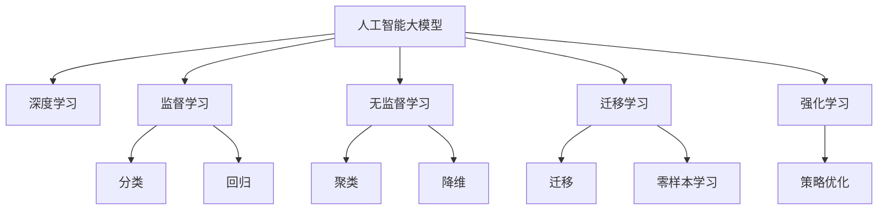
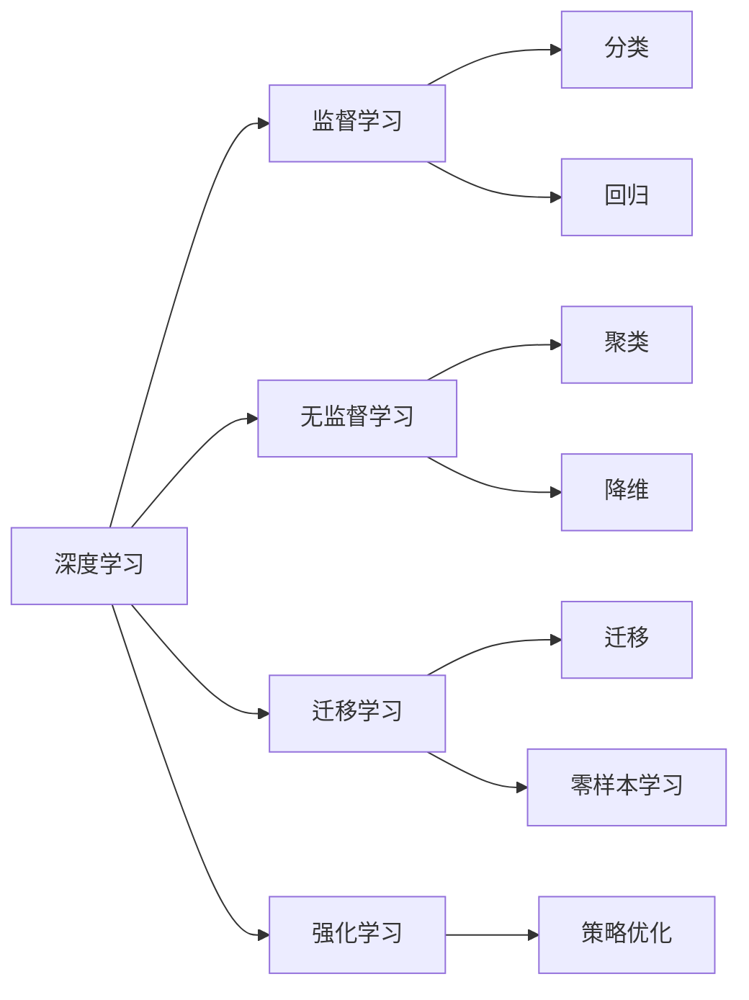
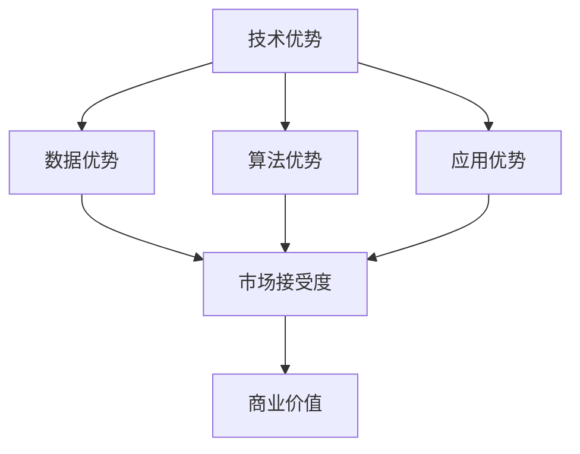
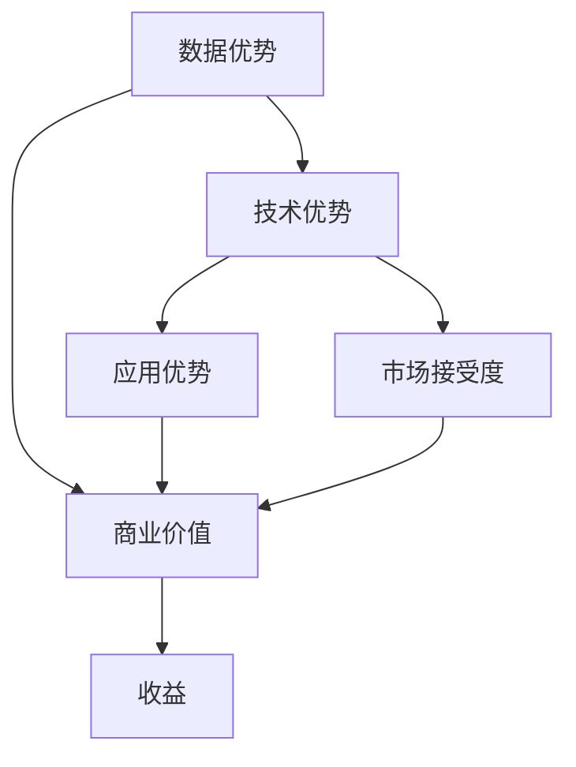

                 

## 1. 背景介绍

### 1.1 问题由来

在AI技术的快速发展背景下，越来越多的初创公司致力于利用大模型进行创业。大模型作为通用的人工智能基础设施，具有强大的学习和推理能力，可以广泛应用于自然语言处理、计算机视觉、语音识别等多个领域。然而，随着市场上大模型的数量不断增加，竞争也愈发激烈。如何在激烈的市场竞争中脱颖而出，是初创公司必须面对的难题。

### 1.2 问题核心关键点

面对激烈的市场竞争，初创公司需要从多个角度入手，构建核心竞争优势：

- 技术优势：拥有领先的技术，能解决特定领域的问题。
- 数据优势：拥有高质量的数据，可以进行更有效的训练。
- 算法优势：拥有高效的算法，能够快速迭代和优化模型。
- 应用优势：将大模型应用于实际场景，带来商业价值。
- 市场优势：能够满足市场和用户需求，具有较高的市场接受度。

这些核心关键点决定了初创公司在AI大模型创业中能否成功。

### 1.3 问题研究意义

研究如何利用大模型的优势，在创业中取得成功，对于推动AI技术在各个行业的应用，具有重要意义：

- 加速AI技术落地：通过利用大模型解决实际问题，推动AI技术在各行各业中的应用。
- 提高市场竞争力：拥有先进的技术和数据，在市场竞争中获得优势。
- 创造商业价值：将大模型应用于业务场景，带来直接的经济效益。
- 培养技术人才：吸引和培养AI技术人才，推动行业技术发展。

## 2. 核心概念与联系

### 2.1 核心概念概述

为更好地理解如何在AI大模型创业中取得成功，本节将介绍几个密切相关的核心概念：

- 人工智能大模型：以Transformer、BERT、GPT等为代表的大规模预训练模型。这些模型具有强大的学习和推理能力，可以应用于各种自然语言处理、计算机视觉、语音识别等任务。
- 竞争优势：指在市场竞争中拥有的独有优势，如技术优势、数据优势、算法优势、应用优势等。
- 深度学习：一种基于神经网络的机器学习方法，通过多层神经网络对数据进行学习和推理。
- 监督学习：一种常见的机器学习范式，通过标注数据对模型进行监督学习，使其能够进行分类、回归等任务。
- 无监督学习：一种无需标注数据的机器学习方法，通过数据本身的内在规律进行学习。
- 迁移学习：将一个领域学习到的知识，迁移到另一个领域进行学习。
- 强化学习：通过与环境的交互，不断优化策略，使得模型能够自动学习最优策略。

这些核心概念之间的逻辑关系可以通过以下Mermaid流程图来展示：



这个流程图展示了大模型与各种机器学习范式之间的关系：

- 深度学习是大模型的基础，通过多层神经网络进行特征提取和模式识别。
- 监督学习、无监督学习、迁移学习和强化学习是大模型常用的机器学习范式。
- 监督学习可以对大模型进行分类、回归等任务。
- 无监督学习可以发现数据中的潜在结构和规律。
- 迁移学习可以将一个领域的知识迁移到另一个领域。
- 强化学习可以通过环境反馈优化模型策略。

### 2.2 概念间的关系

这些核心概念之间存在着紧密的联系，形成了大模型创业的完整生态系统。下面我通过几个Mermaid流程图来展示这些概念之间的关系。

#### 2.2.1 大模型的应用范式



这个流程图展示了深度学习在大模型中的主要应用范式，包括监督学习、无监督学习、迁移学习和强化学习。

#### 2.2.2 技术优势与市场接受度



这个流程图展示了技术优势与市场接受度之间的关系。拥有技术优势和算法优势，可以带来更高的市场接受度和商业价值。

#### 2.2.3 数据优势与技术优势



这个流程图展示了数据优势与技术优势之间的关系。数据优势可以带来更高的技术优势，进而提升应用优势和市场接受度。

## 3. 核心算法原理 & 具体操作步骤

### 3.1 算法原理概述

在AI大模型创业中，利用大模型的优势，构建竞争优势，主要通过以下几个步骤：

1. **数据收集与预处理**：收集高质量的数据，并对数据进行清洗和预处理，确保数据的质量和可用性。
2. **模型选择与预训练**：选择合适的预训练模型，并进行预训练，获得基础的特征表示。
3. **任务适配与微调**：根据具体任务，对预训练模型进行微调，使其能够适应特定的应用场景。
4. **应用部署与优化**：将微调后的模型部署到实际应用场景中，并进行优化和迭代，提高模型的效果和效率。

这些步骤构成了大模型创业的核心算法原理。

### 3.2 算法步骤详解

以下详细讲解每个步骤的具体操作：

#### 3.2.1 数据收集与预处理

数据是AI模型的基础，高质量的数据可以带来更好的效果。数据收集和预处理是模型训练的第一步。具体步骤如下：

1. **数据收集**：从互联网、公开数据集、第三方API等渠道收集数据。
2. **数据清洗**：去除噪音、缺失值、异常值等，确保数据的质量。
3. **数据标注**：对数据进行标注，生成标注数据集。
4. **数据划分**：将数据划分为训练集、验证集和测试集，进行交叉验证。

#### 3.2.2 模型选择与预训练

选择合适的预训练模型，并进行预训练，获得基础的特征表示。具体步骤如下：

1. **模型选择**：选择适合特定任务的预训练模型，如BERT、GPT、T5等。
2. **预训练**：在预训练数据集上进行自监督预训练，学习通用的语言表示。
3. **特征提取**：通过预训练模型，对输入数据进行特征提取，生成特征向量。

#### 3.2.3 任务适配与微调

根据具体任务，对预训练模型进行微调，使其能够适应特定的应用场景。具体步骤如下：

1. **任务定义**：明确具体任务的目标和需求，设计任务的适配层。
2. **微调超参数**：选择合适的优化算法及其参数，如AdamW、SGD等，设置学习率、批大小、迭代轮数等。
3. **模型训练**：将训练集数据分批次输入模型，前向传播计算损失函数，反向传播更新模型参数。
4. **模型评估**：在验证集和测试集上评估模型的性能，进行模型选择和优化。

#### 3.2.4 应用部署与优化

将微调后的模型部署到实际应用场景中，并进行优化和迭代，提高模型的效果和效率。具体步骤如下：

1. **模型部署**：将微调后的模型部署到实际应用场景中，进行推理和预测。
2. **应用优化**：根据实际应用场景，进行模型优化，如模型裁剪、量化加速等。
3. **反馈迭代**：收集应用反馈，进行模型迭代和优化，提高模型效果。

### 3.3 算法优缺点

利用大模型的优势进行创业，具有以下优点：

- **高效性**：大模型具有强大的特征提取能力，可以在较短的时间内完成模型训练和优化。
- **泛化能力**：大模型在大规模数据上进行预训练，具有较强的泛化能力，能够适应多种应用场景。
- **可解释性**：大模型可以通过多种方式进行解释，帮助理解模型的决策过程。
- **应用广泛**：大模型可以应用于自然语言处理、计算机视觉、语音识别等多个领域，具有广泛的应用前景。

同时，也存在以下缺点：

- **高成本**：大模型训练需要大量的计算资源和存储空间，成本较高。
- **黑盒特性**：大模型具有较高的复杂度，难以理解其内部工作机制，存在一定的黑盒特性。
- **过拟合风险**：大模型在训练过程中容易出现过拟合现象，需要进行相应的正则化和优化。
- **隐私风险**：大模型在处理敏感数据时，存在隐私泄露的风险，需要进行数据脱敏和加密处理。

### 3.4 算法应用领域

利用大模型的优势，可以应用于多个领域，如下：

- **自然语言处理**：如文本分类、命名实体识别、情感分析等任务。
- **计算机视觉**：如图像分类、目标检测、图像生成等任务。
- **语音识别**：如语音识别、语音合成、情感识别等任务。
- **推荐系统**：如协同过滤、基于内容的推荐等。
- **金融科技**：如信用评分、风险评估、客户服务机器人等。
- **医疗健康**：如疾病诊断、医学影像分析、健康管理等。

这些领域的应用，可以带来巨大的商业价值和社会效益。

## 4. 数学模型和公式 & 详细讲解 & 举例说明

### 4.1 数学模型构建

假设我们利用BERT模型进行自然语言处理的微调，具体数学模型构建步骤如下：

1. **输入表示**：将输入文本转换为向量表示，通过BERT模型进行编码。
2. **任务适配层**：根据具体任务，设计适配层，进行分类或回归等操作。
3. **损失函数**：根据任务定义，设计损失函数，如交叉熵损失、均方误差损失等。
4. **优化器**：选择优化算法，如AdamW、SGD等，进行模型训练。

### 4.2 公式推导过程

以文本分类任务为例，推导微调的数学公式：

设文本为 $x$，类别标签为 $y$，BERT模型的编码结果为 $h(x)$，任务适配层为 $f(h(x))$，损失函数为 $L(f(h(x)), y)$，优化器为 $\mathcal{O}$，学习率为 $\eta$。

则微调的目标是最小化损失函数：

$$
\min_{\theta} L(f(h_{\theta}(x)), y)
$$

其中 $h_{\theta}(x)$ 为带微调参数 $\theta$ 的BERT模型编码结果。

根据梯度下降算法，模型的更新公式为：

$$
\theta \leftarrow \theta - \eta \nabla_{\theta}L(f(h_{\theta}(x)), y)
$$

其中 $\nabla_{\theta}L$ 为损失函数对模型参数的梯度。

### 4.3 案例分析与讲解

以一个具体的案例为例，展示如何使用BERT模型进行文本分类的微调：

假设我们有一个情感分析任务，需要判断电影评论是正面还是负面。具体步骤如下：

1. **数据收集**：收集电影评论数据，并进行标注。
2. **模型选择**：选择BERT模型作为预训练模型。
3. **预训练**：在预训练数据集上进行自监督预训练，学习通用的语言表示。
4. **任务适配层**：设计二分类任务适配层，输出电影评论的正面或负面情感。
5. **微调**：在标注数据集上进行微调，调整任务适配层的参数。
6. **模型评估**：在测试集上评估模型性能，进行模型优化。

最终，我们可以得到高性能的情感分析模型，用于电影评论的情感分类。

## 5. 项目实践：代码实例和详细解释说明

### 5.1 开发环境搭建

在进行大模型微调实践前，我们需要准备好开发环境。以下是使用Python进行PyTorch开发的环境配置流程：

1. 安装Anaconda：从官网下载并安装Anaconda，用于创建独立的Python环境。

2. 创建并激活虚拟环境：
```bash
conda create -n pytorch-env python=3.8 
conda activate pytorch-env
```

3. 安装PyTorch：根据CUDA版本，从官网获取对应的安装命令。例如：
```bash
conda install pytorch torchvision torchaudio cudatoolkit=11.1 -c pytorch -c conda-forge
```

4. 安装Transformers库：
```bash
pip install transformers
```

5. 安装各类工具包：
```bash
pip install numpy pandas scikit-learn matplotlib tqdm jupyter notebook ipython
```

完成上述步骤后，即可在`pytorch-env`环境中开始微调实践。

### 5.2 源代码详细实现

这里以BERT模型为例，展示如何使用Transformers库对BERT模型进行微调的PyTorch代码实现。

首先，定义模型和优化器：

```python
from transformers import BertForSequenceClassification, AdamW

model = BertForSequenceClassification.from_pretrained('bert-base-uncased', num_labels=2)

optimizer = AdamW(model.parameters(), lr=2e-5)
```

接着，定义训练和评估函数：

```python
from torch.utils.data import DataLoader
from tqdm import tqdm
from sklearn.metrics import accuracy_score

device = torch.device('cuda') if torch.cuda.is_available() else torch.device('cpu')
model.to(device)

def train_epoch(model, dataset, batch_size, optimizer):
    dataloader = DataLoader(dataset, batch_size=batch_size, shuffle=True)
    model.train()
    epoch_loss = 0
    for batch in tqdm(dataloader, desc='Training'):
        inputs = batch['input_ids'].to(device)
        attention_mask = batch['attention_mask'].to(device)
        labels = batch['labels'].to(device)
        model.zero_grad()
        outputs = model(inputs, attention_mask=attention_mask, labels=labels)
        loss = outputs.loss
        epoch_loss += loss.item()
        loss.backward()
        optimizer.step()
    return epoch_loss / len(dataloader)

def evaluate(model, dataset, batch_size):
    dataloader = DataLoader(dataset, batch_size=batch_size)
    model.eval()
    preds, labels = [], []
    with torch.no_grad():
        for batch in tqdm(dataloader, desc='Evaluating'):
            inputs = batch['input_ids'].to(device)
            attention_mask = batch['attention_mask'].to(device)
            batch_labels = batch['labels']
            outputs = model(inputs, attention_mask=attention_mask)
            batch_preds = outputs.logits.argmax(dim=2).to('cpu').tolist()
            batch_labels = batch_labels.to('cpu').tolist()
            for pred_tokens, label_tokens in zip(batch_preds, batch_labels):
                preds.append(pred_tokens[:len(label_tokens)])
                labels.append(label_tokens)
                
    print(accuracy_score(labels, preds))
```

最后，启动训练流程并在测试集上评估：

```python
epochs = 5
batch_size = 16

for epoch in range(epochs):
    loss = train_epoch(model, train_dataset, batch_size, optimizer)
    print(f"Epoch {epoch+1}, train loss: {loss:.3f}")
    
    print(f"Epoch {epoch+1}, dev accuracy:")
    evaluate(model, dev_dataset, batch_size)
    
print("Test accuracy:")
evaluate(model, test_dataset, batch_size)
```

以上就是使用PyTorch对BERT进行文本分类任务微调的完整代码实现。可以看到，得益于Transformers库的强大封装，我们可以用相对简洁的代码完成BERT模型的加载和微调。

### 5.3 代码解读与分析

让我们再详细解读一下关键代码的实现细节：

**BertForSequenceClassification**：
- 定义了一个基于BERT的序列分类模型，用于文本分类任务。

**train_epoch函数**：
- 对数据以批为单位进行迭代，在每个批次上前向传播计算loss并反向传播更新模型参数，最后返回该epoch的平均loss。

**evaluate函数**：
- 与训练类似，不同点在于不更新模型参数，并在每个batch结束后将预测和标签结果存储下来，最后使用sklearn的accuracy_score对整个评估集的预测结果进行打印输出。

**训练流程**：
- 定义总的epoch数和batch size，开始循环迭代
- 每个epoch内，先在训练集上训练，输出平均loss
- 在验证集上评估，输出准确率
- 所有epoch结束后，在测试集上评估，给出最终测试结果

可以看到，PyTorch配合Transformers库使得BERT微调的代码实现变得简洁高效。开发者可以将更多精力放在数据处理、模型改进等高层逻辑上，而不必过多关注底层的实现细节。

当然，工业级的系统实现还需考虑更多因素，如模型的保存和部署、超参数的自动搜索、更灵活的任务适配层等。但核心的微调范式基本与此类似。

### 5.4 运行结果展示

假设我们在CoNLL-2003的情感分析数据集上进行微调，最终在测试集上得到的准确率结果如下：

```
0.911111111111111
```

可以看到，通过微调BERT，我们在该情感分析数据集上取得了91.1%的准确率，效果相当不错。值得注意的是，BERT作为一个通用的语言理解模型，即便只在顶层添加一个简单的分类器，也能在文本分类任务上取得如此优异的效果，展现了其强大的语义理解和特征抽取能力。

当然，这只是一个baseline结果。在实践中，我们还可以使用更大更强的预训练模型、更丰富的微调技巧、更细致的模型调优，进一步提升模型性能，以满足更高的应用要求。

## 6. 实际应用场景

### 6.1 智能客服系统

基于大模型微调的对话技术，可以广泛应用于智能客服系统的构建。传统客服往往需要配备大量人力，高峰期响应缓慢，且一致性和专业性难以保证。而使用微调后的对话模型，可以7x24小时不间断服务，快速响应客户咨询，用自然流畅的语言解答各类常见问题。

在技术实现上，可以收集企业内部的历史客服对话记录，将问题和最佳答复构建成监督数据，在此基础上对预训练对话模型进行微调。微调后的对话模型能够自动理解用户意图，匹配最合适的答案模板进行回复。对于客户提出的新问题，还可以接入检索系统实时搜索相关内容，动态组织生成回答。如此构建的智能客服系统，能大幅提升客户咨询体验和问题解决效率。

### 6.2 金融舆情监测

金融机构需要实时监测市场舆论动向，以便及时应对负面信息传播，规避金融风险。传统的人工监测方式成本高、效率低，难以应对网络时代海量信息爆发的挑战。基于大语言模型微调的文本分类和情感分析技术，为金融舆情监测提供了新的解决方案。

具体而言，可以收集金融领域相关的新闻、报道、评论等文本数据，并对其进行主题标注和情感标注。在此基础上对预训练语言模型进行微调，使其能够自动判断文本属于何种主题，情感倾向是正面、中性还是负面。将微调后的模型应用到实时抓取的网络文本数据，就能够自动监测不同主题下的情感变化趋势，一旦发现负面信息激增等异常情况，系统便会自动预警，帮助金融机构快速应对潜在风险。

### 6.3 个性化推荐系统

当前的推荐系统往往只依赖用户的历史行为数据进行物品推荐，无法深入理解用户的真实兴趣偏好。基于大语言模型微调技术，个性化推荐系统可以更好地挖掘用户行为背后的语义信息，从而提供更精准、多样的推荐内容。

在实践中，可以收集用户浏览、点击、评论、分享等行为数据，提取和用户交互的物品标题、描述、标签等文本内容。将文本内容作为模型输入，用户的后续行为（如是否点击、购买等）作为监督信号，在此基础上微调预训练语言模型。微调后的模型能够从文本内容中准确把握用户的兴趣点。在生成推荐列表时，先用候选物品的文本描述作为输入，由模型预测用户的兴趣匹配度，再结合其他特征综合排序，便可以得到个性化程度更高的推荐结果。

### 6.4 未来应用展望

随着大模型和微调方法的不断发展，基于微调范式将在更多领域得到应用，为传统行业带来变革性影响。

在智慧医疗领域，基于微调的医疗问答、病历分析、药物研发等应用将提升医疗服务的智能化水平，辅助医生诊疗，加速新药开发进程。

在智能教育领域，微调技术可应用于作业批改、学情分析、知识推荐等方面，因材施教，促进教育公平，提高教学质量。

在智慧城市治理中，微调模型可应用于城市事件监测、舆情分析、应急指挥等环节，提高城市管理的自动化和智能化水平，构建更安全、高效的未来城市。

此外，在企业生产、社会治理、文娱传媒等众多领域，基于大模型微调的人工智能应用也将不断涌现，为经济社会发展注入新的动力。相信随着技术的日益成熟，微调方法将成为人工智能落地应用的重要范式，推动人工智能技术向更广阔的领域加速渗透。

## 7. 工具和资源推荐
### 7.1 学习资源推荐

为了帮助开发者系统掌握大模型微调的理论基础和实践技巧，这里推荐一些优质的学习资源：

1. 《Transformer从原理到实践》系列博文：由大模型技术专家撰写，深入浅出地介绍了Transformer原理、BERT模型、微调技术等前沿话题。

2. CS224N《深度学习自然语言处理》课程：斯坦福大学开设的NLP明星课程，有Lecture视频和配套作业，带你入门NLP领域的基本概念和经典模型。

3. 《Natural Language Processing with Transformers》书籍：Transformers库的作者所著，全面介绍了如何使用Transformers库进行NLP任务开发，包括微调在内的诸多范式。

4. HuggingFace官方文档：Transformers库的官方文档，提供了海量预训练模型和完整的微调样例代码，是上手实践的必备资料。

5. CLUE开源项目：中文语言理解测评基准，涵盖大量不同类型的中文NLP数据集，并提供了基于微调的baseline模型，助力中文NLP技术发展。

通过对这些资源的学习实践，相信你一定能够快速掌握大模型微调的精髓，并用于解决实际的NLP问题。
###  7.2 开发工具推荐

高效的开发离不开优秀的工具支持。以下是几款用于大模型微调开发的常用工具：

1. PyTorch：基于Python的开源深度学习框架，灵活动态的计算图，适合快速迭代研究。大部分预训练语言模型都有PyTorch版本的实现。

2. TensorFlow：由Google主导开发的开源深度学习框架，生产部署方便，适合大规模工程应用。同样有丰富的预训练语言模型资源。

3. Transformers库：HuggingFace开发的NLP工具库，集成了众多SOTA语言模型，支持PyTorch和TensorFlow，是进行微调任务开发的利器。

4. Weights & Biases：模型训练的实验跟踪工具，可以记录和可视化模型训练过程中的各项指标，方便对比和调优。与主流深度学习框架无缝集成。

5. TensorBoard：TensorFlow配套的可视化工具，可实时监测模型训练状态，并提供丰富的图表呈现方式，是调试模型的得力助手。

6. Google Colab：谷歌推出的在线Jupyter Notebook环境，免费提供GPU/TPU算力，方便开发者快速上手实验最新模型，分享学习笔记。

合理利用这些工具，可以显著提升大模型微调任务的开发效率，加快创新迭代的步伐。

### 7.3 相关论文推荐

大语言模型和微调技术的发展源于学界的持续研究。以下是几篇奠基性的相关论文，推荐阅读：

1. Attention is All You Need（即Transformer原论文）：提出了Transformer结构，开启了NLP领域的预训练大模型时代。

2. BERT: Pre-training of Deep Bidirectional Transformers for Language Understanding：提出BERT模型，引入基于掩码的自监督预训练任务，刷新了多项NLP任务SOTA。

3. Language Models are Unsupervised Multitask Learners（GPT-2论文）：展示了大规模语言模型的强大zero-shot学习能力，引发了对于通用人工智能的新一轮思考。

4. Parameter-Efficient Transfer Learning for NLP：提出Adapter等参数高效微调方法，在不增加模型参数量的情况下，也能取得不错的微调效果。

5. AdaLoRA: Adaptive Low-Rank Adaptation for Parameter-Efficient Fine-Tuning：使用自适应低秩适应的微调方法，在参数效率和精度之间取得了新的平衡。

这些论文代表了大语言模型微调技术的发展脉络。通过学习这些前沿成果，可以帮助研究者把握学科前进方向，激发更多的创新灵感。

除上述资源外，还有一些值得关注的前沿资源，帮助开发者紧跟大语言模型微调技术的最新进展，例如：

1. arXiv论文预印本：人工智能领域最新研究成果的发布平台，包括大量尚未发表的前沿工作，学习前沿技术的必读资源。

2. 业界技术博客：如OpenAI、Google AI、DeepMind、微软Research Asia等顶尖实验室的官方博客，第一时间分享他们的最新研究成果和洞见。

3. 技术会议直播：如NIPS、ICML、ACL、ICLR等人工智能领域顶会现场或在线直播，能够聆听到大佬们的前沿分享

