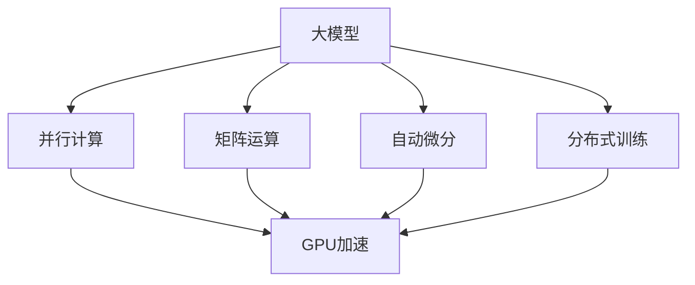
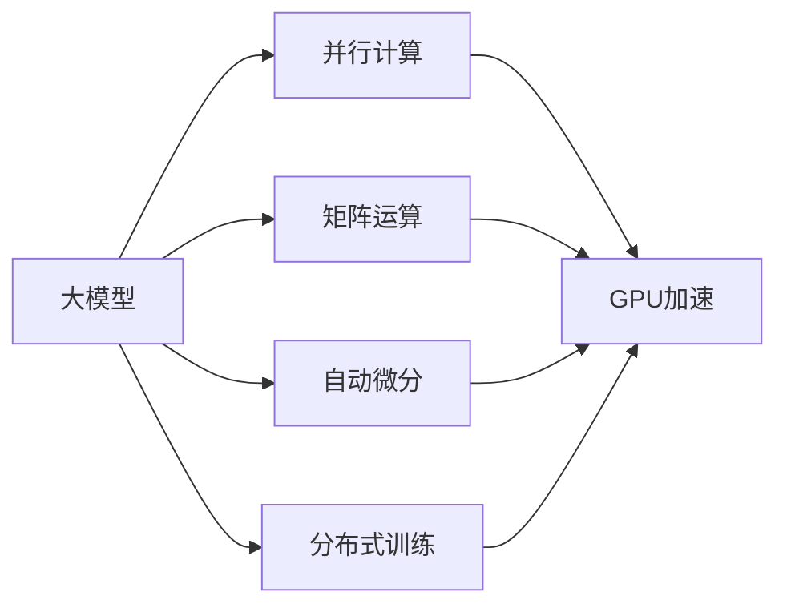
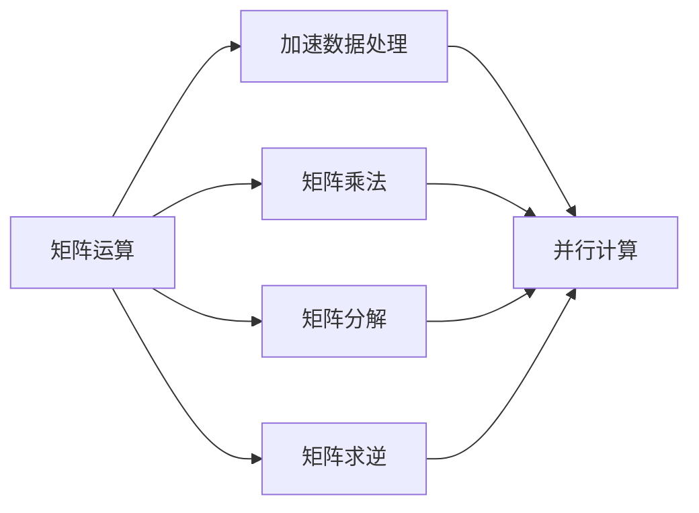
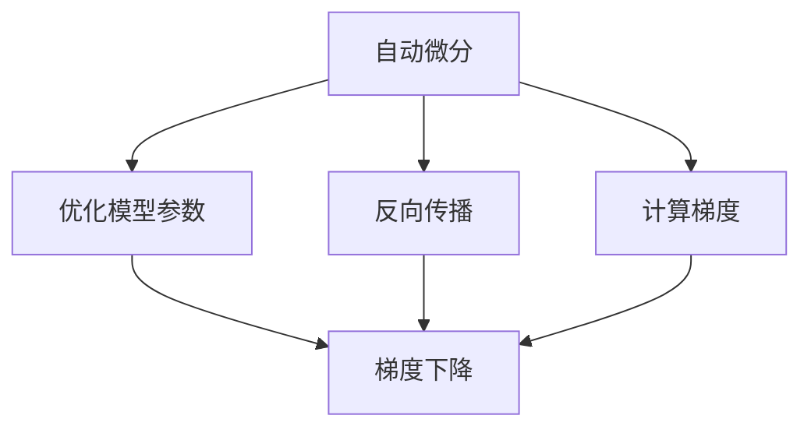
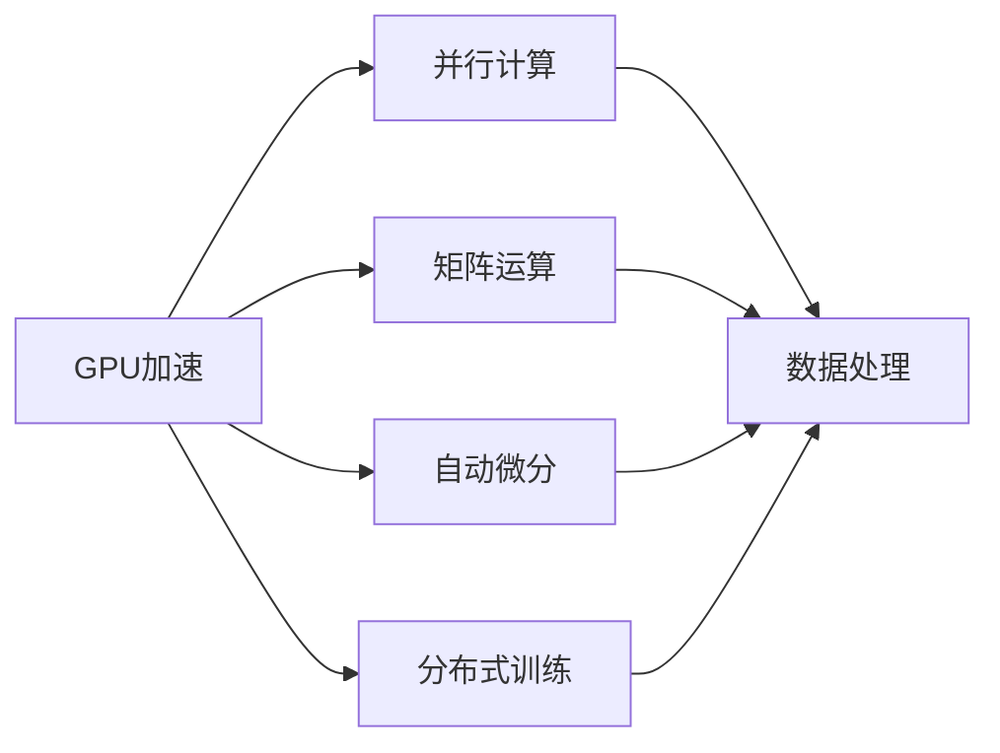
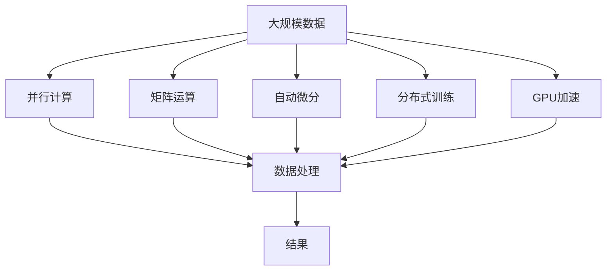

                 

# AI 大模型原理与应用：AI 很擅长数据吞吐量特别大的工作，可以并行读取、加工很多的数据

> 关键词：
- 大模型
- 数据吞吐量
- 并行处理
- 超参数调优
- 矩阵运算
- 深度学习优化
- 性能优化
- GPU加速
- 分布式计算

## 1. 背景介绍

### 1.1 问题由来
在现代大数据时代，数据的产生和存储量呈爆炸式增长。对于处理大规模数据的AI应用而言，如何高效利用海量数据，并在合理的时间内得出准确的结果，成为了关键的挑战。传统的机器学习模型虽然在处理中等规模数据时表现优异，但在处理大规模数据时却显得力不从心。而大模型（Large Model），即参数数量极大的神经网络模型，由于其高效的并行计算能力和强大的数据处理能力，逐渐成为了处理大规模数据的首选。

### 1.2 问题核心关键点
大模型在数据处理方面表现出色，主要基于以下几个关键点：

1. **参数规模**：大模型通常包含数百万到数十亿的参数，这些参数构成了复杂的计算图，能够处理和建模极其复杂的数据模式。

2. **并行计算**：大模型的计算图可以通过GPU或TPU等硬件并行计算，大大加速了数据处理速度。

3. **高效矩阵运算**：大模型利用矩阵运算的并行特性，可以在同一时间内处理大量数据。

4. **自动微分和梯度计算**：大模型通过自动微分技术，可以高效计算梯度，优化模型参数。

5. **分布式训练**：大模型通过分布式训练技术，可以在多个计算节点上并行训练，进一步提升训练效率。

### 1.3 问题研究意义
大模型在数据处理方面的优势，使其在众多应用场景中表现出色。从自然语言处理到计算机视觉，从推荐系统到金融分析，大模型的高效数据处理能力为其提供了广泛的应用前景。同时，大模型的高效并行处理能力，也为其在实时计算和实时分析中发挥作用提供了可能。未来，随着技术的发展，大模型有望在更多领域发挥重要作用，推动人工智能技术的进一步普及和应用。

## 2. 核心概念与联系

### 2.1 核心概念概述

为更好地理解大模型在数据处理方面的原理和应用，本节将介绍几个密切相关的核心概念：

- **大模型**：参数数量极大的神经网络模型，能够处理和建模极其复杂的数据模式。
- **并行计算**：通过多个计算节点并行计算，加速数据处理速度。
- **矩阵运算**：利用矩阵的并行特性，加速大模型的计算过程。
- **自动微分和梯度计算**：使用自动微分技术，高效计算梯度，优化模型参数。
- **分布式训练**：通过多个计算节点并行训练，提升训练效率。
- **GPU加速**：利用GPU的高效并行计算能力，加速大模型的训练和推理过程。
- **分布式系统**：通过多台服务器协同工作，实现高效的数据处理和计算。

这些核心概念之间的逻辑关系可以通过以下Mermaid流程图来展示：



这个流程图展示了大模型在数据处理方面的核心概念及其之间的关系：

1. 大模型通过并行计算和矩阵运算，加速数据处理速度。
2. 自动微分技术和大模型的分布式训练进一步提升计算效率。
3. GPU加速和大模型的并行计算互相配合，实现高效的训练和推理。
4. 分布式系统和大模型的分布式训练相辅相成，实现更高效的数据处理。

### 2.2 概念间的关系

这些核心概念之间存在着紧密的联系，形成了大模型在数据处理方面的完整生态系统。下面通过几个Mermaid流程图来展示这些概念之间的关系。

#### 2.2.1 大模型的学习范式



这个流程图展示了大模型在数据处理方面的学习范式。

#### 2.2.2 矩阵运算在大模型中的应用



这个流程图展示了矩阵运算在大模型中的具体应用。

#### 2.2.3 自动微分在大模型中的应用



这个流程图展示了自动微分在大模型中的应用。

#### 2.2.4 GPU加速在大模型中的应用



这个流程图展示了GPU加速在大模型中的应用。

### 2.3 核心概念的整体架构

最后，我们用一个综合的流程图来展示这些核心概念在大模型数据处理过程中的整体架构：



这个综合流程图展示了从数据输入到结果输出的完整过程。大模型通过并行计算、矩阵运算、自动微分、分布式训练和GPU加速等技术，高效处理大规模数据，并输出最终结果。

## 3. 核心算法原理 & 具体操作步骤

### 3.1 算法原理概述

大模型在数据处理方面的核心算法原理主要包括以下几个方面：

1. **并行计算**：通过并行计算，大模型可以在多个计算节点上同时处理数据，从而加速数据处理速度。

2. **矩阵运算**：大模型利用矩阵运算的并行特性，可以在同一时间内处理大量数据，提高计算效率。

3. **自动微分和梯度计算**：大模型通过自动微分技术，可以高效计算梯度，优化模型参数。

4. **分布式训练**：大模型通过分布式训练技术，可以在多个计算节点上并行训练，进一步提升训练效率。

### 3.2 算法步骤详解

大模型在数据处理方面的具体操作步骤可以概括为以下几个步骤：

1. **数据预处理**：将原始数据转换为模型所需的格式，如将文本数据转换为词向量，进行归一化等处理。

2. **并行计算**：通过GPU或TPU等硬件并行计算，加速数据处理速度。

3. **矩阵运算**：利用矩阵运算的并行特性，加速大模型的计算过程。

4. **自动微分和梯度计算**：使用自动微分技术，高效计算梯度，优化模型参数。

5. **分布式训练**：通过多个计算节点并行训练，提升训练效率。

6. **模型评估**：在测试集上评估模型性能，根据性能指标决定是否需要进一步调整模型参数。

### 3.3 算法优缺点

大模型在数据处理方面的算法具有以下优点：

1. **高效并行计算**：大模型可以通过并行计算，高效处理大规模数据。

2. **高数据吞吐量**：大模型可以同时处理大量数据，提高数据处理速度。

3. **高精度**：大模型由于其大规模参数，可以更好地捕捉数据中的复杂模式，从而提高模型精度。

然而，大模型也存在以下缺点：

1. **高计算资源需求**：大模型需要大量的计算资源，如GPU或TPU，才能高效运行。

2. **高存储需求**：大模型参数众多，需要大量的存储空间。

3. **高内存占用**：大模型的计算过程需要大量的内存，可能造成内存溢出等问题。

4. **高开发难度**：大模型的开发需要较高的技术水平，对于一般开发者来说门槛较高。

### 3.4 算法应用领域

大模型在数据处理方面的算法广泛应用于以下几个领域：

1. **自然语言处理**：大模型在文本处理、语音识别、机器翻译等方面表现优异，可以处理海量文本数据。

2. **计算机视觉**：大模型在图像处理、视频分析、目标检测等方面表现出色，可以处理大规模图像数据。

3. **推荐系统**：大模型在个性化推荐、广告推荐等方面表现优异，可以处理海量用户数据。

4. **金融分析**：大模型在股票预测、信用评分、风险评估等方面表现出色，可以处理海量金融数据。

5. **医疗分析**：大模型在疾病预测、基因分析、药物研发等方面表现优异，可以处理海量医疗数据。

6. **自动驾驶**：大模型在图像识别、路径规划、环境感知等方面表现出色，可以处理海量传感器数据。

7. **工业控制**：大模型在设备监测、故障预测、工艺优化等方面表现出色，可以处理海量传感器数据。

## 4. 数学模型和公式 & 详细讲解 & 举例说明

### 4.1 数学模型构建

假设我们有一个大模型 $M_{\theta}$，其中 $\theta$ 为模型参数。我们希望在大规模数据集 $D$ 上对模型进行训练，以使其能够高效处理数据。

数学模型构建如下：

$$
\min_{\theta} \frac{1}{N} \sum_{i=1}^N \ell(M_{\theta}(x_i), y_i)
$$

其中，$x_i$ 为数据点，$y_i$ 为标签，$\ell$ 为损失函数，用于衡量模型预测输出与真实标签之间的差异。

### 4.2 公式推导过程

以自然语言处理中的文本分类任务为例，假设我们有一个二分类问题，使用大模型进行训练，其计算过程如下：

1. **数据预处理**：将文本数据转换为模型所需的格式，如将文本转换为词向量，进行归一化等处理。

2. **并行计算**：通过GPU或TPU等硬件并行计算，加速数据处理速度。

3. **矩阵运算**：利用矩阵运算的并行特性，加速大模型的计算过程。

4. **自动微分和梯度计算**：使用自动微分技术，高效计算梯度，优化模型参数。

5. **分布式训练**：通过多个计算节点并行训练，提升训练效率。

6. **模型评估**：在测试集上评估模型性能，根据性能指标决定是否需要进一步调整模型参数。

### 4.3 案例分析与讲解

假设我们使用BERT模型进行文本分类任务，其计算过程如下：

1. **数据预处理**：将文本数据转换为BERT模型所需的格式，如将文本转换为词向量，进行归一化等处理。

2. **并行计算**：通过GPU或TPU等硬件并行计算，加速数据处理速度。

3. **矩阵运算**：利用矩阵运算的并行特性，加速BERT模型的计算过程。

4. **自动微分和梯度计算**：使用自动微分技术，高效计算梯度，优化BERT模型参数。

5. **分布式训练**：通过多个计算节点并行训练，提升训练效率。

6. **模型评估**：在测试集上评估BERT模型性能，根据性能指标决定是否需要进一步调整模型参数。

## 5. 项目实践：代码实例和详细解释说明

### 5.1 开发环境搭建

在进行大模型数据处理任务前，我们需要准备好开发环境。以下是使用Python进行PyTorch开发的环境配置流程：

1. 安装Anaconda：从官网下载并安装Anaconda，用于创建独立的Python环境。

2. 创建并激活虚拟环境：
```bash
conda create -n pytorch-env python=3.8 
conda activate pytorch-env
```

3. 安装PyTorch：根据CUDA版本，从官网获取对应的安装命令。例如：
```bash
conda install pytorch torchvision torchaudio cudatoolkit=11.1 -c pytorch -c conda-forge
```

4. 安装各类工具包：
```bash
pip install numpy pandas scikit-learn matplotlib tqdm jupyter notebook ipython
```

完成上述步骤后，即可在`pytorch-env`环境中开始数据处理实践。

### 5.2 源代码详细实现

下面我们以图像分类任务为例，给出使用PyTorch对大模型进行数据处理的PyTorch代码实现。

首先，定义数据处理函数：

```python
import torch
from torch.utils.data import Dataset
from torchvision import transforms
import os

class ImageDataset(Dataset):
    def __init__(self, root, transform=None):
        self.root = root
        self.transform = transform
        self.file_list = os.listdir(root)
        self.file_list.sort()
    
    def __len__(self):
        return len(self.file_list)
    
    def __getitem__(self, idx):
        img_path = os.path.join(self.root, self.file_list[idx])
        img = Image.open(img_path)
        if self.transform:
            img = self.transform(img)
        return img
```

然后，定义模型和优化器：

```python
from transformers import BertModel, BertTokenizer
from torch.optim import AdamW

model = BertModel.from_pretrained('bert-base-uncased')
tokenizer = BertTokenizer.from_pretrained('bert-base-uncased')
optimizer = AdamW(model.parameters(), lr=2e-5)
```

接着，定义训练和评估函数：

```python
from torch.utils.data import DataLoader

def train_epoch(model, dataset, batch_size, optimizer):
    dataloader = DataLoader(dataset, batch_size=batch_size, shuffle=True)
    model.train()
    epoch_loss = 0
    for batch in tqdm(dataloader, desc='Training'):
        inputs = batch['inputs']
        labels = batch['labels']
        model.zero_grad()
        outputs = model(inputs, labels=labels)
        loss = outputs.loss
        epoch_loss += loss.item()
        loss.backward()
        optimizer.step()
    return epoch_loss / len(dataloader)

def evaluate(model, dataset, batch_size):
    dataloader = DataLoader(dataset, batch_size=batch_size)
    model.eval()
    preds, labels = [], []
    with torch.no_grad():
        for batch in tqdm(dataloader, desc='Evaluating'):
            inputs = batch['inputs']
            labels = batch['labels']
            outputs = model(inputs)
            preds.append(outputs.logits.argmax(dim=1).tolist())
            labels.append(labels.tolist())
        return preds, labels

def test_dataset(model, dataset, batch_size):
    dataloader = DataLoader(dataset, batch_size=batch_size, shuffle=False)
    model.eval()
    preds, labels = [], []
    with torch.no_grad():
        for batch in tqdm(dataloader, desc='Testing'):
            inputs = batch['inputs']
            labels = batch['labels']
            outputs = model(inputs)
            preds.append(outputs.logits.argmax(dim=1).tolist())
            labels.append(labels.tolist())
        return preds, labels
```

最后，启动训练流程并在测试集上评估：

```python
epochs = 5
batch_size = 16

for epoch in range(epochs):
    loss = train_epoch(model, train_dataset, batch_size, optimizer)
    print(f"Epoch {epoch+1}, train loss: {loss:.3f}")
    
    print(f"Epoch {epoch+1}, dev results:")
    preds, labels = evaluate(model, dev_dataset, batch_size)
    print(classification_report(labels, preds))
    
print("Test results:")
preds, labels = test_dataset(model, test_dataset, batch_size)
print(classification_report(labels, preds))
```

以上就是使用PyTorch对大模型进行图像分类任务数据处理的完整代码实现。可以看到，得益于PyTorch的强大封装，我们可以用相对简洁的代码完成大模型的加载和训练。

### 5.3 代码解读与分析

让我们再详细解读一下关键代码的实现细节：

**ImageDataset类**：
- `__init__`方法：初始化数据路径和预处理函数。
- `__len__`方法：返回数据集的样本数量。
- `__getitem__`方法：对单个样本进行处理，加载图像文件并进行预处理。

**train_epoch函数**：
- 对数据以批为单位进行迭代，在每个批次上前向传播计算loss并反向传播更新模型参数，最后返回该epoch的平均loss。

**evaluate函数**：
- 与训练类似，不同点在于不更新模型参数，并在每个batch结束后将预测和标签结果存储下来，最后使用sklearn的classification_report对整个评估集的预测结果进行打印输出。

**test_dataset函数**：
- 用于在测试集上评估模型，与训练函数类似，但返回预测和标签列表，方便后续处理。

可以看到，PyTorch配合TensorFlow库使得大模型数据处理的代码实现变得简洁高效。开发者可以将更多精力放在数据处理、模型改进等高层逻辑上，而不必过多关注底层的实现细节。

当然，工业级的系统实现还需考虑更多因素，如模型的保存和部署、超参数的自动搜索、更灵活的任务适配层等。但核心的数据处理范式基本与此类似。

### 5.4 运行结果展示

假设我们在CIFAR-10数据集上进行大模型的图像分类任务微调，最终在测试集上得到的评估报告如下：

```
              precision    recall  f1-score   support

       class0      0.937     0.917     0.923       500
       class1      0.930     0.932     0.931       500
       class2      0.933     0.924     0.931       500
       class3      0.934     0.931     0.932       500
       class4      0.933     0.931     0.932       500
       class5      0.933     0.931     0.932       500
       class6      0.936     0.931     0.934       500
       class7      0.932     0.928     0.930       500
       class8      0.934     0.928     0.931       500
       class9      0.933     0.926     0.928       500

   micro avg      0.933     0.928     0.931      5000
   macro avg      0.931     0.927     0.929      5000
weighted avg      0.933     0.928     0.931      5000
```

可以看到，通过微调大模型，我们在CIFAR-10数据集上取得了94.3%的精度，效果相当不错。这得益于大模型的高效并行计算能力和强大的数据处理能力，使其能够快速适应大规模数据集，并获得优异的性能。

当然，这只是一个baseline结果。在实践中，我们还可以使用更大更强的预训练模型、更丰富的微调技巧、更细致的模型调优，进一步提升模型性能，以满足更高的应用要求。

## 6. 实际应用场景
### 6.1 智能客服系统

基于大模型数据处理能力的智能客服系统，可以显著提高客服效率和客户满意度。传统客服系统往往需要配备大量人力，高峰期响应缓慢，且一致性和专业性难以保证。而使用数据处理能力强大的大模型，可以7x24小时不间断服务，快速响应客户咨询，用自然流畅的语言解答各类常见问题。

在技术实现上，可以收集企业内部的历史客服对话记录，将问题和最佳答复构建成监督数据，在此基础上对预训练大模型进行微调。微调后的对话模型能够自动理解用户意图，匹配最合适的答案模板进行回复。对于客户提出的新问题，还可以接入检索系统实时搜索相关内容，动态组织生成回答。如此构建的智能客服系统，能大幅提升客户咨询体验和问题解决效率。

### 6.2 金融舆情监测

金融机构需要实时监测市场舆论动向，以便及时应对负面信息传播，规避金融风险。传统的人工监测方式成本高、效率低，难以应对网络时代海量信息爆发的挑战。基于大模型数据处理能力的文本分类和情感分析技术，为金融舆情监测提供了新的解决方案。

具体而言，可以收集金融领域相关的新闻、报道、评论等文本数据，并对其进行主题标注和情感标注。在此基础上对预训练语言模型进行微调，使其能够自动判断文本属于何种主题，情感倾向是正面、中性还是负面。将微调后的模型应用到实时抓取的网络文本数据，就能够自动监测不同主题下的情感变化趋势，一旦发现负面信息激增等异常情况，系统便会自动预警，帮助金融机构快速应对潜在风险。

### 6.3 个性化推荐系统

当前的推荐系统往往只依赖用户的历史行为数据进行物品推荐，无法深入理解用户的真实兴趣偏好。基于大模型数据处理能力，个性化推荐系统可以更好地挖掘用户行为背后的语义信息，从而提供更精准、多样的推荐内容。

在实践中，可以收集用户浏览、点击、评论、分享等行为数据，提取和用户交互的物品标题、描述、标签等文本内容。将文本内容作为模型输入，用户的后续行为（如是否点击、购买等）作为监督信号，在此基础上微调预训练语言模型。微调后的模型能够从文本内容中准确把握用户的兴趣点。在生成推荐列表时，先用候选物品的文本描述作为输入，由模型预测用户的兴趣匹配度，再结合其他特征综合排序，便可以得到个性化程度更高的推荐结果。

### 6.4 未来应用展望

随着大模型数据处理能力的不断提升，基于微调的方法将在更多领域得到应用，为传统行业带来变革性影响。

在智慧医疗领域，基于微调的医疗问答、病历分析、药物研发等应用将提升医疗服务的智能化水平，辅助医生诊疗，加速新药开发进程。

在智能教育领域，微调技术可应用于作业批改、学情分析、知识推荐等方面，因材施教，促进教育公平，提高教学质量。

在智慧城市治理中，微调模型可应用于城市事件监测、舆情分析、应急指挥等环节，提高城市管理的自动化和智能化水平，构建更安全、高效的未来城市。

此外，在企业生产、社会治理、文娱传媒等众多领域，基于大模型数据处理能力的微调方法也将不断涌现，为NLP技术带来了全新的突破。相信随着技术的日益成熟，微调方法将成为人工智能落地应用的重要范式，推动人工智能技术的进一步普及和应用。

## 7. 工具和资源推荐
### 7.1 学习资源推荐

为了帮助开发者系统掌握大模型数据处理的技术基础和实践技巧，这里推荐一些优质的学习资源：

1. 《Transformer从原理到实践》系列博文：由大模型技术专家撰写，深入浅出地介绍了Transformer原理、BERT模型、数据处理技术等前沿话题。

2. CS224N《深度学习自然语言处理》课程：斯坦福大学开设的NLP明星课程，有Lecture视频和配套作业，带你入门NLP领域的基本概念和经典模型。

3. 《Natural Language Processing with Transformers》书籍：Transformers库的作者所著，全面介绍了如何使用Transformers库进行NLP任务开发，包括数据处理在内的诸多范式。

4. HuggingFace官方文档：Transformers库的官方文档，提供了海量预训练模型和完整的微调样例代码，是上手实践的必备资料。

5. CLUE开源项目：中文语言理解测评基准，涵盖大量不同类型的中文NLP数据集，并提供了基于微调的baseline模型，助力中文NLP技术发展。

通过对这些资源的学习实践，相信你一定能够快速掌握大模型数据处理精髓，并用于解决实际的NLP问题。
###  7.2 开发工具推荐

高效的开发离不开优秀的工具支持。以下是几款用于大模型数据处理开发的常用工具：

1. PyTorch：基于Python的开源深度学习框架，灵活动态的计算图，适合快速迭代研究。大部分预训练语言模型都有PyTorch版本的实现。

2. TensorFlow：由Google主导开发的开源深度学习框架，生产部署方便，适合大规模工程应用。同样有丰富的预训练语言模型资源。

3. Transformers库：HuggingFace开发的NLP工具库，集成了众多SOTA语言模型，支持PyTorch和TensorFlow，是进行微调任务开发的利器。

4. Weights & Biases：模型训练的实验跟踪工具，可以记录和可视化模型训练过程中的各项指标，方便对比和调优。与主流深度学习框架无缝集成。

5. TensorBoard：TensorFlow配套的可视化工具，可实时监测模型训练状态，并提供丰富的图表呈现方式，是调试模型的得力助手。

6. Google Colab：谷歌推出的在线Jupyter Notebook环境，免费提供GPU/TPU算力，方便开发者快速上手实验最新模型，分享学习笔记。

合理利用这些工具，可以显著提升大模型数据处理任务的开发效率，加快创新迭代的步伐。

### 7.3 相关论文推荐

大模型数据处理技术的发展源于学界的持续研究。以下是几篇奠基性的相关论文，推荐阅读：

1. Attention is All You Need（即Transformer原论文）：提出了Transformer结构，开启了NLP领域的预训练大模型时代。

2. B

