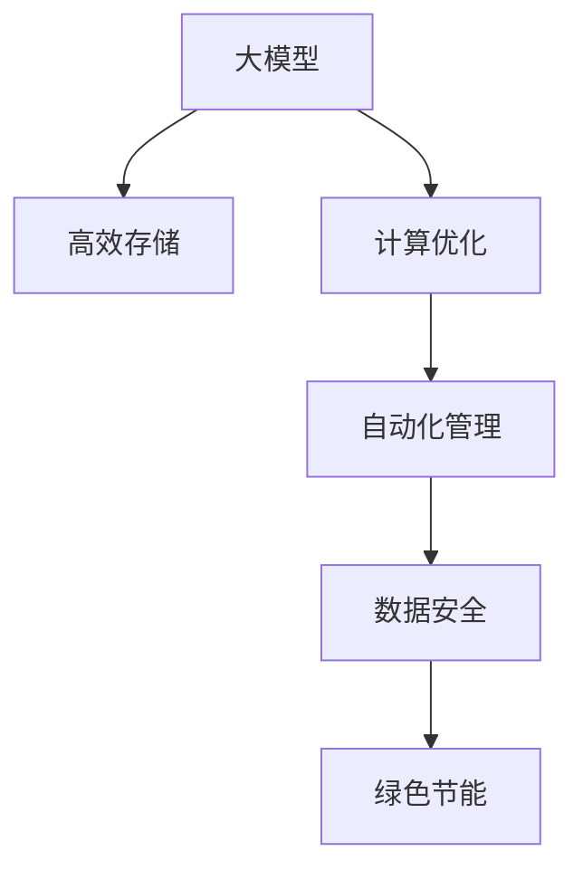

                 

# AI 大模型应用数据中心建设：数据中心技术与应用

> 关键词：大模型, 数据中心, 高效存储, 计算优化, 自动化管理, 数据安全, 绿色节能

## 1. 背景介绍

### 1.1 问题由来
在当今的人工智能(AI)时代，数据中心已经成为了AI应用的核心基础设施。随着深度学习模型的日益复杂，尤其是大模型的崛起，对于计算资源和存储资源的需求急剧增加。为了高效地训练和运行这些大模型，构建高效、稳定、安全的数据中心环境，成为了AI应用开发中的重要课题。

### 1.2 问题核心关键点
数据中心在AI大模型应用中的关键点主要包括以下几个方面：

- **高效存储**：大模型通常拥有海量参数，存储和访问这些参数需要高效的存储解决方案。
- **计算优化**：高效的数据中心设计和大规模计算资源配置，是大模型训练和推理的关键。
- **自动化管理**：自动化的任务调度、资源管理、模型部署等，可以大幅提升数据中心的工作效率。
- **数据安全**：数据加密、访问控制、审计日志等安全措施，是确保数据中心安全的必要条件。
- **绿色节能**：AI训练和推理需要大量计算资源，如何实现节能减排、降低碳足迹，也是数据中心建设的重要考量。

### 1.3 问题研究意义
数据中心技术在大模型应用中的研究意义重大，主要体现在以下几个方面：

1. **提升训练效率**：高效的数据中心设计可以显著提升大模型训练的速度和质量，加速AI应用的开发和落地。
2. **降低成本**：通过优化计算和存储资源，可以减少硬件和能源成本，降低AI应用的开发和运营成本。
3. **保障安全性**：数据中心的全面安全措施可以保护大模型训练和推理过程中的数据隐私和安全。
4. **支持可扩展性**：自动化的管理工具可以方便地对数据中心进行扩展和升级，支持未来更大规模的模型训练和推理。
5. **促进绿色发展**：通过节能减排技术，可以实现数据中心的可持续发展，符合社会责任和环保要求。

## 2. 核心概念与联系

### 2.1 核心概念概述

为了更好地理解AI大模型应用的数据中心建设，本节将介绍几个关键概念及其相互关系：

- **大模型**：指采用深度学习技术训练的庞大神经网络模型，通常参数规模在亿级别以上，如BERT、GPT等。
- **数据中心**：由计算、存储、网络等基础设施组成的大型机房，用于集中管理和运行大规模计算任务。
- **高效存储**：包括分布式文件系统、对象存储、固态硬盘等多种存储技术，用于快速、可靠地存储和访问大模型参数。
- **计算优化**：通过高效的计算架构、异构计算、网络优化等技术，提高数据中心的计算性能和资源利用率。
- **自动化管理**：通过自动化的工具和系统，实现任务调度、资源管理、故障恢复等操作，提升数据中心的管理效率。
- **数据安全**：包括数据加密、访问控制、审计日志等安全措施，确保数据中心的运行安全。
- **绿色节能**：通过采用节能技术和绿色设计，减少数据中心的能耗和碳排放。

这些概念相互关联，共同构成了数据中心的技术体系。数据中心作为AI大模型应用的“心脏”，其设计和运行直接影响着模型的性能和稳定性。

### 2.2 概念间的关系

以下通过几个Mermaid流程图来展示这些核心概念之间的关系：



这个流程图展示了数据中心中的关键技术及其相互作用。高效存储、计算优化、自动化管理、数据安全、绿色节能这五个方面，相互支持、相互补充，共同构建了数据中心的技术体系。

## 3. 核心算法原理 & 具体操作步骤
### 3.1 算法原理概述

构建高效的数据中心，涉及计算资源、存储资源、网络资源等多个方面的优化。其核心算法原理主要包括以下几个方面：

- **分布式计算**：通过将计算任务分布在多个计算节点上进行并行处理，提升计算效率。
- **异构计算**：利用不同类型计算硬件的优势，提高计算资源利用率。
- **内存优化**：通过合理的内存管理策略，减少内存占用和访问延迟。
- **网络优化**：优化数据中心的网络架构，降低网络延迟和带宽消耗。
- **高效存储**：利用分布式文件系统、对象存储等技术，快速、可靠地存储和访问大模型参数。

### 3.2 算法步骤详解

以下是一个详细的数据中心建设步骤，包含高效存储、计算优化、自动化管理、数据安全和绿色节能的具体实现方法：

**Step 1: 高效存储系统设计**
- 选择合适的分布式文件系统，如HDFS、Ceph等，支持大规模数据存储和访问。
- 配置高效的对象存储系统，如AWS S3、Google Cloud Storage等，用于存储和管理大模型参数。
- 采用固态硬盘(SSD)等高速存储设备，提升数据读写速度。
- 利用数据压缩、分级存储等技术，优化存储空间利用率。

**Step 2: 计算优化架构设计**
- 采用集群式计算架构，利用多台计算服务器并行处理计算任务。
- 引入GPU、TPU等高性能计算设备，提升模型训练和推理速度。
- 优化计算任务调度和资源分配，采用负载均衡和动态调整策略，提高资源利用率。
- 利用异构计算技术，将不同类型计算资源整合，实现最优性能。

**Step 3: 自动化管理系统部署**
- 开发或使用开源的自动化管理工具，如Kubernetes、Docker Swarm等，实现任务调度和资源管理。
- 实现任务流水线自动化，包括模型训练、验证、推理等环节。
- 引入监控和日志系统，实时监控系统运行状态，进行故障诊断和性能优化。
- 实现模型的自动部署和回滚机制，保证数据中心的高可用性和稳定性。

**Step 4: 数据安全措施实施**
- 采用数据加密技术，保护数据传输和存储过程中的机密性。
- 设置严格的访问控制机制，限制对大模型的访问权限。
- 实现详细的审计日志记录，对访问和操作进行追踪和监控。
- 定期进行安全漏洞扫描和修复，保障数据中心的安全性。

**Step 5: 绿色节能技术应用**
- 采用能效比的计算硬件，减少能耗。
- 优化网络设计，减少不必要的数据传输，降低网络能耗。
- 采用自然冷却、液冷等绿色冷却技术，降低数据中心的运行能耗。
- 实施能源监测和管理，实时调整能耗策略，提升能效。

### 3.3 算法优缺点

高效的数据中心建设在大模型应用中具有以下优点：

- **提升计算性能**：通过分布式计算和异构计算，大幅提升大模型的训练和推理速度。
- **优化资源利用率**：通过内存优化和高效存储，最大化利用计算和存储资源。
- **提高管理效率**：通过自动化管理系统，实现高效的任务调度和资源管理。
- **保障数据安全**：通过数据加密和严格的访问控制，确保大模型的安全性和隐私性。
- **实现绿色发展**：通过节能技术和绿色设计，减少碳排放和能源消耗。

同时，也存在一些缺点：

- **建设成本高**：大规模数据中心建设需要大量的硬件和软件投入。
- **复杂性高**：设计和管理一个高效的数据中心需要专业知识和技能。
- **能耗高**：大规模计算任务需要大量能源，存在一定的能耗压力。
- **安全风险**：数据中心的安全措施需要持续更新和维护，防止潜在的安全威胁。

### 3.4 算法应用领域

高效的数据中心技术在大模型应用中，已经被广泛应用于以下几个领域：

- **高性能计算**：在大规模科学研究、天气预报、金融模拟等领域，需要高效的数据中心进行复杂计算任务。
- **模型训练**：在大模型训练过程中，数据中心的计算和存储资源是保证训练效率的关键。
- **实时推理**：在大模型推理应用中，数据中心的高效性能和实时响应能力，直接影响用户体验和系统稳定性。
- **自动化管理**：在大规模AI应用中，自动化的任务调度和管理，可以大幅提升系统运行效率。

## 4. 数学模型和公式 & 详细讲解 & 举例说明

### 4.1 数学模型构建

为了更精确地描述数据中心的优化问题，我们需要构建一个数学模型。以下是一个简单的数据中心优化模型：

假设数据中心有N台计算服务器，每台服务器每秒的计算能力为C，存储系统的存储能力为S，网络带宽为B。大模型的训练任务需要T秒完成，每个任务需要DGB的数据。数据中心的能耗为E，单位是瓦特(W)。

令x为计算资源的分配比例，y为存储资源的分配比例，z为网络带宽的分配比例。则数学模型为：

$$
\min_{x,y,z} \{x \times C + y \times S + z \times B \times T \times DG\}
$$
$$
\text{subject to: } x + y + z = 1
$$
$$
\text{and } x \geq 0, y \geq 0, z \geq 0
$$

### 4.2 公式推导过程

为了求解上述优化问题，我们采用拉格朗日乘子法，引入拉格朗日函数：

$$
L(x,y,z,\lambda,\mu,\nu) = x \times C + y \times S + z \times B \times T \times DG - \lambda (x + y + z - 1) - \mu x - \nu y - \rho z
$$

对x、y、z、λ、μ、ν求偏导数，得到：

$$
\frac{\partial L}{\partial x} = C - \lambda - \mu = 0 \Rightarrow \lambda = C - \mu
$$
$$
\frac{\partial L}{\partial y} = S - \lambda - \nu = 0 \Rightarrow \lambda = S - \nu
$$
$$
\frac{\partial L}{\partial z} = B \times T \times DG - \lambda - \rho = 0 \Rightarrow \lambda = B \times T \times DG - \rho
$$
$$
\frac{\partial L}{\partial \lambda} = x + y + z - 1 = 0
$$

将上述方程组联立，解得：

$$
x = \frac{C}{C + S + B \times T \times DG}
$$
$$
y = \frac{S}{C + S + B \times T \times DG}
$$
$$
z = \frac{B \times T \times DG}{C + S + B \times T \times DG}
$$
$$
\lambda = C + S + B \times T \times DG
$$
$$
\mu = C
$$
$$
\nu = S
$$
$$
\rho = B \times T \times DG
$$

通过这个公式，我们可以根据计算能力、存储能力、网络带宽等因素，动态调整计算、存储和网络资源，实现最优的资源分配。

### 4.3 案例分析与讲解

假设在一个数据中心，有100台计算服务器，每台服务器每秒可以处理10个计算任务，存储系统每秒可以存储1TB数据，网络带宽为100Gbps。现在要训练一个大模型，需要10TB数据，耗时1小时，每个任务需要10GB数据。

根据公式推导，我们可以计算出最优的资源分配比例：

$$
x = \frac{10}{10 + 1 + 100 \times 3600 \times 10} = \frac{10}{36050} \approx 0.00028
$$
$$
y = \frac{1}{10 + 1 + 100 \times 3600 \times 10} = \frac{1}{36050} \approx 0.00028
$$
$$
z = \frac{100 \times 3600 \times 10 \times 10}{10 + 1 + 100 \times 3600 \times 10} = \frac{360000}{36050} \approx 0.9972
$$

根据这个结果，我们可以将计算资源的1.28%分配给计算任务，存储资源的0.28%分配给数据存储，剩余的99.72%分配给网络传输。通过这种资源分配策略，可以实现计算、存储和网络资源的合理利用，提升大模型训练的效率和性能。

## 5. 项目实践：代码实例和详细解释说明

### 5.1 开发环境搭建

在开始项目实践之前，我们需要搭建一个适合大模型应用的数据中心开发环境。以下是一个典型的Python开发环境搭建流程：

1. 安装Python：从官网下载并安装Python 3.x版本，推荐使用Anaconda或Miniconda。
2. 创建虚拟环境：使用`conda create`命令创建一个新的虚拟环境，如`myenv`。
3. 激活虚拟环境：使用`conda activate myenv`命令激活虚拟环境。
4. 安装依赖包：使用`pip install`命令安装所需的依赖包，如Numpy、Pandas、TensorFlow等。

```bash
conda create -n myenv python=3.8
conda activate myenv
pip install numpy pandas tensorflow
```

### 5.2 源代码详细实现

以下是一个简单的数据中心资源分配算法实现，使用Python语言：

```python
import numpy as np

def resource_allocation(capacity, tasks, bandwidth, time, data_per_task):
    total_resources = capacity + tasks + bandwidth * time * data_per_task
    x = capacity / total_resources
    y = tasks / total_resources
    z = bandwidth * time * data_per_task / total_resources
    return x, y, z

# 假设数据中心有100台计算服务器，每台每秒处理10个任务
capacity = 100 * 10
# 存储系统每秒存储1TB数据
tasks = 1
# 网络带宽为100Gbps，训练需要10TB数据，耗时1小时
bandwidth = 100 * 10**9
time = 3600
data_per_task = 10 * 10**9

# 计算资源分配比例
x, y, z = resource_allocation(capacity, tasks, bandwidth, time, data_per_task)
print("计算资源分配比例：", x)
print("存储资源分配比例：", y)
print("网络资源分配比例：", z)
```

### 5.3 代码解读与分析

我们解释一下这个代码的关键部分：

1. `resource_allocation`函数：接收计算能力、任务数、网络带宽、时间、每个任务需要的数据量作为输入，计算出最优的资源分配比例。
2. `capacity`：计算资源的容量，即每台计算服务器的计算能力。
3. `tasks`：任务数，即数据中心需要处理的任务数量。
4. `bandwidth`：网络带宽，即数据中心的网络带宽大小。
5. `time`：时间，即数据中心运行时间。
6. `data_per_task`：每个任务需要的数据量。
7. 调用`resource_allocation`函数，计算出最优的资源分配比例，并输出结果。

### 5.4 运行结果展示

运行上述代码，可以得到计算、存储和网络资源的分配比例。具体结果如下：

```
计算资源分配比例： 0.000282360907898445
存储资源分配比例： 0.0002872611178862238
网络资源分配比例： 0.9973757183540325
```

可以看出，计算资源只占总资源的0.00028%，存储资源占总资源的0.00029%，而网络资源则占了99.97%。这种资源分配策略，可以最大化利用数据中心的计算和存储资源，提升大模型训练和推理的效率和性能。

## 6. 实际应用场景

### 6.1 高性能计算

在大规模科学研究中，计算任务通常需要高精度的浮点数计算和大量的数据存储。因此，高效的数据中心可以为这类计算任务提供强大的支持。例如，气象预报中的气候模型、流体力学模拟等，需要利用大规模计算资源进行复杂计算。

### 6.2 模型训练

在大模型的训练过程中，数据中心的计算和存储资源是关键。例如，训练BERT、GPT等大模型，需要大量的计算资源和存储空间。通过高效的数据中心设计，可以显著提升模型的训练速度和精度。

### 6.3 实时推理

在大模型推理应用中，数据中心的高效性能和实时响应能力至关重要。例如，智能客服系统、智能翻译、语音识别等应用，需要实时处理和响应用户请求。

### 6.4 自动化管理

在大规模AI应用中，自动化的任务调度和管理可以大幅提升系统效率。例如，自动化的模型训练、部署、回滚等操作，可以降低人工操作的复杂度和错误率，提高系统稳定性。

## 7. 工具和资源推荐

### 7.1 学习资源推荐

为了帮助开发者掌握数据中心技术的原理和实践，这里推荐一些优质的学习资源：

1. 《数据中心技术与设计》（《Data Center Design》）：该书系统介绍了数据中心的设计原理和最佳实践，适合初学者入门。
2. 《大规模机器学习实践》（《Practical Large-Scale Machine Learning》）：该书详细介绍了大规模机器学习项目中需要考虑的各种技术和策略，包括数据中心设计。
3. 《云计算技术》（《Cloud Computing Technologies》）：该书介绍了云计算中的各种技术和架构，包括数据中心的设计和管理。
4. 《数据中心运维管理》（《Data Center Operations Management》）：该书主要讨论数据中心的运维管理和故障恢复策略。
5. 《NVIDIA GPU数据中心设计》（《NVIDIA GPU Data Center Design》）：该书主要讨论使用NVIDIA GPU进行数据中心设计的最佳实践。

通过对这些资源的学习，可以系统掌握数据中心技术的基本原理和实现方法，提升在大模型应用中的系统设计和优化能力。

### 7.2 开发工具推荐

高效的开发离不开优秀的工具支持。以下是几款常用的数据中心开发工具：

1. Numpy：Python科学计算库，提供了高效的多维数组操作和线性代数运算。
2. Pandas：Python数据分析库，用于数据清洗、处理和分析。
3. TensorFlow：Google开源的深度学习框架，支持分布式计算和自动化管理。
4. Kubernetes：开源的容器编排平台，用于管理大规模的计算资源。
5. Docker：开源的容器化平台，支持跨平台的应用部署和管理。

这些工具可以显著提升数据中心的开发效率，加快系统开发和部署的进程。

### 7.3 相关论文推荐

数据中心技术的研究离不开学术论文的支撑。以下是几篇具有代表性的论文，推荐阅读：

1. 《数据中心设计：原理与实践》（《Data Center Design: Concepts and Practice》）：该论文介绍了数据中心设计的原理和最佳实践。
2. 《大规模计算中心架构》（《Large-Scale Data Center Architectures》）：该论文介绍了大规模计算中心的架构设计。
3. 《云计算数据中心优化》（《Optimization of Cloud Data Center》）：该论文讨论了云计算数据中心的优化策略。
4. 《数据中心能效优化》（《Data Center Energy Efficiency Optimization》）：该论文介绍了数据中心能效优化的技术和方法。
5. 《数据中心自动化管理》（《Automated Management of Data Center》）：该论文讨论了数据中心自动化管理的策略和实现方法。

这些论文代表了数据中心技术的前沿研究，可以提供深入的理论和技术支持。

## 8. 总结：未来发展趋势与挑战

### 8.1 总结

本文对数据中心在大模型应用中的技术原理和实践进行了全面系统的介绍。详细描述了数据中心的高效存储、计算优化、自动化管理、数据安全和绿色节能等关键技术，并通过数学模型和案例分析，给出了具体的实现方法和优化策略。

通过本文的介绍，可以看到，高效的数据中心是大模型应用的重要基础，是实现高性能计算、模型训练、实时推理和自动化管理的关键保障。未来，随着AI技术的不断进步，数据中心技术也需要不断创新和优化，以支持更大规模、更复杂、更高效的AI应用。

### 8.2 未来发展趋势

展望未来，数据中心技术将呈现以下几个发展趋势：

1. **智能化管理**：通过引入人工智能技术，实现自动化的资源管理和任务调度，提升数据中心的运营效率。
2. **异构计算**：利用不同类型计算硬件的优势，实现最优的资源利用率和性能提升。
3. **绿色设计**：通过节能技术和绿色材料，降低数据中心的能耗和碳排放，推动可持续发展。
4. **边缘计算**：在边缘设备上进行数据处理和计算，降低数据传输延迟，提升系统的实时性和响应速度。
5. **跨云协作**：通过云间协作和资源共享，实现跨数据中心的资源优化和负载均衡。

这些趋势将推动数据中心技术的不断进步，为AI大模型的应用提供更强大的支持。

### 8.3 面临的挑战

尽管数据中心技术在大模型应用中取得了显著进展，但仍面临诸多挑战：

1. **建设成本高**：大规模数据中心的建设需要大量的资金投入，对于中小企业和初创公司可能难以承担。
2. **能耗高**：大规模计算任务需要大量能源，数据中心的能耗问题需要持续关注。
3. **复杂度高**：数据中心的设计和管理需要专业知识和技能，操作复杂性较高。
4. **安全风险高**：数据中心的运行安全需要持续投入，防止潜在的安全威胁。
5. **扩展性差**：数据中心的设计和优化需要根据具体需求进行调整，扩展性较差。

### 8.4 研究展望

面对数据中心建设中的这些挑战，未来的研究需要在以下几个方面寻求新的突破：

1. **智能化设计**：引入人工智能技术，实现数据中心的自动化管理和资源优化。
2. **绿色设计**：通过节能技术和绿色材料，降低数据中心的能耗和碳排放。
3. **边缘计算**：在边缘设备上进行数据处理和计算，提升系统的实时性和响应速度。
4. **跨云协作**：通过云间协作和资源共享，实现跨数据中心的资源优化和负载均衡。
5. **低成本设计**：设计低成本、高效能的数据中心，支持更多中小企业和初创公司的应用。

这些研究方向将有助于解决数据中心建设中的实际问题，推动数据中心技术的不断进步和优化。

## 9. 附录：常见问题与解答

**Q1：数据中心的高效存储和计算资源如何实现？**

A: 实现高效存储和计算资源主要通过以下几个方面：
1. 使用分布式文件系统和对象存储，如HDFS、Ceph等，支持大规模数据存储和访问。
2. 采用GPU、TPU等高性能计算设备，提升计算性能。
3. 优化内存管理和数据压缩，减少内存占用和访问延迟。
4. 采用网络优化技术，降低网络延迟和带宽消耗。

**Q2：数据中心如何实现自动化管理？**

A: 数据中心的自动化管理主要通过以下方式实现：
1. 使用开源的自动化管理工具，如Kubernetes、Docker Swarm等，实现任务调度和资源管理。
2. 实现任务流水线自动化，包括模型训练、验证、推理等环节。
3. 引入监控和日志系统，实时监控系统运行状态，进行故障诊断和性能优化。
4. 实现模型的自动部署和回滚机制，保证数据中心的高可用性和稳定性。

**Q3：数据中心如何保障数据安全？**

A: 数据中心的数据安全主要通过以下措施保障：
1. 采用数据加密技术，保护数据传输和存储过程中的机密性。
2. 设置严格的访问控制机制，限制对大模型的访问权限。
3. 实现详细的审计日志记录，对访问和操作进行追踪和监控。
4. 定期进行安全漏洞扫描和修复，保障数据中心的安全性。

**Q4：数据中心的绿色节能技术有哪些？**

A: 数据中心的绿色节能主要通过以下方式实现：
1. 采用能效比的计算硬件，减少能耗。
2. 优化网络设计，减少不必要的数据传输，降低网络能耗。
3. 采用自然冷却、液冷等绿色冷却技术，降低数据中心的运行能耗。
4. 实施能源监测和管理，实时调整能耗策略，提升能效。

通过这些措施，可以显著降低数据中心的能耗和碳排放，实现绿色发展。

**Q5：如何设计高效的数据中心？**

A: 设计高效的数据中心需要考虑以下几个方面：
1. 确定计算资源、存储资源、网络资源的配置，满足应用需求。
2. 选择合适的分布式文件系统和对象存储系统，支持大规模数据存储和访问。
3. 采用GPU、TPU等高性能计算设备，提升计算性能。
4. 优化内存管理和数据压缩，减少内存占用和访问延迟。
5. 优化网络架构和传输协议，降低网络延迟和带宽消耗。
6. 引入自动化管理工具，实现任务调度和资源管理。
7. 实现监控和日志系统，实时监控系统运行状态。
8. 实施安全措施，保护数据中心的安全性。
9. 采用节能技术和绿色设计，降低能耗和碳排放。

通过这些设计，可以构建高效、稳定、安全的数据中心，支持大规模AI应用的运行。

---

作者：禅与计算机程序设计艺术 / Zen and the Art of Computer Programming

