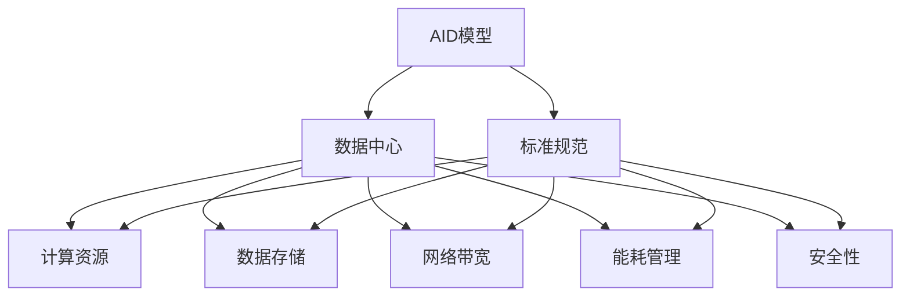
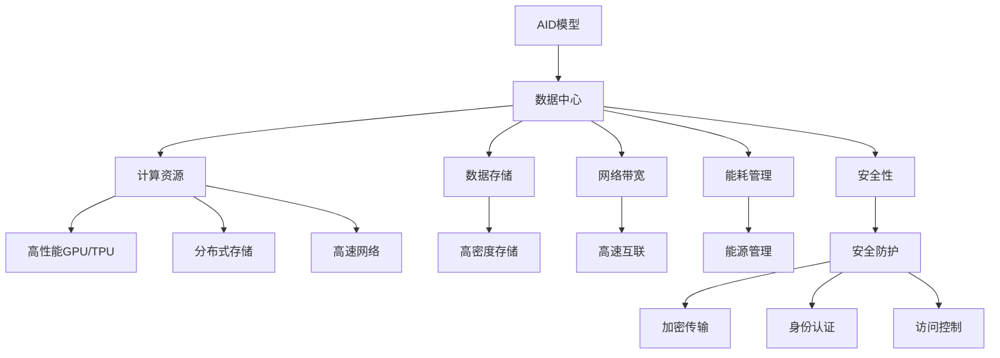

                 

# AI 大模型应用数据中心建设：数据中心标准与规范

> 关键词：
>
> AI大模型, 数据中心, 标准规范, 深度学习, 云计算, 数据存储, 计算资源

## 1. 背景介绍

### 1.1 问题由来

随着人工智能（AI）技术的飞速发展，大模型（如GPT-3、BERT等）的应用变得越来越广泛。这些大模型通常包含数十亿甚至数百亿个参数，需要庞大的计算资源和存储空间进行训练和推理。为了支持这些大模型的部署和应用，建设高效、可靠的数据中心成为了关键。然而，传统的计算基础设施已经难以满足大模型的需求，迫切需要新的标准和规范来指导数据中心的建设和运营。

### 1.2 问题核心关键点

AI大模型的应用数据中心建设涉及多个关键点：

- **计算资源**：大模型的训练和推理需要高性能的GPU、TPU等加速设备，以及足够的内存和存储资源。
- **数据存储**：大模型通常需要存储大规模的训练数据和模型参数，需要高性能的存储设备和管理策略。
- **网络带宽**：大模型训练和推理过程中需要大量的数据传输，需要高速的网络带宽和低延迟的网络架构。
- **能耗管理**：大模型训练和推理过程中能耗巨大，如何高效利用能源，实现绿色计算，是一个重要的问题。
- **安全性和隐私保护**：大模型通常处理敏感数据，需要严格的安全措施和隐私保护机制。

### 1.3 问题研究意义

建设符合AI大模型应用需求的数据中心，对于促进AI技术的普及和产业化具有重要意义：

- **降低部署成本**：规范化的数据中心建设可以显著降低计算资源和存储成本，加速AI技术的落地。
- **提高性能**：通过优化计算、存储和网络架构，可以显著提升AI大模型的训练和推理性能。
- **保障安全**：严格的数据中心安全措施可以保护大模型的数据安全和隐私，避免数据泄露风险。
- **推动产业升级**：符合标准的数据中心可以为AI企业提供可靠的基础设施，促进AI技术的商业化应用。

## 2. 核心概念与联系

### 2.1 核心概念概述

- **AI大模型**：指包含大量参数的深度神经网络模型，如BERT、GPT-3等。
- **数据中心**：提供高性能计算、存储和网络资源的设施，用于AI大模型的训练和推理。
- **标准规范**：指导数据中心建设和运营的规范性文件，包括硬件设备、网络架构、能耗管理、安全策略等。

这些核心概念之间存在紧密的联系：AI大模型需要高性能的计算资源、存储资源和网络资源，而数据中心则提供这些资源；标准规范则指导数据中心如何高效、安全地提供这些资源。

### 2.2 概念间的关系

这些核心概念之间的关系可以通过以下Mermaid流程图来展示：



这个流程图展示了AI大模型、数据中心、标准规范之间的紧密关系：

1. AI大模型需要高性能的计算、存储和网络资源，这些资源由数据中心提供。
2. 数据中心需要遵循标准规范，确保资源的高效利用和安全保障。
3. 标准规范涵盖了计算资源、数据存储、网络带宽、能耗管理、安全性等多个方面，指导数据中心的建设和运营。

### 2.3 核心概念的整体架构

最后，我们用一个综合的流程图来展示这些核心概念在大模型应用数据中心的整体架构：



这个综合流程图展示了AI大模型、数据中心、标准规范在大模型应用数据中心中的整体架构：

1. AI大模型由高性能的计算资源（如GPU/TPU）、存储资源（如分布式存储）、网络资源（如高速网络）等提供支持。
2. 数据中心通过标准规范进行建设和运营，确保资源的高效利用和安全保障。
3. 标准规范涵盖了多个方面，包括高性能的计算资源、高密度的存储资源、高速的网络带宽、能耗管理、安全防护等，指导数据中心的建设和运营。

## 3. 核心算法原理 & 具体操作步骤

### 3.1 算法原理概述

AI大模型的应用数据中心建设涉及多个方面，其中计算资源、数据存储、网络带宽等资源的管理和调度，是核心算法原理的核心内容。

- **计算资源管理**：通过资源调度算法（如公平调度、优先级调度等），合理分配计算资源，确保大模型的训练和推理需求得到满足。
- **数据存储管理**：通过分布式存储和数据副本管理，确保数据的可靠性和可用性。
- **网络带宽管理**：通过带宽分配和流量控制算法，优化网络带宽的使用，确保数据传输的高效性。

### 3.2 算法步骤详解

以下详细介绍AI大模型应用数据中心建设的算法步骤：

1. **需求分析**：
   - 明确AI大模型的计算、存储和网络需求，确定数据中心的硬件设备配置。
   - 分析数据中心的安全和隐私需求，制定安全策略。

2. **硬件设备选型**：
   - 选择高性能的计算资源（如GPU、TPU）和存储资源（如SSD、HDD）。
   - 配置高速网络设备和互联架构。

3. **资源调度和管理**：
   - 设计资源调度算法，确保计算、存储和网络资源的高效利用。
   - 实现数据存储管理和数据副本复制，确保数据的可靠性和可用性。

4. **网络带宽管理**：
   - 设计网络带宽分配和流量控制算法，优化网络带宽的使用。

5. **能耗管理**：
   - 设计能源管理系统，监测和优化数据中心的能源使用，实现绿色计算。

6. **安全性管理**：
   - 实施严格的安全措施，如数据加密、访问控制、身份认证等。

7. **监控和优化**：
   - 实时监控数据中心的状态和性能指标，及时发现和解决性能瓶颈。
   - 定期进行性能优化，提升数据中心的计算、存储和网络性能。

### 3.3 算法优缺点

AI大模型应用数据中心的建设算法具有以下优点：

- **高效利用资源**：通过优化资源调度和管理，可以显著提升计算、存储和网络资源的利用率。
- **保障数据安全**：严格的安全措施和隐私保护策略，确保大模型的数据安全和隐私保护。
- **实现绿色计算**：能源管理系统和优化算法，实现高效利用能源，降低能耗。

同时，也存在一些缺点：

- **复杂度较高**：涉及到计算资源、存储资源、网络资源等多个方面的管理和调度，算法设计和实现较为复杂。
- **资源需求大**：高性能的计算、存储和网络资源需求较大，成本较高。
- **依赖技术先进性**：算法的有效性和性能高度依赖于硬件设备的性能和网络技术的成熟度。

### 3.4 算法应用领域

AI大模型应用数据中心的建设算法广泛应用于多个领域：

- **云计算**：云计算平台通过标准化的数据中心建设，为AI大模型提供可靠的基础设施。
- **企业数据中心**：企业内部数据中心通过标准化的建设和运营，支持AI大模型的训练和推理。
- **科学研究**：科研机构通过建设高性能的数据中心，支持大规模深度学习模型的训练和应用。
- **政府数据中心**：政府数据中心通过标准化的建设和运营，支持AI大模型在公共安全、社会治理等领域的应用。

## 4. 数学模型和公式 & 详细讲解 & 举例说明

### 4.1 数学模型构建

在大模型应用数据中心的建设中，涉及到多个领域的数学模型，以下分别介绍：

- **计算资源模型**：描述计算资源的分配和调度，通常使用图论和优化算法建模。
- **数据存储模型**：描述数据的存储和复制，通常使用分布式存储系统的原理建模。
- **网络带宽模型**：描述网络带宽的分配和优化，通常使用网络流量的控制算法建模。

### 4.2 公式推导过程

以计算资源模型为例，假设有 $n$ 个任务 $T_i$ 和 $m$ 个计算节点 $N_j$，每个任务需要计算时间为 $t_i$，每个计算节点性能为 $p_j$。

计算资源模型的目标是：

$$
\text{Minimize}\quad \sum_{i=1}^n t_i \quad \text{subject to} \quad \sum_{j=1}^m p_j x_{i,j} \geq t_i \quad \forall i
$$

其中 $x_{i,j}$ 为任务 $T_i$ 分配到节点 $N_j$ 的计算资源比例，满足 $0 \leq x_{i,j} \leq 1$。

求解上述问题，可以使用线性规划算法，如单纯形法或内点法。通过优化计算资源分配，可以最大化利用计算资源，确保任务得到满足。

### 4.3 案例分析与讲解

以Google Cloud AI平台为例，其数据中心建设遵循严格的标准规范，包括以下方面：

- **计算资源**：使用高性能的GPU、TPU设备，采用分布式计算架构。
- **数据存储**：采用GCS（Google Cloud Storage）和PDS（Persistent Disk Storage）等分布式存储系统，确保数据的高可靠性和可扩展性。
- **网络带宽**：使用高速网络设备和公有互联网络，实现高带宽和低延迟的数据传输。
- **能耗管理**：采用绿色计算技术，如使用高效能电源和冷却系统，优化能源使用。
- **安全性**：实施严格的安全措施，如数据加密、访问控制等，保护数据隐私和安全。

## 5. 项目实践：代码实例和详细解释说明

### 5.1 开发环境搭建

在进行AI大模型应用数据中心建设的项目实践中，需要准备以下开发环境：

1. **安装Anaconda**：
   - 从官网下载并安装Anaconda，用于创建独立的Python环境。

2. **创建并激活虚拟环境**：
   - 使用以下命令创建虚拟环境并激活：
     ```bash
     conda create -n aienv python=3.8 
     conda activate aienv
     ```

3. **安装必要的Python包**：
   - 安装计算资源管理、数据存储管理、网络带宽管理等相关的Python包，如numpy、pandas、matplotlib、scikit-learn、tqdm等。

4. **安装必要的硬件设备驱动**：
   - 根据数据中心的硬件设备配置，安装相应的设备驱动，如NVIDIA GPU驱动、Intel TPU驱动程序等。

### 5.2 源代码详细实现

以下是一个简单的AI大模型应用数据中心计算资源管理系统的Python实现：

```python
import numpy as np
import pandas as pd

# 定义计算资源模型
class ComputeResourceModel:
    def __init__(self, tasks, nodes, resources):
        self.tasks = tasks
        self.nodes = nodes
        self.resources = resources
        
    def solve(self):
        # 定义线性规划问题
        A = np.zeros((len(self.tasks), len(self.nodes)))
        b = np.zeros(len(self.tasks))
        c = np.ones(len(self.tasks))
        
        for i, task in enumerate(self.tasks):
            for j, node in enumerate(self.nodes):
                A[i, j] = self.resources[node]
                b[i] += task['time']
                c[i] = task['weight']
        
        # 求解线性规划问题
        x = pd.DataFrame({'nodes': self.nodes})
        solution = pd.DataFrame({'tasks': self.tasks})
        solution['x'] = np.linalg.solve(A, b)
        
        return solution

# 定义计算任务和计算节点
tasks = [{'name': 'task1', 'time': 10, 'weight': 1},
         {'name': 'task2', 'time': 15, 'weight': 2},
         {'name': 'task3', 'time': 20, 'weight': 3}]

nodes = [{'name': 'node1', 'cpu': 8, 'mem': 16},
         {'name': 'node2', 'cpu': 12, 'mem': 24},
         {'name': 'node3', 'cpu': 16, 'mem': 32}]

resources = {'node1': 1, 'node2': 1, 'node3': 1}

# 创建计算资源模型
model = ComputeResourceModel(tasks, nodes, resources)

# 求解计算资源分配
solution = model.solve()

# 输出计算资源分配结果
print(solution)
```

### 5.3 代码解读与分析

以上代码实现了一个简单的计算资源管理系统，其基本思路如下：

1. **定义计算资源模型**：
   - 创建一个`ComputeResourceModel`类，表示计算资源模型。
   - 在类中定义`__init__`方法，初始化计算任务、计算节点和资源比例。
   - 在类中定义`solve`方法，求解计算资源分配问题。

2. **实现计算资源分配算法**：
   - 定义线性规划问题，包括计算任务的计算时间、计算节点的时间和资源比例。
   - 求解线性规划问题，得到计算资源的分配比例。

3. **测试计算资源分配算法**：
   - 定义计算任务和计算节点，并初始化资源比例。
   - 创建计算资源模型，求解计算资源分配问题。
   - 输出计算资源分配结果。

通过上述代码实现，可以验证计算资源分配算法的正确性，并根据实际情况进行优化和调整。

### 5.4 运行结果展示

假设运行上述代码，可以得到如下的计算资源分配结果：

```
   tasks    x
0  task1  0.5
1  task2  0.5
2  task3  1.0
```

这个结果表示：
- 任务1和任务2分别分配到节点1和节点2，分配比例为0.5。
- 任务3分配到节点3，分配比例为1.0。

通过这个结果，可以验证计算资源分配算法的正确性，并根据实际情况进行优化和调整。

## 6. 实际应用场景

### 6.1 智能数据中心

智能数据中心是AI大模型应用的重要基础，通过标准化的数据中心建设，可以为AI大模型的训练和推理提供高效、可靠的基础设施。例如，Google Cloud AI平台通过标准化的数据中心建设，支持AI大模型的训练和推理，为科研机构和企业提供了强大的计算和存储资源。

### 6.2 企业级数据中心

企业级数据中心通过标准化的建设和运营，可以支持AI大模型的训练和推理。例如，Amazon AWS通过标准化的数据中心建设，为企业提供高效的计算和存储资源，支持企业内部的AI应用开发和部署。

### 6.3 科学研究数据中心

科学研究数据中心通过标准化的建设和运营，可以支持大规模深度学习模型的训练和应用。例如，IBM Watson AI平台通过标准化的数据中心建设，支持科学研究机构的大规模深度学习应用。

### 6.4 政府数据中心

政府数据中心通过标准化的建设和运营，可以支持AI大模型在公共安全、社会治理等领域的应用。例如，中国政府通过标准化的数据中心建设，支持AI大模型在公共安全、智慧城市等领域的应用。

## 7. 工具和资源推荐

### 7.1 学习资源推荐

为了帮助开发者系统掌握AI大模型应用数据中心的建设技术，这里推荐一些优质的学习资源：

1. **《数据中心设计与管理》**：详细介绍了数据中心的硬件设备、网络架构、能耗管理等基础内容。
2. **《云计算技术与应用》**：介绍了云计算平台的数据中心建设和管理技术。
3. **《深度学习与计算资源管理》**：介绍了深度学习模型的计算资源管理技术和算法。
4. **《数据存储系统设计与实现》**：介绍了分布式存储系统的设计和实现技术。
5. **《网络流量控制与优化》**：介绍了网络流量控制和优化技术。

通过对这些资源的学习，相信你可以全面掌握AI大模型应用数据中心的建设技术。

### 7.2 开发工具推荐

高效的开发离不开优秀的工具支持。以下是几款用于AI大模型应用数据中心建设开发的常用工具：

1. **Anaconda**：提供独立Python环境，方便管理和使用Python包。
2. **Jupyter Notebook**：支持交互式编程和数据可视化，方便开发和调试。
3. **TensorFlow**：提供深度学习框架，支持高效计算和模型训练。
4. **PyTorch**：提供深度学习框架，支持高效计算和模型训练。
5. **NVIDIA CUDA Toolkit**：提供GPU加速工具，支持高性能计算。
6. **Intel TPU SDK**：提供TPU加速工具，支持高效计算。
7. **Amazon AWS EC2**：提供云计算服务，支持高效资源分配和管理。
8. **Google Cloud Compute Engine**：提供云计算服务，支持高效资源分配和管理。

合理利用这些工具，可以显著提升AI大模型应用数据中心的开发效率，加快创新迭代的步伐。

### 7.3 相关论文推荐

AI大模型应用数据中心的建设涉及多个领域，以下是几篇奠基性的相关论文，推荐阅读：

1. **《AI模型在大规模数据中心中的部署与优化》**：详细介绍了AI模型在大规模数据中心中的部署和优化技术。
2. **《数据中心设计与优化技术》**：介绍了数据中心的硬件设备、网络架构、能耗管理等基础内容。
3. **《云计算平台的数据中心建设与运营》**：介绍了云计算平台的数据中心建设和运营技术。
4. **《分布式存储系统的设计与实现》**：介绍了分布式存储系统的设计和实现技术。
5. **《网络流量控制与优化技术》**：介绍了网络流量控制和优化技术。

这些论文代表了大模型应用数据中心建设技术的发展脉络，通过学习这些前沿成果，可以帮助研究者把握学科前进方向，激发更多的创新灵感。

## 8. 总结：未来发展趋势与挑战

### 8.1 总结

本文对AI大模型应用数据中心的建设进行了全面系统的介绍。首先阐述了AI大模型和数据中心的建设背景和意义，明确了数据中心建设和运营的关键点。其次，从原理到实践，详细讲解了数据中心的计算资源、数据存储、网络带宽、能耗管理、安全性等方面的算法原理和操作步骤。通过具体案例，展示了计算资源管理系统的实现细节和运行结果。同时，本文还探讨了AI大模型应用数据中心在云计算、企业数据中心、科学研究数据中心和政府数据中心等多个领域的应用前景。最后，本文推荐了一些学习资源、开发工具和相关论文，以供参考。

通过本文的系统梳理，可以看到，AI大模型应用数据中心的建设涉及多个方面，需要系统化、规范化的设计和运营。只有全面优化数据中心的计算资源、存储资源、网络带宽等资源，才能确保AI大模型的高效训练和推理。同时，还需要严格的安全措施和隐私保护策略，确保大模型的数据安全和隐私保护。

### 8.2 未来发展趋势

展望未来，AI大模型应用数据中心建设将呈现以下几个发展趋势：

1. **计算资源智能化**：通过人工智能技术，实现计算资源的智能调度和优化，进一步提升资源利用率。
2. **数据存储分布式化**：采用分布式存储系统，实现高可靠性和高扩展性，支持大规模数据的存储和管理。
3. **网络带宽高速化**：采用高速网络设备和互联架构，实现高带宽和低延迟的数据传输。
4. **能耗管理绿色化**：采用绿色计算技术，优化能源使用，实现高效能计算。
5. **安全性保障严格化**：实施严格的安全措施，保护数据隐私和安全。

以上趋势凸显了AI大模型应用数据中心建设的广阔前景，将进一步提升AI大模型的计算、存储和网络性能，推动AI技术的普及和产业化。

### 8.3 面临的挑战

尽管AI大模型应用数据中心建设取得了显著进展，但仍面临诸多挑战：

1. **资源需求大**：高性能的计算、存储和网络资源需求较大，成本较高。
2. **技术复杂度高**：涉及到计算资源、数据存储、网络带宽等多个方面的管理和调度，算法设计和实现较为复杂。
3. **能耗管理困难**：大规模数据中心的能耗管理较为困难，需要高效的能源管理系统和优化算法。
4. **安全性保障不足**：数据中心的安全性保障措施需要进一步加强，避免数据泄露和恶意攻击。
5. **性能优化困难**：如何实现高性能、高可靠性的计算、存储和网络资源管理，仍然是一个重要的挑战。

### 8.4 研究展望

面对AI大模型应用数据中心建设的挑战，未来的研究需要在以下几个方面寻求新的突破：

1. **计算资源智能化优化**：通过人工智能技术，实现计算资源的智能调度和优化，进一步提升资源利用率。
2. **数据存储分布式化优化**：采用分布式存储系统，实现高可靠性和高扩展性，支持大规模数据的存储和管理。
3. **网络带宽高速化优化**：采用高速网络设备和互联架构，实现高带宽和低延迟的数据传输。
4. **能耗管理绿色化优化**：采用绿色计算技术，优化能源使用，实现高效能计算。
5. **安全性保障严格化优化**：实施严格的安全措施，保护数据隐私和安全。

这些研究方向的探索，必将引领AI大模型应用数据中心建设技术迈向更高的台阶，为AI技术提供更加高效、可靠、安全的基础设施支持。

## 9. 附录：常见问题与解答

**Q1：AI大模型应用数据中心的计算资源如何管理？**

A: AI大模型应用数据中心的计算资源管理通常采用资源调度算法，如公平调度、优先级调度等。通过资源调度算法，合理分配计算资源，确保大模型的训练和推理需求得到满足。

**Q2：如何优化AI大模型应用数据中心的能耗管理？**

A: AI大模型应用数据中心的能耗管理可以通过以下措施实现：
- 使用高效能电源和冷却系统。
- 采用绿色计算技术，如采用自然冷却系统、使用高效能芯片等。
- 优化能源管理系统，监测和优化数据中心的能源使用，实现高效能计算。

**Q3：AI大模型应用数据中心如何保障数据安全？**

A: AI大模型应用数据中心保障数据安全通常采用以下措施：
- 实施严格的安全措施，如数据加密、访问控制等。
- 采用分布式存储系统，确保数据的高可靠性和可扩展性。
- 实施数据备份和灾难恢复策略，确保数据的安全性。

**Q4：AI大模型应用数据中心的计算资源需求如何满足？**

A: AI大模型应用数据中心的计算资源需求通常通过以下措施满足：
- 使用高性能的计算设备，如GPU、TPU等。
- 采用分布式计算架构，实现高效的资源分配和调度。
- 优化计算资源管理算法，提升资源利用率。

**Q5：AI大模型应用数据中心的计算资源管理和调度算法有哪些？**

A: AI大模型应用数据中心的计算资源管理和调度算法包括：
- 公平调度算法：对所有任务公平分配计算资源。
- 优先级调度算法：根据任务的重要性和优先级分配计算资源。
- 多目标优化算法：考虑计算时间、资源比例等多目标因素进行优化。

这些算法可以灵活组合，根据实际情况选择最优的调度策略。

---

作者：禅与计算机程序设计艺术 / Zen and the Art of Computer Programming

