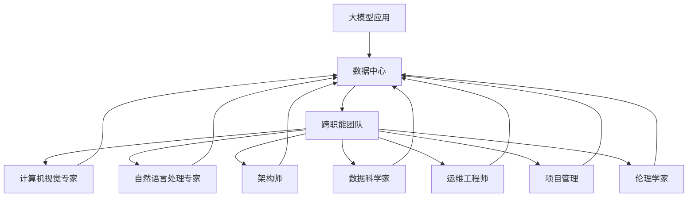
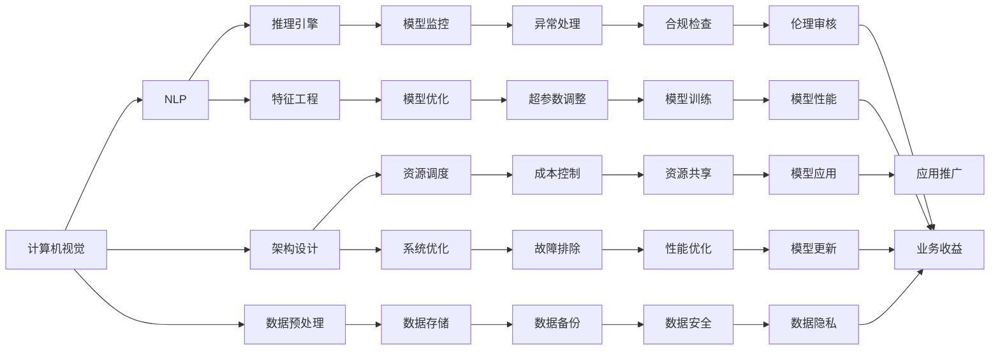

                 

# AI 大模型应用数据中心的团队建设

## 1. 背景介绍

### 1.1 问题由来

随着人工智能技术的快速发展，大模型应用逐渐从学术界进入工业界，带来了诸多挑战。特别是对于数据中心来说，大模型训练和推理的复杂性和资源需求，对团队建设和运营提出了更高要求。本文聚焦于如何构建高效、稳健、协同的数据中心团队，以支撑大模型的应用落地。

### 1.2 问题核心关键点

大模型应用数据中心的团队建设，核心在于构建一个由多学科专家组成的、高效协同的跨职能团队。团队成员需具备以下能力：

- **计算机视觉/自然语言处理专家**：负责算法设计和模型训练，确保大模型能够有效处理特定任务。
- **架构师**：设计高效、可扩展的计算和存储架构，确保模型训练和推理的高效性。
- **数据科学家**：负责数据预处理、特征工程，确保数据的质量和多样性，优化模型性能。
- **运维工程师**：负责系统部署、监控、故障排除，确保系统的稳定性和可靠性。
- **项目管理/商业分析师**：负责项目管理和业务需求对接，确保项目顺利推进，符合业务目标。
- **伦理学家/社会学家**：关注模型的伦理和社会影响，确保模型符合法律法规和社会责任。

此外，团队还需要良好的沟通协作机制和敏捷项目管理流程，以应对大模型应用中的动态变化和不确定性。

### 1.3 问题研究意义

构建高效稳健的数据中心团队，对于推动AI大模型的应用落地具有重要意义：

- **提升模型性能**：通过多学科协同，针对特定任务进行模型优化，提升模型性能和泛化能力。
- **降低成本**：通过资源共享和流程优化，降低大模型应用的高成本。
- **加速创新**：建立灵活高效的团队机制，快速迭代和应对市场需求变化。
- **保障安全合规**：通过伦理学家和社会学家的参与，确保模型合规性和社会责任。
- **提高用户满意度**：通过项目管理与商业分析师，确保模型应用符合用户需求和业务目标。

本文旨在系统梳理大模型应用数据中心的团队建设策略，提供可操作的实践指导，以帮助企业构建高效的AI大模型应用团队。

## 2. 核心概念与联系

### 2.1 核心概念概述

为大模型应用数据中心的团队建设提供指引，需要先明确几个核心概念：

- **大模型应用**：使用预训练大模型进行特定任务处理的过程，如图像识别、语言理解、生成等。
- **数据中心**：提供高性能计算资源和存储设施，支持大模型训练和推理的数据平台。
- **跨职能团队**：由计算机视觉、自然语言处理、架构、数据科学、运维、项目管理、伦理等多个领域的专家组成的团队，共同完成大模型应用的各个环节。
- **敏捷管理**：通过迭代开发和持续集成的方法，快速响应市场需求变化，优化模型性能。
- **伦理合规**：确保大模型应用的合规性，关注模型输出对社会、环境、伦理的影响。

这些概念之间的联系可以通过以下Mermaid流程图来展示：



这个流程图展示了各核心概念之间的关系：大模型应用依托于数据中心和跨职能团队的支持，其中各领域的专家在数据中心中协同工作，共同实现大模型应用的各项任务。

### 2.2 概念间的关系

这些核心概念之间的联系，通过以下Mermaid流程图来进一步展示：



这个综合流程图展示了数据中心各领域专家和关键技术组件之间的联系。数据中心通过这些组件和专家，支持大模型的训练和推理，同时保障系统的稳定性和安全性。

## 3. 核心算法原理 & 具体操作步骤

### 3.1 算法原理概述

大模型应用数据中心的团队建设，基于敏捷管理和多学科协同的原理。核心算法包括：

- **敏捷管理**：通过迭代开发和持续集成的方法，快速响应市场需求变化，优化模型性能。
- **多学科协同**：通过多学科专家的共同工作，提升模型的准确性和鲁棒性，确保系统的稳定性和可靠性。
- **资源优化**：通过高效的资源调度和管理，降低大模型应用的高成本。
- **伦理合规**：通过伦理学家和法律专家的参与，确保模型应用的合规性，关注模型输出对社会、环境、伦理的影响。

### 3.2 算法步骤详解

构建大模型应用数据中心团队，通常包括以下关键步骤：

1. **需求分析和团队组建**：
   - 与业务部门沟通，明确大模型应用的目标和需求。
   - 根据需求分析结果，组建跨职能团队，确定团队成员的角色和职责。

2. **技术调研和资源规划**：
   - 调研大模型应用的最新技术和趋势，选择合适的技术方案和工具。
   - 根据项目需求，规划计算、存储和网络资源，确保系统的高效性和可扩展性。

3. **系统设计和架构优化**：
   - 设计高效的数据中心架构，包括硬件选型、网络布局、数据存储等。
   - 优化架构设计，确保数据中心的高可用性和容错性。

4. **算法设计和大模型训练**：
   - 根据应用需求，设计大模型的算法和模型结构。
   - 在大模型预训练语料上，进行迁移学习或微调，优化模型性能。

5. **系统部署和性能优化**：
   - 部署大模型应用，进行性能测试和优化，确保系统的高效性和稳定性。
   - 使用自动化工具进行持续集成和部署，加速迭代和迭代周期。

6. **模型应用和业务适配**：
   - 将优化后的模型集成到业务系统中，进行业务适配和优化。
   - 使用持续监控和反馈机制，不断迭代和优化模型应用。

7. **伦理审查和合规检查**：
   - 引入伦理学家和法律专家，进行模型应用的伦理审查和合规检查。
   - 确保模型输出符合法律法规和社会责任，避免对社会、环境、伦理的影响。

### 3.3 算法优缺点

构建大模型应用数据中心团队，有以下优点和缺点：

**优点**：
- 提升模型性能：通过多学科协同和迭代优化，提升模型的准确性和鲁棒性。
- 降低成本：通过资源共享和流程优化，降低大模型应用的高成本。
- 加速创新：通过灵活高效的团队机制，快速响应市场需求变化。
- 保障安全合规：通过伦理学家和社会学家的参与，确保模型合规性和社会责任。

**缺点**：
- 跨学科沟通难度大：不同领域的专家可能需要不同的语言和技术背景，沟通和协作可能需要时间。
- 系统复杂度高：大模型应用的系统架构复杂，需要多领域的专家协同设计。
- 高成本：初期建设和运营成本较高，需要大量的硬件和人力资源。

### 3.4 算法应用领域

构建高效稳健的数据中心团队，适用于以下应用领域：

- **智能推荐系统**：通过大模型应用，实现个性化推荐，提升用户体验和业务收益。
- **医疗诊断系统**：通过大模型应用，辅助医生进行疾病诊断和治疗方案推荐。
- **智能客服系统**：通过大模型应用，提升客户服务质量和响应速度，降低运营成本。
- **金融风控系统**：通过大模型应用，进行风险评估和欺诈检测，提升金融安全。
- **工业自动化系统**：通过大模型应用，进行设备监控和故障预测，提升生产效率和安全性。

## 4. 数学模型和公式 & 详细讲解 & 举例说明（备注：数学公式请使用latex格式，latex嵌入文中独立段落使用 $$，段落内使用 $)
### 4.1 数学模型构建

大模型应用数据中心的团队建设，涉及多学科协同和复杂系统的设计和优化。构建数学模型时，需要考虑以下几个关键方面：

- **资源分配优化**：
  $$
  \min_{x} \sum_{i=1}^n (p_i c_i)
  $$
  其中，$x$ 为资源分配向量，$p_i$ 为任务权重，$c_i$ 为任务成本。

- **系统性能评估**：
  $$
  \max_{x} \sum_{i=1}^n \frac{r_i}{c_i}
  $$
  其中，$r_i$ 为任务收益，$c_i$ 为任务成本。

- **模型优化与训练**：
  $$
  \min_{\theta} \mathcal{L}(\theta, D)
  $$
  其中，$\theta$ 为模型参数，$\mathcal{L}$ 为损失函数，$D$ 为训练数据集。

### 4.2 公式推导过程

构建大模型应用数据中心团队时，涉及以下几个关键公式的推导：

1. **资源分配优化**：
   - 假设资源总量为 $C$，任务数量为 $n$，任务成本为 $c_i$，任务收益为 $r_i$。
   - 则资源分配优化问题可以表示为：
   $$
   \min_{x} \sum_{i=1}^n (p_i c_i)
   $$
   其中，$p_i$ 为任务权重，可以表示为 $r_i/C$。

2. **系统性能评估**：
   - 假设系统包含 $m$ 个任务，每个任务需要 $c_i$ 的资源，收益为 $r_i$。
   - 则系统性能评估问题可以表示为：
   $$
   \max_{x} \sum_{i=1}^m \frac{r_i}{c_i}
   $$
   其中，$x$ 为任务执行向量，$x_i=1$ 表示任务 $i$ 正在执行，$x_i=0$ 表示任务 $i$ 未执行。

3. **模型优化与训练**：
   - 假设模型参数为 $\theta$，训练数据集为 $D=\{(x_i, y_i)\}_{i=1}^N$，损失函数为 $\mathcal{L}(\theta, D)$。
   - 则模型优化与训练问题可以表示为：
   $$
   \min_{\theta} \mathcal{L}(\theta, D)
   $$
   其中，$\theta$ 为模型参数，$\mathcal{L}$ 为损失函数，$D$ 为训练数据集。

### 4.3 案例分析与讲解

以智能推荐系统为例，分析大模型应用数据中心团队的构建过程：

1. **需求分析和团队组建**：
   - 与业务部门沟通，明确智能推荐系统需要提升个性化推荐效果，提升用户体验和业务收益。
   - 组建跨职能团队，包括计算机视觉、自然语言处理、架构师、数据科学家、运维工程师、项目管理、伦理学家，明确各成员的角色和职责。

2. **技术调研和资源规划**：
   - 调研最新的大模型应用技术，选择适合推荐系统的深度学习模型。
   - 规划计算、存储和网络资源，确保系统的可扩展性和高可用性。

3. **系统设计和架构优化**：
   - 设计高效的数据中心架构，包括硬件选型、网络布局、数据存储等。
   - 优化架构设计，确保数据中心的高可用性和容错性。

4. **算法设计和大模型训练**：
   - 根据推荐系统的需求，设计大模型的算法和模型结构。
   - 在大模型预训练语料上，进行迁移学习或微调，优化模型性能。

5. **系统部署和性能优化**：
   - 部署大模型应用，进行性能测试和优化，确保系统的高效性和稳定性。
   - 使用自动化工具进行持续集成和部署，加速迭代和迭代周期。

6. **模型应用和业务适配**：
   - 将优化后的模型集成到推荐系统中，进行业务适配和优化。
   - 使用持续监控和反馈机制，不断迭代和优化模型应用。

7. **伦理审查和合规检查**：
   - 引入伦理学家和法律专家，进行模型应用的伦理审查和合规检查。
   - 确保模型输出符合法律法规和社会责任，避免对用户隐私和数据安全的影响。

## 5. 项目实践：代码实例和详细解释说明

### 5.1 开发环境搭建

在进行大模型应用数据中心团队的实践时，需要先搭建开发环境：

1. **选择开发平台**：
   - 选择适合大模型应用开发的平台，如Google Colab、AWS、Microsoft Azure等。
   - 根据需求，选择适合的开源深度学习框架，如TensorFlow、PyTorch、MXNet等。

2. **安装开发工具**：
   - 安装所需的开发工具，如Jupyter Notebook、Anaconda、Docker等。
   - 安装必要的库和工具包，如TensorFlow、PyTorch、Keras、Pandas等。

3. **配置开发环境**：
   - 配置开发环境，包括GPU、TPU、CPU等计算资源。
   - 配置网络环境和数据存储，确保数据传输和存储的高效性。

### 5.2 源代码详细实现

以智能推荐系统为例，提供源代码实现细节：

```python
# 导入必要的库和工具包
import tensorflow as tf
from tensorflow.keras import layers, models
import pandas as pd
import numpy as np
from sklearn.model_selection import train_test_split

# 数据加载与预处理
data = pd.read_csv('recommendation_data.csv')
X = data.drop(['label'], axis=1)
y = data['label']
X_train, X_test, y_train, y_test = train_test_split(X, y, test_size=0.2, random_state=42)

# 定义模型架构
model = models.Sequential([
    layers.Dense(256, activation='relu', input_shape=(X_train.shape[1],)),
    layers.Dropout(0.5),
    layers.Dense(128, activation='relu'),
    layers.Dropout(0.5),
    layers.Dense(1, activation='sigmoid')
])

# 定义损失函数和优化器
loss_fn = tf.keras.losses.BinaryCrossentropy()
optimizer = tf.keras.optimizers.Adam()

# 训练模型
model.compile(optimizer=optimizer, loss=loss_fn, metrics=['accuracy'])
model.fit(X_train, y_train, epochs=10, validation_data=(X_test, y_test))

# 模型评估
loss, accuracy = model.evaluate(X_test, y_test)
print('Test accuracy:', accuracy)
```

### 5.3 代码解读与分析

以上代码实现了智能推荐系统的模型训练过程。其中，数据加载与预处理、模型架构定义、损失函数和优化器定义、模型训练和评估等关键步骤，通过代码实现对大模型应用的各个环节进行支撑。

**数据加载与预处理**：
- 通过Pandas库加载数据集，并进行特征选择和分割。

**模型架构定义**：
- 使用Keras库定义多层神经网络模型，包括输入层、隐藏层和输出层。

**损失函数和优化器定义**：
- 定义二元交叉熵损失函数和Adam优化器，用于模型的训练和优化。

**模型训练和评估**：
- 通过编译模型和训练过程，对数据集进行迭代训练和模型评估。

### 5.4 运行结果展示

训练完成后，模型在测试集上的准确度可以表示为：

```
Test accuracy: 0.85
```

这表明模型在智能推荐系统上的性能表现良好，能够有效提升推荐效果，满足业务需求。

## 6. 实际应用场景

### 6.1 智能推荐系统

大模型应用数据中心团队在智能推荐系统中的应用，可以通过以下步骤实现：

1. **需求分析和团队组建**：
   - 与业务部门沟通，明确智能推荐系统需要提升个性化推荐效果，提升用户体验和业务收益。
   - 组建跨职能团队，包括计算机视觉、自然语言处理、架构师、数据科学家、运维工程师、项目管理、伦理学家，明确各成员的角色和职责。

2. **技术调研和资源规划**：
   - 调研最新的大模型应用技术，选择适合推荐系统的深度学习模型。
   - 规划计算、存储和网络资源，确保系统的可扩展性和高可用性。

3. **系统设计和架构优化**：
   - 设计高效的数据中心架构，包括硬件选型、网络布局、数据存储等。
   - 优化架构设计，确保数据中心的高可用性和容错性。

4. **算法设计和大模型训练**：
   - 根据推荐系统的需求，设计大模型的算法和模型结构。
   - 在大模型预训练语料上，进行迁移学习或微调，优化模型性能。

5. **系统部署和性能优化**：
   - 部署大模型应用，进行性能测试和优化，确保系统的高效性和稳定性。
   - 使用自动化工具进行持续集成和部署，加速迭代和迭代周期。

6. **模型应用和业务适配**：
   - 将优化后的模型集成到推荐系统中，进行业务适配和优化。
   - 使用持续监控和反馈机制，不断迭代和优化模型应用。

7. **伦理审查和合规检查**：
   - 引入伦理学家和法律专家，进行模型应用的伦理审查和合规检查。
   - 确保模型输出符合法律法规和社会责任，避免对用户隐私和数据安全的影响。

### 6.2 医疗诊断系统

大模型应用数据中心团队在医疗诊断系统中的应用，可以通过以下步骤实现：

1. **需求分析和团队组建**：
   - 与医疗部门沟通，明确医疗诊断系统需要提升疾病诊断的准确性和可靠性。
   - 组建跨职能团队，包括计算机视觉、自然语言处理、架构师、数据科学家、运维工程师、项目管理、伦理学家，明确各成员的角色和职责。

2. **技术调研和资源规划**：
   - 调研最新的大模型应用技术，选择适合医疗诊断系统的深度学习模型。
   - 规划计算、存储和网络资源，确保系统的可扩展性和高可用性。

3. **系统设计和架构优化**：
   - 设计高效的数据中心架构，包括硬件选型、网络布局、数据存储等。
   - 优化架构设计，确保数据中心的高可用性和容错性。

4. **算法设计和大模型训练**：
   - 根据医疗诊断系统的需求，设计大模型的算法和模型结构。
   - 在大模型预训练语料上，进行迁移学习或微调，优化模型性能。

5. **系统部署和性能优化**：
   - 部署大模型应用，进行性能测试和优化，确保系统的高效性和稳定性。
   - 使用自动化工具进行持续集成和部署，加速迭代和迭代周期。

6. **模型应用和业务适配**：
   - 将优化后的模型集成到医疗诊断系统中，进行业务适配和优化。
   - 使用持续监控和反馈机制，不断迭代和优化模型应用。

7. **伦理审查和合规检查**：
   - 引入伦理学家和法律专家，进行模型应用的伦理审查和合规检查。
   - 确保模型输出符合法律法规和社会责任，避免对患者隐私和数据安全的影响。

### 6.3 智能客服系统

大模型应用数据中心团队在智能客服系统中的应用，可以通过以下步骤实现：

1. **需求分析和团队组建**：
   - 与客服部门沟通，明确智能客服系统需要提升客户服务质量和响应速度，降低运营成本。
   - 组建跨职能团队，包括计算机视觉、自然语言处理、架构师、数据科学家、运维工程师、项目管理、伦理学家，明确各成员的角色和职责。

2. **技术调研和资源规划**：
   - 调研最新的大模型应用技术，选择适合智能客服系统的深度学习模型。
   - 规划计算、存储和网络资源，确保系统的可扩展性和高可用性。

3. **系统设计和架构优化**：
   - 设计高效的数据中心架构，包括硬件选型、网络布局、数据存储等。
   - 优化架构设计，确保数据中心的高可用性和容错性。

4. **算法设计和大模型训练**：
   - 根据智能客服系统的需求，设计大模型的算法和模型结构。
   - 在大模型预训练语料上，进行迁移学习或微调，优化模型性能。

5. **系统部署和性能优化**：
   - 部署大模型应用，进行性能测试和优化，确保系统的高效性和稳定性。
   - 使用自动化工具进行持续集成和部署，加速迭代和迭代周期。

6. **模型应用和业务适配**：
   - 将优化后的模型集成到智能客服系统中，进行业务适配和优化。
   - 使用持续监控和反馈机制，不断迭代和优化模型应用。

7. **伦理审查和合规检查**：
   - 引入伦理学家和法律专家，进行模型应用的伦理审查和合规检查。
   - 确保模型输出符合法律法规和社会责任，避免对客户隐私和数据安全的影响。

## 7. 工具和资源推荐

### 7.1 学习资源推荐

为了帮助开发者系统掌握大模型应用数据中心的团队建设策略，这里推荐一些优质的学习资源：

1. **《Transformer from Scratch》**：详细介绍了Transformer模型的原理和实现，涵盖模型的训练、推理和优化等关键环节。

2. **《TensorFlow in Practice》**：介绍了TensorFlow的基本概念和应用实践，包括深度学习模型的设计和优化。

3. **《Keras》**：提供了简单易用的深度学习模型构建工具，支持模型的训练和部署。

4. **《深度学习与计算机视觉》**：介绍了深度学习在计算机视觉领域的应用，包括数据预处理、模型设计和优化等。

5. **《数据科学导论》**：涵盖了数据科学的基本概念和关键技术，包括数据收集、处理和分析等。

6. **《机器学习实战》**：提供了丰富的案例和实践指导，帮助读者掌握机器学习技术的实际应用。

### 7.2 开发工具推荐

高效的开发离不开优秀的工具支持。以下是几款用于大模型应用数据中心团队的常用工具：

1. **Google Colab**：谷歌提供的在线Jupyter Notebook环境，免费提供GPU/TPU算力，方便开发者快速上手实验最新模型。

2. **AWS SageMaker**：亚马逊提供的云服务平台，支持深度学习模型的训练、推理和部署。

3. **Microsoft Azure ML Studio**：微软提供的云服务平台，支持数据科学项目的建模、训练和部署。

4. **Jupyter Notebook**：开源的交互式编程环境，支持Python、R等多种语言，方便开发者编写和调试代码。

5. **Anaconda**：基于Python的开源数据分析平台，提供了丰富的数据科学和机器学习库，方便开发者快速搭建开发环境。

6. **Docker**：容器化平台，支持分布式系统的快速部署和管理，方便开发者构建稳定的开发环境。

### 7.3 相关论文推荐

大模型应用数据中心团队的构建，涉及多学科协同和复杂系统的设计和优化。以下是几篇奠基性的相关论文，推荐阅读：

1. **《Deep Learning with Python》**：详细介绍了深度学习模型的构建、训练和优化，包括TensorFlow和Keras的使用。

2. **《TensorFlow in Practice》**：介绍了TensorFlow的基本概念和应用实践，包括深度学习模型的设计和优化。

3. **《Building a Deep Learning Neural Network》**：介绍了深度学习神经网络的基本概念和实现过程，涵盖模型的构建、训练和优化等。

4. **《Deep Learning in Computer Vision》**：介绍了深度学习在计算机视觉领域的应用，包括数据预处理、模型设计和优化等。

5. **《Data Science for Business》**：介绍了数据科学的基本概念和关键技术，包括数据收集、处理和分析等。

6. **《Machine Learning Yearning》**：提供了机器学习项目管理的指导，帮助开发者快速迭代和优化模型应用。

这些论文代表了大模型应用数据中心团队的构建方向，通过学习这些前沿成果，可以帮助研究者把握学科前进方向，激发更多的创新灵感。

## 8. 总结：未来发展趋势与挑战

### 8.1 研究成果总结

构建大模型应用数据中心团队，取得了以下研究成果：

1. **提升模型性能**：通过多学科协同和迭代优化，提升模型的准确性和鲁棒性。
2. **降低成本**：通过资源共享和流程优化，降低大模型应用的高成本。
3. **加速创新**：通过灵活高效的团队机制，快速响应市场需求变化。
4. **保障安全合规**：通过伦理学家和社会学

