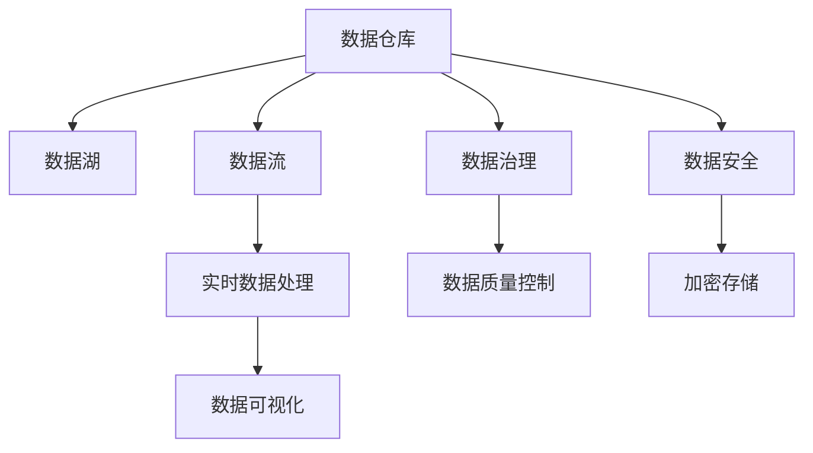
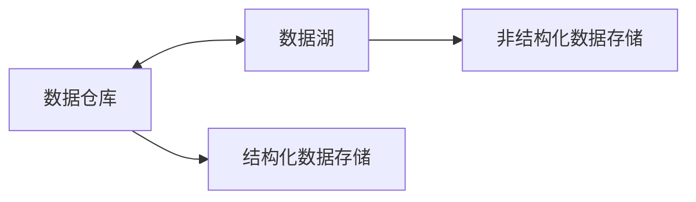
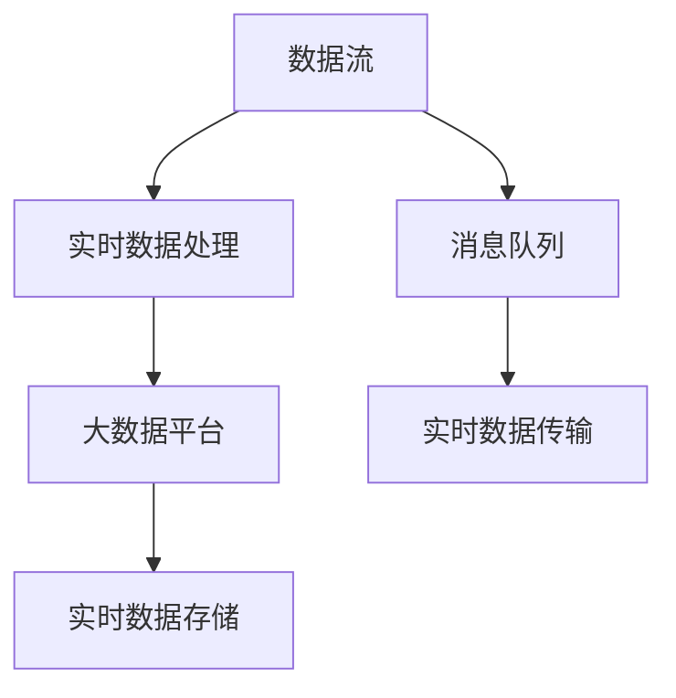
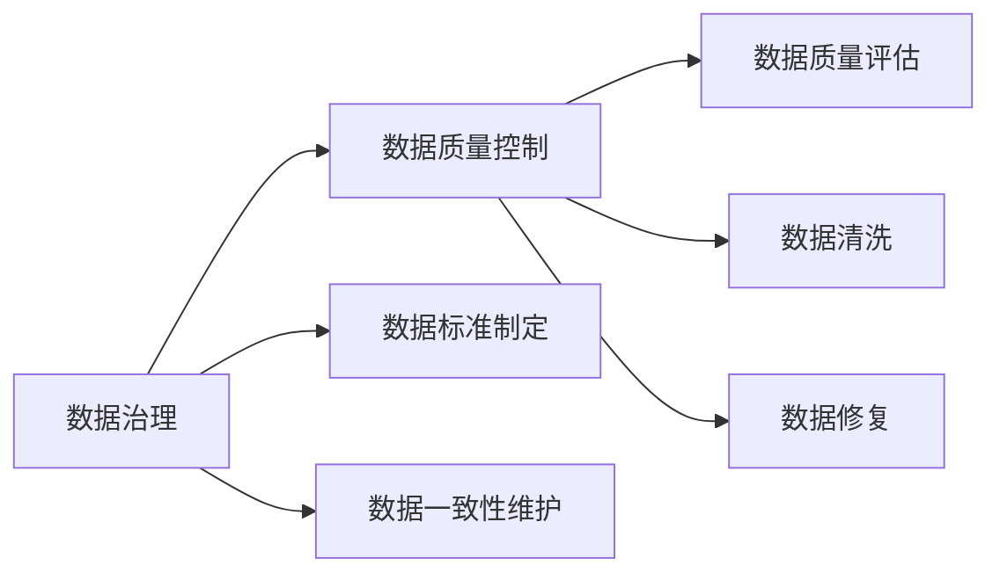
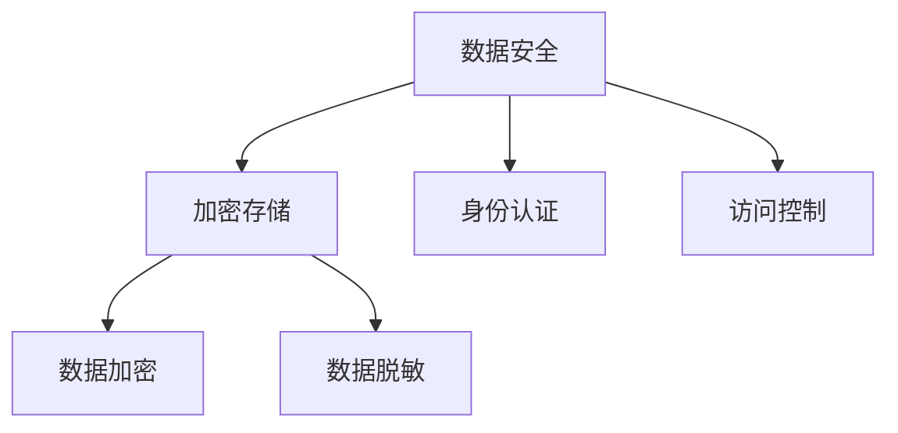

                 

# AI 大模型应用数据中心的数据仓库架构

> 关键词：数据仓库,数据湖,数据流,数据治理,数据安全

## 1. 背景介绍

### 1.1 问题由来
随着人工智能(AI)技术的发展，数据中心的数据仓库架构面临着越来越高的需求。尤其是在AI大模型应用的场景下，数据中心需要高效、安全、可扩展地存储、处理和分析海量数据。这不仅包括传统的关系型数据，还涵盖了多种类型的非结构化数据。

### 1.2 问题核心关键点
数据中心的数据仓库架构需要满足以下几个关键点：

- **高效性**：能够快速响应AI大模型的数据查询需求，支持大规模数据集的处理。
- **安全性**：保证数据在存储、处理和传输过程中的安全，防止数据泄露和攻击。
- **可扩展性**：能够灵活扩展以应对数据量和查询需求的增长。
- **易用性**：提供简便的数据管理和分析工具，降低开发者使用成本。
- **弹性管理**：具备自动化管理数据仓库的能力，减少人工干预。

### 1.3 问题研究意义
一个高效、安全、可扩展的数据仓库架构，对于AI大模型的应用至关重要。它不仅能够提高数据中心的数据处理效率，缩短模型训练和推理的周期，还能保障数据的安全性和模型的鲁棒性，最终提升AI大模型的应用效果。

## 2. 核心概念与联系

### 2.1 核心概念概述

为更好地理解数据中心的数据仓库架构，本节将介绍几个密切相关的核心概念：

- **数据仓库(Data Warehouse)**：集中存储企业数据的平台，支持多维数据分析，用于支持决策支持系统(DSS)。
- **数据湖(Data Lake)**：存储任意形式的数据，无需预先定义模式，支持大规模数据集的处理和分析。
- **数据流(Data Streaming)**：实时数据传输和处理的过程，常用于大数据实时处理。
- **数据治理(Data Governance)**：确保数据的一致性、完整性和安全性，以及数据质量和数据可追溯性。
- **数据安全(Data Security)**：保障数据在存储、传输和处理过程中的安全，防止未授权访问和数据泄露。

这些概念之间的逻辑关系可以通过以下Mermaid流程图来展示：



这个流程图展示了一些关键概念及其之间的关系：

1. 数据仓库是数据湖的一种形式，能够提供结构化和非结构化数据的集中存储。
2. 数据流用于实时数据处理，支持数据的即时传输和分析。
3. 数据治理用于保障数据的一致性和完整性，提升数据质量。
4. 数据安全则确保数据在处理过程中的安全性。
5. 数据可视化则是数据的最终应用环节，帮助用户理解数据。

### 2.2 概念间的关系

这些核心概念之间存在着紧密的联系，构成了数据中心数据仓库架构的完整生态系统。

#### 2.2.1 数据仓库与数据湖的关系



数据仓库主要存储结构化数据，支持多维数据分析，而数据湖则存储任意形式的数据，包括结构化、半结构化和非结构化数据。数据仓库与数据湖的关系可以通过相互补充，共同支撑AI大模型的应用。

#### 2.2.2 数据流与实时数据处理



数据流通常用于实时数据处理，通过消息队列进行数据的实时传输，支持大数据平台的实时数据存储和处理。数据流技术可以支持AI大模型对实时数据的快速处理需求。

#### 2.2.3 数据治理与数据质量控制



数据治理包含数据标准制定、数据一致性维护等功能，用于提升数据质量。数据质量控制则通过数据清洗和修复等手段，保障数据的一致性和完整性。

#### 2.2.4 数据安全与加密存储



数据安全通过身份认证和访问控制等措施，保障数据的安全。加密存储则通过数据加密和脱敏等手段，保护数据的机密性和完整性。

### 2.3 核心概念的整体架构

最后，我们用一个综合的流程图来展示这些核心概念在大数据中心的整体架构：


这个综合流程图展示了从数据存储、数据处理、数据治理、数据安全到数据可视化的完整过程，为大数据中心的数据仓库架构提供了全面的视角。

## 3. 核心算法原理 & 具体操作步骤

### 3.1 算法原理概述

数据中心的数据仓库架构主要基于以下算法原理：

- **分布式存储与计算**：通过分布式文件系统和分布式数据库，支持大规模数据的存储和计算。
- **流计算与批处理**：结合流计算和批处理技术，支持实时数据流处理和历史数据批处理。
- **数据清洗与整合**：通过数据清洗和整合技术，提升数据质量和一致性。
- **数据可视化与交互**：利用数据可视化工具，方便用户对数据进行交互和分析。

### 3.2 算法步骤详解

数据中心的数据仓库架构构建主要包括以下几个步骤：

1. **数据采集**：通过API、ETL工具、数据流等方式，将数据源中的数据采集到数据中心。
2. **数据存储**：将采集到的数据存储到分布式文件系统和数据库中。
3. **数据清洗**：对存储的数据进行清洗和预处理，去除噪声和冗余数据。
4. **数据治理**：制定数据标准，维护数据一致性，提升数据质量。
5. **数据安全**：实施访问控制、加密存储等措施，保障数据安全。
6. **数据可视化**：利用可视化工具，将数据进行可视化展示，方便用户理解和使用。

### 3.3 算法优缺点

数据中心的数据仓库架构具有以下优点：

- **高效性**：通过分布式存储和计算，支持大规模数据的处理和分析。
- **可扩展性**：通过水平扩展和自动化管理，能够灵活应对数据量和查询需求的增长。
- **灵活性**：支持多种数据源和数据类型，满足不同业务需求。

同时，也存在一些缺点：

- **复杂性**：架构涉及多技术栈和组件，设计和维护复杂。
- **成本高**：需要投入大量的硬件和软件资源，成本较高。
- **数据一致性**：分布式存储和计算环境下，数据一致性维护较为复杂。

### 3.4 算法应用领域

数据中心的数据仓库架构广泛应用于以下几个领域：

- **金融风控**：支持金融机构的实时交易监控和风险评估，保障金融安全。
- **智能医疗**：支持医疗机构的数据存储和分析，提升医疗决策支持能力。
- **智能制造**：支持制造企业的实时生产监控和设备维护，提升生产效率。
- **电商推荐**：支持电商平台的实时数据处理和个性化推荐，提升用户体验。
- **智慧城市**：支持城市管理的实时数据处理和分析，提升城市治理效率。

## 4. 数学模型和公式 & 详细讲解 & 举例说明

### 4.1 数学模型构建

本节将使用数学语言对数据中心的数据仓库架构进行更加严格的刻画。

记数据仓库中存储的数据为 $D$，数据源为 $S$，数据采集过程为 $A$，数据清洗和治理过程为 $T$，数据存储过程为 $R$，数据安全过程为 $S$，数据可视化过程为 $V$。

数学模型可以表示为：

$$
D = A(S) + T(D) + R(D) + S(D) + V(D)
$$

其中，$A$ 表示数据采集函数，$T$ 表示数据清洗和治理函数，$R$ 表示数据存储函数，$S$ 表示数据安全函数，$V$ 表示数据可视化函数。

### 4.2 公式推导过程

以下我们以数据清洗为例，推导数据清洗过程的数学模型。

假设数据清洗过程为 $T$，输入为原始数据 $D$，输出为清洗后的数据 $D'$。定义数据清洗函数 $T$ 如下：

$$
T: D \rightarrow D'
$$

其中，数据清洗函数 $T$ 可以分解为以下几个子函数：

1. 数据预处理：去除数据中的噪声和冗余，定义预处理函数 $P$，将原始数据 $D$ 转换为预处理后的数据 $D_P$。
2. 数据标准化：对预处理后的数据进行标准化处理，定义标准化函数 $N$，将 $D_P$ 转换为标准化后的数据 $D_N$。
3. 数据整合：对标准化后的数据进行整合，定义整合函数 $M$，将 $D_N$ 转换为整合后的数据 $D'$。

数学模型可以表示为：

$$
T(D) = P(D) + N(P(D)) + M(N(P(D)))
$$

预处理函数 $P$ 可以定义为：

$$
P(D) = D \cap D_{valid} - D_{invalid}
$$

其中，$D_{valid}$ 表示有效的原始数据集，$D_{invalid}$ 表示无效的原始数据集。

标准化函数 $N$ 可以定义为：

$$
N(D_P) = \frac{D_P - \mu}{\sigma}
$$

其中，$\mu$ 表示数据集的均值，$\sigma$ 表示数据集的标准差。

整合函数 $M$ 可以定义为：

$$
M(D_N) = \bigcup_i \{d | d \in D_N \wedge \exists e \in E \wedge d \in e\}
$$

其中，$E$ 表示数据集 $D_N$ 中的数据实体，$d$ 表示数据集 $D_N$ 中的数据元素。

### 4.3 案例分析与讲解

假设数据中心从金融平台采集的实时交易数据为 $D$，原始数据包括交易金额、交易时间、交易类型等字段。

数据采集函数 $A$ 可以表示为：

$$
A(S) = \bigcup_i \{d | d \in S \wedge d \in S_{valid}\}
$$

其中，$S$ 表示数据源集合，$S_{valid}$ 表示有效的数据源。

预处理函数 $P$ 可以表示为：

$$
P(D) = D \cap D_{valid} - D_{invalid}
$$

其中，$D_{valid}$ 表示有效的原始数据集，$D_{invalid}$ 表示无效的原始数据集。

标准化函数 $N$ 可以表示为：

$$
N(D_P) = \frac{D_P - \mu}{\sigma}
$$

其中，$\mu$ 表示数据集的均值，$\sigma$ 表示数据集的标准差。

整合函数 $M$ 可以表示为：

$$
M(D_N) = \bigcup_i \{d | d \in D_N \wedge \exists e \in E \wedge d \in e\}
$$

其中，$E$ 表示数据集 $D_N$ 中的数据实体，$d$ 表示数据集 $D_N$ 中的数据元素。

最终，数据清洗后的数据 $D'$ 可以表示为：

$$
D' = M(N(P(D)))
$$

通过这些数学模型，我们可以更加清晰地理解数据中心数据仓库架构中的数据清洗和治理过程，以及其数学表达方式。

## 5. 项目实践：代码实例和详细解释说明

### 5.1 开发环境搭建

在进行数据仓库架构的开发实践前，我们需要准备好开发环境。以下是使用Python进行PySpark开发的环境配置流程：

1. 安装Anaconda：从官网下载并安装Anaconda，用于创建独立的Python环境。

2. 创建并激活虚拟环境：
```bash
conda create -n pyspark-env python=3.8 
conda activate pyspark-env
```

3. 安装PySpark：根据CUDA版本，从官网获取对应的安装命令。例如：
```bash
conda install pytorch torchvision torchaudio cudatoolkit=11.1 -c pytorch -c conda-forge
```

4. 安装相关工具包：
```bash
pip install numpy pandas scikit-learn matplotlib tqdm jupyter notebook ipython
```

完成上述步骤后，即可在`pyspark-env`环境中开始数据仓库架构的开发实践。

### 5.2 源代码详细实现

这里我们以金融风控场景为例，给出使用PySpark进行数据仓库架构开发的PySpark代码实现。

首先，定义数据预处理函数：

```python
from pyspark.sql.functions import col, when, struct, concat, concat_ws, array, map, explode
from pyspark.sql.types import StructType, StructField, StringType, IntegerType, BooleanType

# 定义数据预处理函数
def data_preprocess(df: pyspark.sql.DataFrame) -> pyspark.sql.DataFrame:
    # 去除无效数据
    valid_df = df.where((df['amount'] > 0) & (df['timestamp'].isNotNull()) & (df['type'] != 'invalid'))
    
    # 数据标准化
    standardized_df = valid_df.withColumn('amount', (col('amount') - col('mean')) / col('std'))
    
    return standardized_df
```

然后，定义数据整合函数：

```python
# 定义数据整合函数
def data_integrate(df: pyspark.sql.DataFrame) -> pyspark.sql.DataFrame:
    # 数据实体定义
    entity = StructType([
        StructField('user_id', StringType(), True),
        StructField('transaction_id', StringType(), True),
        StructField('amount', IntegerType(), True),
        StructField('timestamp', StringType(), True),
        StructField('type', StringType(), True),
    ])
    
    # 数据整合
    joined_df = df.join(df, on=['user_id', 'transaction_id'], how='left_outer')
    
    # 数据清洗
    cleaned_df = joined_df.where(joined_df['amount'] > 0)
    
    # 数据标准化
    standardized_df = cleaned_df.withColumn('amount', (col('amount') - col('mean')) / col('std'))
    
    return standardized_df
```

接着，定义数据采集函数：

```python
# 定义数据采集函数
def data_acquire(df: pyspark.sql.DataFrame) -> pyspark.sql.DataFrame:
    # 数据采集
    acquired_df = df.where((df['amount'] > 0) & (df['timestamp'].isNotNull()) & (df['type'] != 'invalid'))
    
    return acquired_df
```

最后，启动数据仓库架构的构建流程：

```python
# 数据采集
df = data_acquire(spark.read.format('json').load('financial_data.json'))

# 数据预处理
df = data_preprocess(df)

# 数据标准化
df = data_integrate(df)

# 数据存储
df.write.format('parquet').save('financial_data.parquet')

# 数据可视化
display(df.select('user_id', 'transaction_id', 'amount', 'timestamp', 'type').limit(10))
```

以上就是使用PySpark进行数据仓库架构开发的完整代码实现。可以看到，通过PySpark的强大封装，我们可以用相对简洁的代码完成数据仓库架构的构建。

### 5.3 代码解读与分析

让我们再详细解读一下关键代码的实现细节：

**data_preprocess函数**：
- 定义了数据预处理函数，包括去除无效数据和标准化处理。
- 使用`where`函数筛选出有效数据，通过`withColumn`函数对数据进行标准化处理。

**data_integrate函数**：
- 定义了数据整合函数，包括数据实体定义和数据整合清洗。
- 使用`join`函数将数据进行左外连接，去除无效数据，通过`withColumn`函数对数据进行标准化处理。

**data_acquire函数**：
- 定义了数据采集函数，包括数据采集和初步筛选。
- 使用`where`函数筛选出有效数据，确保数据质量。

**构建数据仓库流程**：
- 首先，从JSON文件中采集数据，使用`read`函数和`load`函数。
- 接着，对采集到的数据进行预处理，去除无效数据和进行标准化处理。
- 然后，对预处理后的数据进行整合和标准化处理。
- 最后，将处理后的数据存储到Parquet文件中，并展示前10条数据。

可以看到，PySpark框架通过强大的数据处理和分析能力，可以高效构建数据仓库架构，并支持大规模数据的存储和处理。开发者可以基于此基础，进一步优化和扩展数据仓库架构，以适应不同的应用场景和需求。

## 6. 实际应用场景

### 6.1 智能医疗

在智能医疗领域，数据中心的数据仓库架构可以用于存储和分析医疗数据，支持医疗决策和健康管理。

具体而言，可以存储病历、体检、影像等医疗数据，通过数据清洗和治理，提升数据质量和一致性。利用数据仓库架构，可以进行疾病预测、健康管理、个性化治疗等应用。

### 6.2 智能制造

在智能制造领域，数据中心的数据仓库架构可以用于存储和分析生产数据，支持生产监控和设备维护。

具体而言，可以存储设备运行数据、生产过程数据等，通过数据清洗和治理，提升数据质量和一致性。利用数据仓库架构，可以进行设备故障预测、生产效率优化、质量控制等应用。

### 6.3 电商推荐

在电商推荐领域，数据中心的数据仓库架构可以用于存储和分析用户数据，支持个性化推荐。

具体而言，可以存储用户浏览、点击、购买等数据，通过数据清洗和治理，提升数据质量和一致性。利用数据仓库架构，可以进行用户行为分析、个性化推荐、营销策略优化等应用。

### 6.4 智慧城市

在智慧城市领域，数据中心的数据仓库架构可以用于存储和分析城市运行数据，支持城市管理和公共服务。

具体而言，可以存储交通、环境、公共安全等数据，通过数据清洗和治理，提升数据质量和一致性。利用数据仓库架构，可以进行交通流量分析、环境监测、安全预警等应用。

## 7. 工具和资源推荐

### 7.1 学习资源推荐

为了帮助开发者系统掌握数据中心数据仓库架构的理论基础和实践技巧，这里推荐一些优质的学习资源：

1. 《数据仓库理论与实践》系列博文：由数据仓库技术专家撰写，深入浅出地介绍了数据仓库的基本概念和经典模型。

2. 《数据湖构建实战》课程：由大数据专家开设的实战课程，涵盖数据湖的构建和优化。

3. 《大数据处理技术》书籍：详细介绍了大数据处理技术的原理和实践，包括数据流和批处理等技术。

4. 《数据治理实践指南》白皮书：提供了数据治理的全面指南，包括数据标准制定和数据质量控制等。

5. 《数据安全最佳实践》指南：详细介绍了数据安全的技术和实践，包括加密存储和访问控制等。

通过对这些资源的学习实践，相信你一定能够快速掌握数据中心数据仓库架构的理论基础和实践技巧，并用于解决实际的数据处理需求。

### 7.2 开发工具推荐

高效的开发离不开优秀的工具支持。以下是几款用于数据中心数据仓库架构开发的常用工具：

1. PySpark：基于Python的Spark框架，支持大规模数据处理和分析。

2. Apache Hadoop：开源的分布式计算框架，支持大规模数据存储和处理。

3. Apache Kafka：开源的消息队列系统，支持实时数据流处理。

4. Apache Cassandra：开源的分布式数据库，支持大规模数据的存储和查询。

5. Apache Flink：开源的流处理框架，支持实时数据处理和分析。

6. Apache Zeppelin：基于Jupyter Notebook的开源可视化工具，支持数据可视化和大数据分析。

合理利用这些工具，可以显著提升数据中心数据仓库架构的开发效率，加速模型的应用部署。

### 7.3 相关论文推荐

数据中心数据仓库架构的研究源于学界的持续研究。以下是几篇奠基性的相关论文，推荐阅读：

1. "Big Data: Principles and Best Practices of Scalable Real-time Data Systems"：该论文系统介绍了大数据处理技术，包括数据流和批处理等技术。

2. "Data Warehousing: Concepts and Practice"：该论文全面介绍了数据仓库的概念、设计和实现，是数据仓库领域的经典著作。

3. "Big Data: A Review"：该论文综述了大数据处理技术的现状和发展趋势，包括数据流和批处理等技术。

4. "Data Governance and Management: Principles, Practices, and Techniques"：该论文全面介绍了数据治理的概念、方法和技术，是数据治理领域的经典著作。

5. "Data Privacy: Principles and Practices"：该论文详细介绍了数据隐私的技术和实践，包括加密存储和访问控制等。

这些论文代表了大数据处理和数据治理领域的最新进展，阅读这些论文可以帮助你深入理解数据中心数据仓库架构的理论基础和实践方法。

除上述资源外，还有一些值得关注的前沿资源，帮助开发者紧跟数据中心数据仓库架构的最新进展，例如：

1. arXiv论文预印本：人工智能领域最新研究成果的发布平台，包括大量尚未发表的前沿工作，学习前沿技术的必读资源。

2. 业界技术博客：如Google、Microsoft、Amazon等顶尖实验室的官方博客，第一时间分享他们的最新研究成果和洞见。

3. 技术会议直播：如NIPS、ICML、SIGMOD、KDD等人工智能领域顶会现场或在线直播，能够聆听到专家们的现场分享，拓展视野。

4. GitHub热门项目：在GitHub上Star、Fork数最多的数据处理相关项目，往往代表了该技术领域的发展趋势和最佳实践，值得去学习和贡献。

5. 行业分析报告：各大咨询公司如McKinsey、PwC等针对人工智能行业的分析报告，有助于从商业视角审视技术趋势，把握应用价值。

总之，对于数据中心数据仓库架构的学习和实践，需要开发者保持开放的心态和持续学习的意愿。多关注前沿资讯，多动手实践，多思考总结，必将收获满满的成长收益。

## 8. 总结：未来发展趋势与挑战

### 8.1 总结

本文对数据中心数据仓库架构进行了全面系统的介绍。首先阐述了数据中心在AI大模型应用中的重要作用，明确了数据仓库架构的设计目标和关键点。其次，从原理到实践，详细讲解了数据仓库架构的数学模型和关键步骤，给出了数据仓库架构的完整代码实例。同时，本文还广泛探讨了数据仓库架构在智能医疗、智能制造、电商推荐、智慧城市等多个行业领域的应用前景，展示了数据仓库架构的巨大潜力。此外，本文精选了数据仓库架构的相关学习资源和开发工具，力求为读者提供全方位的技术指引。

通过本文的系统梳理，可以看到，数据中心数据仓库架构在AI大模型的应用中扮演着不可或缺的角色。它不仅能够提高数据中心的数据处理效率，缩短模型训练和推理的周期，还能保障数据的安全性和模型的鲁棒性，最终提升AI大模型的应用效果。未来，伴随数据仓库技术的持续演进，数据中心必将在更广泛的应用领域中发挥重要作用。

### 8.2 未来发展趋势

展望未来，数据中心的数据仓库架构将呈现以下几个发展趋势：

1. **云化迁移**：越来越多的数据中心将采用云化解决方案，通过云平台实现数据存储、处理和分析。

2. **大数据流处理**：结合流计算和批处理技术，支持实时数据流处理和历史数据批处理，提升数据处理效率。

3. **数据治理自动化**：利用自动化工具，提升数据治理的效率和准确性，减少人工干预。

4. **数据可视化智能化**：结合机器学习和可视化技术，提升数据的智能分析和展示能力。

5. **数据安全多层次防护**：通过数据加密、访问控制、异常检测等技术，构建多层次的数据安全防护体系。

6. **数据融合与整合**：结合数据湖和数据仓库技术，实现多源数据的融合与整合，提升数据质量和一致性。

以上趋势凸显了数据中心数据仓库架构的广阔前景。这些方向的探索发展，必将进一步提升数据中心的数据处理能力，为AI大模型的应用提供坚实的数据基础。

### 8.3 面临的挑战

尽管数据中心数据仓库架构在AI大模型应用中取得了显著成效，但在迈向更加智能化、普适化应用的过程中，仍面临以下挑战：

1. **数据多样性**：不同数据源和数据类型的多样性，增加了数据采集和处理的复杂度。

2. **数据质量**：数据质量问题，如数据不一致、数据冗余等，影响数据仓库架构的性能。

3. **数据安全**：数据安全问题，如数据泄露、数据篡改等，

