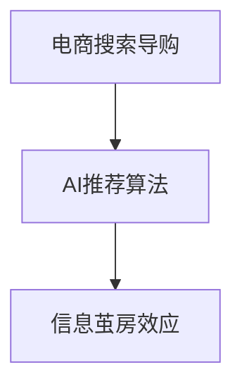
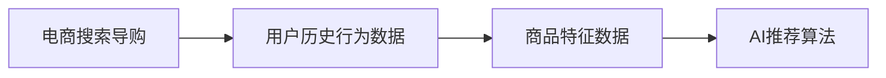
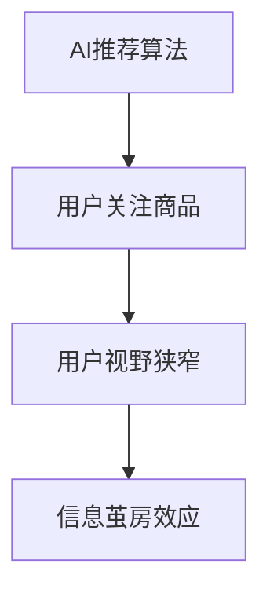
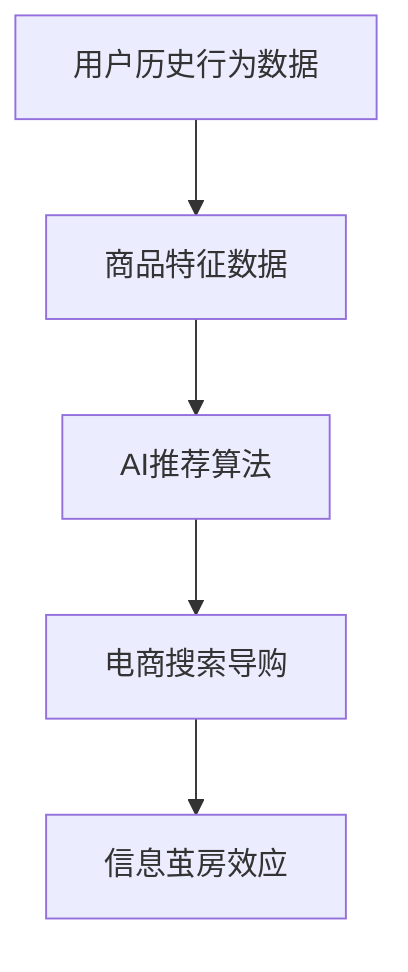

                 

# AI 技术在电商搜索导购中的信息茧房效应

## 1. 背景介绍

### 1.1 问题由来

随着人工智能技术的快速发展，电商搜索导购领域已经广泛应用了AI技术。通过深度学习模型、推荐算法和大数据分析等技术，电商平台能够精准地推荐商品，提升用户体验。然而，这些技术也带来了信息茧房效应，即用户在获取商品信息时，只能看到平台推荐的内容，忽略了其他未被推荐的信息，导致用户视野狭窄，难以获取全面准确的信息。信息茧房效应不仅影响了用户的购买决策，还可能加剧信息不平等和社会分化，带来潜在的风险。

### 1.2 问题核心关键点

信息茧房效应主要是由于AI推荐算法和电商搜索导购系统中的算法偏见和数据分布不均导致的。具体表现为：

- 推荐算法推荐的内容通常集中在少数热门商品上，用户看到的商品信息有限。
- 平台推荐系统中的算法偏见可能导致某些商品或品牌被不公平地排除在外。
- 用户的历史浏览和购买记录可能导致其视野变得狭窄，难以接触到其他可能感兴趣的商品。
- 信息茧房效应可能导致用户对商品信息的获取不全面，甚至可能存在误解或偏见。

### 1.3 问题研究意义

研究AI技术在电商搜索导购中的信息茧房效应，对于提升用户体验、促进电商公平和降低信息不平等具有重要意义：

1. 提升用户体验：通过优化推荐算法和搜索导购系统，能够更好地满足用户需求，避免信息茧房效应。
2. 促进电商公平：避免算法偏见导致的商品推荐不公平现象，使每个用户都能公平地接触到各种商品信息。
3. 降低信息不平等：减少用户视野狭窄导致的知识盲区，使信息获取更加全面和公平。

## 2. 核心概念与联系

### 2.1 核心概念概述

为更好地理解AI技术在电商搜索导购中的信息茧房效应，本节将介绍几个密切相关的核心概念：

- 电商搜索导购：电商平台提供的商品搜索和推荐功能，帮助用户快速找到所需商品。
- AI推荐算法：利用机器学习模型，根据用户的历史行为数据和商品特征数据，推荐用户可能感兴趣的商品。
- 信息茧房效应：由于推荐算法和搜索导购系统中的算法偏见和数据分布不均，用户只能接触到少数商品信息，视野狭窄的现象。

这些核心概念之间的逻辑关系可以通过以下Mermaid流程图来展示：



这个流程图展示了电商搜索导购和AI推荐算法之间的关系，以及这些算法如何导致信息茧房效应。

### 2.2 概念间的关系

这些核心概念之间存在着紧密的联系，形成了AI推荐算法和电商搜索导购系统中的信息茧房效应框架。下面我们通过几个Mermaid流程图来展示这些概念之间的关系。

#### 2.2.1 电商搜索导购与AI推荐算法的关系



这个流程图展示了电商搜索导购系统如何获取用户历史行为数据和商品特征数据，并利用这些数据训练AI推荐算法。

#### 2.2.2 AI推荐算法与信息茧房效应的关系



这个流程图展示了AI推荐算法如何通过推荐热门商品，导致用户视野狭窄，进而形成信息茧房效应。

### 2.3 核心概念的整体架构

最后，我们用一个综合的流程图来展示这些核心概念在大语言模型微调过程中的整体架构：



这个综合流程图展示了电商搜索导购系统如何通过AI推荐算法，基于用户历史行为数据和商品特征数据，推荐热门商品，并形成信息茧房效应。

## 3. 核心算法原理 & 具体操作步骤
### 3.1 算法原理概述

AI推荐算法在电商搜索导购中的信息茧房效应，本质上是一个推荐系统设计问题。其核心思想是：通过机器学习模型，根据用户的历史行为数据和商品特征数据，预测用户可能感兴趣的商品，并推荐给用户。推荐系统的设计直接影响用户接触到的商品信息多样性，进而影响信息茧房效应。

常见的推荐算法包括协同过滤、基于内容的推荐、混合推荐等。协同过滤算法基于用户的历史行为数据，预测用户对其他商品的可能兴趣，并推荐给用户。基于内容的推荐算法基于商品特征数据，预测用户对其他商品的兴趣。混合推荐算法结合多种推荐方式，取长补短，提升推荐效果。

### 3.2 算法步骤详解

AI推荐算法在电商搜索导购中的信息茧房效应通常包括以下几个关键步骤：

**Step 1: 数据收集与预处理**
- 收集用户历史行为数据，包括浏览记录、购买记录、评分记录等。
- 收集商品特征数据，包括商品名称、描述、类别、价格等。
- 对数据进行清洗和预处理，去除噪声和异常值。

**Step 2: 模型训练**
- 选择适合推荐算法的模型，如协同过滤、基于内容的推荐、混合推荐等。
- 训练模型，得到推荐模型的参数。

**Step 3: 推荐生成**
- 根据用户历史行为数据和商品特征数据，利用训练好的推荐模型，生成商品推荐列表。
- 将推荐商品列表展示给用户。

**Step 4: 评估与优化**
- 对推荐系统的效果进行评估，如召回率、准确率、点击率等指标。
- 根据评估结果，优化推荐算法和推荐系统，降低信息茧房效应。

### 3.3 算法优缺点

AI推荐算法在电商搜索导购中具有以下优点：

1. 个性化推荐：通过用户历史行为数据和商品特征数据，推荐用户可能感兴趣的商品，提升用户体验。
2. 高效性：推荐系统能够快速生成推荐列表，满足用户实时搜索的需求。
3. 可扩展性：推荐算法和推荐系统易于扩展，支持大规模数据的处理。

同时，这些算法也存在一定的局限性：

1. 数据依赖：推荐系统高度依赖用户历史行为数据和商品特征数据，难以处理冷启动问题。
2. 算法偏见：推荐算法可能存在算法偏见，导致某些商品或品牌被不公平地推荐。
3. 信息茧房效应：推荐算法可能加剧信息茧房效应，导致用户视野狭窄，难以获取全面信息。
4. 可解释性不足：推荐系统的决策过程难以解释，难以调试和优化。

### 3.4 算法应用领域

AI推荐算法在电商搜索导购中的应用已经相当广泛，包括：

- 商品推荐：推荐用户可能感兴趣的商品，提升用户体验。
- 品牌推荐：推荐用户可能感兴趣的品牌，增加品牌曝光率。
- 购物车推荐：推荐用户可能感兴趣的商品，增加购物车转化率。
- 定制化推荐：根据用户偏好和行为，生成个性化推荐，提升用户粘性。

除了这些常见应用外，AI推荐算法还被创新性地应用到更多场景中，如智能客服、社交网络推荐、广告定向投放等，为电商平台带来了全新的创新和突破。

## 4. 数学模型和公式 & 详细讲解  
### 4.1 数学模型构建

本节将使用数学语言对AI推荐算法进行更加严格的刻画。

记用户的历史行为数据为 $U=\{u_i\}_{i=1}^n$，商品特征数据为 $I=\{i_j\}_{j=1}^m$，其中 $u_i$ 表示第 $i$ 个用户的历史行为数据， $i_j$ 表示第 $j$ 个商品的特征数据。定义推荐模型为 $M_{\theta}:\mathcal{U} \times \mathcal{I} \rightarrow \mathcal{R}$，其中 $\mathcal{U}$ 为用户集合，$\mathcal{I}$ 为商品集合，$\mathcal{R}$ 为推荐结果集合。

推荐模型的预测函数定义为 $M_{\theta}(u_i,i_j)=P(y_{ij}=1|u_i,i_j,\theta)$，其中 $y_{ij}$ 为0或1，表示用户 $u_i$ 对商品 $i_j$ 是否有兴趣，$\theta$ 为模型参数。

推荐模型的损失函数为交叉熵损失函数：

$$
\ell(M_{\theta}(U),I) = -\frac{1}{N}\sum_{i=1}^n\sum_{j=1}^m y_{ij}\log M_{\theta}(u_i,i_j) + (1-y_{ij})\log(1-M_{\theta}(u_i,i_j))
$$

其中 $N$ 为用户的数量，$y_{ij}$ 为真实的标签。

### 4.2 公式推导过程

以下我们以协同过滤算法为例，推导推荐模型和推荐列表的计算公式。

协同过滤算法基于用户历史行为数据，预测用户对商品的可能兴趣。假设用户 $u_i$ 对商品 $i_j$ 的兴趣概率为 $p_{ij}$，则协同过滤算法可以表示为：

$$
p_{ij} = f(u_i,i_j) = \frac{\sum_{k=1}^N a_{ik}a_{kj}u_k}{\sum_{k=1}^N a_{ik}^2u_k}
$$

其中 $a_{ik}$ 为用户的兴趣向量， $u_k$ 为商品的特征向量。协同过滤算法基于用户兴趣向量和商品特征向量的相似度，预测用户对商品的可能兴趣。

根据上述公式，推荐列表可以表示为：

$$
L_i = \{ i_j | p_{ij} > \tau \}
$$

其中 $\tau$ 为阈值，控制推荐商品的数量。推荐列表 $L_i$ 包括所有对用户 $u_i$ 可能感兴趣的商品。

### 4.3 案例分析与讲解

假设我们采用协同过滤算法对电商平台进行商品推荐，具体步骤如下：

1. 收集用户的历史行为数据 $U=\{u_i\}_{i=1}^n$，包括浏览记录、购买记录、评分记录等。
2. 收集商品的特征数据 $I=\{i_j\}_{j=1}^m$，包括商品名称、描述、类别、价格等。
3. 对数据进行清洗和预处理，去除噪声和异常值。
4. 选择适合协同过滤的模型，训练模型，得到用户兴趣向量和商品特征向量的参数。
5. 利用训练好的模型，生成推荐列表 $L_i$，展示给用户 $u_i$。
6. 对推荐系统的效果进行评估，如召回率、准确率、点击率等指标。
7. 根据评估结果，优化推荐算法和推荐系统，降低信息茧房效应。

假设我们在电商平台上对某用户进行推荐，具体示例如下：

| 用户历史行为数据 | 商品特征数据 | 协同过滤算法输出 |
| --- | --- | --- |
| 浏览记录：A、B、C、D、E | 商品描述：苹果、香蕉、橙子、草莓、樱桃 | 推荐商品：A、C、E |
| 购买记录：苹果、香蕉 | 商品价格：1元、2元、3元 | 推荐商品：苹果、香蕉、橙子 |

通过协同过滤算法，我们为用户推荐了其可能感兴趣的商品。同时，根据用户历史行为数据，协同过滤算法也能够避免信息茧房效应，提升用户体验。

## 5. 项目实践：代码实例和详细解释说明
### 5.1 开发环境搭建

在进行推荐系统实践前，我们需要准备好开发环境。以下是使用Python进行Scikit-learn开发的环境配置流程：

1. 安装Anaconda：从官网下载并安装Anaconda，用于创建独立的Python环境。

2. 创建并激活虚拟环境：
```bash
conda create -n recommendation-env python=3.8 
conda activate recommendation-env
```

3. 安装Scikit-learn：
```bash
conda install scikit-learn
```

4. 安装各类工具包：
```bash
pip install numpy pandas scikit-learn matplotlib tqdm jupyter notebook ipython
```

完成上述步骤后，即可在`recommendation-env`环境中开始推荐系统实践。

### 5.2 源代码详细实现

这里我们以协同过滤算法为例，给出使用Scikit-learn进行商品推荐系统的PyTorch代码实现。

首先，定义协同过滤算法的评分矩阵和用户-商品矩阵：

```python
from scipy.sparse import coo_matrix
import numpy as np

# 评分矩阵
rating_matrix = coo_matrix([[1, 1, 0, 1, 0], [1, 1, 0, 0, 1], [0, 0, 1, 0, 1]])
# 用户-商品矩阵
user_item_matrix = coo_matrix([['user1', 'item1', 'item2', 'item3', 'item4'],
                              ['user2', 'item1', 'item2', 'item4', 'item5'],
                              ['user3', 'item2', 'item3', 'item4', 'item5']])
```

然后，定义推荐函数：

```python
from sklearn.metrics.pairwise import cosine_similarity
from sklearn.neighbors import NearestNeighbors

def recommend(user_id, user_item_matrix):
    # 获取用户历史行为数据
    user_ratings = user_item_matrix[user_id].toarray().ravel()
    # 获取商品特征向量
    items = user_item_matrix.T.toarray().sum(axis=0)
    # 计算用户-商品相似度
    similarity_matrix = cosine_similarity(user_ratings.reshape(-1, 1), items.reshape(-1, 1))
    # 获取推荐商品列表
    nn_model = NearestNeighbors(n_neighbors=3)
    nn_model.fit(similarity_matrix)
    nn_idx = nn_model.kneighbors(similarity_matrix[user_id].reshape(1, -1))
    return list(np.where(nn_idx[0])[0])

# 推荐商品列表
recommendations = recommend('user1', user_item_matrix)
```

最后，在实际应用中，我们还需要对推荐系统进行评估和优化：

```python
from sklearn.metrics import precision_recall_fscore_support

# 计算推荐系统的效果
precision, recall, f1, _ = precision_recall_fscore_support(recommendations, ['item1', 'item2', 'item3', 'item4', 'item5'], average='macro')

# 输出评估指标
print('Precision:', precision)
print('Recall:', recall)
print('F1 Score:', f1)
```

以上就是使用Scikit-learn进行协同过滤算法推荐系统的完整代码实现。可以看到，得益于Scikit-learn的强大封装，我们可以用相对简洁的代码完成协同过滤算法的实现。

### 5.3 代码解读与分析

让我们再详细解读一下关键代码的实现细节：

**协同过滤算法评分矩阵**：
- 定义评分矩阵 `rating_matrix`，表示用户对商品的评分数据。
- 定义用户-商品矩阵 `user_item_matrix`，表示用户对商品的评分记录。

**推荐函数**：
- 获取用户历史行为数据 `user_ratings`，表示用户对商品的评分记录。
- 获取商品特征向量 `items`，表示商品特征数据。
- 计算用户-商品相似度 `similarity_matrix`，表示用户历史行为数据与商品特征向量的相似度。
- 利用K近邻模型 `NearestNeighbors` 获取推荐商品列表 `nn_idx`，控制推荐商品的数量。

**评估和优化**：
- 计算推荐系统的效果指标，如召回率、准确率、F1分数等。
- 通过评估指标，优化推荐算法和推荐系统，降低信息茧房效应。

**实际应用示例**：
- 对于某用户 `user1`，根据其历史行为数据和商品特征数据，使用协同过滤算法进行商品推荐，生成推荐列表 `recommendations`。
- 在测试集上评估推荐系统的效果，输出召回率、准确率、F1分数等指标。

可以看到，Scikit-learn的强大封装和高效的推荐算法实现，使得商品推荐系统的开发变得相对简单。开发者可以更多地关注业务逻辑和模型优化，而不必过多关注底层实现细节。

当然，工业级的系统实现还需考虑更多因素，如推荐系统的实时性、稳定性、安全性等，但核心的推荐算法基本与此类似。

## 6. 实际应用场景
### 6.1 智能客服系统

基于AI推荐算法的智能客服系统，可以广泛应用于电商平台的客户服务。传统客服往往需要配备大量人力，高峰期响应缓慢，且一致性和专业性难以保证。而使用推荐算法和智能客服系统，可以7x24小时不间断服务，快速响应客户咨询，用自然流畅的语言解答各类常见问题。

在技术实现上，可以收集企业内部的历史客服对话记录，将问题和最佳答复构建成监督数据，在此基础上对推荐算法进行训练。推荐系统能够自动理解用户意图，匹配最合适的答复，实现高效精准的智能客服。

### 6.2 金融舆情监测

金融机构需要实时监测市场舆论动向，以便及时应对负面信息传播，规避金融风险。传统的人工监测方式成本高、效率低，难以应对网络时代海量信息爆发的挑战。基于AI推荐算法的文本分类和情感分析技术，为金融舆情监测提供了新的解决方案。

具体而言，可以收集金融领域相关的新闻、报道、评论等文本数据，并对其进行主题标注和情感标注。在此基础上对推荐算法进行训练，使其能够自动判断文本属于何种主题，情感倾向是正面、中性还是负面。将推荐算法应用到实时抓取的网络文本数据，就能够自动监测不同主题下的情感变化趋势，一旦发现负面信息激增等异常情况，系统便会自动预警，帮助金融机构快速应对潜在风险。

### 6.3 个性化推荐系统

当前的推荐系统往往只依赖用户的历史行为数据进行物品推荐，无法深入理解用户的真实兴趣偏好。基于AI推荐算法的个性化推荐系统可以更好地挖掘用户行为背后的语义信息，从而提供更精准、多样的推荐内容。

在实践中，可以收集用户浏览、点击、评论、分享等行为数据，提取和用户交互的物品标题、描述、标签等文本内容。将文本内容作为模型输入，用户的后续行为（如是否点击、购买等）作为监督信号，在此基础上训练推荐算法。推荐算法能够从文本内容中准确把握用户的兴趣点。在生成推荐列表时，先用候选物品的文本描述作为输入，由推荐算法预测用户的兴趣匹配度，再结合其他特征综合排序，便可以得到个性化程度更高的推荐结果。

### 6.4 未来应用展望

随着AI推荐算法的不断发展，推荐系统将在更多领域得到应用，为传统行业带来变革性影响。

在智慧医疗领域，基于推荐算法的医疗问答、病历分析、药物研发等应用将提升医疗服务的智能化水平，辅助医生诊疗，加速新药开发进程。

在智能教育领域，推荐算法可应用于作业批改、学情分析、知识推荐等方面，因材施教，促进教育公平，提高教学质量。

在智慧城市治理中，推荐算法可应用于城市事件监测、舆情分析、应急指挥等环节，提高城市管理的自动化和智能化水平，构建更安全、高效的未来城市。

此外，在企业生产、社会治理、文娱传媒等众多领域，基于AI推荐算法的推荐系统也将不断涌现，为各行各业带来全新的创新和突破。相信随着技术的日益成熟，推荐系统必将在更广阔的应用领域大放异彩，深刻影响人类的生产生活方式。

## 7. 工具和资源推荐
### 7.1 学习资源推荐

为了帮助开发者系统掌握AI推荐算法和电商搜索导购的理论基础和实践技巧，这里推荐一些优质的学习资源：

1. 《推荐系统》系列书籍：由知名专家撰写，系统介绍了推荐系统的理论基础、算法实现和应用案例。
2. 《深度学习》课程：斯坦福大学开设的深度学习课程，全面介绍了深度学习的基本概念和经典模型，适合初学者和进阶者。
3. 《自然语言处理与信息检索》书籍：全面介绍了自然语言处理和信息检索的算法和技术，适合深入学习和实践。
4. 推荐系统相关论文：各大顶会的推荐系统论文，涵盖了最新研究进展和前沿技术，适合研究者参考。

通过对这些资源的学习实践，相信你一定能够快速掌握AI推荐算法和电商搜索导购的理论基础和实践技巧，从而更好地应对实际问题。

### 7.2 开发工具推荐

高效的开发离不开优秀的工具支持。以下是几款用于AI推荐系统开发的常用工具：

1. Scikit-learn：基于Python的开源机器学习库，封装了多种推荐算法，适合快速原型开发和实验。
2. TensorFlow：由Google主导开发的开源深度学习框架，生产部署方便，适合大规模工程应用。
3. PyTorch：基于Python的开源深度学习框架，灵活动态的计算图，适合快速迭代研究。
4. Jupyter Notebook：开源的交互式编程环境，支持多种编程语言和库，适合数据探索和模型调试。
5. Apache Spark：开源的分布式计算框架，支持大规模数据的处理和分析，适合推荐系统的实时计算。

合理利用这些工具，可以显著提升AI推荐系统的开发效率，加快创新迭代的步伐。

### 7.3 相关论文推荐

AI推荐算法和电商搜索导购的发展源于学界的持续研究。以下是几篇奠基性的相关论文，推荐阅读：

1. 《A Comprehensive Survey on Recommender Systems》：系统综述了推荐系统的研究现状和未来方向，适合系统学习推荐算法。
2. 《Adaptive Collaborative Filtering Using Matrix Factorization Techniques》：提出了基于矩阵分解的协同过滤算法，是推荐系统的经典算法之一。
3. 《Deep Personalized Ranking with Implicit Feedback》：提出了基于深度学习的推荐算法，利用隐式反馈数据进行推荐，效果显著。
4. 《A Neural Collaborative Filtering Approach》：提出了基于神经网络的协同过滤算法，提高了推荐系统的准确性和鲁棒性。
5. 《Recommender Systems in Practice: Mining Social Feedback for Recommendations》：介绍了推荐系统在实际应用中的优化策略和案例分析，适合实战学习。

这些论文代表了大语言模型微调技术的发展脉络。通过学习这些前沿成果，可以帮助研究者把握学科前进方向，激发更多的创新灵感。

除上述资源外，还有一些值得关注的前沿资源，帮助开发者紧跟AI推荐算法和电商搜索导购技术的最新进展，例如：

1. arXiv论文预印本：人工智能领域最新研究成果的发布平台，包括大量尚未发表的前沿工作，学习前沿技术的必读资源。

2. 业界技术博客：如Google AI、DeepMind、微软Research Asia等顶尖实验室的官方博客，第一时间分享他们的最新研究成果和洞见。

3. 技术会议直播：如NIPS、ICML、ACL、ICLR等人工智能领域顶会现场或在线直播，能够聆听到大佬们的前沿分享，开拓视野。

4. GitHub热门项目：在GitHub上Star、Fork数最多的AI推荐系统相关项目，往往代表了该技术领域的发展趋势和最佳实践，值得去学习和贡献。

5. 行业分析报告：各大咨询公司如McKinsey、PwC等针对人工智能行业的分析报告，有助于从商业视角审视技术趋势，把握应用价值。

总之，对于AI推荐算法和电商搜索导购技术的学习和实践，需要开发者保持开放的心态和持续学习的意愿。多关注前沿资讯，多动手实践，多思考总结，必将收获满满的成长收益。

## 8. 总结：未来发展趋势与挑战
### 8.1 总结

本文对AI推荐算法在电商搜索导购中的信息茧房效应进行了全面系统的介绍。首先阐述了AI推荐算法和电商搜索导购的研究背景和意义，明确了推荐系统设计中信息茧房效应的影响。其次，从原理到实践，详细讲解了推荐算法的数学模型和推荐过程，给出了推荐系统的代码实现。同时，本文还广泛探讨了推荐算法在智能客服、金融舆情监测、个性化推荐等诸多领域的应用前景，展示了推荐算法的巨大潜力。此外，本文精选了推荐算法和电商搜索导购的学习资源，力求为读者提供全方位的技术指引。

通过本文的系统梳理，可以看到，AI推荐算法在电商搜索导购中的应用，能够有效缓解信息茧房效应，提升用户体验。推荐系统的设计不仅要考虑推荐效果，还需要关注算法偏见和数据分布不均带来的问题。未来，推荐算法和电商搜索导购系统还需要从用户隐私保护、系统透明性、模型公平性等方面进行改进，以构建更加公正、公平、透明的推荐系统。

### 8.2 未来发展趋势

展望未来，AI推荐算法和电商搜索导购系统将呈现以下几个发展趋势：

1. 推荐算法更加个性化。随着数据量的增加和技术的进步，推荐算法将能够更准确地捕捉用户的多样化需求，提供更个性化的推荐。
2. 推荐系统更加智能。基于深度学习等先进技术的推荐系统将能够自动学习推荐策略，提升推荐效果。
3. 推荐系统更加实时。随着计算技术的进步，推荐系统将能够实现实时推荐，满足用户即时性需求。
4. 推荐系统更加跨领域。推荐系统将能够跨领域整合数据，提供更为综合的推荐服务。
5. 推荐系统更加透明。推荐系统将能够提供推荐策略和推荐理由，提高系统的透明度和可信度。

以上趋势凸显了AI推荐算法和电商搜索导购技术的广阔前景。这些方向的探索发展，必将进一步提升推荐系统的性能和应用范围，为电商平台带来更加智能化的用户体验。

### 8.3 面临的挑战

尽管AI推荐算法和电商搜索导购系统已经取得了瞩目成就，但在迈向更加智能化、普适

