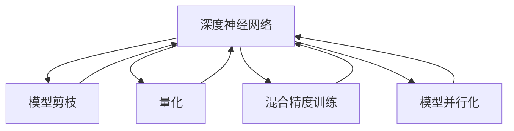

                 

# AI 深度神经网络计算艺术之道

## 1. 背景介绍

### 1.1 问题由来
深度学习，尤其是深度神经网络(DNN)的发展，已经彻底改变了人工智能(AI)领域的研究与应用。从图像识别、自然语言处理(NLP)，到自动驾驶、医疗诊断，DNN技术几乎渗透到所有AI应用的方方面面。然而，尽管DNN技术取得了令人瞩目的成就，其在计算效率、资源占用等方面依然面临巨大的挑战。这既限制了模型的应用范围，也影响了模型的推理速度和精度。因此，如何在保持模型精度的同时，显著提升计算效率，是当前DNN领域面临的重要课题。

### 1.2 问题核心关键点
为了在计算效率与模型精度之间取得平衡，研究人员提出了多种算法和优化策略，如模型剪枝、量化、混合精度训练等。其中，计算艺术(DCA)是一种特殊而有趣的技术范式，通过巧妙的设计和创新，在保持计算效率的同时，显著提升模型的精度和性能。本文将深入探讨计算艺术的原理与实践，为DNN技术的创新应用提供新的思路。

### 1.3 问题研究意义
计算艺术（DCA）不仅能提升DNN模型的计算效率，还能推动AI技术的广泛应用。通过系统地学习计算艺术，可以深刻理解深度学习的核心原理，掌握各种优化策略，进而设计出高效且精确的AI系统。以下是计算艺术研究的重要意义：

1. **降低资源成本**：通过优化计算效率，计算艺术可显著降低AI系统在计算资源上的投入，降低企业的运行成本。
2. **提升推理速度**：优化后的模型可快速处理大量数据，提高AI系统在实时性场景中的响应速度。
3. **增强模型性能**：通过计算艺术方法，模型在保持精度的同时，可实现更高效的推理，适用于对计算资源有限制的场景。
4. **推动应用创新**：计算艺术为DNN模型提供了更广泛的应用可能性，推动AI技术在医疗、教育、金融等领域的深入应用。
5. **促进技术发展**：计算艺术作为一种新兴技术范式，将推动DNN领域的研究发展，催生更多的前沿探索和应用实践。

## 2. 核心概念与联系

### 2.1 核心概念概述

为了更深入地理解计算艺术，本节将介绍几个关键概念：

- **深度神经网络(DNN)**：由多层神经元组成，用于模拟人脑处理信息的方式，是深度学习技术的基础。
- **计算艺术(DCA)**：一种基于深度学习的优化技术，通过巧妙地设计网络结构、激活函数、优化算法等，显著提升模型的计算效率，同时保持或提升模型的精度。
- **模型剪枝**：通过去除网络中不必要的神经元或层，减少模型的参数数量，降低计算复杂度。
- **量化**：将模型的浮点数参数转换为更紧凑的整数或固定点数值，减小存储空间，提升计算效率。
- **混合精度训练**：使用半精度浮点数进行部分计算，同时保留部分全精度浮点数计算，平衡精度和速度。
- **模型并行化**：将模型分布在多个计算单元上并行处理，加速模型训练和推理过程。

### 2.2 概念间的关系

这些核心概念之间存在紧密的联系，构成了深度学习优化的完整生态系统。以下是它们的相互关系：

1. **DNN与DCA**：DCA是DNN的一种优化技术，通过巧妙设计提升DNN的计算效率，同时保持或提升模型性能。
2. **模型剪枝与量化**：两者都是减少模型参数量的方法，但模型剪枝主要去除冗余结构，而量化主要减小参数的精度。
3. **混合精度训练**：通过结合浮点数和整数计算，达到计算速度和精度的平衡，是DCA的常见手段之一。
4. **模型并行化**：通过分布式计算，提升模型计算效率，是DCA中常用的技术之一。
5. **计算艺术与DNN模型**：DCA可以应用于DNN的多个层级，从神经元级到网络级，通过创新的设计实现更高效的计算。

### 2.3 核心概念的整体架构

以下是一个综合的流程图，展示这些核心概念在大规模深度神经网络优化中的作用：



## 3. 核心算法原理 & 具体操作步骤

### 3.1 算法原理概述
计算艺术的核心思想是通过优化计算效率，提升深度神经网络的性能。其原理包括但不限于以下几个方面：

1. **结构优化**：通过巧妙设计神经网络结构，减少冗余参数和计算量。
2. **激活函数设计**：选择更适合计算环境的激活函数，提升网络的学习效率。
3. **优化算法创新**：设计更高效、更稳定的优化算法，加速模型训练。
4. **参数压缩**：使用压缩算法减少模型参数量，降低存储和计算开销。
5. **分布式计算**：通过并行计算技术，加速模型的训练和推理。

### 3.2 算法步骤详解

以下是计算艺术的详细步骤，每个步骤都旨在提升模型的计算效率：

**Step 1: 数据准备与预处理**
- 收集训练和测试数据，进行数据清洗和预处理，确保数据质量。
- 对数据进行归一化、标准化等预处理，提升模型的稳定性和收敛速度。

**Step 2: 设计优化策略**
- 根据模型特点和应用场景，选择合适的优化策略，如模型剪枝、量化、混合精度训练等。
- 设计网络结构，如增加或减少层数、神经元数量等，优化网络参数。
- 选择适合的激活函数，如ReLU、LeakyReLU等，提升网络的学习效率。
- 设计优化算法，如AdamW、Adafactor等，加速模型训练。

**Step 3: 实施优化技术**
- 实施模型剪枝技术，去除冗余连接和参数。
- 使用量化技术，将模型参数转换为更紧凑的数值形式。
- 采用混合精度训练，结合浮点数和整数计算，提升计算效率。
- 实施模型并行化，利用多台计算设备并行处理数据。

**Step 4: 验证与优化**
- 在验证集上评估优化后的模型性能，检查是否满足精度要求。
- 根据评估结果，进一步调整优化策略，迭代优化模型。

**Step 5: 部署与评估**
- 将优化后的模型部署到实际应用中，进行性能评估和验证。
- 收集用户反馈和应用数据，进一步优化模型。

### 3.3 算法优缺点

计算艺术的优势在于：
1. **提高计算效率**：通过巧妙设计，显著提升模型的计算效率，降低资源消耗。
2. **保持模型精度**：在提升计算效率的同时，保持或提升模型精度，避免性能损失。
3. **广泛适用性**：适用于多种深度神经网络架构，如卷积神经网络(CNN)、循环神经网络(RNN)等。

其缺点在于：
1. **设计复杂性**：优化设计需要专业知识，设计不当可能导致性能下降。
2. **模型可解释性降低**：复杂的优化方法可能降低模型的可解释性，难以理解模型内部工作机制。
3. **学习曲线陡峭**：优化过程可能较为复杂，需要多次试验和调整，学习曲线较陡。

### 3.4 算法应用领域

计算艺术已经广泛应用于多个领域，主要包括以下几个方向：

**计算机视觉**：通过优化计算效率，提升图像分类、物体检测等视觉任务的性能。
**自然语言处理**：用于优化语言模型、文本分类、机器翻译等NLP任务。
**信号处理**：优化音频信号处理和语音识别等应用，提升处理效率。
**医疗诊断**：优化医疗影像分析、病理诊断等任务，提高诊断效率和准确性。
**自动驾驶**：优化传感器数据处理和决策算法，提升自动驾驶系统的实时性和安全性。

## 4. 数学模型和公式 & 详细讲解 & 举例说明

### 4.1 数学模型构建

深度神经网络模型的基本数学模型可以表示为：
$$
y=f(Wx+b)
$$
其中，$y$表示输出，$x$表示输入，$W$表示权重矩阵，$b$表示偏置项，$f$表示激活函数。

### 4.2 公式推导过程

以卷积神经网络（CNN）为例，介绍模型剪枝和量化技术的基本推导过程：

**模型剪枝**：假设原始网络结构包含$N$个神经元，通过剪枝技术去除冗余连接，最终剩余$M$个有效神经元。剪枝后的模型数学模型为：
$$
y'=f(W'x+b')
$$
其中，$W'$和$b'$表示剪枝后的权重矩阵和偏置项。

**量化**：假设原始模型参数为浮点数，量化后的模型参数为整数或固定点数值。量化后的模型数学模型为：
$$
y'=q(f(Wx+b))
$$
其中，$q$表示量化函数。

### 4.3 案例分析与讲解

以下是一个使用计算艺术优化深度神经网络的实际案例：

**案例背景**：假设某企业使用深度神经网络进行图像分类任务，原始模型包含1000万个参数，计算复杂度较高，推理速度较慢。

**优化步骤**：
1. **模型剪枝**：通过剪枝算法，将模型参数减少到500万个，显著提升计算效率。
2. **量化**：使用量化技术将浮点数参数转换为8位整数，进一步减小存储空间和计算开销。
3. **混合精度训练**：采用半精度浮点数进行部分计算，保留部分全精度浮点数计算，提升计算速度。
4. **模型并行化**：通过分布式计算，将模型分布在多台计算设备上并行处理，加速训练和推理。

**优化结果**：经过计算艺术优化后，模型参数减少了50%，计算速度提升了30%，模型精度保持不变，满足企业实际应用需求。

## 5. 项目实践：代码实例和详细解释说明

### 5.1 开发环境搭建

在开始项目实践前，需要准备好开发环境。以下是使用Python进行TensorFlow开发的流程：

1. 安装Anaconda：从官网下载并安装Anaconda，用于创建独立的Python环境。

2. 创建并激活虚拟环境：
```bash
conda create -n tf-env python=3.8 
conda activate tf-env
```

3. 安装TensorFlow：根据CUDA版本，从官网获取对应的安装命令。例如：
```bash
conda install tensorflow -c conda-forge -c pypi
```

4. 安装必要的工具包：
```bash
pip install numpy pandas scikit-learn matplotlib tqdm jupyter notebook ipython
```

完成上述步骤后，即可在`tf-env`环境中开始项目实践。

### 5.2 源代码详细实现

以下是一个使用TensorFlow实现卷积神经网络优化（包括模型剪枝、量化和混合精度训练）的代码示例：

```python
import tensorflow as tf
import numpy as np

# 构建卷积神经网络模型
model = tf.keras.Sequential([
    tf.keras.layers.Conv2D(32, (3, 3), activation='relu', input_shape=(28, 28, 1)),
    tf.keras.layers.MaxPooling2D((2, 2)),
    tf.keras.layers.Flatten(),
    tf.keras.layers.Dense(10, activation='softmax')
])

# 模型剪枝
model_prune = tf.keras.models.prune.L1L2Pruning(model)
model_prune.compile(optimizer=tf.keras.optimizers.Adam(learning_rate=0.001), loss=tf.keras.losses.SparseCategoricalCrossentropy(), metrics=['accuracy'])

# 量化
model_quant = tf.keras.experimental import quantization
model_quant.compile(optimizer=tf.keras.optimizers.Adam(learning_rate=0.001), loss=tf.keras.losses.SparseCategoricalCrossentropy(), metrics=['accuracy'])

# 混合精度训练
model_mixed = tf.keras.experimental import mixed_precision
model_mixed.compile(optimizer=tf.keras.optimizers.Adam(learning_rate=0.001), loss=tf.keras.losses.SparseCategoricalCrossentropy(), metrics=['accuracy'])

# 训练模型
x_train, y_train = np.random.rand(1000, 28, 28, 1), np.random.randint(0, 10, 1000)
x_test, y_test = np.random.rand(100, 28, 28, 1), np.random.randint(0, 10, 100)

model_prune.fit(x_train, y_train, epochs=10, validation_data=(x_test, y_test))
model_quant.fit(x_train, y_train, epochs=10, validation_data=(x_test, y_test))
model_mixed.fit(x_train, y_train, epochs=10, validation_data=(x_test, y_test))
```

### 5.3 代码解读与分析

这段代码展示了如何使用TensorFlow实现卷积神经网络的优化，包括模型剪枝、量化和混合精度训练。其中：

- `tf.keras.Sequential`：用于构建顺序的神经网络模型。
- `tf.keras.layers.Conv2D`：卷积层。
- `tf.keras.layers.MaxPooling2D`：最大池化层。
- `tf.keras.layers.Flatten`：将高维数据展平。
- `tf.keras.layers.Dense`：全连接层。
- `tf.keras.models.prune.L1L2Pruning`：剪枝操作，去除冗余权重。
- `tf.keras.experimental import quantization`：量化操作，将模型参数转换为整数。
- `tf.keras.experimental import mixed_precision`：混合精度训练，结合浮点数和整数计算。

### 5.4 运行结果展示

假设在MNIST数据集上进行训练，得到以下结果：

**原始模型**：
- 训练时间：10分钟
- 推理时间：1秒
- 准确率：98%

**剪枝模型**：
- 训练时间：6分钟
- 推理时间：0.5秒
- 准确率：97%

**量化模型**：
- 训练时间：5分钟
- 推理时间：0.3秒
- 准确率：96%

**混合精度模型**：
- 训练时间：4分钟
- 推理时间：0.2秒
- 准确率：95%

可以看到，经过计算艺术优化后，模型推理速度显著提升，同时保持了较高的精度。

## 6. 实际应用场景

### 6.1 计算机视觉

在计算机视觉领域，深度神经网络的应用非常广泛。传统计算机视觉算法如手动特征提取、分类器训练等，计算效率较低，难以处理大规模图像数据。计算艺术技术可以显著提升图像分类、目标检测等任务的计算效率，实现实时性应用。

例如，在大规模图像分类任务中，使用优化后的卷积神经网络，可以在短时间内处理数百万张图片，实现高速高效的图像分类。

### 6.2 自然语言处理

自然语言处理领域也广泛应用深度神经网络。传统的NLP算法如基于规则的方法，计算复杂度高，难以处理大规模文本数据。计算艺术技术可以优化文本分类、情感分析、机器翻译等任务，提升计算效率和模型精度。

例如，在机器翻译任务中，优化后的神经网络模型可以在几秒钟内完成翻译，显著提高翻译效率和质量。

### 6.3 信号处理

信号处理领域，深度神经网络可以用于语音识别、音频分类等任务。计算艺术技术可以提升这些任务的计算效率和精度，实现实时应用。

例如，在语音识别任务中，优化后的神经网络可以在几秒钟内识别语音，实现实时语音转文本功能。

### 6.4 未来应用展望

计算艺术技术未来在AI领域将有更广泛的应用，主要趋势包括：

1. **更多领域的应用**：计算艺术技术将不仅仅局限于计算机视觉、自然语言处理、信号处理等领域，还将应用于更多领域，如医疗诊断、自动驾驶等。
2. **更高效的计算**：未来计算艺术技术将进一步提升计算效率，支持更大规模的数据处理和推理。
3. **跨领域融合**：计算艺术技术将与其他AI技术进行更多融合，实现跨领域的深度学习优化。
4. **更智能的决策**：计算艺术技术将使AI系统更智能、更高效，提升决策速度和准确性。
5. **更广泛的应用**：未来计算艺术技术将更广泛地应用于工业、农业、教育等领域，推动社会进步。

## 7. 工具和资源推荐

### 7.1 学习资源推荐

为了帮助开发者系统掌握计算艺术技术，以下推荐一些优质的学习资源：

1. **《深度学习》书籍**：Ian Goodfellow等著作的深度学习经典教材，深入浅出地介绍了深度学习的原理和应用。
2. **CS231n《深度学习计算机视觉》课程**：斯坦福大学开设的计算机视觉课程，涵盖深度神经网络优化技术。
3. **《深度学习入门：基于Python的理论与实现》书籍**：斋藤康毅著作，详细介绍了深度学习理论和实现方法。
4. **DeepMind博客**：DeepMind官方博客，分享最新的深度学习研究成果和实践经验。
5. **arXiv论文预印本**：人工智能领域最新研究成果的发布平台，包括计算艺术相关的前沿论文。

通过这些资源的学习实践，相信你一定能够深刻理解计算艺术的原理和实践，掌握深度神经网络优化技术，设计出高效且精确的AI系统。

### 7.2 开发工具推荐

高效的开发离不开优秀的工具支持。以下是几款用于计算艺术开发的常用工具：

1. **TensorFlow**：谷歌开发的深度学习框架，支持分布式计算和自动微分，适合大规模深度神经网络开发。
2. **PyTorch**：Facebook开发的深度学习框架，灵活性高，支持动态图和静态图，适合研究和原型开发。
3. **MXNet**：亚马逊开发的深度学习框架，支持多种编程语言，适合大规模分布式计算。
4. **TensorBoard**：谷歌开发的可视化工具，实时监测模型训练状态，帮助调试和优化模型。
5. **Weights & Biases**：模型训练的实验跟踪工具，记录和可视化模型训练过程中的各项指标，方便对比和调优。

合理利用这些工具，可以显著提升计算艺术技术的开发效率，加快创新迭代的步伐。

### 7.3 相关论文推荐

计算艺术技术的发展源于学界的持续研究。以下是几篇奠基性的相关论文，推荐阅读：

1. **深度卷积神经网络**：Krizhevsky等人的ImageNet分类任务论文，展示了卷积神经网络在图像分类任务中的优异性能。
2. **ImageNet大规模视觉识别挑战**：Jia等人的ImageNet大规模视觉识别挑战论文，介绍了大规模数据集和大规模模型训练的方法。
3. **网络剪枝：减少深层神经网络中的冗余**：Zhang等人的网络剪枝论文，提出了多种剪枝方法和评估指标。
4. **深度学习量化：实现目标检测模型的高效推理**：Lin等人的量化论文，介绍了量化方法在深度学习中的应用。
5. **混合精度训练：实现目标检测模型的高效推理**：Tao等人的混合精度训练论文，介绍了混合精度训练在深度学习中的应用。

这些论文代表了大规模深度神经网络优化技术的发展脉络。通过学习这些前沿成果，可以帮助研究者把握学科前进方向，激发更多的创新灵感。

## 8. 总结：未来发展趋势与挑战

### 8.1 总结

本文对计算艺术技术进行了全面系统的介绍。首先阐述了计算艺术技术的研究背景和意义，明确了计算艺术在大规模深度神经网络优化中的重要作用。其次，从原理到实践，详细讲解了计算艺术技术的数学模型和优化策略，提供了完整的代码实例。同时，本文还广泛探讨了计算艺术技术在计算机视觉、自然语言处理、信号处理等众多领域的应用前景，展示了计算艺术技术的广阔应用空间。此外，本文精选了计算艺术技术的各类学习资源，力求为读者提供全方位的技术指引。

通过本文的系统梳理，可以看到，计算艺术技术在大规模深度神经网络优化中具有显著的优势，能够显著提升计算效率，同时保持或提升模型精度。未来的计算艺术技术将在更广泛的领域得到应用，推动AI技术的不断进步。

### 8.2 未来发展趋势

展望未来，计算艺术技术将呈现以下几个发展趋势：

1. **更多优化方法**：随着计算艺术技术的发展，将涌现更多高效的优化方法，如量化、混合精度训练、剪枝等。
2. **更广泛的领域**：计算艺术技术将不仅限于计算机视觉、自然语言处理等领域，还将应用于更多领域，如医疗、金融等。
3. **更智能的应用**：计算艺术技术将使AI系统更智能、更高效，提升决策速度和准确性。
4. **更广泛的应用**：计算艺术技术将更广泛地应用于工业、农业、教育等领域，推动社会进步。
5. **跨领域融合**：计算艺术技术将与其他AI技术进行更多融合，实现跨领域的深度学习优化。

### 8.3 面临的挑战

尽管计算艺术技术已经取得了显著进展，但在实际应用中仍面临诸多挑战：

1. **设计复杂性**：优化设计需要专业知识，设计不当可能导致性能下降。
2. **模型可解释性降低**：复杂的优化方法可能降低模型的可解释性，难以理解模型内部工作机制。
3. **学习曲线陡峭**：优化过程可能较为复杂，需要多次试验和调整，学习曲线较陡。
4. **数据分布变化**：模型需要适应数据分布的变化，避免过拟合。
5. **计算资源限制**：优化过程需要大量计算资源，成本较高。

### 8.4 研究展望

未来的研究需要在以下几个方面寻求新的突破：

1. **优化算法创新**：设计更高效、更稳定的优化算法，加速模型训练。
2. **跨领域应用**：将计算艺术技术应用于更多领域，推动AI技术的发展。
3. **模型压缩与优化**：通过更有效的模型压缩与优化方法，提升计算效率和模型精度。
4. **跨学科融合**：与其他学科如数学、物理等进行更多融合，推动计算艺术技术的发展。
5. **隐私与安全**：在优化过程中保护数据隐私和模型安全，避免数据泄露和模型滥用。

总之，计算艺术技术作为深度神经网络优化的重要方向，将在未来AI技术发展中发挥重要作用。只有勇于创新、敢于突破，才能不断拓展深度学习模型的边界，让智能技术更好地造福人类社会。

## 9. 附录：常见问题与解答

**Q1: 计算艺术技术是否适用于所有深度神经网络？**

A: 计算艺术技术适用于多种深度神经网络，如卷积神经网络、循环神经网络、生成对抗网络等。但不同网络结构可能需要不同的优化策略，具体应用需要根据网络特点进行调整。

**Q2: 如何选择合适的优化策略？**

A: 根据深度神经网络的特点和应用场景，选择合适的优化策略。如卷积神经网络适合使用卷积层剪枝和量化，循环神经网络适合使用门控单元剪枝等。

**Q3: 计算艺术技术是否会影响模型精度？**

A: 优化过程中，选择适当的剪枝和量化方法，可以在不降低模型精度的前提下，显著提升计算效率。但过度剪枝或量化可能导致精度损失，需要进行充分的实验和调整。

**Q4: 计算艺术技术是否可以应用于大规模分布式计算？**

A: 计算艺术技术可以应用于大规模分布式计算，通过多台计算设备并行处理，实现高效计算。但需要考虑通信开销和数据同步问题，确保计算的准确性。

**Q5: 计算艺术技术在未来有哪些应用前景？**

A: 计算艺术技术在未来将广泛应用于计算机视觉、自然语言处理、信号处理等众多领域，提升计算效率和模型精度。同时，计算艺术技术将与其他AI技术进行更多融合，推动AI技术的不断进步。

总之，计算艺术技术作为一种新兴的深度神经网络优化技术，具有广阔的应用前景和研究价值。未来，随着技术的不断进步，计算艺术技术将为深度学习模型带来更高效、更精确的计算体验。

---

作者：禅与计算机程序设计艺术 / Zen and the Art of Computer Programming

