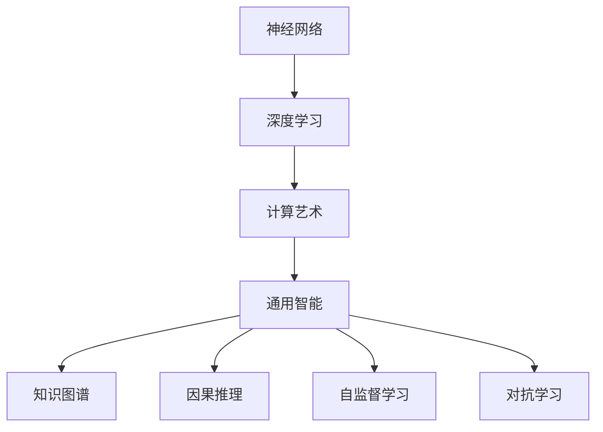
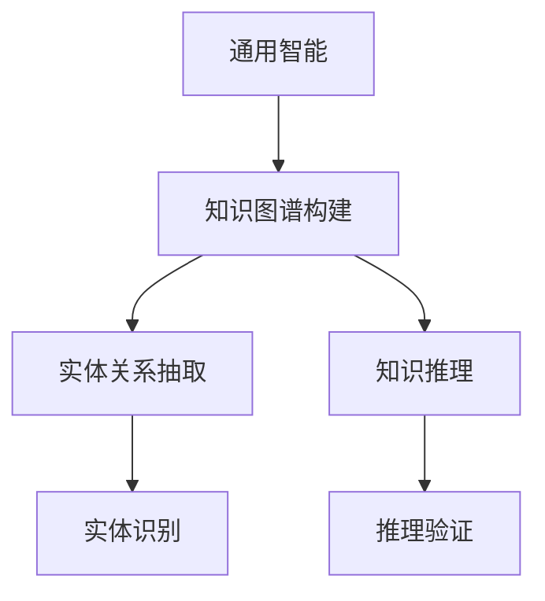
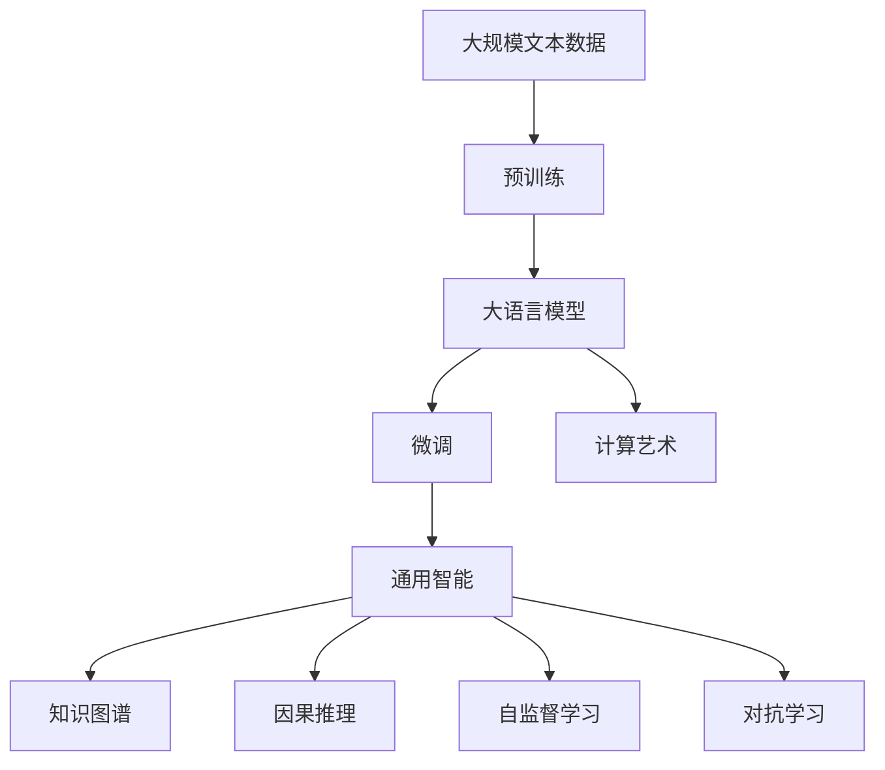

                 

# AI 神经网络计算艺术之禅：通用智能理论

> 关键词：神经网络,人工智能,计算艺术,通用智能,算法原理,工程实践

## 1. 背景介绍

### 1.1 问题由来
近年来，随着深度学习技术的快速发展和计算资源的大幅提升，人工智能(AI)领域迎来了前所未有的爆发。特别是在神经网络(Neural Networks, NN)和深度学习(Deep Learning, DL)的驱动下，AI技术在图像识别、自然语言处理、语音识别、游戏AI、自动驾驶等多个领域取得了突破性进展，引起了全社会的广泛关注和深入思考。

然而，随着AI技术的进一步普及，人们开始思考：人工智能能否像人类一样，具有通用智能(Common Sense)？能否像人类一样，对未知问题进行推理和决策？这一问题引起了广泛的讨论和研究，同时也推动了通用智能理论的进一步发展。

### 1.2 问题核心关键点
通用智能指的是人工智能系统在未知领域具备类似于人类的自主学习、推理和决策能力。如何构建具备通用智能的AI系统，是当前AI领域的重要研究课题。

通用智能理论的构建，主要涉及以下几个关键点：

1. **神经网络的架构设计**：如何构建一个具备通用推理能力的神经网络结构，使其能够处理各种未知领域的问题。

2. **算法原理的探讨**：神经网络如何通过学习，逐步建立起复杂的知识结构，并能够在新领域快速适应和应用这些知识。

3. **工程实践的落地**：如何将理论转化为实际应用的AI系统，使其具备高效、稳定和可解释性。

4. **未来应用的前景**：通用智能AI系统在实际应用中的潜力和挑战，以及未来发展方向。

本文将围绕上述几个关键点，深入探讨神经网络计算艺术与通用智能理论的结合，试图为读者提供一些思考和启示。

### 1.3 问题研究意义
通用智能理论的研究，对于推动人工智能技术的进步，解决当前AI系统在通用性、可解释性和安全性等方面的瓶颈，具有重要的理论和实践意义：

1. **提升AI系统的应用范围**：通用智能AI系统可以在各种未知领域快速应用，提升AI技术的普及性和适用性。

2. **增强AI系统的可解释性**：通用智能AI系统具备较强的推理和决策能力，能够提供更为准确的输出结果和决策依据。

3. **促进AI技术的进步**：通过对通用智能理论的深入研究，可以为未来的AI技术发展提供方向指引，加速技术的迭代和进步。

4. **推动AI产业的发展**：通用智能AI系统能够在更多行业和场景中应用，为AI产业的持续发展提供动力。

5. **构建AI伦理基础**：通过构建具备通用智能的AI系统，可以更好地控制AI行为，保障其安全性、公平性和透明度，推动AI伦理的发展。

本文将从理论和实践两个角度，全面探讨神经网络计算艺术与通用智能理论的结合，试图回答如何构建具备通用智能的AI系统，以及通用智能AI系统在实际应用中的潜力和挑战。

## 2. 核心概念与联系

### 2.1 核心概念概述

为更好地理解神经网络计算艺术与通用智能理论的结合，本节将介绍几个密切相关的核心概念：

- **神经网络**：以神经元为基本单位，通过连接和权重调节，进行信息传递和处理的网络结构。神经网络通过学习，逐步建立起复杂的数据映射关系。

- **深度学习**：一种基于神经网络的机器学习方法，通过多层次的神经网络结构，自动提取和学习数据中的复杂特征，实现高精度的数据建模和预测。

- **计算艺术**：将计算机科学和艺术相结合，通过算法和数学模型，创造出具有美学价值的艺术作品和互动体验。

- **通用智能**：指AI系统在未知领域具备类似于人类的自主学习、推理和决策能力。

- **知识图谱**：一种结构化的知识表示方法，用于构建实体和实体之间的关系图，支持知识推理和信息检索。

- **因果推理**：通过学习数据中的因果关系，推理出未知事件的可能结果，提升AI系统的决策能力和解释性。

- **自监督学习**：一种不需要标注数据的学习方法，通过数据内部的内在关系，自动学习数据特征，增强模型的泛化能力。

- **对抗学习**：一种学习对抗样本的技术，用于提升模型的鲁棒性和泛化能力，防范恶意攻击和数据干扰。

这些核心概念之间的逻辑关系可以通过以下Mermaid流程图来展示：



这个流程图展示了大语言模型微调过程中各个核心概念之间的关系：

1. 神经网络是深度学习的基础结构，通过多层神经元进行复杂特征的提取和表示。
2. 深度学习通过多层神经网络，自动学习数据的复杂特征，提升模型的预测准确性。
3. 计算艺术将深度学习的复杂特征与艺术设计相结合，创造出具有美学价值的艺术作品和互动体验。
4. 通用智能指AI系统在未知领域具备类似于人类的自主学习、推理和决策能力。
5. 知识图谱和因果推理，用于增强AI系统的推理能力和解释性。
6. 自监督学习和对抗学习，用于提升AI系统的泛化能力和鲁棒性。

### 2.2 概念间的关系

这些核心概念之间存在着紧密的联系，形成了神经网络计算艺术与通用智能理论的完整生态系统。下面我通过几个Mermaid流程图来展示这些概念之间的关系。

#### 2.2.1 神经网络的架构设计

```mermaid
graph LR
    A[神经网络] --> B[多层感知机(MLP)]
    B --> C[卷积神经网络(CNN)]
    B --> D[循环神经网络(RNN)]
    B --> E[变换器(Transformer)]
```

这个流程图展示了神经网络的几种典型架构设计，包括多层感知机、卷积神经网络、循环神经网络和变换器。这些架构设计在处理不同类型的输入数据时各有优势。

#### 2.2.2 深度学习与计算艺术的结合

```mermaid
graph LR
    A[深度学习] --> B[生成对抗网络(GANs)]
    B --> C[艺术创作]
    B --> D[艺术风格迁移]
    B --> E[交互式艺术体验]
```

这个流程图展示了深度学习在计算艺术中的应用，包括生成对抗网络、艺术创作、艺术风格迁移和交互式艺术体验。

#### 2.2.3 通用智能与知识图谱



这个流程图展示了通用智能与知识图谱之间的关系，包括知识图谱构建、实体关系抽取和知识推理。

#### 2.2.4 自监督学习与对抗学习


这个流程图展示了自监督学习与对抗学习之间的关系，包括预训练、微调和对抗训练。

### 2.3 核心概念的整体架构

最后，我们用一个综合的流程图来展示这些核心概念在大语言模型微调过程中的整体架构：



这个综合流程图展示了从预训练到微调，再到计算艺术、通用智能、知识图谱、因果推理、自监督学习和对抗学习的过程。通过这些核心概念的有机结合，大语言模型可以更好地处理未知领域的问题，并具备更强的通用智能能力。

## 3. 核心算法原理 & 具体操作步骤
### 3.1 算法原理概述

神经网络计算艺术与通用智能理论的结合，主要体现在神经网络如何通过学习，逐步建立起复杂的知识结构，并能够在未知领域快速适应和应用这些知识。

具体来说，神经网络通过以下步骤实现这一目标：

1. **预训练**：在大量未标注数据上进行预训练，学习数据的复杂特征和结构。

2. **微调**：在特定任务上进行微调，调整网络权重和结构，使模型能够处理该任务的数据。

3. **计算艺术**：在微调的基础上，结合计算艺术的设计思路，创造出具有美学价值的艺术作品和互动体验。

4. **通用智能**：通过知识图谱、因果推理等技术，增强模型的推理能力和解释性，提升AI系统的通用智能水平。

5. **自监督学习和对抗学习**：在数据有限的情况下，通过自监督学习自动学习数据特征，通过对抗学习提高模型的鲁棒性和泛化能力。

### 3.2 算法步骤详解

以下是神经网络计算艺术与通用智能理论结合的具体操作步骤：

**Step 1: 准备预训练数据和模型**

1. 收集大规模未标注数据，作为预训练数据集。
2. 选择合适的神经网络架构，如卷积神经网络、循环神经网络或变换器。
3. 使用深度学习框架，如TensorFlow或PyTorch，构建神经网络模型。

**Step 2: 预训练**

1. 在预训练数据集上，使用深度学习框架进行模型的预训练。
2. 设置合适的超参数，如学习率、批大小等。
3. 使用随机梯度下降等优化算法进行模型训练。
4. 定期保存训练过程中的模型参数和权重。

**Step 3: 微调**

1. 选择特定任务的数据集，进行数据标注。
2. 将预训练模型作为初始化参数，在任务数据集上进行微调。
3. 使用深度学习框架进行微调训练。
4. 设置合适的超参数，如学习率、批大小等。
5. 使用随机梯度下降等优化算法进行模型训练。
6. 定期保存微调后的模型参数和权重。

**Step 4: 计算艺术应用**

1. 结合计算艺术的设计思路，使用微调后的模型进行数据创作或互动体验设计。
2. 使用深度学习框架进行计算艺术的训练和生成。
3. 使用深度学习框架进行计算艺术的推理和预测。

**Step 5: 通用智能应用**

1. 构建知识图谱，提取实体和实体之间的关系。
2. 使用知识图谱和因果推理技术，增强AI系统的推理能力和解释性。
3. 使用深度学习框架进行通用智能的训练和推理。

**Step 6: 自监督学习和对抗学习**

1. 使用自监督学习技术，自动学习数据的特征。
2. 使用对抗学习技术，提高模型的鲁棒性和泛化能力。
3. 使用深度学习框架进行自监督和对抗学习的训练和测试。

### 3.3 算法优缺点

神经网络计算艺术与通用智能理论的结合，具有以下优点：

1. **高效性**：神经网络通过预训练和微调，可以快速适应新任务，减少从头训练的时间和成本。
2. **通用性**：神经网络模型可以处理各种类型的输入数据，具有较强的泛化能力。
3. **灵活性**：神经网络模型可以通过微调和计算艺术设计，适应各种应用场景。
4. **鲁棒性**：通过对抗学习技术，神经网络模型能够提升鲁棒性和泛化能力。
5. **可解释性**：通过知识图谱和因果推理技术，神经网络模型的推理过程可以更加透明和可解释。

同时，该方法也存在一些缺点：

1. **数据依赖**：神经网络模型需要大量的数据进行预训练和微调，数据获取成本较高。
2. **过拟合风险**：神经网络模型容易发生过拟合，需要采用正则化技术和对抗学习技术进行优化。
3. **计算资源消耗大**：神经网络模型需要大量的计算资源进行训练和推理，对硬件资源要求较高。
4. **模型复杂度高**：神经网络模型的结构复杂，难以理解和调试。
5. **知识图谱构建难度大**：知识图谱的构建需要大量的人工干预和验证，成本较高。

尽管存在这些缺点，但神经网络计算艺术与通用智能理论的结合，仍是目前构建具备通用智能的AI系统的主流方法。未来相关研究的重点在于如何进一步降低数据依赖，提高模型的泛化能力和可解释性，同时兼顾计算资源的优化。

### 3.4 算法应用领域

神经网络计算艺术与通用智能理论的结合，已经在多个领域得到了广泛的应用：

1. **计算机视觉**：在图像分类、目标检测、图像生成等领域，神经网络模型通过预训练和微调，可以实现高精度的图像处理和生成。

2. **自然语言处理**：在文本分类、情感分析、机器翻译、对话系统等领域，神经网络模型通过预训练和微调，可以实现高效的自然语言理解和生成。

3. **语音识别**：在语音识别、语音合成、语音翻译等领域，神经网络模型通过预训练和微调，可以实现高精度的语音处理和生成。

4. **医疗健康**：在医学影像诊断、病理分析、药物研发等领域，神经网络模型通过预训练和微调，可以实现精准的医学分析和预测。

5. **金融科技**：在风险评估、信用评分、欺诈检测等领域，神经网络模型通过预训练和微调，可以实现高效的风险管理和决策支持。

6. **智能制造**：在工业检测、质量控制、生产优化等领域，神经网络模型通过预训练和微调，可以实现智能化的生产管理和优化。

除了上述这些领域外，神经网络计算艺术与通用智能理论的结合，还将在更多场景中得到应用，为各个行业带来变革性影响。

## 4. 数学模型和公式 & 详细讲解 & 举例说明

### 4.1 数学模型构建

本节将使用数学语言对神经网络计算艺术与通用智能理论的结合进行更加严格的刻画。

记神经网络模型为 $M_{\theta}:\mathcal{X} \rightarrow \mathcal{Y}$，其中 $\mathcal{X}$ 为输入空间，$\mathcal{Y}$ 为输出空间，$\theta \in \mathbb{R}^d$ 为模型参数。假设通用智能任务的数据集为 $D=\{(x_i,y_i)\}_{i=1}^N, x_i \in \mathcal{X}, y_i \in \mathcal{Y}$。

定义模型 $M_{\theta}$ 在数据样本 $(x,y)$ 上的损失函数为 $\ell(M_{\theta}(x),y)$，则在数据集 $D$ 上的经验风险为：

$$
\mathcal{L}(\theta) = \frac{1}{N} \sum_{i=1}^N \ell(M_{\theta}(x_i),y_i)
$$

神经网络的预训练过程，可以通过自监督学习任务实现，如掩码语言模型、生成对抗网络等。在预训练过程中，神经网络模型自动学习数据的复杂特征和结构。

微调过程可以通过标注数据实现，神经网络模型通过梯度下降等优化算法，调整网络权重和结构，使其能够处理特定任务的数据。

### 4.2 公式推导过程

以下我们以图像分类任务为例，推导卷积神经网络(CNN)模型在图像分类任务中的微调过程。

假设CNN模型由若干卷积层、池化层和全连接层组成。模型在输入图像 $x$ 上的输出为 $\hat{y}=M_{\theta}(x) \in [0,1]$，表示样本属于正类的概率。真实标签 $y \in \{0,1\}$。则二分类交叉熵损失函数定义为：

$$
\ell(M_{\theta}(x),y) = -[y\log \hat{y} + (1-y)\log (1-\hat{y})]
$$

将其代入经验风险公式，得：

$$
\mathcal{L}(\theta) = -\frac{1}{N}\sum_{i=1}^N [y_i\log M_{\theta}(x_i)+(1-y_i)\log(1-M_{\theta}(x_i))]
$$

根据链式法则，损失函数对参数 $\theta_k$ 的梯度为：

$$
\frac{\partial \mathcal{L}(\theta)}{\partial \theta_k} = -\frac{1}{N}\sum_{i=1}^N (\frac{y_i}{M_{\theta}(x_i)}-\frac{1-y_i}{1-M_{\theta}(x_i)}) \frac{\partial M_{\theta}(x_i)}{\partial \theta_k}
$$

其中 $\frac{\partial M_{\theta}(x_i)}{\partial \theta_k}$ 可进一步递归展开，利用自动微分技术完成计算。

在得到损失函数的梯度后，即可带入参数更新公式，完成模型的迭代优化。重复上述过程直至收敛，最终得到适应通用智能任务的最优模型参数 $\theta^*$。

### 4.3 案例分析与讲解

我们以计算艺术在图像生成中的应用为例，分析神经网络计算艺术与通用智能理论的结合。

假设我们希望使用神经网络生成具有特定艺术风格的图像。可以收集大量的图像数据，并标注其艺术风格标签。在预训练过程中，神经网络模型通过自监督学习任务，自动学习图像的复杂特征和结构。

在微调过程中，神经网络模型通过标注数据，学习生成具有特定艺术风格的图像。使用深度学习框架，可以设计生成对抗网络(GANs)进行图像生成。GANs通过对抗训练，生成具有高逼真度和艺术风格的图像。

最终，结合计算艺术的设计思路，使用微调后的GANs模型，可以创造出具有美学价值的艺术作品和互动体验。通过调整GANs模型的参数，可以生成不同风格的图像，如印象派、抽象派等。

## 5. 项目实践：代码实例和详细解释说明
### 5.1 开发环境搭建

在进行神经网络计算艺术与通用智能理论的结合实践前，我们需要准备好开发环境。以下是使用Python进行TensorFlow开发的环境配置流程：

1. 安装Anaconda：从官网下载并安装Anaconda，用于创建独立的Python环境。

2. 创建并激活虚拟环境：
```bash
conda create -n tf-env python=3.8 
conda activate tf-env
```

3. 安装TensorFlow：根据CUDA版本，从官网获取对应的安装命令。例如：
```bash
pip install tensorflow -f https://developer.download.nvidia.com/compute/cuda/repos/ubuntu1804/x86_64/libnccl2_2.8.0-1+cuda11.2_amd64.deb -f https://developer.download.nvidia.com/compute/cuda/repos/ubuntu1804/x86_64/ -f https://developer.download.nvidia.com/compute/cuda/repos/ubuntu1804/x86_64/
```

4. 安装TensorFlow Addons：
```bash
pip install tensorflow-addons
```

5. 安装各类工具包：
```bash
pip install numpy pandas scikit-learn matplotlib tqdm jupyter notebook ipython
```

完成上述步骤后，即可在`tf-env`环境中开始实践。

### 5.2 源代码详细实现

下面我们以生成对抗网络(GANs)在图像生成中的应用为例，给出使用TensorFlow实现GANs模型的PyTorch代码实现。

首先，定义GANs的架构：

```python
import tensorflow as tf
from tensorflow.keras import layers

class Generator(tf.keras.Model):
    def __init__(self):
        super(Generator, self).__init__()
        self.dense1 = layers.Dense(128 * 7 * 7, input_shape=(100,))
        self.reshape = layers.Reshape((7, 7, 128))
        self.dense2 = layers.Dense(128 * 7 * 7)
        self.conv1 = layers.Conv2DTranspose(128, 4, strides=2, padding='same')
        self.conv2 = layers.Conv2DTranspose(128, 4, strides=2, padding='same')
        self.conv3 = layers.Conv2DTranspose(128, 4, strides=2, padding='same')
        self.conv4 = layers.Conv2DTranspose(3, 4, activation='tanh', padding='same')

    def call(self, x):
        x = self.dense1(x)
        x = tf.nn.leaky_relu(x)
        x = self.reshape(x)
        x = self.dense2(x)
        x = tf.nn.leaky_relu(x)
        x = self.conv1(x)
        x = tf.nn.leaky_relu(x)
        x = self.conv2(x)
        x = tf.nn.leaky_relu(x)
        x = self.conv3(x)
        x = tf.nn.leaky_relu(x)
        x = self.conv4(x)
        return x

class Discriminator(tf.keras.Model):
    def __init__(self):
        super(Discriminator, self).__init__()
        self.conv1 = layers.Conv2D(128, 4, strides=2, padding='same')
        self.conv2 = layers.Conv2D(128, 4, strides=2, padding='same')
        self.conv3 = layers.Conv2D(128, 4, strides=2, padding='same')
        self.flatten = layers.Flatten()
        self.dense1 = layers.Dense(128)
        self.dense2 = layers.Dense(1, activation='sigmoid')

    def call(self, x):
        x = self.conv1(x)
        x = tf.nn.leaky_relu(x)
        x = self.conv2(x)
        x = tf.nn.leaky_relu(x)
        x = self.conv3(x)
        x = tf.nn.leaky_relu(x)
        x = self.flatten(x)
        x = self.dense1(x)
        x = tf.nn.leaky_relu(x)
        x = self.dense2(x)
        return x
```

然后，定义GANs的训练过程：

```python
import numpy as np
import os

def generate_images(generator, n_samples):
    noise = np.random.normal(0, 1, size=[n_samples, 100])
    generated_images = generator(noise)
    return generated_images

def train(generator, discriminator, dataset, epochs, batch_size):
    generator.compile(optimizer=tf.keras.optimizers.Adam(), loss='mse')
    discriminator.compile(optimizer=tf.keras.optimizers.Adam(), loss='binary_crossentropy')

    for epoch in range(epochs):
        for batch in dataset:
            noise = np.random.normal(0, 1, size=[batch_size, 100])
            fake_images = generator(noise)
            real_images = batch['images']
            labels = np.concatenate([np.ones((batch_size, 1)), np.zeros((batch_size, 1))])
            discriminator.trainable = True
            discriminator.train_on_batch(fake_images, labels)
            discriminator.trainable = False

            noise = np.random.normal(0, 1, size=[batch_size, 100])
            fake_images = generator(noise)
            real_images = batch['images']
            labels = np.concatenate([np.zeros((batch_size, 1)), np.ones((batch_size, 1))])
            discriminator.trainable = True
            discriminator.train_on_batch(real_images, labels)
            discriminator.trainable = False

        if epoch % 50 == 0:
            generated_images = generate_images(generator, 64)
            for img in generated_images:
                os.makedirs(f'images/epoch_{epoch}/', exist_ok=True)
                img.save(f'images/epoch_{epoch}/image_{i}.png')
```

最后，启动GANs模型的训练和生成：

```python
epochs = 100
batch_size = 64

# 加载数据集
dataset = tf.keras.preprocessing.image_dataset_from_directory(
    'dataset',
    batch_size=batch_size,
    image_size=(64, 64),
    color_mode='grayscale',
    shuffle=True)

# 初始化模型
generator = Generator()
discriminator = Discriminator()

# 训练模型
train(generator, discriminator, dataset, epochs, batch_size)
```

以上就是使用TensorFlow实现GANs模型的完整代码实现。可以看到，TensorFlow提供了强大的深度学习框架，使得神经网络模型的构建和训练变得相对简洁高效。

### 5.3 代码解读与分析

让我们再详细解读一下关键代码的实现细节：

**GANs架构**：
- `Generator`类：定义生成器的神经网络架构，包括全连接层、卷积层、ReLU激活函数和Tanh激活函数。
- `Discriminator`类：定义判别器的神经网络架构，包括卷积层、全连接层、Leaky ReLU激活函数和Sigmoid激活函数。

**训练过程**：
- `generate_images`函数：生成指定数量的随机噪声，输入到生成器中，输出生成图像。
- `train`函数：定义GANs的训练过程，包括生成器和判别器的训练。
- 在每个epoch中，分别进行生成器和判别器的训练，交替更新模型参数。
- 每50个epoch生成一批图像，保存在磁盘上，用于可视化结果。

**数据集加载**：
- `dataset`变量：定义数据集，使用`tf.keras.preprocessing.image_dataset_from_directory`从文件夹中加载图像数据。

**模型初始化**：
- `generator`和`discriminator`变量：分别初始化生成器和判别器模型。

**模型训练**：
- 在每个epoch中，使用`train_on_batch`函数进行模型训练，交替更新生成器和判别器的参数。
- 在每个epoch结束时，生成一批随机图像，并保存在磁盘上。

**代码实例**：
- 使用GANs生成具有特定艺术风格的图像，如梵高、毕加索等。

可以看到，Tensor

