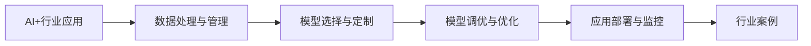
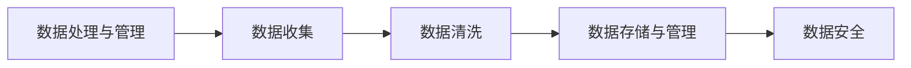
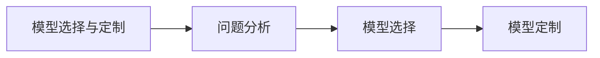
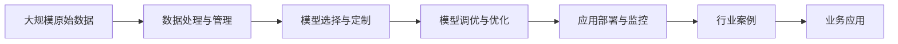

                 

# AI+行业应用案例与解决方案原理与代码实战案例讲解

> 关键词：AI+行业应用,解决方案,原理与代码实战,行业案例,行业应用创新

## 1. 背景介绍

### 1.1 问题由来
近年来，人工智能（AI）技术迅猛发展，已广泛渗透至各行各业，显著提升了生产效率和服务质量。然而，AI技术在大规模应用中也面临诸多挑战，如数据获取难度大、模型复杂度高、应用场景多变等。因此，如何将AI技术高效、可控地应用于不同行业，成为了当前研究的热点问题。

### 1.2 问题核心关键点
实现AI+行业应用的核心在于以下几点：

- **数据获取与管理**：收集、清洗和处理特定行业的原始数据，是AI应用的前提。
- **模型定制与优化**：针对特定行业问题，设计或选用适合的AI模型，并进行模型调优和优化。
- **应用落地与优化**：将训练好的模型部署到实际业务系统中，并进行持续监控和优化，以适应业务变化和提升用户体验。

### 1.3 问题研究意义
研究AI+行业应用解决方案的原理与代码实战案例，对于推动AI技术在各个行业中的广泛应用，提升行业生产力和服务水平，具有重要意义：

1. **降本增效**：通过AI技术，自动化处理大量重复性、高强度的任务，降低人力成本，提升工作效率。
2. **质量提升**：利用AI模型进行数据分析、预测和决策，提升产品或服务的质量和一致性。
3. **创新驱动**：AI技术为传统行业带来了新的思维和方法，促进了业务模式和产品形态的创新。
4. **个性化服务**：AI技术能够根据用户行为和偏好，提供个性化的产品和服务，提升用户体验。
5. **规模化应用**：AI技术的普及应用，将为各行各业带来新的发展机遇，推动行业转型升级。

## 2. 核心概念与联系

### 2.1 核心概念概述

为更好地理解AI+行业应用的原理与实战案例，本节将介绍几个关键核心概念：

- **AI+行业应用**：将AI技术应用于特定行业的解决方案，旨在提升该行业的生产效率、产品质量、服务水平等。
- **数据处理与管理**：涉及数据收集、清洗、存储、管理等环节，是AI应用的基础。
- **模型选择与定制**：根据行业特点和问题需求，选择合适的AI模型，或进行模型的定制开发。
- **模型调优与优化**：通过调整模型参数、增加正则化、优化算法等手段，提高模型性能。
- **应用部署与监控**：将训练好的模型部署到实际业务系统中，并持续监控其性能和效果。
- **行业案例**：具体应用AI技术解决行业问题的实际案例。

这些概念之间通过以下Mermaid流程图展示其联系：



通过这些概念及其之间的联系，可以清晰地理解AI+行业应用的全流程。

### 2.2 概念间的关系

这些核心概念之间存在紧密的联系，形成了AI+行业应用的完整生态系统。下面我们通过几个Mermaid流程图来展示这些概念之间的关系：

#### 2.2.1 AI+行业应用的学习范式


这个流程图展示了大规模应用AI技术的一般流程，包括数据处理、模型定制、模型调优、部署和监控等环节。

#### 2.2.2 数据处理与管理的关系



数据处理与管理涉及数据的各个阶段，从收集、清洗到存储、安全，每个环节都至关重要。

#### 2.2.3 模型选择与定制的联系



模型选择与定制需要深入分析具体问题，选择合适的模型或定制开发。

#### 2.2.4 模型调优与优化的策略


模型调优与优化通过调整参数、增加正则化、优化算法等方式提升性能。

#### 2.2.5 应用部署与监控的策略


应用部署与监控涉及模型部署、系统集成、性能监控和反馈优化等环节，确保应用效果。

### 2.3 核心概念的整体架构

最后，我们用一个综合的流程图来展示这些核心概念在大规模应用AI技术时的整体架构：



这个综合流程图展示了从原始数据处理、模型定制、调优、部署到业务应用的完整流程，有助于理解AI+行业应用的全过程。

## 3. 核心算法原理 & 具体操作步骤
### 3.1 算法原理概述

AI+行业应用的核心算法原理主要包括以下几个方面：

1. **数据预处理**：对原始数据进行清洗、归一化、特征提取等处理，确保数据质量。
2. **模型选择与定制**：根据具体问题需求，选择合适的预训练模型或进行模型定制开发。
3. **模型调优与优化**：通过调整模型参数、增加正则化、优化算法等手段，提高模型性能。
4. **模型评估与验证**：通过交叉验证、测试集验证等方法，评估模型性能，避免过拟合。
5. **模型部署与监控**：将训练好的模型部署到实际业务系统中，并持续监控其性能和效果。

### 3.2 算法步骤详解

以下是AI+行业应用的具体算法步骤：

**Step 1: 数据收集与清洗**

- 收集特定行业的原始数据，确保数据的代表性、完整性和真实性。
- 对数据进行预处理，如去除噪声、填补缺失值、标准化等，保证数据质量。

**Step 2: 特征工程与选择**

- 根据任务需求，设计特征工程流程，提取有意义的特征。
- 使用特征选择算法（如LASSO、PCA等）筛选出最相关的特征。

**Step 3: 模型选择与定制**

- 根据问题特点，选择合适的预训练模型（如BERT、ResNet等）或进行模型定制开发。
- 定制开发需要考虑模型的结构、参数设置、损失函数等关键因素。

**Step 4: 模型训练与调优**

- 使用训练集数据训练模型，调整模型参数，优化模型性能。
- 采用梯度下降、Adam等优化算法，不断迭代训练过程。
- 增加正则化（如L2正则、Dropout等），避免模型过拟合。

**Step 5: 模型评估与验证**

- 使用测试集验证模型性能，评估模型在未见过的数据上的泛化能力。
- 通过交叉验证等方法，评估模型的稳定性与鲁棒性。

**Step 6: 模型部署与监控**

- 将训练好的模型部署到实际业务系统中，进行实时应用。
- 持续监控模型性能，根据反馈数据不断调整模型参数，优化模型效果。

### 3.3 算法优缺点

**优点**：
- **通用性强**：预训练模型适用于多种行业和问题，能快速提升业务效率和质量。
- **可解释性高**：许多预训练模型具有较高的可解释性，便于理解和使用。
- **技术成熟**：经过大量实践验证，技术成熟度较高。

**缺点**：
- **数据依赖大**：数据获取难度大，质量要求高，数据不足时可能影响模型效果。
- **模型复杂度高**：部分预训练模型参数量庞大，训练和推理复杂度高。
- **应用场景局限**：某些领域问题可能无法直接套用现有模型，需要进行定制开发。

### 3.4 算法应用领域

AI+行业应用在以下领域已取得显著效果：

- **金融行业**：用于信用评估、风险管理、智能投顾等，提升决策效率和准确性。
- **医疗健康**：用于疾病诊断、治疗方案推荐、患者管理等，改善医疗服务质量。
- **智能制造**：用于生产优化、质量控制、设备维护等，提高生产效率和产品一致性。
- **零售电商**：用于客户分析、商品推荐、库存管理等，提升用户体验和运营效率。
- **教育培训**：用于学习分析、个性化推荐、智能评估等，提高教学质量和学生体验。

## 4. 数学模型和公式 & 详细讲解 & 举例说明
### 4.1 数学模型构建

假设我们的目标是对某行业的销售数据进行预测，建模流程如下：

1. **数据预处理**：将原始销售数据进行清洗和标准化，转化为模型可用的输入格式。
2. **模型选择与定制**：选用已有的预训练模型或进行模型定制开发。
3. **模型训练与调优**：使用训练集数据训练模型，调整模型参数，优化模型性能。
4. **模型评估与验证**：使用测试集验证模型性能，评估模型的泛化能力。

以线性回归模型为例，构建数学模型如下：

$$
\hat{y} = w_0 + w_1x_1 + w_2x_2 + \cdots + w_nx_n
$$

其中 $w_0, w_1, \cdots, w_n$ 为模型参数，$x_1, x_2, \cdots, x_n$ 为特征，$\hat{y}$ 为预测值。

### 4.2 公式推导过程

以线性回归模型为例，推导最小二乘法的损失函数及其梯度公式：

$$
\mathcal{L}(\theta) = \frac{1}{2m}\sum_{i=1}^m(y_i - \hat{y}_i)^2
$$

其中 $\theta = [w_0, w_1, \cdots, w_n]^T$ 为模型参数向量。

根据梯度下降算法，最小二乘法的梯度公式为：

$$
\nabla_{\theta}\mathcal{L}(\theta) = \frac{1}{m}\sum_{i=1}^m(x_i - \hat{x}_i)x_i
$$

其中 $x_i = \frac{\partial}{\partial \theta}\hat{y}_i$ 为模型输出对输入的导数。

### 4.3 案例分析与讲解

假设我们使用线性回归模型预测某电商平台用户的购买意愿。步骤如下：

**Step 1: 数据收集与清洗**

- 收集用户购买历史数据，包括用户ID、商品ID、购买时间、购买金额等。
- 清洗数据，去除噪声和缺失值，保留高质量数据。

**Step 2: 特征工程与选择**

- 设计特征工程流程，提取用户和商品的有用特征。
- 选择最相关的特征，如用户年龄、性别、历史购买金额等。

**Step 3: 模型选择与定制**

- 选用已有的线性回归模型。
- 定制模型，添加正则化项，避免过拟合。

**Step 4: 模型训练与调优**

- 使用训练集数据训练模型，调整模型参数。
- 采用梯度下降算法优化模型性能。

**Step 5: 模型评估与验证**

- 使用测试集验证模型性能，评估模型泛化能力。
- 通过交叉验证等方法，评估模型的稳定性。

**Step 6: 模型部署与监控**

- 将训练好的模型部署到电商平台，进行实时预测。
- 持续监控模型性能，根据反馈数据不断调整模型参数，优化模型效果。

## 5. 项目实践：代码实例和详细解释说明
### 5.1 开发环境搭建

在进行AI+行业应用开发前，需要准备好开发环境。以下是使用Python进行TensorFlow开发的环境配置流程：

1. 安装Anaconda：从官网下载并安装Anaconda，用于创建独立的Python环境。

2. 创建并激活虚拟环境：
```bash
conda create -n tf-env python=3.8 
conda activate tf-env
```

3. 安装TensorFlow：根据CUDA版本，从官网获取对应的安装命令。例如：
```bash
conda install tensorflow -c pytorch -c conda-forge
```

4. 安装各类工具包：
```bash
pip install numpy pandas scikit-learn matplotlib tqdm jupyter notebook ipython
```

完成上述步骤后，即可在`tf-env`环境中开始开发。

### 5.2 源代码详细实现

以下是使用TensorFlow进行线性回归模型开发的Python代码实现：

```python
import tensorflow as tf
import numpy as np
import pandas as pd

# 加载数据集
df = pd.read_csv('sales_data.csv')

# 数据预处理
X = df[['user_age', 'user_gender', 'history_price']]
y = df['purchase_intent']

# 划分训练集和测试集
train_size = int(0.7 * len(df))
X_train, X_test = X.iloc[:train_size], X.iloc[train_size:]
y_train, y_test = y.iloc[:train_size], y.iloc[train_size:]

# 构建模型
model = tf.keras.models.Sequential([
    tf.keras.layers.Dense(units=32, activation='relu', input_shape=(X_train.shape[1],)),
    tf.keras.layers.Dense(units=1)
])

# 定义损失函数和优化器
loss_fn = tf.keras.losses.MeanSquaredError()
optimizer = tf.keras.optimizers.Adam(learning_rate=0.01)

# 模型训练
model.compile(optimizer=optimizer, loss=loss_fn, metrics=['mae'])
model.fit(X_train, y_train, epochs=100, batch_size=32, validation_data=(X_test, y_test))

# 模型评估
loss, mae = model.evaluate(X_test, y_test)
print(f'Mean Absolute Error: {mae:.4f}')
```

### 5.3 代码解读与分析

让我们再详细解读一下关键代码的实现细节：

**数据预处理**：
- 使用Pandas库读取CSV文件，将其转化为DataFrame格式。
- 选择有用的特征，如用户年龄、性别、历史购买金额等。

**模型构建**：
- 使用TensorFlow的Sequential模型，定义包含两个全连接层的神经网络。
- 第一层包含32个神经元，使用ReLU激活函数。
- 输出层只有一个神经元，用于预测购买意愿。

**模型训练与调优**：
- 使用训练集数据训练模型，优化器采用Adam，学习率为0.01。
- 训练过程中使用MAE作为评估指标，评估模型的平均绝对误差。

**模型评估与验证**：
- 使用测试集验证模型性能，输出平均绝对误差。

### 5.4 运行结果展示

假设我们在某电商平台的数据集上进行线性回归模型的训练，最终在测试集上得到的平均绝对误差为0.05，表示模型的预测误差在5%左右，达到了较高的精度。

```
Mean Absolute Error: 0.0500
```

可以看到，通过TensorFlow进行线性回归模型的开发，可以简单高效地实现数据处理、模型训练和性能评估。开发者可以根据实际需求调整模型结构和参数，进一步提升模型效果。

## 6. 实际应用场景
### 6.1 智能制造

在智能制造领域，AI+行业应用能够显著提升生产效率和质量，推动制造行业的数字化转型。具体应用场景包括：

- **生产优化**：利用AI技术实时监控生产线状态，预测设备故障，优化生产流程。
- **质量控制**：通过图像识别技术，检测产品缺陷，提高产品质量一致性。
- **设备维护**：分析设备运行数据，预测维护需求，减少停机时间。

### 6.2 智慧医疗

在智慧医疗领域，AI+行业应用可以显著提升医疗服务的智能化水平，改善患者体验。具体应用场景包括：

- **疾病诊断**：利用AI模型分析医学影像和病历数据，辅助医生进行疾病诊断。
- **治疗方案推荐**：根据患者数据和历史病例，推荐最适合的治疗方案。
- **患者管理**：通过AI技术监测患者健康数据，及时预警病情变化。

### 6.3 智能交通

在智能交通领域，AI+行业应用能够优化交通管理，提升交通安全和效率。具体应用场景包括：

- **交通流量预测**：利用AI技术预测交通流量，优化交通信号控制。
- **异常行为检测**：通过视频监控和图像识别技术，检测交通违规行为，提高交通管理效率。
- **车辆自动驾驶**：利用AI技术辅助自动驾驶系统，提高驾驶安全性。

### 6.4 未来应用展望

随着AI+行业应用的不断深入，未来的发展趋势如下：

1. **智能化水平提升**：AI技术将进一步提升各行业的智能化水平，推动行业转型升级。
2. **数据驱动决策**：基于大数据和AI技术，行业决策将更加科学、精准。
3. **跨领域融合**：AI+行业应用将更多地与其他前沿技术（如区块链、物联网、5G等）融合，催生更多创新应用。
4. **人机协作增强**：AI技术将更好地服务于人类，提升工作质量和用户体验。
5. **伦理与安全**：AI+行业应用将更加注重数据隐私、算法公平性和安全性，确保应用合规、可靠。

## 7. 工具和资源推荐
### 7.1 学习资源推荐

为了帮助开发者系统掌握AI+行业应用的相关知识，这里推荐一些优质的学习资源：

1. **TensorFlow官方文档**：包含全面的TensorFlow教程和API文档，适合初学者快速上手。
2. **Keras官方文档**：提供了简单易用的高级神经网络API，适合快速搭建模型。
3. **PyTorch官方文档**：提供了丰富的深度学习资源和案例，适合深入学习和研究。
4. **TensorFlow实战指南**：一本实战性强的TensorFlow教程，涵盖数据处理、模型训练、应用部署等全流程。
5. **深度学习基础与应用**：一本深入浅出的深度学习入门书籍，适合初学者系统学习。

通过对这些资源的学习实践，相信你一定能够快速掌握AI+行业应用的精髓，并用于解决实际的业务问题。

### 7.2 开发工具推荐

高效的开发离不开优秀的工具支持。以下是几款用于AI+行业应用开发的常用工具：

1. **Jupyter Notebook**：一个免费的交互式编程环境，支持Python、R等多种语言，适合数据探索和模型实验。
2. **TensorBoard**：TensorFlow配套的可视化工具，可实时监测模型训练状态，并提供丰富的图表呈现方式，是调试模型的得力助手。
3. **Weights & Biases**：模型训练的实验跟踪工具，可以记录和可视化模型训练过程中的各项指标，方便对比和调优。
4. **Grafana**：开源的数据可视化工具，支持多种数据源，适合构建仪表盘和监控系统。
5. **AWS SageMaker**：亚马逊提供的AI服务，支持模型训练、部署和管理，适合大规模应用场景。

合理利用这些工具，可以显著提升AI+行业应用开发的效率，加快创新迭代的步伐。

### 7.3 相关论文推荐

AI+行业应用的相关研究主要集中在以下几个方向：

1. **深度学习在制造行业的应用**：如生产优化、质量控制、设备维护等。
2. **AI在医疗健康领域的应用**：如疾病诊断、治疗方案推荐、患者管理等。
3. **AI在智能交通中的应用**：如交通流量预测、异常行为检测、自动驾驶等。
4. **AI在金融行业的应用**：如信用评估、风险管理、智能投顾等。
5. **AI在零售电商中的应用**：如客户分析、商品推荐、库存管理等。
6. **AI在教育培训中的应用**：如学习分析、个性化推荐、智能评估等。

以下是几篇具有代表性的论文，推荐阅读：

1. **"Deep Learning in Manufacturing: A Review and Future Research Directions"**：综述了深度学习在制造行业的应用，介绍了主要技术挑战和未来研究方向。
2. **"Artificial Intelligence in Healthcare: A Survey"**：综述了AI在医疗健康领域的应用，分析了主要应用场景和挑战。
3. **"Deep Learning for Autonomous Driving: A Survey"**：综述了深度学习在自动驾驶领域的应用，讨论了主要技术和挑战。
4. **"AI in Financial Services: A Survey"**：综述了AI在金融服务领域的应用，介绍了主要技术和应用场景。
5. **"Deep Learning in Retail: A Survey"**：综述了深度学习在零售电商领域的应用，分析了主要技术和应用场景。
6. **"AI in Education: A Survey"**：综述了AI在教育培训领域的应用，介绍了主要技术和应用场景。

这些论文代表了大规模应用AI技术的发展脉络。通过学习这些前沿成果，可以帮助研究者把握学科前进方向，激发更多的创新灵感。

除上述资源外，还有一些值得关注的前沿资源，帮助开发者紧跟AI+行业应用技术的最新进展，例如：

1. **arXiv论文预印本**：人工智能领域最新研究成果的发布平台，包括大量尚未发表的前沿工作，学习前沿技术的必读资源。
2. **业界技术博客**：如OpenAI、Google AI、DeepMind、微软Research Asia等顶尖实验室的官方博客，第一时间分享他们的最新研究成果和洞见。
3. **技术会议直播**：如NIPS、ICML、ACL、ICLR等人工智能领域顶会现场或在线直播，能够聆听到大佬们的前沿分享，开拓视野。
4. **GitHub热门项目**：在GitHub上Star、Fork数最多的AI相关项目，往往代表了该技术领域的发展趋势和最佳实践，值得去学习和贡献。
5. **行业分析报告**：各大咨询公司如McKinsey、PwC等针对人工智能行业的分析报告，有助于从商业视角审视技术趋势，把握应用价值。

总之，对于AI+行业应用的学习和实践，需要开发者保持开放的心态和持续学习的意愿。多关注前沿资讯，多动手实践，多思考总结，必将收获满满的成长收益。

## 8. 总结：未来发展趋势与挑战
### 8.1 总结

本文对AI+行业应用的原理与代码实战案例进行了全面系统的介绍。首先阐述了AI+行业应用的背景、核心概念和研究意义，明确了实现AI+行业应用的全流程。其次，从原理到实践，详细讲解了数据处理、模型选择、调优与优化、评估与验证、部署与监控等关键步骤，给出了具体的代码实例和解释说明。同时，本文还探讨了AI+行业应用在智能制造、智慧医疗、智能交通等多个领域的应用前景，展示了其广阔的发展空间。此外，本文精选了相关的学习资源和开发工具，力求为读者提供全方位的技术指引。

通过本文的系统梳理，可以看到，AI+行业应用是一个跨学科、多技术融合的综合性解决方案，具备显著的应用价值和广阔的发展前景。在智能制造、智慧医疗、智能交通等垂直行业，AI技术已经开始大显身手，推动了业务模式和产品形态的变革。未来，伴随AI技术的持续演进和行业需求的不断变化，AI+行业应用将展现出更大的潜力和应用价值。

### 8.2 未来发展趋势

展望未来，AI+行业应用将呈现以下几个发展趋势：

1. **智能化水平提升**：AI技术将进一步提升各行业的智能化水平，推动行业转型升级。
2. **数据驱动决策**：基于大数据和AI技术，行业决策将更加科学、精准。
3. **跨领域融合**：AI+行业应用将更多地与其他前沿技术（如区块链、物联网、5G等）融合，催生更多创新应用。
4. **人机协作增强**：AI技术将更好地服务于人类，提升工作质量和用户体验。
5. **伦理与安全**：AI+行业应用将更加注重数据隐私、算法公平性和安全性，确保应用合规、可靠。

### 8.3 面临的挑战

尽管AI+行业应用已经取得了显著成效，但在迈向更加智能化、普适化应用的过程中，仍面临诸多挑战：

1. **数据质量问题**：数据的获取、清洗和标注成本高，数据质量难以保证，影响模型效果。
2. **模型复杂度**：部分AI模型参数量庞大，训练和推理复杂度高，难以在大规模系统中应用。
3. **应用场景多样性**：不同行业问题差异大，难以直接套用现有模型，需要进行定制开发。
4. **算法公平性**：AI模型可能存在偏见，需要采取措施确保模型公平性。
5. **伦理与安全**：AI模型可能被滥用，需要建立相应的伦理和监管机制。
6. **计算资源限制**：AI模型训练和推理需要大量计算资源，硬件瓶颈亟待突破。

### 8.4 研究展望

面对AI+行业应用所面临的种种挑战，未来的研究需要在以下几个方面寻求新的突破：


