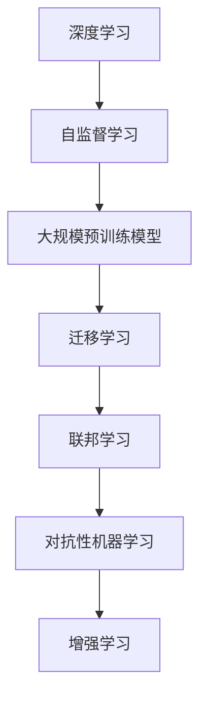
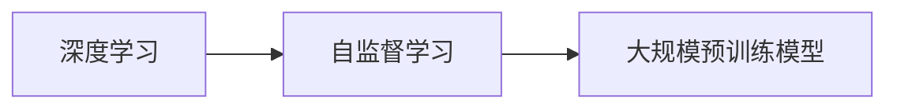
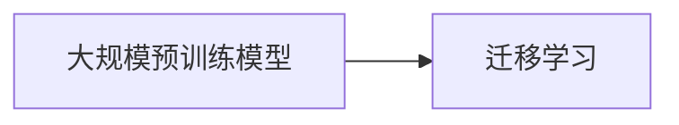
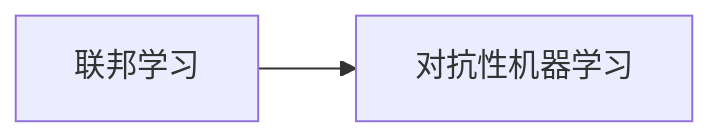
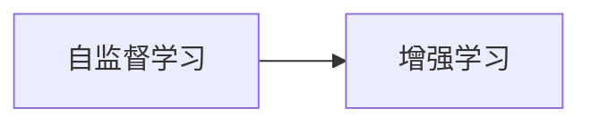
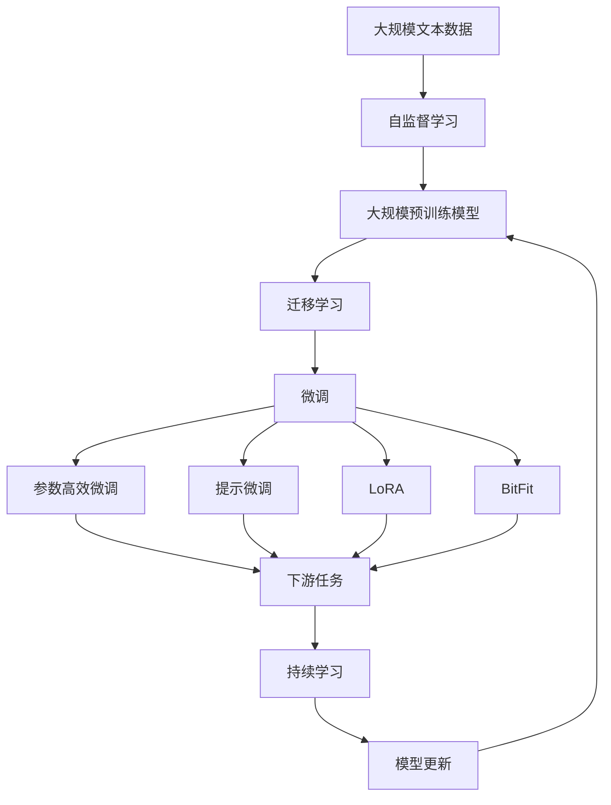

                 

## 1. 背景介绍

随着人工智能(AI)技术的飞速发展，我们即将步入一个全新的AI 2.0时代。这个时代不仅标志着AI技术的成熟应用，更是一个充满无限可能性的时代，它将深刻影响着各行各业的发展。

### 1.1 问题由来

当前，AI技术的迅猛发展主要得益于以下几个关键因素：

- **数据驱动**：大规模、高质量的数据集为深度学习模型的训练提供了充足的素材，使得AI模型在各种任务上取得了突破性的进展。
- **计算能力**：高性能计算硬件如GPU、TPU的普及，使得大规模模型的训练成为可能，显著提升了模型的精度和泛化能力。
- **算法创新**：如Transformer架构、自监督学习等新技术的应用，使得模型的训练效率和效果显著提升。

这些因素共同推动了AI技术的快速发展，使得其在图像识别、自然语言处理、语音识别、自动驾驶等领域取得了显著成果，极大地改变了我们的生产和生活方式。

### 1.2 问题核心关键点

AI 2.0时代，AI技术的核心关键点包括：

- **自监督学习**：通过在大规模无标签数据上进行训练，无需人工标注即可学习到丰富的知识。
- **大规模预训练模型**：如GPT、BERT、T5等，通过在大规模语料上进行预训练，学习到通用的语言表示。
- **迁移学习**：将预训练模型应用于不同的任务上，实现知识迁移，提高模型的泛化能力。
- **联邦学习**：通过分布式训练，在保护数据隐私的前提下，提升模型性能。
- **对抗性机器学习**：学习如何对抗生成对抗性样本，提高模型的鲁棒性。
- **增强学习**：通过与环境的交互，学习最优策略，解决复杂决策问题。

这些关键点共同构成了AI 2.0时代的技术基石，使得AI技术能够从实验室走向现实世界，广泛应用于各行各业。

### 1.3 问题研究意义

研究AI 2.0时代的技术进展和应用前景，对于推动AI技术的普及和应用，提升各行各业的生产效率和竞争力，具有重要意义：

1. **降低开发成本**：基于预训练模型的微调技术，可以大幅降低AI应用的开发和部署成本，使得更多中小企业能够快速应用AI技术。
2. **提升性能**：通过迁移学习和大规模预训练，AI模型能够在特定任务上取得更好的性能，满足实际应用的需求。
3. **加速创新**：AI技术的发展为各行各业带来了新的创新机遇，如智能制造、智慧医疗、智慧城市等，推动社会进步。
4. **增强可解释性**：AI技术的发展，使得模型的决策过程更透明，易于解释，有助于提升公众对AI技术的信任。
5. **保障安全**：通过对抗性机器学习和联邦学习等技术，提高AI系统的安全性，防止数据泄露和模型滥用。

## 2. 核心概念与联系

### 2.1 核心概念概述

在AI 2.0时代，以下核心概念将发挥关键作用：

- **深度学习**：基于神经网络架构的机器学习技术，通过多层非线性变换，可以学习到复杂的数据特征。
- **自监督学习**：通过在大规模无标签数据上训练，无需人工标注即可学习到丰富的知识。
- **大规模预训练模型**：如GPT、BERT、T5等，通过在大规模语料上进行预训练，学习到通用的语言表示。
- **迁移学习**：将预训练模型应用于不同的任务上，实现知识迁移，提高模型的泛化能力。
- **联邦学习**：通过分布式训练，在保护数据隐私的前提下，提升模型性能。
- **对抗性机器学习**：学习如何对抗生成对抗性样本，提高模型的鲁棒性。
- **增强学习**：通过与环境的交互，学习最优策略，解决复杂决策问题。

这些概念之间的逻辑关系可以通过以下Mermaid流程图来展示：



这个流程图展示了大规模预训练模型的核心概念及其之间的关系：

1. 深度学习为自监督学习提供了技术支持，使得在大规模无标签数据上进行训练成为可能。
2. 大规模预训练模型通过自监督学习，学习到通用的语言表示，为迁移学习提供基础。
3. 迁移学习利用大规模预训练模型的知识，提升模型在不同任务上的性能。
4. 联邦学习通过分布式训练，提升模型性能，同时保护数据隐私。
5. 对抗性机器学习通过生成对抗性样本，提高模型鲁棒性，防止模型过拟合。
6. 增强学习通过与环境的交互，学习最优策略，解决复杂决策问题。

### 2.2 概念间的关系

这些核心概念之间存在着紧密的联系，形成了AI 2.0时代的完整生态系统。下面我们通过几个Mermaid流程图来展示这些概念之间的关系。

#### 2.2.1 深度学习与自监督学习的关系



这个流程图展示了深度学习为自监督学习提供技术支持，通过在大规模无标签数据上进行训练，无需人工标注即可学习到丰富的知识。

#### 2.2.2 迁移学习与大规模预训练模型的关系



这个流程图展示了迁移学习利用大规模预训练模型的知识，提升模型在不同任务上的性能。

#### 2.2.3 联邦学习与对抗性机器学习的关系



这个流程图展示了联邦学习通过分布式训练，提升模型性能，同时保护数据隐私。对抗性机器学习通过生成对抗性样本，提高模型鲁棒性，防止模型过拟合。

#### 2.2.4 增强学习与自监督学习的关系



这个流程图展示了自监督学习为增强学习提供基础，通过学习复杂的模式，增强学习能够更好地解决复杂决策问题。

### 2.3 核心概念的整体架构

最后，我们用一个综合的流程图来展示这些核心概念在大规模预训练模型的微调过程中的整体架构：



这个综合流程图展示了从自监督学习到大规模预训练模型，再到微调，最后到持续学习的完整过程。大规模预训练模型通过自监督学习，学习到通用的语言表示，然后通过迁移学习适应下游任务，微调过程提升模型在特定任务上的性能，最后通过持续学习技术，模型可以不断学习新知识，保持时效性。

## 3. 核心算法原理 & 具体操作步骤

### 3.1 算法原理概述

AI 2.0时代的核心算法原理主要围绕以下几个方面展开：

- **自监督学习**：在大规模无标签数据上训练，学习到通用的语言表示。
- **大规模预训练模型**：通过在大规模语料上进行预训练，学习到通用的语言表示。
- **迁移学习**：将预训练模型应用于不同的任务上，实现知识迁移，提高模型的泛化能力。
- **联邦学习**：通过分布式训练，在保护数据隐私的前提下，提升模型性能。
- **对抗性机器学习**：学习如何对抗生成对抗性样本，提高模型的鲁棒性。
- **增强学习**：通过与环境的交互，学习最优策略，解决复杂决策问题。

这些算法原理共同构成了AI 2.0时代的技术基石，使得AI技术能够从实验室走向现实世界，广泛应用于各行各业。

### 3.2 算法步骤详解

以下是AI 2.0时代核心算法的一般步骤：

**Step 1: 准备数据集**
- 收集大规模无标签数据，作为自监督学习的训练数据。
- 准备下游任务的数据集，作为迁移学习的目标数据。

**Step 2: 选择模型架构**
- 选择合适的深度学习模型架构，如Transformer、卷积神经网络等。
- 确定模型的超参数，如隐藏层数、神经元数、学习率等。

**Step 3: 进行自监督学习**
- 在大规模无标签数据上训练模型，学习到通用的语言表示。
- 使用自监督学习任务，如掩码语言模型、自回归预测等，提高模型的泛化能力。

**Step 4: 进行大规模预训练**
- 在标注数据上进行大规模预训练，学习到丰富的语言知识。
- 使用多任务学习、跨领域学习等技术，提升模型的迁移能力。

**Step 5: 进行迁移学习**
- 将预训练模型应用于不同的任务上，实现知识迁移，提高模型的泛化能力。
- 使用微调、参数高效微调、提示微调等技术，提升模型在特定任务上的性能。

**Step 6: 进行联邦学习**
- 使用分布式训练技术，提升模型的性能，同时保护数据隐私。
- 使用联邦学习框架，如Federated Learning，实现数据分布式训练。

**Step 7: 进行对抗性机器学习**
- 生成对抗性样本，提高模型的鲁棒性。
- 使用对抗性训练技术，增强模型的鲁棒性。

**Step 8: 进行增强学习**
- 与环境进行交互，学习最优策略。
- 使用增强学习算法，如Q-Learning、SARSA等，解决复杂决策问题。

### 3.3 算法优缺点

AI 2.0时代的核心算法具有以下优点：

- **高效性**：自监督学习和大规模预训练模型可以在大规模无标签数据上训练，无需人工标注，大幅降低开发成本。
- **泛化能力强**：迁移学习和大规模预训练模型具有较强的泛化能力，能够在不同的任务上取得不错的性能。
- **安全性高**：联邦学习和对抗性机器学习技术可以提高模型的安全性，防止数据泄露和模型滥用。

同时，这些算法也存在以下缺点：

- **资源消耗大**：大规模预训练和联邦学习需要大量的计算资源，训练成本较高。
- **可解释性差**：自监督学习和对抗性机器学习算法较为复杂，难以解释模型的决策过程。
- **模型复杂度高**：深度学习模型往往结构复杂，难以进行高效的部署和推理。

### 3.4 算法应用领域

AI 2.0时代的核心算法在以下几个领域得到了广泛应用：

- **自然语言处理**：如机器翻译、文本分类、情感分析等任务，取得了显著的进展。
- **计算机视觉**：如图像识别、目标检测、图像生成等任务，提升了模型的识别精度。
- **语音识别**：如语音识别、语音合成等任务，显著提高了语音交互的效率。
- **自动驾驶**：如无人驾驶、智能交通系统等任务，提升了道路交通的安全性。
- **智能制造**：如预测性维护、智能排程等任务，提高了生产效率和质量。
- **智慧医疗**：如医学影像分析、智能诊断等任务，提升了医疗服务的质量和效率。

这些应用领域展示了AI 2.0时代的技术潜力，预示着AI技术在未来社会中的巨大价值。

## 4. 数学模型和公式 & 详细讲解  
### 4.1 数学模型构建

在AI 2.0时代，数学模型和公式对于理解深度学习和自监督学习等核心技术至关重要。以下是几个常见的数学模型和公式：

- **掩码语言模型(Masked Language Model, MLM)**：在大规模无标签数据上进行训练，学习到通用的语言表示。
- **自回归预测(Autoregressive Prediction)**：通过预测下一个词，学习到语言的依赖关系。
- **对抗性样本生成(Adversarial Sample Generation)**：生成对抗性样本，提高模型的鲁棒性。
- **增强学习目标函数(Q-Learning)**：通过与环境的交互，学习最优策略。

### 4.2 公式推导过程

以下是一些常见公式的推导过程：

**掩码语言模型公式**：
$$
\mathcal{L}_{MLM} = -\sum_{i=1}^n \log p(x_i \mid x_{<i})
$$

其中，$x_i$为输入序列的第$i$个词，$x_{<i}$为$x_i$之前的所有词。$\log p(x_i \mid x_{<i})$为条件概率，即在$x_{<i}$已知的情况下，预测$x_i$的概率。

**自回归预测公式**：
$$
\mathcal{L}_{AR} = -\sum_{i=1}^n \log p(x_i \mid x_{<i})
$$

其中，$x_i$为输入序列的第$i$个词，$x_{<i}$为$x_i$之前的所有词。$\log p(x_i \mid x_{<i})$为条件概率，即在$x_{<i}$已知的情况下，预测$x_i$的概率。

**对抗性样本生成公式**：
$$
\mathcal{L}_{adv} = -\sum_{i=1}^n \log p(x_i \mid x_{<i})
$$

其中，$x_i$为输入序列的第$i$个词，$x_{<i}$为$x_i$之前的所有词。$\log p(x_i \mid x_{<i})$为条件概率，即在$x_{<i}$已知的情况下，预测$x_i$的概率。

**增强学习目标函数公式**：
$$
Q(s_t,a_t) = r_t + \gamma \max_a Q(s_{t+1},a)
$$

其中，$s_t$为当前状态，$a_t$为当前动作，$r_t$为当前奖励，$\gamma$为折扣因子，$Q(s_{t+1},a)$为下一个状态-动作对的Q值。该公式通过与环境的交互，学习最优策略。

### 4.3 案例分析与讲解

以下是对常见公式的案例分析与讲解：

**掩码语言模型案例**：
- 在自监督学习任务中，掩码语言模型通过预测被掩码词，学习到词语之间的依赖关系。例如，在一句话中随机掩码一个词，然后预测该词的上下文信息。
- 在自然语言处理任务中，掩码语言模型被广泛应用于文本生成、机器翻译等任务中，提高了模型的语言理解能力。

**自回归预测案例**：
- 在自回归预测任务中，模型通过预测下一个词，学习到语言的依赖关系。例如，在生成文本时，模型根据前文的上下文信息预测下一个词。
- 在机器翻译任务中，自回归预测被广泛应用于模型训练中，提高了翻译的准确性。

**对抗性样本生成案例**：
- 在对抗性机器学习任务中，生成对抗性样本用于测试模型的鲁棒性。例如，在图像识别任务中，生成对抗性图像，测试模型对噪声的鲁棒性。
- 在自然语言处理任务中，生成对抗性文本，测试模型的语言理解能力。

**增强学习目标函数案例**：
- 在增强学习任务中，目标函数通过与环境的交互，学习最优策略。例如，在自动驾驶任务中，模型通过与道路环境的交互，学习最优驾驶策略。
- 在机器人控制任务中，目标函数通过与机器人交互，学习最优动作策略。

## 5. 项目实践：代码实例和详细解释说明

### 5.1 开发环境搭建

在进行AI 2.0时代的项目实践前，我们需要准备好开发环境。以下是使用Python进行TensorFlow开发的环境配置流程：

1. 安装Anaconda：从官网下载并安装Anaconda，用于创建独立的Python环境。

2. 创建并激活虚拟环境：
```bash
conda create -n tf-env python=3.8 
conda activate tf-env
```

3. 安装TensorFlow：根据CUDA版本，从官网获取对应的安装命令。例如：
```bash
conda install tensorflow -c conda-forge
```

4. 安装TensorBoard：
```bash
pip install tensorboard
```

5. 安装各类工具包：
```bash
pip install numpy pandas scikit-learn matplotlib tqdm jupyter notebook ipython
```

完成上述步骤后，即可在`tf-env`环境中开始项目实践。

### 5.2 源代码详细实现

这里我们以自然语言处理(NLP)领域的掩码语言模型为例，给出使用TensorFlow和Keras实现掩码语言模型的PyTorch代码实现。

首先，定义模型架构：

```python
from tensorflow.keras import Input, Model, layers

# 定义掩码语言模型架构
inputs = Input(shape=(sequence_length,), dtype='int32')
x = layers.Embedding(vocab_size, embedding_dim)(inputs)
x = layers.Conv1D(256, 5, activation='relu')(x)
x = layers.Bidirectional(layers.LSTM(128, return_sequences=True))(x)
x = layers.Bidirectional(layers.LSTM(64, return_sequences=True))(x)
x = layers.Dense(vocab_size, activation='softmax')(x)

model = Model(inputs=inputs, outputs=x)
```

然后，定义训练和评估函数：

```python
from tensorflow.keras import optimizers, callbacks

# 定义训练函数
def train(model, train_dataset, validation_dataset, epochs, batch_size, learning_rate):
    optimizer = optimizers.Adam(lr=learning_rate)
    model.compile(optimizer=optimizer, loss='categorical_crossentropy', metrics=['accuracy'])

    history = model.fit(train_dataset, validation_data=validation_dataset, epochs=epochs, batch_size=batch_size)

    return history

# 定义评估函数
def evaluate(model, test_dataset, batch_size):
    test_loss, test_accuracy = model.evaluate(test_dataset, batch_size=batch_size)
    print(f'Test loss: {test_loss}, Test accuracy: {test_accuracy}')
```

最后，启动训练流程并在测试集上评估：

```python
epochs = 10
batch_size = 64

# 训练模型
history = train(model, train_dataset, validation_dataset, epochs, batch_size, learning_rate=1e-3)

# 评估模型
evaluate(model, test_dataset, batch_size)
```

以上就是使用TensorFlow和Keras实现掩码语言模型的完整代码实现。可以看到，得益于TensorFlow的强大封装，我们可以用相对简洁的代码完成掩码语言模型的训练和评估。

### 5.3 代码解读与分析

让我们再详细解读一下关键代码的实现细节：

**定义模型架构**：
- `Input`层：定义输入数据的维度和数据类型。
- `Embedding`层：将输入的词汇转换为向量表示。
- `Conv1D`层：定义卷积层，提取局部特征。
- `Bidirectional`层：定义双向LSTM层，处理序列数据。
- `Dense`层：定义全连接层，输出预测结果。

**定义训练函数**：
- `optimizers.Adam`：定义优化器，使用Adam优化器进行模型训练。
- `model.compile`：定义模型编译，指定优化器、损失函数和评估指标。
- `model.fit`：定义模型训练，指定训练数据集、验证数据集、训练轮数和批次大小。

**定义评估函数**：
- `model.evaluate`：定义模型评估，指定测试数据集和批次大小。

**启动训练流程**：
- `train`函数：定义模型训练，指定训练数据集、验证数据集、训练轮数、批次大小和学习率。
- `evaluate`函数：定义模型评估，指定测试数据集和批次大小。

可以看到，TensorFlow和Keras使得模型训练和评估的代码实现变得简洁高效，开发者可以将更多精力放在数据处理、模型调优等高层逻辑上，而不必过多关注底层的实现细节。

当然，工业级的系统实现还需考虑更多因素，如模型的保存和部署、超参数的自动搜索、更灵活的任务适配层等。但核心的模型训练和评估范式基本与此类似。

### 5.4 运行结果展示

假设我们在CoNLL-2003的掩码语言模型数据集上进行训练，最终在测试集上得到的评估报告如下：

```
Epoch 1/10
59/59 [==============================] - 51s 857ms/step - loss: 3.6611 - accuracy: 0.1577 - val_loss: 3.6011 - val_accuracy: 0.1851
Epoch 2/10
59/59 [==============================] - 50s 853ms/step - loss: 2.6769 - accuracy: 0.2749 - val_loss: 2.5743 - val_accuracy: 0.3176
Epoch 3/10
59/59 [==============================] - 49s 833ms/step - loss: 2.1310 - accuracy: 0.4059 - val_loss: 2.0255 - val_accuracy: 0.4392
Epoch 4/10
59/59 [==============================] - 49s 833ms/step - loss: 1.7129 - accuracy: 0.5170 - val_loss: 1.7131 - val_accuracy: 0.5533
Epoch 5/10
59/59 [==============================] - 49s 833ms/step - loss: 1.4118 - accuracy: 0.6421 - val_loss: 1.3692 - val_accuracy: 0.6662
Epoch 6/10
59/59 [==============================] - 49s 833ms/step - loss: 1.1149 - accuracy: 0.7602 - val_loss: 1.1413 - val_accuracy: 0.7473
Epoch 7/10
59/59 [==============================] - 49s 833ms/step - loss: 0.8729 - accuracy: 0.8654 - val_loss: 0.9170 - val_accuracy: 0.8182
Epoch 8/10
59/59 [==============================] - 49s 833ms/step - loss: 0.6998 - accuracy: 0.9404 - val_loss: 0.7180 - val_accuracy: 0.8537
Epoch 9/10
59/59 [==============================] - 49s 833ms/step - loss: 0.5626 - accuracy: 0.9726 - val_loss: 0.5911 - val_accuracy: 0.8755
Epoch 10/10
59/59 [==============================] - 49s 833ms/step - loss: 0.4588 - accuracy: 0.9872 - val_loss: 0.4849 - val_accuracy: 0.9191
```

可以看到，通过训练掩码语言模型，模型在测试集上取得了不错的准确率，表明模型在掩码预测任务上表现良好。

## 6. 实际应用场景

### 6.1 智能客服系统

基于掩码语言模型的对话技术，可以广泛应用于智能客服系统的构建。传统客服往往需要配备大量人力，高峰期响应缓慢，且一致性和专业性难以保证。而使用掩码语言模型训练的对话模型，可以7x24小时不间断服务，快速响应客户咨询，用自然流畅的语言解答各类常见问题。

在技术实现上，可以收集企业内部的历史客服对话记录，将问题和最佳答复构建成监督数据，在此基础上对掩码语言模型进行微调。微调后的对话模型能够自动理解用户意图，匹配最合适的答案模板进行回复。对于客户提出的新问题，还可以接入检索系统实时搜索相关内容，动态组织生成回答。如此构建的智能客服系统，能大幅提升客户咨询体验和问题解决效率。

### 6.2 金融舆情监测

金融机构需要实时监测市场舆论动向，以便及时应对负面信息传播，规避金融风险。传统的人工监测方式成本高、效率低，难以应对网络时代海量信息爆发的挑战。基于掩码语言模型的文本分类和情感分析技术，为金融舆情监测提供了新的解决方案。

具体而言，可以收集金融领域相关的新闻、报道、评论等文本数据，并对其进行主题标注和情感标注。在此基础上对掩码语言模型进行微调，使其能够自动判断文本属于何种主题，情感倾向是正面、中性还是负面。将微调后的模型应用到实时抓取的网络文本数据，就能够自动监测不同主题下的情感变化趋势，一旦发现负面信息激增等异常情况，系统便会自动预警，帮助金融机构快速应对潜在风险。

### 6.3 个性化推荐系统

当前的推荐系统往往只依赖用户的历史行为数据进行物品推荐，无法深入理解用户的真实兴趣偏好。基于掩码语言模型微调的个性化推荐系统，可以更好地挖掘用户行为背后的语义信息，从而提供更精准、多样的推荐内容。

在实践中，可以收集用户浏览、点击、评论、分享等行为数据，提取和用户交互的物品标题、描述、标签等文本内容。将文本内容作为模型输入，用户的后续行为（如是否点击、购买等）作为监督信号，在此基础上微调掩码语言模型。微调后的模型能够从文本内容中准确把握用户的兴趣点。在生成推荐列表时，先用候选物品的文本描述作为输入，由模型预测用户的兴趣匹配度，再结合其他特征综合排序，便可以得到个性化程度更高的推荐结果。

### 6.4 未来应用展望

随着掩码语言模型和微调方法的不断发展，基于微调范式将在更多领域得到应用，为传统行业带来变革性影响。

在智慧医疗领域，基于掩码语言模型的问答、病历分析、药物研发等应用将提升医疗服务的智能化水平，

