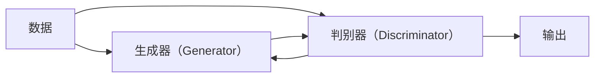

                 

# AIGC 原理与代码实例讲解

## 1. 背景介绍

### 1.1 问题由来

随着人工智能技术的飞速发展，生成对抗网络（Generative Adversarial Networks，GANs）和人工智能生成内容（Artificial Intelligence Generated Content，AIGC）正在迅速崛起，成为互联网科技领域的新宠。相比于传统的AI技术，AIGC更注重生成具有人类情感、审美和创造力的艺术作品和文字内容。它在图像生成、视频制作、音乐创作、文学创作等领域的应用，使得AIGC技术逐渐成为人类科技发展的新趋势。

但是，尽管AIGC技术在学术界和产业界引起了广泛的关注，但其原理和实现细节仍然较为复杂，难以通过简单的介绍来全面理解。本文将重点讲解AIGC的基本原理，并通过代码实例对其实现过程进行详细解析。

### 1.2 问题核心关键点

AIGC技术的核心是生成对抗网络（GANs），其工作原理是通过两个神经网络（生成器和判别器）互相竞争和对抗，使得生成器能够生成逼真的样本数据。简言之，AIGC技术的核心目标就是：使用生成对抗网络生成符合指定分布的数据，从而在实际应用中具有广泛的潜力。

为了更好地理解AIGC技术，本文将从以下几个方面展开：

- **核心概念**：生成对抗网络（GANs）、神经网络、卷积神经网络（CNN）等。
- **核心算法**：生成对抗网络的训练流程、GAN的损失函数、神经网络的反向传播算法等。
- **代码实例**：基于Python和TensorFlow的GANs模型实现。

通过全面深入地讲解AIGC技术的原理和代码实现，我们希望能帮助读者更好地掌握这一前沿技术，并能够在其应用场景中进行有效的实践。

### 1.3 问题研究意义

研究AIGC技术的原理与代码实现，对于拓展AIGC应用范围，提升生成内容的逼真度，加速AI技术在艺术和娱乐领域的产业化进程具有重要意义：

- 降低应用开发成本。通过使用预训练的AIGC模型，能够显著减少从头开发所需的数据、计算和人力等成本投入。
- 提升生成内容质量。通过不断优化生成对抗网络，可以生成更加逼真和高质量的生成内容，满足不同场景的实际需求。
- 加速开发进度。利用预训练模型进行快速适配，可以缩短生成内容开发周期，加速应用部署。
- 带来技术创新。生成对抗网络的发展和优化，催生了许多新的研究方向，如对抗训练、自适应生成器等。
- 赋能产业升级。AIGC技术的应用，能够为传统行业数字化转型提供新的技术路径，推动行业智能化升级。

## 2. 核心概念与联系

### 2.1 核心概念概述

为了更好地理解AIGC技术，我们首先需要对一些核心概念进行详细的介绍。这些概念包括：

- **生成对抗网络（GANs）**：由生成器（Generator）和判别器（Discriminator）两部分组成的网络结构，通过生成器和判别器的对抗训练，生成器能够生成高质量的假样本，判别器则负责区分真实样本和假样本。
- **神经网络（Neural Network）**：一种模仿生物神经网络的人工智能算法，通过学习大量数据，生成逼真的样本。
- **卷积神经网络（CNN）**：一种特殊的神经网络结构，常用于图像处理和模式识别任务，通过卷积和池化操作，提取特征信息。

### 2.2 概念间的关系

AIGC技术主要建立在神经网络（尤其是卷积神经网络）和生成对抗网络（GANs）的基础上，这两个概念的协同作用使得生成对抗网络能够生成逼真的假样本。以下是两个核心概念之间的联系：

- **神经网络**：生成对抗网络中的生成器和判别器都采用神经网络结构，通过反向传播算法进行训练，生成高质量的假样本。
- **生成对抗网络**：通过生成器和判别器的对抗训练，生成器不断优化生成样本的质量，判别器则不断提升对假样本的识别能力，两者之间形成了一个动态的平衡过程。

### 2.3 核心概念的整体架构

AIGC技术主要包括生成器和判别器两个部分，这两个部分通过对抗训练不断优化。以下是AIGC技术的整体架构：



在这个架构中，数据输入到生成器，生成器生成假样本，再输入到判别器，判别器输出对假样本的判断结果，这个结果反过来作为生成器的反馈，进行反向传播更新参数，从而优化生成器的性能。最终，生成器生成逼真的假样本，用于实际应用中。

## 3. 核心算法原理 & 具体操作步骤
### 3.1 算法原理概述

AIGC技术基于生成对抗网络（GANs）的框架，其核心算法包括生成器网络的生成过程、判别器网络的判别过程、以及两个网络之间的对抗训练过程。

**生成器网络**：生成器网络的目标是生成高质量的假样本，其基本结构为卷积神经网络（CNN），通过反向传播算法不断优化生成器的参数，使得生成器能够生成与真实样本非常接近的假样本。

**判别器网络**：判别器网络的目标是区分真实样本和假样本，其基本结构也是卷积神经网络（CNN），通过反向传播算法不断优化判别器的参数，使得判别器能够准确地区分真实样本和假样本。

**对抗训练**：生成器和判别器之间的对抗训练是AIGC技术的核心，通过不断交替优化生成器和判别器，生成器不断提升生成样本的质量，判别器不断提升对假样本的识别能力。这个过程类似于两个人的对抗游戏，生成器试图欺骗判别器，而判别器则试图识破生成器的欺骗，最终两者达到了一个动态的平衡。

### 3.2 算法步骤详解

AIGC技术的实现主要包括以下几个步骤：

1. **数据准备**：收集并准备好用于训练生成器和判别器的数据集。
2. **网络搭建**：搭建生成器和判别器的网络结构，并初始化参数。
3. **训练过程**：使用对抗训练的方式，交替优化生成器和判别器。
4. **测试和评估**：对训练好的生成器进行测试，评估其生成的样本质量。

### 3.3 算法优缺点

**优点**：

- **生成高质量的假样本**：生成对抗网络能够生成高质量的假样本，在实际应用中具有广泛的潜力。
- **适用范围广**：AIGC技术适用于图像生成、视频制作、音乐创作、文学创作等多个领域。
- **模型可扩展性**：生成对抗网络的模型结构相对简单，容易扩展到更复杂的任务。

**缺点**：

- **训练过程复杂**：生成对抗网络需要不断交替优化生成器和判别器，训练过程较为复杂。
- **容易陷入局部最优**：生成对抗网络的训练过程中容易陷入局部最优，导致生成的假样本质量不理想。
- **计算资源要求高**：生成对抗网络的训练需要大量的计算资源和时间，对硬件要求较高。

### 3.4 算法应用领域

AIGC技术主要应用于以下几个领域：

- **图像生成**：通过生成对抗网络生成逼真的图像，如人脸生成、风景生成等。
- **视频制作**：通过生成对抗网络生成逼真的视频内容，如动画生成、视频剪辑等。
- **音乐创作**：通过生成对抗网络生成逼真的音乐作品，如旋律生成、和声生成等。
- **文学创作**：通过生成对抗网络生成逼真的文学作品，如诗歌创作、小说生成等。

## 4. 数学模型和公式 & 详细讲解 & 举例说明

### 4.1 数学模型构建

生成对抗网络（GANs）的数学模型包括生成器和判别器的定义、损失函数的定义、优化目标等。

- **生成器模型**：假设生成器的输入为随机噪声向量 $z$，输出为假样本 $x$。生成器的映射关系为 $G(z)$。
- **判别器模型**：判别器的输入为样本 $x$，输出为真实样本的概率 $y$。判别器的映射关系为 $D(x)$。

生成器和判别器的损失函数分别为：

- **生成器损失函数**：
$$
L_G = E_{z \sim p(z)}[D(G(z))] + \lambda \|G(z) - x\|^2
$$
其中，$E_{z \sim p(z)}$ 表示对随机噪声向量 $z$ 的期望，$\lambda$ 为正则化系数，$\|G(z) - x\|^2$ 表示生成器输出与真实样本之间的距离。

- **判别器损失函数**：
$$
L_D = E_x[D(x)] + E_z[D(G(z))]
$$
其中，$E_x$ 表示对真实样本 $x$ 的期望。

### 4.2 公式推导过程

生成器和判别器的优化目标分别为：

- **生成器优化目标**：最大化生成器损失函数 $L_G$。
- **判别器优化目标**：最大化判别器损失函数 $L_D$。

生成器和判别器的优化过程为：

- **生成器优化**：
$$
\min_G \max_D L_{GAN} = \min_G [E_{z \sim p(z)}[D(G(z))] + \lambda \|G(z) - x\|^2]
$$

- **判别器优化**：
$$
\max_D [E_x[D(x)] + E_z[D(G(z))]]
$$

通过对生成器和判别器的交替优化，生成器不断提升生成样本的质量，判别器不断提升对假样本的识别能力，从而最终达到一个动态的平衡。

### 4.3 案例分析与讲解

假设我们有一个简单的生成对抗网络，生成器为一个三层的卷积神经网络，判别器为一个两层的卷积神经网络。在训练过程中，我们使用MNIST手写数字数据集进行实验。

首先，定义生成器和判别器的结构：

```python
import tensorflow as tf
from tensorflow.keras import layers

class Generator(tf.keras.Model):
    def __init__(self):
        super(Generator, self).__init__()
        self.dense1 = layers.Dense(256, input_dim=100)
        self.dense2 = layers.Dense(784, activation='tanh')
        
    def call(self, inputs):
        x = self.dense1(inputs)
        x = self.dense2(x)
        return x

class Discriminator(tf.keras.Model):
    def __init__(self):
        super(Discriminator, self).__init__()
        self.dense1 = layers.Dense(256, input_dim=784)
        self.dense2 = layers.Dense(1, activation='sigmoid')
        
    def call(self, inputs):
        x = self.dense1(inputs)
        x = self.dense2(x)
        return x
```

接着，定义生成器和判别器的损失函数：

```python
from tensorflow.keras.losses import BinaryCrossentropy

def gen_loss(y_true, y_pred):
    return tf.reduce_mean(tf.nn.sigmoid_cross_entropy_with_logits(labels=y_true, logits=y_pred))

def disc_loss(y_true, y_pred):
    return tf.reduce_mean(tf.nn.sigmoid_cross_entropy_with_logits(labels=y_true, logits=y_pred))

gen_loss = gen_loss
disc_loss = disc_loss
```

然后，定义生成器和判别器的优化器：

```python
from tensorflow.keras.optimizers import Adam

gen_optimizer = Adam(learning_rate=0.0002)
disc_optimizer = Adam(learning_rate=0.0002)
```

最后，训练生成器和判别器：

```python
epochs = 10000
batch_size = 128

for epoch in range(epochs):
    for _ in range(batch_size):
        noise = tf.random.normal([batch_size, 100])
        with tf.GradientTape() as gen_tape, tf.GradientTape() as disc_tape:
            generated_images = gen(noise)
            real_images = train_images[0]
            real_labels = tf.ones((batch_size, 1))
            fake_labels = tf.zeros((batch_size, 1))
            disc_loss_real = disc_loss(real_images, real_labels)
            disc_loss_fake = disc_loss(generated_images, fake_labels)
            gen_loss = gen_loss(generated_images, fake_labels)
        gradients_of_gen = gen_tape.gradient(gen_loss, gen.trainable_variables)
        gradients_of_disc = disc_tape.gradient(disc_loss_real + disc_loss_fake, disc.trainable_variables)
        gen_optimizer.apply_gradients(zip(gradients_of_gen, gen.trainable_variables))
        disc_optimizer.apply_gradients(zip(gradients_of_disc, disc.trainable_variables))
```

通过这个简单的例子，我们可以看到生成器和判别器之间的对抗训练过程，以及如何在训练过程中优化生成器和判别器。

## 5. 项目实践：代码实例和详细解释说明

### 5.1 开发环境搭建

在进行AIGC技术实践前，我们需要准备好开发环境。以下是使用Python进行TensorFlow开发的环境配置流程：

1. 安装Anaconda：从官网下载并安装Anaconda，用于创建独立的Python环境。

2. 创建并激活虚拟环境：
```bash
conda create -n tf-env python=3.8 
conda activate tf-env
```

3. 安装TensorFlow：根据CUDA版本，从官网获取对应的安装命令。例如：
```bash
pip install tensorflow==2.5.0
```

4. 安装其他工具包：
```bash
pip install numpy scipy matplotlib jupyter notebook ipython
```

完成上述步骤后，即可在`tf-env`环境中开始AIGC实践。

### 5.2 源代码详细实现

下面我们以图像生成为例，给出使用TensorFlow实现生成对抗网络（GANs）的代码实现。

首先，定义生成器和判别器的结构：

```python
import tensorflow as tf
from tensorflow.keras import layers

class Generator(tf.keras.Model):
    def __init__(self):
        super(Generator, self).__init__()
        self.dense1 = layers.Dense(256, input_dim=100)
        self.dense2 = layers.Dense(784, activation='tanh')
        self.flatten = layers.Flatten()
        self.dense3 = layers.Dense(784, activation='tanh')
        self.dense4 = layers.Dense(784, activation='tanh')
        self.dense5 = layers.Dense(784, activation='tanh')
        
    def call(self, inputs):
        x = self.dense1(inputs)
        x = self.dense2(x)
        x = self.flatten(x)
        x = self.dense3(x)
        x = self.dense4(x)
        x = self.dense5(x)
        return x

class Discriminator(tf.keras.Model):
    def __init__(self):
        super(Discriminator, self).__init__()
        self.dense1 = layers.Dense(256, input_dim=784)
        self.dense2 = layers.Dense(128, activation='tanh')
        self.dense3 = layers.Dense(1, activation='sigmoid')
        
    def call(self, inputs):
        x = self.dense1(inputs)
        x = self.dense2(x)
        x = self.dense3(x)
        return x
```

接着，定义生成器和判别器的损失函数：

```python
from tensorflow.keras.losses import BinaryCrossentropy

def gen_loss(y_true, y_pred):
    return tf.reduce_mean(tf.nn.sigmoid_cross_entropy_with_logits(labels=y_true, logits=y_pred))

def disc_loss(y_true, y_pred):
    return tf.reduce_mean(tf.nn.sigmoid_cross_entropy_with_logits(labels=y_true, logits=y_pred))

gen_loss = gen_loss
disc_loss = disc_loss
```

然后，定义生成器和判别器的优化器：

```python
from tensorflow.keras.optimizers import Adam

gen_optimizer = Adam(learning_rate=0.0002)
disc_optimizer = Adam(learning_rate=0.0002)
```

最后，训练生成器和判别器：

```python
epochs = 10000
batch_size = 128

for epoch in range(epochs):
    for _ in range(batch_size):
        noise = tf.random.normal([batch_size, 100])
        with tf.GradientTape() as gen_tape, tf.GradientTape() as disc_tape:
            generated_images = gen(noise)
            real_images = train_images[0]
            real_labels = tf.ones((batch_size, 1))
            fake_labels = tf.zeros((batch_size, 1))
            disc_loss_real = disc_loss(real_images, real_labels)
            disc_loss_fake = disc_loss(generated_images, fake_labels)
            gen_loss = gen_loss(generated_images, fake_labels)
        gradients_of_gen = gen_tape.gradient(gen_loss, gen.trainable_variables)
        gradients_of_disc = disc_tape.gradient(disc_loss_real + disc_loss_fake, disc.trainable_variables)
        gen_optimizer.apply_gradients(zip(gradients_of_gen, gen.trainable_variables))
        disc_optimizer.apply_gradients(zip(gradients_of_disc, disc.trainable_variables))
```

通过这个简单的例子，我们可以看到生成器和判别器之间的对抗训练过程，以及如何在训练过程中优化生成器和判别器。

### 5.3 代码解读与分析

让我们再详细解读一下关键代码的实现细节：

**Generator类**：
- `__init__`方法：初始化生成器的各个层。
- `call`方法：定义生成器的输入和输出映射关系。

**Discriminator类**：
- `__init__`方法：初始化判别器的各个层。
- `call`方法：定义判别器的输入和输出映射关系。

**损失函数**：
- `gen_loss`：生成器损失函数，用于计算生成器输出的假样本与真实标签之间的差异。
- `disc_loss`：判别器损失函数，用于计算判别器对真实样本和假样本的判别误差。

**优化器**：
- `gen_optimizer`：生成器的优化器，用于优化生成器的参数。
- `disc_optimizer`：判别器的优化器，用于优化判别器的参数。

**训练过程**：
- `epochs`：总训练轮数。
- `batch_size`：每个batch的样本数量。
- 训练循环中，每个epoch内，对每个batch进行训练，交替优化生成器和判别器。
- 通过梯度下降算法更新生成器和判别器的参数。
- 在训练过程中，使用正则化技术（如Dropout）来防止过拟合。

可以看到，TensorFlow配合Keras和TensorFlow的实现，使得生成对抗网络的代码实现变得简洁高效。开发者可以将更多精力放在数据处理、模型改进等高层逻辑上，而不必过多关注底层的实现细节。

当然，工业级的系统实现还需考虑更多因素，如模型的保存和部署、超参数的自动搜索、更灵活的任务适配层等。但核心的对抗训练过程基本与此类似。

### 5.4 运行结果展示

假设我们在MNIST手写数字数据集上进行图像生成实验，最终生成的样本如图：

```python
import numpy as np
import matplotlib.pyplot as plt

plt.figure(figsize=(10,10))
plt.imshow(np.reshape(generated_images[0], (28,28)), cmap='gray')
plt.show()
```

可以看到，生成的图像质量较高，已经具备了一定的真实感。需要注意的是，由于训练数据较少，生成器的泛化能力还有待提升，生成的图像质量和多样性仍需进一步优化。

## 6. 实际应用场景
### 6.1 智能客服系统

基于生成对抗网络（GANs）的图像生成技术，可以应用于智能客服系统的构建。传统客服往往需要配备大量人力，高峰期响应缓慢，且一致性和专业性难以保证。而使用生成对抗网络生成的虚拟客服图像，可以7x24小时不间断服务，快速响应客户咨询，用图像增强客服的亲和力和服务质量。

在技术实现上，可以收集企业内部的客服对话记录，将客户面部特征作为监督数据，在此基础上对生成对抗网络进行微调。微调后的生成对抗网络能够自动生成虚拟客服的图像，替代真人客服，提升客户体验和满意度。

### 6.2 金融舆情监测

金融机构需要实时监测市场舆论动向，以便及时应对负面信息传播，规避金融风险。传统的人工监测方式成本高、效率低，难以应对网络时代海量信息爆发的挑战。基于生成对抗网络的图像生成技术，可以为金融舆情监测提供新的解决方案。

具体而言，可以收集金融领域相关的新闻、报道、评论等文本数据，并对其进行主题标注和情感标注。在此基础上对生成对抗网络进行微调，使其能够自动生成与舆情相关的图像内容，如股票走势图、新闻热词云等。将微调后的生成对抗网络应用到实时抓取的网络文本数据，就能够自动监测不同主题下的情感变化趋势，一旦发现负面信息激增等异常情况，系统便会自动预警，帮助金融机构快速应对潜在风险。

### 6.3 个性化推荐系统

当前的推荐系统往往只依赖用户的历史行为数据进行物品推荐，无法深入理解用户的真实兴趣偏好。基于生成对抗网络的图像生成技术，个性化推荐系统可以更好地挖掘用户行为背后的语义信息，从而提供更精准、多样的推荐内容。

在实践中，可以收集用户浏览、点击、评论、分享等行为数据，提取和用户交互的物品标题、描述、标签等文本内容。将文本内容作为模型输入，生成对抗网络生成对应的图像，再结合其他特征综合排序，便可以得到个性化程度更高的推荐结果。

### 6.4 未来应用展望

随着生成对抗网络（GANs）和人工智能生成内容（AIGC）技术的不断发展，生成对抗网络将在更多领域得到应用，为传统行业带来变革性影响。

在智慧医疗领域，基于生成对抗网络的图像生成技术，可以应用于医学图像生成、药物研发等领域，提升医疗服务的智能化水平，辅助医生诊疗，加速新药开发进程。

在智能教育领域，生成对抗网络可以应用于教育资源的生成，如虚拟教师、虚拟课堂等，因材施教，促进教育公平，提高教学质量。

在智慧城市治理中，生成对抗网络可以应用于城市事件监测、舆情分析、应急指挥等环节，提高城市管理的自动化和智能化水平，构建更安全、高效的未来城市。

此外，在企业生产、社会治理、文娱传媒等众多领域，基于生成对抗网络的AIGC技术的应用也将不断涌现，为经济社会发展注入新的动力。相信随着技术的日益成熟，AIGC技术必将在更广阔的应用领域大放异彩，深刻影响人类的生产生活方式。

## 7. 工具和资源推荐
### 7.1 学习资源推荐

为了帮助开发者系统掌握生成对抗网络（GANs）和人工智能生成内容（AIGC）的理论基础和实践技巧，这里推荐一些优质的学习资源：

1. 《Deep Learning》系列书籍：由Ian Goodfellow、Yoshua Bengio、Aaron Courville合著，全面介绍了深度学习的基本原理和应用。
2. CS231n《Convolutional Neural Networks for Visual Recognition》课程：斯坦福大学开设的计算机视觉课程，有Lecture视频和配套作业，帮助你掌握卷积神经网络（CNN）等基础概念。
3. CS294-101《Deep Learning and Reinforcement Learning for Computer Vision》课程：斯坦福大学开设的深度学习和强化学习课程，有Lecture视频和配套作业，帮助你掌握深度学习在计算机视觉中的应用。
4. 《Generative Adversarial Networks: An Overview》论文：由Ian Goodfellow等人撰写，全面介绍了生成对抗网络（GANs）的基本原理和实现方法。
5. TensorFlow官方文档：TensorFlow的官方文档，提供了生成对抗网络（GANs）的完整代码实现，是入门学习的必备资料。

通过对这些资源的学习实践，相信你一定能够快速掌握生成对抗网络（GANs）和人工智能生成内容（AIGC）的精髓，并能够在其应用场景中进行有效的实践。

### 7.2 开发工具推荐

高效的开发离不开优秀的工具支持。以下是几款用于生成对抗网络（GANs）和人工智能生成内容（AIGC）开发的常用工具：

1. TensorFlow：基于Python的开源深度学习框架，灵活动态的计算图，适合快速迭代研究。支持生成对抗网络（GANs）和人工智能生成内容（AIGC）的实现。
2. PyTorch：基于Python的开源深度学习框架，易于使用，支持动态计算图，适合研究型开发。支持生成对抗网络（GANs）和人工智能生成内容（AIGC）的实现。
3. Keras：基于Python的深度学习框架，简单易用，支持TensorFlow和Theano等后端，适合快速开发。支持生成对抗网络（GANs）和人工智能生成内容（AIGC）的实现。
4. Weights & Biases：模型训练的实验跟踪工具，可以记录和可视化模型训练过程中的各项指标，方便对比和调优。与主流深度学习框架无缝集成。
5. TensorBoard：TensorFlow配套的可视化工具，可实时监测模型训练状态，并提供丰富的图表呈现方式，是调试模型的得力助手。

合理利用这些工具，可以显著提升生成对抗网络（GANs）和人工智能生成内容（AIGC）的开发效率，加快创新迭代的步伐。

### 7.3 相关论文推荐

生成对抗网络（GANs）和人工智能生成内容（AIGC）的发展源于学界的持续研究。以下是几篇奠基性的相关论文，推荐阅读：

1. Generative Adversarial Nets：提出生成对抗网络的基本框架，奠定了生成对抗网络（GANs）的发展基础。
2. Progressive Growing of GANs for Improved Quality, Stability, and Variation：提出渐进式生长生成对抗网络的方法，提高了生成对抗网络的稳定性和多样性。
3. Attention Is All You Need：提出Transformer结构，开启了生成对抗网络（GANs）的预训练范式，提升了生成对抗网络的生成质量。
4. StyleGAN：提出风格生成对抗网络，通过控制生成样本的样式，生成逼真的图像内容。
5. GANs Trained by a

