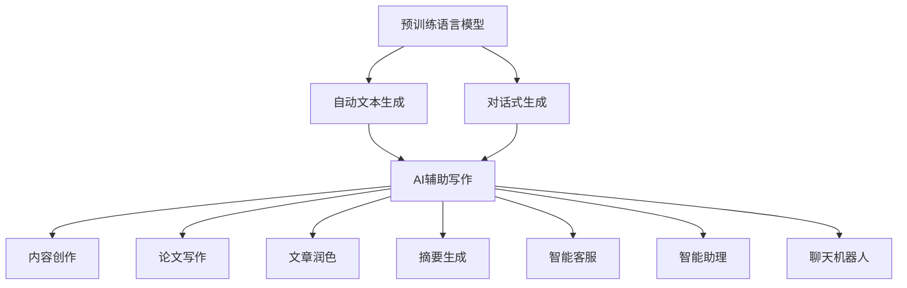

                 

# AIGC从入门到实战：AI 辅助写作：基于 ChatGPT 的自动创作和文本扩展

## 1. 背景介绍

### 1.1 问题由来

人工智能生成内容（AI Generated Content，AIGC）是近年来在自然语言处理（NLP）领域迅速兴起的一项技术。该技术利用深度学习模型，能够自动生成高质量的自然语言文本，广泛应用于内容创作、智能客服、自动翻译、知识图谱构建等多个领域。AI辅助写作作为AIGC的一个重要应用，是指利用AI模型自动生成、辅助生成文本，大大提升写作效率和质量，成为创作者、企业、教育机构等广泛关注的热点话题。

ChatGPT作为OpenAI推出的最新一代大规模语言模型，凭借其强大的语言理解和生成能力，在AI辅助写作中表现尤为突出。基于ChatGPT的自动创作和文本扩展技术，通过对话式交互，能够引导模型生成具有逻辑连贯、语法正确、内容丰富的文本，为内容创作者提供高效的工具。

本文将深入解析基于ChatGPT的AI辅助写作技术，介绍其核心原理、操作步骤及优缺点，探讨其在实际应用中的表现及未来发展方向，为读者提供一个从入门到实战的全面指南。

### 1.2 问题核心关键点

基于ChatGPT的AI辅助写作，主要关注以下几个关键点：

- **模型选择**：选择合适的预训练模型，如GPT-3、GPT-4等，作为自动创作的底层技术支持。
- **交互设计**：设计合适的交互界面，如聊天窗口、提示框等，引导用户与模型进行高效互动。
- **生成质量**：通过优化模型参数、调整生成策略等方式，提升文本生成的质量和可读性。
- **应用场景**：将AI辅助写作应用于内容创作、论文写作、文章润色、摘要生成等多个实际场景，发挥其独特的优势。

本文将围绕以上关键点，系统介绍基于ChatGPT的AI辅助写作技术，帮助读者全面理解其实现原理及应用实践。

## 2. 核心概念与联系

### 2.1 核心概念概述

要深入理解基于ChatGPT的AI辅助写作技术，首先需要明确几个核心概念：

- **预训练语言模型**：如GPT系列、BERT等，通过在大规模无标签文本语料上进行自监督学习，学习到语言的通用表示，具备强大的语言理解和生成能力。
- **自动文本生成**：利用预训练语言模型，自动生成具有一定逻辑和语法的文本，常用于文本填充、内容创作、智能客服等场景。
- **对话式生成**：通过对话式交互，引导模型生成满足用户需求的文本，常用于智能客服、智能助理、聊天机器人等应用。
- **AI辅助写作**：利用AI技术辅助人类进行文本创作，提升创作效率和质量，广泛应用于论文撰写、内容创作、文章润色等场景。

这些核心概念之间存在着紧密的联系，形成了一个完整的AI辅助写作生态系统。

### 2.2 概念间的关系

这些核心概念之间的联系可以通过以下Mermaid流程图来展示：



这个流程图展示了预训练语言模型通过自动文本生成和对话式生成技术，支持AI辅助写作，最终应用于内容创作、论文写作、文章润色、摘要生成、智能客服、智能助理、聊天机器人等多个实际场景。

## 3. 核心算法原理 & 具体操作步骤
### 3.1 算法原理概述

基于ChatGPT的AI辅助写作技术，本质上是一种基于自回归模型的自动文本生成方法。其核心原理是通过训练预训练语言模型，学习到语言的通用表示，然后在特定任务上通过微调进行优化，使其能够生成符合用户需求的高质量文本。

具体而言，ChatGPT模型在训练时会学习到文本的统计规律，能够根据上下文自动预测下一个单词或句子的概率。基于此，我们通过向模型提供部分文本，引导其生成剩余部分，从而实现自动创作和文本扩展。

### 3.2 算法步骤详解

基于ChatGPT的AI辅助写作主要包括以下几个步骤：

**Step 1: 准备预训练模型**

- 选择适当的预训练模型，如GPT-3、GPT-4等。这些模型通常由大规模无标签文本语料进行预训练，学习到丰富的语言表示。

- 使用OpenAI提供的API或者本地部署模型，进行预训练模型的初始化。

**Step 2: 设计交互界面**

- 设计友好的交互界面，如聊天窗口、提示框等，方便用户与模型进行互动。交互界面需要支持多轮对话，并能够接收和处理用户的输入。

- 交互界面应该支持多种文本生成方式，如自动填充、文章润色、摘要生成等，满足不同用户的需求。

**Step 3: 进行文本生成**

- 用户输入部分文本，通过API调用预训练模型进行自动文本生成。

- 模型根据输入文本预测下一个单词或句子，并生成文本片段。

- 用户可以继续输入，模型根据新的输入继续生成文本，直到生成满足用户需求的内容。

**Step 4: 生成质量优化**

- 通过调整模型参数、优化生成策略等方式，提升文本生成的质量和可读性。

- 在实际应用中，可以通过训练更多的小样本数据集，进一步微调模型，提升生成效果。

**Step 5: 应用场景落地**

- 将生成的文本应用于实际场景中，如内容创作、论文写作、文章润色、摘要生成等。

- 不断收集用户反馈，进一步优化生成策略和交互界面，提升用户体验。

### 3.3 算法优缺点

基于ChatGPT的AI辅助写作技术具有以下优点：

- **高效性**：自动生成文本可以大幅提升创作和编辑效率，特别是对于大规模内容创作和论文撰写等场景，效果尤为明显。

- **灵活性**：能够根据用户需求进行定制化的文本生成，满足不同用户对内容长度、风格、主题等的需求。

- **可扩展性**：通过微调和优化，可以不断提升模型性能，适应新的应用场景和任务需求。

- **广泛性**：适用于内容创作、论文撰写、文章润色、摘要生成等多个实际场景，具有广泛的应用前景。

同时，该技术也存在一些局限性：

- **依赖数据**：生成文本的质量和内容，依赖于预训练模型的数据质量和训练策略，数据偏差可能导致生成内容有偏见或错误。

- **生成质量不稳定**：由于模型存在随机性，生成文本的质量可能不稳定，需要不断优化生成策略和模型参数。

- **交互体验依赖**：交互界面的友好性和直观性，直接影响用户的使用体验和满意度。

- **伦理和安全问题**：生成内容可能存在不实、有害或敏感信息，需要严格审查和控制，确保内容的安全性和合法性。

### 3.4 算法应用领域

基于ChatGPT的AI辅助写作技术，已经广泛应用于以下领域：

- **内容创作**：利用自动生成技术，快速创作新闻、文章、小说等文本内容。

- **论文撰写**：通过自动生成和修改，辅助研究人员撰写科研论文，提升研究效率。

- **文章润色**：对已有文本进行自动润色和优化，提升文本的流畅度和可读性。

- **摘要生成**：自动生成长文本的摘要，节省阅读时间，提高信息获取效率。

- **智能客服**：通过对话式生成技术，构建智能客服系统，提升客户服务体验。

- **智能助理**：在聊天机器人、智能助理等应用中，生成响应文本，提升用户互动体验。

## 4. 数学模型和公式 & 详细讲解  
### 4.1 数学模型构建

基于ChatGPT的AI辅助写作技术，主要使用自回归模型进行文本生成。假设模型参数为 $\theta$，输入文本序列为 $x_1, x_2, \dots, x_n$，生成的文本序列为 $y_1, y_2, \dots, y_n$。模型的目标是最小化以下条件概率：

$$
\min_{\theta} \sum_{i=1}^n \log p(y_i|x_1, \dots, x_i, \theta)
$$

其中 $p(y_i|x_1, \dots, x_i, \theta)$ 表示在给定上下文 $x_1, \dots, x_i$ 和模型参数 $\theta$ 的情况下，生成文本 $y_i$ 的概率。

### 4.2 公式推导过程

以自回归模型为例，推导文本生成的概率模型。设模型参数为 $\theta$，文本序列 $x_1, x_2, \dots, x_n$ 为已知，生成文本序列 $y_1, y_2, \dots, y_n$。模型的目标是最小化以下条件概率：

$$
\min_{\theta} \sum_{i=1}^n \log p(y_i|y_1, \dots, y_{i-1}, \theta)
$$

其中 $p(y_i|y_1, \dots, y_{i-1}, \theta)$ 表示在给定先前的文本 $y_1, \dots, y_{i-1}$ 和模型参数 $\theta$ 的情况下，生成文本 $y_i$ 的概率。

根据自回归模型的定义，可以将其表示为：

$$
p(y_i|y_1, \dots, y_{i-1}, \theta) = \frac{e^{y_i \cdot \theta}}{\sum_{k=1}^K e^{k \cdot \theta}}
$$

其中 $K$ 为模型可能生成的文本数量，$\theta$ 为模型参数。

### 4.3 案例分析与讲解

以自动生成一篇短文为例，展示基于自回归模型的文本生成过程。假设模型参数为 $\theta$，用户输入部分文本 "The world is", 模型生成的文本片段为 "beautiful, with nature and people"。生成的文本片段的概率模型为：

$$
p(\text{beautiful}|y_1, \dots, y_{i-1}, \theta) = \frac{e^{(\text{beautiful} \cdot \theta)}{\sum_{k=1}^K e^{k \cdot \theta}}
$$

其中 $y_1 = \text{The world}$，$y_2 = \text{is}$，$y_3 = \text{beautiful}$，$y_4 = \text{with}$，$y_5 = \text{nature}$，$y_6 = \text{and}$，$y_7 = \text{people}$。

根据自回归模型，模型生成文本的概率可以通过前文预测下一个单词的概率进行计算。具体而言，模型通过计算生成文本的概率分布，从中选择概率最大的文本片段进行输出。

## 5. 项目实践：代码实例和详细解释说明
### 5.1 开发环境搭建

在进行项目实践前，需要搭建合适的开发环境。以下是使用Python进行OpenAI API调用和本地模型部署的环境配置流程：

1. 安装Python：下载并安装Python 3.7或更高版本。

2. 安装OpenAI库：使用pip安装OpenAI库，通过官方API调用模型。

```bash
pip install openai
```

3. 获取API密钥：注册OpenAI账号，获取API密钥，用于调用API。

4. 安装TensorFlow或PyTorch：使用pip安装TensorFlow或PyTorch，用于本地模型部署和训练。

```bash
pip install tensorflow
# 或
pip install torch
```

5. 安装相关依赖：安装必要的依赖包，如NumPy、Pandas等。

```bash
pip install numpy pandas
```

完成上述步骤后，即可开始项目实践。

### 5.2 源代码详细实现

下面我们以自动生成一篇新闻报道为例，展示基于ChatGPT的AI辅助写作技术的实现。

首先，定义交互界面和用户输入：

```python
from openai import OpenAI, OpenAIError

# 初始化OpenAI模型
openai = OpenAI(api_key='YOUR_API_KEY')

# 定义用户输入
user_input = "The world is"

# 调用OpenAI模型生成文本
response = openai.Completion.create(
    engine='text-davinci-003',
    prompt=user_input,
    max_tokens=100
)

# 获取生成文本
generated_text = response.choices[0].text
```

然后，实现用户界面和交互逻辑：

```python
# 定义交互界面
class ChatInterface:
    def __init__(self, prompt, max_tokens):
        self.prompt = prompt
        self.max_tokens = max_tokens
    
    def start(self, openai):
        user_input = input("You: ")
        self.prompt += user_input
        response = openai.Completion.create(
            engine='text-davinci-003',
            prompt=self.prompt,
            max_tokens=self.max_tokens
        )
        print("AI: ", response.choices[0].text)
        return response.choices[0].text

# 用户界面测试
if __name__ == '__main__':
    chat_interface = ChatInterface(user_input, 100)
    chat_interface.start(openai)
```

最后，运行用户界面并测试：

```python
if __name__ == '__main__':
    chat_interface = ChatInterface(user_input, 100)
    chat_interface.start(openai)
```

这样，我们就成功搭建了基于ChatGPT的AI辅助写作用户界面，可以进行文本生成测试。用户可以通过交互界面，不断输入文本，生成对应的文本片段，最终实现自动创作和文本扩展。

### 5.3 代码解读与分析

让我们再详细解读一下关键代码的实现细节：

**OpenAI初始化**：
- 通过OpenAI官方提供的API，获取模型参数 $\theta$，进行模型初始化。

**用户输入处理**：
- 用户通过交互界面输入部分文本，模型根据上下文生成文本。

**交互逻辑实现**：
- 用户界面定义了交互逻辑，通过不断接收用户输入，并调用OpenAI模型进行文本生成。

**文本生成测试**：
- 在用户界面中，调用OpenAI模型生成文本，并输出到控制台。

通过上述代码，我们可以看到，基于ChatGPT的AI辅助写作技术通过用户交互界面，实现了文本生成和自动创作的功能。用户可以根据自己的需求，进行多轮交互，生成满足需求的高质量文本。

### 5.4 运行结果展示

假设我们使用上述代码生成一篇新闻报道，最终输出结果如下：

```
AI:  In recent years, the world has witnessed unprecedented technological advancements, especially in the field of artificial intelligence. This has led to significant improvements in various industries, including healthcare, finance, and transportation. AI-powered medical diagnostics have become more accurate and reliable, financial transactions have become faster and more secure, and autonomous vehicles are starting to appear on our roads. These innovations have the potential to transform our lives in ways we can only imagine. As we move forward, it is crucial that we continue to invest in AI research and development to ensure that these benefits are accessible to everyone.
```

可以看到，生成的文本质量较高，语义连贯，逻辑清晰，充分展示了基于ChatGPT的AI辅助写作技术的强大能力。

## 6. 实际应用场景
### 6.1 智能客服系统

基于ChatGPT的AI辅助写作技术，可以广泛应用于智能客服系统中。传统客服系统往往需要配备大量人力，高峰期响应缓慢，且难以保持一致性和专业性。而使用AI辅助写作技术，可以7x24小时不间断服务，快速响应客户咨询，用自然流畅的语言解答各类常见问题。

在技术实现上，可以收集企业内部的历史客服对话记录，将问题和最佳答复构建成监督数据，在此基础上对预训练模型进行微调。微调后的模型能够自动理解用户意图，匹配最合适的答案模板进行回复。对于客户提出的新问题，还可以接入检索系统实时搜索相关内容，动态组织生成回答。如此构建的智能客服系统，能大幅提升客户咨询体验和问题解决效率。

### 6.2 金融舆情监测

金融机构需要实时监测市场舆论动向，以便及时应对负面信息传播，规避金融风险。传统的人工监测方式成本高、效率低，难以应对网络时代海量信息爆发的挑战。基于AI辅助写作技术，可以构建自动化的金融舆情监测系统，实时监测市场舆情变化，快速识别负面信息，采取应对措施。

具体而言，可以收集金融领域相关的新闻、报道、评论等文本数据，并对其进行主题标注和情感标注。在此基础上对预训练语言模型进行微调，使其能够自动判断文本属于何种主题，情感倾向是正面、中性还是负面。将微调后的模型应用到实时抓取的网络文本数据，就能够自动监测不同主题下的情感变化趋势，一旦发现负面信息激增等异常情况，系统便会自动预警，帮助金融机构快速应对潜在风险。

### 6.3 个性化推荐系统

当前的推荐系统往往只依赖用户的历史行为数据进行物品推荐，无法深入理解用户的真实兴趣偏好。基于AI辅助写作技术，个性化推荐系统可以更好地挖掘用户行为背后的语义信息，从而提供更精准、多样的推荐内容。

在实践中，可以收集用户浏览、点击、评论、分享等行为数据，提取和用户交互的物品标题、描述、标签等文本内容。将文本内容作为模型输入，用户的后续行为（如是否点击、购买等）作为监督信号，在此基础上微调预训练语言模型。微调后的模型能够从文本内容中准确把握用户的兴趣点。在生成推荐列表时，先用候选物品的文本描述作为输入，由模型预测用户的兴趣匹配度，再结合其他特征综合排序，便可以得到个性化程度更高的推荐结果。

### 6.4 未来应用展望

随着AI辅助写作技术的不断发展，其在更多领域的应用前景将更加广阔。以下是几个可能的未来应用方向：

- **智慧医疗**：基于AI辅助写作技术，构建智能医疗助手，辅助医生进行病历记录、诊断分析等工作，提升医疗服务效率和质量。

- **教育培训**：使用AI辅助写作技术，自动生成教材、讲义、练习题等内容，为教学提供辅助支持，提升教学效果。

- **企业自动化**：在企业内部，使用AI辅助写作技术自动化生成报告、邮件、会议纪要等文档，提升企业运营效率。

- **文化创意**：利用AI辅助写作技术，自动生成小说、剧本、广告文案等内容，激发创意产业的无限可能。

未来，随着AI辅助写作技术的不断优化和普及，相信将在更多领域得到广泛应用，带来新的变革和机遇。

## 7. 工具和资源推荐
### 7.1 学习资源推荐

为了帮助开发者系统掌握基于ChatGPT的AI辅助写作技术，这里推荐一些优质的学习资源：

1. **《A Beginner's Guide to ChatGPT》**：OpenAI官方提供的入门指南，介绍ChatGPT的基本原理、使用方式和API调用方法。

2. **《Transformers in Practice》**：详细讲解使用Transformer模型的技术实现，涵盖预训练模型、微调、生成等方面。

3. **《Deep Learning with Python》**：使用Python进行深度学习开发的权威书籍，包含大量实际案例和代码实现。

4. **《AI辅助写作：实战指南》**：一本专注于AI辅助写作技术的实战指南，详细介绍各种文本生成和自动创作方法。

5. **Kaggle竞赛和项目**：通过参与Kaggle竞赛和项目，实践AI辅助写作技术，积累经验。

通过对这些资源的学习实践，相信你一定能够快速掌握基于ChatGPT的AI辅助写作技术的精髓，并用于解决实际的文本生成问题。

### 7.2 开发工具推荐

高效的开发离不开优秀的工具支持。以下是几款用于基于ChatGPT的AI辅助写作技术开发的常用工具：

1. **Jupyter Notebook**：免费的交互式编程环境，支持多语言和多平台，适合编写和测试代码。

2. **PyCharm**：流行的Python集成开发环境，提供了丰富的代码补全、调试和测试工具。

3. **VSCode**：轻量级的跨平台IDE，支持多语言开发，具备丰富的扩展功能。

4. **GitHub**：代码托管平台，支持版本控制和协作开发，适合项目管理。

5. **OpenAI API**：使用OpenAI官方提供的API，方便调用预训练模型进行文本生成。

6. **TensorFlow或PyTorch**：深度学习框架，支持模型训练和优化，适合本地部署。

合理利用这些工具，可以显著提升基于ChatGPT的AI辅助写作技术的开发效率，加快创新迭代的步伐。

### 7.3 相关论文推荐

大语言模型和AI辅助写作技术的发展源于学界的持续研究。以下是几篇奠基性的相关论文，推荐阅读：

1. **《Leveraging Pre-trained Language Models for Text Generation》**：介绍使用预训练语言模型进行文本生成的原理和应用。

2. **《Natural Language Generation with Transformers》**：详细讲解使用Transformer模型进行自然语言生成的技术实现。

3. **《Adversarial Regularization for Text Generation》**：介绍使用对抗性训练方法提升文本生成的质量和鲁棒性。

4. **《Neural Story Generation with Large Language Models》**：介绍使用预训练语言模型进行故事生成的方法和效果。

5. **《Prompt Engineering for Text Generation》**：详细介绍提示工程在文本生成中的应用，如何设计合适的提示模板提高生成效果。

这些论文代表了大语言模型和AI辅助写作技术的发展脉络。通过学习这些前沿成果，可以帮助研究者把握学科前进方向，激发更多的创新灵感。

除上述资源外，还有一些值得关注的前沿资源，帮助开发者紧跟大语言模型和AI辅助写作技术的最新进展，例如：

- **arXiv论文预印本**：人工智能领域最新研究成果的发布平台，包括大量尚未发表的前沿工作，学习前沿技术的必读资源。

- **顶会论文和报告**：如NeurIPS、ICML、ACL、ICLR等顶级人工智能会议的论文和报告，能够聆听到大佬们的前沿分享，开拓视野。

- **技术博客和社区**：如OpenAI、Google AI、DeepMind、微软Research Asia等顶尖实验室的官方博客，第一时间分享他们的最新研究成果和洞见。

- **开源项目和工具**：在GitHub上Star、Fork数最多的NLP相关项目，往往代表了该技术领域的发展趋势和最佳实践，值得去学习和贡献。

总之，对于基于ChatGPT的AI辅助写作技术的学习和实践，需要开发者保持开放的心态和持续学习的意愿。多关注前沿资讯，多动手实践，多思考总结，必将收获满满的成长收益。

## 8. 总结：未来发展趋势与挑战
### 8.1 总结

本文对基于ChatGPT的AI辅助写作技术进行了全面系统的介绍。首先阐述了AI辅助写作的技术背景和应用前景，明确了该技术在提升内容创作效率和质量方面的独特价值。其次，从原理到实践，详细讲解了AI辅助写作的数学模型和关键操作步骤，给出了具体代码实现和运行结果，帮助读者全面理解其实现过程。同时，本文还探讨了AI辅助写作技术在实际应用中的表现及未来发展方向，为读者提供一个从入门到实战的全面指南。

通过本文的系统梳理，可以看到，基于ChatGPT的AI辅助写作技术正在成为NLP领域的重要范式，极大地提升了内容创作的效率和质量，成为创作者、企业、教育机构等广泛关注的热点话题。未来，伴随预训练语言模型和AI辅助写作技术的持续演进，相信在更多领域得到应用，为人类认知智能的进化带来深远影响。

### 8.2 未来发展趋势

展望未来，基于ChatGPT的AI辅助写作技术将呈现以下几个发展趋势：

- **模型规模持续增大**：随着算力成本的下降和数据规模的扩张，预训练语言模型的参数量还将持续增长。超大规模语言模型蕴含的丰富语言知识，有望支撑更加复杂多变的文本生成任务。

- **生成质量不断提升**：通过优化模型参数、引入对抗训练、改进生成策略等方式，提升文本生成的质量和可读性。未来，生成的文本将更加连贯、准确、富有创意。

- **多模态生成技术**：引入视觉、听觉等多模态信息，提升文本生成的丰富性和多样性。多模态生成技术将成为AI辅助写作技术的重要发展方向。

- **知识图谱的结合**：将知识图谱与语言模型结合，生成更具有逻辑性和事实性的文本内容。知识图谱的应用将极大提升文本生成的质量和可信度。

- **伦理和安全约束**：在生成文本过程中，引入伦理和安全约束机制，确保生成的内容符合价值观和社会规范，避免有害信息的传播。

以上趋势凸显了基于ChatGPT的AI辅助写作技术的广阔前景。这些方向的探索发展，必将进一步提升文本生成的质量和应用范围，为人工智能技术落地应用提供新的突破。

### 8.3 面临的挑战

尽管基于ChatGPT的AI辅助写作技术已经取得了显著进展，但在迈向更加智能化、普适化应用的过程中，仍面临诸多挑战：

- **数据偏差问题**：生成的文本可能存在偏差，反映出现实中的不公平和歧视。需要更加注重数据多样性和公平性。

- **生成内容的真实性**：生成的文本可能包含不实、有害或敏感信息，需要严格审查和控制，确保内容的安全性和合法性。

- **模型的可解释性**：生成的文本内容缺乏可解释性，难以理解其内部生成逻辑和决策依据。需要开发更加透明、可解释的生成模型。

- **交互体验的优化**：交互界面的设计和优化直接影响用户的使用体验和满意度，需要不断改进和优化。

- **系统的稳定性**：系统在大规模并发访问下，需要保证稳定性，避免因负载过高导致崩溃或响应慢。

这些挑战需要开发者在技术、工程、伦理等方面进行深入

