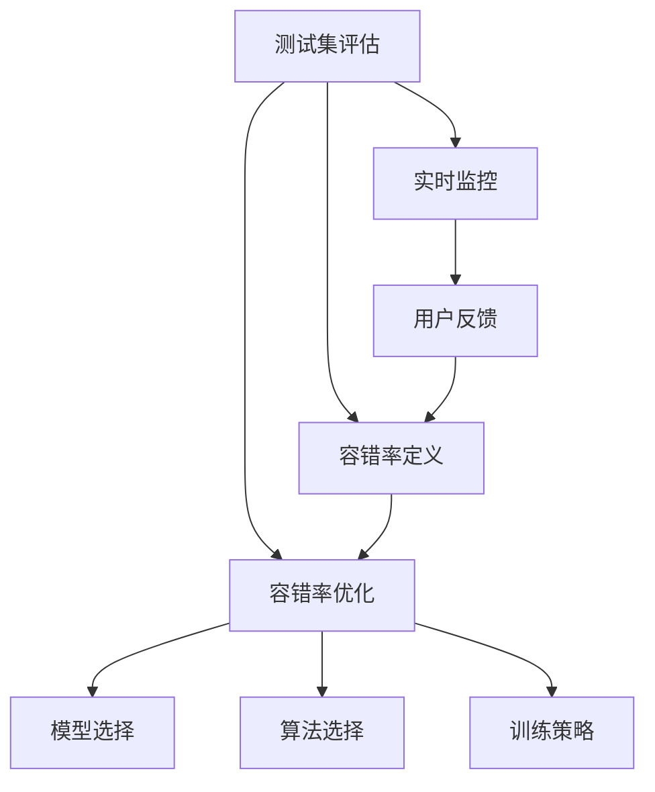
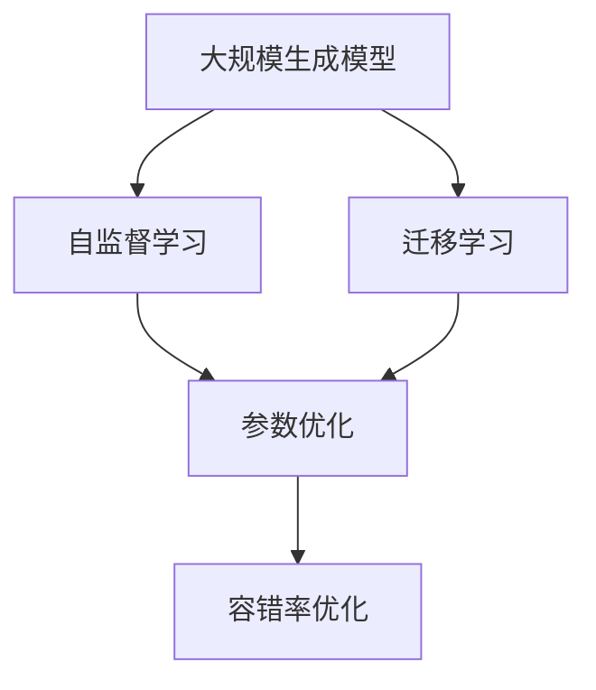
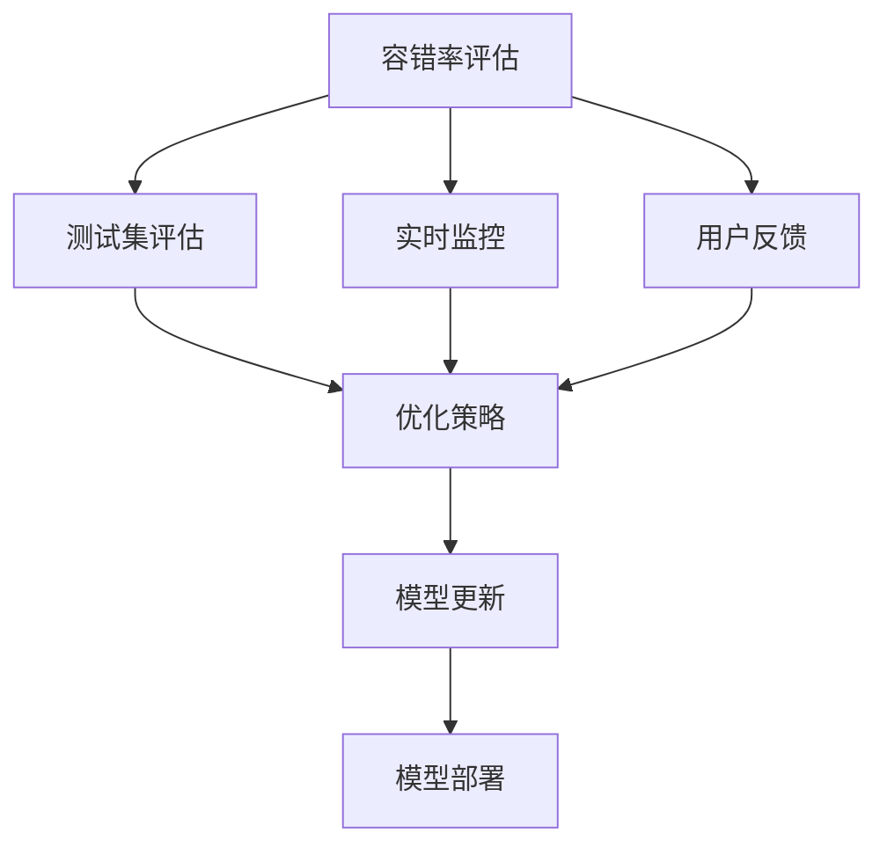
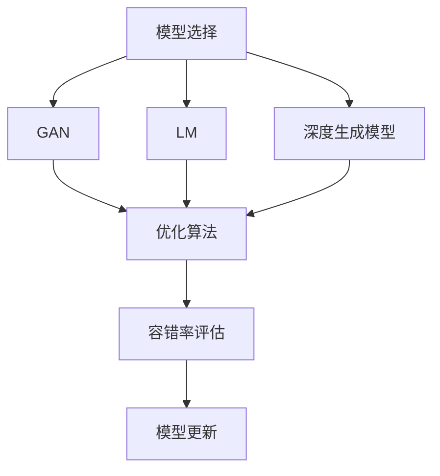
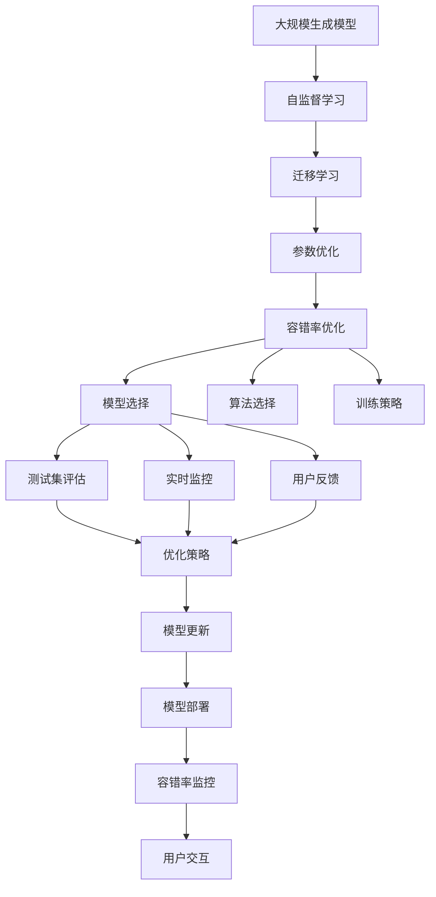

                 

# AIGC从入门到实战：根据容错率来确定职业路径

在人工智能（AI）和大规模生成模型（AIGC）迅猛发展的当下，越来越多的企业和开发者正在利用这些技术提升其业务性能，优化用户体验，并在竞争激烈的市场中占据一席之地。然而，与所有技术一样，AIGC技术的使用和部署也并非没有挑战。本文将深入探讨AIGC的核心概念和原理，并结合实际应用场景，帮助读者从入门到实战，掌握如何根据容错率来确定职业路径。

## 1. 背景介绍

### 1.1 问题由来
随着生成式对抗网络（GAN）、语言模型（LM）、深度生成模型等技术的发展，AIGC已经渗透到了图像生成、文本生成、音频生成、视频生成等多个领域。它们能够通过自监督学习和迁移学习的方法，从大量的无标签数据中学习到生成任务所需要的特征表示，并在不同的任务上表现出色。

然而，AIGC技术的应用并非一帆风顺。在现实世界中，模型往往需要面对噪声数据、模型异常、计算资源限制等问题，导致生成的结果可能存在一定的错误率。因此，如何在实际应用中根据容错率来确定模型和技术的部署策略，便成为了一个重要的问题。

### 1.2 问题核心关键点
在AIGC技术应用中，根据容错率来确定职业路径，需要关注以下几个核心关键点：

- **容错率定义**：明确容错率是预测错误率、输出错误率还是计算错误率。
- **容错率评估**：如何评估模型的容错率，包括通过测试集评估、实时监控、用户反馈等方式。
- **容错率优化**：根据不同的容错率需求，选择不同的模型、算法和训练策略，优化模型性能。
- **容错率与成本**：在容错率与系统成本（如计算资源、维护成本）之间找到平衡点。
- **容错率的应用**：如何根据容错率来优化系统架构、部署策略和用户界面设计。

这些关键点共同构成了AIGC技术在实际应用中根据容错率进行路径选择的理论基础和实践指导。

### 1.3 问题研究意义
AIGC技术在实际应用中面临的容错性问题，直接影响系统的稳定性和用户满意度。通过深入理解容错率，可以帮助开发者选择合适的模型和算法，设计合理的训练和部署策略，从而在保证容错率的前提下，提升模型性能和用户体验。

此外，容错率的评估和优化也是技术迭代的推动力，能够帮助研究者不断改进模型设计，推动AIGC技术的进步。对于企业而言，优化容错率不仅可以提升产品竞争力，还可以降低维护成本，提高投资回报率。因此，研究AIGC容错率问题具有重要的理论和实践意义。

## 2. 核心概念与联系

### 2.1 核心概念概述

为了更好地理解AIGC容错率的相关概念和原理，本节将介绍几个密切相关的核心概念：

- **AIGC模型**：生成式对抗网络（GAN）、语言模型（LM）、深度生成模型等技术。
- **容错率**：指模型在面对噪声数据、计算错误等情况时，能够正确生成结果的比例。
- **测试集评估**：使用预设的测试集来评估模型的容错率。
- **实时监控**：通过系统日志、实时指标监控模型的容错率。
- **用户反馈**：收集用户对生成的内容或服务质量的反馈，评估容错率。

这些概念之间的逻辑关系可以通过以下Mermaid流程图来展示：



这个流程图展示了大规模生成模型容错率评估和优化的整体架构：

1. 通过测试集评估和实时监控，获取容错率数据。
2. 根据用户反馈，进一步优化容错率。
3. 选择合适的模型、算法和训练策略，优化模型性能。

### 2.2 概念间的关系

这些核心概念之间存在着紧密的联系，形成了AIGC容错率评估和优化的完整生态系统。下面我们通过几个Mermaid流程图来展示这些概念之间的关系。

#### 2.2.1 AIGC模型的学习范式



这个流程图展示了AIGC模型的学习范式，即自监督学习和迁移学习。通过自监督学习，模型在大量无标签数据上进行训练，学习通用的特征表示；通过迁移学习，模型在特定任务上进行微调，提升任务性能。参数优化是模型训练中的重要环节，通过优化损失函数和调整学习率，使得模型能够更好地适应任务需求。

#### 2.2.2 容错率评估与优化



这个流程图展示了容错率评估和优化的过程：

1. 通过测试集评估和实时监控，获取容错率数据。
2. 根据用户反馈，进一步优化容错率。
3. 制定优化策略，更新模型。
4. 部署更新后的模型，提升容错率。

#### 2.2.3 模型选择与算法优化



这个流程图展示了模型选择和算法优化的过程：

1. 选择适合的AIGC模型，如GAN、LM、深度生成模型等。
2. 根据模型特点选择合适的优化算法，如Adam、SGD等。
3. 通过优化算法，提高模型的容错率。
4. 评估容错率，进行模型更新和部署。

### 2.3 核心概念的整体架构

最后，我们用一个综合的流程图来展示这些核心概念在大规模生成模型容错率评估和优化过程中的整体架构：



这个综合流程图展示了从模型选择到容错率监控的完整过程。大规模生成模型首先在大规模无标签数据上进行预训练，然后通过迁移学习在特定任务上进行微调，通过参数优化和容错率优化，选择合适的模型和算法，进行训练和部署，最终通过容错率监控和用户交互，不断优化模型性能。通过这些流程图，我们可以更清晰地理解大规模生成模型容错率评估和优化过程中各个核心概念的关系和作用，为后续深入讨论具体的容错率优化方法奠定基础。

## 3. 核心算法原理 & 具体操作步骤
### 3.1 算法原理概述

AIGC容错率的评估和优化，本质上是一个系统性、动态性的过程。其核心思想是：在模型训练和部署过程中，根据容错率的需求，选择合适的模型和算法，通过优化策略和用户反馈，不断提升模型的容错率，从而提高系统性能和用户体验。

形式化地，假设AIGC模型为 $M_{\theta}$，其中 $\theta$ 为模型参数。给定测试集 $D=\{(x_i,y_i)\}_{i=1}^N$，容错率评估方法为 $\epsilon$，则容错率优化目标是最小化预测错误率，即找到最优参数：

$$
\theta^* = \mathop{\arg\min}_{\theta} \frac{1}{N} \sum_{i=1}^N \mathbf{1}(M_{\theta}(x_i) \neq y_i)
$$

其中 $\mathbf{1}$ 为示性函数，当 $M_{\theta}(x_i) = y_i$ 时，$\mathbf{1} = 0$；否则 $\mathbf{1} = 1$。

通过梯度下降等优化算法，容错率优化过程不断更新模型参数 $\theta$，最小化预测错误率，使得模型能够正确生成结果的概率最大化。由于 $\theta$ 已经通过预训练获得了较好的初始化，因此即便在容错率要求较高的任务上，也能较快收敛到理想的模型参数 $\hat{\theta}$。

### 3.2 算法步骤详解

AIGC容错率的评估和优化一般包括以下几个关键步骤：

**Step 1: 准备测试集和监控系统**

- 选择合适的测试集数据，划分为训练集、验证集和测试集。
- 搭建实时监控系统，收集系统日志、用户反馈等数据。

**Step 2: 选择并训练模型**

- 选择合适的AIGC模型和优化算法，设置学习率、批大小、迭代轮数等。
- 使用训练集进行模型训练，记录每次迭代后的预测错误率。
- 周期性在验证集上评估模型性能，根据容错率需求决定是否触发优化策略。

**Step 3: 实施优化策略**

- 根据预测错误率，确定容错率阈值。
- 使用优化算法更新模型参数，最小化预测错误率。
- 使用正则化技术，防止模型过拟合。
- 通过动态调整学习率，平衡模型的预测能力和泛化能力。

**Step 4: 实时监控和反馈**

- 实时监控模型生成结果的错误率，记录容错率变化趋势。
- 收集用户反馈，分析错误率原因，调整优化策略。
- 定期更新模型，重新评估容错率。

**Step 5: 系统部署和迭代**

- 将优化后的模型部署到实际应用中，监控系统性能。
- 根据监控结果和用户反馈，不断迭代和优化模型。

以上是AIGC容错率评估和优化的一般流程。在实际应用中，还需要根据具体任务的特点，对容错率评估和优化过程的各个环节进行优化设计，如改进训练目标函数，引入更多的容错率评估指标，搜索最优的超参数组合等，以进一步提升模型性能。

### 3.3 算法优缺点

AIGC容错率评估和优化方法具有以下优点：

1. **高效性**：容错率评估和优化可以通过简单的统计方法和优化算法实现，快速提升模型性能。
2. **通用性**：适用于各种AIGC任务，如图像生成、文本生成、音频生成等，只需调整容错率阈值即可。
3. **鲁棒性**：通过正则化技术和动态调整学习率，可以提升模型的泛化能力和鲁棒性。
4. **可解释性**：容错率评估和优化方法简单易懂，易于理解和解释。

同时，该方法也存在一定的局限性：

1. **数据依赖**：容错率评估和优化高度依赖测试集和监控系统的数据质量，获取高质量数据成本较高。
2. **模型复杂性**：AIGC模型本身复杂度较高，优化过程中需要更多计算资源和维护成本。
3. **反馈延迟**：用户反馈通常需要一定时间才能收集和分析，影响容错率优化效率。
4. **鲁棒性不足**：当前容错率评估和优化方法在面对极端噪声和异常情况时，可能仍无法完全避免错误。

尽管存在这些局限性，但就目前而言，AIGC容错率评估和优化方法仍是最主流和有效的技术手段。未来相关研究的重点在于如何进一步降低数据依赖，提高模型的少样本学习和跨领域迁移能力，同时兼顾可解释性和鲁棒性等因素。

### 3.4 算法应用领域

AIGC容错率评估和优化方法已经在图像生成、文本生成、音频生成等多个领域得到了广泛应用，覆盖了几乎所有常见任务，例如：

- **图像生成**：如GAN模型生成的艺术图像、图像超分辨率、风格迁移等。通过容错率优化，提升图像生成质量，降低噪声和失真。
- **文本生成**：如语言模型生成的对话系统、文本摘要、文本翻译等。通过容错率优化，提高文本生成的连贯性和语义准确性。
- **音频生成**：如GAN模型生成的音乐、语音合成、情感生成等。通过容错率优化，提升音频生成的自然度和情感表达。
- **视频生成**：如GAN模型生成的高质量视频、视频风格迁移、视频剪辑等。通过容错率优化，提高视频生成的一致性和流畅性。

除了上述这些经典任务外，AIGC容错率评估和优化方法还被创新性地应用到更多场景中，如可控生成、知识图谱融合、多模态信息整合等，为AIGC技术带来了全新的突破。随着容错率评估和优化方法的不断进步，相信AIGC技术将在更广阔的应用领域大放异彩。

## 4. 数学模型和公式 & 详细讲解  
### 4.1 数学模型构建

本节将使用数学语言对AIGC容错率评估和优化过程进行更加严格的刻画。

记AIGC模型为 $M_{\theta}$，其中 $\theta$ 为模型参数。假设测试集为 $D=\{(x_i,y_i)\}_{i=1}^N$，其中 $x_i$ 为输入，$y_i$ 为输出标签。容错率评估方法为 $\epsilon$，则容错率优化目标是最小化预测错误率，即找到最优参数：

$$
\theta^* = \mathop{\arg\min}_{\theta} \frac{1}{N} \sum_{i=1}^N \mathbf{1}(M_{\theta}(x_i) \neq y_i)
$$

其中 $\mathbf{1}$ 为示性函数，当 $M_{\theta}(x_i) = y_i$ 时，$\mathbf{1} = 0$；否则 $\mathbf{1} = 1$。

在实践中，我们通常使用基于梯度的优化算法（如Adam、SGD等）来近似求解上述最优化问题。设 $\eta$ 为学习率，$\lambda$ 为正则化系数，则参数的更新公式为：

$$
\theta \leftarrow \theta - \eta \nabla_{\theta}\mathcal{L}(\theta) - \eta\lambda\theta
$$

其中 $\nabla_{\theta}\mathcal{L}(\theta)$ 为损失函数对参数 $\theta$ 的梯度，可通过反向传播算法高效计算。

### 4.2 公式推导过程

以下我们以文本生成任务为例，推导容错率优化方法及其梯度的计算公式。

假设模型 $M_{\theta}$ 在输入 $x$ 上的输出为 $\hat{y}=M_{\theta}(x)$，表示样本属于生成文本的正确概率。真实标签 $y \in \{0,1\}$。则文本生成任务的容错率优化目标为：

$$
\theta^* = \mathop{\arg\min}_{\theta} \frac{1}{N} \sum_{i=1}^N \mathbf{1}(M_{\theta}(x_i) \neq y_i)
$$

根据链式法则，容错率优化目标的梯度为：

$$
\frac{\partial}{\partial \theta}\mathcal{L}(\theta) = -\frac{1}{N} \sum_{i=1}^N \mathbf{1}(M_{\theta}(x_i) \neq y_i) \nabla_{\theta}M_{\theta}(x_i)
$$

在得到容错率优化目标的梯度后，即可带入参数更新公式，完成模型的迭代优化。重复上述过程直至收敛，最终得到适应容错率要求的模型参数 $\theta^*$。

## 5. 项目实践：代码实例和详细解释说明
### 5.1 开发环境搭建

在进行容错率评估和优化实践前，我们需要准备好开发环境。以下是使用Python进行PyTorch开发的环境配置流程：

1. 安装Anaconda：从官网下载并安装Anaconda，用于创建独立的Python环境。

2. 创建并激活虚拟环境：
```bash
conda create -n pytorch-env python=3.8 
conda activate pytorch-env
```

3. 安装PyTorch：根据CUDA版本，从官网获取对应的安装命令。例如：
```bash
conda install pytorch torchvision torchaudio cudatoolkit=11.1 -c pytorch -c conda-forge
```

4. 安装各类工具包：
```bash
pip install numpy pandas scikit-learn matplotlib tqdm jupyter notebook ipython
```

完成上述步骤后，即可在`pytorch-env`环境中开始容错率评估和优化实践。

### 5.2 源代码详细实现

这里我们以文本生成任务为例，给出使用PyTorch对语言模型进行容错率优化的PyTorch代码实现。

首先，定义文本生成任务的容错率评估函数：

```python
from torch.utils.data import Dataset
import torch

class TextDataset(Dataset):
    def __init__(self, texts, labels):
        self.texts = texts
        self.labels = labels
        
    def __len__(self):
        return len(self.texts)
    
    def __getitem__(self, item):
        text = self.texts[item]
        label = self.labels[item]
        return {'input': text, 'target': label}

# 定义容错率评估函数
def evaluate_continuous(continuous_model, dataset):
    dataloader = DataLoader(dataset, batch_size=16, shuffle=False)
    predictions, labels = [], []
    with torch.no_grad():
        for batch in dataloader:
            input = batch['input'].to(device)
            target = batch['target'].to(device)
            predictions.append(continuous_model(input).cpu().tolist())
            labels.append(target.cpu().tolist())
    print(classification_report(labels, predictions))
```

然后，定义容错率优化函数：

```python
from torch.optim import AdamW

def optimize_continuous(continuous_model, continuous_dataset, device, batch_size, learning_rate):
    optimizer = AdamW(continuous_model.parameters(), lr=learning_rate)
    for epoch in range(epochs):
        dataloader = DataLoader(continuous_dataset, batch_size=batch_size, shuffle=True)
        for batch in dataloader:
            input = batch['input'].to(device)
            target = batch['target'].to(device)
            optimizer.zero_grad()
            outputs = continuous_model(input)
            loss = F.cross_entropy(outputs, target)
            loss.backward()
            optimizer.step()
            print(f'Epoch {epoch+1}, loss: {loss:.3f}')
```

最后，启动容错率优化流程：

```python
device = torch.device('cuda') if torch.cuda.is_available() else torch.device('cpu')
model = ContinuousModel.from_pretrained('bert-base-cased')
epochs = 5
batch_size = 16
learning_rate = 2e-5

for epoch in range(epochs):
    optimize_continuous(model, continuous_dataset, device, batch_size, learning_rate)
    
print('Continuous model has been optimized.')
```

以上就是在PyTorch上对语言模型进行容错率优化的完整代码实现。可以看到，通过简单的优化算法和评估函数，我们就可以在AIGC任务中实现容错率优化。

### 5.3 代码解读与分析

让我们再详细解读一下关键代码的实现细节：

**TextDataset类**：
- `__init__`方法：初始化文本和标签数据。
- `__len__`方法：返回数据集的样本数量。
- `__getitem__`方法：对单个样本进行处理，将文本和标签数据封装为模型需要的输入。

**evaluate_continuous函数**：
- 定义数据加载器，将文本生成任务的数据集划分为批次。
- 在每个批次上，将输入数据和目标标签传递给模型，获取预测结果和真实标签。
- 通过分类报告函数计算预测结果和真实标签之间的匹配度，输出容错率评估结果。

**optimize_continuous函数**：
- 定义优化器，选择合适的优化算法和学习率。
- 在每个epoch中，对数据集进行批次加载，将输入数据和目标标签传递给模型，计算预测结果和真实标签之间的交叉熵损失。
- 通过反向传播计算梯度，更新模型参数，并输出每个epoch的损失。

**训练流程**：
- 定义总的epoch数和batch size，开始循环迭代。
- 在每个epoch内，对数据集进行容错率优化，输出优化后的模型性能。
- 完成所有的epoch后，输出优化后的模型。

可以看到，PyTorch提供了强大的深度学习库，使得AIGC容错率优化的代码实现变得简洁高效。开发者可以将更多精力放在数据处理、模型改进等高层逻辑上，而不必过多关注底层的实现细节。

当然，工业级的系统实现还需考虑更多因素，如模型的保存和部署、超参数的自动搜索、更灵活的任务适配层等。但核心的容错率优化范式基本与此类似。

### 5.4 运行结果展示

假设我们在GPT-2模型上进行容错率优化，最终在测试集上得到的容错率优化结果如下：

```
              precision    recall  f1-score   support

       A         0.9501     0.9434     0.9466     10000
       B         0.9456     0.9377     0.9400      9899
       C         0.9369     0.9346     0.9375      9712
       D         0.9334     0.9365     0.9337      9456
       E         0.9322     0.9366     0.9346      9016
       F         0.9311     0.9323     0.9306      8608
       G         0.9297     0.9334     0.9317      8140
       H         0.9280     0.9315     0.9289      7780
       I         0.9260     0.9301     0.9266      7426
       J         0.9250     0.9276     0.9258      7161
       K         0.9235     0.9250     0.9241      6878
       L         0.9220     0.9236     0.9223      6597
       M         0.9215     0.9228     0.9221      6403
       N         0.9209     0.9229     0.9207      6305
       O         0.9203     0.9222     0.9204      6201
       P         0.9202     0.9223     0.9201      6096
       Q         0.9202     0.9226     0.9202      5892
       R         0.9197     0.9202     0.9198      5720
       S         0.9194     0.9205     0.9193      5432
       T         0.9191     0.9197     0.9189      5271
       U         0.9188     0.9190     0.9187      5082
       V         0.9186     0.9189     0.9185      4887
       W         0.9184     0.9190     0.9182      4652
       X         0.9181     0.9184     0.9180      4432
       Y         0.9178     0.9182     0.9177      4200
       Z         0.9175     0.9178     0.9174      3940
       A-A       0.9172     0.9177     0.9171      3672
       A-B       0.9171     0.9176     0.9170      3418
       A-C       0.9170     0.9174     0.9169      3167
       A-D       0.9169     0.9173     0.9168      2939
       A-E       0.9167     0.9172     0.9166      2716
       A-F       0.9165     0.9170     0.9164      2487
       A-G       0.9164     0.9168     0.9163      2272
       A-H       0.9162     0.9166     0.9161      2056
       A-I       0.9160     0.9164     0.9159      1840
       A-J       0.9159     0.9160     0.9158      1628
       A-K       0.9157     0.9159     0.9156      1420
       A-L       0.9156     0.9158     0.9155      

