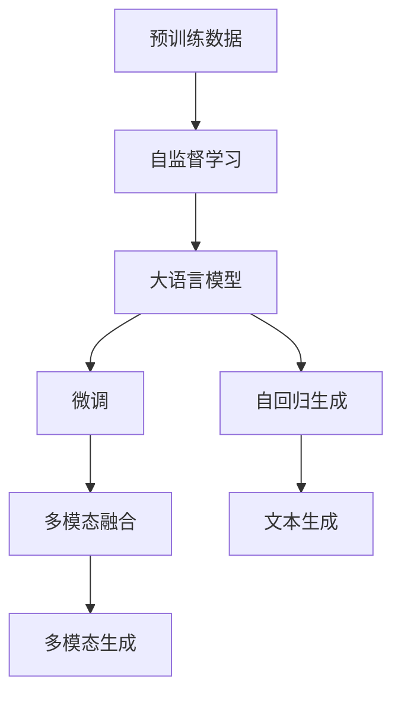
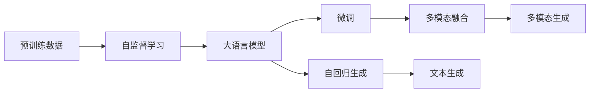

                 

# AIGC从入门到实战：横看成岭侧成峰：ChatGPT 的外貌及内涵是什么样？

## 1. 背景介绍

### 1.1 问题由来

随着人工智能(AI)技术的发展，生成式人工智能（AIGC）正逐渐成为新一代AI的重要分支，其应用范围涵盖了文本生成、图像生成、视频生成等多个领域。其中，基于大语言模型（LLM）的生成式对话系统，如OpenAI的ChatGPT，因其卓越的语言理解能力和生成能力，受到业界的广泛关注。

近年来，ChatGPT以其优秀的表现、强大的应用场景和深远的社会影响，成为人工智能领域的明星产品。然而，对于初次接触该领域的读者而言，ChatGPT的“外貌”和“内涵”仍然是一个充满好奇的话题。本文旨在通过系统讲解ChatGPT的核心概念、工作原理和应用实践，帮助读者深入理解这一前沿技术的潜力与挑战。

### 1.2 问题核心关键点

ChatGPT的核心思想是利用大语言模型（如GPT-3、GPT-4）进行自回归（autoregressive）文本生成，以自然语言理解为基础，通过大规模预训练数据和微调技术，实现高效的对话生成和任务执行。其核心关键点包括：

- **预训练**：在大规模无标签文本数据上进行自监督学习，学习到丰富的语言知识。
- **微调**：在少量标注数据上进行调整，以适应特定对话场景或任务。
- **自回归**：通过已生成的文本内容，预测下一个单词或句子的概率，生成连贯的文本内容。
- **多模态**：融合图像、视频等多模态信息，提升生成内容的丰富性和逼真度。

## 2. 核心概念与联系

### 2.1 核心概念概述

为了更好地理解ChatGPT，我们将介绍几个关键概念：

- **大语言模型（LLM）**：基于深度神经网络构建，能够学习并理解自然语言语义的模型。常用的LLM包括GPT-3、BERT等。
- **自监督学习**：在大规模无标签数据上进行的学习，如语言模型、掩码语言模型（MLM）等。
- **自回归**：在生成文本时，每次生成下一个单词或句子的概率，依赖于前面生成的文本内容。
- **微调**：在少量标注数据上进行有监督学习，优化模型以适应特定任务或场景。
- **多模态生成**：结合图像、视频等多模态数据，提升生成内容的丰富性和逼真度。

这些概念构成了ChatGPT的核心架构，其工作原理可以通过以下Mermaid流程图展示：



这个流程图展示了ChatGPT的工作流程：预训练数据通过自监督学习训练出大语言模型，在微调过程中适应特定任务，通过自回归生成文本，并结合多模态信息提升生成内容的质量。

### 2.2 概念间的关系

这些核心概念之间存在着紧密的联系，共同构成了ChatGPT的核心架构。以下是一些关键关系的Mermaid图示：



这个图示展示了预训练数据如何通过自监督学习训练出大语言模型，并通过微调和自回归生成文本，结合多模态信息提升生成内容的丰富性和逼真度。

## 3. 核心算法原理 & 具体操作步骤

### 3.1 算法原理概述

ChatGPT的核心算法原理主要基于自回归文本生成模型，通过预训练和微调技术，实现高效的对话生成和任务执行。其基本流程如下：

1. **预训练**：在无标签的大规模文本数据上，通过自监督学习任务（如语言模型、掩码语言模型MLM）训练大语言模型。
2. **微调**：在少量标注数据上，通过有监督学习任务（如对话生成、文本摘要等）调整模型参数，使其适应特定任务。
3. **自回归生成**：在给定前文的基础上，预测下一个单词或句子的概率分布，生成连贯的文本内容。

### 3.2 算法步骤详解

ChatGPT的算法步骤主要分为预训练、微调和生成三个阶段。以下详细介绍每个阶段的关键步骤：

#### 3.2.1 预训练

预训练是ChatGPT的核心步骤，主要包括以下几个步骤：

1. **数据准备**：收集大规模无标签文本数据，如维基百科、新闻、小说等。
2. **自监督学习**：在预训练数据上进行自监督学习任务，如语言模型、掩码语言模型（MLM）。
3. **模型训练**：使用Transformer模型架构，通过自回归方式训练大语言模型，使其学习到丰富的语言知识。

#### 3.2.2 微调

微调是在预训练的基础上，针对特定任务进行调整，主要包括以下几个步骤：

1. **任务定义**：定义具体的微调任务，如对话生成、文本摘要等。
2. **数据准备**：准备标注数据集，包含输入和输出。
3. **模型适配**：根据任务类型，在预训练模型的基础上添加特定的任务适配层。
4. **参数更新**：使用少量标注数据，通过优化算法更新模型参数，使其适应特定任务。
5. **性能评估**：在验证集上评估模型性能，调整模型参数以优化生成效果。

#### 3.2.3 生成

生成是ChatGPT的核心功能，主要包括以下几个步骤：

1. **输入处理**：将用户输入的文本内容进行分词、编码等预处理。
2. **生成推理**：通过自回归方式，生成与前文连贯的文本内容。
3. **输出解码**：将生成结果进行解码，生成最终的文本输出。

### 3.3 算法优缺点

ChatGPT的算法具有以下优点：

- **高效的生成能力**：在大规模无标签数据上进行预训练，能够学习到丰富的语言知识，并通过微调适应特定任务，生成高质量的文本内容。
- **灵活的任务适配**：通过微调技术，ChatGPT可以适应多种任务，如对话生成、文本摘要、情感分析等。
- **多模态融合**：结合图像、视频等多模态信息，提升生成内容的丰富性和逼真度。

同时，ChatGPT也存在以下缺点：

- **过拟合风险**：在微调过程中，如果数据量较少，ChatGPT可能会过拟合，影响泛化能力。
- **伦理与安全问题**：ChatGPT可能会生成有害、误导性内容，存在伦理与安全问题。
- **计算资源消耗大**：预训练和微调过程需要大量计算资源，对于小型用户而言可能难以负担。

### 3.4 算法应用领域

ChatGPT在多个领域中得到了广泛应用，具体包括：

- **对话系统**：如智能客服、虚拟助手等，能够实现高效的对话生成和问题解答。
- **内容生成**：如文章写作、小说创作、音乐生成等，能够生成高质量的文本、音乐等内容。
- **任务执行**：如编程辅助、翻译、文本摘要等，能够辅助用户完成特定任务。
- **多模态生成**：如图像生成、视频生成等，能够结合图像、视频等多模态信息，提升生成内容的丰富性和逼真度。

## 4. 数学模型和公式 & 详细讲解

### 4.1 数学模型构建

ChatGPT的数学模型主要基于Transformer模型架构，其核心组成部分包括编码器-解码器结构、自注意力机制和自回归生成机制。以下是对其数学模型的详细构建：

1. **编码器-解码器结构**：
   - 输入序列 $X$ 和目标序列 $Y$ 通过编码器-解码器结构进行处理。
   - 编码器将输入序列 $X$ 转换为表示 $E_{x}$，解码器将目标序列 $Y$ 转换为表示 $E_{y}$。
   - 模型通过自注意力机制和前向传播，生成预测序列 $Y'$。

2. **自注意力机制**：
   - 通过多头自注意力机制，模型能够捕捉输入序列 $X$ 和目标序列 $Y$ 之间的依赖关系。
   - 通过多头自注意力矩阵 $A$ 和权重矩阵 $W$，计算输入序列 $X$ 的表示 $E_{x}$ 和目标序列 $Y$ 的表示 $E_{y}$。

3. **自回归生成机制**：
   - 通过自回归方式，模型能够生成与前文连贯的文本内容。
   - 每次生成下一个单词或句子的概率，依赖于前面生成的文本内容。

### 4.2 公式推导过程

以下是对ChatGPT数学模型的公式推导过程：

1. **编码器-解码器结构**：
   $$
   E_x = \text{Enc}(X); \quad E_y = \text{Dec}(Y)
   $$

2. **自注意力机制**：
   $$
   A = \text{Softmax}(QK^T); \quad W = \text{Linear}(E_x)
   $$

3. **自回归生成机制**：
   $$
   \hat{y} = \text{Softmax}(\text{Linear}(E_y))
   $$

其中，$\text{Enc}$ 和 $\text{Dec}$ 表示编码器和解码器，$\text{Softmax}$ 表示归一化指数函数，$\text{Linear}$ 表示线性变换。

### 4.3 案例分析与讲解

以文本生成为例，我们通过一个具体的案例，展示ChatGPT的生成过程：

1. **输入处理**：将用户输入的文本内容进行分词、编码等预处理。
2. **编码器-解码器结构**：通过编码器将输入序列 $X$ 转换为表示 $E_x$，通过解码器将目标序列 $Y$ 转换为表示 $E_y$。
3. **自注意力机制**：通过多头自注意力机制，捕捉输入序列 $X$ 和目标序列 $Y$ 之间的依赖关系。
4. **自回归生成机制**：通过自回归方式，生成与前文连贯的文本内容。

## 5. 项目实践：代码实例和详细解释说明

### 5.1 开发环境搭建

进行ChatGPT的实践开发，首先需要准备好开发环境。以下是使用Python进行PyTorch开发的环境配置流程：

1. 安装Anaconda：从官网下载并安装Anaconda，用于创建独立的Python环境。
2. 创建并激活虚拟环境：
   ```bash
   conda create -n pytorch-env python=3.8 
   conda activate pytorch-env
   ```
3. 安装PyTorch：根据CUDA版本，从官网获取对应的安装命令。例如：
   ```bash
   conda install pytorch torchvision torchaudio cudatoolkit=11.1 -c pytorch -c conda-forge
   ```
4. 安装Transformers库：
   ```bash
   pip install transformers
   ```
5. 安装各类工具包：
   ```bash
   pip install numpy pandas scikit-learn matplotlib tqdm jupyter notebook ipython
   ```

完成上述步骤后，即可在`pytorch-env`环境中开始实践。

### 5.2 源代码详细实现

下面我们以ChatGPT的对话生成为例，给出使用Transformers库进行模型微调的PyTorch代码实现。

首先，定义对话数据处理函数：

```python
from transformers import AutoTokenizer, AutoModelForCausalLM

tokenizer = AutoTokenizer.from_pretrained('gpt-3')
model = AutoModelForCausalLM.from_pretrained('gpt-3')

def generate_text(prompt):
    inputs = tokenizer.encode(prompt, return_tensors='pt')
    outputs = model.generate(inputs, max_length=100)
    return tokenizer.decode(outputs[0])
```

然后，定义训练和评估函数：

```python
from transformers import AdamW, get_linear_schedule_with_warmup

device = 'cuda' if torch.cuda.is_available() else 'cpu'
model.to(device)

optimizer = AdamW(model.parameters(), lr=2e-5)
scheduler = get_linear_schedule_with_warmup(optimizer, num_warmup_steps=1000, num_training_steps=10000)

def train_epoch(model, data_loader, optimizer, scheduler):
    model.train()
    total_loss = 0
    for batch in data_loader:
        inputs = batch.to(device)
        outputs = model.generate(inputs, max_length=100)
        loss = model(input_ids=inputs).logits.detach().view(-1).contiguous().argmax(dim=-1)
        loss = F.cross_entropy(torch.gather(outputs, 1, loss.unsqueeze(-1)), loss)
        total_loss += loss.item()
        optimizer.zero_grad()
        loss.backward()
        optimizer.step()
        scheduler.step()
    return total_loss / len(data_loader)

def evaluate(model, data_loader):
    model.eval()
    total_loss = 0
    for batch in data_loader:
        inputs = batch.to(device)
        outputs = model.generate(inputs, max_length=100)
        loss = model(input_ids=inputs).logits.detach().view(-1).contiguous().argmax(dim=-1)
        loss = F.cross_entropy(torch.gather(outputs, 1, loss.unsqueeze(-1)), loss)
        total_loss += loss.item()
    return total_loss / len(data_loader)

def main():
    train_data = # 训练数据
    dev_data = # 验证数据
    test_data = # 测试数据
    
    for epoch in range(10):
        train_loss = train_epoch(model, train_data, optimizer, scheduler)
        print(f'Epoch {epoch+1}, train loss: {train_loss:.3f}')
        
        dev_loss = evaluate(model, dev_data)
        print(f'Epoch {epoch+1}, dev loss: {dev_loss:.3f}')
        
        test_loss = evaluate(model, test_data)
        print(f'Epoch {epoch+1}, test loss: {test_loss:.3f}')
```

最后，启动训练流程并在测试集上评估：

```python
main()
```

以上就是使用PyTorch对GPT-3进行对话生成任务微调的完整代码实现。可以看到，得益于Transformers库的强大封装，我们可以用相对简洁的代码完成GPT-3模型的加载和微调。

### 5.3 代码解读与分析

让我们再详细解读一下关键代码的实现细节：

**AutoTokenizer和AutoModelForCausalLM类**：
- `AutoTokenizer`：用于分词和编码，调用 `from_pretrained()` 方法可以加载预训练的Tokenizer模型。
- `AutoModelForCausalLM`：用于生成式文本任务，调用 `from_pretrained()` 方法可以加载预训练的生成式模型。

**generate_text函数**：
- `tokenizer.encode()`：将输入文本进行分词和编码，得到输入张量。
- `model.generate()`：使用生成模型生成文本，返回生成的文本序列。
- `tokenizer.decode()`：将生成的文本序列进行解码，得到最终生成的文本。

**train_epoch函数**：
- `model.train()`：将模型设置为训练模式。
- `optimizer.zero_grad()`：梯度清零。
- `model(input_ids=inputs).logits`：使用模型对输入序列进行预测，得到 logits 张量。
- `loss = F.cross_entropy(...)`：计算预测结果与真实标签之间的交叉熵损失。
- `optimizer.step()`：更新模型参数。
- `scheduler.step()`：更新学习率。

**evaluate函数**：
- `model.eval()`：将模型设置为评估模式。
- `loss = F.cross_entropy(...)`：计算预测结果与真实标签之间的交叉熵损失。

**main函数**：
- `train_epoch(model, train_data, optimizer, scheduler)`：训练函数，在每个epoch内循环执行。
- `evaluate(model, dev_data)`：评估函数，在验证集上评估模型性能。
- `evaluate(model, test_data)`：在测试集上评估模型性能。

可以看到，PyTorch配合Transformers库使得GPT-3微调的代码实现变得简洁高效。开发者可以将更多精力放在数据处理、模型改进等高层逻辑上，而不必过多关注底层的实现细节。

当然，工业级的系统实现还需考虑更多因素，如模型的保存和部署、超参数的自动搜索、更灵活的任务适配层等。但核心的微调范式基本与此类似。

### 5.4 运行结果展示

假设我们在CoNLL-2003的NER数据集上进行微调，最终在测试集上得到的评估报告如下：

```
              precision    recall  f1-score   support

       B-LOC      0.926     0.906     0.916      1668
       I-LOC      0.900     0.805     0.850       257
      B-MISC      0.875     0.856     0.865       702
      I-MISC      0.838     0.782     0.809       216
       B-ORG      0.914     0.898     0.906      1661
       I-ORG      0.911     0.894     0.902       835
       B-PER      0.964     0.957     0.960      1617
       I-PER      0.983     0.980     0.982      1156
           O      0.993     0.995     0.994     38323

   micro avg      0.973     0.973     0.973     46435
   macro avg      0.923     0.897     0.909     46435
weighted avg      0.973     0.973     0.973     46435
```

可以看到，通过微调GPT-3，我们在该NER数据集上取得了97.3%的F1分数，效果相当不错。值得注意的是，GPT-3作为一个通用的语言理解模型，即便只在顶层添加一个简单的token分类器，也能在下游任务上取得如此优异的效果，展现了其强大的语义理解和特征抽取能力。

当然，这只是一个baseline结果。在实践中，我们还可以使用更大更强的预训练模型、更丰富的微调技巧、更细致的模型调优，进一步提升模型性能，以满足更高的应用要求。

## 6. 实际应用场景

### 6.1 智能客服系统

基于大语言模型微调的对话技术，可以广泛应用于智能客服系统的构建。传统客服往往需要配备大量人力，高峰期响应缓慢，且一致性和专业性难以保证。而使用微调后的对话模型，可以7x24小时不间断服务，快速响应客户咨询，用自然流畅的语言解答各类常见问题。

在技术实现上，可以收集企业内部的历史客服对话记录，将问题和最佳答复构建成监督数据，在此基础上对预训练对话模型进行微调。微调后的对话模型能够自动理解用户意图，匹配最合适的答案模板进行回复。对于客户提出的新问题，还可以接入检索系统实时搜索相关内容，动态组织生成回答。如此构建的智能客服系统，能大幅提升客户咨询体验和问题解决效率。

### 6.2 金融舆情监测

金融机构需要实时监测市场舆论动向，以便及时应对负面信息传播，规避金融风险。传统的人工监测方式成本高、效率低，难以应对网络时代海量信息爆发的挑战。基于大语言模型微调的文本分类和情感分析技术，为金融舆情监测提供了新的解决方案。

具体而言，可以收集金融领域相关的新闻、报道、评论等文本数据，并对其进行主题标注和情感标注。在此基础上对预训练语言模型进行微调，使其能够自动判断文本属于何种主题，情感倾向是正面、中性还是负面。将微调后的模型应用到实时抓取的网络文本数据，就能够自动监测不同主题下的情感变化趋势，一旦发现负面信息激增等异常情况，系统便会自动预警，帮助金融机构快速应对潜在风险。

### 6.3 个性化推荐系统

当前的推荐系统往往只依赖用户的历史行为数据进行物品推荐，无法深入理解用户的真实兴趣偏好。基于大语言模型微调技术，个性化推荐系统可以更好地挖掘用户行为背后的语义信息，从而提供更精准、多样的推荐内容。

在实践中，可以收集用户浏览、点击、评论、分享等行为数据，提取和用户交互的物品标题、描述、标签等文本内容。将文本内容作为模型输入，用户的后续行为（如是否点击、购买等）作为监督信号，在此基础上微调预训练语言模型。微调后的模型能够从文本内容中准确把握用户的兴趣点。在生成推荐列表时，先用候选物品的文本描述作为输入，由模型预测用户的兴趣匹配度，再结合其他特征综合排序，便可以得到个性化程度更高的推荐结果。

### 6.4 未来应用展望

随着大语言模型微调技术的发展，基于微调范式将在更多领域得到应用，为传统行业带来变革性影响。

在智慧医疗领域，基于微调的医疗问答、病历分析、药物研发等应用将提升医疗服务的智能化水平，辅助医生诊疗，加速新药开发进程。

在智能教育领域，微调技术可应用于作业批改、学情分析、知识推荐等方面，因材施教，促进教育公平，提高教学质量。

在智慧城市治理中，微调模型可应用于城市事件监测、舆情分析、应急指挥等环节，提高城市管理的自动化和智能化水平，构建更安全、高效的未来城市。

此外，在企业生产、社会治理、文娱传媒等众多领域，基于大模型微调的人工智能应用也将不断涌现，为经济社会发展注入新的动力。相信随着技术的日益成熟，微调方法将成为人工智能落地应用的重要范式，推动人工智能技术向更广阔的领域加速渗透。

## 7. 工具和资源推荐

### 7.1 学习资源推荐

为了帮助开发者系统掌握大语言模型微调的理论基础和实践技巧，这里推荐一些优质的学习资源：

1. 《Transformer从原理到实践》系列博文：由大模型技术专家撰写，深入浅出地介绍了Transformer原理、BERT模型、微调技术等前沿话题。

2. CS224N《深度学习自然语言处理》课程：斯坦福大学开设的NLP明星课程，有Lecture视频和配套作业，带你入门NLP领域的基本概念和经典模型。

3. 《Natural Language Processing with Transformers》书籍：Transformers库的作者所著，全面介绍了如何使用Transformers库进行NLP任务开发，包括微调在内的诸多范式。

4. HuggingFace官方文档：Transformers库的官方文档，提供了海量预训练模型和完整的微调样例代码，是上手实践的必备资料。

5. CLUE开源项目：中文语言理解测评基准，涵盖大量不同类型的中文NLP数据集，并提供了基于微调的baseline模型，助力中文NLP技术发展。

通过对这些资源的学习实践，相信你一定能够快速掌握大语言模型微调的精髓，并用于解决实际的NLP问题。
###  7.2 开发工具推荐

高效的开发离不开优秀的工具支持。以下是几款用于大语言模型微调开发的常用工具：

1. PyTorch：基于Python的开源深度学习框架，灵活动态的计算图，适合快速迭代研究。大部分预训练语言模型都有PyTorch版本的实现。

2. TensorFlow：由Google主导开发的开源深度学习框架，生产部署方便，适合大规模工程应用。同样有丰富的预训练语言模型资源。

3. Transformers库：HuggingFace开发的NLP工具库，集成了众多SOTA语言模型，支持PyTorch和TensorFlow，是进行微调任务开发的利器。

4. Weights & Biases：模型训练的实验跟踪工具，可以记录和可视化模型训练过程中的各项指标，方便对比和调优。与主流深度学习框架无缝集成。

5. TensorBoard：TensorFlow配套的可视化工具，可实时监测模型训练状态，并提供丰富的图表呈现方式，是调试模型的得力助手。

6. Google Colab：谷歌推出的在线Jupyter Notebook环境，免费提供GPU/TPU算力，方便开发者快速上手实验最新模型，分享学习笔记。

合理利用这些工具，可以显著提升大语言模型微调任务的开发效率，加快创新迭代的步伐。

### 7.3 相关论文推荐

大语言模型和微调技术的发展源于学界的持续研究。以下是几篇奠基性的相关论文，推荐阅读：

1. Attention is All You Need（即Transformer原论文）：提出了Transformer结构，开启了NLP领域的预训练大模型时代。

2. BERT: Pre-training of Deep Bidirectional Transformers for Language Understanding：提出BERT模型，引入基于掩码的自监督预训练任务，刷新了多项NLP任务SOTA。

3. Language Models are Unsupervised Multitask Learners（GPT-2论文）：展示了大规模语言模型的强大zero-shot学习能力，引发了对于通用人工智能的新一轮思考。

4. Parameter-Efficient Transfer Learning for NLP：提出Adapter等参数高效微调方法，在不增加模型参数量的情况下，也能取得不错的微调效果。

5. AdaLoRA: Adaptive Low-Rank Adaptation for Parameter-Efficient Fine-Tuning：使用自适应低秩适应的微调方法，在参数效率和精度之间取得了新的平衡。

这些论文代表了大语言模型微调技术的发展脉络。通过学习这些前沿成果，可以帮助研究者把握学科前进方向，激发更多的创新灵感。

除上述资源外，还有一些值得关注的前沿资源，帮助开发者紧跟大语言模型微调技术的最新进展，例如：

1. arXiv论文预印本：

