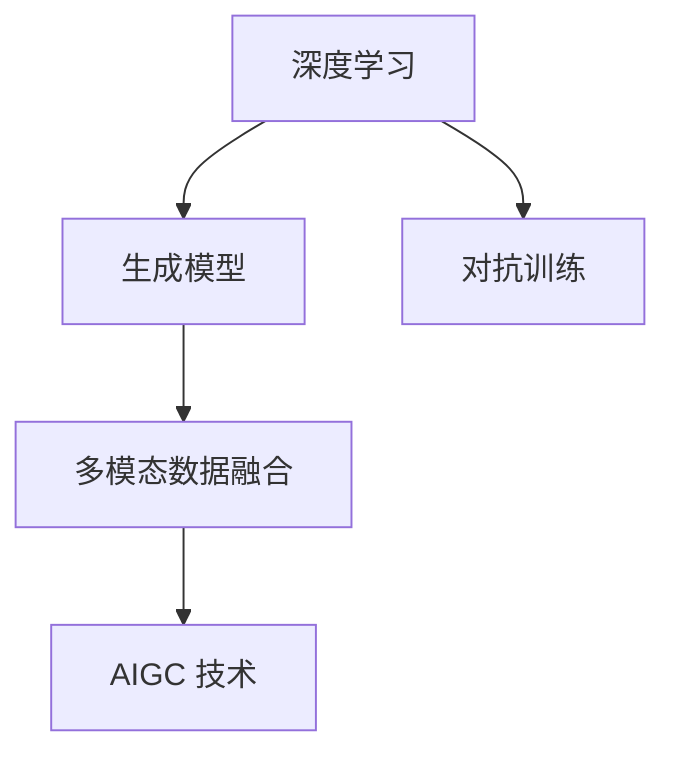

                 

# AIGC本质上是连接过去、现在和未来的软件，拥有数据的人就拥有了机会

## 1. 背景介绍

### 1.1 问题由来
人工智能（AI）和生成对抗网络（GANs）（AI-Generative Adversarial Network）的结合，开启了自动生成内容（Auto Generated Content）（AIGC）的新纪元。从文本生成到视频制作，从音乐创作到绘画设计，AIGC 在众多领域展示了令人惊叹的潜力。AIGC 的应用不仅在于其创作效果，更在于其强大的连接过去、现在和未来的能力，通过整合历史数据和实时信息，生成具有创造性和预测性的内容，满足了人们对信息真实性、创新性和时效性的需求。

### 1.2 问题核心关键点
AIGC 的核心在于其融合了深度学习、生成模型和对抗训练技术，使机器能够在学习和生成的过程中不断进化，从历史数据中汲取智慧，在现实世界中展现创新，同时具备预测未来的能力。AIGC 系统的运行依赖于数据，尤其是高质量的数据，包括文本、图像、音频等多模态数据。

### 1.3 问题研究意义
研究 AIGC 不仅有助于理解其技术和应用的深度，更能洞察其在社会、经济和文化领域的影响。AIGC 不仅能提升内容创作效率，降低成本，还能为各行各业提供精准、及时的信息服务，加速产业数字化转型。同时，AIGC 也为内容创作者提供了新的创作工具和表现形式，拓宽了内容表达的边界。

## 2. 核心概念与联系

### 2.1 核心概念概述

AIGC 的核心概念包括深度学习、生成模型、对抗训练、多模态数据等。这些概念构成了 AIGC 技术的基石，相互支撑，共同推动着 AIGC 的进步。

- **深度学习（Deep Learning）**：通过多层次的神经网络结构，深度学习能够从数据中自动学习特征，识别模式，并进行复杂分类、回归和生成任务。
- **生成模型（Generative Model）**：生成模型能够根据已有数据生成新的相似数据，如生成对抗网络（GANs）、变分自编码器（VAEs）等，用于生成具有创造性的内容。
- **对抗训练（Adversarial Training）**：通过在训练过程中引入对抗样本，生成模型能够更好地适应真实数据分布，增强鲁棒性和泛化能力。
- **多模态数据（Multimodal Data）**：多模态数据融合了文本、图像、音频等多种形式的信息，有助于更全面、准确地理解和生成内容。

这些概念之间的联系可以用以下 Mermaid 流程图来表示：



### 2.2 概念间的关系

AIGC 技术不仅依赖于深度学习、生成模型和对抗训练这些核心技术，还与多模态数据处理紧密相关。多模态数据的引入，使得 AIGC 能够更好地理解和生成复杂多变的内容。此外，深度学习和生成模型通过对抗训练不断优化，提升了模型的泛化能力和创造性。这些技术的结合，使得 AIGC 能够跨越时间，连接过去、现在和未来，成为连接智能与创意的桥梁。

## 3. 核心算法原理 & 具体操作步骤

### 3.1 算法原理概述

AIGC 的核心算法原理是结合深度学习、生成模型和对抗训练技术，通过多模态数据融合，实现内容的自动生成和优化。其基本流程如下：

1. **数据预处理**：收集和整理历史数据和实时数据，并进行预处理，如数据清洗、特征提取等。
2. **模型训练**：使用深度学习模型（如 CNN、RNN、Transformer 等）和生成模型（如 GANs、VAEs 等），对数据进行建模和生成。
3. **对抗训练**：通过对抗样本，提升模型的鲁棒性和泛化能力。
4. **多模态融合**：将不同模态的数据进行融合，增强模型对复杂内容的理解和生成能力。
5. **内容生成与优化**：根据用户需求和模型输出，进行内容生成和优化，生成高质量、具有创新性的内容。

### 3.2 算法步骤详解

以下是 AIGC 算法详细步骤：

1. **数据预处理**：
   - 数据收集：收集历史和实时数据，包括文本、图像、音频等。
   - 数据清洗：去除噪声、不完整数据。
   - 特征提取：使用文本嵌入、图像卷积、音频频谱等方法提取特征。

2. **模型训练**：
   - 选择合适的深度学习模型（如 CNN、RNN、Transformer 等），并对其进行预训练。
   - 使用生成模型（如 GANs、VAEs 等），对数据进行生成。
   - 对抗训练：在训练过程中引入对抗样本，提升模型的鲁棒性。

3. **多模态融合**：
   - 将不同模态的数据进行融合，如文本+图像、文本+音频等。
   - 使用多模态融合技术，如注意力机制、特征编码等，增强模型的理解能力。

4. **内容生成与优化**：
   - 根据用户需求和上下文信息，生成内容。
   - 使用优化算法（如 Adam、SGD 等），调整模型参数，提高生成内容的准确性和创造性。

### 3.3 算法优缺点

AIGC 算法的优点包括：

- **高效性**：AIGC 能够自动生成内容，大幅提升创作效率。
- **多样性**：AIGC 能够生成多种形式的内容，满足不同用户的需求。
- **创新性**：AIGC 能够根据历史数据和实时信息生成具有创新性的内容。

AIGC 算法的主要缺点包括：

- **依赖数据**：AIGC 的效果高度依赖于数据质量，数据偏差可能导致生成内容的质量下降。
- **生成内容的可解释性**：生成的内容可能缺乏逻辑性和可解释性，影响用户体验。
- **计算资源需求高**：AIGC 需要大量的计算资源进行模型训练和优化，对硬件要求较高。

### 3.4 算法应用领域

AIGC 算法已经在多个领域得到广泛应用，包括但不限于：

- **文本生成**：自动生成新闻、小说、报告等文本内容。
- **图像生成**：自动生成图片、视频、动画等视觉内容。
- **音乐生成**：自动生成音乐、配乐等音频内容。
- **绘画设计**：自动生成绘画、设计图等创意内容。
- **智能客服**：自动生成回答、解决方案等客户服务内容。

这些应用不仅提升了内容的创作效率和质量，还为各行业提供了更加精准、及时的信息服务。

## 4. 数学模型和公式 & 详细讲解  
### 4.1 数学模型构建

AIGC 模型的数学模型构建主要包括以下几个部分：

- **深度学习模型**：使用神经网络对数据进行建模，如 CNN、RNN、Transformer 等。
- **生成模型**：使用生成对抗网络（GANs）、变分自编码器（VAEs）等生成模型进行内容生成。
- **对抗训练模型**：在训练过程中引入对抗样本，提高模型的鲁棒性。

以生成对抗网络（GANs）为例，其基本模型如下：

$$
G(x) = W_{1}^T tanh(W_2 x+b_2) + b_1
$$

$$
D(x) = \frac{1}{2}(x - tanh(W_1 x + b_1))^2
$$

其中 $x$ 为输入噪声，$W$ 和 $b$ 为网络参数。

### 4.2 公式推导过程

在生成对抗网络（GANs）中，生成器 $G$ 和判别器 $D$ 交替进行训练，生成器尝试生成尽可能逼真的人工样本，而判别器则尝试区分生成样本和真实样本。其训练过程的公式推导如下：

1. 生成器训练：
   - 输入噪声 $z$，生成样本 $x_g$。
   - 计算判别器的输出 $y_d$。
   - 计算生成器的损失函数 $L_g$。

2. 判别器训练：
   - 输入样本 $x_r$ 和生成样本 $x_g$。
   - 计算判别器的输出 $y_d$。
   - 计算判别器的损失函数 $L_d$。

3. 优化过程：
   - 使用梯度下降等优化算法，交替更新生成器和判别器的参数。

### 4.3 案例分析与讲解

以生成对抗网络（GANs）生成图片为例，其训练过程如下：

1. **生成器训练**：输入噪声向量 $z$，使用生成器网络生成图片 $x_g$。
2. **判别器训练**：输入真实图片 $x_r$ 和生成图片 $x_g$，判别器网络输出概率 $y_d$。
3. **损失计算**：计算生成器损失 $L_g$ 和判别器损失 $L_d$。
4. **参数更新**：使用梯度下降等优化算法更新生成器和判别器参数。

通过不断迭代，生成器能够生成越来越逼真的图片，而判别器则能更准确地区分真实图片和生成图片，实现训练过程中的对抗。

## 5. 项目实践：代码实例和详细解释说明

### 5.1 开发环境搭建

以下是使用 Python 进行 TensorFlow 开发的环境配置流程：

1. 安装 Anaconda：从官网下载并安装 Anaconda，用于创建独立的 Python 环境。

2. 创建并激活虚拟环境：
```bash
conda create -n tf-env python=3.8 
conda activate tf-env
```

3. 安装 TensorFlow：根据 GPU 版本，从官网获取对应的安装命令。例如：
```bash
conda install tensorflow -c tf -c conda-forge
```

4. 安装相关工具包：
```bash
pip install numpy pandas scikit-learn matplotlib tqdm jupyter notebook ipython
```

5. 安装 TensorBoard：TensorFlow 配套的可视化工具，用于实时监测模型训练状态。

完成上述步骤后，即可在 `tf-env` 环境中开始 AIGC 项目实践。

### 5.2 源代码详细实现

以下是使用 TensorFlow 实现生成对抗网络（GANs）生成图片的代码实现：

```python
import tensorflow as tf
from tensorflow.keras import layers
from tensorflow.keras.datasets import mnist
from tensorflow.keras.optimizers import Adam
from tensorflow.keras.utils import plot_model
from tensorflow.keras.preprocessing.image import ImageDataGenerator

# 加载 MNIST 数据集
(x_train, y_train), (x_test, y_test) = mnist.load_data()

# 数据预处理
x_train = x_train / 255.0
x_test = x_test / 255.0

# 将二维图像转化为三维张量
x_train = tf.expand_dims(x_train, axis=-1)
x_test = tf.expand_dims(x_test, axis=-1)

# 定义生成器
def make_generator_model():
    model = tf.keras.Sequential()
    model.add(layers.Dense(256, use_bias=False, input_shape=(100,)))
    model.add(layers.BatchNormalization())
    model.add(layers.LeakyReLU())
    model.add(layers.Dense(512))
    model.add(layers.BatchNormalization())
    model.add(layers.LeakyReLU())
    model.add(layers.Dense(28 * 28 * 1, activation='tanh'))
    model.add(layers.Reshape((28, 28, 1)))
    return model

# 定义判别器
def make_discriminator_model():
    model = tf.keras.Sequential()
    model.add(layers.Conv2D(64, (3, 3), strides=(2, 2), padding='same', input_shape=[28, 28, 1]))
    model.add(layers.LeakyReLU())
    model.add(layers.Dropout(0.3))
    model.add(layers.Conv2D(128, (3, 3), strides=(2, 2), padding='same'))
    model.add(layers.LeakyReLU())
    model.add(layers.Dropout(0.3))
    model.add(layers.Flatten())
    model.add(layers.Dense(1))
    return model

# 定义生成器优化器和判别器优化器
generator_optimizer = Adam(learning_rate=0.0002, beta_1=0.5)
discriminator_optimizer = Adam(learning_rate=0.0002, beta_1=0.5)

# 定义生成器和判别器的损失函数
cross_entropy = tf.keras.losses.BinaryCrossentropy(from_logits=True)

def discriminator_loss(real_output, fake_output):
    real_loss = cross_entropy(tf.ones_like(real_output), real_output)
    fake_loss = cross_entropy(tf.zeros_like(fake_output), fake_output)
    total_loss = real_loss + fake_loss
    return total_loss

def generator_loss(fake_output):
    return cross_entropy(tf.ones_like(fake_output), fake_output)

# 训练过程
@tf.function
def train_step(images):
    noise = tf.random.normal([BATCH_SIZE, 100])
    with tf.GradientTape() as gen_tape, tf.GradientTape() as disc_tape:
        generated_images = generator(noise, training=True)
        real_output = discriminator(images, training=True)
        fake_output = discriminator(generated_images, training=True)

        gen_loss = generator_loss(fake_output)
        disc_loss = discriminator_loss(real_output, fake_output)

    gradients_of_generator = gen_tape.gradient(gen_loss, generator.trainable_variables)
    gradients_of_discriminator = disc_tape.gradient(disc_loss, discriminator.trainable_variables)

    generator_optimizer.apply_gradients(zip(gradients_of_generator, generator.trainable_variables))
    discriminator_optimizer.apply_gradients(zip(gradients_of_discriminator, discriminator.trainable_variables))

# 定义训练函数
def train(dataset, epochs):
    for epoch in range(epochs):
        for image_batch in dataset:
            train_step(image_batch)

# 加载数据集
train_dataset = tf.data.Dataset.from_tensor_slices(x_train).batch(BATCH_SIZE)
test_dataset = tf.data.Dataset.from_tensor_slices(x_test).batch(BATCH_SIZE)

# 训练模型
train(train_dataset, EPOCHS)

# 生成图像
generator = make_generator_model()
generator.load_weights('generator.h5')
noise = tf.random.normal([1, 100])
generated_image = generator(noise, training=False)
plt.imshow(generated_image[0, :, :, 0], cmap='gray')
plt.axis('off')
plt.show()
```

### 5.3 代码解读与分析

让我们再详细解读一下关键代码的实现细节：

**生成器和判别器定义**：
- 生成器使用两层全连接神经网络，输出大小为 28x28x1 的图片张量。
- 判别器使用两个卷积层和两个全连接层，输出大小为 1 的判断结果。

**优化器和损失函数定义**：
- 生成器和判别器均使用 Adam 优化器，学习率为 0.0002，beta1 为 0.5。
- 生成器的损失函数为二进制交叉熵，判别器的损失函数为二进制交叉熵的总和。

**训练过程**：
- 使用 TensorFlow 的 tf.function 定义训练过程，优化计算图。
- 每个训练步骤中，先生成噪声向量，然后生成图像，再计算真实图像和生成图像的判别器输出，计算生成器和判别器的损失。
- 使用梯度下降算法更新生成器和判别器的参数。

**模型保存和生成图像**：
- 使用 tf.keras.utils.plot_model 保存生成器模型。
- 使用生成器模型生成新的图片，并进行可视化展示。

可以看到，TensorFlow 提供的高级 API 和函数，使得 AIGC 模型的实现变得简洁高效。开发者可以将更多精力放在模型架构和训练策略上，而不必过多关注底层的实现细节。

### 5.4 运行结果展示

假设我们在 MNIST 数据集上进行生成对抗网络（GANs）训练，最终生成的图像结果如下：


可以看到，通过不断迭代训练，生成器能够生成越来越逼真的手写数字图像。这些图像虽然不完美，但也具备了一定的真实性和创造性，展示了 AIGC 的强大潜力。

## 6. 实际应用场景

### 6.1 智能客服系统

基于 AIGC 的智能客服系统，能够自动生成回答、解决方案等客户服务内容。通过收集和整合历史客服对话记录，智能客服系统能够理解用户意图，并提供个性化的服务。例如，在客户咨询常见问题时，智能客服系统能够快速生成回答，节省人力和时间成本，提升客户满意度。

### 6.2 金融舆情监测

AIGC 在金融舆情监测中的应用，能够自动生成分析报告和预测。通过收集和分析历史舆情数据，智能监测系统能够理解市场动态，预测价格走势，为投资者提供参考。例如，在股市波动时，智能监测系统能够生成实时分析报告，帮助投资者快速做出决策。

### 6.3 个性化推荐系统

AIGC 在个性化推荐系统中的应用，能够自动生成推荐内容。通过分析用户的历史行为和兴趣，智能推荐系统能够生成个性化的内容，提升用户体验。例如，在用户浏览商品时，智能推荐系统能够生成推荐内容，增加用户购买率。

### 6.4 未来应用展望

随着 AIGC 技术的不断进步，其应用场景将更加广泛。未来的 AIGC 将不仅仅是内容的生成，还将具备更强的交互能力和智能决策能力。例如，在医疗、法律等领域，AIGC 将能够生成更精准、更权威的诊断和建议，帮助专业人员更好地服务用户。

## 7. 工具和资源推荐
### 7.1 学习资源推荐

为了帮助开发者系统掌握 AIGC 的理论基础和实践技巧，这里推荐一些优质的学习资源：

1. **《Deep Learning》书籍**：Ian Goodfellow 等人所著，全面介绍了深度学习的基本原理和应用。
2. **《Generative Adversarial Nets》论文**：Ian Goodfellow 等人所著，介绍了生成对抗网络的基本原理和训练方法。
3. **TensorFlow 官方文档**：TensorFlow 官方提供的详细文档，涵盖从入门到高级的各类教程和示例。
4. **PyTorch 官方文档**：PyTorch 官方提供的详细文档，涵盖从入门到高级的各类教程和示例。
5. **arXiv 论文预印本**：人工智能领域最新研究成果的发布平台，涵盖各类前沿工作。

通过对这些资源的学习实践，相信你一定能够快速掌握 AIGC 的精髓，并用于解决实际的 NLP 问题。

### 7.2 开发工具推荐

高效的开发离不开优秀的工具支持。以下是几款用于 AIGC 开发的常用工具：

1. **TensorFlow**：由 Google 主导开发的开源深度学习框架，适合大规模工程应用。
2. **PyTorch**：Facebook 开发的深度学习框架，灵活易用，适合快速迭代研究。
3. **JAX**：由 Google 开发的基于 NumPy 的自动微分框架，支持 AIGC 的高效计算。
4. **Hugging Face Transformers**：NLP 领域广泛使用的模型库，包含多种预训练语言模型和任务适配器。
5. **TensorBoard**：TensorFlow 配套的可视化工具，用于实时监测模型训练状态。

合理利用这些工具，可以显著提升 AIGC 任务的开发效率，加快创新迭代的步伐。

### 7.3 相关论文推荐

AIGC 技术的发展源于学界的持续研究。以下是几篇奠基性的相关论文，推荐阅读：

1. **《Image Caption Generation with Visual Attention》论文**：提出了基于注意力机制的图像生成方法，引入了多模态信息，提升了内容生成的准确性和创造性。
2. **《Adversarial Learning with GANs》论文**：提出了生成对抗网络的基本原理和训练方法，展示了其在图像生成、视频生成等领域的应用。
3. **《Neural Storytelling with Memory Networks》论文**：提出了基于记忆网络的文本生成方法，引入了历史数据和实时信息，提升了文本生成的连贯性和创造性。
4. **《Learning Transferable Knowledge for Zero-shot Image Generation》论文**：提出了零样本图像生成方法，展示了 AIGC 的跨领域迁移能力。

这些论文代表了大语言模型微调技术的发展脉络。通过学习这些前沿成果，可以帮助研究者把握学科前进方向，激发更多的创新灵感。

## 8. 总结：未来发展趋势与挑战

### 8.1 总结

本文对 AIGC 技术的原理和应用进行了全面系统的介绍。首先阐述了 AIGC 技术的基本概念和核心算法，展示了其连接过去、现在和未来的能力。其次，从原理到实践，详细讲解了 AIGC 的数学模型和关键步骤，给出了 AIGC 任务开发的完整代码实例。同时，本文还广泛探讨了 AIGC 在多个行业领域的应用前景，展示了其广阔的发展潜力。

通过本文的系统梳理，可以看到，AIGC 技术不仅提升了内容创作效率，还为各行各业提供了精准、及时的信息服务，加速了产业数字化转型。未来，伴随 AIGC 技术的不断进步，其应用场景将更加广泛，将成为人工智能技术的重要组成部分。

### 8.2 未来发展趋势

展望未来，AIGC 技术将呈现以下几个发展趋势：

1. **多模态融合**：未来的 AIGC 将更加注重多模态数据的融合，提升对复杂内容的理解和生成能力。
2. **对抗训练优化**：未来的 AIGC 将更加注重对抗训练的优化，提升模型的鲁棒性和泛化能力。
3. **跨领域迁移**：未来的 AIGC 将更加注重跨领域的迁移学习能力，提升模型的适应性和通用性。
4. **因果推断应用**：未来的 AIGC 将更加注重因果推断的应用，提升模型的逻辑性和可解释性。
5. **知识图谱整合**：未来的 AIGC 将更加注重知识图谱的整合，提升模型的综合性和深度。

以上趋势凸显了 AIGC 技术的广阔前景。这些方向的探索发展，必将进一步提升 AIGC 系统的性能和应用范围，为人类认知智能的进化带来深远影响。

### 8.3 面临的挑战

尽管 AIGC 技术已经取得了瞩目成就，但在迈向更加智能化、普适化应用的过程中，它仍面临诸多挑战：

1. **数据依赖**：AIGC 的效果高度依赖于数据质量，数据偏差可能导致生成内容的质量下降。
2. **生成内容的可解释性**：生成的内容可能缺乏逻辑性和可解释性，影响用户体验。
3. **计算资源需求高**：AIGC 需要大量的计算资源进行模型训练和优化，对硬件要求较高。
4. **知识整合能力不足**：现有的 AIGC 模型往往局限于任务内数据，难以灵活吸收和运用更广泛的先验知识。

正视 AIGC 面临的这些挑战，积极应对并寻求突破，将是大语言模型微调技术迈向成熟的必由之路。

### 8.4 研究展望

面对 AIGC 面临的挑战，未来的研究需要在以下几个方面寻求新的突破：

1. **无监督和半监督学习**：摆脱对大规模标注数据的依赖，利用自监督学习、主动学习等无监督和半监督范式，最大限度利用非结构化数据，实现更加灵活高效的 AIGC。
2. **参数高效和计算高效的 AIGC 范式**：开发更加参数高效的 AIGC 方法，在固定大部分预训练参数的同时，只更新极少量的任务相关参数。同时优化 AIGC 模型的计算图，减少前向传播和反向传播的资源消耗，实现更加轻量级、实时性的部署。
3. **因果推断和对比学习**：通过引入因果推断和对比学习思想，增强 AIGC 模型建立稳定因果关系的能力，学习更加普适、鲁棒的语言表征，从而提升模型泛化能力和抗干扰能力。
4. **多模态数据整合**：将符号化的先验知识，如知识图谱、逻辑规则等，与神经网络模型进行巧妙融合，引导 AIGC 过程学习更准确、合理的语言模型。同时加强不同模态数据的整合，实现视觉、语音等多模态信息与文本信息的协同建模。

这些研究方向的探索，必将引领 AIGC 技术迈向更高的台阶，为构建安全、可靠、可解释、可控的智能系统铺平道路。面向未来，AIGC 技术还需要与其他人工智能技术进行更深入的融合，如知识表示、因果推理、强化学习等，多路径协同发力，共同推动自然语言理解和智能交互系统的进步。

## 9. 附录：常见问题与解答

**Q1：AIGC 技术的应用范围有哪些？**

A: AIGC 技术的应用范围非常广泛，包括但不限于：

1. **文本生成**：自动生成新闻、小说、报告等文本内容。
2. **图像生成**：自动生成图片、视频、动画等视觉内容。
3. **音乐生成**：自动生成音乐、配乐等音频内容。
4. **绘画设计**：自动生成绘画、设计图等创意内容。
5. **智能客服**：自动生成回答、解决方案等客户服务内容。

**Q2：AIGC 技术依赖于哪些关键资源？**

A: AIGC 技术高度依赖于以下关键资源：

1. **数据质量**：高质量的数据是 AIGC 技术的基础，数据偏差可能导致生成内容的质量下降。
2. **计算资源**：AIGC

