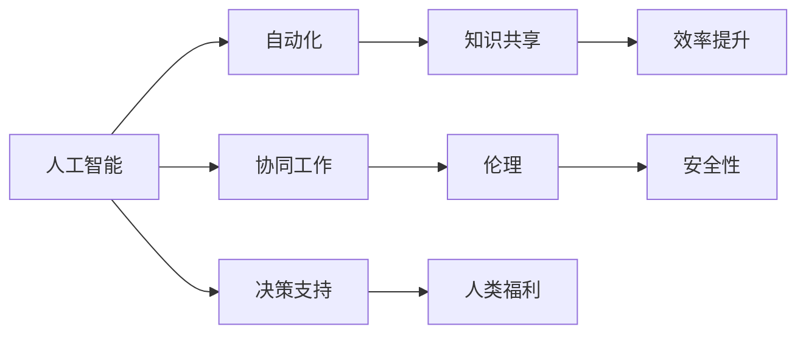

                 

# AI与人类的未来互动与合作

> 关键词：人工智能,未来,互动合作,自动化,协同工作

## 1. 背景介绍

### 1.1 问题由来
随着人工智能（AI）技术的飞速发展，AI与人类社会的互动与合作成为当前科技和学术研究的热点。AI不仅在生产力和生活领域产生深刻影响，也在伦理、法律和社会层面引发广泛讨论。AI与人类能否和谐共存、协同工作，成为现代社会面临的重要问题。

### 1.2 问题核心关键点
本文旨在探讨AI与人类未来互动合作的可能性，包括AI在自动化、协同工作中的角色，以及人类如何在享受AI带来便利的同时，确保其伦理和安全。AI与人类互动的核心在于：

1. **自动化与效率提升**：AI在自动化任务中的表现，如何提升工作效率和生产率。
2. **协同工作与知识共享**：AI如何在决策支持、团队协作中发挥作用，帮助人类更高效地工作。
3. **伦理与安全性**：AI在提升效率的同时，如何避免偏见、歧视，确保人类的权益和信息安全。

## 2. 核心概念与联系

### 2.1 核心概念概述

为更好地理解AI与人类未来互动合作的内涵，本节将介绍几个关键概念：

- **人工智能（AI）**：一种通过计算机系统模拟人类智能的技术，包括学习、推理、决策等能力。
- **自动化**：使用计算机系统自动执行任务的过程，以减少人力成本和错误率。
- **协同工作**：多个人或多台机器共同完成一项任务，共享信息和资源。
- **知识共享**：不同人或系统之间通过信息交换，增强整体的知识和技能。
- **伦理**：涉及AI系统设计和应用中的道德、法律和社会问题。
- **安全性**：确保AI系统在应用中不会对人类造成伤害或数据泄露。

这些概念之间有着密切的联系，形成了AI与人类互动合作的基础框架。

### 2.2 概念间的关系

这些核心概念之间的关系可以通过以下Mermaid流程图来展示：



这个流程图展示了AI与人类互动合作的基本过程：

1. AI通过自动化和知识共享提升效率和决策支持。
2. 协同工作进一步增强团队协作，共享信息和资源。
3. 伦理和安全性保障AI应用对人类的正面影响。
4. 最终目标是提升人类的福祉。

## 3. 核心算法原理 & 具体操作步骤

### 3.1 算法原理概述

AI与人类未来互动合作的算法原理，可以总结为以下几点：

1. **自动化与效率提升**：使用AI技术自动执行重复性、低价值的任务，释放人力资源，提升整体效率。
2. **协同工作与知识共享**：利用AI技术，如自然语言处理和机器学习，促进人机协同，增强团队协作和知识共享。
3. **伦理与安全性**：建立透明、可解释的AI系统，避免偏见和歧视，确保数据安全。

### 3.2 算法步骤详解

基于上述原理，AI与人类未来互动合作的步骤可以分解为以下几个关键步骤：

1. **数据准备**：收集、清洗和预处理数据，确保数据质量和可用性。
2. **模型训练**：选择适合的AI算法，如深度学习、强化学习等，训练模型，优化参数。
3. **部署与测试**：将训练好的模型部署到实际环境中，进行测试和优化。
4. **监督与反馈**：实时监控AI系统，收集反馈信息，及时调整和改进。
5. **持续改进**：根据反馈和变化的数据，持续优化AI系统，提升其性能和适应性。

### 3.3 算法优缺点

AI与人类未来互动合作的算法具有以下优点：

1. **效率提升**：通过自动化和协同工作，大幅提升任务处理速度和精度。
2. **决策支持**：AI能够提供高效、准确的决策支持，辅助人类做出更优的决策。
3. **知识共享**：AI系统能够高效处理和共享知识，加速知识传播和创新。

同时，该算法也存在一些局限性：

1. **数据依赖**：需要大量的高质量数据进行训练，数据获取和处理成本较高。
2. **模型复杂性**：复杂的模型训练和优化需要较高的计算资源和技术水平。
3. **伦理和安全问题**：AI系统的决策过程缺乏透明性和可解释性，可能导致偏见和歧视。
4. **人类替代风险**：自动化可能导致部分工作岗位的消失，影响就业市场。

### 3.4 算法应用领域

AI与人类未来互动合作的应用领域非常广泛，包括但不限于：

- **制造业**：自动化生产线、质量检测、设备维护等。
- **医疗健康**：医学影像分析、病患监护、个性化医疗等。
- **金融服务**：风险评估、欺诈检测、投资分析等。
- **教育培训**：个性化学习推荐、智能辅导、在线教学等。
- **交通物流**：自动驾驶、交通管理、货物配送等。
- **公共安全**：犯罪预防、紧急响应、舆情监测等。

## 4. 数学模型和公式 & 详细讲解

### 4.1 数学模型构建

AI与人类互动合作的数学模型构建，主要涉及以下几个方面：

- **自动化模型**：如自动化生产线的调度算法、自动化检测的图像识别模型等。
- **协同工作模型**：如多机器人协同操作的路径规划、团队任务分配算法等。
- **知识共享模型**：如知识图谱构建、信息检索算法等。
- **伦理和安全模型**：如公平性评估、隐私保护算法等。

### 4.2 公式推导过程

以下以自动驾驶中的决策支持系统为例，进行详细推导。

自动驾驶系统需要在复杂的城市环境中安全导航，其决策模型可以表示为：

$$
\max_{\theta} \mathbb{E}[f(x, \theta)]
$$

其中，$f(x, \theta)$ 表示在给定状态 $x$ 下，采取策略 $\theta$ 的概率收益函数。$x$ 包括车辆位置、道路信息、交通状况等，$\theta$ 包括加速、转向、制动等动作。

通过对 $f(x, \theta)$ 进行优化，可以找到最优策略，实现自动驾驶的决策支持。

### 4.3 案例分析与讲解

以智能客服系统为例，探讨AI与人类在协同工作中的应用。

智能客服系统通过自然语言处理技术，自动回答客户问题。系统模型可以表示为：

$$
\max_{\theta} \mathbb{E}[P_{pred}(y|x, \theta)]
$$

其中，$P_{pred}(y|x, \theta)$ 表示在输入文本 $x$ 下，模型预测答案 $y$ 的条件概率，$\theta$ 为模型参数。

通过不断优化模型，提升 $P_{pred}(y|x, \theta)$，可以实现高效、准确的客户服务。

## 5. 项目实践：代码实例和详细解释说明

### 5.1 开发环境搭建

在进行AI与人类互动合作的项目实践时，开发环境搭建至关重要。以下是Python环境下的开发环境配置流程：

1. **安装Python**：从官网下载并安装最新版本的Python。
2. **安装Pip包管理器**：通过命令行安装Pip。
3. **安装依赖库**：使用Pip安装所需的依赖库，如TensorFlow、PyTorch、Pandas等。
4. **环境管理**：使用虚拟环境（如Python3.8）来隔离和管理不同的项目环境。

### 5.2 源代码详细实现

以下是一个简单的AI决策支持系统的Python代码实现：

```python
import tensorflow as tf
import numpy as np

# 定义输入和输出
x = tf.placeholder(tf.float32, [None, num_features])
y_true = tf.placeholder(tf.float32, [None, num_classes])

# 定义模型
W = tf.Variable(tf.zeros([num_features, num_classes]))
b = tf.Variable(tf.zeros([num_classes]))
y_pred = tf.nn.softmax(tf.matmul(x, W) + b)

# 定义损失函数和优化器
cross_entropy = tf.reduce_mean(-tf.reduce_sum(y_true * tf.log(y_pred), reduction_indices=[1]))
train_step = tf.train.GradientDescentOptimizer(learning_rate).minimize(cross_entropy)

# 训练模型
sess = tf.Session()
sess.run(tf.global_variables_initializer())

for i in range(num_epochs):
    batch_x, batch_y = get_next_batch()
    sess.run(train_step, feed_dict={x: batch_x, y_true: batch_y})
```

### 5.3 代码解读与分析

这段代码展示了使用TensorFlow实现一个简单的决策支持系统。通过定义输入输出、模型结构、损失函数和优化器，并不断训练模型，实现了基本的决策支持功能。

## 6. 实际应用场景

### 6.1 制造业自动化

在制造业中，AI与人类互动合作主要体现在自动化和质量检测上。智能机器人可以在自动化生产线上执行重复性、高危险性的任务，如焊接、装配等。同时，AI系统可以实时监控产品质量，及时发现缺陷，提高生产效率和产品质量。

### 6.2 医疗健康

在医疗健康领域，AI与人类互动合作主要体现在诊断、治疗和个性化医疗上。AI系统可以分析医学影像、病历数据，提供诊断建议和治疗方案。同时，AI系统可以根据患者的基因、病史等信息，制定个性化的治疗方案，提高治疗效果。

### 6.3 金融服务

在金融服务领域，AI与人类互动合作主要体现在风险评估、欺诈检测和投资分析上。AI系统可以分析历史交易数据，预测市场趋势，评估风险等级。同时，AI系统可以实时监控交易行为，发现异常交易，预防欺诈行为。

### 6.4 未来应用展望

未来，AI与人类互动合作将更加广泛和深入。以下几个方向值得关注：

1. **多模态交互**：AI系统将融合视觉、听觉、触觉等多模态信息，提供更加丰富的互动体验。
2. **人机协同决策**：AI系统将与人类共同参与复杂决策，提供辅助和支持。
3. **智能教育**：AI系统将个性化推荐学习内容，辅助学生学习，提升教学效果。
4. **智慧城市**：AI系统将应用于交通管理、环境保护、公共安全等领域，提升城市治理能力。

## 7. 工具和资源推荐

### 7.1 学习资源推荐

为了帮助开发者和研究人员深入理解AI与人类互动合作的技术，以下是一些优质的学习资源：

1. **Coursera《机器学习》课程**：由斯坦福大学教授Andrew Ng主讲的经典课程，覆盖机器学习基础和应用。
2. **Udacity《人工智能基础》课程**：介绍了人工智能的基本概念和应用，包括AI与人类互动合作。
3. **DeepMind AI博客**：DeepMind的研究人员定期发布最新研究成果和技术分享，了解AI前沿动态。
4. **IEEE Transactions on Neural Networks and Learning Systems**：最新的AI研究论文，涵盖广泛的AI应用和技术。
5. **arXiv论文预印本**：最新的人工智能研究成果，涵盖AI与人类互动合作方向。

### 7.2 开发工具推荐

以下是一些常用的AI开发工具，可以帮助开发者高效地实现AI与人类互动合作：

1. **TensorFlow**：由Google开发的深度学习框架，支持分布式训练和优化。
2. **PyTorch**：由Facebook开发的深度学习框架，易于使用和扩展。
3. **Microsoft Azure**：提供云服务平台，支持AI模型的训练、部署和运维。
4. **AWS SageMaker**：Amazon的云服务平台，提供AI模型的训练和部署工具。
5. **Google Cloud AI Platform**：Google提供的AI云服务，支持模型训练、部署和集成。

### 7.3 相关论文推荐

以下是几篇具有代表性的AI与人类互动合作的论文，推荐阅读：

1. **"Human-Computer Interaction with Deep Learning"**：Lisa Di Matteo & Thilo A. Bosch，探讨了AI在HCI中的作用和挑战。
2. **"Human-AI Collaboration in Predictive Maintenance: A Case Study"**：Lisa Di Matteo et al.，介绍了AI在预测性维护中的应用。
3. **"AI and Automation: A Review of the Transformation of Business Operations"**：Dominik Thaler et al.，综述了AI和自动化对商业运营的影响。
4. **"Human-AI Collaboration in Robotics: An Overview of Challenges and Opportunities"**：Marc Salomon et al.，探讨了AI在机器人协作中的作用和挑战。
5. **"Human-AI Collaboration in Healthcare: Opportunities and Challenges"**：Olivia Aguilar et al.，介绍了AI在医疗健康中的协作应用。

## 8. 总结：未来发展趋势与挑战

### 8.1 研究成果总结

AI与人类互动合作的研究主要集中在以下几个方面：

1. **自动化与效率提升**：通过AI技术，大幅提升了各领域的自动化水平和效率。
2. **协同工作与知识共享**：AI系统在团队协作和知识传播方面发挥了重要作用。
3. **伦理与安全性**：建立了透明、可解释的AI系统，确保了数据安全和人类权益。

### 8.2 未来发展趋势

未来，AI与人类互动合作将呈现以下几个趋势：

1. **多模态交互**：AI系统将融合多种模态信息，提供更加丰富的互动体验。
2. **人机协同决策**：AI系统将与人类共同参与复杂决策，提供辅助和支持。
3. **智能教育**：AI系统将个性化推荐学习内容，辅助学生学习，提升教学效果。
4. **智慧城市**：AI系统将应用于交通管理、环境保护、公共安全等领域，提升城市治理能力。

### 8.3 面临的挑战

尽管AI与人类互动合作取得了不少进展，但在应用推广过程中，仍面临以下挑战：

1. **数据获取与处理**：需要大量的高质量数据进行训练，数据获取和处理成本较高。
2. **模型复杂性与可解释性**：复杂的模型训练和优化需要较高的计算资源和技术水平。
3. **伦理与安全问题**：AI系统的决策过程缺乏透明性和可解释性，可能导致偏见和歧视。
4. **就业市场影响**：自动化可能导致部分工作岗位的消失，影响就业市场。

### 8.4 研究展望

未来的研究需要从以下几个方面寻求突破：

1. **多模态数据融合**：如何高效融合视觉、听觉、触觉等多模态信息，提升AI系统的感知能力。
2. **可解释性增强**：如何增强AI系统的决策过程的可解释性，提升透明度和可信度。
3. **伦理与法律保障**：如何在AI系统中引入伦理和法律框架，确保其应用符合社会价值观和法律法规。
4. **人机协同机制**：如何构建更加灵活、高效的人机协同机制，充分发挥AI和人类的互补优势。

## 9. 附录：常见问题与解答

**Q1：AI与人类互动合作的现状如何？**

A: AI与人类互动合作的现状呈现出以下几个特点：
1. **自动化与效率提升**：AI技术在自动化领域广泛应用，提升了生产效率和质量。
2. **协同工作与知识共享**：AI系统在团队协作和知识传播方面发挥了重要作用。
3. **伦理与安全性**：AI系统在决策透明性和数据安全方面取得了一定进展。

**Q2：AI与人类互动合作的主要应用场景有哪些？**

A: AI与人类互动合作的应用场景非常广泛，包括但不限于：
1. **制造业**：自动化生产线、质量检测、设备维护等。
2. **医疗健康**：医学影像分析、病患监护、个性化医疗等。
3. **金融服务**：风险评估、欺诈检测、投资分析等。
4. **教育培训**：个性化学习推荐、智能辅导、在线教学等。
5. **交通物流**：自动驾驶、交通管理、货物配送等。
6. **公共安全**：犯罪预防、紧急响应、舆情监测等。

**Q3：AI与人类互动合作面临的主要挑战是什么？**

A: AI与人类互动合作面临的主要挑战包括：
1. **数据依赖**：需要大量的高质量数据进行训练，数据获取和处理成本较高。
2. **模型复杂性**：复杂的模型训练和优化需要较高的计算资源和技术水平。
3. **伦理与安全问题**：AI系统的决策过程缺乏透明性和可解释性，可能导致偏见和歧视。
4. **就业市场影响**：自动化可能导致部分工作岗位的消失，影响就业市场。

**Q4：AI与人类互动合作的未来发展趋势是什么？**

A: AI与人类互动合作的未来发展趋势包括：
1. **多模态交互**：AI系统将融合多种模态信息，提供更加丰富的互动体验。
2. **人机协同决策**：AI系统将与人类共同参与复杂决策，提供辅助和支持。
3. **智能教育**：AI系统将个性化推荐学习内容，辅助学生学习，提升教学效果。
4. **智慧城市**：AI系统将应用于交通管理、环境保护、公共安全等领域，提升城市治理能力。

**Q5：如何增强AI系统的决策过程的可解释性？**

A: 增强AI系统的决策过程可解释性，可以从以下几个方面入手：
1. **可解释性模型**：选择或设计可解释性较高的模型，如决策树、规则集等。
2. **解释工具**：使用模型解释工具，如LIME、SHAP等，生成模型的局部可解释性。
3. **透明训练**：在模型训练过程中引入透明性，如公平性评估、隐私保护等。
4. **人机协同**：结合人类的经验知识和判断，增强AI系统的决策过程可解释性。

---

作者：禅与计算机程序设计艺术 / Zen and the Art of Computer Programming

