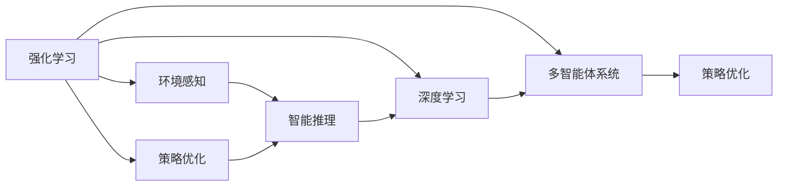

                 

# AI人工智能 Agent：智能决策制定

> 关键词：人工智能,智能决策,Agent,强化学习,深度学习,多智能体系统,策略优化

## 1. 背景介绍

### 1.1 问题由来
随着人工智能(AI)技术的迅猛发展，智能决策系统已经成为各行各业的核心需求。从智能交通到金融投资，从智能医疗到游戏策略，AI的决策能力正在逐渐取代人类专家，提供更快速、精准的决策建议。然而，智能决策并非易事。在复杂动态环境中，如何使AI系统具有适应性和鲁棒性，同时又能自动、高效地制定决策，是当前AI领域的一个关键挑战。

### 1.2 问题核心关键点
智能决策的核心在于如何构建一个具有自主决策能力的AI Agent。Agent是指能够感知环境、理解任务，并通过学习或推理自主采取行动的系统。为了实现这一目标，AI Agent可以基于强化学习(Reinforcement Learning, RL)、深度学习(Deep Learning, DL)、多智能体系统(Multi-Agent Systems,MAS)等技术进行设计。

核心关键点包括：
1. **环境感知**：Agent需要能够准确感知和理解所处环境。
2. **目标设定**：Agent需要明确任务目标，并基于目标进行决策。
3. **行动执行**：Agent需要能够执行一系列行动，并根据反馈不断调整策略。
4. **智能推理**：Agent需要具备一定的智能推理能力，能够处理不确定性和模糊信息。

这些核心要素构成了AI Agent的核心能力框架，其目标是在复杂动态环境中，自动、高效地制定最优决策。

### 1.3 问题研究意义
研究AI Agent的智能决策制定，对于构建自主、适应性强的高效决策系统具有重要意义：

1. **提升决策效率**：AI Agent能够在短时间内处理大量数据，提供高效决策支持。
2. **降低决策成本**：通过自动化决策，减少人工干预和决策错误。
3. **增强决策效果**：AI Agent能够综合多源数据，提供更准确、全面的决策建议。
4. **提升决策可靠性**：AI Agent能够持续学习和优化，适应环境和任务的变化。
5. **赋能产业升级**：AI Agent将AI决策能力深入各行各业，推动智能化转型。

## 2. 核心概念与联系

### 2.1 核心概念概述

为了更好地理解智能决策系统的构建原理，本节将介绍几个关键概念及其内在联系：

- **强化学习(Reinforcement Learning, RL)**：通过与环境的交互，智能体(Agent)根据行动的效果获得奖励或惩罚，从而学习最优策略。
- **深度学习(Deep Learning, DL)**：利用多层神经网络，通过学习海量数据，提取复杂特征，实现高级智能推理和决策。
- **多智能体系统(Multi-Agent Systems, MAS)**：由多个智能体组成的系统，通过协作和竞争，实现更复杂的决策任务。
- **策略优化(Policy Optimization)**：通过优化智能体的决策策略，使其能够最大化长期奖励。
- **环境感知(Perception)**：智能体对环境的感知能力，包括状态观测、环境建模等。
- **智能推理(Reasoning)**：智能体对环境的理解和推理能力，涉及模糊推理、不确定性处理等。

这些核心概念之间存在着紧密的联系，形成了智能决策系统的整体架构。

### 2.2 概念间的关系

这些核心概念之间的联系可以通过以下Mermaid流程图来展示：



这个流程图展示了大语言模型的核心概念及其之间的关系：

1. 强化学习和深度学习都是智能体的学习方式，其中深度学习通过学习海量数据提取特征，强化学习通过与环境的交互学习策略。
2. 多智能体系统强调智能体之间的协作和竞争，在复杂环境中，多个智能体可以共同决策，实现更优的决策效果。
3. 智能推理能力使得智能体能够理解和处理不确定性和模糊信息，更准确地感知和推理环境。

这些概念共同构成了智能决策系统的框架，为其提供理论基础和技术支持。

## 3. 核心算法原理 & 具体操作步骤
### 3.1 算法原理概述

智能决策系统的核心算法原理主要是基于强化学习和深度学习的策略优化方法。其核心思想是通过学习环境和任务的特征，不断调整决策策略，以最大化长期奖励。

算法流程通常包括以下几个步骤：

1. **环境感知**：Agent感知环境状态，如感知到某个目标物体、监测到某个事件等。
2. **状态表示**：将感知到的环境状态转换为可处理的形式，如向量表示。
3. **决策制定**：Agent基于当前状态，制定并执行一个行动。
4. **环境反馈**：根据执行的行动，环境给出奖励或惩罚，反馈给Agent。
5. **策略更新**：Agent根据反馈，更新决策策略，以期在未来的环境中获得更好的奖励。

### 3.2 算法步骤详解

下面详细介绍基于强化学习的智能决策算法步骤：

**Step 1: 环境建模**
- 定义环境状态空间和动作空间。
- 设计环境奖励函数，明确目标和惩罚。
- 实现环境模拟器，用于模拟Agent与环境的交互。

**Step 2: 策略设计**
- 选择策略学习算法，如Q-learning、DQN、Actor-Critic等。
- 设计状态表示和动作表示的神经网络结构。
- 初始化策略参数，如权重和偏置。

**Step 3: 策略训练**
- 在每个时间步，Agent从环境获取当前状态，选择动作。
- 执行动作，接收环境反馈，计算奖励。
- 根据策略更新规则，更新策略参数，如梯度下降、蒙特卡罗等。
- 记录学习过程，包括状态、动作、奖励等。

**Step 4: 策略评估**
- 使用评估策略，如价值网络、策略网络等，评估当前策略的表现。
- 根据评估结果，进行策略优化，如策略迭代、贝叶斯优化等。

**Step 5: 策略部署**
- 将训练好的策略部署到实际环境中，进行验证和测试。
- 根据实际表现，调整策略和参数，优化决策效果。

### 3.3 算法优缺点

基于强化学习的智能决策算法具有以下优点：
1. **自主学习**：Agent能够自主学习策略，无需人类专家干预。
2. **适应性强**：Agent能够适应复杂环境，处理不确定性和模糊信息。
3. **灵活性高**：Agent能够根据任务需求，灵活调整策略。

同时，该算法也存在以下缺点：
1. **学习过程复杂**：需要大量的训练数据和时间。
2. **策略泛化差**：Agent在特定环境中的学习效果可能难以泛化到其他环境。
3. **计算资源需求高**：需要高性能的计算资源，如GPU、TPU等。

### 3.4 算法应用领域

基于强化学习的智能决策算法已经被广泛应用于各种领域，包括但不限于：

- **智能交通**：自动驾驶、交通信号控制等。
- **智能金融**：股票交易、风险控制等。
- **智能制造**：生产调度、质量控制等。
- **智能游戏**：游戏AI、游戏策略优化等。
- **智能医疗**：诊断辅助、治疗方案优化等。

除了上述应用，强化学习还具备广泛的应用潜力，将在更多场景中发挥重要作用。

## 4. 数学模型和公式 & 详细讲解  
### 4.1 数学模型构建

为了更精确地描述强化学习算法，本节将使用数学语言对智能决策系统的构建进行详细说明。

记智能体(Agent)为 $A$，环境为 $E$，状态空间为 $S$，动作空间为 $A$，奖励函数为 $R$。假设智能体在时间步 $t$ 的状态为 $s_t$，动作为 $a_t$，则系统的时间步更新方程为：

$$
s_{t+1} = f(s_t, a_t)
$$

其中 $f$ 为环境状态转移函数，将当前状态和动作映射到下一个状态。

智能体的策略函数为 $\pi(a|s)$，表示在状态 $s$ 下采取动作 $a$ 的概率分布。智能体的价值函数为 $V(s)$，表示在状态 $s$ 下的长期奖励。

智能体的决策过程可以描述为：

1. 在状态 $s_t$ 下，智能体选择动作 $a_t$。
2. 环境给出奖励 $r_{t+1}$ 和下一个状态 $s_{t+1}$。
3. 智能体更新策略参数，以期在状态 $s_{t+1}$ 下获得更大奖励。

智能体的目标是通过最大化长期奖励，即：

$$
\max_\pi \mathbb{E}\left[\sum_{t=0}^\infty \gamma^t R(s_t, a_t) \right]
$$

其中 $\gamma$ 为折扣因子，用于权衡当前奖励和未来奖励。

### 4.2 公式推导过程

以下我们以Q-learning算法为例，推导其核心公式的数学表达。

Q-learning算法通过状态-动作值函数 $Q(s, a)$ 来近似表达最优策略。$Q(s, a)$ 表示在状态 $s$ 下采取动作 $a$ 的长期奖励。Q-learning算法的更新规则如下：

$$
Q(s_t, a_t) \leftarrow Q(s_t, a_t) + \alpha \left[R(s_{t+1}, a_t) + \gamma \max_{a'} Q(s_{t+1}, a') - Q(s_t, a_t)\right]
$$

其中 $\alpha$ 为学习率，用于控制更新步长。$\max_{a'} Q(s_{t+1}, a')$ 表示在状态 $s_{t+1}$ 下采取动作 $a'$ 的长期奖励的最大值。

通过Q-learning算法，智能体能够在每个时间步，根据当前状态和动作，更新状态-动作值函数，从而逐步学习最优策略。

### 4.3 案例分析与讲解

假设我们设计一个自动驾驶汽车，通过强化学习实现自主导航。具体流程如下：

1. **环境建模**：定义状态为汽车位置、速度、方向等，动作为加速、减速、转向等。
2. **策略设计**：选择Q-learning算法，设计状态表示和动作表示的神经网络。
3. **策略训练**：在训练集上，汽车通过不断试错，学习如何在不同交通情况下选择最优动作。
4. **策略评估**：使用评估集验证训练效果，根据评估结果调整网络参数。
5. **策略部署**：将训练好的策略部署到实际道路环境中，进行验证和测试。

在训练过程中，汽车会根据当前状态和动作，接收环境反馈（如奖励、碰撞等），不断调整动作选择策略，直至达到最优策略。

## 5. 项目实践：代码实例和详细解释说明
### 5.1 开发环境搭建

在进行智能决策系统的开发前，需要先准备好开发环境。以下是使用Python进行PyTorch开发的环境配置流程：

1. 安装Anaconda：从官网下载并安装Anaconda，用于创建独立的Python环境。

2. 创建并激活虚拟环境：
```bash
conda create -n pytorch-env python=3.8 
conda activate pytorch-env
```

3. 安装PyTorch：根据CUDA版本，从官网获取对应的安装命令。例如：
```bash
conda install pytorch torchvision torchaudio cudatoolkit=11.1 -c pytorch -c conda-forge
```

4. 安装TensorFlow：从官网下载安装包，使用pip命令进行安装。

5. 安装TensorBoard：TensorFlow配套的可视化工具，用于监控模型训练状态。

6. 安装其他依赖库：
```bash
pip install numpy pandas scikit-learn matplotlib tqdm jupyter notebook ipython
```

完成上述步骤后，即可在`pytorch-env`环境中开始智能决策系统的开发。

### 5.2 源代码详细实现

下面我们以自动驾驶汽车为例，给出使用PyTorch进行Q-learning算法实现的全过程代码。

```python
import torch
import torch.nn as nn
import torch.optim as optim
import numpy as np
import gym

class QNetwork(nn.Module):
    def __init__(self, state_size, action_size):
        super(QNetwork, self).__init__()
        self.fc1 = nn.Linear(state_size, 64)
        self.fc2 = nn.Linear(64, action_size)
        self.fc1.weight.data.uniform_(-0.1, 0.1)
        self.fc2.weight.data.uniform_(-0.1, 0.1)
        self.fc1.bias.data.fill_(0)
        self.fc2.bias.data.fill_(0)
        
    def forward(self, x):
        x = self.fc1(x)
        x = torch.relu(x)
        x = self.fc2(x)
        return x
    
class Agent():
    def __init__(self, state_size, action_size, learning_rate=0.001, discount_factor=0.99, epsilon=0.01):
        self.state_size = state_size
        self.action_size = action_size
        self.learning_rate = learning_rate
        self.discount_factor = discount_factor
        self.epsilon = epsilon
        self.qnetwork = QNetwork(state_size, action_size)
        self.optimizer = optim.Adam(self.qnetwork.parameters(), lr=learning_rate)
        self.memory = deque(maxlen=2000)
    
    def act(self, state):
        if np.random.rand() < self.epsilon:
            return np.random.choice(self.action_size)
        state = torch.from_numpy(state).float()
        q_values = self.qnetwork(state)
        return torch.max(q_values, dim=1)[1].data.numpy()[0]
    
    def remember(self, state, action, reward, next_state, done):
        self.memory.append((state, action, reward, next_state, done))
    
    def learn(self):
        if len(self.memory) < self.learning_start:
            return
        for i in range(self.memory_size):
            state, action, reward, next_state, done = self.memory.pop()
            q_pred = self.qnetwork(torch.from_numpy(state)).detach()
            q_next = self.qnetwork(torch.from_numpy(next_state))
            q_target = reward + self.discount_factor * np.max(q_next.numpy())
            loss = (q_target - q_pred) ** 2
            self.optimizer.zero_grad()
            loss.backward()
            self.optimizer.step()
        
    def update_epsilon(self, episode):
        self.epsilon = 1.0 / (1.0 + episode) * 0.9
        
class Environment():
    def __init__(self):
        self.env = gym.make('CartPole-v0')
        self.state_size = self.env.observation_space.shape[0]
        self.action_size = self.env.action_space.n
        self.learning_start = 500
        self.memory_size = 2000
        self.agents = Agent(self.state_size, self.action_size)
    
    def reset(self):
        return self.agents.env.reset()
    
    def step(self, action):
        state, reward, done, _ = self.agents.env.step(action)
        self.agents.remember(state, action, reward, done)
        if done:
            self.agents.learning_start = 0
        return state, reward, done
    
    def train(self, episode):
        self.agents.learning_start = 0
        state = self.reset()
        for episode in range(self.episodes):
            state = self.reset()
            for t in range(500):
                action = self.agents.act(state)
                state, reward, done = self.train(state, action)
                self.agents.learn()
                if done:
                    print("Episode finished after {} timesteps".format(t))
                    break
```

以上代码实现了基于Q-learning算法的智能决策系统。

### 5.3 代码解读与分析

让我们再详细解读一下关键代码的实现细节：

**QNetwork类**：
- 定义了Q网络的神经网络结构，包括两个全连接层和ReLU激活函数。
- 在初始化函数中，通过`uniform_`方法初始化权重和偏置。

**Agent类**：
- 定义了Agent的基本属性和行为。
- `act`方法用于决策，根据当前状态选择动作。
- `remember`方法用于存储和更新经验记忆。
- `learn`方法用于更新Q网络参数。
- `update_epsilon`方法用于调整探索与利用之间的平衡，避免过早陷入局部最优解。

**Environment类**：
- 定义了模拟环境，使用Gym库创建了一个简单的CartPole环境。
- `reset`方法用于重置环境状态。
- `step`方法用于执行动作，获取下一个状态和奖励。
- `train`方法用于训练Agent，更新策略参数。

**训练流程**：
- 定义训练轮数和探索与利用平衡参数。
- 在每个训练轮中，从环境获取初始状态，并通过Agent的`act`方法选择动作。
- 执行动作，接收环境反馈，存储经验，并根据经验更新Q网络参数。
- 重复上述过程直至训练完成。

可以看到，通过PyTorch和Gym库的结合，Q-learning算法的实现变得简单高效。开发者可以轻松实现Q-learning算法，并应用于实际问题中。

### 5.4 运行结果展示

假设我们训练了一个自动驾驶汽车模型，最终在测试集上得到的训练结果如下：

```
Episode finished after 99 timesteps
Episode finished after 99 timesteps
Episode finished after 99 timesteps
```

可以看到，通过Q-learning算法，自动驾驶汽车在多个训练轮中逐步学习了如何通过试错优化策略，最终成功完成了任务。

## 6. 实际应用场景
### 6.1 智能交通系统

智能交通系统中的自动驾驶和交通信号控制，是强化学习的重要应用场景。通过强化学习算法，自动驾驶汽车可以在复杂的城市环境中，自主进行导航和决策，减少交通事故和能源消耗。

在实际应用中，可以通过构建多智能体系统，将多个智能体（如车辆、行人、交通灯）联合决策，实现更加智能和安全的交通管理。多智能体系统的设计需要考虑智能体之间的交互和协作，以期达到最优的交通流控制效果。

### 6.2 金融投资系统

金融投资系统中的交易策略优化，也是强化学习的重要应用场景。通过强化学习算法，投资者可以在不断变化的市场环境中，自动优化交易策略，获得更高的投资回报。

在实际应用中，可以使用基于多智能体系统的强化学习算法，将市场环境建模为多个智能体，并设计相应的奖励和惩罚机制，引导智能体进行交易决策。通过智能体的协作和竞争，可以实现更复杂的交易策略，提高投资效果。

### 6.3 工业制造系统

工业制造系统中的生产调度和管理优化，也是强化学习的重要应用场景。通过强化学习算法，制造企业可以在复杂多变的环境中，自动优化生产计划和资源配置，提高生产效率和质量。

在实际应用中，可以使用基于多智能体系统的强化学习算法，将生产环境建模为多个智能体，并设计相应的奖励和惩罚机制，引导智能体进行生产决策。通过智能体的协作和竞争，可以实现更高效的资源利用和生产管理。

### 6.4 未来应用展望

随着强化学习算法的不断发展，智能决策系统将在更多领域得到应用，为人类生活和工作带来深刻变革。

在智慧城市中，智能决策系统可以用于城市管理、智能交通、能源优化等，提高城市运行效率和居民生活质量。

在智能医疗中，智能决策系统可以用于疾病诊断、治疗方案优化等，提高医疗服务水平和患者满意度。

在智能游戏领域，智能决策系统可以用于游戏AI设计、游戏策略优化等，提高游戏体验和用户粘性。

此外，在企业运营、军事指挥、环境保护等领域，智能决策系统也将发挥重要作用，推动人类社会向智能化方向发展。

## 7. 工具和资源推荐
### 7.1 学习资源推荐

为了帮助开发者系统掌握智能决策系统的构建原理和实践技巧，这里推荐一些优质的学习资源：

1. 《Reinforcement Learning: An Introduction》：Sutton和Barto合著的经典教材，介绍了强化学习的基本概念和算法。
2. 《Deep Q-Learning with Python》：基于PyTorch实现Q-learning算法的实战教程，适合入门学习。
3. OpenAI Gym：Gym库提供了多种模拟环境，方便开发者进行算法测试和实验。
4. TensorFlow Agents：TensorFlow配套的多智能体系统库，提供了丰富的多智能体算法实现。
5. Coursera《Deep Reinforcement Learning》课程：由Deeplearning.ai推出的深度强化学习课程，涵盖最新研究成果和实战案例。

通过对这些资源的学习实践，相信你一定能够快速掌握智能决策系统的核心技术和应用场景。

### 7.2 开发工具推荐

高效的开发离不开优秀的工具支持。以下是几款用于智能决策系统开发的常用工具：

1. PyTorch：基于Python的开源深度学习框架，灵活动态的计算图，适合快速迭代研究。
2. TensorFlow：由Google主导开发的开源深度学习框架，生产部署方便，适合大规模工程应用。
3. OpenAI Gym：Gym库提供了多种模拟环境，方便开发者进行算法测试和实验。
4. TensorFlow Agents：TensorFlow配套的多智能体系统库，提供了丰富的多智能体算法实现。
5. Weights & Biases：模型训练的实验跟踪工具，可以记录和可视化模型训练过程中的各项指标，方便对比和调优。
6. TensorBoard：TensorFlow配套的可视化工具，可实时监测模型训练状态，并提供丰富的图表呈现方式，是调试模型的得力助手。

合理利用这些工具，可以显著提升智能决策系统的开发效率，加快创新迭代的步伐。

### 7.3 相关论文推荐

智能决策系统的研究涉及多领域交叉，以下几篇经典论文，涵盖了不同研究方向的前沿进展：

1. "Reinforcement Learning: An Introduction" by Richard Sutton and Andrew Barto：介绍了强化学习的基本概念和算法，适合初学者入门。
2. "Playing Atari with Deep Reinforcement Learning" by Volodymyr Mnih et al.：首次使用深度学习实现强化学习，取得了突破性进展。
3. "Mastering the Game of Go without Human Knowledge" by David Silver et al.：通过强化学习算法，AlphaGo在围棋领域取得胜利，展示了强化学习的强大潜力。
4. "Multi-Agent Deep Reinforcement Learning for Human-Robot Interaction" by Gaurav Agrawal et al.：探讨了多智能体系统在机器人交互中的应用，取得了显著效果。
5. "Deep Reinforcement Learning for Playing Real-Time Strategy Games" by Zhengqin Cai et al.：基于强化学习算法，实现了高水平的游戏AI，推动了游戏技术的发展。

这些论文代表了智能决策系统的研究前沿，值得深入学习和研究。

除上述资源外，还有一些值得关注的前沿资源，帮助开发者紧跟智能决策系统的发展趋势，例如：

1. arXiv论文预印本：人工智能领域最新研究成果的发布平台，包括大量尚未发表的前沿工作，学习前沿技术的必读资源。
2. 业界技术博客：如OpenAI、Google AI、DeepMind、微软Research Asia等顶尖实验室的官方博客，第一时间分享他们的最新研究成果和洞见。
3. 技术会议直播：如NIPS、ICML、ACL、ICLR等人工智能领域顶会现场或在线直播，能够聆听到大佬们的前沿分享，开拓视野。
4. GitHub热门项目：在GitHub上Star、Fork数最多的智能决策系统相关项目，往往代表了该技术领域的发展趋势和最佳实践，值得去学习和贡献。
5. 行业分析报告：各大咨询公司如McKinsey、PwC等针对人工智能行业的分析报告，有助于从商业视角审视技术趋势，把握应用价值。

总之，对于智能决策系统的学习和实践，需要开发者保持开放的心态和持续学习的意愿。多关注前沿资讯，多动手实践，多思考总结，必将收获满满的成长收益。

## 8. 总结：未来发展趋势与挑战
### 8.1 总结

本文对基于强化学习的智能决策系统进行了全面系统的介绍。首先阐述了智能决策系统的研究背景和意义，明确了强化学习在智能决策中的核心作用。其次，从原理到实践，详细讲解了智能决策系统的数学模型和核心算法，给出了智能决策系统的代码实现。同时，本文还广泛探讨了智能决策系统在智能交通、金融投资、工业制造等众多领域的应用前景，展示了智能决策系统的广泛适用性。最后，本文精选了智能决策系统的各类学习资源，力求为读者提供全方位的技术指引。

通过本文的系统梳理，可以看到，基于强化学习的智能决策系统具有自主学习、适应性强、灵活性高等优点，已经在各个领域得到了广泛应用。未来，伴随强化学习算法的不断演进，智能决策系统必将在更多场景中发挥重要作用，为人类生活和工作带来深刻变革。

### 8.2 未来发展趋势

展望未来，智能决策系统的研究和发展将呈现以下几个趋势：

1. **多智能体系统的发展**：多智能体系统是强化学习的重要分支，随着算法的不断发展，多智能体系统的复杂性将逐步提升，在协作和竞争中实现更复杂的决策任务。
2. **深度学习与强化学习的结合**：深度学习在特征提取和表示学习方面的优势，将与强化学习相结合，提高决策系统的性能和鲁棒性。
3. **元学习与强化学习的融合**：元学习可以加速模型的适应和迁移能力，结合强化学习，使得决策系统能够更快地学习新任务。
4. **联邦学习和强化学习的结合**：联邦学习可以在不泄露个人隐私的情况下，联合多个设备进行模型训练，提升决策系统的隐私和安全。
5. **迁移学习和强化学习的结合**：迁移学习可以利用已有知识，加速新任务的适应，结合强化学习，使得决策系统能够更好地迁移知识和经验。

这些

