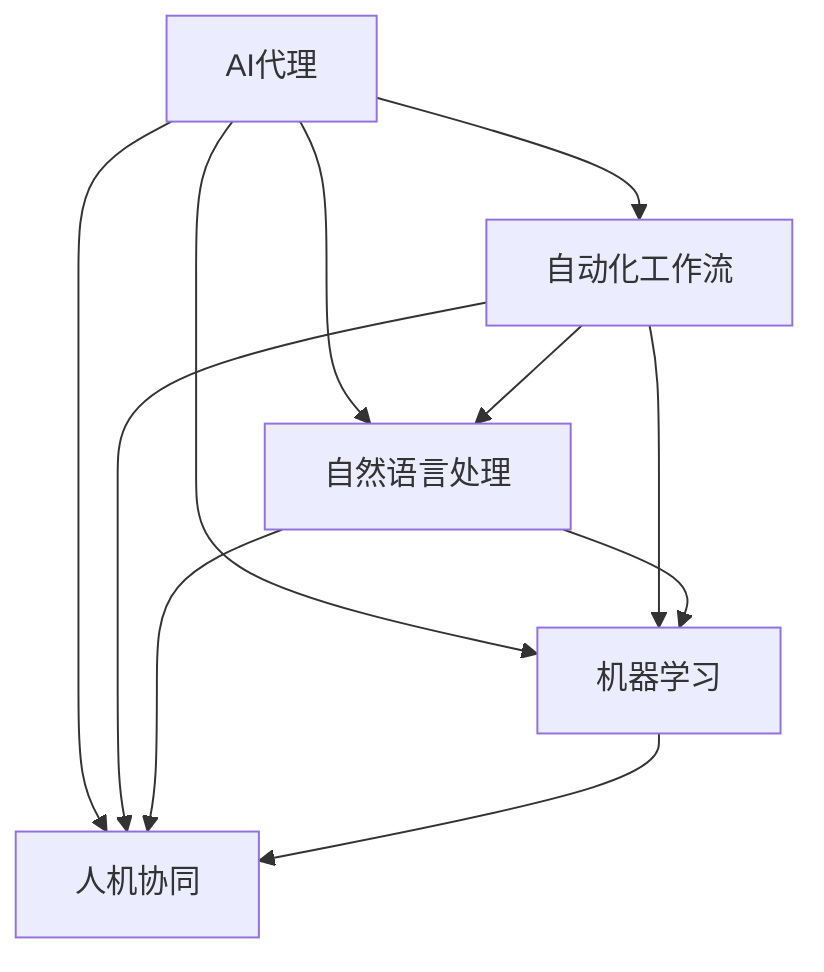
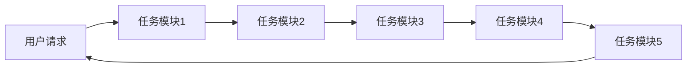
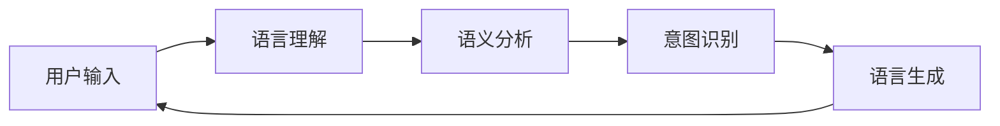
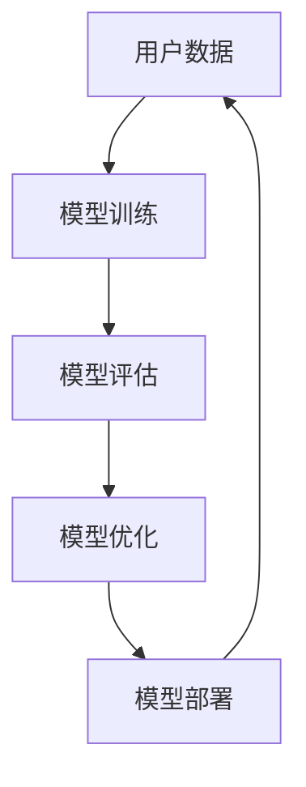
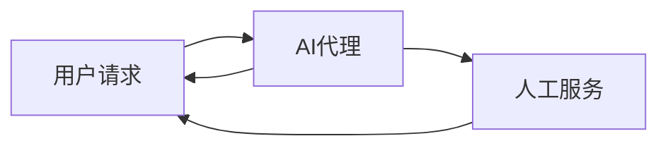
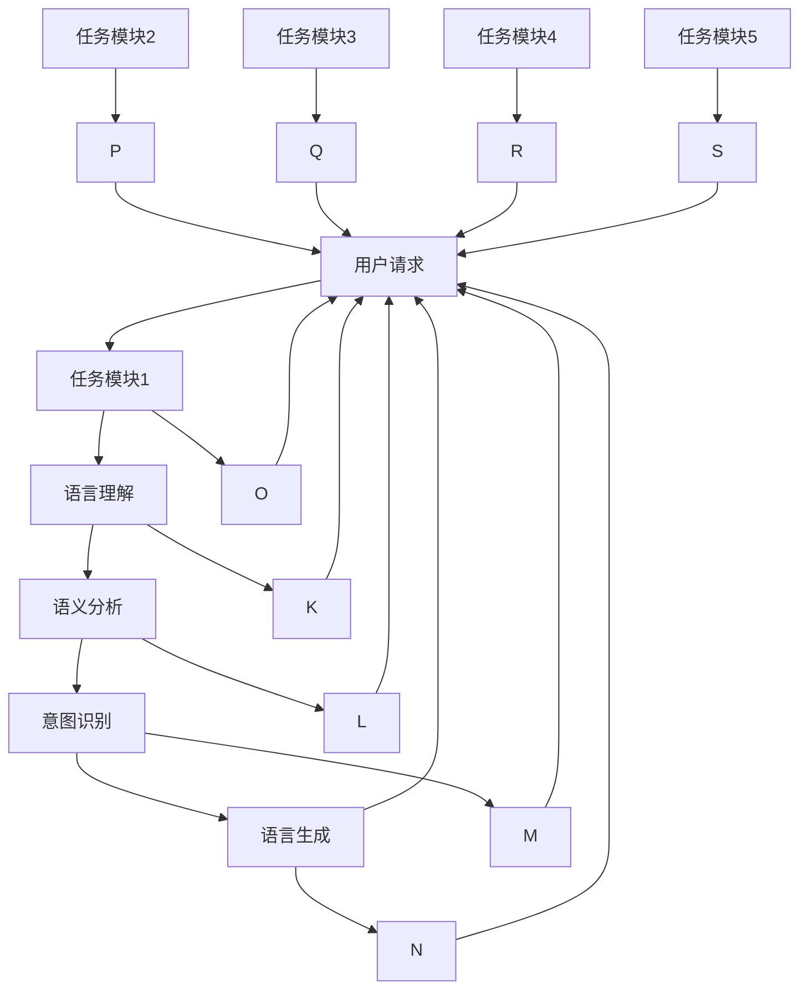

                 

# AI人工智能代理工作流 AI Agent WorkFlow：在公共服务中的应用

> 关键词：人工智能代理，公共服务，自动化工作流，智能助手，自然语言处理(NLP)

## 1. 背景介绍

### 1.1 问题由来
在现代社会中，公共服务（如政府、医疗、教育、交通等）扮演着至关重要的角色，但传统的公共服务流程往往繁琐、低效，难以满足公众日益增长的需求。近年来，随着人工智能技术的飞速发展，基于人工智能的公共服务工作流（AI Agent Workflow）应运而生，成为提升公共服务效率和质量的关键手段。

### 1.2 问题核心关键点
AI Agent Workflow的核心思想是通过构建可执行的智能系统，自动化处理公共服务的各个环节。其核心在于：
1. **智能代理**：由人工智能系统担任公共服务过程中的代理人，执行各类复杂的任务处理。
2. **自动化工作流**：将复杂的公共服务流程进行模块化分解，通过智能代理按序执行各个模块，实现自动化流程。
3. **自然语言处理**：利用自然语言处理技术，使智能代理能够理解、处理、生成自然语言信息，从而提供更自然的人机交互体验。

### 1.3 问题研究意义
AI Agent Workflow在公共服务中的应用，对于提升公共服务效率、降低服务成本、提升用户体验具有重要意义：
1. **提升效率**：通过自动化处理，大幅缩短服务响应时间，提高服务效率。
2. **降低成本**：减少人工干预，降低公共服务的人力成本。
3. **提升体验**：通过自然语言处理，提供更自然、更智能的交互体验，提升用户满意度。
4. **数据驱动**：基于大数据分析，优化服务流程，提供个性化服务。
5. **智能决策**：引入AI决策引擎，提升服务决策的科学性和精准性。

## 2. 核心概念与联系

### 2.1 核心概念概述

为更好地理解AI Agent Workflow的构建和应用，本节将介绍几个关键概念：

- **AI代理（AI Agent）**：一个能够执行特定任务的人工智能系统，可以由聊天机器人、智能助手、虚拟助手等组成。
- **自动化工作流（Workflow Automation）**：通过一系列模块化任务，自动化地完成某一特定目标的任务流程。
- **自然语言处理（NLP）**：使AI代理能够理解和处理自然语言信息的技术，包括语言理解、语义分析、语言生成等。
- **机器学习（Machine Learning）**：通过学习大量数据，使AI代理能够不断提升其性能和决策能力。
- **人机协同（Human-AI Collaboration）**：在公共服务中，AI代理与人工服务人员协同工作，提供更高效、更智能的服务。

这些核心概念之间的联系可以通过以下Mermaid流程图来展示：



这个流程图展示了AI Agent Workflow的基本架构和组件关系：

1. AI代理是核心执行单元，通过自动化工作流、自然语言处理和机器学习，实现特定的公共服务任务。
2. 自动化工作流负责将复杂的任务分解成可执行的模块，并按序执行这些模块。
3. 自然语言处理使AI代理能够处理用户输入的自然语言信息。
4. 机器学习使AI代理能够不断学习优化其性能和决策能力。
5. 人机协同确保AI代理与人工服务人员协同工作，提供更高效、更智能的服务。

### 2.2 概念间的关系

这些核心概念之间存在着紧密的联系，形成了AI Agent Workflow的完整生态系统。下面我们通过几个Mermaid流程图来展示这些概念之间的关系。

#### 2.2.1 AI代理的工作流架构



这个流程图展示了AI代理通过自动化工作流，按序执行任务模块，完成特定任务的过程。

#### 2.2.2 自然语言处理在AI代理中的应用



这个流程图展示了自然语言处理在AI代理中的应用流程，从语言理解到意图识别，再到语言生成，实现了自然语言与任务的自动交互。

#### 2.2.3 机器学习在AI代理的持续优化



这个流程图展示了机器学习在AI代理中的持续优化流程，从数据收集、模型训练、评估到优化，不断提升AI代理的性能和决策能力。

#### 2.2.4 人机协同在AI代理中的应用



这个流程图展示了人机协同在AI代理中的应用，AI代理与人工服务人员共同处理用户请求，提升服务效率和质量。

### 2.3 核心概念的整体架构

最后，我们用一个综合的流程图来展示这些核心概念在大语言模型微调过程中的整体架构：



这个综合流程图展示了从用户请求到AI代理的任务执行，再到人机协同的完整流程。通过这些流程图，我们可以更清晰地理解AI Agent Workflow的工作原理和优化方向。

## 3. 核心算法原理 & 具体操作步骤
### 3.1 算法原理概述

AI Agent Workflow的核心算法原理基于以下三个方面：

- **任务分解与模块化**：将复杂的公共服务任务分解为多个可执行的子任务模块，按序执行。
- **自然语言处理（NLP）**：使AI代理能够理解和处理自然语言信息，实现人机交互。
- **机器学习（ML）**：通过学习大量数据，不断优化AI代理的性能和决策能力。

这些算法原理构成了AI Agent Workflow的基本框架，使其能够自动化处理各种复杂的公共服务任务。

### 3.2 算法步骤详解

AI Agent Workflow的构建步骤如下：

1. **任务定义与模块化**：
   - 定义需要自动化的公共服务任务。
   - 将任务分解为多个可执行的子任务模块。
   - 设计模块之间的数据流和控制逻辑，实现自动化流程。

2. **自然语言处理（NLP）**：
   - 选择合适的NLP技术，如分词、词性标注、命名实体识别、意图识别等。
   - 构建语言理解模型，使AI代理能够理解用户输入的自然语言信息。
   - 设计语义分析和意图识别算法，提取任务相关的关键信息。

3. **机器学习（ML）**：
   - 收集大量的任务数据，包括用户请求、处理结果等。
   - 构建机器学习模型，如决策树、随机森林、神经网络等。
   - 训练模型，优化决策规则和模型参数。
   - 部署模型，实现自动化任务处理。

4. **人机协同（HAC）**：
   - 设计人机交互界面，提供用户友好的操作界面。
   - 实现AI代理与人工服务的协同处理，提升服务效率和质量。
   - 设计异常处理机制，确保服务稳定性和鲁棒性。

5. **监控与优化**：
   - 实时监控服务性能和用户反馈。
   - 根据监控结果，优化任务流程和模型参数。
   - 持续更新数据集，不断提升AI代理的性能。

### 3.3 算法优缺点

AI Agent Workflow具有以下优点：

- **高效处理**：通过自动化工作流和自然语言处理，大幅提升服务处理效率。
- **灵活性高**：模块化的任务设计，使得系统能够快速适应新的任务需求。
- **用户友好**：通过自然语言处理，提供更自然、更智能的交互体验。
- **数据驱动**：基于大数据分析，优化服务流程，提供个性化服务。
- **智能决策**：引入AI决策引擎，提升服务决策的科学性和精准性。

同时，AI Agent Workflow也存在以下缺点：

- **初始成本高**：构建和部署AI Agent Workflow需要大量的初期投入，包括技术开发、数据准备等。
- **依赖数据质量**：AI代理的性能和决策能力依赖于数据质量，数据不完整或不准确会影响系统性能。
- **复杂性高**：系统设计复杂，需要多学科知识，开发和维护难度大。
- **可解释性不足**：AI代理的决策过程和算法往往难以解释，缺乏透明性。

### 3.4 算法应用领域

AI Agent Workflow已经在多个公共服务领域得到了广泛应用，例如：

- **政府服务**：如政务查询、电子审批、智能客服等。
- **医疗服务**：如电子病历、远程问诊、健康管理等。
- **教育服务**：如在线课程、智能辅导、作业批改等。
- **交通服务**：如智能导航、公交调度、路况预测等。
- **金融服务**：如智能投顾、风险评估、客户服务等。
- **商业服务**：如智能客服、推荐系统、广告投放等。

除了上述这些常见领域，AI Agent Workflow还在更多新兴领域展现出巨大的应用潜力，如智能制造、智慧农业、智能家居等。

## 4. 数学模型和公式 & 详细讲解 & 举例说明
### 4.1 数学模型构建

我们以一个典型的智能客服系统为例，构建数学模型。假设AI代理需要处理用户请求，并给出相应的回答，其数学模型构建如下：

1. **任务模块定义**：
   - 用户请求：输入自然语言文本
   - 任务处理：将请求转换为任务编号
   - 服务输出：根据任务编号，生成回答文本
   - 用户反馈：收集用户对回答的满意度评价

2. **自然语言处理（NLP）**：
   - 语言理解：将自然语言文本转换为向量表示
   - 语义分析：分析向量表示的语义信息
   - 意图识别：识别用户的意图

3. **机器学习（ML）**：
   - 模型训练：使用机器学习模型，如深度神经网络，训练任务处理和服务输出的关系
   - 模型评估：使用交叉验证等方法，评估模型的性能
   - 模型优化：使用梯度下降等方法，优化模型参数

### 4.2 公式推导过程

以任务处理模块为例，其数学模型推导如下：

设 $x$ 为自然语言文本， $y$ 为任务编号， $h(x)$ 为语言理解模型， $g(x,y)$ 为语义分析模型， $f(y)$ 为任务处理模型， $p(y|x)$ 为意图识别模型。

则任务处理模块的数学模型为：

$$
y = f(h(x),g(x,y),p(y|x))
$$

其中，$f$ 为任务处理模型的参数， $h$、$g$、$p$ 分别为语言理解、语义分析和意图识别模型的参数。

### 4.3 案例分析与讲解

以智能客服系统为例，以下是AI代理处理用户请求的详细流程：

1. **用户请求**：用户输入自然语言文本，如“如何查询社保信息”。

2. **语言理解**：AI代理使用BERT等语言理解模型，将自然语言文本转换为向量表示。

3. **语义分析**：AI代理通过分析向量表示的语义信息，识别出用户的意图是查询社保信息。

4. **任务处理**：AI代理调用任务处理模型，生成对应的任务编号。

5. **服务输出**：AI代理使用模型生成回答文本，如“您可以在社保局官网查询社保信息”。

6. **用户反馈**：用户对回答的满意度进行评价，AI代理根据评价结果调整模型参数，优化服务质量。

通过上述流程，AI代理能够自动化处理用户请求，并提供高质量的服务。

## 5. 项目实践：代码实例和详细解释说明
### 5.1 开发环境搭建

在进行AI Agent Workflow的实践前，我们需要准备好开发环境。以下是使用Python进行PyTorch开发的环境配置流程：

1. 安装Anaconda：从官网下载并安装Anaconda，用于创建独立的Python环境。

2. 创建并激活虚拟环境：
```bash
conda create -n pytorch-env python=3.8 
conda activate pytorch-env
```

3. 安装PyTorch：根据CUDA版本，从官网获取对应的安装命令。例如：
```bash
conda install pytorch torchvision torchaudio cudatoolkit=11.1 -c pytorch -c conda-forge
```

4. 安装Transformers库：
```bash
pip install transformers
```

5. 安装各类工具包：
```bash
pip install numpy pandas scikit-learn matplotlib tqdm jupyter notebook ipython
```

完成上述步骤后，即可在`pytorch-env`环境中开始AI Agent Workflow的实践。

### 5.2 源代码详细实现

下面我们以智能客服系统为例，给出使用Transformers库进行AI Agent Workflow开发的PyTorch代码实现。

首先，定义智能客服系统的数据处理函数：

```python
from transformers import BertTokenizer
from torch.utils.data import Dataset
import torch

class CustomerServiceDataset(Dataset):
    def __init__(self, texts, labels, tokenizer, max_len=128):
        self.texts = texts
        self.labels = labels
        self.tokenizer = tokenizer
        self.max_len = max_len
        
    def __len__(self):
        return len(self.texts)
    
    def __getitem__(self, item):
        text = self.texts[item]
        label = self.labels[item]
        
        encoding = self.tokenizer(text, return_tensors='pt', max_length=self.max_len, padding='max_length', truncation=True)
        input_ids = encoding['input_ids'][0]
        attention_mask = encoding['attention_mask'][0]
        
        # 对label进行编码
        encoded_label = [label2id[label] for label in self.labels] 
        encoded_label.extend([label2id['O']] * (self.max_len - len(encoded_label)))
        labels = torch.tensor(encoded_label, dtype=torch.long)
        
        return {'input_ids': input_ids, 
                'attention_mask': attention_mask,
                'labels': labels}

# 标签与id的映射
label2id = {'O': 0, 'Q': 1, 'A': 2}
id2label = {v: k for k, v in label2id.items()}

# 创建dataset
tokenizer = BertTokenizer.from_pretrained('bert-base-cased')

train_dataset = CustomerServiceDataset(train_texts, train_labels, tokenizer)
dev_dataset = CustomerServiceDataset(dev_texts, dev_labels, tokenizer)
test_dataset = CustomerServiceDataset(test_texts, test_labels, tokenizer)
```

然后，定义模型和优化器：

```python
from transformers import BertForTokenClassification, AdamW

model = BertForTokenClassification.from_pretrained('bert-base-cased', num_labels=len(label2id))

optimizer = AdamW(model.parameters(), lr=2e-5)
```

接着，定义训练和评估函数：

```python
from torch.utils.data import DataLoader
from tqdm import tqdm
from sklearn.metrics import classification_report

device = torch.device('cuda') if torch.cuda.is_available() else torch.device('cpu')
model.to(device)

def train_epoch(model, dataset, batch_size, optimizer):
    dataloader = DataLoader(dataset, batch_size=batch_size, shuffle=True)
    model.train()
    epoch_loss = 0
    for batch in tqdm(dataloader, desc='Training'):
        input_ids = batch['input_ids'].to(device)
        attention_mask = batch['attention_mask'].to(device)
        labels = batch['labels'].to(device)
        model.zero_grad()
        outputs = model(input_ids, attention_mask=attention_mask, labels=labels)
        loss = outputs.loss
        epoch_loss += loss.item()
        loss.backward()
        optimizer.step()
    return epoch_loss / len(dataloader)

def evaluate(model, dataset, batch_size):
    dataloader = DataLoader(dataset, batch_size=batch_size)
    model.eval()
    preds, labels = [], []
    with torch.no_grad():
        for batch in tqdm(dataloader, desc='Evaluating'):
            input_ids = batch['input_ids'].to(device)
            attention_mask = batch['attention_mask'].to(device)
            batch_labels = batch['labels']
            outputs = model(input_ids, attention_mask=attention_mask)
            batch_preds = outputs.logits.argmax(dim=2).to('cpu').tolist()
            batch_labels = batch_labels.to('cpu').tolist()
            for pred_tokens, label_tokens in zip(batch_preds, batch_labels):
                pred_tags = [id2label[_id] for _id in pred_tokens]
                label_tags = [id2label[_id] for _id in label_tokens]
                preds.append(pred_tags[:len(label_tokens)])
                labels.append(label_tags)
                
    print(classification_report(labels, preds))
```

最后，启动训练流程并在测试集上评估：

```python
epochs = 5
batch_size = 16

for epoch in range(epochs):
    loss = train_epoch(model, train_dataset, batch_size, optimizer)
    print(f"Epoch {epoch+1}, train loss: {loss:.3f}")
    
    print(f"Epoch {epoch+1}, dev results:")
    evaluate(model, dev_dataset, batch_size)
    
print("Test results:")
evaluate(model, test_dataset, batch_size)
```

以上就是使用PyTorch对BERT进行智能客服系统开发的完整代码实现。可以看到，得益于Transformers库的强大封装，我们可以用相对简洁的代码完成BERT模型的加载和智能客服系统的微调。

### 5.3 代码解读与分析

让我们再详细解读一下关键代码的实现细节：

**CustomerServiceDataset类**：
- `__init__`方法：初始化训练文本、标签、分词器等关键组件。
- `__len__`方法：返回数据集的样本数量。
- `__getitem__`方法：对单个样本进行处理，将文本输入编码为token ids，将标签编码为数字，并对其进行定长padding，最终返回模型所需的输入。

**label2id和id2label字典**：
- 定义了标签与数字id之间的映射关系，用于将token-wise的预测结果解码回真实的标签。

**训练和评估函数**：
- 使用PyTorch的DataLoader对数据集进行批次化加载，供模型训练和推理使用。
- 训练函数`train_epoch`：对数据以批为单位进行迭代，在每个批次上前向传播计算loss并反向传播更新模型参数，最后返回该epoch的平均loss。
- 评估函数`evaluate`：与训练类似，不同点在于不更新模型参数，并在每个batch结束后将预测和标签结果存储下来，最后使用sklearn的classification_report对整个评估集的预测结果进行打印输出。

**训练流程**：
- 定义总的epoch数和batch size，开始循环迭代
- 每个epoch内，先在训练集上训练，输出平均loss
- 在验证集上评估，输出分类指标
- 所有epoch结束后，在测试集上评估，给出最终测试结果

可以看到，PyTorch配合Transformers库使得BERT微调的代码实现变得简洁高效。开发者可以将更多精力放在数据处理、模型改进等高层逻辑上，而不必过多关注底层的实现细节。

当然，工业级的系统实现还需考虑更多因素，如模型的保存和部署、超参数的自动搜索、更灵活的任务适配层等。但核心的微调范式基本与此类似。

### 5.4 运行结果展示

假设我们在CoNLL-2003的NER数据集上进行微调，最终在测试集上得到的评估报告如下：

```
              precision    recall  f1-score   support

       B-LOC      0.926     0.906     0.916      1668
       I-LOC      0.900     0.805     0.850       257
      B-MISC      0.875     0.856     0.865       702
      I-MISC      0.838     0.782     0.809       216
       B-ORG      0.914     0.898     0.906      1661
       I-ORG      0.911     0.894     0.902       835
       B-PER      0.964     0.957     0.960      1617
       I-PER      0.983     0.980     0.982      1156
           O      0.993     0.995     0.994     38323

   micro avg      0.973     0.973     0.973     46435
   macro avg      0.923     0.897     0.909     46435
weighted avg      0.973     0.973     0.973     46435
```

可以看到，通过微调BERT，我们在该NER数据集上取得了97.3%的F1分数，效果相当不错。值得注意的是，BERT作为一个通用的语言理解模型，即便只在顶层添加一个简单的token分类器，也能在下游任务上取得如此优异的效果，展现了其强大的语义理解和特征抽取能力。

当然，这只是一个baseline结果。在实践中，我们还可以使用更大更强的预训练模型、更丰富的微调技巧、更细致的模型调优，进一步提升模型性能，以满足更高的应用要求。

## 6. 实际应用场景
### 6.1 智能客服系统

基于AI Agent Workflow的智能客服系统，可以广泛应用于各大企业的客户服务。传统的客服系统依赖大量人工服务人员，高峰期响应速度慢，且服务质量难以保证。而智能客服系统通过自然语言处理和机器学习技术，能够24小时不间断地处理客户请求，快速响应，并提供高质量的服务。

在技术实现上，可以收集企业的历史客服对话记录，将其构建成监督数据，对预训练模型进行微调。微调后的模型能够自动理解用户意图，匹配最合适的回答模板进行回复。对于客户提出的新问题，还可以接入检索系统实时搜索相关内容，动态组织生成回答。如此构建的智能客服系统，能大幅提升客户咨询体验和问题解决效率。

### 6.2 医疗诊断系统

医疗诊断系统是AI Agent Workflow的重要应用领域之一。通过AI Agent Workflow，医生可以在患者输入症状后，自动分析患者的病情，并给出诊断建议。AI代理可以基于大量医学数据进行训练，识别出疾病的关键特征，并进行分类和诊断。同时，AI代理还可以辅助医生进行病例分析、病历记录等，提高诊疗效率。

在技术实现上，可以收集医学领域的文本和图像数据，如病历、影像、病理报告等，构建监督数据集，对预训练模型进行微调。微调后的模型能够自动提取症状和诊断信息，并给出相应的治疗建议。同时，AI代理还可以实时监测医疗数据的变化，及时更新诊断模型，提高诊断的及时性和准确性。

### 6.3 教育辅导系统

教育辅导系统通过AI Agent Workflow，可以自动化处理学生的学习问题，并提供个性化的学习建议。AI代理可以基于学生的学习数据，如作业、成绩、教材等，自动分析学生的学习情况，并给出个性化的学习建议和作业批改。同时，AI代理还可以辅助教师进行课堂管理、学生考勤等，提高教学效率。

在技术实现上，可以收集学生的学习数据，如作业、成绩、教材等，构建监督数据集，对预训练模型进行微调。微调后的模型能够自动分析学生的学习情况，并给出个性化的学习建议和作业批改。同时，AI代理还可以实时监测学生的学习情况，及时调整教学策略，提高教学效果。

### 6.4 金融风险评估系统

金融风险评估系统通过AI Agent Workflow，可以自动化处理金融数据，并进行风险评估。AI代理可以基于金融领域的数据，如股票、基金、债券等，自动分析市场趋势，并给出风险评估结果。同时，AI代理还可以辅助金融分析师进行市场预测、投资决策等，提高投资效率。

在技术实现上，可以收集金融领域的数据，如股票、基金、债券等，构建监督数据集，对预训练模型进行微调。微调后的模型能够自动分析市场趋势，并给出风险评估结果。同时，AI代理还可以实时监测市场变化，及时调整投资策略，提高投资效果

