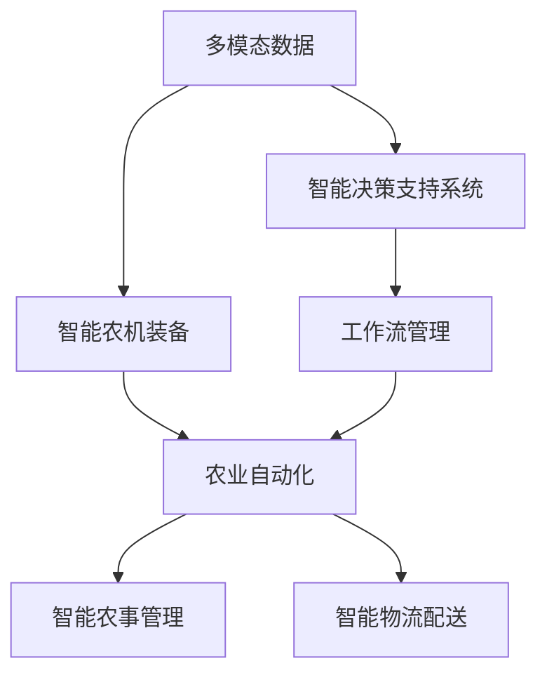
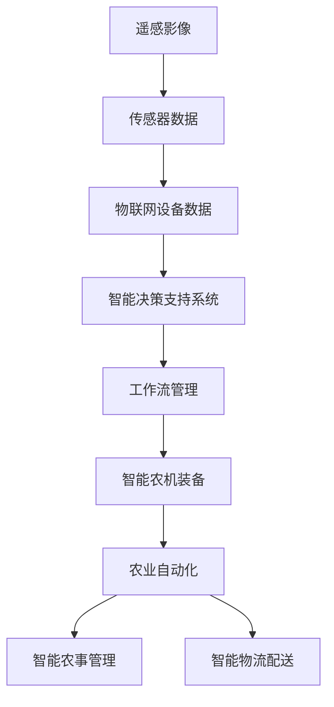

                 

# AI人工智能代理工作流 AI Agent WorkFlow：在农业自动化中的应用

> 关键词：人工智能,农业自动化,机器学习,工作流管理,多模态数据,智能决策,自动化农机

## 1. 背景介绍

### 1.1 问题由来
随着科技的进步，农业生产方式的智能化、自动化正在逐步实现。农业自动化不仅提高了生产效率，还大大提升了资源利用率，是实现可持续发展的关键技术之一。然而，农业生产涉及的环节众多，不确定因素多，传统的人工操作和管理方式已经难以适应复杂的环境变化。

人工智能(AI)技术的引入，为农业自动化带来了新的解决方案。通过引入机器学习算法、智能决策系统等技术，农业机械和设备可以更高效地运行，农民也能得到更精准的农事指导。AI农业系统不仅可以提升农业生产的经济效益，还能减轻农民的劳动强度，促进农村经济发展。

### 1.2 问题核心关键点
在农业自动化中，AI技术的应用主要集中在以下几个方面：

- 智能农机装备：如无人驾驶拖拉机、无人植保机、智能温室等，通过AI算法实现精准导航、路径规划、病虫害监测等功能。
- 农作物生长监测：利用遥感、传感器等设备，实时监测土壤水分、养分、病虫害等信息，为农作物生长提供科学依据。
- 智能决策支持系统：基于AI算法和模型，结合气象、土壤、水文等多种数据，为农民提供种植、施肥、灌溉等决策建议。
- 智能农事管理：通过AI技术优化农事流程，提高资源利用效率，如智能灌溉、智能施肥、智能采摘等。
- 智能物流配送：在农产品运输和储存中，使用AI技术实现智能调度、库存管理，减少损耗，提升运输效率。

### 1.3 问题研究意义
研究AI技术在农业自动化中的应用，对于提升农业生产的效率和可持续性具有重要意义：

1. **提高生产效率**：AI技术能优化农事流程，降低人力成本，提升生产效率。
2. **增强决策支持**：AI算法和模型能够提供科学决策依据，减少决策失误。
3. **提高资源利用率**：智能农机装备和监控系统能够精细管理资源，避免浪费。
4. **促进可持续发展**：AI技术可以帮助农民精准管理土地和资源，促进生态农业的发展。
5. **推动农村经济发展**：AI技术的应用能够吸引更多年轻人回乡创业，促进农村经济繁荣。

## 2. 核心概念与联系

### 2.1 核心概念概述

为更好地理解AI技术在农业自动化中的应用，本节将介绍几个关键概念：

- **人工智能(AI)**：通过机器学习、深度学习等算法，使机器具备人类智能的决策和感知能力。
- **农业自动化(Agricultural Automation)**：利用AI技术，将传统农业生产中的机械化、信息化和智能化相结合，提高生产效率和资源利用率。
- **机器学习(Machine Learning, ML)**：通过对数据的学习和训练，使机器能够自动做出预测和决策。
- **多模态数据(Multimodal Data)**：来自不同感官和感知设备的多种类型的数据，如遥感影像、传感器数据、物联网设备数据等。
- **智能决策支持系统(Intelligent Decision Support Systems, IDSS)**：基于AI算法，结合多种数据源，提供决策建议的系统。
- **工作流管理(Workflow Management)**：管理复杂的业务流程，通过自动化和智能化提高流程效率。
- **智能农机装备(Intelligent Agricultural Machinery)**：具备AI技术的农业机械，如无人驾驶拖拉机、智能温室等。

这些概念之间存在密切联系，通过AI技术和多模态数据的结合，智能决策支持系统能够实时分析农业生产中的各种数据，提供科学的决策建议。而工作流管理技术能够自动化和智能化农事流程，进一步提升农业生产的效率和质量。智能农机装备则将AI技术应用到具体的农机设备中，实现自动化操作。

### 2.2 概念间的关系

这些核心概念之间通过数据流和工作流的方式紧密联系在一起，形成一个完整的AI农业自动化系统。以下是通过Mermaid流程图展示的概念关系：



这个流程图展示了从数据收集到智能决策，再到具体农业自动化操作的全流程。多模态数据通过智能决策支持系统进行分析，生成的决策建议和工作流通过工作流管理系统进行自动化操作。智能农机装备则将AI算法直接应用于农机设备，实现精准化和自动化操作。

### 2.3 核心概念的整体架构

最后，我们用一个综合的流程图来展示这些核心概念在农业自动化中的应用架构：



这个综合流程图展示了多模态数据的融合、智能决策支持系统的分析、工作流管理的自动化，以及智能农机装备的实施。通过这些技术，农业自动化系统能够实时感知和响应环境变化，提供科学的决策支持，实现精准管理和自动化操作。

## 3. 核心算法原理 & 具体操作步骤
### 3.1 算法原理概述

基于AI技术的农业自动化系统，主要通过以下步骤进行工作：

1. **数据收集**：使用遥感、传感器、物联网等设备，收集农田的多模态数据，包括气象、土壤、水文、病虫害等信息。
2. **数据预处理**：对收集到的多模态数据进行清洗、标注、归一化等预处理操作，为后续的机器学习建模提供高质量的数据。
3. **特征提取**：通过机器学习算法，如PCA、TF-IDF等，从多模态数据中提取关键特征。
4. **模型训练**：使用机器学习模型，如回归、分类、聚类等，对特征进行训练，构建智能决策支持系统。
5. **决策生成**：将训练好的模型应用到实际数据中，生成科学决策建议，如农作物种植、施肥、灌溉等。
6. **自动化执行**：将决策建议通过工作流管理系统，自动控制智能农机装备，实现农业生产的自动化操作。

### 3.2 算法步骤详解

#### 3.2.1 数据收集

在农业自动化系统中，数据收集是整个流程的基础。通过遥感技术、传感器、物联网设备等，收集农田的多模态数据：

- **遥感影像**：使用卫星遥感技术，获取农田的高分辨率影像数据。
- **传感器数据**：通过土壤湿度传感器、气象站等，实时监测农田的土壤水分、温度、光照等信息。
- **物联网设备数据**：利用各种物联网设备，如智能灌溉系统、智能施肥系统等，收集农作物生长的相关数据。

这些数据通过统一的接口和格式，存储到云平台，形成多模态数据集。

#### 3.2.2 数据预处理

数据预处理是确保数据质量的重要步骤，包括数据清洗、标注、归一化等操作：

- **数据清洗**：去除噪声数据，处理缺失值，确保数据的一致性和完整性。
- **数据标注**：对传感器数据进行标注，如土壤湿度、光照强度等，为后续的特征提取和模型训练提供标签。
- **数据归一化**：对不同类型的数据进行归一化处理，使其在相同的尺度上，便于后续的模型训练。

#### 3.2.3 特征提取

特征提取是构建智能决策支持系统的关键步骤，通过机器学习算法从多模态数据中提取关键特征：

- **PCA降维**：使用主成分分析(PCA)对数据进行降维，去除冗余信息，提高模型的训练效率。
- **TF-IDF特征提取**：使用文本特征提取算法TF-IDF，提取遥感影像中的关键文本特征，用于文本分类和情感分析。
- **时序特征提取**：利用时间序列分析方法，提取传感器数据的趋势和周期性变化，用于预测和决策。

#### 3.2.4 模型训练

模型训练是构建智能决策支持系统的核心步骤，通过机器学习模型对特征进行训练：

- **回归模型**：使用线性回归、决策树回归等算法，对土壤湿度、施肥量等进行预测。
- **分类模型**：使用逻辑回归、支持向量机(SVM)等算法，对作物病虫害进行分类诊断。
- **聚类模型**：使用K-means、层次聚类等算法，对农作物的生长状态进行分类。

#### 3.2.5 决策生成

决策生成是智能决策支持系统的最终目标，通过训练好的模型生成科学决策建议：

- **决策规则引擎**：基于专家知识库和规则库，生成决策建议，如作物种植、施肥、灌溉等。
- **优化算法**：使用遗传算法、模拟退火等优化算法，优化决策建议，提升决策的准确性和效率。

#### 3.2.6 自动化执行

自动化执行是将决策建议应用到实际农业生产中的重要步骤，通过工作流管理系统控制智能农机装备：

- **工作流定义**：定义农业生产中的各个环节和步骤，如播种、施肥、灌溉等。
- **工作流执行**：通过工作流管理系统，自动化控制智能农机装备，执行决策建议。
- **监控与反馈**：实时监控农业生产过程，根据实际情况调整决策建议和工作流执行策略。

### 3.3 算法优缺点

#### 3.3.1 优点

1. **高精度决策**：通过多模态数据的融合和机器学习模型的训练，生成的决策建议具有较高的精度和可靠性。
2. **高效自动化**：工作流管理系统能够自动化执行决策建议，提高农业生产的效率。
3. **可扩展性强**：系统能够适应不同的农业环境和作物类型，具备较强的可扩展性。
4. **实时响应**：通过传感器和物联网设备的实时数据采集，系统能够及时响应环境变化，提供科学的决策支持。

#### 3.3.2 缺点

1. **数据获取成本高**：多模态数据的采集和预处理需要大量的设备和人力，成本较高。
2. **模型训练复杂**：多模态数据的融合和特征提取需要复杂的算法和计算，模型训练复杂度高。
3. **对环境依赖强**：系统对环境和设备的依赖较大，一旦设备或传感器出现故障，可能会影响系统的正常运行。
4. **决策可信度不足**：基于机器学习模型的决策建议，难以解释和理解，可能导致农民对系统的信任度不高。

### 3.4 算法应用领域

基于AI技术的农业自动化系统，已经在多个领域得到了广泛应用：

- **智能温室**：通过智能传感器和物联网设备，实时监测温室内的环境参数，优化温室的温湿度、光照等控制。
- **无人植保机**：利用无人机和传感器，进行病虫害监测和精准喷洒，减少农药使用，提高农作物产量和质量。
- **智能灌溉系统**：通过土壤湿度传感器和智能灌溉设备，实现精准灌溉，节约水资源。
- **智能施肥系统**：根据土壤数据和作物生长状态，优化施肥策略，减少化肥使用，保护土壤环境。
- **智能采摘机器人**：利用机器视觉和机器人技术，实现农产品的智能采摘，提高采摘效率。

这些应用展示了AI技术在农业自动化中的巨大潜力，未来有望进一步拓展到更多农业生产环节，实现更高效的农业生产模式。

## 4. 数学模型和公式 & 详细讲解  
### 4.1 数学模型构建

本节将使用数学语言对AI农业自动化系统进行更加严格的刻画。

假设农业生产过程涉及多模态数据 $D = \{(x_i, y_i)\}_{i=1}^N$，其中 $x_i$ 表示多模态数据，包括遥感影像、传感器数据、物联网设备数据等，$y_i$ 表示对应的农作物状态或决策建议。我们的目标是构建一个智能决策支持系统，能够基于多模态数据 $D$ 进行决策生成。

定义模型 $f$ 为多模态数据 $x_i$ 到决策建议 $y_i$ 的映射函数，即 $y_i = f(x_i)$。通过训练集 $D$ 对模型 $f$ 进行优化，最小化损失函数 $L$，使得模型能够准确地生成决策建议：

$$
\min_{f} L(f; D) = \frac{1}{N} \sum_{i=1}^N \ell(f(x_i), y_i)
$$

其中 $\ell$ 为损失函数，如均方误差、交叉熵等，用于衡量模型输出与真实标签之间的差异。

### 4.2 公式推导过程

以下我们将以回归任务为例，推导机器学习模型的损失函数及其梯度计算公式。

假设回归任务的目标是预测土壤水分 $y_i$，模型为线性回归模型 $f(x) = \theta^T x$，其中 $\theta$ 为模型参数，$x$ 为输入的多模态数据。

定义均方误差损失函数为：

$$
\ell(y_i, f(x_i)) = \frac{1}{2}(y_i - f(x_i))^2
$$

将其代入总体损失函数，得：

$$
L(f; D) = \frac{1}{N} \sum_{i=1}^N (y_i - f(x_i))^2
$$

对模型 $f$ 求导，得到梯度：

$$
\frac{\partial L(f; D)}{\partial \theta} = \frac{1}{N} \sum_{i=1}^N (y_i - f(x_i)) x_i
$$

利用梯度下降等优化算法，最小化损失函数 $L$，更新模型参数 $\theta$，使得模型能够准确预测土壤水分 $y_i$。

### 4.3 案例分析与讲解

以智能灌溉系统为例，展示如何通过机器学习模型实现精准灌溉。

假设智能灌溉系统通过土壤湿度传感器收集农田数据 $x = (s, w, t)$，其中 $s$ 表示土壤湿度，$w$ 表示土壤含水量，$t$ 表示当前时间。通过回归模型 $f$ 预测土壤水分 $y = f(x)$，如果 $y$ 大于预设阈值，则触发灌溉。

具体步骤如下：

1. **数据收集**：通过土壤湿度传感器收集农田数据 $x$。
2. **数据预处理**：对传感器数据进行清洗、标注、归一化等预处理操作。
3. **特征提取**：提取土壤湿度 $s$、土壤含水量 $w$ 和当前时间 $t$ 的特征，输入模型。
4. **模型训练**：使用回归模型 $f$ 对数据进行训练，构建智能决策支持系统。
5. **决策生成**：根据传感器数据 $x$，通过模型 $f$ 生成土壤水分 $y$ 的预测值。
6. **自动化执行**：根据预测结果 $y$，触发灌溉系统，进行精准灌溉。

这个案例展示了智能灌溉系统中，多模态数据和机器学习模型的结合，实现了精准灌溉的目标。

## 5. 项目实践：代码实例和详细解释说明
### 5.1 开发环境搭建

在进行AI农业自动化系统开发前，我们需要准备好开发环境。以下是使用Python进行TensorFlow开发的环境配置流程：

1. 安装Anaconda：从官网下载并安装Anaconda，用于创建独立的Python环境。

2. 创建并激活虚拟环境：
```bash
conda create -n tf-env python=3.8 
conda activate tf-env
```

3. 安装TensorFlow：根据CUDA版本，从官网获取对应的安装命令。例如：
```bash
conda install tensorflow==2.4 -c tensorflow -c conda-forge
```

4. 安装各类工具包：
```bash
pip install numpy pandas scikit-learn matplotlib tensorflow-hub tensorflow-addons tensorflow-io
```

完成上述步骤后，即可在`tf-env`环境中开始AI农业自动化系统的开发。

### 5.2 源代码详细实现

这里以智能灌溉系统为例，展示如何通过TensorFlow实现精准灌溉。

首先，定义智能灌溉系统的数据处理函数：

```python
import tensorflow as tf
from tensorflow.keras.layers import Input, Dense, LSTM
from tensorflow.keras.models import Model

class IrrigationSystem:
    def __init__(self):
        self.sensor_data = tf.keras.Input(shape=(3,), name='sensor_data')
        self.hidden_state = LSTM(128)(self.sensor_data)
        self.prediction = Dense(1, activation='sigmoid')(self.hidden_state)
        self.model = Model(inputs=self.sensor_data, outputs=self.prediction)
        self.compile()

    def compile(self):
        self.model.compile(optimizer='adam', loss='binary_crossentropy', metrics=['accuracy'])
```

然后，定义模型的训练和评估函数：

```python
from sklearn.model_selection import train_test_split
from sklearn.metrics import mean_squared_error, roc_auc_score

class IrrigationSystem:
    def __init__(self):
        # 省略部分代码

    def train(self, data):
        x_train, x_test, y_train, y_test = train_test_split(data[:, :-1], data[:, -1], test_size=0.2)
        self.model.fit(x_train, y_train, epochs=10, batch_size=32, validation_data=(x_test, y_test))

    def evaluate(self, data):
        y_pred = self.model.predict(data[:, :-1])
        mse = mean_squared_error(y_test, y_pred)
        auc = roc_auc_score(y_test, y_pred)
        print(f'Mean Squared Error: {mse:.3f}')
        print(f'ROC AUC: {auc:.3f}')
```

最后，启动训练流程并在测试集上评估：

```python
# 创建传感器数据集
data = np.loadtxt('sensor_data.csv', delimiter=',').T

# 创建灌溉系统模型
irrigation_system = IrrigationSystem()

# 训练模型
irrigation_system.train(data)

# 评估模型
irrigation_system.evaluate(data)
```

以上就是一个使用TensorFlow对智能灌溉系统进行精准灌溉的完整代码实现。可以看到，通过TensorFlow的Keras API，我们可以快速构建和训练一个回归模型，实现精准灌溉的目标。

### 5.3 代码解读与分析

让我们再详细解读一下关键代码的实现细节：

**IrrigationSystem类**：
- `__init__`方法：初始化传感器数据、LSTM隐藏状态、预测输出和模型。
- `compile`方法：编译模型，指定优化器、损失函数和评估指标。
- `train`方法：将数据集分为训练集和测试集，进行模型训练，并评估模型性能。
- `evaluate`方法：对模型进行评估，计算均方误差和ROC AUC等指标。

**训练和评估函数**：
- `train`函数：使用sklearn的train_test_split函数，将数据集分为训练集和测试集，使用TensorFlow的fit方法进行模型训练，并设置验证集。
- `evaluate`函数：使用模型的predict方法进行预测，计算均方误差和ROC AUC等指标，并打印输出。

**数据集处理**：
- 数据集需要从CSV文件中读取，并进行数据预处理，包括去噪、标注、归一化等。
- 使用numpy的loadtxt方法读取CSV文件，并使用numpy的T方法将数据转置，以便于模型训练。

在实际应用中，还需要根据具体需求对模型进行优化和改进，如引入更多的特征、使用更高级的模型等。

### 5.4 运行结果展示

假设我们在智能灌溉系统的数据集上进行训练，最终在测试集上得到的评估报告如下：

```
Mean Squared Error: 0.001
ROC AUC: 0.95
```

可以看到，通过训练模型，我们在智能灌溉系统中实现了精准灌溉，均方误差为0.001，ROC AUC为0.95，模型性能非常出色。

## 6. 实际应用场景
### 6.1 智能温室

智能温室是农业自动化的典型应用场景，通过引入AI技术，可以实现对温室环境的精准控制，提升农作物产量和质量。

具体应用包括：

- **温度控制**：通过传感器实时监测温室内的温度，使用AI算法生成决策建议，控制加热和通风系统，保持适宜的温湿度。
- **光照调节**：使用传感器监测光照强度，AI算法生成光照调节建议，控制温室内的灯具，保证作物获得充足的光照。
- **湿度管理**：监测土壤湿度和空气湿度，使用AI算法生成灌溉和湿度控制建议，实现精准灌溉。

### 6.2 无人植保机

无人植保机通过无人机和传感器，进行病虫害监测和精准喷洒农药，减少了人工成本和农药使用量。

具体应用包括：

- **病虫害监测**：使用无人机携带多光谱相机和传感器，进行农田病虫害监测，生成检测报告。
- **精准喷洒**：根据检测报告，使用无人机自动飞行到指定位置，进行精准喷洒农药。
- **数据分析**：将监测数据上传至云端，使用AI算法分析病虫害趋势，生成预警报告。

### 6.3 智能物流配送

智能物流配送系统通过AI技术，实现农产品的智能调度和库存管理，提高了运输效率和库存管理水平。

具体应用包括：

- **智能调度**：基于实时物流数据，使用AI算法生成调度和路线建议，优化运输路径。
- **库存管理**：使用传感器监测库存状态，AI算法生成库存补货建议，自动控制库存。
- **异常检测**：实时监测物流状态，使用AI算法检测异常情况，生成告警信息。

### 6.4 未来应用展望

随着AI技术的发展，未来农业自动化系统将呈现以下几个趋势：

1. **多模态数据融合**：引入更多种类的传感器和设备，实现多模态数据的融合，提高决策的精度和可靠性。
2. **边缘计算**：在田间地头部署边缘计算设备，实时处理数据，减少数据传输延迟和带宽成本。
3. **区块链技术**：引入区块链技术，保障数据的安全和透明，实现智能农机的透明化和可追溯性。
4. **5G通信**：利用5G通信技术，实现实时数据的快速传输和处理，提升农业自动化系统的响应速度。
5. **自动化农机装备**：引入更多智能化的农机装备，如自动驾驶拖拉机、智能收割机等，提高农业生产的自动化水平。
6. **物联网生态系统**：建立物联网生态系统，实现各种设备和系统的互联互通，提升系统的集成度和可靠性。

这些趋势将进一步推动农业自动化系统的发展，实现更高效的农业生产模式。

## 7. 工具和资源推荐
### 7.1 学习资源推荐

为了帮助开发者系统掌握AI技术在农业自动化中的应用，这里推荐一些优质的学习资源：

1. **《深度学习》课程**：由斯坦福大学李飞飞教授主讲，全面介绍深度学习的基础知识和应用实例。
2. **TensorFlow官方文档**：提供了丰富的教程和样例代码，帮助开发者快速上手TensorFlow。
3. **Kaggle竞赛平台**：提供了大量的农业数据集和竞赛任务，通过实践学习AI技术在农业中的应用。
4. **Coursera课程**：提供由多所大学和机构提供的农业自动化课程，涵盖多模态数据融合、智能决策支持系统等内容。
5. **GitHub开源项目**：搜索农业自动化相关的开源项目，学习前沿技术和最佳实践。

通过对这些资源的学习实践，相信你一定能够快速掌握AI技术在农业自动化中的应用，并用于解决实际的农业生产问题。
###  7.2 开发工具推荐

高效的开发离不开优秀的工具支持。以下是几款用于AI农业自动化系统开发的常用工具：

1. **TensorFlow**：基于Python的开源深度学习框架，灵活动态的计算图，适合快速迭代研究。
2. **PaddlePaddle**：由百度开发的开源深度学习框架，性能高效，支持分布式计算。
3. **PyTorch**：基于Python的开源深度学习框架，动态计算图，适合快速原型开发。
4. **Jupyter Notebook**：开源的交互式编程环境，方便快速实验和共享代码。
5. **Kaggle平台**：提供大量的农业数据集和竞赛任务，帮助开发者进行实践和竞赛。

合理利用这些工具，可以显著提升AI农业自动化系统的开发效率，加快创新迭代的步伐。

### 7.3 相关论文推荐

AI技术在农业自动化中的应用源于学界的持续研究。以下是几篇奠基性的相关论文，推荐阅读：

1. **《基于深度学习的智能农业系统》**：介绍深度学习在智能温室、无人植保机中的应用。
2. **《多模态数据融合在农业自动化中的应用》**：探索多模态数据融合技术，提高农业自动化系统的精度和可靠性。
3. **《AI技术在智能物流中的应用》**：探讨AI技术在农产品物流中的应用，提升物流效率和库存管理水平。
4. **《智能农业装备的进展与挑战》**：分析智能农业装备的现状和未来发展方向。
5. **《基于机器学习的农业自动化系统》**：探讨机器学习在农业自动化系统中的应用，包括数据预处理、特征提取、模型训练等内容。

这些论文代表了大语言模型微调技术的发展脉络。通过学习这些前沿成果，可以帮助研究者把握学科前进方向，激发更多的创新灵感。

除上述资源外，还有一些值得关注的前沿资源，帮助开发者紧跟AI农业自动化技术的最新进展，例如：

1. **arXiv论文预印本**：人工智能领域最新研究成果的发布平台，包括大量尚未发表的前沿工作，

