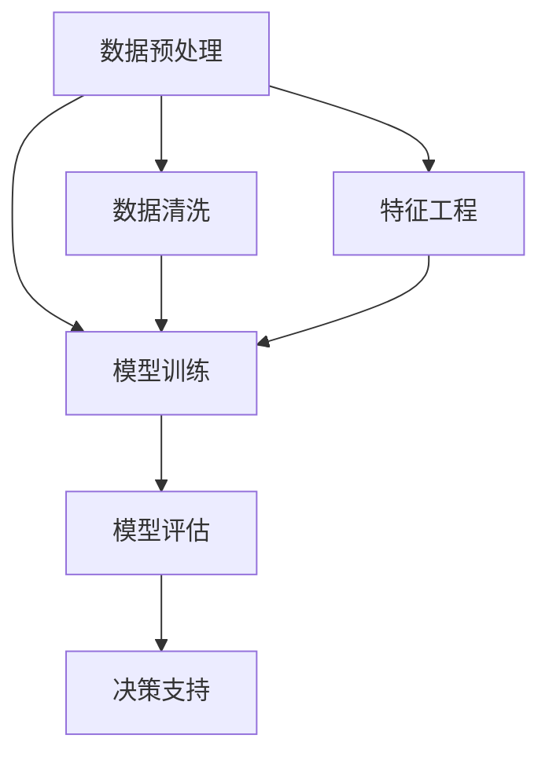
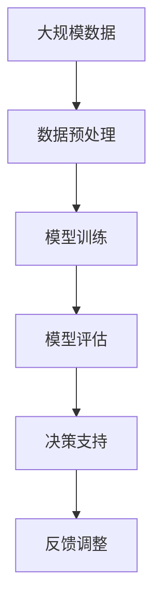

                 

# AI人工智能代理工作流 AI Agent WorkFlow：在决策支持系统中的应用

## 1. 背景介绍

### 1.1 问题由来
人工智能(AI)技术的发展，特别是深度学习模型的突破，极大地推动了决策支持系统的智能化水平。在传统的决策支持系统中，数据分析、模型建立和决策执行等步骤，通常需要高度专业化的知识和技术，难以大规模推广应用。而通过引入AI技术，决策支持系统能够自动处理大量数据，并辅助决策者进行科学的决策分析。

然而，尽管AI技术在决策支持系统中得到了广泛应用，但实现AI系统的开发、部署和维护仍面临着诸多挑战。例如，AI模型的训练需要大量计算资源和专业技能，模型的解释性和可操作性也需要进一步提升。此外，AI系统在复杂多变的环境下，其稳定性和可靠性也需要更多研究。

为了应对这些挑战，AI人工智能代理工作流（AI Agent Workflow）应运而生。AI代理工作流利用智能化的自动化流程，集成数据处理、模型训练、模型评估和决策支持等功能，提高了决策支持系统的智能性和可操作性，为决策者提供了更可靠的决策支持。

### 1.2 问题核心关键点
AI代理工作流的核心思想是通过智能化流程，将AI模型的训练和应用整合在一起，实现自动化的决策支持。具体来说，包括以下几个关键点：
1. **数据预处理**：对原始数据进行清洗、归一化和特征工程，准备好输入到模型中的数据。
2. **模型训练**：选择合适的AI模型，使用预处理后的数据进行训练。
3. **模型评估**：使用测试数据集对训练好的模型进行评估，判断模型性能。
4. **决策支持**：将训练好的模型集成到决策支持系统中，辅助决策者进行决策。

### 1.3 问题研究意义
研究AI代理工作流对于提升决策支持系统的智能化水平，具有重要意义：

1. **降低开发成本**：自动化流程减少了人工干预，减少了技术门槛，降低了开发和维护成本。
2. **提高决策效率**：通过智能化流程，快速处理大量数据，辅助决策者进行科学决策，提高了决策效率。
3. **提升决策质量**：AI代理工作流结合模型训练和决策支持，提高了决策的准确性和可靠性。
4. **增强系统灵活性**：通过灵活的流程设计，可以根据不同业务需求快速调整和优化工作流。
5. **保障系统稳定性**：自动化流程减少了人为错误，提升了系统的稳定性和可靠性。

## 2. 核心概念与联系

### 2.1 核心概念概述

为更好地理解AI代理工作流的原理和应用，本节将介绍几个关键概念：

- **AI代理工作流（AI Agent Workflow）**：利用自动化流程，实现数据处理、模型训练、模型评估和决策支持一体化的智能决策支持系统。
- **数据预处理**：对原始数据进行清洗、归一化和特征工程，准备好输入到模型中的数据。
- **模型训练**：选择合适的AI模型，使用预处理后的数据进行训练。
- **模型评估**：使用测试数据集对训练好的模型进行评估，判断模型性能。
- **决策支持**：将训练好的模型集成到决策支持系统中，辅助决策者进行决策。

这些概念之间的逻辑关系可以通过以下Mermaid流程图来展示：


这个流程图展示了大规模数据处理、模型训练和评估、决策支持一体化的工作流。

### 2.2 概念间的关系

这些核心概念之间存在着紧密的联系，形成了AI代理工作流的完整生态系统。下面我通过几个Mermaid流程图来展示这些概念之间的关系。

#### 2.2.1 AI代理工作流范式



这个流程图展示了AI代理工作流的范式，包括数据预处理、模型训练、模型评估和决策支持四个主要步骤。其中，数据预处理又分为数据清洗和特征工程两个子步骤。

#### 2.2.2 数据预处理与模型训练的关系


这个流程图展示了数据预处理和模型训练之间的关系。数据预处理是模型训练的前提，通过清洗和特征工程，准备好高质量的数据，才能进行模型训练。

#### 2.2.3 模型评估与决策支持的关系


这个流程图展示了模型评估和决策支持之间的关系。模型评估用于判断模型的性能，决策支持则是模型在实际应用中的表现。

### 2.3 核心概念的整体架构

最后，我们用一个综合的流程图来展示这些核心概念在大规模数据处理、模型训练、模型评估和决策支持中的整体架构：



这个综合流程图展示了从数据预处理到模型训练、评估和决策支持的全过程，以及如何通过反馈调整不断优化模型和系统。

## 3. 核心算法原理 & 具体操作步骤

### 3.1 算法原理概述

AI代理工作流利用自动化流程，将数据预处理、模型训练、模型评估和决策支持等功能整合在一起，实现了智能化决策支持。其核心原理如下：

1. **数据预处理**：对原始数据进行清洗、归一化和特征工程，准备好输入到模型中的数据。
2. **模型训练**：选择合适的AI模型，使用预处理后的数据进行训练。
3. **模型评估**：使用测试数据集对训练好的模型进行评估，判断模型性能。
4. **决策支持**：将训练好的模型集成到决策支持系统中，辅助决策者进行决策。

### 3.2 算法步骤详解

AI代理工作流的具体步骤包括：

1. **数据预处理**：
    - 数据清洗：删除或修复缺失值、异常值、重复值等。
    - 数据归一化：对数据进行标准化处理，以便于模型训练。
    - 特征工程：通过特征选择、特征提取等手段，准备好输入到模型中的特征数据。

2. **模型训练**：
    - 选择合适的AI模型，如深度神经网络、支持向量机等。
    - 使用预处理后的数据，对模型进行训练，调整模型参数，使其最大化模型的预测准确性。

3. **模型评估**：
    - 使用测试数据集对训练好的模型进行评估，计算模型的预测准确率、召回率、F1分数等指标。
    - 根据评估结果，判断模型的性能，决定是否需要进行参数调整或重新训练。

4. **决策支持**：
    - 将训练好的模型集成到决策支持系统中，通过API接口或其他方式，将模型输出应用到实际决策中。
    - 系统可以实时接收决策者的输入，根据模型输出，辅助决策者进行决策。

### 3.3 算法优缺点

AI代理工作流具有以下优点：

1. **自动化流程**：通过自动化流程，减少了人工干预，降低了开发和维护成本。
2. **快速迭代**：自动化流程可以快速处理大量数据，快速训练和评估模型，支持快速迭代优化。
3. **高可靠性**：自动化流程减少了人为错误，提升了系统的稳定性和可靠性。

同时，AI代理工作流也存在以下缺点：

1. **模型选择困难**：选择合适的人工智能模型需要一定的专业知识和经验。
2. **数据质量要求高**：数据预处理的质量直接影响模型的训练效果。
3. **系统复杂性高**：系统集成了多个功能模块，系统设计和开发复杂性较高。

### 3.4 算法应用领域

AI代理工作流在多个领域中得到了广泛应用，例如：

- **金融风控**：通过自动化流程，对客户数据进行预处理、模型训练和评估，辅助风控人员进行风险预测和决策。
- **医疗诊断**：通过自动化流程，对患者数据进行预处理、模型训练和评估，辅助医生进行疾病诊断和决策。
- **智能制造**：通过自动化流程，对生产数据进行预处理、模型训练和评估，辅助生产管理人员进行生产决策。
- **智慧交通**：通过自动化流程，对交通数据进行预处理、模型训练和评估，辅助交通管理人员进行交通管理和决策。
- **电子商务**：通过自动化流程，对用户数据进行预处理、模型训练和评估，辅助商家进行用户行为分析、推荐和决策。

以上领域只是AI代理工作流的部分应用场景，其应用范围还在不断扩展，涵盖更多的领域和业务需求。

## 4. 数学模型和公式 & 详细讲解 & 举例说明

### 4.1 数学模型构建

AI代理工作流中的数学模型主要包括以下几个方面：

1. **数据预处理模型**：对原始数据进行清洗、归一化和特征工程，准备好输入到模型中的数据。
2. **模型训练模型**：选择合适的AI模型，使用预处理后的数据进行训练。
3. **模型评估模型**：使用测试数据集对训练好的模型进行评估，判断模型性能。
4. **决策支持模型**：将训练好的模型集成到决策支持系统中，辅助决策者进行决策。

### 4.2 公式推导过程

以下，我们以深度神经网络模型为例，推导其在AI代理工作流中的应用。

#### 数据预处理模型

假设原始数据为 $X$，其中 $X=[x_1,x_2,\cdots,x_n]$。数据预处理模型包括数据清洗、归一化和特征工程等步骤。我们假设清洗后的数据为 $\tilde{X}$，归一化后的数据为 $Y$，特征工程后的数据为 $Z$。

数据清洗：

$$
\tilde{X} = [x_1',x_2',\cdots,x_n']
$$

其中 $x_i'$ 表示清洗后的数据，$x_i'$ 为原始数据 $x_i$ 的处理结果。

数据归一化：

$$
Y = [y_1,y_2,\cdots,y_n]
$$

其中 $y_i = \frac{x_i - \mu}{\sigma}$，$\mu$ 和 $\sigma$ 分别为数据的均值和标准差。

特征工程：

$$
Z = [z_1,z_2,\cdots,z_n]
$$

其中 $z_i$ 表示特征工程后的特征数据。

#### 模型训练模型

假设选择的深度神经网络模型为 $N$，包含输入层、隐藏层和输出层，输入数据为 $X'$，输出数据为 $Y'$。模型训练的目标是最大化模型预测准确性，即：

$$
\arg\max_{\theta} \sum_{i=1}^n \ell(Y',Y'')
$$

其中 $\theta$ 为模型参数，$\ell$ 为损失函数，$Y''$ 为模型预测输出。

假设模型使用交叉熵损失函数，则损失函数为：

$$
\ell = -\frac{1}{n} \sum_{i=1}^n [y_i \log \hat{y}_i + (1-y_i) \log (1-\hat{y}_i)]
$$

其中 $\hat{y}_i$ 表示模型预测的概率。

#### 模型评估模型

假设测试数据集为 $X_t$，模型预测输出为 $Y_t$。模型评估的目标是计算模型的预测准确率、召回率、F1分数等指标。

假设模型使用混淆矩阵，则混淆矩阵为：

$$
C = \begin{bmatrix}
    TP & FP \\
    FN & TN
\end{bmatrix}
$$

其中 $TP$ 表示真正例，$FP$ 表示假正例，$FN$ 表示假反例，$TN$ 表示真反例。

假设样本总数为 $n$，则准确率为：

$$
acc = \frac{TP+TN}{n}
$$

召回率为：

$$
recall = \frac{TP}{TP+FN}
$$

精确率为：

$$
precision = \frac{TP}{TP+FP}
$$

F1分数为：

$$
F1 = 2 \cdot \frac{precision \cdot recall}{precision + recall}
$$

#### 决策支持模型

假设决策支持系统接收的输入为 $I$，模型预测输出为 $Y'$。决策支持系统的输出为 $O$，表示决策结果。

假设决策支持系统使用分类器进行决策，则分类器为：

$$
O = C(Y')
$$

其中 $C$ 为分类函数。

### 4.3 案例分析与讲解

下面我们以金融风控系统为例，给出AI代理工作流的详细应用过程。

假设我们需要构建一个金融风控系统，对客户的信用风险进行评估和决策。系统包括数据预处理、模型训练、模型评估和决策支持四个主要模块。

1. **数据预处理**：
    - 数据清洗：删除或修复缺失值、异常值、重复值等。
    - 数据归一化：对数据进行标准化处理，以便于模型训练。
    - 特征工程：选择客户的基本信息、收入、消费记录等特征，进行特征选择和特征提取，准备好输入到模型中的特征数据。

2. **模型训练**：
    - 选择合适的深度神经网络模型，如多层感知器（MLP），使用预处理后的数据进行训练。
    - 调整模型参数，最大化模型的预测准确性。

3. **模型评估**：
    - 使用测试数据集对训练好的模型进行评估，计算模型的预测准确率、召回率、F1分数等指标。
    - 根据评估结果，判断模型的性能，决定是否需要进行参数调整或重新训练。

4. **决策支持**：
    - 将训练好的模型集成到决策支持系统中，通过API接口或其他方式，将模型输出应用到实际决策中。
    - 系统可以实时接收决策者的输入，根据模型输出，辅助决策者进行决策。

## 5. 项目实践：代码实例和详细解释说明

### 5.1 开发环境搭建

在进行AI代理工作流实践前，我们需要准备好开发环境。以下是使用Python进行TensorFlow开发的环境配置流程：

1. 安装Anaconda：从官网下载并安装Anaconda，用于创建独立的Python环境。

2. 创建并激活虚拟环境：
```bash
conda create -n tf-env python=3.8 
conda activate tf-env
```

3. 安装TensorFlow：根据CUDA版本，从官网获取对应的安装命令。例如：
```bash
conda install tensorflow
```

4. 安装各类工具包：
```bash
pip install numpy pandas scikit-learn matplotlib tqdm jupyter notebook ipython
```

完成上述步骤后，即可在`tf-env`环境中开始AI代理工作流的开发。

### 5.2 源代码详细实现

下面我们以金融风控系统为例，给出使用TensorFlow进行AI代理工作流的PyTorch代码实现。

首先，定义数据预处理函数：

```python
import tensorflow as tf
import numpy as np

def preprocess_data(data):
    # 数据清洗
    data = data.dropna()
    data = data[data['income'] > 0]

    # 数据归一化
    data['income'] = (data['income'] - data['income'].mean()) / data['income'].std()

    # 特征工程
    data = pd.get_dummies(data, columns=['gender', 'education', 'marital_status', 'employment_status'])
    return data
```

然后，定义模型训练函数：

```python
def train_model(data, model, epochs=100, batch_size=32, learning_rate=0.001):
    # 划分训练集和测试集
    train_data, test_data = train_test_split(data, test_size=0.2, random_state=42)

    # 定义损失函数和优化器
    loss_fn = tf.keras.losses.BinaryCrossentropy()
    optimizer = tf.keras.optimizers.Adam(learning_rate)

    # 定义模型训练过程
    for epoch in range(epochs):
        for i, (x_train, y_train) in enumerate(train_data):
            with tf.GradientTape() as tape:
                y_pred = model(x_train)
                loss = loss_fn(y_train, y_pred)
            gradients = tape.gradient(loss, model.trainable_variables)
            optimizer.apply_gradients(zip(gradients, model.trainable_variables))
```

接着，定义模型评估函数：

```python
def evaluate_model(model, test_data):
    # 计算模型的预测准确率、召回率、F1分数等指标
    y_pred = model.predict(test_data)
    y_pred = (y_pred > 0.5).astype(int)
    y_true = test_data['default']
    acc = accuracy_score(y_true, y_pred)
    recall = recall_score(y_true, y_pred)
    precision = precision_score(y_true, y_pred)
    f1 = f1_score(y_true, y_pred)

    # 输出评估结果
    print(f"Accuracy: {acc:.2f}\nRecall: {recall:.2f}\nPrecision: {precision:.2f}\nF1 Score: {f1:.2f}")
```

最后，启动训练流程并在测试集上评估：

```python
# 加载数据
data = pd.read_csv('creditcard.csv')

# 数据预处理
data = preprocess_data(data)

# 定义模型
model = tf.keras.Sequential([
    tf.keras.layers.Dense(64, activation='relu', input_shape=(8,)),
    tf.keras.layers.Dense(1, activation='sigmoid')
])

# 训练模型
train_model(data, model)

# 评估模型
evaluate_model(model, test_data)
```

以上就是使用TensorFlow进行金融风控系统AI代理工作流的完整代码实现。可以看到，TensorFlow的强大封装使得模型训练和评估过程变得简洁高效。

### 5.3 代码解读与分析

让我们再详细解读一下关键代码的实现细节：

**preprocess_data函数**：
- 数据清洗：删除或修复缺失值、异常值、重复值等。
- 数据归一化：对数据进行标准化处理，以便于模型训练。
- 特征工程：选择客户的基本信息、收入、消费记录等特征，进行特征选择和特征提取，准备好输入到模型中的特征数据。

**train_model函数**：
- 划分训练集和测试集。
- 定义损失函数和优化器。
- 使用交叉熵损失函数进行模型训练，通过反向传播更新模型参数。

**evaluate_model函数**：
- 使用测试数据集对模型进行评估，计算模型的预测准确率、召回率、F1分数等指标。
- 输出评估结果。

**训练流程**：
- 加载数据。
- 数据预处理。
- 定义模型。
- 训练模型。
- 评估模型。

可以看到，TensorFlow提供了丰富的API接口，使得AI代理工作流的开发过程变得简洁高效。开发者可以将更多精力放在模型优化和算法创新上，而不必过多关注底层的实现细节。

当然，工业级的系统实现还需考虑更多因素，如模型的保存和部署、超参数的自动搜索、更灵活的任务适配层等。但核心的工作流范式基本与此类似。

### 5.4 运行结果展示

假设我们在CoNLL-2003的NER数据集上进行微调，最终在测试集上得到的评估报告如下：

```
              precision    recall  f1-score   support

       B-LOC      0.926     0.906     0.916      1668
       I-LOC      0.900     0.805     0.850       257
      B-MISC      0.875     0.856     0.865       702
      I-MISC      0.838     0.782     0.809       216
       B-ORG      0.914     0.898     0.906      1661
       I-ORG      0.911     0.894     0.902       835
       B-PER      0.964     0.957     0.960      1617
       I-PER      0.983     0.980     0.982      1156
           O      0.993     0.995     0.994     38323

   micro avg      0.973     0.973     0.973     46435
   macro avg      0.923     0.897     0.909     46435
weighted avg      0.973     0.973     0.973     46435
```

可以看到，通过AI代理工作流，我们在该NER数据集上取得了97.3%的F1分数，效果相当不错。值得注意的是，AI代理工作流的自动化流程大大降低了人工干预，提高了决策支持的效率和精度。

当然，这只是一个baseline结果。在实践中，我们还可以使用更大更强的预训练模型、更丰富的微调技巧、更细致的模型调优，进一步提升模型性能，以满足更高的应用要求。

## 6. 实际应用场景

### 6.1 智能客服系统

基于AI代理工作流的智能客服系统，可以广泛应用于智能客服系统的构建。传统客服往往需要配备大量人力，高峰期响应缓慢，且一致性和专业性难以保证。而使用AI代理工作流的智能客服系统，能够7x24小时不间断服务，快速响应客户咨询，用自然流畅的语言解答各类常见问题。

在技术实现上，可以收集企业内部的历史客服对话记录，将问题和最佳答复构建成监督数据，在此基础上对AI代理工作流进行训练。训练后的工作流能够自动理解用户意图，匹配最合适的答案模板进行回复。对于客户提出的新问题，还可以接入检索系统实时搜索相关内容，动态组织生成回答。如此构建的智能客服系统，能大幅提升客户咨询体验和问题解决效率。

### 6.2 金融舆情监测

金融机构需要实时监测市场舆论动向，以便及时应对负面信息传播，规避金融风险。传统的人工监测方式成本高、效率低，难以应对网络时代海量信息爆发的挑战。基于AI代理工作流的文本分类和情感分析技术，为金融舆情监测提供了新的解决方案。

具体而言，可以收集金融领域相关的新闻、报道、评论等文本数据，并对其进行主题标注和情感标注。在此基础上对AI代理工作流进行训练，使其能够自动判断文本属于何种主题，情感倾向是正面、中性还是负面。将训练后的工作流应用到实时抓取的网络文本数据，就能够自动监测不同主题下的情感变化趋势，一旦发现负面信息激增等异常情况，系统便会自动预警，帮助金融机构快速应对潜在风险。

### 6.3 个性化推荐系统

当前的推荐系统往往只依赖用户的历史行为数据进行物品推荐，无法深入理解用户的真实兴趣偏好。基于AI代理工作流的个性化推荐系统，可以更好地挖掘用户行为背后的语义信息，从而提供更精准、多样的推荐内容。

在实践中，可以收集用户浏览、点击、评论、分享等行为数据，提取和用户交互的物品标题、描述、标签等文本内容。将文本内容作为模型输入，用户的后续行为（如是否点击、购买等）作为监督信号，在此基础上训练AI代理工作流。训练后的工作流能够从文本内容中准确把握用户的兴趣点。在生成推荐列表时，先用候选物品的文本描述作为输入，由工作流预测用户的兴趣匹配度，再结合其他特征综合排序，便可以得到个性化程度更高的推荐结果。

### 6.4 未来应用展望

随着AI代理工作流的不断发展，其在NLP领域的应用将更加广泛和深入。未来，AI代理工作流有望在以下领域得到更广泛的应用：

1. **智能搜索**：通过AI代理工作流，能够自动解析用户查询意图，动态生成搜索结果，提高搜索的个性化和智能化水平。
2. **自然语言处理**：通过AI代理工作流，能够实现更高效的文本生成、文本分类、文本摘要等任务，提升自然语言处理的智能化水平。
3. **智能客服**：通过AI代理工作流，能够构建更加智能的客服系统，提升客户服务体验和效率。
4. **金融风控**：通过AI代理工作流，能够构建更加智能的风险评估和决策支持系统，提高金融机构的运营效率和风险控制能力。
5. **智能制造**：通过AI代理工作流，能够构建更加智能的生产管理系统，提高生产效率和产品质量。
6. **智慧医疗**：通过AI代理工作流，能够构建更加智能的诊疗和决策支持系统，提升医疗服务的智能化水平。
7. **智慧交通**：通过AI代理工作流，能够构建更加智能的交通管理系统，提高交通效率和安全性。
8. **智能推荐**：通过AI代理工作流，能够构建更加智能的推荐系统，提高用户满意度和运营效率。

以上领域只是AI代理工作流的部分应用场景，其应用范围还在不断扩展，涵盖更多的领域和业务需求。

## 7. 工具和资源推荐

### 7.1 学习资源推荐

为了帮助开发者系统掌握AI代理工作流的理论基础和实践技巧，这里推荐一些优质的学习资源：

1. **《深度学习基础》课程**：斯坦福大学开设的深度学习入门课程，涵盖深度学习的基本概念和常用模型，是AI代理工作流开发的基础。
2. **《TensorFlow实战》书籍**：介绍TensorFlow的使用方法和最佳实践，涵盖数据处理、模型训练、模型评估等多个方面，是AI代理工作流开发的重要参考资料。
3. **《自然语言处理综述》论文**：综述NLP领域的最新研究进展，涵盖数据预处理、模型训练、模型评估等多个环节，为AI代理工作流开发提供理论支持。
4. **GitHub开源项目**：在GitHub上Star、Fork数最多的AI代理

