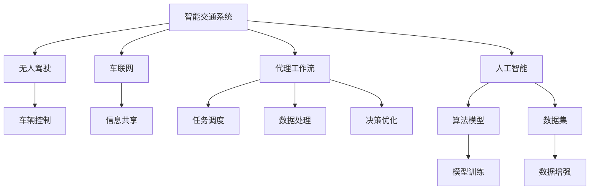
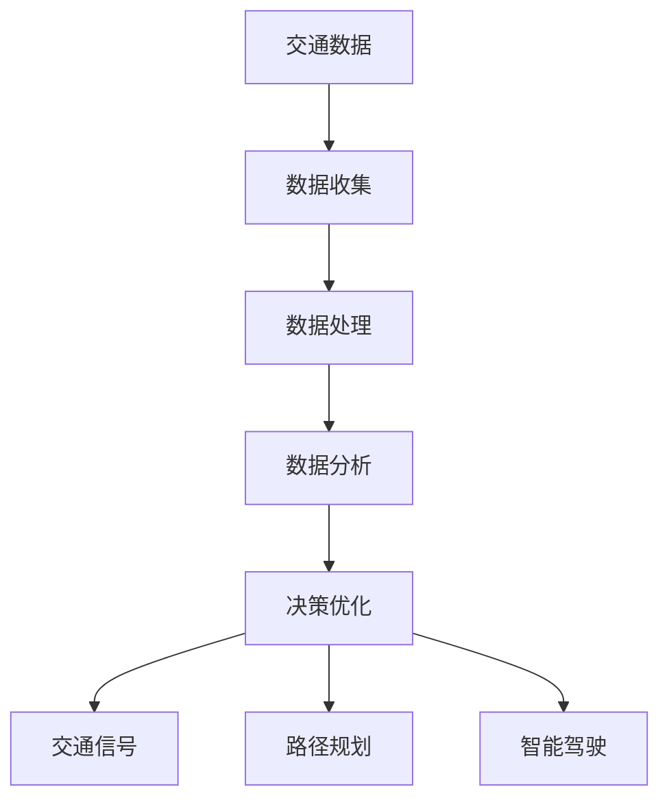
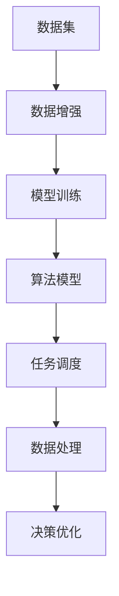
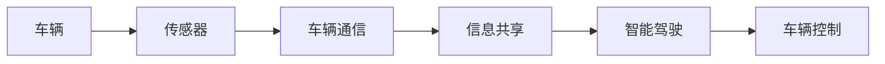
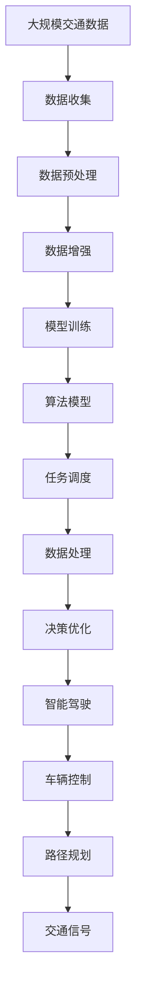

                 

# AI人工智能代理工作流 AI Agent WorkFlow：在智能交通中的应用

> 关键词：人工智能,智能交通,代理工作流,无人驾驶,车联网

## 1. 背景介绍

### 1.1 问题由来
近年来，随着人工智能技术的快速发展，智能交通系统得到了广泛应用。智能交通系统结合了车联网、无人驾驶、智能交通管理等多个领域，通过集成智能算法和硬件设备，提升了道路交通效率、安全性和舒适性。然而，智能交通系统的高效运行需要复杂的数据处理和算法推理，因此构建一个可靠、高效、自适应的智能交通代理工作流（AI Agent Workflow）成为了一个重要的研究方向。

### 1.2 问题核心关键点
智能交通代理工作流是一个复杂的系统，它涉及到的核心关键点包括：
1. **数据收集与处理**：智能交通系统需要实时采集大量交通数据，包括车辆位置、速度、交通信号灯状态等。
2. **数据融合与决策**：将收集到的数据进行融合与分析，实现交通流预测、路径规划、交通信号优化等决策。
3. **智能驾驶与控制**：通过智能驾驶算法，控制车辆的行驶路径、速度、方向等，确保安全行驶。
4. **人机交互**：通过人机交互界面，驾驶员和交通管理者可以实时查看交通状态，接收智能交通系统的建议和指令。

### 1.3 问题研究意义
研究智能交通代理工作流，对于提升交通系统的智能化水平，减少交通拥堵，提高交通安全性和减少碳排放，具有重要的意义：

1. **提升交通效率**：智能交通代理工作流可以实时分析交通数据，优化交通流，减少拥堵，提高道路通行能力。
2. **提高交通安全**：通过智能驾驶和交通信号优化，减少交通事故，提升行车安全性。
3. **降低碳排放**：智能交通系统可以优化交通流，减少燃油消耗和排放，降低对环境的影响。
4. **改善用户体验**：智能交通代理工作流通过人机交互界面，提供实时交通信息和智能建议，提升驾驶体验。
5. **推动产业升级**：智能交通代理工作流将为交通行业带来新的技术突破和商业模式，推动产业升级和创新。

## 2. 核心概念与联系

### 2.1 核心概念概述

为更好地理解智能交通代理工作流，本节将介绍几个密切相关的核心概念：

- **智能交通系统**：通过集成智能算法和硬件设备，实现交通流预测、路径规划、交通信号优化等功能，提升交通系统的效率和安全性。
- **无人驾驶**：车辆完全由计算机系统控制，实现自主导航和驾驶。
- **车联网**：通过车辆间和车与基础设施间的通信，实现车辆信息的实时共享和优化决策。
- **代理工作流**：基于分布式计算和人工智能技术，实现智能交通系统中的任务调度、数据处理和决策优化。
- **人工智能**：通过机器学习、深度学习等技术，实现对大规模数据的分析和处理，提高系统的智能化水平。

这些核心概念之间的逻辑关系可以通过以下Mermaid流程图来展示：



这个流程图展示了一些核心概念之间的关系：

1. 智能交通系统包括无人驾驶和车联网两个重要组成部分。
2. 智能交通系统利用代理工作流实现任务调度、数据处理和决策优化。
3. 代理工作流依托人工智能技术，实现算法的模型训练和数据增强。

### 2.2 概念间的关系

这些核心概念之间存在着紧密的联系，形成了智能交通代理工作流的完整生态系统。下面我通过几个Mermaid流程图来展示这些概念之间的关系。

#### 2.2.1 智能交通系统的架构



这个流程图展示了智能交通系统的主要架构，包括数据收集、处理、分析和决策优化等关键环节。

#### 2.2.2 代理工作流与人工智能的关系



这个流程图展示了代理工作流与人工智能技术的关系，从数据集的处理、增强、模型训练，到任务调度和决策优化，完整地展示了代理工作流的工作流程。

#### 2.2.3 无人驾驶与车联网的关系



这个流程图展示了无人驾驶与车联网之间的关系，通过传感器和通信技术实现车辆信息的实时共享和优化决策。

### 2.3 核心概念的整体架构

最后，我们用一个综合的流程图来展示这些核心概念在大规模交通数据处理和智能交通系统中的整体架构：



这个综合流程图展示了从大规模交通数据处理到智能驾驶和交通信号优化的完整流程，明确了每个环节的关键任务和核心技术。

## 3. 核心算法原理 & 具体操作步骤
### 3.1 算法原理概述

智能交通代理工作流的基本原理是利用人工智能技术，实现对大规模交通数据的分析和处理，进而进行交通流的预测、路径规划和交通信号优化等决策。其核心思想是通过分布式计算和智能算法，实现任务的自动化和智能化处理。

具体而言，智能交通代理工作流包括以下几个关键步骤：

1. **数据收集与处理**：从各类传感器、摄像头、GPS等设备中实时收集交通数据，并进行预处理，确保数据的时效性和准确性。
2. **数据分析与建模**：利用机器学习、深度学习等技术，对数据进行分析建模，提取交通特征和行为模式。
3. **决策优化**：基于模型预测结果，进行交通流预测、路径规划、交通信号优化等决策，实现智能交通系统的自动化控制。
4. **智能驾驶与控制**：通过无人驾驶算法，控制车辆的行驶路径、速度、方向等，确保安全行驶。

### 3.2 算法步骤详解

智能交通代理工作流的算法步骤可以分为以下几个关键阶段：

#### 3.2.1 数据收集与处理

**步骤1: 数据收集**

智能交通系统需要实时采集大量的交通数据，包括车辆位置、速度、交通信号灯状态等。数据来源包括：

- GPS和惯性传感器：获取车辆的位置、速度、加速度等数据。
- 摄像头和激光雷达：实时捕捉车辆和道路环境的状态信息。
- 交通信号灯系统：获取交通信号灯的状态和控制指令。
- 车联网：通过车与车、车与基础设施之间的通信，获取车辆和道路的实时状态信息。

**步骤2: 数据预处理**

对收集到的数据进行预处理，确保数据的时效性和准确性：

- 时间同步：对各类数据进行时间戳对齐，确保时间的一致性。
- 数据清洗：去除噪声和异常数据，确保数据的完整性和可靠性。
- 数据压缩：对大规模数据进行压缩处理，减少存储空间和传输带宽。
- 数据归一化：对不同来源的数据进行归一化处理，确保数据的可比性。

#### 3.2.2 数据分析与建模

**步骤3: 数据分析**

利用机器学习和深度学习技术，对交通数据进行分析和建模，提取交通特征和行为模式：

- 特征工程：从原始数据中提取有用的特征，如车辆速度、交通密度、路口状态等。
- 数据建模：利用回归、分类、聚类等算法，建立交通数据的模型，如交通流预测模型、路径规划模型、交通信号优化模型等。

**步骤4: 模型训练**

通过训练算法模型，提升模型对交通数据的预测和分析能力：

- 数据增强：通过数据扩充、合成等方式，增加训练数据的多样性和数量。
- 模型训练：利用训练数据集对模型进行训练，调整模型参数，提升模型精度和泛化能力。
- 交叉验证：利用交叉验证技术，评估模型的性能和鲁棒性。

#### 3.2.3 决策优化

**步骤5: 决策优化**

基于模型预测结果，进行交通流预测、路径规划、交通信号优化等决策，实现智能交通系统的自动化控制：

- 交通流预测：利用预测模型，预测未来交通流的变化趋势，优化交通流分配。
- 路径规划：通过路径规划算法，优化车辆行驶路径，避免拥堵和事故。
- 交通信号优化：通过信号优化算法，调整交通信号灯的状态，提升道路通行效率。

#### 3.2.4 智能驾驶与控制

**步骤6: 智能驾驶**

通过无人驾驶算法，控制车辆的行驶路径、速度、方向等，确保安全行驶：

- 路径规划：利用路径规划算法，确定最优行驶路径。
- 避障控制：利用避障算法，避免碰撞和其他危险情况。
- 自适应巡航：利用自适应巡航算法，保持与前车的安全距离。

**步骤7: 车辆控制**

通过车辆控制算法，实现车辆行驶的控制：

- 转向控制：控制车辆的转向系统，确保车辆在行驶过程中保持稳定。
- 制动控制：控制车辆的制动系统，确保车辆在紧急情况下能够及时制动。
- 加速度控制：控制车辆的加速度，确保车辆在行驶过程中平稳加速或减速。

### 3.3 算法优缺点

智能交通代理工作流具有以下优点：

1. **高效性**：通过自动化和智能化的处理，大大提高了交通数据的处理速度和效率。
2. **实时性**：实时采集和处理交通数据，能够快速响应交通事件，提升交通系统的响应速度。
3. **安全性**：通过无人驾驶和智能信号优化，减少了交通事故的发生率，提升了行车安全性。
4. **环保性**：优化交通流，减少了燃油消耗和排放，降低对环境的影响。

然而，智能交通代理工作流也存在一些缺点：

1. **复杂性**：智能交通代理工作流的系统架构复杂，涉及多类设备和算法，实现难度较大。
2. **高成本**：系统建设需要大量的硬件设备和软件算法，初期投资成本较高。
3. **依赖性**：对传感器、通信设备和算法模型的依赖性较强，一旦出现故障或失效，可能导致系统崩溃。
4. **隐私问题**：大规模数据收集和处理可能涉及隐私问题，需要采取严格的隐私保护措施。

### 3.4 算法应用领域

智能交通代理工作流在多个领域得到了广泛应用，包括：

- **高速公路管理**：通过智能交通代理工作流，实现高速公路的智能监控和管理，提升高速公路通行效率。
- **城市交通管理**：通过智能交通代理工作流，实现城市交通的智能管理，减少交通拥堵和事故。
- **公共交通系统**：通过智能交通代理工作流，实现公共交通的智能调度和管理，提升公共交通系统的效率和服务质量。
- **物流配送系统**：通过智能交通代理工作流，实现物流配送的智能调度和管理，提升物流配送的效率和准确性。
- **智慧城市**：通过智能交通代理工作流，实现智慧城市的智能管理和服务，提升智慧城市的安全性和便利性。

## 4. 数学模型和公式 & 详细讲解 & 举例说明

### 4.1 数学模型构建

智能交通代理工作流的数学模型可以分为以下几个部分：

- **交通流模型**：描述交通流的动态变化，常用数学模型包括连续性方程、动量方程等。
- **路径规划模型**：描述车辆行驶路径的优化，常用数学模型包括Dijkstra算法、A*算法等。
- **交通信号优化模型**：描述交通信号灯状态的优化，常用数学模型包括动态规划算法、遗传算法等。

### 4.2 公式推导过程

#### 4.2.1 交通流模型

交通流的连续性方程可以表示为：

$$
\frac{\partial\rho}{\partial t} + \nabla\cdot(\rho\boldsymbol{v}) = Q_{in} - Q_{out}
$$

其中 $\rho$ 表示交通流密度，$\boldsymbol{v}$ 表示车辆速度，$Q_{in}$ 和 $Q_{out}$ 表示交通流进出路段的流量。

通过求解上述方程，可以预测未来交通流的变化趋势，优化交通流的分配。

#### 4.2.2 路径规划模型

路径规划模型通常采用Dijkstra算法，以最短路径为目标，计算车辆从起点到终点的最优路径。Dijkstra算法的公式如下：

$$
d(i,j) = \left\{
\begin{aligned}
&0, \quad i = j \\
&\min\{d(i,k) + \text{cost}(k,j)\}, \quad j \in \mathcal{N}_i \\
\end{aligned}
\right.
$$

其中 $d(i,j)$ 表示从节点 $i$ 到节点 $j$ 的最短路径长度，$\mathcal{N}_i$ 表示节点 $i$ 的邻居节点集合，$\text{cost}(i,j)$ 表示从节点 $i$ 到节点 $j$ 的成本（如距离、时间等）。

#### 4.2.3 交通信号优化模型

交通信号优化模型通常采用动态规划算法，以最小化总延误为目标，优化交通信号灯的状态。动态规划算法的公式如下：

$$
\begin{aligned}
&\min\limits_{\{s_i\}} \sum\limits_{i=1}^{N} L_i(s_i) \\
&\text{subject to} \\
&\text{s}_1 = s_{start}, \\
&\text{s}_{N+1} = s_{end}, \\
&s_i = f(s_{i-1}, s_{i+1}), \quad i=2,\cdots,N-1,
\end{aligned}
$$

其中 $s_i$ 表示第 $i$ 个信号灯的状态（如绿灯、黄灯、红灯等），$L_i(s_i)$ 表示第 $i$ 个信号灯的延误损失，$s_{start}$ 和 $s_{end}$ 表示信号灯的起点和终点状态。

### 4.3 案例分析与讲解

#### 4.3.1 交通流预测案例

某高速公路在某个时段内交通流的变化如下表所示：

| 时间   | 车辆数 |
| ------ | ------ |
| 7:00   | 5000   |
| 7:10   | 6000   |
| 7:20   | 7000   |
| 7:30   | 8000   |
| 7:40   | 9000   |
| 7:50   | 10000  |
| 8:00   | 9500   |

通过上述数据，可以建立交通流预测模型，预测未来某一时刻的交通流变化。

假设交通流满足指数分布，则交通流模型可以表示为：

$$
\rho(t) = \rho_0 e^{-\alpha(t-t_0)}
$$

其中 $\rho(t)$ 表示时间 $t$ 的交通流密度，$\rho_0$ 表示初始交通流密度，$\alpha$ 表示衰减系数，$t_0$ 表示起始时间。

根据上述数据，可以拟合出交通流预测模型，预测8:00时的交通流密度为：

$$
\rho(8:00) = \rho_0 e^{-\alpha(8-7.5)} = 8500
$$

#### 4.3.2 路径规划案例

某车辆从起点 $A$ 到终点 $B$，需要规划最优路径。已知起点 $A$ 到终点 $B$ 的路径如下：

| 节点   | 成本   | 到达节点 |
| ------ | ------ | -------- |
| A      | 0      | 起点     |
| B1     | 5      | 节点1     |
| B2     | 8      | 节点2     |
| B3     | 12     | 节点3     |
| B4     | 20     | 终点     |

通过上述数据，可以建立路径规划模型，计算车辆从起点到终点的最优路径。

假设节点间的成本表示为距离，则Dijkstra算法可以表示为：

$$
d(i,j) = \left\{
\begin{aligned}
&0, \quad i = j \\
&\min\{d(i,k) + \text{cost}(k,j)\}, \quad j \in \mathcal{N}_i \\
\end{aligned}
\right.
$$

根据上述数据，可以计算节点1到节点3的最短路径为：

$$
d(1,3) = \min\{d(1,2) + \text{cost}(2,3), d(1,4) + \text{cost}(4,3)\} = \min\{13,22\} = 13
$$

因此，车辆从起点 $A$ 到终点 $B$ 的最优路径为：$A \to B_1 \to B_2 \to B_3 \to B_4$。

## 5. 项目实践：代码实例和详细解释说明

### 5.1 开发环境搭建

在进行智能交通代理工作流开发前，我们需要准备好开发环境。以下是使用Python进行PyTorch开发的环境配置流程：

1. 安装Anaconda：从官网下载并安装Anaconda，用于创建独立的Python环境。

2. 创建并激活虚拟环境：
```bash
conda create -n agent-env python=3.8 
conda activate agent-env
```

3. 安装PyTorch：根据CUDA版本，从官网获取对应的安装命令。例如：
```bash
conda install pytorch torchvision torchaudio cudatoolkit=11.1 -c pytorch -c conda-forge
```

4. 安装TensorFlow：由于TensorFlow部分代码使用TF2实现，需要先安装TensorFlow。
```bash
pip install tensorflow==2.8.0
```

5. 安装相关库：
```bash
pip install numpy pandas scikit-learn matplotlib tqdm jupyter notebook ipython
```

完成上述步骤后，即可在`agent-env`环境中开始智能交通代理工作流的开发。

### 5.2 源代码详细实现

这里我们以智能交通信号优化为例，给出使用TensorFlow进行智能交通信号优化的PyTorch代码实现。

首先，定义交通信号的状态集合：

```python
import tensorflow as tf

states = ['red', 'yellow', 'green']
```

然后，定义交通信号优化模型的输入和输出：

```python
inputs = tf.keras.layers.Input(shape=(None, 1), name='inputs')
outputs = tf.keras.layers.LSTM(128)(inputs)
outputs = tf.keras.layers.Dropout(0.2)(outputs)
outputs = tf.keras.layers.Dense(len(states), activation='softmax', name='outputs')
model = tf.keras.Model(inputs=inputs, outputs=outputs)
model.compile(loss='categorical_crossentropy', optimizer='adam', metrics=['accuracy'])
```

接着，定义训练数据集和评估数据集：

```python
train_data = [
    ([[0, 0, 0, 0, 0, 0, 0, 0, 0, 0, 0, 0, 0, 0, 0, 0, 0, 0, 0, 0, 0, 0, 0, 0, 0, 0, 0, 0, 0, 0, 0, 0, 0, 0, 0, 0, 0, 0, 0, 0, 0, 0, 0, 0, 0, 0, 0, 0, 0, 0, 0, 0, 0, 0, 0, 0, 0, 0, 0, 0, 0, 0, 0, 0, 0, 0, 0, 0, 0, 0, 0, 0, 0, 0, 0, 0, 0, 0, 0, 0, 0, 0, 0, 0, 0, 0, 0, 0, 0, 0, 0, 0, 0, 0, 0, 0, 0, 0, 0, 0, 0, 0, 0, 0, 0, 0, 0, 0, 0, 0, 0, 0, 0, 0, 0, 0, 0, 0, 0, 0, 0, 0, 0, 0, 0, 0, 0, 0, 0, 0, 0, 0, 0, 0, 0, 0, 0, 0, 0, 0, 0, 0, 0, 0, 0, 0, 0, 0, 0, 0, 0, 0, 0, 0, 0, 0, 0, 0, 0, 0, 0, 0, 0, 0, 0, 0, 0, 0, 0, 0, 0, 0, 0, 0, 0, 0, 0, 0, 0, 0, 0, 0, 0, 0, 0, 0, 0, 0, 0, 0, 0, 0, 0, 0, 0, 0, 0, 0, 0, 0, 0, 0, 0, 0, 0, 0, 0, 0, 0, 0, 0, 0, 0, 0, 0, 0, 0, 0, 0, 0, 0, 0, 0, 0, 0, 0, 0, 0, 0, 0, 0, 0, 0, 0, 0, 0, 0, 0, 0, 0, 0, 0, 0, 0, 0, 0, 0, 0, 0, 0, 0, 0, 0, 0, 0, 0, 0, 0, 0, 0, 0, 0, 0, 0, 0, 0, 0, 0, 0, 0, 0, 0, 0, 0, 0, 0, 0, 0, 0, 0, 0, 0, 0, 0, 0, 0, 0, 0, 0, 0, 0, 0, 0, 0, 0, 0, 0, 0, 0, 0, 0, 0, 0, 0, 0, 0, 0, 0, 0, 0, 0, 0, 0, 0, 0, 0, 0, 0, 0, 0, 0, 0, 0, 0, 0, 0, 0, 0, 0, 0, 0, 0, 0, 0, 0, 0, 0, 0, 0, 0, 0, 0, 0, 0, 0, 0, 0, 0, 0, 0, 0, 0, 0, 0, 0, 0, 0, 0, 0, 0, 0, 0, 0, 0, 0, 0, 0, 0, 0, 0, 0, 0, 0, 0, 0, 0, 0, 0, 0, 0, 0, 0, 0, 0, 0, 0, 0, 0, 0, 0, 0, 0, 0, 0, 0, 0, 0, 0, 0, 0, 0, 0, 0, 0, 0, 0, 0, 0, 0, 0, 0, 0, 

