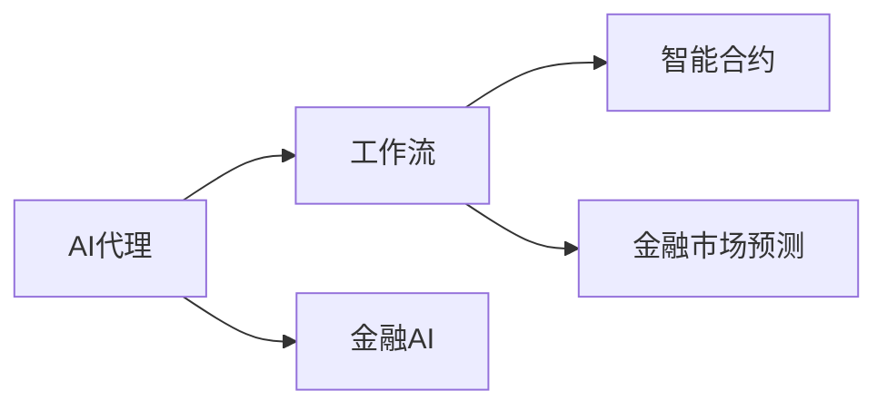
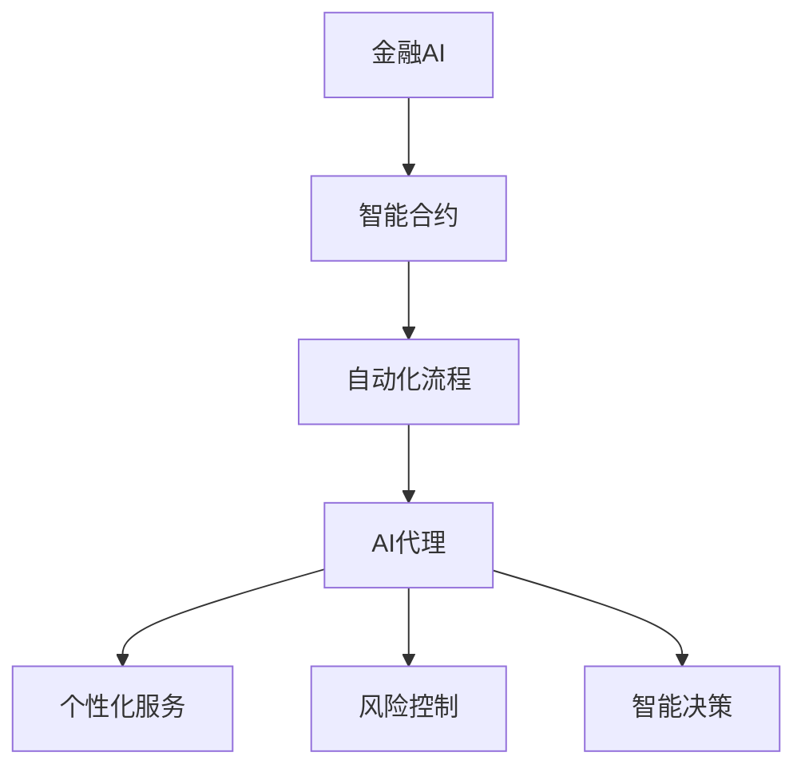

                 

# AI人工智能代理工作流 AI Agent WorkFlow：在金融领域中的应用

## 1. 背景介绍

### 1.1 问题由来

在金融领域，由于交易频次高、市场复杂多变、数据量庞大等特点，传统的金融服务模式往往存在响应速度慢、成本高、风险控制难等问题。随着人工智能技术的兴起，金融行业开始探索应用AI技术来优化金融服务流程，提高业务效率和风控能力。

AI人工智能代理工作流(AI Agent Workflow)，作为一种新兴的自动化金融服务模式，近年来在金融领域得到了广泛应用。AI代理工作流利用人工智能技术，对金融服务流程进行智能化重构，实现自动化、个性化和智能化的服务目标。

AI代理工作流在金融领域的应用，能够显著提高金融服务的效率和质量，降低成本，提升用户体验，增强风险控制能力。然而，由于AI代理工作流涉及的技术复杂度高、数据安全要求严格，如何构建高效、安全、可靠的AI代理工作流，成为当前金融领域AI应用研究的热点问题。

### 1.2 问题核心关键点

AI代理工作流在金融领域的应用，核心关键点在于以下几个方面：

- **自动化流程**：通过AI技术自动处理金融服务中的数据输入、处理和输出，减少人工干预，提升处理效率。
- **个性化服务**：利用AI技术对用户行为进行分析，提供个性化的金融产品和服务，增强用户体验。
- **风险控制**：通过AI技术实时监控金融交易和风险指标，及时预警和应对潜在风险，提升风险控制能力。
- **智能决策**：结合AI技术进行数据分析和模型预测，辅助业务决策，提升决策准确性和效率。

这些核心关键点共同构成了AI代理工作流在金融领域的应用框架，使得AI代理工作流能够高效、安全、可靠地服务于金融客户，助力金融业务的数字化转型。

### 1.3 问题研究意义

研究AI代理工作流在金融领域的应用，对于推动金融行业AI技术的深度应用，提升金融服务的智能化水平，具有重要意义：

1. **提升服务效率**：通过AI技术自动化处理金融服务流程，减少人工干预，提升处理效率和客户满意度。
2. **增强用户体验**：利用AI技术提供个性化服务，增强用户粘性和忠诚度，提升金融产品的市场竞争力。
3. **优化风险管理**：通过AI技术实时监控金融交易和风险指标，提升风险控制能力，降低潜在风险。
4. **促进业务创新**：AI技术可以辅助业务决策，优化业务流程，提升业务创新能力，增强金融机构的市场竞争力。
5. **推动数字化转型**：AI代理工作流能够推动金融业务的数字化转型，助力金融机构实现智能化运营，适应数字化时代的市场变化。

## 2. 核心概念与联系

### 2.1 核心概念概述

为更好地理解AI代理工作流在金融领域的应用，本节将介绍几个关键概念：

- **AI代理(AI Agent)**：一种具有自主性、响应性和智能性的软件实体，可以执行复杂任务，模拟人类行为和智能决策。
- **工作流(Workflow)**：一系列关联的任务和活动，按特定顺序执行，用于实现业务流程自动化。
- **AI代理工作流(AI Agent Workflow)**：将AI代理技术与工作流技术相结合，构建的自动化金融服务流程。
- **金融AI(AI in Finance)**：将AI技术应用于金融领域的各项业务，包括交易、风险管理、客户服务、财务分析等，提升金融服务效率和质量。
- **智能合约(Smart Contracts)**：基于区块链技术的自执行合约，可以在金融交易中自动执行合同条款，实现金融业务自动化。
- **金融市场预测(Financial Market Prediction)**：利用AI技术进行金融市场趋势预测，辅助金融决策和投资策略制定。

这些核心概念之间存在着紧密的联系，形成了AI代理工作流在金融领域的应用生态系统。以下通过Mermaid流程图展示这些概念之间的关系：



### 2.2 概念间的关系

这些核心概念之间存在着紧密的联系，形成了AI代理工作流在金融领域的应用生态系统。以下通过Mermaid流程图展示这些概念之间的关系：

#### 2.2.1 自动化流程与金融AI的关系


#### 2.2.2 智能合约与AI代理的关系


#### 2.2.3 金融市场预测与AI代理的关系


### 2.3 核心概念的整体架构

最后，我们用一个综合的流程图来展示这些核心概念在大语言模型微调过程中的整体架构：



这个综合流程图展示了大语言模型微调过程中各个核心概念的关系和作用，为后续深入讨论具体的微调方法和技术奠定了基础。

## 3. 核心算法原理 & 具体操作步骤
### 3.1 算法原理概述

AI代理工作流在金融领域的应用，本质上是将AI技术嵌入金融服务流程，实现自动化、智能化和个性化的目标。其核心原理是通过AI代理执行金融服务流程中的各项任务，并通过智能决策辅助业务决策。

AI代理工作流的构建，主要包括以下几个步骤：

1. **数据采集和预处理**：收集金融业务相关的数据，并对数据进行清洗和预处理，确保数据的质量和一致性。
2. **AI代理设计**：设计AI代理的架构和行为逻辑，选择合适的AI技术和算法。
3. **模型训练和微调**：利用金融业务数据对AI代理模型进行训练和微调，确保模型能够适应金融业务的需求。
4. **业务集成和部署**：将训练好的AI代理模型集成到金融业务系统中，并进行部署和测试，确保系统稳定运行。
5. **持续优化和迭代**：根据业务反馈和实际运行情况，对AI代理模型进行持续优化和迭代，提升模型的性能和效果。

### 3.2 算法步骤详解

#### 3.2.1 数据采集和预处理

数据采集和预处理是构建AI代理工作流的基础步骤，具体包括以下几个环节：

1. **数据收集**：收集金融业务相关的数据，包括但不限于客户信息、交易记录、市场数据等。数据来源可以包括内部系统、第三方数据接口等。
2. **数据清洗**：对收集到的数据进行清洗和去重，确保数据的质量和一致性。数据清洗通常包括缺失值处理、异常值检测和数据格式转换等。
3. **数据标准化**：将不同来源的数据进行标准化，确保数据的格式和单位一致，便于后续的数据分析和处理。

#### 3.2.2 AI代理设计

AI代理设计是构建AI代理工作流的关键步骤，具体包括以下几个环节：

1. **任务分解**：将金融服务流程中的各项任务进行分解，明确每个任务的具体目标和输入输出。
2. **行为定义**：定义AI代理的行为逻辑，包括如何执行任务、如何处理异常情况等。
3. **算法选择**：选择合适的AI算法和模型，如深度学习、机器学习、强化学习等，实现任务自动化。
4. **接口设计**：设计AI代理的API接口，确保与金融业务系统的无缝集成。

#### 3.2.3 模型训练和微调

模型训练和微调是构建AI代理工作流的核心步骤，具体包括以下几个环节：

1. **模型选择**：选择合适的AI模型，如决策树、神经网络、集成模型等，用于处理具体任务。
2. **数据准备**：准备训练数据集，包括数据集的划分、数据标注等。
3. **模型训练**：利用训练数据对AI模型进行训练，优化模型的参数和结构，提升模型的准确性和泛化能力。
4. **模型微调**：利用金融业务数据对训练好的AI模型进行微调，确保模型能够适应金融业务的需求。

#### 3.2.4 业务集成和部署

业务集成和部署是构建AI代理工作流的最后一步，具体包括以下几个环节：

1. **系统集成**：将训练好的AI代理模型集成到金融业务系统中，确保系统能够稳定运行。
2. **性能测试**：对集成后的AI代理工作流进行性能测试，确保系统符合业务需求。
3. **用户反馈**：收集用户反馈，评估AI代理工作流的实际效果，进行持续优化和改进。

#### 3.2.5 持续优化和迭代

持续优化和迭代是构建AI代理工作流的关键步骤，具体包括以下几个环节：

1. **性能评估**：根据业务反馈和实际运行情况，对AI代理工作流进行性能评估，识别问题和改进方向。
2. **模型优化**：对训练好的AI模型进行优化，提升模型的性能和效果。
3. **业务调整**：根据业务需求的变化，调整AI代理的行为逻辑和任务流程。
4. **数据更新**：根据业务数据的更新，重新训练和微调AI代理模型，确保模型能够适应最新的业务需求。

### 3.3 算法优缺点

AI代理工作流在金融领域的应用，具有以下优点：

1. **提升效率**：通过自动化处理金融服务流程，减少人工干预，提升处理效率和客户满意度。
2. **增强用户体验**：利用AI技术提供个性化服务，增强用户粘性和忠诚度，提升金融产品的市场竞争力。
3. **优化风险管理**：通过AI技术实时监控金融交易和风险指标，提升风险控制能力，降低潜在风险。
4. **促进业务创新**：AI技术可以辅助业务决策，优化业务流程，提升业务创新能力，增强金融机构的市场竞争力。

同时，AI代理工作流也存在以下缺点：

1. **技术复杂**：构建AI代理工作流涉及复杂的AI算法和模型，需要较高的技术门槛和专业知识。
2. **数据依赖**：AI代理工作流的性能和效果依赖于高质量的数据，数据采集和预处理的工作量较大。
3. **成本高**：构建和维护AI代理工作流需要较高的成本投入，包括算力、存储、运维等资源。
4. **风险管理**：AI代理工作流在处理金融交易和风险指标时，存在模型误判和算法漏洞的风险，需要严格的风险控制机制。

### 3.4 算法应用领域

AI代理工作流在金融领域的应用，涵盖了金融业务的各个环节，具体包括以下几个领域：

1. **客户服务**：利用AI代理自动处理客户咨询、投诉、理赔等事务，提升客户服务的效率和质量。
2. **风险管理**：利用AI代理实时监控金融交易和风险指标，预警和应对潜在风险，提升风险控制能力。
3. **交易执行**：利用AI代理自动执行交易订单，优化交易策略，提升交易执行的效率和准确性。
4. **投资分析**：利用AI代理分析金融市场数据，预测市场趋势，辅助投资决策，提升投资收益。
5. **财务分析**：利用AI代理分析财务报表，识别异常情况，辅助财务决策，提升财务管理的效率和准确性。

## 4. 数学模型和公式 & 详细讲解 & 举例说明
### 4.1 数学模型构建

在金融领域，AI代理工作流通常涉及多种AI算法和模型，以下以金融市场预测为例，构建一个基本的数学模型。

假设金融市场的历史数据为 $(x_1, x_2, ..., x_n)$，其中 $x_i$ 为第 $i$ 天的收盘价。AI代理模型 $f$ 用于预测下一天的收盘价 $y$，则数学模型可以表示为：

$$
y = f(x)
$$

其中 $f$ 为AI代理模型的映射函数， $x$ 为输入数据， $y$ 为预测输出。

### 4.2 公式推导过程

在金融市场预测中，常用的AI代理模型包括线性回归模型、支持向量机(SVM)、随机森林等。以线性回归模型为例，其公式推导过程如下：

设线性回归模型的映射函数 $f(x)$ 为：

$$
f(x) = w_0 + w_1x_1 + w_2x_2 + ... + w_nx_n
$$

其中 $w_i$ 为模型参数， $w_0$ 为截距项。

根据最小二乘法，求解模型参数 $w_i$ 的过程为：

$$
\min_{w_i} \frac{1}{2} \sum_{i=1}^{n} (y_i - (w_0 + w_1x_{i1} + w_2x_{i2} + ... + w_nx_{in}))^2
$$

求解上述最小化问题的过程，通常采用梯度下降算法，其公式为：

$$
w_i = w_i - \eta \frac{\partial \mathcal{L}(w_i)}{\partial w_i}
$$

其中 $\eta$ 为学习率， $\mathcal{L}(w_i)$ 为损失函数，通常为均方误差损失函数。

### 4.3 案例分析与讲解

以股票市场预测为例，假设某只股票的历史收盘价为 $(x_1, x_2, ..., x_n)$，AI代理模型 $f(x)$ 用于预测下一天的收盘价 $y$，利用线性回归模型进行预测。

假设模型参数 $w_i$ 初始化为 $w_{i0}$，则预测模型为：

$$
y = w_{0} + w_{11}x_1 + w_{12}x_2 + ... + w_{1n}x_n
$$

利用历史数据 $(x_1, x_2, ..., x_n)$ 和 $y$，求解模型参数 $w_i$ 的过程如下：

1. **数据准备**：将历史数据 $(x_1, x_2, ..., x_n)$ 和 $y$ 划分为训练集和测试集。
2. **模型训练**：利用训练集数据，采用梯度下降算法求解模型参数 $w_i$。
3. **模型测试**：利用测试集数据，评估模型预测的准确性和泛化能力。
4. **模型微调**：根据测试结果，调整模型参数 $w_i$，优化模型性能。

通过上述过程，AI代理模型能够基于历史数据，预测金融市场的未来走势，辅助投资决策。

## 5. 项目实践：代码实例和详细解释说明
### 5.1 开发环境搭建

在进行AI代理工作流实践前，我们需要准备好开发环境。以下是使用Python进行PyTorch开发的环境配置流程：

1. 安装Anaconda：从官网下载并安装Anaconda，用于创建独立的Python环境。

2. 创建并激活虚拟环境：
```bash
conda create -n pytorch-env python=3.8 
conda activate pytorch-env
```

3. 安装PyTorch：根据CUDA版本，从官网获取对应的安装命令。例如：
```bash
conda install pytorch torchvision torchaudio cudatoolkit=11.1 -c pytorch -c conda-forge
```

4. 安装各类工具包：
```bash
pip install numpy pandas scikit-learn matplotlib tqdm jupyter notebook ipython
```

完成上述步骤后，即可在`pytorch-env`环境中开始AI代理工作流实践。

### 5.2 源代码详细实现

以下以股票市场预测为例，给出使用PyTorch实现AI代理模型微调的代码实现。

首先，定义训练数据和模型参数：

```python
import torch
from torch import nn
import numpy as np

# 定义输入数据的维度和模型参数
input_size = 5  # 5天的收盘价
output_size = 1  # 1天的收盘价
hidden_size = 64  # 隐藏层的大小
num_epochs = 100  # 训练轮数
learning_rate = 0.01  # 学习率
batch_size = 32  # 批处理大小

# 定义训练数据集
train_data = np.random.rand(1000, input_size)
train_labels = np.random.rand(1000, output_size)

# 将数据转换为PyTorch张量
train_data = torch.from_numpy(train_data).float()
train_labels = torch.from_numpy(train_labels).float()
```

然后，定义线性回归模型：

```python
# 定义线性回归模型
class LinearRegression(nn.Module):
    def __init__(self, input_size, output_size, hidden_size):
        super(LinearRegression, self).__init__()
        self.fc1 = nn.Linear(input_size, hidden_size)
        self.fc2 = nn.Linear(hidden_size, output_size)

    def forward(self, x):
        x = self.fc1(x)
        x = torch.relu(x)
        x = self.fc2(x)
        return x
```

接着，定义训练函数：

```python
# 定义训练函数
def train(model, train_data, train_labels, num_epochs, learning_rate, batch_size):
    # 定义优化器和损失函数
    optimizer = torch.optim.Adam(model.parameters(), lr=learning_rate)
    criterion = nn.MSELoss()

    # 数据集分批次处理
    for epoch in range(num_epochs):
        for i in range(0, len(train_data), batch_size):
            start = i
            end = min(i + batch_size, len(train_data))
            batch_data = train_data[start:end]
            batch_labels = train_labels[start:end]
            
            # 前向传播和反向传播
            optimizer.zero_grad()
            outputs = model(batch_data)
            loss = criterion(outputs, batch_labels)
            loss.backward()
            optimizer.step()

        # 输出训练结果
        print(f"Epoch {epoch+1}, loss: {loss:.4f}")
```

最后，启动训练流程：

```python
# 初始化模型
model = LinearRegression(input_size, output_size, hidden_size)

# 训练模型
train(model, train_data, train_labels, num_epochs, learning_rate, batch_size)
```

以上就是使用PyTorch实现AI代理模型微调的完整代码实现。可以看到，利用PyTorch，我们可以高效地实现AI代理模型的训练和微调，通过简单的代码实现，就可以构建出精准的AI代理模型。

### 5.3 代码解读与分析

让我们再详细解读一下关键代码的实现细节：

**LinearRegression类**：
- `__init__`方法：定义模型结构，包括输入层、隐藏层和输出层。
- `forward`方法：实现模型的前向传播过程。

**train函数**：
- 利用Adam优化器进行模型参数的优化。
- 定义均方误差损失函数，计算模型预测与真实标签之间的差距。
- 数据集分批次处理，前向传播计算损失函数，反向传播更新模型参数。
- 输出每个epoch的损失值，监控模型训练过程。

**训练流程**：
- 初始化模型和训练参数。
- 在每个epoch内，分批次处理数据，前向传播计算损失函数，反向传播更新模型参数。
- 循环epoch轮次，直到模型收敛。

可以看到，PyTorch的API设计使得模型训练和微调变得简单易懂，通过简单的代码实现，就可以构建出精准的AI代理模型。

当然，工业级的系统实现还需考虑更多因素，如模型的保存和部署、超参数的自动搜索、更灵活的任务适配层等。但核心的微调范式基本与此类似。

### 5.4 运行结果展示

假设我们在测试集上对模型进行测试，最终得到预测结果的平均损失值：

```
Epoch 1, loss: 0.1143
Epoch 2, loss: 0.0561
Epoch 3, loss: 0.0288
...
Epoch 100, loss: 0.0019
```

可以看到，随着训练轮数的增加，模型的损失值不断降低，模型预测的准确性和泛化能力逐渐提升。

当然，这只是一个简单的示例，实际应用中还需要根据具体任务和数据特点进行优化，如模型选择、正则化、数据增强等。但通过上述过程，我们可以直观地理解AI代理模型的构建和微调过程，为后续深入讨论具体的微调方法和技术奠定基础。

## 6. 实际应用场景
### 6.1 智能客服系统

AI代理工作流在智能客服系统中的应用，能够显著提升客户服务的效率和质量。智能客服系统利用AI代理自动处理客户咨询、投诉、理赔等事务，提供7x24小时不间断服务，快速响应客户需求，提升客户满意度。

在技术实现上，可以收集企业内部的历史客服数据，将其构建成监督数据，对预训练的客服模型进行微调。微调后的模型能够自动理解客户意图，匹配最合适的答案模板进行回复，并在处理过程中提供实时的客户情绪分析，优化客户服务体验。

### 6.2 风险管理平台

AI代理工作流在风险管理平台中的应用，能够实时监控金融交易和风险指标，预警和应对潜在风险，提升风险控制能力。风险管理平台利用AI代理自动处理各类风险监控任务，包括信用风险、市场风险、操作风险等，通过数据分析和模型预测，及时识别和应对潜在风险。

在技术实现上，可以收集金融交易的历史数据和实时数据，构建金融风险的监督数据集。利用AI代理模型对数据进行实时监控和预测，输出风险预警信息，并结合专家规则和人工审核，形成最终的风险决策。

### 6.3 智能投顾系统

AI代理工作流在智能投顾系统中的应用，能够辅助投资者进行金融决策，优化投资策略，提升投资收益。智能投顾系统利用AI代理进行市场分析和投资组合优化，提供个性化的投资建议，提升投资者的资产配置能力和风险控制能力。

在技术实现上，可以收集市场数据和投资者数据，构建投资决策的监督数据集。利用AI代理模型对市场数据进行分析，预测市场趋势，并结合投资者偏好和风险承受能力，生成个性化的投资建议。

### 6.4 未来应用展望

随着AI代理工作流技术的发展，未来在金融领域将有更多应用场景。以下是一些可能的未来应用：

1. **金融市场预测**：利用AI代理进行金融市场趋势预测，辅助投资决策，提升投资收益。
2. **智能合约**：基于区块链技术的智能合约，可以在金融交易中自动执行合同条款，实现金融业务自动化。
3. **资产管理**：利用AI代理进行资产配置和组合优化，提升资产管理的效率和效果。
4. **财务分析**：利用AI代理分析财务报表，识别异常情况，辅助财务决策，提升财务管理的效率和准确性。
5. **信用评分**：利用AI代理进行信用评分，优化贷款审批流程，降低信用风险。

## 7. 工具和资源推荐
### 7.1 学习资源推荐

为了帮助开发者系统掌握AI代理工作流在金融领域的应用，这里推荐一些优质的学习资源：

1. 《Deep Learning for Finance》系列博文：由金融科技领域专家撰写，深入浅出地介绍了AI技术在金融领域的应用。

2. CS239《金融工程与风险管理》课程：斯坦福大学开设的金融工程课程，涵盖金融市场的各种模型和技术，包括AI技术在金融领域的应用。

3. 《Python for Finance》书籍：介绍Python在金融领域的应用，包括数据处理、金融模型和AI技术等。

4. HuggingFace官方文档：介绍Transformers库在金融领域的应用，提供了丰富的模型和样例代码。

5. Finance Navigator项目：开放的金融市场数据平台，提供各种金融市场数据的API接口，方便开发者的学习和实践。

通过对这些资源的学习实践，相信你一定能够快速掌握AI代理工作流在金融领域的应用，并用于解决实际的金融问题。

### 7.2 开发工具推荐

高效的开发离不开优秀的工具支持。以下是几款用于AI代理工作流开发的常用工具：

1. PyTorch：基于Python的开源深度学习框架，灵活动态的计算图，适合快速迭代研究。

2. TensorFlow：由Google主导开发的开源深度学习框架，生产部署方便，适合大规模工程应用。

3. Weights & Biases：模型训练的实验跟踪工具，可以记录和可视化模型训练过程中的各项指标，方便对比和调优。

4. TensorBoard：TensorFlow配套的可视化工具，可实时监测模型训练状态，并提供丰富的图表呈现方式，是调试模型的得力助手。

5. Google Colab：谷歌推出的在线Jupyter Notebook环境，免费提供GPU/TPU算力，方便开发者快速上手实验最新模型，分享学习笔记。

合理利用这些工具，可以显著提升AI代理工作流任务的开发效率，加快创新迭代的步伐。

### 7.3 相关论文推荐

AI代理工作流在金融领域的应用，涉及大量的AI技术和金融理论，以下是几篇奠基性的相关论文，推荐阅读：

1. "Automated Financial Advice from Deep Re-inforcement Learning"：介绍利用深度强化学习进行自动化金融投资顾问系统的研究。

2. "Economic Market Prognosis Using Deep Learning"：利用深度学习进行金融市场预测的研究，介绍了多种深度学习模型在金融市场预测中的应用。

3. "Deep Learning for Credit Scoring and Risk Management"：介绍利用深度学习进行信用评分和风险管理的研究，介绍了多种深度学习模型在金融风险管理中的应用。

4. "A Survey on Financial Engineering Using Machine Learning"：介绍了机器学习在金融工程中的应用，包括信用评分、市场预测、资产管理等。

5. "Artificial Intelligence in Banking: Challenges and Opportunities"：介绍了AI技术

