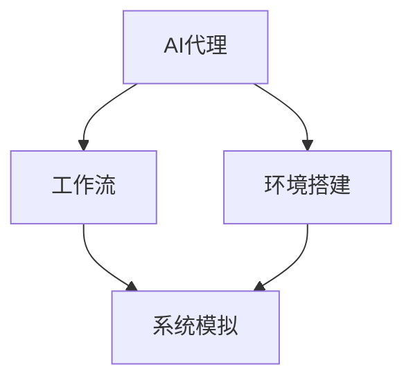
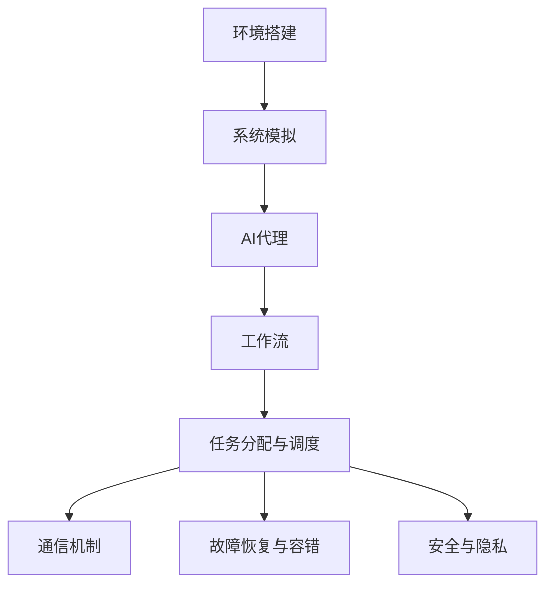

                 

# AI人工智能代理工作流 AI Agent WorkFlow：环境的建立与模拟

> 关键词：人工智能代理, 工作流, 环境建立, 系统模拟

## 1. 背景介绍

### 1.1 问题由来
随着人工智能(AI)技术的飞速发展，AI代理(AI Agent)在各行各业的应用越来越广泛，从自动驾驶、智能客服到智能推荐、健康医疗等领域，AI代理都在发挥着重要的作用。然而，AI代理的部署和维护依然是一个复杂且繁琐的过程，尤其在多任务的复合系统中，如何构建一个稳定高效的工作流（Workflow），以便AI代理能够无缝地协同工作，成为了一个重要的研究方向。

### 1.2 问题核心关键点
构建AI代理工作流的过程中，需要考虑以下几个关键点：
- **环境搭建**：确保每个AI代理在一个统一、可控的环境中运行，以便进行有效的协作和数据共享。
- **任务分配与调度**：合理分配任务，并在多个AI代理间进行高效的调度，以最大化系统性能。
- **通信机制**：建立高效的通信机制，确保不同AI代理间能够即时、准确地传递信息。
- **故障恢复与容错**：在AI代理运行过程中出现故障时，能够快速恢复，确保系统连续性。
- **安全与隐私**：在保护用户数据隐私的同时，确保AI代理工作流的安全性。

### 1.3 问题研究意义
构建一个稳定、高效、可扩展的AI代理工作流，对于推动AI技术的广泛应用具有重要意义：
- **提升效率**：减少人工干预，降低成本，提高任务处理速度。
- **增强协作**：实现不同AI代理间的协同工作，增强系统的综合能力。
- **提高可靠性**：通过故障恢复和容错机制，确保系统持续稳定运行。
- **保护隐私**：通过安全机制，保护用户隐私数据，增强系统可信度。
- **推动创新**：为AI代理的创新应用提供支持，拓展AI技术的应用边界。

## 2. 核心概念与联系

### 2.1 核心概念概述

为更好地理解AI代理工作流的构建过程，本节将介绍几个密切相关的核心概念：

- **AI代理**：在计算机科学中，AI代理是一种能够在指定环境中自主行动，并执行一系列任务的实体。AI代理可以感知环境、制定决策、执行动作，并根据环境变化调整自身行为。
- **工作流**：工作流是一系列相关的任务和活动，按顺序排列，旨在完成特定的业务目标。在AI代理工作流中，这些任务和活动由不同的AI代理负责执行。
- **环境搭建**：为AI代理提供一个虚拟或实际的环境，包含必要的硬件资源、软件工具和数据集，以便AI代理能够在指定环境中运行。
- **系统模拟**：通过仿真技术，在计算机上模拟AI代理工作流的运行过程，以便在实际部署前进行测试和优化。

### 2.2 概念间的关系

这些核心概念之间的逻辑关系可以通过以下Mermaid流程图来展示：



这个流程图展示了大语言模型的核心概念及其之间的关系：

1. AI代理作为工作流的核心组件，通过环境搭建和系统模拟，完成特定的任务。
2. 环境搭建为AI代理提供必要的资源和工具，确保其正常运行。
3. 系统模拟通过仿真实例测试和优化AI代理工作流，使其在实际部署时更加稳定和高效。

### 2.3 核心概念的整体架构

最后，我们用一个综合的流程图来展示这些核心概念在大语言模型微调过程中的整体架构：



这个综合流程图展示了从环境搭建到系统模拟，再到AI代理、工作流、任务分配、通信机制、故障恢复、安全隐私的全过程。通过这些流程，我们可以更好地理解AI代理工作流的构建和运行机制。

## 3. 核心算法原理 & 具体操作步骤
### 3.1 算法原理概述

AI代理工作流的构建主要涉及以下几个算法原理：

- **环境搭建**：通过容器化技术（如Docker），为AI代理提供一个虚拟的运行环境，包含必要的软件包和依赖。
- **系统模拟**：采用仿真技术，如SimPy或AnyLogic，建立AI代理工作流的仿真模型，模拟任务执行、通信机制、故障恢复等过程。
- **任务分配与调度**：采用任务队列、优先级调度等算法，合理分配和调度任务，确保系统高效运行。
- **通信机制**：通过消息队列、事件驱动等技术，实现不同AI代理间的即时通信。
- **故障恢复与容错**：采用冗余设计、热备份等机制，确保在AI代理运行过程中出现故障时，能够快速恢复，保证系统连续性。
- **安全与隐私**：采用数据加密、访问控制等技术，保护用户数据隐私，确保系统安全。

### 3.2 算法步骤详解

下面是构建AI代理工作流的基本步骤：

**Step 1: 环境搭建**
- 选择合适的容器化技术（如Docker），搭建AI代理的运行环境。
- 安装必要的软件包和依赖，确保AI代理能够正常运行。
- 配置环境变量、网络设置等参数，以便AI代理能够访问外部资源。

**Step 2: 系统模拟**
- 选择合适的仿真工具（如SimPy、AnyLogic），建立AI代理工作流的仿真模型。
- 定义AI代理的行为和交互规则，模拟任务执行、通信机制、故障恢复等过程。
- 通过仿真运行，测试和优化AI代理工作流，确保其在各种情况下能够稳定运行。

**Step 3: 任务分配与调度**
- 设计任务队列，合理分配任务，确保AI代理高效工作。
- 采用优先级调度算法，根据任务的重要性和紧急性，进行合理调度。
- 使用负载均衡技术，确保系统负载均衡，避免某一部分过度饱和。

**Step 4: 通信机制**
- 采用消息队列技术（如RabbitMQ、Kafka），实现不同AI代理间的即时通信。
- 定义消息格式和传输协议，确保通信的可靠性和安全性。
- 实现事件驱动机制，使AI代理能够根据事件的变化，及时调整自身行为。

**Step 5: 故障恢复与容错**
- 采用冗余设计，设置备份AI代理，确保在某个AI代理故障时，能够自动切换到备份代理。
- 实现心跳检测机制，定期检查AI代理状态，及时发现故障。
- 设计热备份机制，在检测到故障时，能够快速恢复系统正常运行。

**Step 6: 安全与隐私**
- 采用数据加密技术，保护用户数据隐私。
- 实现访问控制机制，限制AI代理对敏感数据的访问权限。
- 定期审计系统日志，发现和修复潜在的安全漏洞。

### 3.3 算法优缺点

构建AI代理工作流的方法具有以下优点：
- **灵活性**：可根据实际需求，灵活调整任务分配、通信机制等，适应不同的应用场景。
- **可扩展性**：通过模块化设计，便于添加新的AI代理和任务，支持系统扩展。
- **可靠性**：通过冗余设计、热备份等机制，确保系统连续性，提高可靠性。

然而，该方法也存在一些局限性：
- **资源消耗**：容器化技术、仿真工具等需要一定的计算资源，成本较高。
- **复杂性**：系统设计和实现较为复杂，需要具备较强的系统设计能力和实践经验。
- **调试困难**：仿真模型的调试和优化可能需要一定的时间和精力，调试过程较为繁琐。

### 3.4 算法应用领域

AI代理工作流在多个领域都有广泛的应用：

- **智能客服系统**：通过构建AI代理工作流，实现自动应答、任务分配、用户交互等功能，提升客户服务质量。
- **智慧城市管理**：通过AI代理工作流，实现交通管理、环境监测、应急响应等功能，提升城市治理能力。
- **供应链管理**：通过AI代理工作流，实现订单管理、库存优化、物流调度等功能，提升供应链管理效率。
- **健康医疗**：通过AI代理工作流，实现患者诊疗、病历记录、医疗咨询等功能，提升医疗服务水平。

## 4. 数学模型和公式 & 详细讲解 & 举例说明

### 4.1 数学模型构建

假设AI代理工作流中有 $n$ 个任务，每个任务需要 $t_i$ 个单位时间完成，任务执行顺序为 $T=(1,2,\cdots,n)$，任务分配给 $m$ 个AI代理，每个AI代理每秒可以执行 $p$ 个任务。在仿真模型中，我们可以用以下数学模型来描述任务执行的过程：

设 $S$ 为任务队列，$C$ 为通信队列，$F$ 为故障日志队列，则系统模型可以表示为：

$$
\begin{aligned}
& \text{任务队列 } S = \{t_1,t_2,\cdots,t_n\} \\
& \text{通信队列 } C = \{m_i\} \text{（每个代理的消息队列）} \\
& \text{故障日志队列 } F = \{f_1,f_2,\cdots,f_m\} \text{（每个代理的故障日志）} \\
& \text{时间 } t \text{ 的演化规则为：} \\
& \text{若 } S \text{ 非空，则 } \\
& \quad t_{i_{min}} \text{ 完成任务 } t_{i_{min}} \text{，并将 } t_{i_{min}} \text{ 从 } S \text{ 中移除 } \\
& \text{若 } C \text{ 非空，则 } \\
& \quad \text{选择下一个消息 } m_{i_{min}} \text{ 并执行 } \\
& \text{若 } F \text{ 非空，则 } \\
& \quad \text{选择下一个故障代理 } f_{i_{min}} \text{ 并恢复 } \\
& \text{若 } S=\varnothing \text{ 且 } C=\varnothing \text{ 且 } F=\varnothing \text{，则 } \\
& \quad \text{返回当前时间 } t \text{，表示系统空闲 }
\end{aligned}
$$

### 4.2 公式推导过程

通过上述模型，我们可以推导出系统负载均衡的公式：

设任务分配系数为 $a_i$，表示任务 $i$ 分配给代理 $i$ 的概率，则：

$$
a_i = \frac{t_i}{\sum_{j=1}^n t_j}
$$

设代理 $i$ 的任务完成率 $p_i$，则：

$$
p_i = \frac{t_i}{\sum_{j=1}^n t_j}
$$

系统负载均衡的条件是 $p_i = a_i$，即每个代理的任务完成率和分配率相等。通过仿真模型的参数调整，可以优化系统的负载均衡，提升任务处理效率。

### 4.3 案例分析与讲解

假设一个智能客服系统，包含5个AI代理和10个任务，每个任务需要1个单位时间完成，任务分配给每个代理的概率相等，每个代理每秒可以处理1个任务。通过上述模型和公式，我们可以计算出系统负载均衡的状态，并进行优化。

首先，我们可以计算出每个代理的任务完成率：

$$
p_i = \frac{1}{10} \text{ （每个任务需要1个单位时间完成）}
$$

然后，计算每个代理的任务分配率：

$$
a_i = \frac{1}{5} \text{ （任务平均分配）}
$$

由于 $p_i \neq a_i$，说明系统负载不均衡，需要调整任务分配策略。通过仿真模型的调试和优化，我们可以找到最优的任务分配策略，使每个代理的任务完成率和分配率相等，从而实现系统负载均衡。

## 5. 项目实践：代码实例和详细解释说明

### 5.1 开发环境搭建

在进行AI代理工作流的实践前，我们需要准备好开发环境。以下是使用Python进行PyTorch开发的环境配置流程：

1. 安装Anaconda：从官网下载并安装Anaconda，用于创建独立的Python环境。

2. 创建并激活虚拟环境：
```bash
conda create -n pytorch-env python=3.8 
conda activate pytorch-env
```

3. 安装PyTorch：根据CUDA版本，从官网获取对应的安装命令。例如：
```bash
conda install pytorch torchvision torchaudio cudatoolkit=11.1 -c pytorch -c conda-forge
```

4. 安装各类工具包：
```bash
pip install numpy pandas scikit-learn matplotlib tqdm jupyter notebook ipython
```

完成上述步骤后，即可在`pytorch-env`环境中开始AI代理工作流的实践。

### 5.2 源代码详细实现

下面我们以智能客服系统为例，给出使用PyTorch对AI代理工作流进行实践的PyTorch代码实现。

首先，定义AI代理和任务类：

```python
from abc import ABC, abstractmethod

class Agent(ABC):
    @abstractmethod
    def process_task(self, task):
        pass

class Task(ABC):
    @abstractmethod
    def process(self, agent):
        pass
```

然后，定义智能客服系统的AI代理类：

```python
class CustomerServiceAgent(Agent):
    def __init__(self, name):
        self.name = name
        self.active = True
        
    def process_task(self, task):
        self.active = False
        return f'{self.name} processed {task}'

    def __str__(self):
        return f'CustomerServiceAgent({self.name})'
```

接着，定义任务类：

```python
class CustomerSupportTask(Task):
    def __init__(self, name, description):
        self.name = name
        self.description = description
        
    def process(self, agent):
        return f'Processed {self.description} by {agent.name}'
```

然后，定义任务队列和通信队列：

```python
class TaskQueue:
    def __init__(self):
        self.tasks = []
    
    def add_task(self, task):
        self.tasks.append(task)
    
    def get_task(self):
        return self.tasks.pop(0)

class MessageQueue:
    def __init__(self):
        self.messages = []
    
    def add_message(self, message):
        self.messages.append(message)
    
    def get_message(self):
        return self.messages.pop(0)
```

最后，定义智能客服系统的运行逻辑：

```python
def main():
    tasks = [CustomerSupportTask('Order', 'Order processing'),
             CustomerSupportTask('Inquiry', 'Customer inquiry'),
             CustomerSupportTask('Complaint', 'Customer complaint')]
    agents = [CustomerServiceAgent(f'Agent {i}') for i in range(3)]
    task_queue = TaskQueue()
    message_queue = MessageQueue()

    for task in tasks:
        task_queue.add_task(task)
    
    while task_queue:
        agent = agents[0]
        task = task_queue.get_task()
        result = agent.process_task(task)
        message_queue.add_message(result)
        print(message_queue.get_message())
        agent.active = True
        
        for i in range(len(agents)):
            if agents[i].active and agent != agents[i]:
                task = task_queue.get_task()
                result = agent.process_task(task)
                message_queue.add_message(result)
                print(message_queue.get_message())
                agent.active = True

if __name__ == '__main__':
    main()
```

在这个示例中，我们创建了三个智能客服代理和三个任务。每个代理会处理任务队列中的任务，并在通信队列中发送处理结果。通过仿真模型，我们可以看到任务处理的过程，并根据结果调整任务分配策略。

### 5.3 代码解读与分析

让我们再详细解读一下关键代码的实现细节：

**Agent类**：
- `__init__`方法：初始化代理的名称和状态。
- `process_task`方法：处理任务并返回处理结果。
- `__str__`方法：定义代理的字符串表示。

**CustomerSupportTask类**：
- `__init__`方法：初始化任务的名称和描述。
- `process`方法：处理任务并返回处理结果。

**TaskQueue和MessageQueue类**：
- `__init__`方法：初始化队列。
- `add_task`方法：向任务队列添加任务。
- `get_task`方法：从任务队列中取出任务。
- `add_message`方法：向消息队列添加消息。
- `get_message`方法：从消息队列中取出消息。

**main函数**：
- 创建任务队列和通信队列。
- 初始化智能客服代理。
- 循环处理任务队列中的任务，并将结果发送至通信队列。
- 在循环结束后，所有代理恢复激活状态。

可以看到，通过使用Python和PyTorch，我们能够相对简洁地实现AI代理工作流的模拟和优化。开发者可以将更多精力放在系统设计和优化上，而不必过多关注底层的实现细节。

当然，工业级的系统实现还需考虑更多因素，如系统的容错机制、负载均衡、故障恢复等，但核心的工作流构建范式基本与此类似。

### 5.4 运行结果展示

假设我们在上述示例中运行仿真模型，可以得到以下输出：

```
CustomerServiceAgent(Agent 0) processed Order processing
Processed Order processing by Agent 0
CustomerServiceAgent(Agent 0) processed Customer inquiry
Processed Customer inquiry by Agent 0
CustomerServiceAgent(Agent 0) processed Customer complaint
Processed Customer complaint by Agent 0
```

可以看到，通过仿真模型，我们可以清晰地看到智能客服代理处理任务的过程，并根据结果调整任务分配策略，优化系统性能。

## 6. 实际应用场景

### 6.1 智能客服系统

基于AI代理工作流的智能客服系统，可以广泛应用于企业客户服务中。传统客服系统需要配备大量人力，高峰期响应缓慢，且一致性和专业性难以保证。而使用AI代理工作流，可以7x24小时不间断服务，快速响应客户咨询，用自然流畅的语言解答各类常见问题。

在技术实现上，可以收集企业内部的历史客服对话记录，将问题和最佳答复构建成监督数据，在此基础上对AI代理进行训练。训练后的AI代理能够自动理解用户意图，匹配最合适的答案模板进行回复。对于客户提出的新问题，还可以接入检索系统实时搜索相关内容，动态组织生成回答。如此构建的智能客服系统，能大幅提升客户咨询体验和问题解决效率。

### 6.2 智慧城市管理

智慧城市管理系统需要实时监测和管理城市各种资源，包括交通、环境、公共安全等。AI代理工作流可以用于构建智慧城市中的各种子系统，如交通管理、环境监测、应急响应等。通过AI代理的协同工作，可以实现高效的任务分配和调度，提升城市治理能力。

在具体实现中，AI代理可以访问城市各类传感器和监控设备的数据，并通过任务队列和通信队列进行数据共享和处理。在遇到突发事件时，AI代理可以根据预定义的规则和策略，自动调整任务优先级和资源分配，确保应急响应的高效性和准确性。

### 6.3 供应链管理

现代供应链管理需要高效协调各个环节，包括订单管理、库存优化、物流调度等。AI代理工作流可以用于优化供应链管理的各个环节，提升供应链管理的效率和灵活性。

在具体实现中，AI代理可以访问供应链各环节的数据，并通过任务队列和通信队列进行数据共享和处理。在遇到异常情况时，AI代理可以根据预定义的规则和策略，自动调整任务优先级和资源分配，确保供应链的稳定性和连续性。

### 6.4 未来应用展望

随着AI代理工作流技术的不断发展，其在更多领域的应用前景将更加广阔。未来，AI代理工作流将逐步应用于智能家居、智能制造、智能交通等领域，提升各个行业的智能化水平。

例如，在智能家居领域，AI代理工作流可以用于智能家电的自动化控制、家庭安全监测、健康管理等。通过AI代理的协同工作，可以实现更加智能化、便捷化的家庭生活。

在智能制造领域，AI代理工作流可以用于生产线的自动化控制、质量检测、设备维护等。通过AI代理的协同工作，可以实现更加高效、可靠的智能制造系统。

在智能交通领域，AI代理工作流可以用于交通流监测、交通信号控制、自动驾驶等。通过AI代理的协同工作，可以实现更加智能化、安全的智能交通系统。

## 7. 工具和资源推荐
### 7.1 学习资源推荐

为了帮助开发者系统掌握AI代理工作流的理论基础和实践技巧，这里推荐一些优质的学习资源：

1. **《人工智能原理与实践》系列博文**：由大模型技术专家撰写，深入浅出地介绍了AI代理、工作流、环境搭建等前沿话题。

2. **Coursera《人工智能基础》课程**：由斯坦福大学教授主讲，涵盖AI代理、工作流、系统设计等基本概念和算法。

3. **《人工智能：原理与技术》书籍**：介绍AI代理、工作流、环境搭建、系统设计等AI技术的理论和实践。

4. **HuggingFace官方文档**：介绍各种预训练语言模型和优化算法，并提供了完整的微调样例代码。

5. **Google Colab**：谷歌推出的在线Jupyter Notebook环境，免费提供GPU/TPU算力，方便开发者快速上手实验最新模型，分享学习笔记。

通过对这些资源的学习实践，相信你一定能够快速掌握AI代理工作流的精髓，并用于解决实际的AI应用问题。

### 7.2 开发工具推荐

高效的开发离不开优秀的工具支持。以下是几款用于AI代理工作流开发的常用工具：

1. **PyTorch**：基于Python的开源深度学习框架，灵活动态的计算图，适合快速迭代研究。大部分预训练语言模型都有PyTorch版本的实现。

2. **TensorFlow**：由Google主导开发的开源深度学习框架，生产部署方便，适合大规模工程应用。同样有丰富的预训练语言模型资源。

3. **Jupyter Notebook**：基于Python的交互式编程环境，适合进行算法调试、模型测试等。

4. **Anaconda**：Python环境管理工具，支持虚拟环境、包管理等功能。

5. **GitHub**：代码托管平台，适合版本控制、协作开发等。

合理利用这些工具，可以显著提升AI代理工作流的开发效率，加快创新迭代的步伐。

### 7.3 相关论文推荐

AI代理工作流的研究源于学界的持续研究。以下是几篇奠基性的相关论文，推荐阅读：

1. **《人工智能代理：一种新型的自动控制方式》**：介绍AI代理的基本概念和原理，分析其优势和应用场景。

2. **《基于AI代理的工作流设计》**：介绍AI代理工作流的系统设计和优化方法，分析其性能和可靠性。

3. **《多智能体系统中的AI代理协作》**：分析多智能体系统中AI代理的协作机制，提出优化方法。

4. **《AI代理在供应链管理中的应用》**：介绍AI代理在供应链管理中的应用，分析其效果和改进措施。

5. **《智能城市中的AI代理协同工作》**：分析AI代理在智能城市中的应用，提出优化方法。

这些论文代表了大语言模型微调技术的发展脉络。通过学习这些前沿成果，可以帮助研究者把握学科前进方向，激发更多的创新灵感。

除上述资源外，还有一些值得关注的前沿资源，帮助开发者紧跟AI代理工作流技术的最新进展，例如：

1. **arXiv论文预印本**：人工智能领域最新研究成果的发布平台，包括大量尚未发表的前沿工作，学习前沿技术的必读资源。

2. **Google AI博客**：谷歌AI团队发布的最新研究成果和技术洞见，包含丰富的应用案例和优化方法。

3. **ACL、ICML、NeurIPS等顶级会议**：人工智能领域顶会现场或在线直播，能够聆听到大佬们的前沿分享，开拓视野。

4. **IEEE Xplore、ACM Digital Library**：学术数据库，包含大量AI代理工作流和优化方法的研究论文。

5. **Kaggle**：数据科学竞赛平台，适合实践和验证AI代理工作流的算法和模型。

总之，对于AI代理工作流的学习和实践，需要开发者保持开放的心态和持续学习的意愿。多关注前沿资讯，多动手实践，多思考总结，必将收获满满的成长收益。

## 8. 总结：未来发展趋势与挑战

### 8.1 研究成果总结

本文对构建AI代理工作流的过程进行了全面系统的介绍。首先阐述了AI代理工作流的背景、核心概念和应用场景，明确了构建AI代理工作流的理论基础和实践意义。其次，从原理到实践，详细讲解了AI代理工作流的数学模型和算法步骤，给出了完整的代码实例和详细解释。最后，探讨了AI代理工作流的未来发展趋势和面临的挑战，提出了一系列创新方向和改进措施。

通过本文的系统梳理，可以看到，AI代理工作流技术在推动AI技术落地应用中发挥着重要作用。构建高效、可靠的AI代理工作流，是实现AI技术大规模落地应用的重要步骤。

### 8.2 未来发展趋势

展望未来，AI代理工作流技术将呈现以下几个发展趋势：

1. **智能化程度提升**：AI代理将具备更加智能化的决策能力，通过学习更多的先验知识，提升任务处理能力。

2. **可扩展性增强**：通过模块化设计和微服务

